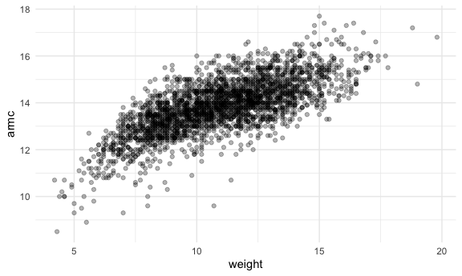
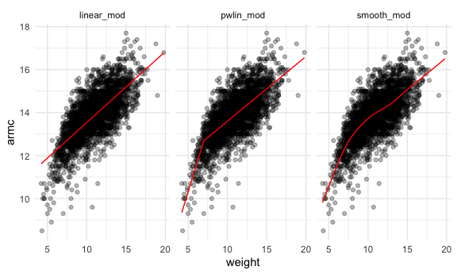
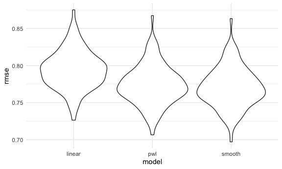

Cross Validaton
================

``` r
library(tidyverse)
```

    ## ── Attaching packages ─────────────────────────────────────── tidyverse 1.3.0 ──

    ## ✓ ggplot2 3.3.2     ✓ purrr   0.3.4
    ## ✓ tibble  3.0.3     ✓ dplyr   1.0.2
    ## ✓ tidyr   1.1.2     ✓ stringr 1.4.0
    ## ✓ readr   1.4.0     ✓ forcats 0.5.0

    ## ── Conflicts ────────────────────────────────────────── tidyverse_conflicts() ──
    ## x dplyr::filter() masks stats::filter()
    ## x dplyr::lag()    masks stats::lag()

``` r
library(modelr)
library(mgcv)
```

    ## Loading required package: nlme

    ## 
    ## Attaching package: 'nlme'

    ## The following object is masked from 'package:dplyr':
    ## 
    ##     collapse

    ## This is mgcv 1.8-33. For overview type 'help("mgcv-package")'.

``` r
library(p8105.datasets)

knitr::opts_chunk$set(
  fig.width = 6,
  fig.asp = .6,
  out.width = "90%"
)

theme_set(theme_minimal() + theme(legend.position = "bottom"))
options(
  ggplot2.continuous.colour = "viridis",
  ggplot2.continuous.fill = "viridis"
)
scale_colour_discrete = scale_color_viridis_d
scale_fill_discrete = scale_fill_viridis_d

set.seed(1)
```

## Simulate data

``` r
nonlin_df = 
  tibble(
    id = 1:100,
    x = runif(100, 0, 1),
    y = 1 - 10 * (x - .3) ^ 2 + rnorm(100, 0, .3)
  )
```

Look at the data

``` r
nonlin_df %>% 
  ggplot(aes(x=x, y=y))+
  geom_point()
```


## Cross validation–by hand

Get training and testing datasets

``` r
train_df= sample_n(nonlin_df, size=80)

test_df=anti_join(nonlin_df, train_df, by="id")
```

Fit three models

``` r
linear_mod=lm(y~x, data=train_df)
smooth_mod=gam(y~ s(x), data=train_df)
wiggly_mod=gam (y~ s(x, k=30), sp=10e-6, data=train_df)
```

can i see what i just did..

``` r
train_df %>% 
  add_predictions(linear_mod) %>% 
  ggplot(aes(x=x, y=y))+
  geom_point ()+
  geom_line(aes(y=pred), color="red")
```


``` r
train_df %>% 
  add_predictions(smooth_mod) %>% 
  ggplot(aes(x=x, y=y))+
  geom_point ()+
  geom_line(aes(y=pred), color="red")
```


``` r
train_df %>% 
  add_predictions(wiggly_mod) %>% 
  ggplot(aes(x=x, y=y))+
  geom_point ()+
  geom_line(aes(y=pred), color="red")
```


Gather models

``` r
train_df %>% 
  gather_predictions(wiggly_mod, smooth_mod, wiggly_mod) %>% 
  ggplot(aes(x=x, y=y))+
  geom_point ()+
  geom_line(aes(y=pred), color="red")+
  facet_grid(. ~ model)
```


Look at prediction accuracy

``` r
rmse(linear_mod, test_df)
```

    ## [1] 0.7052956

``` r
rmse(wiggly_mod, test_df)
```

    ## [1] 0.289051

``` r
rmse(smooth_mod, test_df)
```

    ## [1] 0.2221774

## Cross validation using `modelr`

``` r
cv_df=
  crossv_mc(nonlin_df, 100)
```

What is happening here…

``` r
cv_df %>% pull(train) %>% .[[1]] %>% as_tibble()
```

    ## # A tibble: 79 x 3
    ##       id      x       y
    ##    <int>  <dbl>   <dbl>
    ##  1     1 0.266   1.11  
    ##  2     2 0.372   0.764 
    ##  3     3 0.573   0.358 
    ##  4     4 0.908  -3.04  
    ##  5     6 0.898  -1.99  
    ##  6     7 0.945  -3.27  
    ##  7     8 0.661  -0.615 
    ##  8     9 0.629   0.0878
    ##  9    10 0.0618  0.392 
    ## 10    11 0.206   1.63  
    ## # … with 69 more rows

``` r
cv_df %>% pull(test) %>% .[[1]] %>% as_tibble()
```

    ## # A tibble: 21 x 3
    ##       id      x      y
    ##    <int>  <dbl>  <dbl>
    ##  1     5 0.202   1.33 
    ##  2    12 0.177   0.836
    ##  3    19 0.380   0.982
    ##  4    22 0.212   0.710
    ##  5    28 0.382   0.932
    ##  6    31 0.482   0.498
    ##  7    37 0.794  -1.12 
    ##  8    42 0.647   0.158
    ##  9    47 0.0233 -0.148
    ## 10    56 0.0995  1.13 
    ## # … with 11 more rows

``` r
cv_df=
  cv_df %>% 
  mutate(
    train=map(train, as_tibble),
    test= map(test, as_tibble)
  )
```

Let’s try to fit models and get RMSEs for them

``` r
cv_df=
cv_df %>% 
  mutate(
    linear_mod=map(.x=train, ~lm(y~x, data=.x)),
    smooth_mod=map(.x=train, ~gam(y~s(x), data=.x)),
    wiggly_mod= map(.x=train, ~gam(y~s(x,k=30), sp=10e-6,data=.x))
  ) %>% 
  mutate(
    rmse_linear= map2_dbl(.x=linear_mod, .y=test, ~rmse(model= .x, data=.y)),
    rmse_smooth= map2_dbl(.x=smooth_mod, .y=test, ~rmse(model= .x, data=.y)),
    rmse_wiggly= map2_dbl(.x=wiggly_mod, .y=test, ~rmse(model= .x, data=.y))
  )
```

What do these results say about the model

Compute averages..

``` r
cv_df %>% 
  select(starts_with("rmse")) %>% 
  pivot_longer(
    everything(),
    names_to="model",
    values_to="rsme",
    names_prefix="rsme_"
  ) %>% 
  group_by(model) %>% 
  summarize(avg_rmse=mean(rmse))
```

    ## Warning in mean.default(rmse): argument is not numeric or logical: returning NA
    
    ## Warning in mean.default(rmse): argument is not numeric or logical: returning NA
    
    ## Warning in mean.default(rmse): argument is not numeric or logical: returning NA

    ## `summarise()` ungrouping output (override with `.groups` argument)

    ## # A tibble: 3 x 2
    ##   model       avg_rmse
    ##   <chr>          <dbl>
    ## 1 rmse_linear       NA
    ## 2 rmse_smooth       NA
    ## 3 rmse_wiggly       NA

\#\#Try on a real dataset

import my data

``` r
child_growth_df = 
  read_csv("./data/nepalese_children.csv") %>% 
  mutate(
    weight_cp=(weight>7)*(weight-7)
  )
```

    ## 
    ## ── Column specification ────────────────────────────────────────────────────────
    ## cols(
    ##   age = col_double(),
    ##   sex = col_double(),
    ##   weight = col_double(),
    ##   height = col_double(),
    ##   armc = col_double()
    ## )

weight vs arm circumference

``` r
child_growth_df %>% 
  ggplot(aes(x=weight, y=armc))+
  geom_point(alpha=.3)
```



Fit the models

``` r
linear_mod= lm(armc~weight, data=child_growth_df)
pwlin_mod= lm(armc~weight+weight_cp, data=child_growth_df)
smooth_mod= gam(armc~ s(weight), data=child_growth_df)
```

``` r
child_growth_df %>% 
  gather_predictions(linear_mod, pwlin_mod, smooth_mod) %>% 
  ggplot(aes(x=weight, y=armc))+
  geom_point(alpha=.3) +
  geom_line(aes(y=pred), color="red")+
  facet_grid(.~model)
```



Try to understand model fit using CV.

``` r
cv_df=
  crossv_mc(child_growth_df, 100) %>% 
  mutate(
    train=map(train, as_tibble),
    test= map(test, as_tibble)
  )
```

``` r
cv_df = 
  cv_df %>% 
  mutate(
    linear_mod  = map(train, ~lm(armc ~ weight, data = .x)),
    pwl_mod     = map(train, ~lm(armc ~ weight + weight_cp, data = .x)),
    smooth_mod  = map(train, ~gam(armc ~ s(weight), data = as_tibble(.x)))) %>% 
  mutate(
    rmse_linear = map2_dbl(linear_mod, test, ~rmse(model = .x, data = .y)),
    rmse_pwl    = map2_dbl(pwl_mod, test, ~rmse(model = .x, data = .y)),
    rmse_smooth = map2_dbl(smooth_mod, test, ~rmse(model = .x, data = .y)))
```

Plot the distribution Error

``` r
cv_df %>% 
  select(starts_with("rmse")) %>% 
  pivot_longer(
    everything(),
    names_to = "model", 
    values_to = "rmse",
    names_prefix = "rmse_") %>% 
  mutate(model = fct_inorder(model)) %>% 
  ggplot(aes(x = model, y = rmse)) + geom_violin()
```


