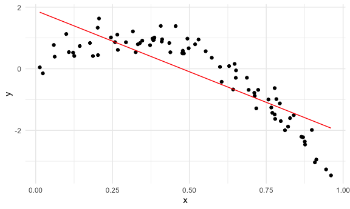

cross\_validaton
================

``` r
library(tidyverse)
```

    ## ── Attaching packages ─────────────────────────────────────── tidyverse 1.3.0 ──

    ## ✓ ggplot2 3.3.2     ✓ purrr   0.3.4
    ## ✓ tibble  3.0.3     ✓ dplyr   1.0.2
    ## ✓ tidyr   1.1.2     ✓ stringr 1.4.0
    ## ✓ readr   1.4.0     ✓ forcats 0.5.0

    ## ── Conflicts ────────────────────────────────────────── tidyverse_conflicts() ──
    ## x dplyr::filter() masks stats::filter()
    ## x dplyr::lag()    masks stats::lag()

``` r
library(modelr)
library(mgcv)
```

    ## Loading required package: nlme

    ## 
    ## Attaching package: 'nlme'

    ## The following object is masked from 'package:dplyr':
    ## 
    ##     collapse

    ## This is mgcv 1.8-33. For overview type 'help("mgcv-package")'.

``` r
library(p8105.datasets)

knitr::opts_chunk$set(
  fig.width = 6,
  fig.asp = .6,
  out.width = "90%"
)

theme_set(theme_minimal() + theme(legend.position = "bottom"))
options(
  ggplot2.continuous.colour = "viridis",
  ggplot2.continuous.fill = "viridis"
)
scale_colour_discrete = scale_color_viridis_d
scale_fill_discrete = scale_fill_viridis_d

set.seed(1)
```

## Simulate data

``` r
nonlin_df = 
  tibble(
    id = 1:100,
    x = runif(100, 0, 1),
    y = 1 - 10 * (x - .3) ^ 2 + rnorm(100, 0, .3)
  )
```

Look at the data

``` r
nonlin_df %>% 
  ggplot(aes(x=x, y=y))+
  geom_point()
```


## Cross validation–by hand

Get training and testing datasets

``` r
train_df= sample_n(nonlin_df, size=80)

test_df=anti_join(nonlin_df, train_df, by="id")
```

Fit three models

``` r
linear_mod=lm(y~x, data=train_df)
smooth_mod=gam(y~ s(x), data=train_df)
wiggly_mod=gam (y~ s(x, k=30), sp=10e-6, data=train_df)
```

can i see what i just did..

``` r
train_df %>% 
  add_predictions(linear_mod) %>% 
  ggplot(aes(x=x, y=y))+
  geom_point ()+
  geom_line(aes(y=pred), color="red")
```



``` r
train_df %>% 
  add_predictions(smooth_mod) %>% 
  ggplot(aes(x=x, y=y))+
  geom_point ()+
  geom_line(aes(y=pred), color="red")
```


``` r
train_df %>% 
  add_predictions(wiggly_mod) %>% 
  ggplot(aes(x=x, y=y))+
  geom_point ()+
  geom_line(aes(y=pred), color="red")
```


Gather models

``` r
train_df %>% 
  gather_predictions(wiggly_mod, smooth_mod, wiggly_mod) %>% 
  ggplot(aes(x=x, y=y))+
  geom_point ()+
  geom_line(aes(y=pred), color="red")+
  facet_grid(. ~ model)
```


Look at prediction accuracy

``` r
rmse(linear_mod, test_df)
```

    ## [1] 0.7052956

``` r
rmse(wiggly_mod, test_df)
```

    ## [1] 0.289051

``` r
rmse(smooth_mod, test_df)
```

    ## [1] 0.2221774
