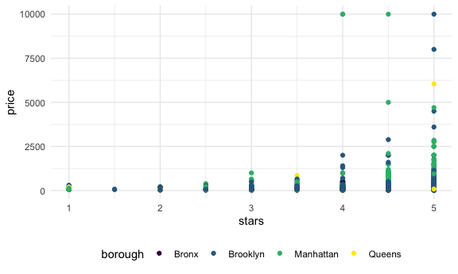
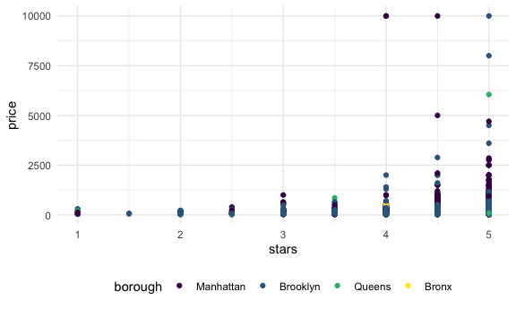

Linear models
================

## Import data

``` r
data("nyc_airbnb")
nyc_airbnb = 
  nyc_airbnb %>% 
  mutate(stars = review_scores_location / 2) %>% 
  rename(
    borough = neighbourhood_group,
    neighborhood = neighbourhood) %>% 
  filter(borough != "Staten Island") %>% 
  select(price, stars, borough, neighborhood, room_type)
```

## Fit a model

``` r
nyc_airbnb %>% 
  ggplot(aes(x=stars, y=price, color=borough))+ geom_point()
```

    ## Warning: Removed 9962 rows containing missing values (geom_point).



Let’s fit a model we care about

``` r
fit=lm(price~stars +borough, data=nyc_airbnb)
```

Let’s look at the results…

``` r
fit
```

    ## 
    ## Call:
    ## lm(formula = price ~ stars + borough, data = nyc_airbnb)
    ## 
    ## Coefficients:
    ##      (Intercept)             stars   boroughBrooklyn  boroughManhattan  
    ##           -70.41             31.99             40.50             90.25  
    ##    boroughQueens  
    ##            13.21

``` r
summary(fit)
```

    ## 
    ## Call:
    ## lm(formula = price ~ stars + borough, data = nyc_airbnb)
    ## 
    ## Residuals:
    ##    Min     1Q Median     3Q    Max 
    ## -169.8  -64.0  -29.0   20.2 9870.0 
    ## 
    ## Coefficients:
    ##                  Estimate Std. Error t value Pr(>|t|)    
    ## (Intercept)       -70.414     14.021  -5.022 5.14e-07 ***
    ## stars              31.990      2.527  12.657  < 2e-16 ***
    ## boroughBrooklyn    40.500      8.559   4.732 2.23e-06 ***
    ## boroughManhattan   90.254      8.567  10.534  < 2e-16 ***
    ## boroughQueens      13.206      9.065   1.457    0.145    
    ## ---
    ## Signif. codes:  0 '***' 0.001 '**' 0.01 '*' 0.05 '.' 0.1 ' ' 1
    ## 
    ## Residual standard error: 181.5 on 30525 degrees of freedom
    ##   (9962 observations deleted due to missingness)
    ## Multiple R-squared:  0.03423,    Adjusted R-squared:  0.03411 
    ## F-statistic: 270.5 on 4 and 30525 DF,  p-value: < 2.2e-16

``` r
summary(fit)$coef
```

    ##                   Estimate Std. Error   t value     Pr(>|t|)
    ## (Intercept)      -70.41446  14.020697 -5.022180 5.137589e-07
    ## stars             31.98989   2.527500 12.656733 1.269392e-36
    ## boroughBrooklyn   40.50030   8.558724  4.732049 2.232595e-06
    ## boroughManhattan  90.25393   8.567490 10.534465 6.638618e-26
    ## boroughQueens     13.20617   9.064879  1.456850 1.451682e-01

``` r
coef(fit)
```

    ##      (Intercept)            stars  boroughBrooklyn boroughManhattan 
    ##        -70.41446         31.98989         40.50030         90.25393 
    ##    boroughQueens 
    ##         13.20617

``` r
residuals(fit)
```

    ##             1             4             5             6             7 
    ##    9.46501900   35.46501900  -20.53498100   35.46501900   -4.53498100 
    ##             8             9            10            11            12 
    ##  -34.54003656    5.46501900   51.45996344   11.45996344   -4.53498100 
    ##            13            14            15            16            17 
    ##   56.45996344  -28.54003656  -51.53498100  -28.54003656  -23.54003656 
    ##            20            21            22            23            24 
    ##   -8.54509212   36.45996344   64.44479675  -28.54003656   76.45996344 
    ##            25            26            27            28            29 
    ##  -31.54003656  -35.54003656  -23.54003656  -27.54003656  -14.54509212 
    ##            30            33            38            39            40 
    ##  -28.54003656  -36.74620263   22.25885294    8.24874181    3.25379737 
    ##            41            42            43            44            46 
    ##  138.25379737   -3.74114706   -2.74114706   57.25885294    2.25885294 
    ##            48            52            55            57            58 
    ##  -57.74114706  -26.74620263  -62.74114706  -37.74114706  -37.74114706 
    ##            59            60            61            62            63 
    ##  -36.74620263  -36.74620263  -51.74620263   13.25379737  -22.74114706 
    ##            65            66            68            69            71 
    ##    8.25379737  149.25885294  -62.74114706  -62.74114706   -7.74114706 
    ##            72            74            75            76            78 
    ##  -47.74114706   23.25885294  -37.74114706  -14.75631375   32.25885294 
    ##            79            84            86            87            88 
    ##  -46.74620263  -17.74620263    2.25379737   -2.74114706   72.25379737 
    ##            90            91            92            93            94 
    ##   -5.74114706  -50.74114706  -52.74114706  -64.74620263   -3.74114706 
    ##            95            96            97            99           100 
    ##  -19.74620263  -77.74114706   -2.74114706   31.25885294  -32.74114706 
    ##           101           103           105           108           109 
    ##  -21.74620263  -12.74114706  147.25885294  -21.74620263   75.25885294 
    ##           111           112           114           115           116 
    ##  -37.74114706  -23.74114706   97.25885294  -52.74114706  -31.74620263 
    ##           117           118           119           121           123 
    ##  -46.74114706   85.25885294   13.25379737  -31.74620263  -52.74114706 
    ##           124           125           127           129           132 
    ##  -36.74620263  -22.74114706  -37.74114706   26.25379737  -26.74620263 
    ##           134           135           136           137           138 
    ##    7.25885294   17.25885294  -18.74114706  -67.74114706  -57.74114706 
    ##           140           141           144           148           149 
    ##   22.25885294  -36.74620263  122.25885294  -17.74620263   27.25885294 
    ##           150           151           152           153           154 
    ##   17.25885294  -52.74114706   -6.74620263  -16.74620263  -66.74114706 
    ##           155           156           157           158           159 
    ##   50.25379737   27.25885294  -44.74620263   23.25885294   -1.74620263 
    ##           161           162           163           164           165 
    ##  -11.74620263  -32.74114706  -32.74114706   63.25379737  -17.74114706 
    ##           166           168           169           171           172 
    ##  123.25379737  -36.74620263   -3.74114706   -2.74114706   -8.74114706 
    ##           173           174           175           176           177 
    ##   17.25885294    4.25885294   22.25885294   22.25885294    3.25379737 
    ##           178           179           182           184           185 
    ##  -16.74620263   12.25885294   -2.74114706   -3.74114706  -22.74114706 
    ##           186           187           188           190           191 
    ##  112.25379737  -43.74114706  -27.74114706  -37.74114706   96.25885294 
    ##           192           193           194           196           197 
    ##   13.25379737  -11.74114706    2.25379737   12.25885294   -6.74620263 
    ##           198           200           201           202           203 
    ##  -68.74114706  -24.74114706  -57.74114706   -2.74114706  -17.74114706 
    ##           204           205           207           208           209 
    ##  -18.74620263  287.25885294   17.25885294  -42.74114706    7.25885294 
    ##           210           211           212           213           214 
    ##  -47.74114706  -41.74620263  -57.74114706  -47.74114706   28.25379737 
    ##           215           216           218           219           220 
    ##   -2.74114706   -2.74114706  107.25885294   12.25885294   22.25885294 
    ##           221           223           224           226           227 
    ##  102.25885294   -2.74114706   17.25885294   -7.74114706  -42.74114706 
    ##           228           229           231           232           233 
    ##  -27.74114706  -47.74114706  -37.74114706    8.25379737  -36.74620263 
    ##           237           238           239           240           241 
    ##   37.25885294   78.25885294  -46.74620263  -26.74620263   -3.74620263 
    ##           242           243           244           245           247 
    ##  -41.74620263  -43.74114706  196.25885294   29.24874181  -37.74114706 
    ##           248           249           250           251           252 
    ##   47.25885294  -52.74114706  -57.74114706   -7.74114706  -41.74620263 
    ##           253           254           257           258           260 
    ##    5.25885294  -44.74114706  -32.74114706   93.25379737  -22.74114706 
    ##           261           262           263           264           265 
    ##  -18.75125819  -27.74114706  -17.74114706  -32.74620263    7.25885294 
    ##           266           267           268           269           270 
    ##  -42.74114706   -7.74114706  -41.74620263  -34.74620263   12.25379737 
    ##           271           272           274           275           276 
    ##  -17.74114706   -2.74114706   66.25379737   79.24874181  -57.74114706 
    ##           277           278           280           281           284 
    ##  -45.74620263  -17.74114706   -7.74114706  -11.74620263   -2.74114706 
    ##           285           286           288           289           290 
    ##   88.25379737  -46.74620263   45.24368625   13.25379737   77.25885294 
    ##           291           293           294           298           302 
    ##   53.25379737   34.24368625  122.25885294    9.25885294   23.25379737 
    ##           303           304           306           307           308 
    ##  -32.74114706  -31.74620263   47.25885294  -26.74620263  -64.74114706 
    ##           313           314           315           316           317 
    ##  -14.53498100  -45.54003656  -38.54003656  -44.53498100   -3.54003656 
    ##           320           321           322           324           326 
    ##  -31.74620263   11.25379737  -37.74114706   23.25379737  -17.74114706 
    ##           327           328           329           330           331 
    ##  -41.74620263  -21.74620263   75.21840843  -21.74620263    0.25379737 
    ##           332           333           334           335           336 
    ##  -31.74620263  114.24874181  -51.74620263  -23.74114706  -36.74620263 
    ##           338           339           340           341           342 
    ##   -7.74620263  248.25379737   38.25379737   -0.75125819   -2.74620263 
    ##           343           344           345           346           347 
    ##  -25.75125819  -21.74620263   62.23357512   12.25379737   28.24874181 
    ##           348           349           353           355           356 
    ##    9.44479675  -13.54003656  -38.54003656   26.45996344    2.45490788 
    ##           357           359           360           361           362 
    ##  -44.53498100  -55.53498100   42.45490788   -8.54003656   -3.54003656 
    ##           363           364           366           367           368 
    ##   -2.54509212   -8.54003656   -8.54003656  -27.53498100  -24.53498100 
    ##           369           370           371           374           375 
    ##  -17.54509212   13.25379737  -57.74114706  297.25885294  196.25885294 
    ##           377           378           379           380           381 
    ##   77.25885294  163.25379737   -7.74114706  -33.74114706  -56.74620263 
    ##           382           383           385           387           388 
    ##   18.25379737  -43.74114706   63.25379737    8.25379737  -31.74620263 
    ##           389           391           392           393           394 
    ##   23.25379737  -60.74114706  -61.74620263  -56.74620263  -56.74620263 
    ##           395           396           397           398           400 
    ##    8.25379737   -8.76136931  -22.74114706   -1.74114706  -47.74114706 
    ##           401           402           403           405           406 
    ##  347.25885294  -50.75125819  -56.74620263  -56.74620263  -72.74114706 
    ##           407           408           409           410           411 
    ##  -72.74114706   -2.74114706  -56.74620263  -35.75125819   57.25885294 
    ##           413           414           415           416           417 
    ##   -6.74620263   -7.74114706   77.25885294   21.24874181  -56.74620263 
    ##           418           419           420           421           422 
    ##  -77.74114706   -1.74620263  -56.74620263  -22.74114706  -66.74620263 
    ##           423           424           425           426           427 
    ##  -12.74114706   88.25379737   97.25885294  213.25379737  -42.74114706 
    ##           428           429           430           431           432 
    ##  -56.74620263  -56.74620263  -53.74114706  -17.74620263   47.25885294 
    ##           433           434           435           436           437 
    ##  -42.74114706    0.25379737  -56.74620263  -51.74620263  -33.74114706 
    ##           439           440           441           442           443 
    ##  -27.74114706   73.25379737  -72.74114706  -41.74620263  -56.74620263 
    ##           444           445           447           452           453 
    ##  113.25379737   17.25885294   -3.74114706  -36.75125819   17.25885294 
    ##           455           456           457           458           459 
    ##  -67.74114706  -12.74114706  131.25379737  -29.74620263  -33.74620263 
    ##           460           461           463           464           467 
    ##   22.25379737  -52.74114706  247.25885294   13.25379737  -47.74114706 
    ##           469           470           471           472           474 
    ##  135.25379737  -42.74114706  -15.74114706  -24.75125819   -1.74620263 
    ##           476           478           479           480           481 
    ##  -12.74114706  -45.74114706  -31.74620263   82.25885294  -43.74114706 
    ##           482           483           484           485           486 
    ##  -11.75125819   17.25885294  -21.74620263   -6.74620263  -46.74620263 
    ##           487           488           489           490           491 
    ##  -51.74620263   98.25379737  -57.74114706  -27.74114706   32.25885294 
    ##           492           493           495           496           497 
    ##   -2.74114706  -67.74114706  -36.74620263  -26.74620263   47.25885294 
    ##           499           501           502           503           504 
    ##  -27.74114706   57.25885294  -37.74114706  -28.74620263  -21.74620263 
    ##           505           506           507           510           514 
    ##   -7.74620263    7.25885294  -39.74114706  -16.74620263  -41.74620263 
    ##           515           517           518           520           521 
    ##    7.25885294  -33.74114706  -12.74114706   86.25885294   -1.74620263 
    ##           525           526           527           528           531 
    ##   -7.74114706    8.25379737   61.25885294   17.25885294  -33.74114706 
    ##           532           533           535           536           537 
    ##   83.25885294  -17.74114706    2.25885294  -43.74114706   47.25885294 
    ##           538           539           540           541           542 
    ##  -50.74114706   12.25379737    3.25379737  -23.74114706    2.25379737 
    ##           543           544           545           546           548 
    ##  -39.74620263   -2.74114706   47.25885294  -62.74114706   43.25379737 
    ##           549           550           551           552           553 
    ##   32.25885294   -3.74114706    9.24874181  -17.74114706   47.25885294 
    ##           554           556           557           558           561 
    ##   23.25379737   -2.74114706  -32.74114706  -46.74620263  -39.74114706 
    ##           563           564           566           568           569 
    ##  -52.74114706  -27.74114706  -16.74620263   -5.75125819  -22.74114706 
    ##           570           571           572           573           574 
    ##  -27.74620263   77.25885294  -57.74114706   33.25379737  -27.74114706 
    ##           575           576           578           580           581 
    ##  -30.74114706   40.24368625  -27.74114706  -37.74620263  -10.75125819 
    ##           583           584           586           587           588 
    ##  -22.74114706   63.25379737  197.25885294  -23.74114706  -48.74620263 
    ##           589           590           591           592           593 
    ##   48.25379737  -54.74114706  -36.74114706  -12.74114706   -7.74114706 
    ##           594           595           596           597           598 
    ##    2.25885294  -37.74620263   82.25885294  -57.74114706  -16.74114706 
    ##           600           602           603           605           606 
    ##   10.25885294   21.23863069  -32.75125819  -12.74114706   77.25885294 
    ##           607           608           609           610           612 
    ##  -41.74620263   -2.74114706   28.25379737  -21.74114706  -40.74114706 
    ##           613           614           616           617           618 
    ##   13.25379737  -26.74620263  -12.74114706  -49.74114706  147.25885294 
    ##           619           620           621           622           625 
    ##  -44.74114706   18.25379737   67.25885294  241.23863069  -32.74114706 
    ##           626           627           628           629           630 
    ##   38.22851956  -41.74620263   -2.74114706   12.25379737  -67.74114706 
    ##           631           632           633           635           637 
    ##  -42.74620263    2.25885294  -16.74620263  -47.74114706  -37.74620263 
    ##           638           639           640           641           642 
    ##   57.25885294  -41.74620263  -52.74114706   48.25379737   -2.74114706 
    ##           643           644           646           647           648 
    ##   12.25885294  -26.74620263   28.25379737  -16.74114706  -17.74114706 
    ##           649           650           651           652           653 
    ##  -26.74114706  -36.74620263   23.25379737   44.24874181   -3.74620263 
    ##           654           655           659           661           662 
    ##  -15.74114706  136.25885294   22.25885294   57.25885294  -62.74114706 
    ##           664           665           667           669           670 
    ##  -64.74114706   43.25379737  -41.74114706  -21.74620263  -37.74114706 
    ##           671           672           673           675           679 
    ##   -1.74620263  -37.74114706   -7.74114706  -36.74620263  -31.74620263 
    ##           680           682           683           684           685 
    ##  -31.74620263   79.24874181  -52.74114706  -21.74620263   63.25379737 
    ##           686           687           688           689           690 
    ##   -1.74620263  -42.74114706  -27.74620263  -51.74620263   78.25379737 
    ##           691           692           693           694           695 
    ##   72.25885294  -26.74620263  -32.74114706  -11.74620263  -17.74114706 
    ##           696           697           698           699           701 
    ##  -42.74114706   22.25885294  -16.74620263  -36.74620263   -6.74620263 
    ##           702           703           704           705           706 
    ##   76.25885294   52.25885294   -7.74620263  -41.74620263   16.25885294 
    ##           707           709           711           712           713 
    ##  -37.74620263   -6.74620263  -32.74114706   33.25379737   47.25885294 
    ##           714           715           716           718           719 
    ##  -62.74114706   12.25379737  -12.74114706  -17.74114706   32.25379737 
    ##           720           721           722           724           725 
    ##  -10.75125819   73.25379737    3.25379737  -37.74114706  -24.74114706 
    ##           726           728           729           732           733 
    ##  172.25885294  -42.74114706  -51.74620263   -2.74114706   22.25885294 
    ##           734           735           736           737           738 
    ##  -27.74114706   12.25885294   88.25379737  -27.74114706   17.25885294 
    ##           742           743           745           747           749 
    ##  -12.74114706  -29.74620263    5.25885294  -43.74114706   -7.74114706 
    ##           750           751           753           755           756 
    ##  -26.74620263   14.25885294  -12.74114706  -32.74114706   47.25885294 
    ##           758           760           761           762           763 
    ##  413.25379737  -52.74114706   51.22851956  -36.74620263  -13.74114706 
    ##           765           766           768           770           771 
    ##   -1.74620263  -22.74114706   -4.74114706   32.25885294   88.25379737 
    ##           772           774           776           777           778 
    ##  -47.74114706  -57.74114706  -56.74114706  -37.74620263   49.24874181 
    ##           779           780           781           783           784 
    ##  -39.74114706   13.25379737   47.25885294  -32.74114706   16.25885294 
    ##           785           786           787           789           790 
    ##  -27.74114706  -62.74114706  -62.74114706  -41.74620263  -36.74620263 
    ##           791           792           795           796           797 
    ##    9.25379737   -7.74114706  -53.74114706   48.25379737   62.25379737 
    ##           798           801           802           805           806 
    ##   17.25885294   22.25379737  -52.74114706  -32.74114706  -72.74114706 
    ##           808           809           810           812           813 
    ##  -57.74114706  -26.74620263  -17.74620263  -43.74114706  -20.74114706 
    ##           814           815           816           817           818 
    ##    4.24874181  186.25885294  111.25379737  108.25379737  -66.74620263 
    ##           820           821           822           824           826 
    ##  -53.74114706  -37.74114706   -2.74114706  -32.74114706  -25.74114706 
    ##           827           830           832           833           834 
    ##   37.25885294  -62.74114706  -36.74620263  -43.74114706   23.25379737 
    ##           838           839           840           843           846 
    ##   54.24874181  -21.74620263   77.25885294  -26.74620263  -48.74620263 
    ##           847           849           850           851           852 
    ##   63.25379737   -6.74620263   38.25379737    8.25379737  -47.74114706 
    ##           853           854           855           856           857 
    ##  -45.74114706   37.25885294  112.25885294  -12.74114706  -31.74620263 
    ##           859           861           863           864           865 
    ##  -29.74620263  -52.74114706   28.24874181   27.25885294  -22.74114706 
    ##           866           867           868           869           871 
    ##   12.25379737   27.25885294  -16.74620263  -61.74114706   43.25379737 
    ##           872           873           874           875           878 
    ##   83.25379737  -32.74114706  -47.74114706  -11.74620263  -42.74114706 
    ##           879           881           882           883           884 
    ##   32.25885294  -46.74620263   86.25885294  -27.74114706  -42.74114706 
    ##           886           887           888           889           890 
    ##  -42.74114706  -25.74114706  218.22851956  -42.74114706  -57.74114706 
    ##           892           893           894           896           897 
    ##  -25.74620263  -42.74114706   77.25885294  -36.74620263  136.25885294 
    ##           898           899           900           901           902 
    ##   46.25885294  -40.74620263   -3.74114706   14.24874181  429.24874181 
    ##           903           904           905           906           907 
    ##  -27.74114706  -16.74620263  -55.74114706   11.25885294   -1.74620263 
    ##           908           909           910           911           912 
    ##  140.25379737   -7.74114706  -37.74620263   -2.74114706  -41.74620263 
    ##           913           914           918           923           925 
    ##  -22.74114706   14.25379737   12.25379737   85.25379737   17.25885294 
    ##           926           928           929           931           933 
    ##    7.25885294  -47.74114706    8.25379737  -32.74114706   22.25885294 
    ##           934           935           936           937           938 
    ##  -27.74114706   -2.74114706  -37.74114706    7.25379737  -26.74620263 
    ##           939           940           942           944           945 
    ##   27.25885294  -22.74114706  347.25885294   32.25885294    6.25885294 
    ##           946           947           948           949           950 
    ##   12.25379737   63.25379737  -25.75125819   19.25885294  -50.74114706 
    ##           953           954           955           957           958 
    ##  -61.74114706   97.25885294  -27.74114706  -17.74114706  -12.74114706 
    ##           959           961           962           963           964 
    ##   22.25885294  -46.74114706  -37.74114706   13.25379737   62.25885294 
    ##           965           966           967           969           970 
    ##  -28.74114706   38.25379737  -37.74620263  -48.74620263   32.25885294 
    ##           971           973           974           976           977 
    ##  -63.74114706   -7.74114706   -2.74114706   42.25379737   40.23863069 
    ##           978           979           980           981           982 
    ##  -37.74114706   97.25885294  -17.74114706  -27.74114706   27.25885294 
    ##           984           985           987           988           990 
    ##  -21.74620263   21.25379737  -27.74620263  -57.74114706    7.25885294 
    ##           991           992           993           995           996 
    ##  -10.75125819  -37.74114706  128.24874181  172.25885294   -2.74114706 
    ##           997           998           999          1000          1001 
    ##   -7.74114706   19.25885294  -40.74114706  -13.74114706   47.25885294 
    ##          1002          1004          1005          1006          1007 
    ##  -41.74620263   49.24874181  -27.74620263  197.25885294   97.25885294 
    ##          1008          1009          1010          1011          1013 
    ##   60.24368625  -28.74620263    8.25379737    3.25379737  -12.74114706 
    ##          1014          1015          1018          1019          1020 
    ##  -46.74114706   27.25885294    3.25379737  -37.74114706  -42.74114706 
    ##          1022          1023          1024          1025          1026 
    ##  -37.74620263   26.25885294   63.25379737   -6.74620263   17.25885294 
    ##          1029          1030          1031          1032          1033 
    ##   22.25885294  -37.74620263   53.25379737   -7.74114706  -47.74114706 
    ##          1034          1036          1037          1038          1039 
    ##  -32.74114706  -26.74620263   -7.74114706  -21.74620263  -36.74620263 
    ##          1042          1043          1044          1046          1047 
    ##  308.25379737  -42.74114706  -42.74114706   65.25379737   12.25379737 
    ##          1049          1051          1052          1053          1054 
    ##  -32.74114706  -13.74114706  -22.74114706  -31.74620263  -22.74114706 
    ##          1057          1058          1059          1060          1062 
    ##  -27.74114706  -62.74114706   -6.74620263   43.25379737  -41.74620263 
    ##          1063          1064          1065          1066          1067 
    ##   -1.74620263  -44.74114706    7.25885294  -47.74114706   22.25885294 
    ##          1068          1070          1072          1073          1074 
    ##  -12.74114706  -17.74114706  -17.74114706  147.25885294  -42.74114706 
    ##          1075          1076          1077          1079          1080 
    ##  -47.74114706   -2.74114706  -44.74114706    7.25885294   43.25379737 
    ##          1081          1082          1083          1085          1087 
    ##  151.23863069  -27.74620263   63.25379737  -37.74620263  -32.74114706 
    ##          1088          1091          1092          1094          1095 
    ##   -2.74114706  -42.74114706   63.25379737  -32.74114706   43.25379737 
    ##          1097          1099          1101          1102          1103 
    ##   43.25379737   -3.74114706   13.25379737  -52.74114706    7.25885294 
    ##          1104          1105          1106          1108          1110 
    ##  147.25885294  -37.74620263   82.25885294   27.25885294   58.25379737 
    ##          1111          1112          1113          1114          1115 
    ##  -37.74114706  -32.74114706   37.25885294   23.25379737    7.25885294 
    ##          1117          1118          1119          1120          1121 
    ##   56.25885294   38.25379737  -57.74114706  -75.74114706   -7.74114706 
    ##          1123          1124          1125          1126          1127 
    ##  -43.74114706  -33.74114706  -22.74114706  -27.74620263   -7.74114706 
    ##          1130          1131          1132          1133          1137 
    ##  -26.74620263  -41.74620263   -7.74114706  -22.74114706   16.25885294 
    ##          1138          1139          1140          1142          1144 
    ##  795.24368625  -36.74620263   93.25379737  -47.74114706  -62.74114706 
    ##          1145          1146          1147          1149          1150 
    ##  -27.74114706   12.25379737  -13.74114706   13.25379737   -7.74114706 
    ##          1152          1155          1156          1157          1158 
    ##  -30.75125819   17.25885294   78.25379737   79.24874181  -57.74114706 
    ##          1159          1160          1161          1162          1163 
    ##  -23.74114706  -37.74620263  -35.74114706  172.25885294  -16.74620263 
    ##          1164          1166          1167          1168          1169 
    ##  -11.74620263  -27.74114706  -27.74114706  -47.74114706  -42.74114706 
    ##          1170          1173          1174          1175          1176 
    ##   -2.74114706   48.25379737  -31.74620263  -16.74620263   63.25379737 
    ##          1178          1179          1180          1181          1182 
    ##  -42.74114706  -31.74620263   47.25885294    4.25885294   17.25885294 
    ##          1184          1185          1186          1187          1188 
    ##   12.25379737  263.25379737    2.25885294  -31.74114706    7.25885294 
    ##          1189          1191          1192          1193          1194 
    ##    8.25379737   23.25379737  -47.74114706   77.25885294   64.24874181 
    ##          1197          1198          1199          1200          1202 
    ##    9.25885294  -42.74620263   59.24874181  -42.74114706   51.95460955 
    ##          1206          1207          1209          1210          1211 
    ##  -45.04033488  -29.04033488  -25.04033488   69.96472068  -60.03527932 
    ##          1213          1214          1215          1216          1217 
    ##  -37.74114706  -16.74620263   11.25379737   -3.74114706  212.25379737 
    ##          1218          1219          1220          1221          1222 
    ##  -44.74620263  -25.75125819   -2.74114706   41.25379737   22.25885294 
    ##          1223          1224          1226          1231          1232 
    ##  -54.74620263  -57.74114706  -48.74620263   13.25379737  -52.74114706 
    ##          1234          1235          1237          1238          1239 
    ##  -41.74620263   12.25379737  -48.74620263   -6.74620263  -57.74114706 
    ##          1240          1241          1242          1244          1245 
    ##   65.25885294  -41.74620263  -17.74114706   88.25379737  -52.74114706 
    ##          1246          1247          1248          1249          1250 
    ##  -56.74620263   97.25885294  -22.74114706  -40.74114706  -32.74114706 
    ##          1256          1257          1263          1264          1268 
    ##  -29.78890714    1.20603729  -79.78890714   45.21109286 -124.78890714 
    ##          1269          1270          1272          1273          1274 
    ##  119.21109286  -11.78890714  -68.79396271   45.21109286  -29.78890714 
    ##          1275          1282          1283          1285          1287 
    ##  -79.78890714   45.21109286   70.21109286  -91.78890714  -80.78890714 
    ##          1288          1289          1290          1291          1292 
    ##  -53.79396271   69.21109286  145.21109286   70.21109286  169.21109286 
    ##          1293          1294          1295          1296          1298 
    ##   -4.78890714  -73.79396271   59.21109286  170.21109286  -50.78890714 
    ##          1300          1301          1302          1305          1307 
    ##  110.21109286  270.21109286  161.20603729   75.21109286   35.21109286 
    ##          1309          1311          1313          1316          1319 
    ##  -88.78890714 -114.78890714  -29.78890714  -29.78890714  -74.04033488 
    ##          1320          1323          1324          1325          1326 
    ##   10.95966512   10.95966512  -30.03527932  -49.05550157   -2.03527932 
    ##          1328          1330          1332          1333          1334 
    ##  -30.03527932  -15.04033488  -39.04033488  -65.03527932  -85.03527932 
    ##          1336          1337          1338          1339          1341 
    ##  -93.03527932  -15.04033488  -65.03527932   -5.04033488  176.95460955 
    ##          1343          1346          1347          1348          1349 
    ##  -65.03527932  -55.03527932  -50.03527932  -60.04033488 -100.03527932 
    ##          1352          1353          1354          1355          1356 
    ##   72.95966512  -63.03527932 -108.03527932  -39.04033488    4.95966512 
    ##          1359          1360          1364          1366          1367 
    ##  -31.03527932    1.95966512  -35.03527932  -11.03527932  -65.03527932 
    ##          1368          1369          1370          1371          1372 
    ##  -81.03527932   18.96472068  -71.03527932  -49.04033488  -75.03527932 
    ##          1373          1375          1376          1377          1378 
    ##  -85.03527932  -97.03527932  -45.03527932   39.96472068    1.95966512 
    ##          1379          1380          1381          1382          1383 
    ## -101.03527932  -65.03527932   68.96472068  -97.03527932  685.95966512 
    ##          1384          1385          1387          1388          1389 
    ##  -50.03527932  -19.04033488  -64.04033488  -11.03527932  -64.04033488 
    ##          1391          1392          1393          1394          1395 
    ##  -13.04539045  -77.03527932  -31.03527932  -66.04033488  -85.03527932 
    ##          1396          1397          1398          1399          1403 
    ##  -57.03527932 -100.03527932  -30.03527932  -55.04033488  -65.04033488 
    ##          1404          1405          1406          1407          1409 
    ##  -90.03527932  -41.03527932  -55.03527932  -34.04033488   97.25379737 
    ##          1410          1411          1414          1415          1419 
    ##  -22.74114706  102.25379737    5.45996344    7.45490788   97.23357512 
    ##          1420          1421          1423          1424          1425 
    ##   15.24368625  -31.74620263  -21.74620263  -21.74620263  -17.74114706 
    ##          1428          1429          1430          1431          1432 
    ##  -10.04539045   64.93438730  -50.03527932  -45.03527932  -20.03527932 
    ##          1434          1435          1436          1437          1438 
    ##   -6.05550157  -71.03527932  -44.04033488   41.95460955  -16.05550157 
    ##          1440          1441          1442          1443          1446 
    ##  -13.04539045  -66.04539045   19.96472068  -75.03527932  -65.04033488 
    ##          1447          1448          1452          1453          1455 
    ##  -85.03527932  -37.05044601  -15.03527932  -19.04033488   78.95460955 
    ##          1456          1458          1460          1461          1462 
    ##  -59.04539045   39.96472068    0.95966512   85.95966512   20.95966512 
    ##          1463          1464          1465          1466          1467 
    ##   44.95966512   52.95460955  -75.03527932  -43.05044601  -62.04033488 
    ##          1468          1472          1474          1475          1476 
    ##  -55.04539045  -89.04033488  -49.04539045  -80.03527932    5.95966512 
    ##          1477          1478          1479          1482          1483 
    ##  -34.04033488   39.96472068  -55.03527932  -60.04539045   -8.04539045 
    ##          1484          1485          1486          1487          1488 
    ##  -59.04033488   49.96472068  -38.04539045  -54.04033488  101.95460955 
    ##          1490          1491          1492          1495          1496 
    ##  -56.04539045  -44.04033488   44.95966512   -9.04539045   48.96472068 
    ##          1497          1498          1500          1501          1503 
    ##   85.95966512   45.95966512  901.95460955  -38.04539045  -31.05550157 
    ##          1504          1505          1507          1508          1511 
    ##  -43.04539045  -50.03527932  -65.03527932   10.95966512  -12.04539045 
    ##          1514          1515          1516          1522          1523 
    ##  -60.03527932  -42.05044601  -45.03527932  -39.04033488  132.94955399 
    ##          1524          1526          1527          1528          1530 
    ##   -4.04033488   -8.04539045  -91.03527932  -60.03527932  -64.04033488 
    ##          1532          1533          1535          1538          1539 
    ##   82.95966512  -29.04033488  -17.05044601  -70.04033488   62.95966512 
    ##          1543          1544          1546          1547          1548 
    ##   65.95460955  -74.03527932  -18.04539045  -49.04033488  -58.04539045 
    ##          1549          1550          1551          1552          1553 
    ##  -17.05044601  -24.04033488   61.95460955   67.96472068  -54.04033488 
    ##          1554          1555          1556          1557          1558 
    ##   20.95966512  -10.04033488  -60.04033488   10.95966512   24.95966512 
    ##          1560          1561          1562          1563          1564 
    ##  -45.04033488   61.95460955   30.95966512    0.95966512  201.95460955 
    ##          1565          1566          1567          1568          1570 
    ##  -28.04539045 2771.95966512  -25.04033488  -33.04539045  -34.04033488 
    ##          1571          1572          1573          1574          1575 
    ##    5.95966512  -15.04033488   -9.04033488  -55.03527932  -34.04033488 
    ##          1576          1578          1579          1580          1582 
    ##  -60.03527932  -65.04033488  -44.04033488  -29.04033488  -40.04033488 
    ##          1585          1586          1587          1588          1589 
    ##  -72.04033488   85.95966512  -43.05044601   16.94955399   14.95966512 
    ##          1590          1591          1594          1595          1596 
    ##  -69.04033488  -66.04033488  -90.03527932   35.95966512  260.95966512 
    ##          1598          1600          1601          1602          1603 
    ##  -78.03527932  -64.04033488  -15.03527932   -8.04539045   -2.04033488 
    ##          1605          1606          1607          1609          1610 
    ##  -10.03527932  -65.03527932  -43.04539045   -2.06561270   50.95966512 
    ##          1612          1613          1614          1615          1617 
    ##   10.95966512  -22.03527932  -12.04033488  -29.04033488   35.95966512 
    ##          1618          1620          1621          1622          1625 
    ##  -45.03527932  -55.03527932  -31.04539045  -48.04539045  -25.04033488 
    ##          1629          1630          1631          1632          1634 
    ##  -69.04033488  -31.04539045  -19.04539045  -70.03527932  -28.04539045 
    ##          1635          1636          1637          1638          1639 
    ##   -5.04539045  -64.04033488   19.96472068  -20.04539045  -84.04033488 
    ##          1640          1641          1642          1643          1644 
    ##   24.95966512  -42.05044601   36.95460955  -39.04033488   -9.04033488 
    ##          1645          1647          1648          1649          1650 
    ##   45.95966512  -18.04539045  -31.04033488  -80.03527932  -10.03527932 
    ##          1651          1652          1653          1655          1657 
    ##  119.96472068  -29.04033488   -0.03527932  -38.04539045  135.95966512 
    ##          1658          1659          1661          1662          1663 
    ##    5.95966512  -54.04033488  -58.04539045  -54.04033488   10.95966512 
    ##          1664          1667          1668          1669          1672 
    ##  101.95460955  -64.04033488  -44.04033488   21.95460955    9.95966512 
    ##          1673          1675          1677          1678          1679 
    ##   34.96472068  -33.04033488  -84.04033488  -67.04539045  -24.04033488 
    ##          1680          1681          1682          1683          1684 
    ##  -55.03527932   10.95966512  -83.03527932   33.94449843  -43.04539045 
    ##          1685          1686          1687          1688          1689 
    ##   51.95460955   -4.04033488   36.95966512  -19.04539045   35.95966512 
    ##          1690          1691          1692          1693          1694 
    ##  -55.03527932   31.95460955   -8.04539045   51.95460955  105.95966512 
    ##          1695          1696          1697          1698          1699 
    ##  -55.04033488   -4.06561270  -80.03527932  269.96472068  -45.04033488 
    ##          1700          1702          1703          1704          1708 
    ##   29.96472068  -43.04539045  -61.04033488  -59.04033488  -69.04033488 
    ##          1709          1710          1712          1713          1715 
    ##    5.95966512   25.95966512  -13.04539045  -42.04539045  -67.04033488 
    ##          1716          1717          1718          1719          1720 
    ##  -33.04539045  -35.05550157   43.94449843  -35.04033488  -74.04033488 
    ##          1721          1722          1723          1725          1726 
    ##  -18.04539045  -61.03527932   -0.03527932  -82.04033488   19.96472068 
    ##          1728          1730          1731          1732          1734 
    ##    8.95460955  -90.03527932    8.96472068  -44.04033488   26.95460955 
    ##          1735          1737          1738          1739          1742 
    ## -100.03527932  -49.04033488  -91.03527932  -69.04033488  -68.04539045 
    ##          1745          1746          1747          1748          1749 
    ##  -55.03527932  -62.04539045  -75.03527932  -45.04033488  -13.04539045 
    ##          1750          1751          1753          1754          1756 
    ##   -0.03527932  -91.03527932  -80.03527932  -74.04033488   15.95966512 
    ##          1757          1758          1760          1761          1762 
    ##   15.95966512  -55.04033488  -75.03527932  -69.04033488  -28.04539045 
    ##          1763          1766          1768          1769          1770 
    ##   75.95966512  -38.04033488  135.95966512 -110.03527932  -35.04539045 
    ##          1777          1778          1780          1781          1782 
    ##  -75.03527932   51.95460955  185.95966512  -74.04033488  -44.04033488 
    ##          1783          1784          1785          1786          1787 
    ##  -34.04033488  -12.04539045  -44.04033488  -15.04033488   -9.04033488 
    ##          1788          1789          1793          1794          1795 
    ##  -44.04033488  -85.04033488   -9.04033488  185.95966512  -47.04539045 
    ##          1796          1797          1798          1799          1800 
    ##  -80.03527932  -93.03527932  -70.03527932  -56.04033488  -28.04539045 
    ##          1801          1802          1803          1804          1805 
    ##  -70.03527932  -49.04033488  -80.03527932  -26.05550157  -81.04033488 
    ##          1806          1807          1808          1810          1815 
    ##  -43.04033488   50.95966512  -52.04539045  -67.03527932  -40.03527932 
    ##          1817          1818          1819          1820          1822 
    ##   19.96472068    9.96472068  -39.04033488  -30.04539045   35.95966512 
    ##          1823          1824          1825          1827          1828 
    ##   60.95966512  -28.04539045  -75.03527932  -29.04033488  -96.03527932 
    ##          1829          1831          1832          1833          1834 
    ##  -38.04033488   78.95460955   69.96472068  -10.03527932  -46.03527932 
    ##          1835          1836          1837          1839          1840 
    ##  -81.03527932  -80.03527932   67.94955399  -20.03527932   11.95460955 
    ##          1841          1842          1843          1845          1846 
    ##   -4.04033488   -9.04033488   20.95966512   35.95966512   -0.03527932 
    ##          1847          1848          1849          1850          1851 
    ##  -18.04539045  -80.03527932    0.95966512  -35.03527932    2.95460955 
    ##          1853          1854          1856          1858          1861 
    ##  -65.03527932  -79.04033488   -3.04539045  -64.04033488  -50.04539045 
    ##          1862          1863          1864          1865          1866 
    ##   31.95460955  -62.03527932   -5.03527932   -8.04539045  -69.04033488 
    ##          1867          1868          1870          1872          1874 
    ##  -80.03527932  210.95966512  -65.03527932  -79.04033488  -54.04033488 
    ##          1875          1876          1877          1878          1880 
    ##  -95.03527932  -58.04539045  -10.04033488   64.96472068    5.95966512 
    ##          1881          1882          1883          1884          1885 
    ##  -36.04539045   70.95966512   86.95460955  -59.04033488  110.95460955 
    ##          1886          1888          1889          1890          1892 
    ##  367.94955399   94.96472068  -31.04539045  -38.04539045  -45.04033488 
    ##          1893          1894          1895          1896          1897 
    ##  -28.04539045  -71.04033488   66.95460955  -65.03527932  -16.05550157 
    ##          1899          1900          1901          1902          1903 
    ##   32.94955399   25.95966512  -18.04539045  -61.03527932  369.96472068 
    ##          1904          1905          1907          1908          1909 
    ##   66.95460955  -39.04539045   -3.04539045   67.94955399   -5.03527932 
    ##          1910          1911          1912          1913          1916 
    ##  -39.04033488  -23.04539045  -54.04033488  -64.04033488  -43.04539045 
    ##          1917          1918          1919          1920          1921 
    ##  -54.04033488   -4.04033488  -35.03527932   21.95460955  -90.03527932 
    ##          1922          1923          1924          1927          1928 
    ##  -64.04033488  -80.03527932   29.95460955  -70.04033488   -8.05044601 
    ##          1929          1930          1931          1932          1933 
    ##   30.95966512   35.95966512  -75.03527932   -6.04033488  -54.04033488 
    ##          1934          1935          1936          1937          1938 
    ##  100.95966512  -74.04033488  -14.04033488  -60.04033488  -70.03527932 
    ##          1939          1940          1941          1943          1944 
    ##  196.95460955    1.95460955  -24.04033488  119.96472068   26.95460955 
    ##          1945          1946          1947          1948          1949 
    ##  -34.04033488  -85.03527932  -55.04033488  -58.04539045  -72.03527932 
    ##          1950          1951          1952          1953          1954 
    ##  -75.03527932   31.95460955  -79.04033488  -38.04539045  -69.04033488 
    ##          1955          1956          1957          1958          1961 
    ##  -35.03527932  -28.05044601  -49.03527932  -19.04033488  -78.04539045 
    ##          1962          1963          1964          1965          1966 
    ##  -34.04033488  -49.04033488  -85.03527932  -34.04033488  133.94449843 
    ##          1968          1969          1970          1971          1973 
    ##   35.95966512 -101.03527932  210.95966512 -110.03527932  -80.03527932 
    ##          1974          1975          1976          1978          1979 
    ##  -63.04539045   85.95966512  -49.04033488  -29.04539045   15.95966512 
    ##          1980          1981          1982          1983          1984 
    ##  -85.04033488   81.95460955   81.95460955   90.95460955  -12.05044601 
    ##          1985          1986          1987          1988          1989 
    ##  -48.04539045  -44.04539045  -39.04033488  -69.04033488  -69.04033488 
    ##          1991          1993          1994          1995          1996 
    ##   14.95966512  -53.04539045  -42.04539045  -53.04539045  -39.04033488 
    ##          1997          1998          1999          2001          2003 
    ##  -35.04033488  -49.04033488  569.96472068   30.95966512  -39.04539045 
    ##          2005          2007          2008          2010          2011 
    ##  -49.04033488   15.95966512  -49.04033488    9.96472068  -63.04539045 
    ##          2012          2014          2015          2016          2017 
    ##  -38.04539045  -72.04033488  -60.04033488  -39.04033488  -50.03527932 
    ##          2018          2020          2022          2023          2024 
    ##   51.95460955  -23.04539045  126.95460955    1.95460955   13.95460955 
    ##          2025          2026          2028          2029          2030 
    ##   22.94449843  -65.03527932  -85.03527932   -5.03527932  -36.04539045 
    ##          2031          2033          2034          2035          2037 
    ##  -51.04033488  233.94449843  -53.04539045  -20.04033488  -64.04033488 
    ##          2041          2042          2043          2044          2045 
    ##  -92.03527932   19.96472068   16.94955399  -16.04033488  -87.03527932 
    ##          2047          2048          2050          2051          2052 
    ##  -29.04033488  -59.04033488  -64.04033488   50.95460955  -10.03527932 
    ##          2053          2054          2056          2057          2058 
    ##  -73.04539045   69.96472068   34.95966512   36.95460955  -74.04033488 
    ##          2059          2060          2061          2062          2063 
    ##  -64.04033488  -74.04033488  -55.03527932  -59.04539045  -69.04033488 
    ##          2064          2065          2066          2068          2070 
    ##   45.95966512  -90.03527932  -39.04033488  -66.04033488  -58.04539045 
    ##          2071          2074          2078          2079          2080 
    ##  -38.04539045  -29.04033488  -81.03527932   52.95460955  -35.04033488 
    ##          2081          2082          2083          2084          2085 
    ##  -59.04033488  -68.04033488  -60.04033488   -6.04033488   -4.04033488 
    ##          2086          2087          2089          2090          2091 
    ##   20.95966512  -60.04033488  -33.04539045  -27.04539045   19.96472068 
    ##          2093          2095          2096          2097          2098 
    ##   45.95966512   -2.05044601  -50.03527932  -44.04033488  -30.03527932 
    ##          2099          2102          2103          2104          2106 
    ##  -14.04033488  119.96472068   29.95966512  -53.04033488  -92.03527932 
    ##          2107          2108          2109          2111          2112 
    ##  -38.04539045    0.95966512  -16.04033488   49.96472068   -8.03527932 
    ##          2113          2114          2115          2118          2120 
    ##  -33.04539045 1301.95460955   17.95966512   40.95966512  -75.04033488 
    ##          2121          2123          2125          2126          2127 
    ##  -60.04539045 1000.95966512   35.95966512  -70.03527932   -9.04033488 
    ##          2129          2130          2131          2133          2134 
    ##  -31.03527932  -35.04033488   35.95966512  130.95966512  -33.04539045 
    ##          2137          2138          2139          2140          2141 
    ##  935.95966512  -64.04033488  -32.04033488  -40.04033488  -23.04539045 
    ##          2145          2146          2147          2148          2149 
    ##   60.95966512   20.95966512  -89.04033488   20.95966512  -10.03527932 
    ##          2150          2151          2152          2155          2156 
    ## -101.03527932  -25.04033488   34.95966512  -49.04033488   40.95460955 
    ##          2158          2159          2160          2161          2162 
    ##  -19.04033488  -43.04539045    5.95966512   35.95966512  -35.03527932 
    ##          2163          2165          2166          2167          2168 
    ##  -38.04539045  -54.04033488  -28.04033488   10.95966512  -42.04033488 
    ##          2169          2170          2171          2172          2173 
    ##   -4.04033488  -70.03527932   66.95460955  -46.04033488  -14.04033488 
    ##          2174          2175          2178          2179          2181 
    ##  -60.04539045  -64.04033488   24.96472068  -48.04539045    5.95966512 
    ##          2182          2183          2184          2186          2187 
    ##  -80.03527932  -47.04033488  -45.04033488  -64.04033488  -41.03527932 
    ##          2188          2189          2191          2192          2193 
    ##   32.94955399  -85.03527932  -49.04033488  -38.04033488   25.95966512 
    ##          2195          2197          2198          2200          2201 
    ##  235.95966512   35.95966512   -3.04539045   24.95966512  -59.04033488 
    ##          2203          2204          2205          2207          2208 
    ##  -80.03527932    5.95966512    5.95966512  -58.04539045  -14.04033488 
    ##          2211          2212          2213          2214          2215 
    ##   20.95966512  -18.04539045  -44.04033488  -80.03527932  -15.04033488 
    ##          2216          2217          2218          2219          2220 
    ##    9.96472068  -49.04539045  -24.04033488  -30.03527932  -14.04033488 
    ##          2222          2223          2224          2225          2226 
    ##  -43.04539045  -81.03527932  210.95966512  -48.04539045  -70.03527932 
    ##          2227          2228          2229          2230          2231 
    ##  -80.03527932  -19.04033488   -9.04033488   51.95460955    5.95966512 
    ##          2232          2233          2234          2235          2236 
    ##   22.94955399  -53.04033488  -19.04539045  -55.04033488  -16.04033488 
    ##          2238          2239          2242          2243          2245 
    ##  -43.04539045   80.95966512  -96.03527932  -49.04033488  -66.04033488 
    ##          2247          2248          2250          2252          2253 
    ##  -23.04539045   50.95966512  135.95966512   89.96472068  -15.04033488 
    ##          2254          2255          2257          2258          2259 
    ##  130.95460955  -79.04033488  -65.03527932  -48.04539045  -18.04539045 
    ##          2260          2261          2262          2263          2264 
    ##  -10.03527932   39.95460955  -42.04033488    5.95966512  -60.03527932 
    ##          2265          2266          2268          2269          2270 
    ##   -3.04539045   18.94449843  -45.04033488  176.95460955  -19.04539045 
    ##          2272          2273          2274          2275          2276 
    ##  -85.03527932  -18.04539045   50.95460955   25.95966512  -72.04033488 
    ##          2277          2278          2281          2282          2283 
    ##  -15.04033488  -90.03527932  -85.03527932  268.96472068   73.95966512 
    ##          2284          2285          2287          2288          2289 
    ##  -89.04033488  -65.03527932  -45.03527932  -85.03527932  -45.03527932 
    ##          2290          2291          2293          2295          2296 
    ##  -13.04539045  -19.04033488  -31.03527932   -3.04539045  -70.03527932 
    ##          2298          2299          2301          2302          2303 
    ##  -44.04033488    0.95966512   -0.03527932  -35.04033488   54.96472068 
    ##          2304          2307          2308          2309          2311 
    ##  -49.04033488  -53.04033488   10.95966512  -95.03527932  -83.04033488 
    ##          2312          2313          2314          2315          2318 
    ##   19.96472068    5.95966512   15.95966512  -58.04539045   -9.04033488 
    ##          2319          2320          2321          2322          2323 
    ##  -23.05044601  -54.03527932   15.95966512  -55.04033488   -3.04539045 
    ##          2324          2327          2328          2329          2330 
    ##  -54.03527932   41.95460955   10.95966512  -14.04033488  -13.04539045 
    ##          2331          2332          2333          2334          2335 
    ##   -4.04033488  -30.05044601   51.95460955    5.95966512  -88.03527932 
    ##          2336          2337          2338          2339          2340 
    ##  -36.04539045  -49.04033488   19.96472068   49.96472068  -15.04033488 
    ##          2343          2344          2345          2346          2348 
    ##  -24.04033488  -69.04033488    1.95460955   15.95966512   40.95966512 
    ##          2349          2350          2351          2352          2353 
    ##   -5.03527932   19.96472068  -66.04033488  -15.04033488  -10.03527932 
    ##          2354          2355          2357          2358          2360 
    ##   60.95966512   -4.04033488   11.95460955  -85.03527932   81.95460955 
    ##          2361          2362          2364          2366          2368 
    ##  -85.03527932  -64.03527932   59.95966512  -24.04033488  -72.03527932 
    ##          2369          2370          2371          2373          2374 
    ##  -55.04033488   15.95966512   50.95966512   -0.03527932  -85.03527932 
    ##          2376          2378          2380          2381          2382 
    ##   60.95966512   19.96472068   29.96472068  -40.03527932  -25.04033488 
    ##          2383          2384          2385          2386          2387 
    ##  -55.03527932  -79.04033488  -50.03527932  -69.04033488  -43.04539045 
    ##          2388          2389          2390          2391          2393 
    ##  -44.05044601   34.95966512  -90.03527932  -65.03527932   -3.04539045 
    ##          2394          2395          2396          2397          2399 
    ##  -37.03527932  -14.04033488  -95.03527932  -33.03527932  -55.03527932 
    ##          2401          2402          2403          2404          2405 
    ##   25.95966512   -9.04539045  -40.03527932   62.94955399  -59.04033488 
    ##          2407          2408          2409          2410          2412 
    ##  283.95460955  -33.04539045  -14.04033488  -39.04033488  -40.03527932 
    ##          2413          2414          2415          2416          2417 
    ##   41.95460955  -24.04033488  -75.03527932   -1.05550157  -39.04539045 
    ##          2418          2419          2420          2422          2424 
    ##  -52.04539045  -49.04033488   -4.04033488  -15.03527932  -30.03527932 
    ##          2425          2426          2427          2428          2429 
    ##   71.95460955  -80.03527932   77.95460955  -64.04033488  -33.04539045 
    ##          2431          2433          2434          2436          2440 
    ##   84.95966512  -65.04033488  -65.04033488  -24.05044601  -29.04033488 
    ##          2441          2445          2446          2447          2449 
    ##   10.95966512   -5.03527932  -51.03527932  -69.04033488  -23.04539045 
    ##          2450          2451          2452          2454          2456 
    ##  -23.04539045  -55.04033488  -54.04033488   21.95460955  -54.04033488 
    ##          2457          2458          2459          2461          2462 
    ##  -75.03527932  -85.03527932   15.95966512  -40.04033488   50.95966512 
    ##          2463          2464          2465          2466          2468 
    ##   11.95460955  119.96472068  -28.04539045  -29.04539045  -81.03527932 
    ##          2469          2472          2473          2474          2475 
    ##  -70.03527932  -44.04033488    4.96472068  -55.04033488    5.95966512 
    ##          2477          2479          2480          2481          2482 
    ##   36.95460955  -20.04539045  -65.03527932    8.96472068  -87.04033488 
    ##          2483          2484          2485          2486          2488 
    ##  -70.03527932  -74.03527932   -3.04539045   -8.04539045  -20.04033488 
    ##          2489          2491          2492          2493          2494 
    ##  101.95460955  -64.04033488   80.95966512  -74.04033488  125.95966512 
    ##          2495          2496          2497          2498          2499 
    ##  -21.04539045  -39.04033488  -56.04539045   46.95966512    4.95966512 
    ##          2500          2501          2502          2504          2505 
    ##  -69.04033488  -85.03527932  -38.04539045  -35.03527932  -64.04033488 
    ##          2507          2508          2510          2512          2513 
    ##   26.95460955  -61.04539045  -60.03527932  -70.03527932  -80.03527932 
    ##          2514          2515          2516          2519          2522 
    ##  -44.04033488  -49.04033488   35.95966512  -69.04539045  -56.04539045 
    ##          2523          2524          2525          2526          2527 
    ##  -76.03527932  191.95460955    0.95460955   19.96472068    5.95966512 
    ##          2528          2529          2530          2531          2532 
    ##   36.95966512  -30.03527932  -95.03527932   50.95966512  185.95966512 
    ##          2533          2535          2536          2538          2539 
    ##   81.95460955  -83.03527932  -74.04033488  -65.04033488  -32.05044601 
    ##          2540          2541          2542          2543          2546 
    ##  -61.04033488  -86.04033488  -75.03527932  -19.04033488  -85.03527932 
    ##          2547          2548          2550          2552          2553 
    ##  -60.03527932  -45.04033488   50.95966512  -49.04033488  -46.04539045 
    ##          2554          2555          2558          2560          2563 
    ##  -54.04033488   24.95966512  -85.03527932  -52.04033488   35.95966512 
    ##          2565          2566          2570          2571          2572 
    ##   31.92933174  -30.03527932  -64.04033488  -55.03527932   36.95460955 
    ##          2575          2576          2577          2579          2580 
    ##  -33.04539045   65.95966512  -33.04539045  -45.03527932  567.94955399 
    ##          2581          2582          2583          2585          2587 
    ##  -61.04033488   69.96472068  -39.04033488  -48.04539045  -50.03527932 
    ##          2588          2591          2592          2593          2596 
    ##  -65.03527932  -74.04033488  -35.04033488   80.95966512  -15.04033488 
    ##          2598          2599          2600          2601          2602 
    ##  -14.04033488  -62.04033488  -28.04539045  -74.04033488  -33.04539045 
    ##          2603          2604          2605          2607          2608 
    ##  -80.03527932  -30.03527932  -30.03527932  -25.04033488  -48.04539045 
    ##          2609          2610          2612          2613          2614 
    ##  -50.03527932   35.95966512  -48.04539045   19.96472068  -60.04033488 
    ##          2615          2616          2617          2618          2619 
    ##  -24.04033488   22.95460955  -18.04539045  -33.04539045  -22.04033488 
    ##          2620          2621          2622          2623          2624 
    ##  -33.04539045  -63.04539045  -54.04033488  -44.04539045    2.95460955 
    ##          2625          2628          2629          2630          2631 
    ##   19.96472068   76.95460955  -33.04539045  -64.04033488   -9.04033488 
    ##          2633          2635          2636          2638          2641 
    ##  -75.04033488  -14.04033488  -11.04033488  -33.04539045   21.95460955 
    ##          2642          2643          2644          2646          2647 
    ##    5.95966512   30.95966512  100.95966512   64.93438730  -33.04539045 
    ##          2648          2649          2651          2652          2653 
    ##   44.96472068    0.95966512   60.95966512  -39.04033488  -45.03527932 
    ##          2654          2656          2657          2658          2659 
    ##  -46.04033488 -106.03527932  -65.03527932  -84.04033488  151.95460955 
    ##          2661          2663          2664          2667          2668 
    ##  -19.04539045   26.95460955  184.96472068  267.94955399  113.94449843 
    ##          2670          2671          2672          2673          2675 
    ##  -39.04033488  -37.05044601  -49.04033488  100.95460955   14.95966512 
    ##          2677          2678          2680          2681          2684 
    ##  -55.04033488  -60.03527932  -69.04033488  -50.03527932  -48.04539045 
    ##          2685          2686          2687          2689          2690 
    ##  -42.05044601  -39.04033488  -23.04539045    5.95966512  -67.03527932 
    ##          2691          2692          2693          2694          2695 
    ##   -1.03527932    1.95460955  -33.04539045   24.95966512  -38.04539045 
    ##          2696          2697          2701          2702          2703 
    ##  110.95966512  -35.03527932  201.95460955   42.94955399  -10.03527932 
    ##          2704          2705          2706          2707          2709 
    ##   -8.04539045  -24.04033488  -58.03527932   11.95460955   59.95966512 
    ##          2710          2712          2713          2714          2715 
    ##  -32.04539045   -7.05044601  144.96472068  -59.04033488  -30.03527932 
    ##          2716          2717          2718          2719          2722 
    ##   65.95966512  -35.03527932  -60.04033488  -50.03527932  -63.04033488 
    ##          2723          2724          2726          2727          2729 
    ##  -45.03527932  119.96472068  -62.04033488  -55.04033488  -24.04033488 
    ##          2730          2734          2735          2737          2738 
    ##  -20.03527932  -21.04033488   30.95966512  294.95966512  110.95966512 
    ##          2739          2740          2741          2742          2743 
    ##   21.95460955   -8.05044601   66.95460955   51.95460955   -8.04539045 
    ##          2744          2745          2747          2749          2750 
    ##  -21.04539045  -24.04033488  -64.04033488   80.95966512  -15.04033488 
    ##          2751          2752          2753          2756          2757 
    ##  -71.03527932   -3.04539045  -20.03527932  -10.03527932  -69.04033488 
    ##          2758          2759          2761          2762          2763 
    ##  -34.04033488  -69.04033488  -54.04033488  -59.04033488  -69.04033488 
    ##          2764          2765          2766          2768          2769 
    ##  -70.03527932   -4.04033488  -85.03527932   80.95460955  -44.04539045 
    ##          2770          2771          2772          2773          2774 
    ##  -50.03527932   61.95460955  -60.04539045  -80.03527932  -43.05044601 
    ##          2775          2776          2777          2778          2779 
    ##  -55.03527932  -10.05044601  -55.03527932  -49.04033488    3.95460955 
    ##          2781          2782          2783          2784          2785 
    ##  -65.04033488  -59.04539045  -38.04539045  183.95966512  -29.04033488 
    ##          2786          2787          2789          2792          2796 
    ##  -38.04539045   26.95460955  -33.04539045  -53.04539045  -58.04539045 
    ##          2797          2798          2799          2800          2801 
    ##  -10.03527932  -37.05044601  -49.04539045   10.95966512   40.95966512 
    ##          2802          2803          2804          2805          2806 
    ##   69.96472068   20.95966512  -74.04033488   20.95966512  -74.04033488 
    ##          2807          2808          2810          2811          2814 
    ##  -30.03527932  -18.04539045   36.95460955  135.95966512   40.95966512 
    ##          2815          2816          2817          2818          2820 
    ##  150.95966512  -57.04033488   40.95966512   -5.03527932  -33.04539045 
    ##          2822          2823          2824          2825          2826 
    ##  -63.04539045  -55.03527932  -13.04539045  -65.04033488    4.95966512 
    ##          2827          2829          2831          2833          2834 
    ##   44.95966512  -74.04033488  -26.04539045  -29.04033488  -85.03527932 
    ##          2836          2837          2839          2841          2844 
    ##    7.95966512  -34.04033488  -34.04033488  -75.03527932   36.95460955 
    ##          2845          2846          2848          2850          2851 
    ##  -50.04033488   60.95966512  -47.04033488  -45.03527932  -55.04033488 
    ##          2852          2853          2854          2855          2856 
    ##  -75.03527932  -15.04033488  -54.04033488   50.95460955  -34.04033488 
    ##          2859          2860          2861          2862          2863 
    ##    1.95460955   14.95966512   19.96472068   35.95966512   51.95460955 
    ##          2864          2866          2867          2868          2869 
    ##  -60.03527932    4.96472068   51.95460955  -64.04033488  -52.05044601 
    ##          2870          2871          2872          2873          2874 
    ##   41.95966512  -25.03527932  -78.04033488   -0.03527932  -23.04539045 
    ##          2876          2877          2878          2879          2880 
    ##  -65.03527932  -73.03527932   85.95966512   27.94955399  -80.04033488 
    ##          2881          2882          2883          2884          2885 
    ##  -29.04033488   67.96472068  -35.04033488   -3.04539045  -30.03527932 
    ##          2886          2887          2888          2889          2891 
    ##  -69.04033488  -59.04033488  119.96472068  -13.04539045   85.95966512 
    ##          2892          2893          2894          2895          2896 
    ##   51.95460955  -12.05044601  -25.03527932  -15.04033488   -7.04539045 
    ##          2898          2900          2902          2903          2904 
    ##  -45.04033488  -12.05044601   55.95966512    0.95460955   20.95460955 
    ##          2906          2907          2908          2909          2910 
    ##  -74.03527932   60.95460955  -60.03527932   39.96472068  -68.04033488 
    ##          2911          2912          2913          2914          2915 
    ##  -54.04033488  -52.03527932  -40.03527932  -38.03527932  -64.04033488 
    ##          2916          2917          2918          2919          2920 
    ##   35.95966512  -32.05044601  -80.03527932   26.95460955  -69.04033488 
    ##          2922          2923          2924          2925          2926 
    ##  -81.03527932  -18.04539045   -8.04539045  -75.03527932  -67.03527932 
    ##          2927          2930          2931          2932          2933 
    ##   15.95966512   26.95460955   21.95460955   -4.04033488   35.95966512 
    ##          2934          2935          2936          2937          2938 
    ##   85.95966512   -9.04033488  -19.04033488  -39.04033488  -64.04033488 
    ##          2939          2940          2941          2943          2944 
    ##  -54.04033488  -48.04539045  -24.04033488  -11.04033488    5.95966512 
    ##          2945          2947          2948          2949          2950 
    ##  -60.04033488  -27.04033488   15.95966512  -22.04033488  -20.04539045 
    ##          2951          2952          2954          2955          2956 
    ##   25.95966512  -65.03527932   44.96472068  -34.04033488  -50.03527932 
    ##          2957          2958          2959          2960          2961 
    ##   10.95966512  -39.04033488  -40.04033488   17.94449843  -44.04033488 
    ##          2963          2965          2966          2967          2968 
    ##  151.95460955  -54.04033488  201.95460955  -33.04539045  -59.04033488 
    ##          2969          2972          2973          2974          2975 
    ##  -19.04033488   15.95966512  -45.03527932   11.94449843  -61.03527932 
    ##          2976          2977          2979          2980          2981 
    ##  169.96472068  -33.04539045  -74.04033488   13.95966512  -80.03527932 
    ##          2982          2983          2984          2986          2987 
    ##    5.95966512    6.95966512   10.95966512  -65.04033488  -19.04033488 
    ##          2988          2989          2990          2991          2992 
    ##   45.95966512  -17.05044601  -38.04539045   -4.04033488    0.95966512 
    ##          2993          2995          2996          2997          2998 
    ##  -74.04033488   34.96472068  -28.04539045  -53.04539045   -4.04033488 
    ##          2999          3000          3002          3003          3005 
    ##    5.95966512  -30.03527932  -15.04033488  135.95966512    0.95966512 
    ##          3006          3007          3009          3010          3012 
    ##  -16.04033488  -60.03527932  -23.04539045   70.95966512  -65.03527932 
    ##          3013          3014          3015          3017          3018 
    ##  -25.04033488  -49.04033488  -56.03527932   11.95966512  -23.04539045 
    ##          3019          3020          3021          3022          3023 
    ##  401.95460955  -44.04033488   -5.04539045  885.95966512  -29.04033488 
    ##          3026          3027          3029          3030          3031 
    ##  -69.04033488  -11.05550157   -7.05044601   -4.04033488  -65.04033488 
    ##          3032          3034          3037          3039          3040 
    ##  -95.03527932   44.96472068  -45.04033488  -73.04539045  -69.04033488 
    ##          3042          3044          3046          3047          3048 
    ##   81.95460955  -18.04539045   46.95460955  -46.04539045  -49.04033488 
    ##          3049          3051          3053          3054          3055 
    ##   46.95460955  -25.04033488   50.95460955   42.94955399  -28.04033488 
    ##          3056          3057          3059          3060          3061 
    ##  -31.03527932  -50.03527932  -61.04033488  -68.04539045  -16.04539045 
    ##          3062          3063          3064          3065          3066 
    ##  -59.03527932  -30.05550157  -83.03527932  -75.03527932   85.95966512 
    ##          3067          3068          3069          3070          3071 
    ##   11.95460955  -81.04033488   15.95966512  -23.04539045  -68.03527932 
    ##          3072          3073          3074          3075          3076 
    ##  -56.04033488  -27.05044601  151.95460955  -61.04539045  -33.04539045 
    ##          3077          3078          3079          3081          3083 
    ##  -15.04033488  -38.04539045   76.95460955   10.95966512   40.95966512 
    ##          3085          3086          3087          3088          3089 
    ##    4.96472068  -14.04539045   85.95966512  -42.04033488   -9.04033488 
    ##          3090          3092          3094          3095          3096 
    ##    0.95966512  -14.04033488  -84.03527932   19.95966512   -4.04033488 
    ##          3097          3098          3099          3100          3101 
    ##  -54.04033488  -11.05550157    0.95966512  -14.04033488  -80.03527932 
    ##          3102          3103          3104          3105          3106 
    ##  474.94449843  -64.04033488  -22.04539045  -60.03527932   21.95460955 
    ##          3108          3109          3110          3111          3112 
    ##  -45.03527932  -64.04033488  -63.04033488  -39.04033488  -54.04033488 
    ##          3113          3114          3116          3117          3118 
    ##    2.96472068  -38.04539045  -22.05044601  -79.04033488  -44.04033488 
    ##          3119          3120          3121          3122          3123 
    ##  -59.04033488  -65.03527932   14.95966512  -33.04539045  -64.04033488 
    ##          3124          3125          3126          3127          3128 
    ##   66.95460955  -38.04539045   35.95966512  -48.04539045  -33.04539045 
    ##          3129          3130          3131          3132          3133 
    ##  -70.03527932   20.95966512  -29.04033488  -24.04033488  -48.04539045 
    ##          3134          3135          3136          3137          3138 
    ##    9.96472068  -49.04033488   65.95966512  -74.04033488  -70.03527932 
    ##          3139          3140          3141          3142          3143 
    ##  -33.04539045  -29.04033488  -45.04033488  -89.04033488  -10.03527932 
    ##          3144          3145          3146          3147          3148 
    ##  -39.04033488  -13.04539045  -24.04033488   -4.04033488  -79.04033488 
    ##          3149          3150          3151          3152          3154 
    ##  -16.04033488   58.93944286  -64.04539045  -40.03527932   -8.04539045 
    ##          3155          3156          3157          3158          3160 
    ##  -35.04033488  -14.04033488  -49.04539045   13.95966512   10.95460955 
    ##          3161          3162          3164          3166          3168 
    ##   -0.03527932  -60.04033488  -34.04033488  -70.03527932   -1.04033488 
    ##          3171          3172          3173          3175          3176 
    ##  -49.04033488  -44.04033488   29.96472068  -39.04033488  -51.04033488 
    ##          3178          3179          3180          3182          3186 
    ##   25.95966512   10.95966512   16.95460955   -8.04539045   -4.04033488 
    ##          3187          3188          3190          3191          3192 
    ##   19.96472068  -47.04539045  119.96472068   25.95966512   -0.03527932 
    ##          3193          3194          3195          3196          3197 
    ##  -70.03527932  -60.03527932  -14.04033488  -21.04539045  -90.03527932 
    ##          3199          3200          3202          3203          3204 
    ##  -40.05044601   -8.05550157   36.95460955  -24.04033488  -89.04033488 
    ##          3208          3210          3212          3214          3215 
    ##  -34.04033488    5.95966512   11.95460955  -75.03527932  -39.04033488 
    ##          3216          3217          3219          3221          3222 
    ##  -62.04539045  210.95966512  -18.04539045  201.95460955   65.95966512 
    ##          3223          3224          3225          3227          3228 
    ##   -8.04539045  -45.04033488  -74.04033488  -58.04539045   36.95966512 
    ##          3230          3231          3233          3234          3235 
    ##   19.96472068  -73.04033488  -80.03527932   29.96472068   56.95460955 
    ##          3236          3237          3239          3240          3241 
    ##  -53.04539045  -29.06055714   25.95966512   53.95460955  -85.03527932 
    ##          3242          3243          3244          3245          3246 
    ##   10.95966512  -48.04539045  -80.03527932  -70.03527932   11.95460955 
    ##          3247          3248          3249          3250          3251 
    ##   -3.04539045    6.95460955  -19.04033488  -68.04539045   21.95460955 
    ##          3252          3254          3255          3256          3258 
    ##  -45.04033488  -29.04033488   -2.04033488  -59.04539045  -65.04033488 
    ##          3259          3260          3261          3263          3264 
    ##  -38.04033488  -28.04539045  -35.04033488  -53.04539045   35.95966512 
    ##          3265          3266          3267          3268          3269 
    ##  -40.03527932   -5.04033488   36.95460955 -100.03527932  -51.04033488 
    ##          3270          3271          3272          3273          3274 
    ##   90.95966512   -5.03527932   19.96472068    9.96472068  -19.04033488 
    ##          3275          3277          3278          3279          3280 
    ##  -76.04033488  -40.04033488  -64.04033488  -92.03527932  -35.04033488 
    ##          3281          3282          3283          3284          3286 
    ##  119.96472068    7.94955399  -68.04539045  -74.03527932   36.95460955 
    ##          3287          3288          3289          3290          3293 
    ##  769.96472068  -16.04033488  -54.04033488   -1.04539045   14.95966512 
    ##          3294          3295          3296          3297          3299 
    ##  -84.04033488   -2.04033488   20.95966512  -80.03527932  -80.03527932 
    ##          3300          3301          3302          3303          3304 
    ##  -25.04033488    0.95460955  117.96472068  -23.04539045  -50.04033488 
    ##          3306          3307          3308          3309          3310 
    ##    5.95966512  232.95966512  -64.04033488  -45.04033488  -90.03527932 
    ##          3311          3312          3313          3314          3315 
    ##  -33.04539045  -70.03527932  -49.04033488  -52.04033488  -37.04033488 
    ##          3317          3318          3319          3320          3321 
    ##  -59.04033488  -28.04539045  -14.04033488    5.95966512  -12.05044601 
    ##          3322          3323          3324          3325          3329 
    ##   30.95966512    0.95460955   34.95966512  -19.04033488    0.95460955 
    ##          3330          3331          3332          3333          3334 
    ##  -30.04539045  -62.03527932  -64.04033488    9.93944286   25.95966512 
    ##          3335          3336          3337          3338          3339 
    ##   -4.04033488   35.95966512   -0.04539045   71.95460955   36.95460955 
    ##          3340          3341          3342          3343          3344 
    ##   28.96472068  -35.04033488  -49.04033488   26.95460955  -87.04033488 
    ##          3345          3346          3347          3348          3349 
    ##  -46.04033488   25.95966512   27.95966512   25.95966512  -85.03527932 
    ##          3350          3351          3352          3353          3354 
    ##  -72.03527932  -26.04033488  -35.04033488  -30.04539045  -35.04033488 
    ##          3355          3357          3361          3363          3364 
    ##   85.95966512  -60.04033488  -53.04033488  135.95966512  -79.04033488 
    ##          3365          3367          3368          3370          3371 
    ##    1.95460955   -5.04033488   94.96472068  -51.04539045  -54.04033488 
    ##          3372          3373          3374          3375          3376 
    ##   50.95966512  -21.05550157   33.96472068  -72.04033488    9.96472068 
    ##          3378          3380          3382          3383          3384 
    ##  -29.04033488  -59.04539045  -74.04033488  -18.04539045   -5.04033488 
    ##          3385          3386          3387          3388          3389 
    ##  -60.03527932    5.95966512  -15.04033488  -69.04033488   41.95460955 
    ##          3390          3391          3392          3393          3394 
    ##   40.95966512  284.95966512  -82.04539045  -28.04033488  -19.04033488 
    ##          3395          3396          3398          3399          3400 
    ##  -33.04539045  -60.03527932  -61.04033488  -61.04033488  -81.04033488 
    ##          3401          3403          3406          3407          3408 
    ##  -11.04033488 -102.03527932   30.95966512   86.95460955  -31.03527932 
    ##          3409          3410          3411          3412          3413 
    ##  -50.03527932  -60.04033488  -80.03527932  -69.04539045   20.95966512 
    ##          3414          3415          3416          3417          3418 
    ##  -39.04033488  -54.04033488  -66.04033488  -29.04033488  -23.04539045 
    ##          3419          3420          3423          3424          3426 
    ##  369.96472068  -59.04033488  -24.04033488  -91.03527932   19.96472068 
    ##          3427          3429          3430          3431          3432 
    ##  -55.03527932  -60.03527932  -67.04033488  -77.04033488  -59.04033488 
    ##          3433          3435          3436          3437          3438 
    ##  -24.04033488   -1.04033488  186.95460955   21.95460955   59.96472068 
    ##          3439          3440          3441          3442          3443 
    ##  201.95460955   85.95966512  -70.03527932  -39.04033488  -65.03527932 
    ##          3444          3445          3446          3447          3448 
    ##  -18.04539045   -4.04033488  -65.03527932  -24.04033488  -80.03527932 
    ##          3449          3450          3451          3452          3454 
    ##  -57.04539045  -53.04033488  -44.04033488  -38.04539045   35.95460955 
    ##          3455          3456          3457          3458          3459 
    ##  -31.04539045  -10.04033488   66.95460955  -18.04539045  -39.04033488 
    ##          3460          3461          3462          3464          3465 
    ##  -36.04033488   30.95966512  -85.03527932  -64.04033488   69.96472068 
    ##          3466          3468          3469          3470          3471 
    ##   19.96472068    0.95460955  -44.04033488  216.95460955   19.96472068 
    ##          3472          3473          3475          3476          3478 
    ##  -74.04033488  -21.03527932  150.95966512  -90.03527932  -34.04033488 
    ##          3479          3480          3483          3485          3486 
    ##  401.95460955  -79.04033488  -45.05044601    9.96472068  -84.04033488 
    ##          3487          3488          3489          3491          3492 
    ##  -42.04033488  -49.04033488  -39.04033488  -54.04033488  -33.04539045 
    ##          3493          3494          3495          3496          3497 
    ##  124.96472068  -61.04033488  -66.04033488  -15.03527932  -59.04033488 
    ##          3499          3500          3501          3502          3503 
    ##  -31.03527932  -61.04539045  -79.04033488   15.95966512  -44.04033488 
    ##          3505          3506          3507          3508          3509 
    ##  -14.04033488  -40.04539045   55.95966512  -20.03527932  100.95460955 
    ##          3510          3511          3512          3514          3515 
    ##  -46.04033488  -45.04033488  -85.03527932  -39.03527932  -65.04033488 
    ##          3516          3517          3518          3520          3521 
    ##  -48.04539045  -23.04539045  -82.04033488   10.95966512  -32.04539045 
    ##          3523          3524          3525          3526          3527 
    ##  -28.04539045  -16.05550157  -13.04539045  -15.04033488  -60.04033488 
    ##          3528          3529          3530          3532          3533 
    ##   25.95966512   35.95966512  -61.03527932   15.95966512  -59.04033488 
    ##          3534          3536          3537          3538          3539 
    ##   15.95966512  -14.04033488  -39.04033488   -2.05044601   15.95966512 
    ##          3541          3542          3543          3544          3545 
    ##  -88.04033488   25.95966512  -26.03527932  149.95460955  -64.04033488 
    ##          3546          3547          3549          3550          3551 
    ##   -8.04539045   15.95966512  -69.04033488   30.95966512  -19.04033488 
    ##          3552          3553          3554          3555          3556 
    ##   -4.04033488   10.95966512  -95.03527932   -0.03527932  104.95966512 
    ##          3558          3559          3563          3564          3565 
    ##  -80.03527932   97.94955399  -53.04539045  -59.04033488  -70.03527932 
    ##          3566          3568          3571          3572          3573 
    ##    1.95460955  -54.04033488    0.95460955  -70.03527932  -14.04033488 
    ##          3574          3575          3577          3579          3580 
    ##  -19.04033488  -70.03527932   19.96472068  -64.04033488  -28.04539045 
    ##          3582          3583          3584          3590          3592 
    ##  -25.03527932  -85.03527932   65.95966512  -23.04539045  -29.04539045 
    ##          3593          3595          3596          3597          3598 
    ##  -30.03527932   17.95966512  -33.04539045   10.95966512  121.95460955 
    ##          3600          3601          3603          3604          3605 
    ##   35.95966512   10.95966512  101.95460955  -70.03527932  -59.04033488 
    ##          3607          3608          3609          3611          3612 
    ##  -42.03527932  196.95460955   13.94449843  -47.05044601  -59.04033488 
    ##          3613          3614          3616          3618          3619 
    ##   74.95966512  -65.04539045  -75.03527932  -23.04539045  -21.04539045 
    ##          3621          3622          3623          3624          3625 
    ##  -25.04033488  -14.04033488  -30.03527932  -11.03527932  -56.04033488 
    ##          3626          3627          3629          3630          3631 
    ##  -19.04033488    5.95966512  -54.04033488  -21.03527932  -43.04539045 
    ##          3633          3634          3635          3636          3637 
    ##   40.95966512  -53.03527932  -57.04033488   19.96472068   35.95966512 
    ##          3638          3639          3641          3642          3643 
    ##  -74.04033488  -35.04033488  -53.04539045   35.95966512  -83.03527932 
    ##          3644          3645          3648          3649          3651 
    ##  144.96472068  -58.04539045  -55.04033488  -48.04539045  -15.04033488 
    ##          3652          3654          3655          3656          3658 
    ##  -44.04033488  -39.04033488  -21.05550157   -8.04539045  -10.03527932 
    ##          3659          3661          3662          3663          3664 
    ##   -4.04033488    4.96472068  -23.04539045  -17.05044601   -7.05044601 
    ##          3665          3666          3667          3670          3671 
    ##  -59.04033488  335.95966512  194.96472068    5.95966512   16.96472068 
    ##          3672          3673          3675          3676          3677 
    ##  -65.04539045   26.95460955  -49.04033488  -64.04033488  -54.04033488 
    ##          3678          3679          3680          3681          3682 
    ##   58.94449843   35.95966512   34.95966512  -40.03527932   45.95966512 
    ##          3683          3686          3687          3688          3689 
    ##  -57.03527932  -58.04539045  -48.03527932  -62.04539045  -49.04033488 
    ##          3690          3691          3692          3693          3694 
    ##   83.96472068  -39.04033488  -35.04033488  -23.04539045  -55.03527932 
    ##          3695          3697          3698          3699          3701 
    ##  -10.03527932   30.95966512    0.95966512   86.95460955  -18.04539045 
    ##          3702          3704          3707          3708          3709 
    ##  -30.03527932  -81.03527932   15.95966512  -89.03527932  101.95460955 
    ##          3711          3713          3714          3715          3716 
    ##  -15.03527932  -34.04033488    1.95460955   25.95966512  -64.04033488 
    ##          3717          3718          3719          3720          3721 
    ##  -64.04033488  -39.04033488  -14.04033488   19.96472068  -22.04033488 
    ##          3722          3723          3724          3725          3726 
    ##  -43.04539045  -90.03527932  -54.04033488  -13.04539045   76.95460955 
    ##          3728          3729          3730          3731          3732 
    ##   14.96472068   19.96472068   22.95966512  -64.04033488   21.95460955 
    ##          3733          3735          3736          3738          3739 
    ##  126.95460955  -63.04033488  -44.04033488  -58.04033488   25.95966512 
    ##          3740          3741          3742          3743          3744 
    ##   61.95460955  -45.04033488  -79.04033488  -62.04033488  -55.04033488 
    ##          3745          3748          3750          3751          3754 
    ##   35.95966512   73.95966512  -15.04033488  -55.04033488  -90.03527932 
    ##          3755          3756          3757          3758          3759 
    ##    0.95460955   35.95966512  -31.03527932  -29.04539045  -49.04033488 
    ##          3761          3762          3764          3766          3769 
    ##  -35.03527932   11.95460955   67.94955399    5.95966512  300.95460955 
    ##          3771          3772          3773          3774          3775 
    ##  -49.04033488  -36.04539045  -42.04033488    5.95966512   -5.03527932 
    ##          3778          3782          3783          3784          3785 
    ##  -49.04033488  151.95460955  -54.04033488  -29.04033488  -39.04033488 
    ##          3786          3788          3789          3792          3793 
    ##  -55.04033488   59.95460955  -60.03527932  -55.04033488  -69.04033488 
    ##          3794          3795          3797          3801          3802 
    ##  -54.04033488   20.95966512  -54.04033488   15.95966512  -90.03527932 
    ##          3803          3804          3805          3806          3807 
    ##    8.94449843  -39.04033488  -54.04033488   10.95966512   30.95966512 
    ##          3808          3809          3810          3811          3812 
    ##  -84.03527932  -17.04539045  -16.05550157  -45.03527932   74.95966512 
    ##          3813          3814          3817          3818          3819 
    ##  112.94955399  116.95460955   35.95966512  -11.04033488  -24.04033488 
    ##          3820          3821          3822          3823          3825 
    ##  -64.04033488    0.95966512  -28.04539045  -35.04033488  -44.04033488 
    ##          3826          3827          3828          3830          3831 
    ##  -28.04539045  -55.03527932  -67.04033488   59.96472068  -24.04033488 
    ##          3832          3837          3838          3839          3841 
    ##  -52.04033488  -15.04033488  -20.03527932   -4.04033488  -24.04033488 
    ##          3843          3844          3845          3846          3847 
    ##  -55.03527932  167.96472068  -21.05550157  -46.04033488    1.95460955 
    ##          3848          3850          3851          3852          3854 
    ##   39.96472068  -75.03527932  125.95966512  -35.04033488  -58.03527932 
    ##          3855          3856          3857          3858          3859 
    ##  -75.04033488   24.96472068   51.95460955  -55.04033488  -65.03527932 
    ##          3860          3861          3864          3865          3866 
    ##   67.95966512  -39.04033488  -92.03527932  -25.03527932   -4.04033488 
    ##          3867          3869          3870          3871          3872 
    ##  -33.04539045  -80.03527932  -59.04033488  -33.04539045  -45.04033488 
    ##          3873          3874          3875          3876          3877 
    ##   66.95460955  -23.04539045  -14.04033488  -85.03527932  -14.05550157 
    ##          3878          3879          3881          3882          3884 
    ##  -60.03527932  -24.04033488  -54.04033488  -85.03527932   -9.04033488 
    ##          3885          3886          3887          3888          3889 
    ##  -58.04539045   30.95460955  -76.04033488  -79.03527932   50.95460955 
    ##          3890          3891          3892          3893          3894 
    ##  120.95966512  119.96472068  100.95966512   21.95460955  -74.03527932 
    ##          3895          3897          3898          3899          3900 
    ##  -38.04539045  -54.04033488  -70.03527932  -89.04033488  -99.03527932 
    ##          3901          3902          3903          3904          3908 
    ##  165.95966512  -59.04033488  -54.04033488  109.96472068  -49.03527932 
    ##          3910          3911          3913          3914          3915 
    ##  -74.04033488  -34.04033488  -35.03527932  102.94955399 -100.03527932 
    ##          3918          3920          3921          3923          3924 
    ##   81.95460955  -32.03527932   -5.03527932  -85.03527932  -45.03527932 
    ##          3925          3926          3927          3929          3930 
    ##  -34.04033488    5.95966512  -56.04539045   49.96472068   28.96472068 
    ##          3931          3933          3935          3936          3938 
    ##  -79.04033488   21.95460955  -32.04539045  -23.04539045  -49.04033488 
    ##          3939          3941          3943          3944          3945 
    ##   45.96472068  -16.04539045  -55.04033488  -73.04033488   -4.04033488 
    ##          3946          3947          3950          3951          3952 
    ##   -5.04033488  -41.04539045  -75.03527932   40.95966512  -74.04033488 
    ##          3953          3954          3956          3957          3958 
    ##  111.95460955   27.95966512  -34.04539045  -29.04033488   24.95966512 
    ##          3959          3960          3961          3962          3963 
    ##   16.95460955  -17.05044601   35.95966512  -13.04539045  -29.04033488 
    ##          3966          3968          3969          3970          3971 
    ##  -48.04033488  -55.03527932   -9.04033488  -35.03527932  -90.03527932 
    ##          3972          3974          3975          3976          3978 
    ##  -31.03527932   25.93438730  -39.04033488  -30.04539045  -64.04033488 
    ##          3979          3980          3983          3984          3985 
    ##  -55.04033488  -75.04033488  -54.04033488  -44.04033488  -65.04539045 
    ##          3986          3987          3989          3992          3993 
    ##  -48.04539045  -43.04539045   36.95966512  -19.04033488  -29.04033488 
    ##          3994          3995          3996          3997          3998 
    ##  -30.03527932  -54.04033488  -54.04033488  -50.04033488   90.95966512 
    ##          3999          4000          4004          4006          4008 
    ##   69.96472068  -15.04033488   35.95966512   41.95460955   10.95966512 
    ##          4009          4012          4013          4014          4015 
    ##   15.95966512  -28.04539045  -44.04033488   35.95966512  185.95966512 
    ##          4017          4018          4019          4020          4021 
    ##   -4.04033488   -4.04033488  -19.04539045  -14.04033488  -32.04033488 
    ##          4023          4024          4025          4026          4028 
    ##   -4.04033488   19.96472068  -19.04033488  -23.04539045  -70.04539045 
    ##          4029          4030          4031          4032          4033 
    ##  161.95460955  -46.04033488  -34.04033488  -50.03527932   51.95460955 
    ##          4034          4035          4037          4039          4040 
    ##  -14.04033488  -61.03527932   -4.04033488  -82.03527932  -34.04033488 
    ##          4041          4042          4043          4044          4045 
    ##  -35.04033488  -44.04539045   -3.04539045  -64.04033488   72.92427617 
    ##          4046          4047          4048          4049          4050 
    ##    9.95966512  -58.04539045  -35.04033488  -27.04033488   44.96472068 
    ##          4052          4053          4054          4055          4057 
    ## 1885.95966512  -48.04539045  -64.04033488  -14.04033488  -64.04033488 
    ##          4058          4060          4062          4064          4065 
    ##  -45.03527932   -4.04033488  -60.03527932   -4.04033488   80.95460955 
    ##          4066          4068          4069          4070          4071 
    ##  -55.03527932  -62.04033488  -32.05044601  -30.03527932  -19.04033488 
    ##          4072          4073          4074          4075          4076 
    ##   29.96472068  -56.04033488  -45.03527932  -55.04033488   50.95966512 
    ##          4077          4078          4079          4082          4083 
    ##  -62.04033488  -70.04033488  -45.04033488  -63.04539045  135.95966512 
    ##          4084          4085          4086          4087          4088 
    ##  -80.03527932   61.95966512    1.95460955  -60.03527932  -62.04033488 
    ##          4089          4090          4091          4092          4093 
    ##  -64.04033488  -85.03527932   29.96472068  -49.04033488   35.95966512 
    ##          4094          4095          4096          4097          4098 
    ##  -17.04033488   74.95966512   85.95966512  -10.03527932   -3.04539045 
    ##          4099          4100          4101          4102          4103 
    ##   96.95460955  -15.03527932  -65.03527932  -70.03527932  -49.04033488 
    ##          4104          4105          4107          4109          4110 
    ##  -14.04033488  -59.04033488   41.95460955  -53.04539045  -49.04539045 
    ##          4112          4113          4115          4116          4117 
    ##   80.95966512  -69.04539045  -14.04033488   35.95966512 -100.03527932 
    ##          4118          4119          4120          4122          4123 
    ##  -45.04539045   20.95966512  -85.03527932  -40.04539045  -30.03527932 
    ##          4124          4126          4127          4128          4129 
    ##  -87.03527932  -64.04033488   40.95966512  -64.04033488   -4.04033488 
    ##          4130          4131          4132          4133          4134 
    ##  -57.04033488   54.96472068  -64.04033488  201.95460955  -10.03527932 
    ##          4135          4136          4137          4138          4139 
    ##   51.95460955   46.95460955  -14.04033488  -84.04033488  -84.04033488 
    ##          4140          4141          4142          4143          4144 
    ##  -64.04033488   11.95460955   30.95460955  -19.04033488  -72.04033488 
    ##          4145          4146          4147          4148          4149 
    ##  -55.04033488    1.95460955   30.95966512  -64.04033488   85.95966512 
    ##          4150          4151          4153          4154          4155 
    ##   29.96472068    1.95460955  -60.04033488  -60.04033488  -65.04033488 
    ##          4157          4158          4159          4160          4161 
    ##  -53.04539045  135.95966512  -49.04033488  -49.04033488   31.95460955 
    ##          4162          4163          4164          4165          4166 
    ##  -29.04033488  -61.04033488  685.95966512  -25.05550157  -49.04033488 
    ##          4167          4168          4169          4171          4172 
    ##  -39.04539045  119.96472068  -20.04539045  -68.04539045   31.95460955 
    ##          4173          4174          4175          4176          4177 
    ##   27.94955399  -19.04033488    4.95966512  -51.04539045  -90.03527932 
    ##          4178          4179          4181          4182          4184 
    ##   85.95966512  -50.03527932   51.95460955  -21.05550157   21.95460955 
    ##          4185          4186          4187          4189          4190 
    ##  -19.04033488   30.95966512   96.95460955  155.95966512  -39.04033488 
    ##          4191          4192          4193          4194          4195 
    ##   52.92427617  -20.03527932  -44.04033488  -90.03527932  -58.04539045 
    ##          4197          4198          4199          4200          4201 
    ##   -3.04539045   -1.03527932   14.95966512  -65.03527932  -63.04539045 
    ##          4202          4203          4205          4206          4209 
    ##  -63.04539045  -36.03527932  -85.03527932   21.95460955   35.95966512 
    ##          4211          4212          4213          4214          4215 
    ##  -64.04033488  -54.04033488  -37.04033488    5.95966512  129.95460955 
    ##          4216          4217          4218          4219          4221 
    ##  -47.04033488  -69.04033488  -65.03527932  -24.04033488   51.95460955 
    ##          4222          4223          4224          4225          4227 
    ##  -24.04033488   29.96472068  -14.04033488  -19.04539045  -55.03527932 
    ##          4228          4231          4232          4233          4234 
    ##   10.95460955   -4.04033488  -80.03527932  -54.04033488  -80.03527932 
    ##          4236          4238          4239          4240          4242 
    ##  -30.03527932  -96.04033488  385.95966512  -70.03527932  -34.04033488 
    ##          4244          4246          4247          4248          4249 
    ##  -60.03527932  -15.04033488  -18.04539045  -77.04033488    4.95966512 
    ##          4250          4251          4254          4255          4256 
    ##    5.95966512   24.95966512  -63.04539045  -11.03527932  -75.03527932 
    ##          4257          4260          4261          4262          4263 
    ##  -78.04539045  -71.04539045  -67.04033488   10.95966512   75.95966512 
    ##          4264          4265          4267          4271          4272 
    ##   25.95966512  -63.04539045   70.95460955  -50.03527932  -50.03527932 
    ##          4273          4274          4275          4277          4278 
    ##  -70.03527932  -46.05044601  -85.03527932   82.25885294  122.25885294 
    ##          4279          4282          4283          4284          4286 
    ##   97.25885294   43.25379737  -27.74114706  -37.74620263  -27.74114706 
    ##          4287          4290          4291          4293          4294 
    ##   44.24874181  -42.74114706   22.25885294    8.44985231   -7.54509212 
    ##          4296          4297          4298          4299          4300 
    ##   26.45996344   -3.54003656  -45.53498100  -28.54509212  -83.03527932 
    ##          4301          4305          4307          4309          4310 
    ##  -35.03527932  -29.04033488  -19.04033488  -69.04033488   -4.04033488 
    ##          4311          4313          4314          4315          4316 
    ##  -24.04033488  -64.04033488  -21.04033488  -63.04539045  -60.03527932 
    ##          4317          4318          4319          4321          4322 
    ##  -42.03527932   67.94955399  -64.04033488  -91.03527932  -70.03527932 
    ##          4323          4324          4325          4326          4327 
    ##    0.95966512  -91.03527932   87.95966512  -49.04539045  -20.04539045 
    ##          4328          4330          4331          4333          4334 
    ##  -80.03527932  -64.04033488  -49.04033488   30.95966512  -64.04033488 
    ##          4335          4336          4337          4339          4340 
    ##  -81.03527932  -96.03527932  -61.03527932  -45.04033488  -95.03527932 
    ##          4343          4346          4348          4349          4350 
    ##    5.95966512  104.96472068   -5.03527932   39.96472068  124.96472068 
    ##          4353          4354          4356          4357          4358 
    ##    1.95460955   -0.03527932  -20.03527932  -45.03527932  -31.03527932 
    ##          4359          4360          4361          4363          4364 
    ##  119.96472068  -76.03527932   49.96472068   39.96472068    5.96472068 
    ##          4365          4366          4367          4368          4370 
    ##  119.96472068   -0.03527932   -3.03527932   64.96472068  -58.03527932 
    ##          4372          4373          4374          4375          4376 
    ##  -65.03527932   28.96472068   44.96472068  -75.03527932  -30.03527932 
    ##          4377          4378          4380          4381          4382 
    ##  -55.03527932   59.96472068  -40.03527932  -51.03527932  369.96472068 
    ##          4383          4384          4385          4386          4388 
    ##  119.96472068  -40.03527932  159.96472068  -68.03527932  -65.03527932 
    ##          4389          4390          4391          4392          4393 
    ##   44.96472068  -55.03527932   -0.03527932  -75.03527932  -25.03527932 
    ##          4394          4395          4397          4399          4401 
    ##  -10.03527932   49.96472068  -35.03527932   44.96472068   -5.03527932 
    ##          4403          4404          4407          4408          4409 
    ##   69.96472068  -55.03527932   -5.03527932  -11.03527932   19.96472068 
    ##          4410          4411          4412          4413          4417 
    ##  -72.03527932  -60.03527932   59.96472068  -65.03527932  210.95966512 
    ##          4419          4420          4421          4422          4423 
    ##  -40.03527932   -5.03527932  134.96472068   93.96472068   69.96472068 
    ##          4424          4425          4426          4427          4428 
    ##   -9.04033488  -25.03527932  -30.03527932   44.95966512  129.96472068 
    ##          4429          4430          4431          4432          4433 
    ##  -30.03527932  -75.03527932   69.96472068  -44.03527932   -1.04033488 
    ##          4434          4435          4436          4438          4439 
    ##   69.95460955  135.95966512  169.96472068  -25.04033488  -55.03527932 
    ##          4440          4441          4442          4444          4445 
    ##   47.96472068   39.96472068  199.96472068   58.96472068  -39.04033488 
    ##          4446          4447          4449          4452          4453 
    ##   -0.03527932   33.95966512  -15.03527932    4.96472068   44.96472068 
    ##          4454          4455          4456          4457          4459 
    ##   35.95966512   34.96472068  -65.03527932  124.95966512  -41.03527932 
    ##          4460          4461          4462          4463          4464 
    ##   42.94955399   -5.03527932    4.96472068   69.96472068   14.96472068 
    ##          4465          4466          4467          4468          4469 
    ##  -20.03527932   68.96472068  385.95966512  -55.03527932   45.95966512 
    ##          4470          4471          4472          4474          4476 
    ##  219.96472068   -5.03527932  -10.03527932   45.95966512  -20.03527932 
    ##          4477          4479          4480          4481          4483 
    ##   35.95966512  269.96472068  -41.03527932  344.96472068   39.96472068 
    ##          4484          4485          4486          4488          4489 
    ##  -65.03527932  114.95966512  -67.03527932  144.96472068   29.96472068 
    ##          4490          4491          4492          4493          4494 
    ##   30.96472068  -28.03527932  169.96472068   -2.03527932   -5.03527932 
    ##          4495          4496          4497          4498          4499 
    ##  -80.03527932   -7.03527932  -41.03527932  -25.03527932   25.95966512 
    ##          4500          4501          4504          4505          4506 
    ##  -13.05550157  -63.04539045   -4.05044601  -79.04033488   10.95966512 
    ##          4507          4508          4509          4510          4511 
    ##  -75.03527932  -95.03527932  -33.04539045  -61.03527932  -81.03527932 
    ##          4512          4513          4514          4516          4517 
    ##    5.95966512  -35.04033488  -81.03527932  -62.04033488  -79.04033488 
    ##          4518          4519          4521          4522          4523 
    ##  -66.04539045  -54.04033488  -44.04033488  -34.04033488  130.95460955 
    ##          4524          4525          4526          4528          4529 
    ##   26.95460955  -52.03527932  -78.04033488  297.92427617  -80.04033488 
    ##          4531          4535          4536          4538          4539 
    ##  -58.04033488   20.93438730  -59.04033488  -69.04539045  -43.04539045 
    ##          4540          4541          4543          4544          4545 
    ##  -58.04539045  -65.04033488  -47.05044601  -61.04539045  -60.03527932 
    ##          4546          4547          4548          4549          4550 
    ##  -49.04033488   18.94449843  -23.04539045  -60.03527932  -22.05044601 
    ##          4551          4552          4553          4554          4555 
    ##  -74.04033488  -39.04539045  -42.04539045  -39.04033488  -90.03527932 
    ##          4556          4557          4558          4560          4562 
    ##  -65.03527932  -58.04539045  -44.04033488   23.94449843  -78.04033488 
    ##          4563          4564          4565          4566          4567 
    ##  -61.04033488  -74.04033488  -28.04539045  -33.04033488  -47.03527932 
    ##          4568          4569          4570          4573          4574 
    ##  -53.04539045  -85.03527932  -38.04539045  -30.03527932  -25.04033488 
    ##          4575          4576          4579          4580          4584 
    ##  -57.04033488  -80.04033488  -50.04539045  -38.04539045    3.94449843 
    ##          4585          4587          4588          4591          4592 
    ##  -54.04033488  -33.04539045  -16.05550157  -21.74620263  -41.74620263 
    ##          4593          4594          4595          4597          4598 
    ##  -27.74114706  -32.74114706   -9.74620263  -56.74620263  -28.74620263 
    ##          4599          4600          4603          4604          4605 
    ##  -36.74620263  -20.74620263  -29.74114706  -43.74620263  -39.74620263 
    ##          4607          4609          4610          4611          4612 
    ##  -62.74114706  -17.74114706  -41.74620263  -38.74620263  -11.74620263 
    ##          4613          4614          4616          4617          4618 
    ##  -43.74620263  -41.74620263  -30.74620263  -24.75125819   15.95966512 
    ##          4621          4624          4627          4628          4629 
    ##    0.95966512  -34.04033488   13.95966512  -65.03527932  -75.03527932 
    ##          4631          4632          4633          4634          4637 
    ##  -70.03527932  -33.03527932   34.96472068  -15.04539045   15.95966512 
    ##          4638          4639          4641          4642          4643 
    ##  -60.03527932  -75.03527932  -31.04539045   78.93438730   59.96472068 
    ##          4645          4647          4648          4650          4651 
    ##  -44.04033488  -80.03527932  -84.04033488   -3.04539045 -100.03527932 
    ##          4652          4654          4655          4656          4657 
    ##  -64.04033488  -54.04033488   51.95460955  -31.03527932  -39.04033488 
    ##          4658          4659          4660          4661          4662 
    ##  -44.04033488   35.95966512  -75.03527932  -80.03527932    6.96472068 
    ##          4665          4666          4668          4670          4676 
    ##   20.95966512  -96.03527932  -61.03527932   40.96472068  -19.04033488 
    ##          4678          4679          4681          4682          4684 
    ##  -14.04033488  -13.04539045  -30.03527932   -5.04033488  -14.04033488 
    ##          4685          4686          4687          4688          4690 
    ##  -50.03527932  -17.04033488  -72.03527932   24.95966512  -52.04033488 
    ##          4693          4694          4695          4698          4699 
    ##   15.95966512   -3.04539045  -91.03527932  -49.04033488  -45.03527932 
    ##          4701          4704          4705          4706          4708 
    ##  -62.04033488  -56.04033488  -53.04539045  -70.03527932   -7.04033488 
    ##          4709          4710          4711          4712          4713 
    ##  -29.04033488  -54.04033488  -75.03527932   34.95966512  -84.04033488 
    ##          4714          4718          4719          4720          4721 
    ##  -39.05044601   10.95966512  -28.04033488  -16.04539045  -30.03527932 
    ##          4722          4723          4724          4725          4727 
    ##   35.95966512  -10.04033488  -65.03527932  -60.04033488  -68.04539045 
    ##          4729          4730          4731          4732          4733 
    ##  -38.03527932   51.95460955  -10.03527932  -39.04033488  -50.03527932 
    ##          4734          4735          4736          4737          4739 
    ##    9.96472068  -66.04033488  -65.03527932  -42.04033488   12.96472068 
    ##          4740          4742          4743          4744          4746 
    ##  -18.04539045  -79.04033488  -40.03527932   19.96472068  -57.04033488 
    ##          4747          4748          4749          4750          4751 
    ##  114.95966512   35.95966512  176.95460955  -38.04539045  -19.04033488 
    ##          4752          4753          4754          4755          4756 
    ##  -88.03527932  -70.03527932  -52.03527932   94.96472068  -10.03527932 
    ##          4757          4758          4759          4761          4762 
    ##  -94.03527932  -58.04539045   20.95966512  -34.04033488  -43.04539045 
    ##          4763          4764          4765          4766          4769 
    ## -105.03527932  -64.04033488  -59.04033488  -25.03527932  -10.05044601 
    ##          4770          4771          4772          4773          4774 
    ##   16.95460955  -59.04033488  -48.04539045   14.95966512   38.95460955 
    ##          4775          4779          4780          4781          4782 
    ##  -59.04033488   -0.04539045  -90.03527932  -45.03527932  -35.04033488 
    ##          4783          4784          4785          4786          4787 
    ##  116.94955399  -30.03527932    5.95966512   75.95966512  -64.04033488 
    ##          4788          4790          4791          4792          4793 
    ##  -10.04033488   83.95966512  -40.03527932  -19.04033488  -49.04033488 
    ##          4794          4795          4797          4798          4799 
    ##  -15.04033488  -39.04033488   45.95966512   10.95966512  -65.03527932 
    ##          4800          4801          4802          4803          4804 
    ##  -63.03527932  -70.03527932  -32.05044601  -65.03527932  -62.03527932 
    ##          4805          4806          4807          4809          4810 
    ##    1.95460955  -49.04033488   74.95966512    5.95966512  -20.03527932 
    ##          4811          4813          4814          4815          4817 
    ##  -69.04033488  160.95966512  -34.04033488  -52.04033488   -5.03527932 
    ##          4818          4819          4820          4821          4823 
    ##  -70.04033488  -50.03527932  -80.03527932  -13.04539045  -39.04033488 
    ##          4824          4825          4826          4827          4828 
    ##  -54.04033488  -38.04539045  -73.03527932  -85.03527932  -66.04033488 
    ##          4829          4830          4831          4832          4833 
    ##  -14.04033488  -14.04033488  -54.04033488  -84.03527932   11.95460955 
    ##          4834          4835          4837          4838          4839 
    ##  -70.03527932    1.95460955   20.95966512 -110.03527932  -15.04033488 
    ##          4840          4841          4842          4843          4844 
    ##   25.95966512    1.95460955  -59.04033488  -59.04539045  -90.03527932 
    ##          4845          4846          4848          4849          4850 
    ##  -18.04539045  -48.04539045  -30.03527932  -50.03527932  -62.04539045 
    ##          4852          4853          4854          4856          4857 
    ##  -70.03527932  -14.04539045  100.95460955   -0.03527932  -64.04033488 
    ##          4858          4859          4860          4862          4863 
    ##  110.95966512  -60.03527932   49.95460955  -35.03527932   -3.04539045 
    ##          4864          4865          4866          4867          4868 
    ##  -52.04033488   60.95966512  -49.04033488   -0.03527932   -4.04033488 
    ##          4869          4870          4873          4874          4875 
    ##  -14.04033488  -59.04033488    1.95460955  -92.03527932  101.95460955 
    ##          4876          4878          4879          4880          4881 
    ##  -41.04033488  -65.03527932  -20.03527932  -42.04033488  -48.04539045 
    ##          4883          4884          4886          4887          4888 
    ##  -30.04033488  -30.03527932  -65.04033488  -14.04033488  -31.03527932 
    ##          4889          4891          4893          4894          4896 
    ##   58.94449843   -4.04033488  -10.03527932  154.96472068  -21.04539045 
    ##          4897          4898          4899          4900          4901 
    ##   10.95460955  -24.04033488   10.95966512  -62.04033488  -45.03527932 
    ##          4904          4905          4906          4907          4909 
    ##  -42.04033488   10.95966512  -80.03527932   -4.04033488  -31.03527932 
    ##          4910          4911          4912          4913          4914 
    ##  110.95966512  -59.04033488   10.95966512   20.95460955  -23.03527932 
    ##          4915          4917          4918          4919          4920 
    ##  -38.04539045  -44.04033488  -44.04033488  -47.03527932  -74.04033488 
    ##          4921          4922          4923          4924          4925 
    ##  -55.03527932  -60.03527932  -39.04033488  -24.04033488  -49.04033488 
    ##          4926          4927          4930          4931          4932 
    ##   84.95966512  -14.04033488  -15.04033488  -22.04033488  -71.03527932 
    ##          4933          4935          4936          4937          4939 
    ##  -69.04033488  -10.04539045   35.95966512  -52.04033488  -67.04539045 
    ##          4940          4941          4942          4944          4946 
    ##  -45.03527932   10.95966512  -42.04033488   27.95966512  -23.04539045 
    ##          4948          4951          4952          4953          4954 
    ##  -33.04539045   89.96472068   85.95966512  -59.04033488  -25.04033488 
    ##          4955          4956          4958          4959          4960 
    ##  -15.04033488  -71.03527932   30.95460955  -30.03527932  -90.03527932 
    ##          4962          4963          4964          4965          4966 
    ##  -50.03527932  519.96472068  -34.04033488   26.95460955  -43.04033488 
    ##          4967          4968          4969          4970          4971 
    ##  -29.04033488   84.95966512   22.94449843  -23.04539045    5.95966512 
    ##          4972          4973          4974          4975          4976 
    ##   84.95966512  -30.05044601  -73.03527932  -40.03527932  -15.03527932 
    ##          4977          4978          4980          4981          4982 
    ##  -68.04033488  -24.04033488  -32.03527932  -80.03527932  -61.03527932 
    ##          4985          4986          4987          4988          4989 
    ##   16.95966512   10.95966512  -10.03527932  -15.04033488  -29.04033488 
    ##          4990          4991          4992          4993          4994 
    ##  -24.04033488   -4.04033488  -50.03527932  -67.04033488  -55.04033488 
    ##          4996          4998          4999          5000          5001 
    ##  -31.04033488   36.95460955  -40.04539045  -67.04033488  -52.04539045 
    ##          5002          5003          5004          5006          5007 
    ##  -45.03527932  -52.03527932  -69.04033488  -74.04033488  -26.04033488 
    ##          5009          5010          5011          5012          5014 
    ##  -30.03527932  -24.04033488  -29.04033488  -70.03527932  -39.04033488 
    ##          5015          5016          5017          5018          5019 
    ##  -69.04033488  -39.04033488  -54.04033488  -20.05550157  -70.03527932 
    ##          5020          5021          5022          5023          5024 
    ##  -31.03527932   11.95460955   -8.04539045   10.95966512   19.96472068 
    ##          5025          5026          5027          5028          5029 
    ##  -56.04539045  110.95966512  -64.04033488  -95.03527932  -61.04033488 
    ##          5030          5031          5032          5034          5035 
    ##  -22.04033488   10.95966512  -46.04033488  -80.03527932  -55.03527932 
    ##          5036          5037          5039          5040          5041 
    ##   10.95966512   18.95966512  -44.04033488  -48.04539045  -20.03527932 
    ##          5042          5043          5044          5046          5047 
    ##  -19.04033488  -15.03527932  -58.04539045  -49.04033488  134.95966512 
    ##          5048          5049          5050          5051          5052 
    ##   -3.04539045  -14.04033488  -87.03527932  -13.03527932  -64.04033488 
    ##          5053          5054          5055          5056          5057 
    ##   -8.04539045  -14.04033488   61.95460955  -90.03527932   15.95460955 
    ##          5058          5060          5061          5064          5065 
    ##  -45.03527932  -70.03527932  -28.04539045  -49.04033488   -5.03527932 
    ##          5066          5067          5068          5069          5070 
    ##  -60.03527932  -34.04033488  -59.04033488  -34.04033488  -54.04033488 
    ##          5071          5073          5074          5075          5076 
    ##  -90.03527932  -24.04033488   10.95966512  -60.03527932  -31.03527932 
    ##          5077          5078          5079          5081          5082 
    ##   35.95966512  -65.04033488  -32.03527932  -90.03527932  -14.04033488 
    ##          5083          5086          5087          5089          5090 
    ##  -33.04539045  -16.04033488  -36.05550157  -88.03527932   21.95460955 
    ##          5091          5092          5093          5095          5096 
    ##  -45.03527932   26.95460955  -34.04033488  -15.03527932  -49.04539045 
    ##          5098          5099          5100          5101          5102 
    ##  -49.04033488   40.95966512  -72.04033488   26.95460955   -0.03527932 
    ##          5103          5104          5105          5106          5108 
    ##    1.95460955  101.95460955  -55.03527932   15.95966512  -43.04539045 
    ##          5109          5110          5111          5112          5113 
    ##  -29.04033488   44.95966512  -36.04539045  -61.04033488  -64.04033488 
    ##          5115          5116          5117          5118          5120 
    ##  -33.04539045   94.96472068  -92.03527932   67.94955399  -43.04539045 
    ##          5121          5123          5124          5125          5126 
    ##  -85.03527932  -54.04033488  -64.04033488  -64.04033488   -3.04539045 
    ##          5127          5128          5129          5130          5131 
    ##  -25.03527932  -80.03527932    5.95966512  -74.03527932  -29.05044601 
    ##          5132          5134          5135          5137          5139 
    ##  -51.04539045  -18.04539045  -54.04033488 -100.03527932  -15.03527932 
    ##          5140          5141          5142          5143          5144 
    ##    8.96472068   35.95966512  -48.04539045  -19.04539045  -48.04539045 
    ##          5146          5147          5150          5151          5154 
    ##  195.95966512  -74.04033488  -87.03527932  -44.04033488  -48.04539045 
    ##          5155          5156          5157          5158          5159 
    ##   -5.03527932  -74.04033488  -44.04033488  -44.04033488  -53.04539045 
    ##          5160          5161          5162          5163          5164 
    ##  -55.03527932  284.95966512  -66.04033488   19.96472068  -14.04033488 
    ##          5166          5167          5168          5169          5170 
    ##   30.95460955   36.95966512  -37.03527932  -61.03527932  -14.04033488 
    ##          5171          5172          5174          5175          5176 
    ##  -70.04033488   11.44479675   10.46501900  -24.54003656   -7.54509212 
    ##          5177          5178          5179          5180          5182 
    ##   81.45996344  -42.54003656  -13.54003656  -39.53498100   41.45996344 
    ##          5185          5188          5189          5191          5192 
    ##    7.45490788   67.45490788    7.45490788   26.45996344  -24.54003656 
    ##          5193          5194          5195          5196          5197 
    ##   90.46501900  -13.54509212   42.45490788  -32.54003656  -39.54003656 
    ##          5198          5199          5201          5202          5204 
    ##  -21.54003656   21.45490788   -8.54003656   -3.54003656   -5.54509212 
    ##          5205          5206          5207          5208          5209 
    ##  -27.54003656  -39.54003656  -67.53498100    1.45996344  -11.54509212 
    ##          5210          5211          5213          5214          5215 
    ##   26.45996344  -12.54509212  -28.54003656   26.45996344  -42.54003656 
    ##          5216          5217          5219          5220          5222 
    ##  -22.54509212   -7.54509212   62.45490788   -8.54003656   -8.54003656 
    ##          5224          5225          5227          5228          5229 
    ##    2.44985231  -13.53498100   54.44479675  -28.54003656  -31.53498100 
    ##          5230          5231          5233          5234          5235 
    ##  -23.54003656  -27.54509212   61.45996344  -15.54003656  -49.53498100 
    ##          5236          5237          5238          5240          5241 
    ##  -43.54003656  -35.03527932   -5.03527932   69.96472068  -27.03527932 
    ##          5242          5243          5244          5245          5246 
    ##   21.96472068   -5.03527932   19.96472068   67.96472068  669.96472068 
    ##          5247          5248          5249          5252          5253 
    ##  210.95966512   69.96472068   29.96472068   59.96472068  -15.03527932 
    ##          5254          5255          5256          5257          5258 
    ##   69.96472068  -41.03527932  -65.03527932   -1.03527932  278.96472068 
    ##          5259          5260          5261          5262          5263 
    ##   68.96472068   19.96472068   19.96472068   -1.03527932   19.96472068 
    ##          5264          5265          5266          5270          5271 
    ##   50.95966512   29.96472068   34.96472068   19.96472068  -20.03527932 
    ##          5272          5274          5275          5277          5278 
    ##   64.96472068   64.96472068    9.96472068  -20.03527932  -44.04033488 
    ##          5279          5280          5282          5283          5284 
    ##  -10.03527932    4.96472068   44.96472068   10.95966512  -20.03527932 
    ##          5287          5288          5290          5291          5292 
    ##  -20.03527932  -20.03527932 9869.96472068   69.96472068  -23.03527932 
    ##          5294          5295          5296          5298          5299 
    ##   69.96472068   39.96472068  -30.03527932  -10.03527932    9.96472068 
    ##          5301          5306          5307          5308          5309 
    ##   28.96472068   19.96472068   40.95966512   99.96472068   69.96472068 
    ##          5310          5311          5312          5313          5314 
    ##   69.96472068  129.96472068   57.96472068  169.96472068   67.96472068 
    ##          5315          5316          5318          5319          5320 
    ##  -55.03527932   19.96472068  119.96472068   38.96472068  -65.03527932 
    ##          5321          5323          5324          5325          5326 
    ##   69.96472068   18.96472068 1069.96472068  -10.03527932   69.96472068 
    ##          5328          5330          5331          5332          5333 
    ##  385.95966512  -26.03527932   -0.03527932   39.96472068  -35.03527932 
    ##          5334          5335          5336          5339          5342 
    ##  -10.03527932   67.96472068    4.96472068   19.96472068   35.95966512 
    ##          5343          5344          5345          5346          5347 
    ##   35.95966512    9.96472068   49.96472068  144.96472068  669.96472068 
    ##          5348          5349          5350          5351          5352 
    ##   -7.03527932   20.95966512  -20.03527932   -5.03527932  119.96472068 
    ##          5355          5357          5359          5360          5361 
    ##  -17.03527932   94.96472068  -59.03527932   19.96472068  -30.03527932 
    ##          5362          5364          5365          5366          5367 
    ##  -19.03527932  -20.03527932  169.96472068  -45.04033488  -39.04539045 
    ##          5369          5370          5371          5373          5376 
    ##  -33.04539045  -42.05044601    5.94955399  -35.04033488  -33.05044601 
    ##          5377          5378          5379          5380          5381 
    ##  -32.05044601  -59.04539045  -29.04539045  -46.04539045   -0.03527932 
    ##          5383          5385          5387          5388          5389 
    ##   30.95460955  -49.04033488   16.95460955   44.92427617  -58.04539045 
    ##          5390          5391          5392          5393          5394 
    ##  -64.04033488   -6.06561270  -43.05044601   -1.06055714  -25.04033488 
    ##          5395          5396          5397          5398          5399 
    ##  -32.05044601  -69.04033488  -74.03527932  -43.04539045  -24.04033488 
    ##          5400          5402          5403          5404          5405 
    ##  -54.05044601  -29.04033488  -77.04033488  -59.04539045  -33.04539045 
    ##          5407          5410          5411          5412          5413 
    ##  -64.04033488   44.96472068  -85.03527932  -62.03527932  -32.05044601 
    ##          5415          5419          5420          5422          5423 
    ##  -60.03527932   40.95460955  -60.04539045  -60.03527932  -74.04033488 
    ##          5424          5426          5427          5428          5429 
    ##    0.93438730  -63.04033488    9.95966512   26.95460955 -103.04033488 
    ##          5433          5434          5435          5438          5440 
    ##  -27.05044601  -80.03527932  -39.04033488  -85.03527932  -34.03527932 
    ##          5441          5446          5448          5450          5452 
    ## -104.03527932  -55.04033488  -39.04033488 -105.03527932  -18.04539045 
    ##          5453          5456          5457          5458          5459 
    ##  -51.03527932  300.95460955  -14.04033488  -55.04033488   14.96472068 
    ##          5462          5463          5464          5465          5466 
    ##  -60.03527932  -25.04033488  -80.03527932  -35.03527932   59.95460955 
    ##          5468          5469          5472          5474          5475 
    ##  -75.03527932  -78.04033488  -48.04539045  -17.05044601  -95.03527932 
    ##          5477          5478          5479          5480          5482 
    ##   -4.04033488  -70.03527932  -70.04033488  -14.03527932  -69.04033488 
    ##          5483          5484          5485          5487          5488 
    ##  -80.03527932  -66.04033488  169.96472068  -36.04539045  -50.04033488 
    ##          5490          5491          5493          5494          5495 
    ##  -56.04033488  -30.03527932  -50.04033488  -10.03527932  -24.04033488 
    ##          5496          5497          5499          5504          5505 
    ##  -73.04539045  -39.04033488  -40.03527932  -79.04033488    5.95966512 
    ##          5506          5508          5511          5513          5514 
    ##  -64.04033488  -16.04033488  -56.04033488  -13.04539045   50.95966512 
    ##          5517          5518          5519          5520          5521 
    ##  -29.04033488  -60.04033488   59.95966512  -44.04033488  -45.04033488 
    ##          5522          5523          5524          5526          5527 
    ##   36.95966512   44.96472068  -37.04033488  -49.04033488  235.95966512 
    ##          5528          5529          5531          5532          5533 
    ##   35.95966512  -43.04539045   -9.05550157   19.96472068  -64.04033488 
    ##          5534          5535          5536          5538          5539 
    ##  -44.04033488   19.96472068  -68.03527932   31.95460955  -75.03527932 
    ##          5540          5541          5542          5543          5544 
    ##  -35.04033488  -74.04033488  -34.04033488  -90.03527932  -10.03527932 
    ##          5547          5549          5551          5553          5554 
    ##  -54.04033488  -85.03527932  -85.03527932  -80.03527932  -86.03527932 
    ##          5556          5559          5560          5562          5563 
    ##  -55.04033488  -64.04033488  -15.04033488    4.95966512  -87.03527932 
    ##          5564          5565          5566          5567          5568 
    ##  -86.03527932   71.95460955  -28.04539045   58.94449843  -59.04033488 
    ##          5569          5570          5571          5572          5573 
    ##  -59.04033488    3.95966512  -33.04539045  -11.04033488  -49.04033488 
    ##          5574          5575          5576          5577          5579 
    ##   51.95460955  -80.03527932  -76.03527932  -95.03527932  -20.03527932 
    ##          5580          5581          5586          5590          5592 
    ##   16.95460955  107.94955399   -4.04033488   85.96472068  -60.03527932 
    ##          5593          5594          5596          5597          5600 
    ##  -92.03527932   20.95966512  -58.04539045  -19.04033488   13.96472068 
    ##          5601          5603          5604          5605          5607 
    ##   -9.04033488  -74.04033488  -44.04539045  -61.03527932  -41.04539045 
    ##          5608          5609          5610          5611          5615 
    ##  -54.04033488  -73.04033488  -48.04539045  -46.04539045  -54.04033488 
    ##          5616          5617          5618          5619          5620 
    ##  -44.04033488  -70.03527932  -54.04033488  -29.04033488    1.95460955 
    ##          5621          5622          5624          5625          5628 
    ##    0.95460955  -48.04539045  -18.04539045  -60.04033488  -80.03527932 
    ##          5629          5630          5631          5633          5637 
    ##  -50.04539045  -80.03527932   35.95966512    0.95460955  -19.04033488 
    ##          5640          5642          5644          5645          5646 
    ##  -43.04539045  -88.03527932  -95.03527932  -26.04033488  -75.03527932 
    ##          5647          5648          5649          5650          5651 
    ##   -4.04033488  -36.05550157  -54.04033488  -30.04539045  -73.04539045 
    ##          5653          5655          5656          5657          5658 
    ##  -79.04033488  -39.04033488  -14.04033488  -39.04033488   10.95966512 
    ##          5663          5664          5665          5667          5668 
    ##   50.95460955  -37.05044601   19.96472068  -55.04539045    8.95966512 
    ##          5669          5670          5672          5673          5674 
    ##  -60.03527932  -46.04033488   -1.05550157  -15.04033488  -71.03527932 
    ##          5675          5676          5677          5678          5679 
    ##  -53.04539045  -54.04539045  -49.04033488  -33.04539045  -34.04033488 
    ##          5680          5682          5684          5685          5686 
    ##   -5.03527932  -65.03527932  -47.04033488  -34.04033488  -90.03527932 
    ##          5687          5690          5693          5694          5697 
    ##  -50.03527932  -19.04033488  -65.03527932  -85.03527932  -78.04033488 
    ##          5698          5699          5700          5701          5702 
    ##  -72.03527932   56.96472068  -54.04033488  -34.04033488  -20.03527932 
    ##          5703          5704          5705          5706          5707 
    ##   51.95460955  -15.04033488   15.95966512  -76.04033488  -65.04033488 
    ##          5709          5711          5712          5713          5714 
    ##  -69.04033488  -69.04033488  -62.03527932  -85.03527932  -39.04033488 
    ##          5715          5716          5717          5718          5719 
    ##   -0.03527932  -29.04033488  -73.04033488  -69.04033488  -71.03527932 
    ##          5720          5721          5722          5723          5726 
    ##  -30.03527932  -35.03527932  -83.03527932  -44.04033488  -70.03527932 
    ##          5727          5728          5730          5731          5733 
    ##  -55.03527932  114.95966512  -80.03527932  -84.04033488  -65.03527932 
    ##          5734          5735          5737          5738          5739 
    ##  -71.04033488  -39.04033488  -72.04033488  -65.04033488  -54.04033488 
    ##          5742          5744          5745          5746          5747 
    ##  -50.03527932   -9.04033488  -54.04033488   -0.04539045  -75.03527932 
    ##          5748          5749          5751          5752          5753 
    ##  -85.03527932  -14.04033488  -54.04033488   30.95966512   21.95460955 
    ##          5755          5756          5757          5758          5759 
    ##   35.95966512  -60.04033488  -22.04033488  -69.04033488   10.95966512 
    ##          5761          5762          5763          5764          5765 
    ##  -53.04539045 -102.03527932   24.96472068  -92.03527932  -44.04033488 
    ##          5766          5767          5769          5771          5774 
    ##  -39.04033488  -59.04033488  -85.03527932   10.95966512  -35.03527932 
    ##          5776          5777          5778          5779          5781 
    ##  -29.05550157  -49.04539045  -35.03527932  -60.04539045  -57.03527932 
    ##          5782          5783          5784          5785          5786 
    ##  -85.04033488  -45.04033488    0.95966512  -69.04033488  -61.03527932 
    ##          5789          5790          5791          5792          5795 
    ##   85.95966512  -93.03527932  -74.04033488  -63.04033488  -95.03527932 
    ##          5796          5797          5798          5799          5800 
    ##  -64.04033488  -30.03527932  -95.03527932  -81.04033488  -90.03527932 
    ##          5802          5803          5804          5805          5806 
    ##  -71.03527932  -34.04033488  -80.03527932  -82.03527932  -34.04033488 
    ##          5807          5808          5809          5810          5811 
    ## -100.03527932  -65.03527932  -90.03527932  -78.03527932  -81.03527932 
    ##          5813          5814          5815          5816          5817 
    ##  -80.03527932  -26.03527932  -59.04033488  -95.03527932  -48.04033488 
    ##          5819          5821          5822          5823          5824 
    ##  -65.03527932  -55.03527932   31.95460955  -40.04539045   19.96472068 
    ##          5826          5827          5828          5829          5831 
    ##   21.95460955  -91.03527932  -49.04033488   19.96472068  -18.04539045 
    ##          5832          5833          5834          5836          5837 
    ##  -39.04033488  -39.04539045  -85.03527932  -80.04033488  -54.04033488 
    ##          5838          5839          5841          5842          5843 
    ##  -95.03527932    0.93438730  -14.04033488  -65.03527932  -43.04539045 
    ##          5844          5845          5847          5848          5849 
    ##  -75.03527932  -12.05044601  -39.04033488   35.95460955  -74.04033488 
    ##          5850          5853          5854          5855          5856 
    ##   56.95966512  -39.04033488  -82.03527932  -83.04033488  -80.03527932 
    ##          5857          5858          5859          5860          5863 
    ##  -29.04033488  -64.04033488   97.94955399   18.96472068   44.96472068 
    ##          5864          5865          5866          5868          5869 
    ##  -49.04033488   35.95966512   -1.05550157  -44.04033488  -49.04033488 
    ##          5870          5871          5872          5873          5874 
    ##  -30.03527932  -38.04539045  -20.03527932    6.95460955  -91.03527932 
    ##          5876          5877          5879          5880          5881 
    ##  -34.04539045  -63.04033488  -68.03527932  -23.04539045  -35.04033488 
    ##          5884          5885          5886          5887          5889 
    ##   -4.04033488  -29.04033488  -79.04033488   -4.04033488  -64.04033488 
    ##          5890          5891          5892          5893          5894 
    ##  -66.04033488  -58.04539045  -55.03527932  -39.04033488  -68.04033488 
    ##          5895          5896          5897          5898          5901 
    ##  -40.03527932  -54.04033488   -4.04033488  -18.04539045  -74.04033488 
    ##          5904          5905          5906          5907          5908 
    ##   -4.04033488   64.96472068  -59.04033488  -95.03527932  -85.03527932 
    ##          5909          5910          5911          5912          5915 
    ##  -69.04033488   19.96472068    5.95966512  -72.04033488  -85.03527932 
    ##          5916          5918          5919          5921          5922 
    ##  -74.04033488  -19.04539045  -73.04033488  -13.04539045  -45.04539045 
    ##          5923          5925          5926          5927          5931 
    ##   60.95460955  -53.04539045   15.95966512  401.95460955  -69.04539045 
    ##          5932          5933          5936          5937          5939 
    ##  100.95460955   60.95966512   36.95460955  -78.03527932  -49.04033488 
    ##          5940          5941          5943          5945          5947 
    ##  -30.04033488  -55.03527932  -64.04033488  -54.04033488  -47.05044601 
    ##          5948          5949          5950          5952          5953 
    ##  -13.04539045  -70.03527932   20.95966512  -40.04539045 -105.03527932 
    ##          5956          5957          5958          5959          5960 
    ##   69.96472068   41.95460955  -80.03527932  -80.03527932  -54.04033488 
    ##          5961          5962          5963          5964          5966 
    ##  -55.03527932  -75.03527932  -64.04033488  -44.04033488  -65.04033488 
    ##          5968          5969          5971          5972          5974 
    ##  -10.04539045  -30.03527932  125.95966512  -66.03527932  -69.04033488 
    ##          5975          5977          5980          5981          5985 
    ##  -14.04033488  -90.03527932   79.95966512  -89.04033488  -54.04033488 
    ##          5987          5988          5989          5990          5991 
    ##  -33.04539045  -69.04033488  -73.03527932  -65.03527932  -39.04033488 
    ##          5992          5993          5994          5995          5996 
    ##    5.95966512   84.96472068  -68.03527932  -60.03527932  -44.04033488 
    ##          5998          6000          6001          6002          6003 
    ##  -75.03527932  -64.04033488  -44.04033488  -44.04033488  -48.04539045 
    ##          6004          6005          6006          6008          6010 
    ##  -90.03527932  -48.04539045  -64.04033488  -67.04033488  -48.04539045 
    ##          6014          6016          6017          6018          6019 
    ##  -80.03527932   44.96472068  -15.04033488   98.96472068  -44.04033488 
    ##          6021          6022          6023          6024          6027 
    ##  -59.04033488  -39.04033488   55.95966512   64.95966512 -100.03527932 
    ##          6028          6029          6030          6033          6034 
    ##  -34.04033488   20.95966512  -59.04033488  -65.03527932  -75.03527932 
    ##          6035          6036          6037          6038          6039 
    ##  -85.03527932  -59.04033488   20.95966512  -16.04033488  -60.04033488 
    ##          6040          6041          6042          6047          6048 
    ##  -63.04539045  -54.04033488  -59.04033488   44.96472068  -44.04033488 
    ##          6049          6050          6051          6052          6053 
    ##  -64.04033488  -30.03527932   82.95966512  -50.04033488  -54.04033488 
    ##          6054          6055          6056          6057          6059 
    ##  -75.04033488  -25.04033488  -30.03527932  -59.04033488  -21.03527932 
    ##          6061          6062          6064          6066          6068 
    ##  -61.03527932  -59.04033488  -29.04033488  -74.04033488  -55.03527932 
    ##          6069          6070          6072          6073          6075 
    ##  -83.03527932  -95.03527932  -39.04033488  -41.04539045  -45.03527932 
    ##          6076          6077          6078          6080          6082 
    ##  -94.03527932  -62.03527932  -65.03527932   20.95966512  -70.03527932 
    ##          6085          6086          6087          6092          6093 
    ##  -40.03527932  -80.03527932   35.95966512  -53.04539045   -9.04033488 
    ##          6094          6095          6097          6099          6103 
    ##  -50.04539045   19.96472068  -18.04539045  -45.04033488  -58.04539045 
    ##          6104          6106          6107          6108          6109 
    ##    1.95460955  -70.03527932  -54.04033488  -50.03527932  -19.04033488 
    ##          6110          6111          6112          6114          6116 
    ##  -32.03527932   57.92427617  -49.04033488  -95.03527932  -10.03527932 
    ##          6118          6119          6120          6121          6122 
    ##  -40.03527932  -64.04033488  -70.03527932  -39.04033488  -72.04033488 
    ##          6126          6127          6128          6130          6131 
    ##  -79.04033488  -89.04033488   60.95460955  -26.04033488  -74.04033488 
    ##          6132          6133          6135          6136          6137 
    ##  -10.03527932  -44.04033488  -53.04539045  -95.03527932   33.94449843 
    ##          6139          6140          6141          6142          6143 
    ##  -42.05044601  -39.04033488  -70.03527932   40.95966512  -30.04033488 
    ##          6145          6146          6147          6148          6150 
    ##  -34.04033488  -14.04033488  -90.03527932  -71.03527932  -53.04539045 
    ##          6151          6152          6153          6154          6155 
    ##  -56.04033488   -7.03527932  -32.03527932  -49.04033488   25.94955399 
    ##          6157          6159          6160          6161          6163 
    ##   10.95966512  -65.04033488   15.95966512    1.95460955  -80.03527932 
    ##          6164          6165          6167          6168          6169 
    ##  -60.03527932  -50.03527932  -65.03527932  -29.04033488  -19.04539045 
    ##          6171          6173          6174          6176          6177 
    ##  -82.03527932  -65.03527932  -44.04033488  -64.03527932  -55.04033488 
    ##          6178          6180          6181          6182          6183 
    ##  -90.03527932    1.95460955  -68.04539045   70.95460955  -79.04033488 
    ##          6185          6186          6187          6188          6189 
    ##  -75.03527932  -15.04033488  276.95460955  -75.04539045  -39.04539045 
    ##          6191          6192          6193          6198          6199 
    ##  -94.03527932  -49.04033488   -3.03527932  -30.03527932  -15.04033488 
    ##          6200          6202          6203          6204          6206 
    ##  -70.03527932  -66.03527932   -3.04539045  -34.04033488  369.96472068 
    ##          6207          6208          6210          6212          6214 
    ##  105.95966512  -75.03527932  -30.03527932  -84.04033488  -95.03527932 
    ##          6215          6217          6218          6220          6221 
    ##  -52.04539045  -85.04033488  -67.04033488  -59.04033488   -1.05550157 
    ##          6222          6223          6224          6225          6227 
    ##  -29.04033488  -70.03527932  -25.03527932  -32.05044601  -39.04539045 
    ##          6228          6230          6232          6233          6234 
    ##  -49.04033488  -71.03527932  -29.04033488 -105.03527932  -30.04033488 
    ##          6235          6236          6237          6239          6240 
    ##  -54.04033488   85.95966512  -61.03527932  -80.03527932  -55.04033488 
    ##          6241          6242          6243          6244          6245 
    ##  -85.03527932  -24.04033488  -60.03527932  -79.04033488  -20.03527932 
    ##          6246          6247          6248          6249          6250 
    ##  -70.03527932   80.95966512  -90.03527932  -29.04539045  -32.04033488 
    ##          6251          6253          6254          6260          6266 
    ##  -59.04033488  -80.03527932  -23.04539045 -100.03527932  -10.03527932 
    ##          6269          6270          6271          6272          6273 
    ##  -79.03527932  -76.03527932  -25.04033488  -59.04033488  -90.03527932 
    ##          6274          6276          6277          6279          6281 
    ##  135.95966512  -24.04033488   -8.04539045  -49.03527932  -54.04033488 
    ##          6282          6283          6284          6285          6287 
    ##   -9.04033488  -63.04033488   87.94955399  -49.04033488  -70.04033488 
    ##          6289          6290          6291          6292          6294 
    ##  -90.03527932  -20.04539045   47.92427617  -76.04033488  -14.04033488 
    ##          6295          6297          6298          6300          6302 
    ##  -30.03527932   25.95966512  -74.04033488   67.94955399  -80.03527932 
    ##          6303          6304          6306          6307          6308 
    ##  -19.04539045   25.95966512  -48.04539045  -65.04033488  -41.03527932 
    ##          6309          6313          6314          6315          6316 
    ##  -37.05044601  -45.04033488  -82.03527932  -34.05550157  -69.04033488 
    ##          6317          6319          6323          6324          6326 
    ##  -14.04033488  -64.04033488   15.95966512  -75.03527932   57.95966512 
    ##          6327          6329          6330          6331          6333 
    ##  -48.04539045  -49.04033488  -86.03527932  -90.03527932  -65.03527932 
    ##          6334          6335          6337          6338          6339 
    ##  -75.03527932  -31.03527932  -38.04539045  -39.03527932  -38.04539045 
    ##          6340          6341          6342          6343          6344 
    ##  -95.03527932  -53.04539045  -88.03527932    9.96472068  -13.04539045 
    ##          6345          6346          6348          6349          6350 
    ##  -65.03527932  -63.04539045  -49.04033488  -75.03527932  -80.03527932 
    ##          6351          6352          6353          6356          6357 
    ##   -1.03527932  -58.04539045  -58.04033488  -42.03527932  -31.03527932 
    ##          6362          6363          6364          6366          6367 
    ##  -54.04033488   65.95966512  -51.03527932  -44.04033488   35.95966512 
    ##          6368          6372          6374          6375          6377 
    ##  -49.04033488  -57.04033488  -65.04033488  -75.03527932  -73.04033488 
    ##          6378          6379          6380          6383          6384 
    ##  -64.04033488  -69.04033488  -95.03527932  -23.05044601  -70.03527932 
    ##          6385          6386          6388          6389          6390 
    ##  -44.04033488  -69.04033488  -83.03527932  -61.03527932  -70.03527932 
    ##          6392          6393          6394          6395          6398 
    ##  -45.04033488  -80.03527932  -54.04033488  -73.04033488  -51.04539045 
    ##          6401          6404          6405          6406          6407 
    ##  -49.04033488  -38.04539045  -10.03527932  -14.04033488  -29.04539045 
    ##          6409          6410          6412          6414          6418 
    ##   21.95460955  -29.04033488  -91.03527932  -49.04033488 -100.03527932 
    ##          6419          6420          6421          6422          6424 
    ## -101.03527932  -23.04539045  -10.03527932  -39.04033488  -60.04033488 
    ##          6425          6426          6428          6429          6432 
    ##  -87.03527932  -70.03527932  -64.04033488  -49.04033488  -44.04033488 
    ##          6433          6434          6437          6438          6439 
    ##  -79.04033488  -20.03527932  194.96472068   17.94955399  -29.04033488 
    ##          6440          6443          6445          6446          6447 
    ##  -90.03527932  -80.03527932  -81.03527932  -80.03527932  -92.03527932 
    ##          6451          6452          6453          6454          6456 
    ##  -49.04033488  -90.03527932  110.95966512  -44.04539045   20.95460955 
    ##          6457          6458          6459          6460          6461 
    ##  -22.05044601  -50.04033488  -40.03527932  -36.05550157  -28.04539045 
    ##          6462          6467          6469          6471          6472 
    ##  -69.04033488  451.95460955   70.95966512  -50.04033488  -53.04539045 
    ##          6474          6475          6476          6478          6479 
    ##  -50.03527932  -85.03527932  -32.05044601  -35.03527932  -70.03527932 
    ##          6480          6481          6483          6484          6485 
    ##  -55.03527932   -6.04033488   67.95966512  -59.03527932  -29.04033488 
    ##          6486          6487          6489          6490          6491 
    ##  -60.03527932   19.96472068  -15.04033488   33.95966512  -87.03527932 
    ##          6492          6494          6495          6496          6497 
    ##  -44.04033488  -69.04033488  -72.04033488  -86.03527932  -55.03527932 
    ##          6498          6499          6500          6501          6502 
    ##  -58.04033488  -70.03527932  -70.03527932  -71.03527932  134.95966512 
    ##          6504          6505          6506          6507          6509 
    ##  -49.04033488  -54.04033488  -14.04033488  -71.04033488  -54.04033488 
    ##          6511          6512          6513          6515          6516 
    ##  -10.04033488  -90.03527932  -71.03527932    5.95966512  -29.04033488 
    ##          6517          6519          6520          6521          6522 
    ##  158.96472068  -65.03527932  -64.04033488  -19.04033488  -45.03527932 
    ##          6523          6524          6525          6527          6528 
    ##  -45.04033488  -64.04033488  -69.04033488  -60.03527932  -33.05044601 
    ##          6529          6530          6531          6533          6534 
    ##  -23.04539045  -48.04539045  -85.03527932  -35.03527932   -4.03527932 
    ##          6535          6536          6537          6538          6539 
    ##  -52.04033488  -55.03527932  -55.03527932  -24.04033488   10.95966512 
    ##          6541          6542          6543          6544          6545 
    ##  -79.04033488  -59.04033488   21.95460955   26.95460955  -59.04033488 
    ##          6546          6547          6549          6550          6551 
    ##   99.96472068  -75.03527932  -34.04033488   34.95966512  -39.04033488 
    ##          6554          6555          6556          6557          6559 
    ##  -36.03527932  -74.04033488  -50.03527932  -20.04539045  -69.04033488 
    ##          6560          6562          6563          6564          6565 
    ##   -8.04539045  -16.04033488  -14.04539045  -38.04539045  -14.04033488 
    ##          6567          6569          6570          6571          6572 
    ##  -71.03527932  216.94955399   -8.04539045  -50.03527932  -54.04033488 
    ##          6573          6574          6575          6576          6578 
    ##  -60.03527932  -49.04033488  -74.04033488  -64.04033488  -63.04539045 
    ##          6579          6580          6582          6584          6587 
    ##  -61.03527932  -49.04033488  -64.04033488  -51.03527932  -53.04539045 
    ##          6588          6589          6590          6591          6592 
    ##    4.95966512  -30.03527932  -65.03527932  -30.03527932   35.95966512 
    ##          6593          6594          6595          6596          6597 
    ##  -38.04539045  -80.03527932  -41.04539045  -70.03527932  -61.04033488 
    ##          6599          6600          6601          6602          6603 
    ##  -33.04033488  -59.04033488  -62.04033488  -49.04033488   -3.04033488 
    ##          6604          6605          6606          6607          6608 
    ##  -80.03527932  -39.04033488  -48.04539045  -54.04033488 -103.03527932 
    ##          6609          6610          6611          6612          6613 
    ##  -20.04033488  -29.04033488  -49.04033488  -70.03527932  -69.04539045 
    ##          6614          6615          6618          6619          6620 
    ##  -50.03527932  -54.04033488  -33.04539045  -49.04033488  -51.04539045 
    ##          6622          6627          6628          6629          6630 
    ##   -5.03527932   29.96472068  -85.03527932  -54.04033488  -70.03527932 
    ##          6631          6632          6633          6635          6637 
    ##  -29.04033488  685.95966512    9.96472068  -10.03527932    9.96472068 
    ##          6641          6643          6644          6646          6648 
    ##   20.95966512  -20.04539045  -65.04033488  -70.03527932   -1.04033488 
    ##          6650          6651          6652          6654          6655 
    ##  -75.03527932  201.95460955   25.95966512    9.96472068  -34.04033488 
    ##          6657          6658          6659          6660          6661 
    ##  -55.03527932  -85.03527932  -40.04539045  -71.04539045  -73.03527932 
    ##          6662          6663          6664          6665          6666 
    ##  -80.03527932  -49.04033488  -59.04033488   60.95966512  -59.04033488 
    ##          6667          6668          6669          6670          6671 
    ##  -29.04033488   30.95966512   50.95966512  -19.04033488   -9.04033488 
    ##          6672          6673          6674          6676          6677 
    ##   -0.03527932  -70.03527932  -24.04033488  -34.04033488  -45.03527932 
    ##          6678          6679          6680          6681          6682 
    ##   35.95966512  -55.04033488  -47.04033488  -45.04033488  -14.04033488 
    ##          6683          6684          6685          6686          6687 
    ##  -49.04033488  -49.04033488  -64.04033488  -71.04033488  -59.04033488 
    ##          6688          6689          6690          6691          6692 
    ##  -49.04033488  -35.03527932  -25.04033488  -49.04033488  -69.04033488 
    ##          6693          6695          6696          6697          6698 
    ##  275.95966512  -35.04033488  -46.04033488  -59.04033488   18.94449843 
    ##          6699          6700          6701          6702          6703 
    ##  -59.04033488  -39.04033488  -16.03527932  -27.04033488   35.95966512 
    ##          6704          6706          6707          6708          6709 
    ##  -55.04033488  -82.03527932    3.94449843  -83.03527932  -62.03527932 
    ##          6710          6711          6713          6714          6717 
    ##   34.95966512  -33.03527932  -66.03527932   11.95460955    0.95966512 
    ##          6720          6721          6722          6723          6724 
    ##  -66.04033488   38.96472068  -75.03527932  -39.04033488  -75.04033488 
    ##          6726          6727          6730          6731          6732 
    ##  -76.04033488  -94.03527932   -1.05550157    5.95966512  -50.03527932 
    ##          6733          6734          6735          6736          6737 
    ##  369.96472068  -80.03527932  -39.04033488   71.95460955  -24.04033488 
    ##          6738          6739          6740          6742          6743 
    ##   -4.04033488  -23.04539045  -49.04033488  -74.04033488    0.95966512 
    ##          6744          6746          6748          6749          6751 
    ##  -16.05550157  -19.04539045  -53.04539045  -39.04539045   51.95460955 
    ##          6752          6753          6754          6755          6756 
    ##  -70.03527932  -68.04539045  -90.03527932   20.95460955   41.95460955 
    ##          6757          6759          6760          6761          6762 
    ##  -32.04033488  -39.04033488  -86.03527932   59.96472068  -45.03527932 
    ##          6763          6764          6765          6766          6767 
    ##  161.95460955  -48.04539045  -90.03527932  -70.04033488  151.95460955 
    ##          6769          6770          6771          6772          6773 
    ##  -38.04033488  -68.04033488  -60.03527932    5.95966512   16.95460955 
    ##          6774          6775          6776          6777          6778 
    ##  -54.04033488  -71.03527932  -61.04033488  -66.03527932  -71.04033488 
    ##          6779          6780          6781          6782          6783 
    ##  -71.04033488   69.96472068  -33.04539045  -85.03527932  -49.04033488 
    ##          6784          6786          6787          6788          6789 
    ##  -55.03527932  -69.04033488  -49.04033488   -4.04033488  -63.03527932 
    ##          6790          6792          6793          6794          6795 
    ##    4.95966512  -45.04033488  -10.03527932  -51.04033488  -60.03527932 
    ##          6796          6797          6798          6800          6801 
    ##  -10.03527932  -33.04539045  -15.04033488  -85.03527932   24.95966512 
    ##          6803          6806          6807          6808          6810 
    ##  -59.04033488  -45.04033488  -81.03527932  -50.03527932  -85.03527932 
    ##          6811          6812          6813          6814          6817 
    ##  -44.04033488  -70.03527932   -1.05550157  -39.03527932  -55.03527932 
    ##          6818          6820          6821          6822          6823 
    ##  -18.05550157   19.96472068  -50.04539045  -68.04033488  -70.03527932 
    ##          6824          6825          6826          6827          6828 
    ##    0.95966512  -33.04539045   83.94449843  201.95460955   21.95460955 
    ##          6829          6830          6831          6832          6833 
    ##  -64.04033488  -50.03527932  -64.04033488  -74.04033488  -64.04033488 
    ##          6834          6835          6837          6838          6840 
    ##   -5.04033488  -43.04539045  -95.03527932  -86.03527932  -50.04033488 
    ##          6841          6842          6843          6844          6845 
    ##  -20.03527932  -91.03527932   -9.04033488  -29.04539045   30.95460955 
    ##          6846          6847          6849          6850          6851 
    ##  -64.04033488   40.95966512  -48.04033488  -18.04539045  -48.04539045 
    ##          6852          6853          6854          6856          6857 
    ##   25.95966512  -69.04033488  -85.03527932  -49.04033488   -2.04033488 
    ##          6859          6860          6864          6865          6868 
    ##  -24.04033488  -43.05044601  -24.03527932  -90.03527932  -58.03527932 
    ##          6869          6870          6871          6872          6874 
    ##  -23.04539045  -34.04033488  120.95966512  -44.04033488  -38.04539045 
    ##          6875          6877          6879          6882          6883 
    ##  -50.03527932  -75.04033488  -51.04539045  -85.03527932  -14.04033488 
    ##          6884          6885          6887          6888          6889 
    ##  -28.03527932  -45.04033488  -79.04033488  -25.05550157  -36.04033488 
    ##          6891          6893          6894          6895          6896 
    ##   23.95966512  -48.04539045   16.95460955  -76.03527932  -51.04033488 
    ##          6897          6898          6899          6900          6902 
    ##  -45.03527932   45.95966512  -40.04033488  -75.03527932   -1.05550157 
    ##          6903          6904          6905          6906          6907 
    ##    2.95966512   -5.03527932   56.95460955  -80.03527932  -14.04033488 
    ##          6908          6909          6910          6911          6913 
    ##  -24.04033488  -68.03527932  -30.03527932  -40.03527932  -64.04033488 
    ##          6914          6916          6920          6921          6922 
    ##  -50.03527932  -90.03527932  -70.03527932  -69.04033488   44.96472068 
    ##          6923          6924          6925          6926          6927 
    ##  -60.03527932  -47.04033488  -49.03527932  -42.05044601  -15.03527932 
    ##          6928          6929          6930          6932          6935 
    ##   81.95460955   -3.04033488  -37.04033488    1.95460955  -70.03527932 
    ##          6936          6937          6938          6939          6942 
    ##  -60.03527932  -24.04033488  -60.03527932  -33.04539045   15.95966512 
    ##          6944          6945          6946          6947          6948 
    ##   21.95460955  -39.04033488    8.94955399  -63.04539045  -33.04539045 
    ##          6949          6950          6951          6952          6954 
    ##  -46.04033488  -23.04539045  -21.03527932   -8.04539045  -32.05044601 
    ##          6956          6957          6958          6959          6960 
    ##  -48.04539045  -74.04033488  -55.04033488  -38.04539045  -75.03527932 
    ##          6963          6964          6965          6966          6967 
    ##  -90.03527932  -85.03527932  -70.03527932  -65.04033488  -39.04033488 
    ##          6968          6973          6975          6977          6978 
    ##  -59.03527932  105.95966512  -64.04033488  -69.04033488  -75.03527932 
    ##          6979          6980          6981          6983          6984 
    ##  -69.04033488   15.96472068  -75.03527932  126.95460955  226.95460955 
    ##          6985          6987          6988          6989          6990 
    ##  -72.03527932  -29.04033488  -78.03527932  -64.04033488   24.96472068 
    ##          6991          6992          6993          6994          6995 
    ##   71.95460955  -49.04033488  -55.04033488  -85.03527932  -78.03527932 
    ##          6996          6997          6998          6999          7000 
    ##  -29.04033488  -65.04033488  -49.04033488  -22.03527932  -49.04033488 
    ##          7001          7002          7005          7006          7011 
    ##  -50.03527932  -83.03527932   50.95966512  -81.03527932   45.95966512 
    ##          7012          7015          7016          7017          7018 
    ##  -70.03527932   -3.04539045  -53.04033488  -60.03527932  -29.04033488 
    ##          7020          7021          7024          7025          7026 
    ##  -64.04033488  -60.04033488   33.94449843  -49.04033488   86.95460955 
    ##          7027          7028          7031          7033          7035 
    ##   -5.03527932   35.95966512    8.94449843  -29.04033488 -100.03527932 
    ##          7036          7037          7038          7039          7040 
    ##  -24.04033488  -85.03527932  -85.03527932  -56.04033488   95.95966512 
    ##          7042          7043          7045          7047          7048 
    ##  -80.03527932   85.95966512  -39.04033488  -10.03527932  -24.05550157 
    ##          7050          7051          7052          7053          7054 
    ##  -40.04033488  -75.03527932   20.95966512   28.96472068  -87.03527932 
    ##          7055          7056          7058          7059          7061 
    ##  -29.04033488  201.95460955  -55.03527932  -25.04033488  -70.03527932 
    ##          7063          7064          7065          7066          7067 
    ##  110.95966512  -54.04033488   30.95460955  -66.04033488   75.95966512 
    ##          7068          7069          7071          7072          7073 
    ##    3.94449843  -79.04033488  -65.04033488  -28.04539045  -23.04539045 
    ##          7074          7075          7078          7079          7080 
    ##   19.96472068  -65.03527932  -75.03527932   75.95966512 -100.03527932 
    ##          7081          7082          7083          7084          7085 
    ##  -65.04033488  -37.04539045  -63.04539045   19.96472068  -30.03527932 
    ##          7087          7088          7089          7090          7091 
    ##    0.95966512  -29.04033488  -35.03527932  -36.04539045  -90.03527932 
    ##          7093          7094          7095          7096          7097 
    ##  -62.03527932  -65.04033488  -74.04033488  -30.04033488  -84.03527932 
    ##          7099          7100          7101          7102          7103 
    ##   35.95966512  -81.03527932  -69.04033488  -65.04033488  -14.04033488 
    ##          7106          7107          7109          7110          7117 
    ##   51.95460955  -21.05550157  101.95460955  -71.03527932  -90.03527932 
    ##          7119          7120          7121          7122          7123 
    ##  -76.04033488  -39.04033488  -80.03527932  -50.04033488  -39.04539045 
    ##          7125          7126          7128          7129          7130 
    ##  -17.04033488  -61.03527932  -79.03527932  -35.03527932  -38.04033488 
    ##          7131          7132          7133          7134          7135 
    ##  -65.03527932  -10.04539045  -49.04539045  -21.05550157  -55.03527932 
    ##          7136          7138          7139          7140          7141 
    ##  -53.04539045  -50.03527932   19.96472068  -80.03527932   19.96472068 
    ##          7142          7143          7144          7146          7147 
    ##  -54.04033488  -70.03527932  -69.04033488  -24.04033488  -36.04539045 
    ##          7148          7149          7150          7152          7156 
    ##  -58.04033488  -36.04539045    5.95966512  -59.04033488  109.96472068 
    ##          7158          7160          7161          7162          7166 
    ##  -69.04033488  -74.04033488  -69.04033488   34.93438730  -10.03527932 
    ##          7167          7170          7172          7173          7175 
    ##  -69.04033488  -23.04033488  -65.03527932   81.95460955  205.95966512 
    ##          7180          7183          7184          7185          7186 
    ##  -12.05044601  -65.03527932  -44.04033488   33.94449843  285.95966512 
    ##          7189          7190          7191          7192          7197 
    ##  -44.03527932  -62.04033488  -25.03527932  -65.03527932  -30.04033488 
    ##          7198          7199          7200          7201          7203 
    ##  -32.04033488  -45.04539045  -71.03527932    0.95966512  -80.03527932 
    ##          7204          7205          7206          7207          7209 
    ##  -33.04539045  -64.04033488  -81.03527932  -33.04539045  -58.03527932 
    ##          7210          7211          7212          7213          7214 
    ##   25.95966512  -38.04539045  -34.04033488  -35.03527932  -28.04539045 
    ##          7215          7217          7218          7219          7220 
    ##  -40.03527932  -32.05044601  -55.04033488  -75.03527932  -14.04033488 
    ##          7223          7224          7225          7226          7227 
    ##  -62.03527932  -48.04539045   53.94449843  -54.04033488  -86.03527932 
    ##          7230          7232          7233          7234          7235 
    ##  -29.04539045  -21.04539045  -60.03527932  -33.04539045  -82.03527932 
    ##          7236          7237          7238          7239          7240 
    ##   -9.04539045   66.95460955  -85.03527932    4.95966512  -69.04033488 
    ##          7241          7242          7243          7246          7247 
    ##    1.95460955  -66.04033488  -39.04033488  -70.03527932  -18.04033488 
    ##          7248          7249          7250          7251          7252 
    ##   -4.04033488  -39.04033488   35.95966512  -78.03527932  -39.04033488 
    ##          7253          7254          7256          7257          7259 
    ##  -40.03527932  -80.03527932  -74.04033488  -33.05550157   14.95966512 
    ##          7260          7261          7262          7263          7264 
    ##  -65.03527932  -52.04033488  -80.03527932  -62.04033488  -73.03527932 
    ##          7266          7267          7268          7269          7272 
    ##  -49.04033488  269.96472068  -62.03527932  -59.04033488  -14.04033488 
    ##          7274          7275          7276          7277          7278 
    ##  -52.05044601  133.94449843   -1.05550157  -45.04033488    3.94449843 
    ##          7285          7286          7288          7289          7291 
    ##  -75.04033488  -48.04539045  -90.03527932   14.95966512  -30.03527932 
    ##          7292          7293          7294          7296          7297 
    ##  -76.03527932 -108.03527932  -75.04033488   10.95966512  -59.04033488 
    ##          7298          7299          7301          7303          7304 
    ##   15.95966512  -80.03527932  -65.03527932  -55.03527932  -30.04539045 
    ##          7306          7308          7309          7310          7311 
    ##  -21.03527932   -4.04033488  -50.03527932  -80.03527932  -39.04033488 
    ##          7312          7313          7315          7317          7318 
    ##  -39.04539045  -25.04033488  -10.03527932  -40.03527932    0.95966512 
    ##          7319          7321          7322          7323          7324 
    ##   -9.04033488  -63.04539045  -51.04539045   -5.03527932   -0.03527932 
    ##          7326          7327          7328          7330          7332 
    ##  -85.03527932    8.96472068  -49.04033488  -19.04033488  -70.03527932 
    ##          7333          7334          7339          7340          7341 
    ##  -60.03527932  -58.04539045  -73.04539045  -54.04033488  -48.04539045 
    ##          7343          7345          7347          7351          7352 
    ##  -36.04539045  -52.74620263  -26.74620263   -7.74620263   94.24368625 
    ##          7353          7354          7355          7356          7357 
    ##  -10.75125819   94.24874181  -42.74620263   -9.78890714  -38.79396271 
    ##          7359          7360          7361          7363          7364 
    ##  -30.78890714  -63.79396271   47.20098173   20.21109286  -83.79396271 
    ##          7365          7366          7367          7368          7369 
    ##  -73.79396271  -63.79396271   75.20603729  -17.79901827  -37.78890714 
    ##          7370          7372          7374          7375          7376 
    ## -124.78890714  -80.78890714  -71.80407383  -79.78890714   72.20098173 
    ##          7377          7378          7379          7380          7381 
    ##   11.20603729    7.18075948   70.21109286  -63.79396271  -63.79396271 
    ##          7382          7383          7385          7386          7388 
    ##  -59.78890714 -109.78890714   85.20603729    5.20603729  -92.79396271 
    ##          7389          7391          7393          7394          7396 
    ##   70.21109286  -23.79396271  -59.78890714 -134.78890714  -69.78890714 
    ##          7397          7398          7399          7400          7401 
    ##   15.21109286   26.20603729  -58.79396271   10.21109286  235.20603729 
    ##          7402          7403          7404          7405          7406 
    ##  -69.78890714  -76.78890714  -64.78890714  -19.78890714  -97.79901827 
    ##          7407          7408          7409          7411          7412 
    ##  -47.79901827  -78.79396271    3.21109286  -39.78890714    0.21109286 
    ##          7413          7415          7416          7417          7419 
    ##  -52.79901827  -28.79396271   -4.78890714  -79.78890714  434.19087060 
    ##          7421          7422          7423          7424          7425 
    ## -103.79396271  -64.78890714  -76.78890714    1.20603729   14.20603729 
    ##          7426          7427          7428          7430          7431 
    ##  -44.78890714  -29.78890714  -99.78890714  236.20603729  -51.78890714 
    ##          7432          7433          7437          7439          7440 
    ##  100.21109286  -57.78890714  -79.78890714  -29.78890714  -48.79396271 
    ##          7441          7444          7445          7447          7448 
    ##  252.20098173   11.20603729  320.21109286    1.20603729  -43.79396271 
    ##          7449          7451          7452          7453          7454 
    ## -104.78890714  -47.79901827  188.19592617  -59.78890714  -78.79901827 
    ##          7455          7456          7458          7459          7460 
    ##  -94.78890714   -4.78890714   25.21109286  120.21109286   68.21109286 
    ##          7462          7463          7464          7465          7466 
    ## -116.79396271  -29.78890714  173.21109286   15.20603729   -4.78890714 
    ##          7467          7468          7469          7473          7474 
    ##  111.20603729   -4.78890714  -54.78890714  -93.79396271  -21.79396271 
    ##          7475          7476          7477          7478          7479 
    ##   95.20603729 -124.78890714   54.21109286  -68.79396271   26.20603729 
    ##          7480          7482          7484          7485          7486 
    ##  -30.78890714  -57.79901827  -63.79396271  -29.78890714  -74.78890714 
    ##          7487          7489          7490          7491          7492 
    ##  -39.78890714    1.20603729  -80.78890714  -87.79901827 -104.78890714 
    ##          7493          7494          7495          7496          7498 
    ##  -27.78890714  -63.79396271   -8.79396271   61.20603729   44.21109286 
    ##          7500          7501          7502          7503          7504 
    ##  118.19592617   24.20603729   36.20603729  166.20603729  -59.78890714 
    ##          7505          7506          7507          7508          7509 
    ##  -43.79396271   -5.80912940  -64.78890714  116.20603729  -94.79396271 
    ##          7511          7512          7514          7515          7516 
    ##  -89.78890714  -33.78890714  105.20098173  -57.79901827  -43.79396271 
    ##          7518          7520          7521          7522          7523 
    ##  -83.79396271  -53.79396271    9.21109286 -116.78890714  136.20603729 
    ##          7525          7526          7527          7530          7531 
    ##  -79.78890714  -13.79396271 -116.78890714  -38.79396271  -74.79396271 
    ##          7532          7533          7534          7535          7536 
    ##   15.20603729  290.18581504   40.21109286  -79.78890714  -80.78890714 
    ##          7538          7540          7541          7542          7543 
    ## -110.78890714 -116.78890714  -79.78890714  -53.79396271  126.20603729 
    ##          7544          7545          7546          7547          7548 
    ##  252.20098173  -79.78890714  -59.78890714  -53.79396271  -43.79396271 
    ##          7549          7550          7551          7552          7553 
    ##  -53.79396271   86.20603729  236.20603729   30.20098173  336.20603729 
    ##          7554          7556          7559          7560          7561 
    ##  -86.79396271   20.20603729  161.20603729   -8.79396271  -57.78890714 
    ##          7565          7568          7569          7570          7571 
    ##   22.20603729  248.20603729  335.20603729 -106.78890714  -68.79396271 
    ##          7572          7573          7574          7575          7576 
    ##  -94.78890714   15.20603729  -40.80912940  -82.79396271   20.21109286 
    ##          7577          7578          7579          7582          7583 
    ##   36.20603729  -93.79396271  -89.78890714  -44.79396271   35.20603729 
    ##          7584          7585          7586          7587          7588 
    ##  -99.78890714 -114.78890714  -43.79396271  -59.78890714  -32.79901827 
    ##          7589          7590          7591          7592          7593 
    ##   15.21109286 -127.78890714  -85.78890714  -59.78890714  -69.78890714 
    ##          7595          7596          7597          7598          7599 
    ##  -67.79901827    5.21109286  220.21109286  -81.78890714  -79.78890714 
    ##          7600          7603          7604          7607          7608 
    ##   -4.78890714  -34.78890714  120.21109286  -79.78890714  -83.79396271 
    ##          7610          7611          7612          7613          7614 
    ##   86.20603729   55.21109286  -64.78890714  136.20603729   46.20603729 
    ##          7617          7618          7619          7620          7621 
    ## -109.78890714  -73.79396271  -79.78890714  -98.79396271  -79.79396271 
    ##          7622          7623          7624          7625          7626 
    ##  -52.79901827  -18.79396271 -104.78890714    0.21109286   26.20603729 
    ##          7627          7628          7629          7630          7631 
    ##  397.20098173  -84.78890714   26.20603729  -28.79396271  -29.78890714 
    ##          7632          7633          7635          7636          7637 
    ##  235.20603729  -90.78890714   36.20603729  -69.78890714  -99.78890714 
    ##          7638          7639          7640          7642          7643 
    ##   15.20603729  -89.78890714  261.20603729  319.21109286  -79.78890714 
    ##          7644          7645          7647          7648          7650 
    ##  -13.79396271  -99.78890714  -75.78890714  -59.78890714   16.20603729 
    ##          7651          7652          7653          7654          7657 
    ##  -14.78890714  -88.79396271  -54.79396271  -17.79901827  -64.79396271 
    ##          7659          7660          7662          7664          7666 
    ##    5.21109286  -29.78890714  -65.78890714  -60.78890714   36.20603729 
    ##          7668          7670          7671          7672          7673 
    ##  -53.79396271  -93.79396271  -28.79396271  251.20098173  -38.79396271 
    ##          7674          7676          7677          7680          7681 
    ##  621.20603729  -13.79396271  -44.79396271  -58.79396271  -89.78890714 
    ##          7682          7683          7687          7688          7689 
    ##  -59.78890714   -4.79396271  -48.79396271    1.20603729 -109.78890714 
    ##          7690          7692          7693          7695          7699 
    ## -107.78890714  -94.78890714  -24.79396271  170.21109286  -63.79396271 
    ##          7700          7701          7702          7703          7706 
    ##  -63.79396271  -10.79396271   69.21109286  331.20603729   60.21109286 
    ##          7707          7709          7710          7713          7714 
    ##  -27.79901827  -88.79396271  -27.79901827  -43.79396271  -84.79396271 
    ##          7715          7717          7718          7719          7720 
    ##  370.21109286  -56.04539045  -23.04539045  -60.04539045  -55.04539045 
    ##          7721          7723          7724          7725          7726 
    ##  -39.04033488  -14.04033488  -62.04539045   10.95966512  -60.03527932 
    ##          7727          7728          7730          7732          7737 
    ##   19.96472068  -14.04033488  -39.04033488    0.95966512    9.96472068 
    ##          7738          7739          7740          7741          7744 
    ##   -9.04033488  -69.04033488  -77.04033488  -57.04539045  126.95460955 
    ##          7745          7748          7749          7750          7752 
    ##  -29.04033488  -29.04033488  -85.03527932  -60.04539045   31.95460955 
    ##          7753          7754          7755          7756          7757 
    ##  -53.04539045  -34.04033488  -34.04033488  -35.03527932  -35.05044601 
    ##          7758          7760          7761          7762          7763 
    ##  -42.05044601  119.96472068  -15.03527932  -24.04033488  -39.04539045 
    ##          7765          7766          7767          7768          7769 
    ##   34.95966512  -61.04539045   60.95966512  -29.04033488  -34.03527932 
    ##          7770          7771          7772          7773          7774 
    ##  -69.04033488  -56.04539045   -8.04539045  401.95460955   38.95966512 
    ##          7775          7776          7778          7780          7782 
    ##    0.95966512  -76.04033488  -14.04033488   65.95966512   38.96472068 
    ##          7783          7786          7788          7790          7792 
    ##  -74.04033488  -14.04033488  -70.03527932  -40.03527932  105.95966512 
    ##          7793          7795          7796          7797          7798 
    ##   14.96472068  219.96472068   85.95966512  -30.03527932   14.96472068 
    ##          7799          7800          7801          7802          7803 
    ##   14.96472068  -49.04033488  -30.03527932   -4.03527932   16.96472068 
    ##          7804          7806          7808          7809          7810 
    ##  -31.03527932  -30.03527932   49.96472068   89.96472068   19.96472068 
    ##          7811          7812          7813          7814          7815 
    ##   -3.04539045   50.95966512  -10.03527932   35.95966512    0.95966512 
    ##          7816          7817          7819          7821          7823 
    ##  -45.03527932  -39.04539045   69.96472068  105.95966512   14.95966512 
    ##          7825          7828          7829          7830          7831 
    ##  167.96472068   44.96472068   -5.03527932  -15.03527932  119.96472068 
    ##          7833          7834          7836          7837          7839 
    ##  -31.04033488  -20.03527932  -39.04033488   19.96472068   44.96472068 
    ##          7840          7842          7843          7844          7846 
    ##  -41.03527932   44.96472068  128.96472068  119.96472068  134.96472068 
    ##          7847          7848          7849          7850          7852 
    ##  -50.03527932  -30.03527932  -55.03527932  -30.03527932   18.96472068 
    ##          7854          7855          7857          7858          7859 
    ##  280.95966512   59.96472068  369.96472068  -43.04539045 1264.96472068 
    ##          7861          7862          7863          7864          7866 
    ##   26.95460955   30.96472068  -20.03527932   89.96472068  -45.03527932 
    ##          7867          7868          7870          7871          7872 
    ##  -30.03527932  119.96472068  119.96472068   -1.04033488   69.96472068 
    ##          7873          7874          7875          7876          7877 
    ##  -50.03527932   44.96472068    9.96472068  -35.03527932   12.95966512 
    ##          7879          7880          7881          7883          7884 
    ##  -35.03527932    7.96472068  169.96472068  -65.04033488    9.96472068 
    ##          7885          7890          7891          7892          7893 
    ##   44.96472068   19.96472068   60.95966512   49.96472068  410.95966512 
    ##          7894          7895          7896          7897          7898 
    ##  -15.04033488   19.96472068  235.95966512   19.96472068   69.96472068 
    ##          7899          7900          7903          7904          7905 
    ##  194.96472068   -5.03527932   78.96472068    9.96472068   58.96472068 
    ##          7906          7907          7908          7910          7912 
    ##  134.96472068   29.96472068  330.95966512  119.96472068  194.96472068 
    ##          7913          7914          7915          7916          7917 
    ##  -20.03527932   65.95966512   86.95460955  -57.03527932   19.96472068 
    ##          7918          7919          7923          7924          7925 
    ##   29.96472068  449.96472068   15.95966512   19.96472068   44.96472068 
    ##          7926          7927          7928          7929          7930 
    ##   39.96472068  -40.03527932  -14.04033488  119.96472068   -5.03527932 
    ##          7931          7932          7933          7935          7936 
    ##  134.96472068  -35.03527932  219.96472068   29.96472068   -5.03527932 
    ##          7938          7940          7941          7942          7943 
    ##  -80.03527932   43.95966512   56.92933174  -52.03527932   -0.03527932 
    ##          7947          7948          7951          7952          7953 
    ##  -40.03527932   65.95966512  225.96472068  -80.03527932  -45.03527932 
    ##          7954          7956          7957          7958          7960 
    ##  -38.04539045   69.96472068  -35.03527932   64.96472068  -50.03527932 
    ##          7961          7962          7963          7964          7965 
    ##   44.96472068   -0.03527932  469.96472068  -35.03527932  311.96472068 
    ##          7966          7967          7968          7971          7973 
    ##   85.95966512  -40.03527932  314.96472068  254.96472068  -60.03527932 
    ##          7974          7976          7980          7982          7983 
    ##    9.96472068   19.95966512    9.96472068  169.96472068   45.95966512 
    ##          7985          7986          7987          7988          7989 
    ##  219.96472068  -45.03527932  469.96472068  -30.03527932  294.96472068 
    ##          7990          7992          7993          7994          7995 
    ##  -84.03527932  119.96472068   68.96472068    4.96472068   69.96472068 
    ##          7996          7997          7998          7999          8000 
    ##   19.96472068  -70.03527932   10.95966512   -5.03527932  -71.03527932 
    ##          8001          8002          8003          8004          8005 
    ##   19.96472068   60.95460955  -70.03527932   19.96472068  229.96472068 
    ##          8006          8007          8008          8009          8011 
    ##   44.96472068  -47.03527932   49.96472068   19.96472068  -51.03527932 
    ##          8012          8013          8014          8015          8016 
    ##  -35.03527932  -35.03527932    0.96472068  -14.04033488  219.96472068 
    ##          8017          8018          8019          8020          8021 
    ##  619.96472068   11.45996344  -69.78890714   38.21109286   19.21109286 
    ##          8022          8024          8027          8028          8030 
    ##  230.21109286  -59.78890714   -6.79901827   65.21109286  120.21109286 
    ##          8031          8033          8035          8036          8037 
    ##   70.21109286  -29.78890714   95.21109286  -29.78890714  169.21109286 
    ##          8039          8040          8042          8043          8044 
    ##  -54.78890714  -29.78890714   70.21109286  270.21109286  270.21109286 
    ##          8045          8046          8047          8048          8049 
    ##   70.21109286   61.20603729   19.21109286    0.21109286   50.21109286 
    ##          8051          8053          8054          8055          8058 
    ## -107.78890714  220.21109286  -88.78890714   61.20603729  -44.78890714 
    ##          8060          8061          8062          8063          8065 
    ##  310.21109286   45.21109286  -29.78890714  -14.78890714   -3.79396271 
    ##          8066          8067          8068          8070          8071 
    ##   61.20603729  -95.78890714 -109.78890714  215.21109286   95.21109286 
    ##          8072          8073          8074          8075          8076 
    ##   59.21109286   50.21109286   70.21109286   70.21109286   70.21109286 
    ##          8078          8079          8080          8081          8082 
    ##   70.21109286  -43.79396271   15.21109286  640.21109286  -16.78890714 
    ##          8085          8086          8087          8088          8089 
    ##    0.21109286  -30.78890714   49.21109286  151.20603729   95.21109286 
    ##          8090          8091          8092          8093          8095 
    ##  469.21109286   45.21109286  305.21109286  320.21109286  -84.78890714 
    ##          8096          8098          8099          8100          8101 
    ##  -34.78890714   32.21109286  -39.78890714  236.20603729  -41.78890714 
    ##          8104          8105          8106          8108          8110 
    ##    1.21109286   20.21109286   40.21109286  -39.78890714  320.21109286 
    ##          8111          8114          8115          8116          8117 
    ##   -4.78890714   70.21109286   -4.78890714   15.21109286   70.21109286 
    ##          8119          8120          8121          8122          8124 
    ##  -81.78890714  543.20098173  319.21109286  370.21109286  120.21109286 
    ##          8127          8128          8129          8131          8132 
    ##  520.21109286   90.21109286  -69.78890714   94.21109286  120.21109286 
    ##          8134          8136          8137          8138          8142 
    ##  -52.78890714  -51.78890714  -99.78890714  -74.79396271   20.21109286 
    ##          8143          8144          8145          8146          8148 
    ##   70.21109286   70.21109286   61.20603729   45.21109286  -39.78890714 
    ##          8149          8151          8152          8153          8154 
    ##  -64.78890714   69.21109286  -53.79396271  -34.78890714   60.21109286 
    ##          8155          8157          8158          8159          8160 
    ##   70.21109286    5.21109286   16.20603729  -10.78890714  -74.78890714 
    ##          8161          8162          8163          8165          8166 
    ##  -61.78890714 -109.78890714 -110.78890714   -0.78890714   80.21109286 
    ##          8167          8168          8170          8172          8173 
    ##  -49.78890714   63.21109286   70.21109286   45.21109286  -39.78890714 
    ##          8174          8175          8176          8177          8178 
    ##  -39.78890714  115.21109286   15.21109286   95.21109286  369.21109286 
    ##          8179          8180          8181          8182          8183 
    ##  109.21109286  -40.78890714   93.19592617   89.21109286    0.21109286 
    ##          8184          8185          8186          8187          8188 
    ##  -79.78890714 -102.78890714 -102.78890714  -29.78890714  -89.78890714 
    ##          8189          8190          8193          8196          8197 
    ##   60.21109286 -104.78890714  165.21109286   45.21109286  -64.78890714 
    ##          8198          8199          8200          8201          8202 
    ##   70.21109286  -59.78890714   70.21109286   80.21109286   -4.78890714 
    ##          8204          8206          8207          8208          8209 
    ##  -89.78890714  270.21109286  -46.78890714  -11.78890714  -69.78890714 
    ##          8211          8212          8214          8216          8219 
    ##  145.21109286  186.20603729   -4.78890714 -104.78890714    8.21109286 
    ##          8220          8221          8222          8223          8224 
    ##  -89.78890714  -29.78890714  420.21109286   20.21109286   11.20603729 
    ##          8225          8226          8227          8228          8229 
    ##   50.21109286  -54.78890714    5.21109286  -54.78890714  -99.78890714 
    ##          8230          8231          8232          8233          8234 
    ##  195.20603729  -23.79396271  -99.78890714  100.21109286  -84.78890714 
    ##          8235          8238          8239          8240          8241 
    ##  595.21109286  -24.78890714  -59.78890714    5.21109286   20.21109286 
    ##          8242          8243          8244          8245          8246 
    ##  -29.78890714   60.21109286  -79.78890714  -39.78890714  857.20603729 
    ##          8247          8248          8249          8250          8251 
    ##  -97.79901827 -109.78890714  160.21109286  105.21109286  720.21109286 
    ##          8252          8253          8254          8255          8256 
    ##  -69.78890714  -17.78890714   95.21109286  -19.78890714 -119.78890714 
    ##          8257          8258          8259          8260          8262 
    ##  -44.78890714  -24.78890714  120.21109286   61.20603729   95.21109286 
    ##          8263          8265          8266          8267          8268 
    ##   19.21109286    0.21109286    5.21109286  -59.78890714  270.21109286 
    ##          8270          8271          8272          8273          8274 
    ##    8.21109286   20.21109286   -0.78890714  -67.78890714  -79.78890714 
    ##          8276          8277          8280          8282          8283 
    ##  -59.78890714  -99.78890714   18.21109286  170.21109286  170.21109286 
    ##          8285          8286          8289          8290          8291 
    ## 1336.20603729   70.21109286 -102.78890714   51.20603729  129.21109286 
    ##          8292          8293          8295          8296          8298 
    ##  -53.78890714   -4.78890714  -79.78890714   35.20603729  -79.78890714 
    ##          8299          8301          8302          8307          8308 
    ##  -44.78890714  -82.79396271  -44.78890714  416.21109286   69.21109286 
    ##          8309          8310          8311          8312          8314 
    ##   -0.78890714  -54.78890714  -40.78890714  -10.78890714  -54.78890714 
    ##          8316          8317          8318          8320          8321 
    ##  170.21109286  -29.78890714  -53.79396271  -60.78890714   19.21109286 
    ##          8322          8324          8325          8326          8328 
    ##  -28.79396271 -119.78890714   69.21109286  -81.78890714  -34.78890714 
    ##          8329          8330          8332          8333          8334 
    ##   20.21109286  415.21109286   20.21109286  116.20603729  -28.79901827 
    ##          8335          8336          8338          8339          8340 
    ##   63.19592617   10.21109286   42.21109286   50.21109286 -125.78890714 
    ##          8341          8342          8343          8344          8347 
    ##   -3.78890714   -4.78890714  519.21109286  -74.78890714  -40.78890714 
    ##          8348          8349          8350          8351          8352 
    ##  -79.78890714  -34.78890714  120.21109286  -44.78890714   50.21109286 
    ##          8353          8354          8355          8356          8358 
    ##  -79.78890714  -80.78890714   70.21109286  -39.78890714   -0.78890714 
    ##          8359          8360          8361          8362          8363 
    ##   35.21109286   61.20603729  -89.78890714  -99.78890714  -34.78890714 
    ##          8365          8366          8367          8368          8369 
    ##    0.21109286  -39.78890714  -19.78890714  -49.78890714  -60.78890714 
    ##          8371          8373          8374          8375          8377 
    ##   -9.78890714 -102.78890714  -39.78890714   30.21109286  245.21109286 
    ##          8378          8379          8380          8382          8383 
    ##  -69.78890714  -84.78890714  -29.78890714   20.21109286 -104.78890714 
    ##          8384          8385          8387          8388          8389 
    ##   10.21109286   22.20098173  -29.78890714   -9.78890714  -13.79396271 
    ##          8390          8391          8392          8393          8394 
    ##  -86.78890714  170.21109286  -59.78890714   95.21109286   70.21109286 
    ##          8395          8396          8398          8400          8402 
    ##  -44.78890714 -109.78890714   20.21109286  -79.78890714  636.20603729 
    ##          8403          8404          8405          8406          8407 
    ##  -59.78890714   70.21109286  -29.78890714  -70.78890714    0.21109286 
    ##          8408          8409          8410          8412          8413 
    ##   40.21109286  -79.78890714   95.21109286  -19.78890714  180.21109286 
    ##          8415          8416          8418          8419          8420 
    ##  -56.78890714   19.21109286   65.20603729   20.21109286  -68.78890714 
    ##          8421          8423          8425          8426          8427 
    ## 1470.21109286   15.21109286  140.21109286  -14.78890714  -11.78890714 
    ##          8428          8429          8431          8432          8433 
    ##    5.21109286  -49.78890714  -89.78890714  -30.78890714  -29.78890714 
    ##          8434          8435          8437          8438          8439 
    ## -127.78890714   19.21109286  -80.78890714  -42.78890714  -44.78890714 
    ##          8440          8441          8442          8443          8444 
    ##   40.21109286  -94.78890714  -59.78890714   69.21109286  -60.78890714 
    ##          8445          8446          8447          8449          8451 
    ##  -19.78890714  -79.78890714  519.21109286  -40.78890714  161.20603729 
    ##          8452          8453          8454          8455          8459 
    ##  211.20603729  245.21109286   30.21109286  -50.78890714   20.21109286 
    ##          8460          8462          8463          8464          8465 
    ##  -93.79396271   45.21109286   34.21109286  -79.78890714   -4.79396271 
    ##          8466          8467          8468          8469          8470 
    ##   -9.78890714   70.21109286   45.21109286  -85.78890714  120.21109286 
    ##          8471          8473          8474          8475          8476 
    ##  -81.78890714  820.21109286  -29.78890714  186.20603729  -34.78890714 
    ##          8477          8478          8479          8480          8481 
    ##   15.21109286  -54.78890714   -4.78890714  -29.78890714  -79.78890714 
    ##          8482          8483          8484          8486          8487 
    ##  620.21109286  120.21109286  120.21109286  -79.78890714  -74.78890714 
    ##          8489          8492          8493          8494          8495 
    ##  -59.78890714  -10.78890714 -109.78890714   -4.78890714   19.21109286 
    ##          8497          8498          8499          8500          8501 
    ##  -40.78890714  320.21109286   19.21109286  -64.78890714  -15.78890714 
    ##          8502          8503          8504          8505          8506 
    ##  365.21109286  -19.78890714  -69.78890714  -39.78890714   80.21109286 
    ##          8508          8509          8510          8511          8512 
    ##    0.21109286  319.21109286   -4.78890714  524.21109286  205.21109286 
    ##          8513          8514          8515          8516          8517 
    ##  -80.78890714  -74.78890714   65.21109286  -80.78890714  -94.78890714 
    ##          8518          8519          8520          8521          8523 
    ##  -24.78890714  -67.79901827  495.21109286  -79.78890714   50.20098173 
    ##          8524          8525          8526          8527          8528 
    ##  -30.78890714  -29.78890714  105.21109286   45.21109286  211.20603729 
    ##          8529          8530          8531          8532          8533 
    ##   13.21109286   15.21109286   16.20603729  -68.78890714   -3.79396271 
    ##          8534          8536          8537          8539          8540 
    ##   65.21109286   27.21109286  -29.78890714   45.21109286   19.21109286 
    ##          8541          8542          8543          8544          8545 
    ##  -99.78890714   -4.78890714  120.21109286  -67.79901827   -4.78890714 
    ##          8546          8547          8548          8549          8551 
    ##  -29.78890714   19.21109286  -49.78890714  -69.78890714   29.21109286 
    ##          8552          8553          8554          8555          8556 
    ##  -79.78890714  270.21109286  -34.78890714  -16.78890714  -91.78890714 
    ##          8557          8559          8561          8562          8563 
    ##  190.21109286   35.20603729  -94.78890714  -57.78890714  -82.78890714 
    ##          8564          8565          8568          8569          8570 
    ##  -36.78890714  -29.78890714    5.21109286  156.20603729   45.21109286 
    ##          8571          8572          8573          8574          8575 
    ##   26.20603729  -14.78890714   20.21109286   46.21109286   68.19592617 
    ##          8576          8577          8578          8579          8580 
    ##  -29.78890714   -9.78890714  170.21109286   15.21109286   86.20603729 
    ##          8582          8583          8584          8586          8587 
    ##   70.21109286   41.21109286   20.21109286   70.21109286    0.21109286 
    ##          8589          8590          8591          8592          8593 
    ##   10.21109286   40.21109286   70.21109286  -20.78890714  -36.78890714 
    ##          8595          8596          8597          8598          8599 
    ##   -4.78890714  144.21109286  219.21109286   29.21109286  -49.78890714 
    ##          8600          8601          8602          8603          8604 
    ##  -19.78890714  170.21109286  -82.79396271  -39.78890714    0.21109286 
    ##          8606          8609          8610          8611          8612 
    ##  -24.78890714   19.21109286   70.21109286   20.21109286   69.21109286 
    ##          8613          8614          8616          8617          8618 
    ##   55.21109286  120.21109286  -74.78890714   20.21109286   45.21109286 
    ##          8619          8621          8624          8625          8626 
    ##   70.21109286   73.21109286  319.21109286 -102.78890714   95.21109286 
    ##          8627          8628          8629          8630          8631 
    ##  -54.78890714   -9.78890714   -4.79396271  -89.78890714  336.20603729 
    ##          8632          8633          8634          8635          8636 
    ##   20.21109286   45.21109286   70.21109286  940.21109286   36.20603729 
    ##          8637          8639          8641          8644          8645 
    ##  249.21109286   20.21109286   86.20603729  205.21109286   20.21109286 
    ##          8646          8648          8649          8650          8652 
    ## -104.78890714   19.21109286  -59.78890714  -31.78890714  -54.78890714 
    ##          8655          8656          8658          8659          8661 
    ##  286.20603729  -79.78890714   15.21109286   40.21109286  170.21109286 
    ##          8662          8663          8664          8665          8666 
    ##   59.21109286  220.21109286  -29.78890714   70.21109286  -79.78890714 
    ##          8667          8668          8669          8670          8672 
    ##  -29.78890714  136.20603729   43.21109286  -19.78890714   23.21109286 
    ##          8673          8674          8675          8676          8677 
    ##   69.21109286  -43.79396271   70.21109286   -5.78890714   95.21109286 
    ##          8678          8680          8681          8682          8683 
    ##  -93.78890714    4.21109286    5.21109286   55.21109286 -129.78890714 
    ##          8686          8687          8688          8689          8690 
    ##  131.20603729  -49.78890714  -54.78890714  170.21109286   19.21109286 
    ##          8692          8694          8695          8697          8698 
    ##   15.21109286  236.20603729  -79.78890714   -4.78890714   12.21109286 
    ##          8699          8700          8701          8703          8704 
    ##   70.21109286 -115.78890714  -44.78890714  -53.78890714  -89.78890714 
    ##          8705          8706          8707          8708          8709 
    ##  -99.78890714   19.21109286   20.21109286  170.21109286  170.21109286 
    ##          8710          8711          8712          8713          8714 
    ##  -80.78890714  245.21109286  -44.78890714  -49.78890714   50.21109286 
    ##          8717          8719          8720          8721          8722 
    ##  -94.78890714  220.21109286  -29.78890714   70.21109286  -74.78890714 
    ##          8723          8724          8726          8728          8730 
    ##  -19.78890714  -49.78890714   33.21109286   70.21109286  370.21109286 
    ##          8731          8732          8733          8734          8737 
    ##    9.21109286 -124.78890714   49.21109286  -29.78890714  -29.78890714 
    ##          8738          8739          8740          8742          8743 
    ##   -9.78890714   95.21109286  -29.78890714  -90.78890714    0.21109286 
    ##          8744          8746          8747          8748          8749 
    ##  -54.78890714  -29.78890714  -25.78890714  -30.78890714  -19.78890714 
    ##          8750          8751          8752          8753          8754 
    ##  -30.78890714   49.21109286  219.21109286  -54.78890714  420.21109286 
    ##          8755          8756          8758          8759          8760 
    ##  160.21109286  105.21109286   19.21109286  -54.78890714  219.21109286 
    ##          8761          8762          8763          8764          8766 
    ##   10.21109286  470.21109286  -94.78890714   20.21109286    5.21109286 
    ##          8767          8769          8770          8772          8774 
    ##  -90.78890714 -102.78890714 -114.78890714  170.21109286  -19.78890714 
    ##          8777          8778          8779          8780          8782 
    ##   30.21109286   86.20603729  215.21109286 -119.78890714  195.21109286 
    ##          8783          8785          8786          8787          8788 
    ##   -9.78890714  -89.78890714   -0.78890714   20.21109286  370.21109286 
    ##          8789          8791          8794          8795          8797 
    ##  186.20603729  145.21109286   65.21109286   85.20603729   50.21109286 
    ##          8798          8799          8800          8801          8803 
    ##  -45.78890714   -4.78890714  -10.78890714  -80.78890714   35.21109286 
    ##          8804          8805          8807          8809          8810 
    ##  273.21109286   19.21109286   20.21109286  -81.78890714  -50.78890714 
    ##          8811          8812          8815          8816          8817 
    ## -102.78890714  -54.78890714   45.21109286  -89.78890714   70.21109286 
    ##          8818          8819          8820          8822          8824 
    ##  -59.78890714 1551.21109286   70.21109286  -54.78890714  156.20603729 
    ##          8828          8829          8830          8831          8833 
    ##   29.21109286  -34.78890714   69.21109286  420.21109286   45.21109286 
    ##          8834          8835          8838          8839          8840 
    ##  119.21109286    2.20098173   19.21109286  -79.78890714   10.21109286 
    ##          8841          8842          8844          8845          8846 
    ##   60.21109286  -19.79396271   40.21109286   95.21109286   -4.78890714 
    ##          8848          8849          8850          8852          8853 
    ##   16.20603729  200.21109286  435.20603729  -79.78890714  170.21109286 
    ##          8855          8856          8857          8858          8859 
    ##   15.21109286  -99.78890714  -21.78890714  670.21109286   -4.78890714 
    ##          8862          8863          8866          8867          8869 
    ##   45.21109286  -54.78890714   -4.78890714   45.21109286   13.21109286 
    ##          8870          8871          8872          8873          8874 
    ## -102.78890714  -94.78890714  -59.78890714  140.21109286  197.21109286 
    ##          8875          8877          8878          8879          8880 
    ##    0.21109286  -79.78890714  120.21109286  -79.78890714  -39.78890714 
    ##          8881          8882          8883          8884          8886 
    ##   20.21109286  -90.78890714  295.21109286  570.21109286  -29.78890714 
    ##          8887          8888          8889          8891          8892 
    ##   46.21109286  -84.78890714   -4.78890714  -59.78890714  -29.78890714 
    ##          8894          8895          8896          8897          8899 
    ##   -3.79396271  -90.78890714   40.21109286  519.21109286  -43.79396271 
    ##          8900          8901          8902          8903          8904 
    ##  -20.78890714  819.21109286  145.21109286  119.21109286  256.21109286 
    ##          8906          8907          8910          8911          8912 
    ## -102.78890714   70.21109286   31.20603729  253.21109286   20.21109286 
    ##          8913          8915          8916          8917          8918 
    ##  -96.78890714   39.21109286  -49.78890714  -59.78890714   -4.78890714 
    ##          8919          8921          8922          8923          8924 
    ##   71.21109286  106.20603729  120.21109286  -53.78890714   10.21109286 
    ##          8925          8926          8929          8930          8931 
    ##   20.21109286   70.21109286   60.21109286  -18.78890714  -39.78890714 
    ##          8932          8933          8935          8936          8937 
    ##   49.21109286   -1.78890714  269.21109286  -61.78890714   95.21109286 
    ##          8938          8939          8940          8941          8942 
    ##  -89.78890714   49.21109286   80.21109286   -4.78890714    8.21109286 
    ##          8944          8945          8946          8948          8949 
    ##  -31.78890714  -29.78890714  -79.78890714  -89.78890714   -9.78890714 
    ##          8951          8952          8953          8954          8957 
    ##  -32.79901827  145.21109286 -130.78890714  -54.78890714   10.21109286 
    ##          8958          8959          8960          8961          8962 
    ##  375.21109286   45.21109286   25.21109286   -9.78890714  420.21109286 
    ##          8963          8964          8966          8967          8968 
    ##   45.21109286    5.21109286   20.21109286 -117.78890714  419.21109286 
    ##          8970          8972          8973          8974          8975 
    ##  185.21109286   20.21109286  -70.78890714    0.21109286   19.21109286 
    ##          8976          8977          8978          8979          8980 
    ##  -44.78890714  120.21109286  -34.78890714  138.21109286  -39.78890714 
    ##          8981          8983          8984          8985          8987 
    ##  105.21109286  -54.78890714  -54.78890714  -86.79396271   11.20603729 
    ##          8988          8989          8990          8991          8992 
    ##  119.21109286   17.21109286   50.21109286   95.21109286    5.21109286 
    ##          8994          8996          8997          8999          9001 
    ##  751.20603729  -99.78890714  -91.78890714  -85.78890714  236.20603729 
    ##          9002          9003          9004          9005          9007 
    ## -102.78890714 -100.78890714   11.20603729   26.21109286  -86.79396271 
    ##          9008          9009          9010          9011          9012 
    ##   67.21109286   30.21109286  270.21109286  -54.78890714   69.21109286 
    ##          9013          9014          9015          9016          9017 
    ##  120.21109286   67.21109286  200.21109286   20.21109286  319.21109286 
    ##          9018          9019          9020          9021          9023 
    ##   20.21109286   15.21109286  -59.78890714   15.21109286  -59.78890714 
    ##          9024          9025          9026          9027          9028 
    ##  -69.78890714   31.20603729  -13.79396271  -90.78890714  -89.78890714 
    ##          9029          9031          9032          9034          9035 
    ##   70.21109286   39.21109286   95.21109286   10.21109286  -19.78890714 
    ##          9036          9037          9038          9040          9041 
    ##  420.21109286  -59.78890714  -19.78890714   -9.78890714   95.21109286 
    ##          9042          9043          9044          9045          9046 
    ##  -59.78890714  120.21109286  -69.78890714  -18.78890714   -4.78890714 
    ##          9047          9049          9050          9051          9052 
    ##  -63.79396271  -50.78890714  -89.78890714  -43.79396271 -115.78890714 
    ##          9053          9055          9056          9058          9059 
    ##    6.20603729   36.20603729   -4.78890714 -109.78890714   45.21109286 
    ##          9060          9061          9062          9065          9067 
    ##   70.21109286   -3.78890714  -34.78890714   45.21109286  107.21109286 
    ##          9069          9070          9072          9073          9074 
    ##  -54.78890714   70.21109286   86.20603729  -14.78890714  -87.78890714 
    ##          9075          9077          9078          9079          9080 
    ##   20.21109286    0.21109286  486.20603729  -29.78890714  -90.78890714 
    ##          9081          9082          9083          9084          9085 
    ##   -9.78890714  -14.78890714  -69.78890714  310.21109286  -44.78890714 
    ##          9086          9087          9088          9089          9090 
    ##  520.21109286   20.21109286   30.21109286  200.21109286   69.21109286 
    ##          9092          9093          9095          9096          9097 
    ##  -14.78890714  -65.79396271   70.21109286  -29.78890714  -44.78890714 
    ##          9098          9101          9102          9103          9107 
    ##   70.21109286  -79.78890714  -79.78890714  -23.79396271  -79.79396271 
    ##          9108          9110          9111          9112          9113 
    ##   36.20603729  -10.78890714  -99.78890714  -68.79396271   73.20603729 
    ##          9115          9116          9117          9118          9120 
    ##  -54.78890714  -10.78890714  -13.79396271  -89.78890714   70.21109286 
    ##          9122          9123          9126          9127          9131 
    ##  -83.79396271   61.20603729  -68.79396271  270.21109286  -50.78890714 
    ##          9133          9134          9136          9137          9139 
    ##  -39.53498100   24.44479675  -38.54003656  -19.53498100  -29.54003656 
    ##          9140          9142          9143          9144          9145 
    ##  -28.54003656  -14.54509212  -44.53498100  -14.54509212   33.44479675 
    ##          9146          9147          9148          9149          9152 
    ##  -30.54003656    3.45996344  -30.54003656    1.45490788   -1.54003656 
    ##          9155          9156          9157          9158          9159 
    ##  -40.53498100   52.45490788   71.45996344  -38.54003656  -68.53498100 
    ##          9160          9161          9162          9165          9166 
    ##   16.45996344  -24.53498100  -30.53498100   68.96472068  -72.03527932 
    ##          9167          9168          9169          9172          9174 
    ##   39.96472068  -40.03527932   59.96472068  -98.03527932  -10.03527932 
    ##          9175          9176          9177          9178          9179 
    ##  169.96472068   89.96472068   39.96472068  280.95966512   69.96472068 
    ##          9180          9181          9182          9183          9185 
    ##   31.95460955  -29.04033488   39.95966512    4.96472068   60.95966512 
    ##          9186          9187          9188          9190          9191 
    ##  -35.04539045  290.95966512  -49.04033488  -12.04033488  -74.04033488 
    ##          9192          9193          9194          9195          9197 
    ##  110.95966512    1.95460955  -24.04033488  -71.03527932    8.96472068 
    ##          9199          9200          9201          9202          9204 
    ##  110.95966512  -61.03527932   34.95966512  -60.03527932  -70.03527932 
    ##          9206          9207          9208          9209          9211 
    ##  419.96472068  -15.04033488   19.96472068   65.95966512  -55.03527932 
    ##          9212          9213          9214          9215          9217 
    ##   13.96472068  -35.03527932   15.95966512  -29.04033488  -23.04539045 
    ##          9218          9219          9221          9222          9224 
    ##  -75.03527932  -15.04033488  485.95966512   -4.04033488   -9.04033488 
    ##          9225          9226          9227          9228          9230 
    ##  -25.04033488  -64.04033488   19.96472068   -5.03527932  -55.03527932 
    ##          9231          9232          9234          9235          9236 
    ##   18.96472068  -64.04033488  105.95966512   -5.03527932   59.96472068 
    ##          9237          9238          9239          9240          9241 
    ##  199.96472068  -60.03527932  247.92427617  -75.03527932    0.95966512 
    ##          9242          9243          9244          9245          9247 
    ##  -40.03527932   54.95966512  -64.04033488  -80.03527932  369.96472068 
    ##          9248          9249          9251          9253          9256 
    ##  -15.04033488  180.95966512  117.96472068  -64.04033488  -27.03527932 
    ##          9257          9258          9260          9261          9262 
    ##  -45.03527932  -80.03527932  -14.04033488  -40.03527932   10.96472068 
    ##          9263          9264          9265          9267          9268 
    ##   21.95460955   19.96472068  -30.03527932  219.96472068   14.96472068 
    ##          9270          9271          9272          9273          9274 
    ##   35.95966512  -39.04539045   -3.04539045  -70.03527932  -78.03527932 
    ##          9275          9276          9277          9279          9280 
    ##   94.96472068   -9.04033488  -67.03527932  -70.03527932  -55.03527932 
    ##          9283          9284          9285          9286          9288 
    ##  -45.03527932   55.95966512  -40.04539045  149.96472068  -10.03527932 
    ##          9289          9290          9291          9293          9297 
    ##  -65.03527932   19.96472068  -80.03527932   -9.04033488   44.96472068 
    ##          9299          9300          9301          9302          9303 
    ##   24.96472068   -5.03527932  -44.04033488   49.96472068 4369.96472068 
    ##          9304          9305          9306          9308          9309 
    ##  -44.04539045 7869.96472068  -39.04033488   25.95966512  -59.04033488 
    ##          9311          9312          9314          9315          9316 
    ##  -20.03527932   -9.04033488  -42.04033488   -5.03527932  -34.04033488 
    ##          9317          9318          9319          9323          9325 
    ##  -45.03527932  -19.04033488  -85.03527932   35.95966512  233.95966512 
    ##          9326          9327          9328          9329          9330 
    ##  -68.03527932  -31.03527932  -40.03527932  480.95966512   25.95966512 
    ##          9331          9332          9334          9335          9336 
    ##  784.95966512  -60.03527932  134.95966512   19.96472068  -10.03527932 
    ##          9339          9340          9341          9342          9343 
    ##   45.95966512  -14.04033488  -21.03527932  -60.03527932  -50.03527932 
    ##          9344          9345          9348          9349          9351 
    ##   19.96472068   89.96472068  -55.03527932   -1.03527932   21.95460955 
    ##          9352          9353          9355          9356          9357 
    ##  132.95966512  -25.04033488  -25.04033488  -30.03527932   67.95966512 
    ##          9358          9359          9360          9361          9365 
    ##   79.96472068   -5.03527932  -20.03527932    1.95460955  -30.03527932 
    ##          9366          9367          9368          9369          9370 
    ##   60.95966512   24.95966512  -50.03527932  -60.04033488  -55.03527932 
    ##          9371          9374          9375          9376          9377 
    ##  -20.03527932  -21.03527932  235.95966512   34.96472068   68.96472068 
    ##          9379          9380          9381          9382          9384 
    ##  -30.03527932  124.95966512  -75.03527932   14.96472068   -9.04033488 
    ##          9385          9386          9388          9389          9390 
    ##   45.95966512  -60.03527932  -48.03527932   -8.04539045  845.96472068 
    ##          9391          9392          9394          9395          9396 
    ##  -40.03527932   69.96472068   50.95966512  -20.03527932  260.95966512 
    ##          9398          9399          9402          9404          9405 
    ##  110.95966512  -10.03527932  -32.03527932  -25.03527932   33.95966512 
    ##          9406          9407          9409          9410          9411 
    ##  -20.03527932   25.95966512   94.96472068  -65.03527932   19.96472068 
    ##          9412          9413          9414          9416          9419 
    ##  -16.04033488  219.96472068   14.96472068  118.96472068   35.95966512 
    ##          9420          9421          9422          9424          9427 
    ##  -10.03527932   65.95966512   68.96472068  219.96472068  151.95460955 
    ##          9428          9429          9431          9433          9435 
    ##  868.96472068   65.95966512  -42.04033488  -30.03527932  -49.04033488 
    ##          9436          9438          9442          9443          9444 
    ##   14.96472068   -0.03527932  -72.03527932  485.95966512   54.96472068 
    ##          9445          9446          9447          9448          9449 
    ##  -75.03527932  -15.04033488   49.96472068  -71.03527932  -45.03527932 
    ##          9450          9451          9452          9454          9455 
    ##    9.96472068  -41.03527932  -55.03527932  -41.03527932  128.96472068 
    ##          9456          9457          9460          9461          9462 
    ##  -70.03527932  -44.04033488   69.96472068   34.96472068   44.96472068 
    ##          9463          9464          9466          9467          9469 
    ##   49.96472068   35.95966512    9.96472068  -55.03527932  -34.04033488 
    ##          9470          9471          9472          9473          9474 
    ##   34.96472068   19.96472068   60.95966512  -35.03527932   24.96472068 
    ##          9475          9476          9478          9479          9480 
    ##  -25.03527932  -81.03527932   45.95460955   -1.03527932  -44.04033488 
    ##          9481          9483          9484          9485          9486 
    ##   64.96472068   19.96472068  -31.03527932  -54.04033488   -0.03527932 
    ##          9488          9489          9490          9492          9496 
    ##   19.96472068   79.96472068  -90.03527932  485.95966512  -55.03527932 
    ##          9498          9499          9501          9502          9503 
    ##  -24.04033488  -51.03527932   -6.03527932  -41.04033488  -74.04033488 
    ##          9505          9507          9508          9509          9510 
    ##   94.96472068  128.96472068  -15.04033488  -14.03527932   40.95966512 
    ##          9511          9512          9513          9514          9516 
    ##  -66.04033488  -48.04539045    9.96472068  -40.03527932  734.95966512 
    ##          9517          9518          9520          9521          9522 
    ##  -60.03527932  -70.03527932  -25.04033488  -69.04033488  249.96472068 
    ##          9523          9524          9525          9526          9527 
    ##  108.96472068   69.96472068   30.95966512  148.96472068  -61.03527932 
    ##          9529          9530          9532          9534          9535 
    ##   35.95966512  -30.03527932  -10.03527932  177.96472068  -85.03527932 
    ##          9536          9537          9538          9539          9540 
    ##  -19.04033488   46.95460955  146.95966512  -65.03527932  -14.04033488 
    ##          9541          9542          9543          9544          9545 
    ##   58.95966512  194.96472068    9.96472068  -75.03527932  -54.04033488 
    ##          9546          9547          9549          9552          9553 
    ##  119.96472068  -24.04033488  -56.03527932   24.96472068  -44.04033488 
    ##          9554          9555          9556          9557          9558 
    ##  -80.03527932   14.96472068  -44.04033488   59.96472068  -80.03527932 
    ##          9559          9561          9562          9564          9565 
    ##  144.96472068   54.96472068   18.96472068 -105.03527932  -81.03527932 
    ##          9566          9567          9568          9569          9570 
    ##   -1.05550157    7.96472068   38.96472068   73.95966512  -65.03527932 
    ##          9571          9575          9576          9577          9578 
    ##  -30.03527932  -31.03527932  -70.03527932  -79.03527932   -0.03527932 
    ##          9579          9580          9581          9582          9584 
    ##  -30.03527932    4.96472068  -65.03527932  -15.03527932   35.95966512 
    ##          9585          9586          9587          9588          9589 
    ##  -45.03527932   -5.03527932   27.95966512   54.96472068  -24.04033488 
    ##          9590          9591          9594          9595          9596 
    ##  -35.03527932   -0.03527932  -56.04033488  319.96472068   35.95966512 
    ##          9597          9598          9599          9601          9602 
    ##  -28.04539045   31.95966512  -65.03527932   54.95966512  -14.04033488 
    ##          9603          9604          9605          9606          9608 
    ##  -25.03527932  384.95966512   -4.04033488  -21.03527932   10.95966512 
    ##          9609          9610          9611          9612          9615 
    ##  -30.03527932  144.95966512   64.96472068  -30.03527932  469.96472068 
    ##          9617          9619          9620          9621          9622 
    ##  -60.03527932  -31.03527932  -94.03527932   19.96472068  368.96472068 
    ##          9623          9624          9625          9626          9627 
    ##  -35.03527932   15.95966512   29.96472068  117.96472068  659.96472068 
    ##          9628          9629          9630          9631          9632 
    ##  -10.03527932   -5.03527932  -31.03527932  -50.03527932  -82.03527932 
    ##          9633          9634          9636          9637          9638 
    ##   -0.03527932  -65.03527932  -94.03527932  -66.04033488  -53.04539045 
    ##          9639          9641          9642          9643          9644 
    ##   34.95966512  -15.03527932   40.95966512  164.95966512  -20.04033488 
    ##          9645          9647          9648          9649          9650 
    ##   61.95460955  -28.04033488   19.96472068  -26.05550157  -39.04033488 
    ##          9651          9652          9653          9654          9655 
    ##  -62.04033488  -19.04033488  -55.03527932  -58.03527932    4.96472068 
    ##          9656          9658          9660          9661          9662 
    ##  -45.03527932  -29.04033488  -30.03527932  -30.03527932  -45.03527932 
    ##          9663          9664          9666          9667          9668 
    ##   10.95966512   14.96472068  -38.04539045    4.95966512  -44.04033488 
    ##          9669          9670          9671          9672          9675 
    ##  -35.03527932  385.95966512  -15.03527932   -2.03527932  -44.04033488 
    ##          9677          9678          9679          9681          9682 
    ##  110.95966512  -39.04033488  -30.03527932   94.96472068   20.95966512 
    ##          9684          9685          9686          9687          9688 
    ##  -33.04539045  -30.03527932   69.96472068  135.95966512  369.96472068 
    ##          9689          9690          9691          9692          9693 
    ##  133.95966512  -80.03527932   68.96472068   10.95966512   34.95966512 
    ##          9695          9696          9698          9699          9701 
    ##   36.96472068  -25.03527932    0.95966512   53.95966512  -24.04033488 
    ##          9702          9703          9704          9705          9706 
    ##   15.95966512   -5.03527932   42.94955399   85.95966512  -29.04033488 
    ##          9707          9708          9709          9710          9711 
    ##  -30.03527932  -64.04033488  -15.04033488   58.95966512  -10.03527932 
    ##          9713          9714          9716          9717          9718 
    ##    9.96472068  -78.03527932  -45.03527932  -43.03527932  -10.03527932 
    ##          9721          9722          9724          9725          9726 
    ##   89.96472068  228.93944286  -67.04033488  215.95966512  -55.03527932 
    ##          9727          9728          9730          9731          9732 
    ##   69.96472068   14.95966512   29.96472068  -30.03527932  -40.03527932 
    ##          9733          9734          9735          9736          9739 
    ##  -75.03527932  -80.03527932    6.45996344    5.46501900  -16.54003656 
    ##          9740          9741          9742          9743          9744 
    ##   69.96472068  119.96472068   25.95966512  -45.03527932   49.96472068 
    ##          9745          9746          9747          9748          9749 
    ##   64.96472068  -65.03527932   94.96472068   19.96472068  -10.03527932 
    ##          9750          9751          9752          9753          9754 
    ##   19.96472068  269.96472068 1369.96472068   11.96472068  -31.03527932 
    ##          9755          9756          9757          9758          9759 
    ##  -55.03527932  169.96472068   59.96472068   44.96472068  -55.03527932 
    ##          9760          9761          9762          9763          9766 
    ##  119.96472068   39.96472068  -34.03527932  -60.03527932   -6.03527932 
    ##          9767          9768          9769          9771          9773 
    ##   85.95966512  169.96472068  -40.03527932   68.96472068  -40.03527932 
    ##          9774          9777          9778          9779          9780 
    ##  -31.03527932   19.96472068  359.96472068   44.96472068  119.96472068 
    ##          9782          9783          9785          9786          9787 
    ##   59.96472068   38.96472068   -0.03527932    8.96472068   44.96472068 
    ##          9788          9790          9793          9794          9795 
    ##  -61.03527932  -48.03527932  -51.03527932   14.96472068   54.96472068 
    ##          9796          9797          9798          9799          9800 
    ##   44.96472068  294.96472068   54.96472068   14.96472068  -32.03527932 
    ##          9801          9802          9803          9804          9807 
    ##   -5.03527932  -58.03527932  -20.03527932  -11.03527932   44.96472068 
    ##          9808          9809          9810          9812          9813 
    ##    9.96472068  -10.03527932   49.96472068  -32.03527932  -55.03527932 
    ##          9814          9815          9817          9818          9819 
    ##   28.96472068  269.96472068    9.96472068   19.96472068  -41.03527932 
    ##          9820          9821          9822          9823          9826 
    ##  -10.03527932  -30.03527932  -15.03527932   22.96472068   94.96472068 
    ##          9827          9828          9829          9830          9831 
    ##   19.96472068   18.96472068  -35.03527932  -42.74620263  -57.74114706 
    ##          9832          9833          9834          9836          9837 
    ##  313.25379737  -57.74114706  -42.74620263  -47.74114706  -46.74114706 
    ##          9839          9840          9842          9847          9849 
    ##   -2.74114706  -54.04033488  -39.04033488  -31.03527932   15.95966512 
    ##          9850          9853          9854          9855          9856 
    ##  -31.04539045  -47.05044601  -70.03527932  -44.04033488   -5.03527932 
    ##          9857          9858          9859          9860          9861 
    ##   53.95966512  -26.03527932    5.95966512  -39.04033488  -16.05550157 
    ##          9862          9863          9864          9866          9867 
    ##  -25.03527932  -65.04033488  -55.03527932  -50.03527932  185.95966512 
    ##          9870          9871          9873          9874          9875 
    ##  -64.04033488  -48.04539045  -41.04539045  -50.04033488  -38.04539045 
    ##          9876          9878          9882          9883          9886 
    ##  -34.05550157  -50.03527932  -12.05044601  -69.04033488  -43.04539045 
    ##          9887          9888          9889          9891          9893 
    ##  -44.04033488  -14.04033488   70.95966512  -66.04539045  -27.05044601 
    ##          9896          9897          9900          9901          9902 
    ##  -80.03527932   31.94955399  -57.04033488  -79.04033488  126.95460955 
    ##          9903          9904          9905          9906          9907 
    ##  -33.04539045   45.95966512  -29.04033488   11.95460955    1.95460955 
    ##          9908          9909          9910          9911          9912 
    ##  -23.04539045  -95.03527932  -39.04033488  -19.04033488  -20.03527932 
    ##          9913          9915          9916          9918          9920 
    ##  -86.03527932  -33.04033488  -79.03527932  208.94449843  -18.04539045 
    ##          9925          9929          9930          9933          9934 
    ##  -91.03527932  -35.04033488   10.95966512  125.95966512  -80.03527932 
    ##          9935          9936          9938          9940          9943 
    ##   74.95966512  -65.03527932  -48.04539045  -24.04033488  -65.03527932 
    ##          9944          9946          9948          9949          9952 
    ##  -55.03527932  -58.04539045   10.95966512   56.95460955  -59.04033488 
    ##          9953          9954          9955          9956          9957 
    ##  -30.03527932  -54.04033488  -14.04033488  -71.04033488    1.95460955 
    ##          9958          9959          9960          9962          9964 
    ##  -65.03527932  -66.04033488  -59.04033488  -44.04033488  -40.03527932 
    ##          9966          9967          9968          9969          9970 
    ##    8.96472068   30.95966512  -72.04033488   51.95460955  169.96472068 
    ##          9973          9974          9975          9976          9978 
    ##  -23.04539045  -15.03527932    6.95460955  -43.04539045  -55.03527932 
    ##          9979          9980          9982          9983          9984 
    ##  -20.03527932  -49.04539045  -34.04033488  -39.04033488  -53.03527932 
    ##          9985          9987          9988          9991          9992 
    ##  -55.03527932  -19.04033488  -79.04033488  -80.03527932   26.95460955 
    ##          9993          9995          9996          9997          9998 
    ##   10.95966512  -72.04033488  -50.03527932  -18.04539045  -10.03527932 
    ##         10000         10001         10002         10003         10006 
    ##  -80.03527932  -23.04539045  -10.03527932   11.95460955  -45.04033488 
    ##         10008         10010         10011         10012         10013 
    ##  -80.03527932  -97.03527932  -64.04033488  -64.04033488  -17.04033488 
    ##         10014         10015         10018         10019         10020 
    ##  -26.05550157   24.95966512  -70.03527932  -70.03527932  -95.03527932 
    ##         10021         10022         10023         10024         10025 
    ##  -30.03527932   10.95966512  -65.04033488   19.96472068    5.95966512 
    ##         10026         10027         10028         10029         10031 
    ##  -70.03527932   -9.04033488    5.95966512  -64.04033488    5.95966512 
    ##         10032         10033         10034         10036         10037 
    ##  -75.04033488  -33.05044601  -34.04033488  -24.04033488  -33.05044601 
    ##         10038         10039         10040         10041         10043 
    ##   35.95966512   35.95966512   44.96472068  -54.04033488  -44.04033488 
    ##         10045         10046         10047         10048         10049 
    ##  -18.04539045  -73.03527932  -60.03527932  -26.04033488   42.94955399 
    ##         10050         10051         10052         10053         10054 
    ##  -44.04033488   56.95460955  -21.03527932  -90.03527932   85.95966512 
    ##         10055         10056         10058         10059         10060 
    ##  -39.04033488   -5.04033488  -38.04539045  -29.04033488  -64.04033488 
    ##         10061         10062         10063         10064         10065 
    ##  -34.04033488    9.95460955   -7.04033488  -30.04539045   58.96472068 
    ##         10066         10068         10069         10070         10071 
    ##  -45.03527932  -19.04033488  -81.03527932  -70.03527932  160.95966512 
    ##         10072         10073         10074         10075         10077 
    ##  -39.04033488  -23.04539045  -59.04033488  135.95966512  -69.04033488 
    ##         10078         10080         10081         10083         10085 
    ##   19.96472068  -79.04033488  -21.03527932  -74.04033488   -4.04033488 
    ##         10086         10087         10088         10089         10090 
    ##  -14.04033488   15.94955399  -75.03527932  -49.04033488  -15.04033488 
    ##         10091         10092         10093         10094         10095 
    ##   17.94955399  -15.04033488  -83.04033488  -21.03527932   29.96472068 
    ##         10096         10098         10099         10100         10102 
    ##  -26.05550157  -44.04033488  -59.04033488  -71.03527932   35.95966512 
    ##         10103         10105         10106         10107         10108 
    ##  -31.03527932  -64.04033488  176.95460955  -80.03527932  -25.04033488 
    ##         10109         10110         10113         10114         10115 
    ##  -65.03527932   30.95460955  -35.04539045  -95.03527932  -30.03527932 
    ##         10116         10117         10118         10119         10120 
    ##  -68.04539045  -29.04539045   11.95460955  -50.03527932  -13.04539045 
    ##         10123         10124         10125         10126         10128 
    ##    0.95966512  -29.04033488  -64.04033488   30.95966512  -59.04033488 
    ##         10129         10130         10131         10133         10134 
    ##  -57.05044601   30.95966512  -64.04033488  -43.04539045  -53.04539045 
    ##         10135         10136         10137         10138         10139 
    ##  -45.03527932   60.95966512    0.95460955  -52.03527932   35.95966512 
    ##         10141         10143         10144         10145         10146 
    ##  -30.04539045  -46.04033488  -58.04539045  -44.04033488  -13.04539045 
    ##         10147         10148         10149         10150         10152 
    ##  -64.04033488   49.96472068   35.95966512   25.95966512  -48.04539045 
    ##         10153         10155         10157         10159         10161 
    ##   -8.04539045   31.96472068  -88.03527932  -23.04539045   27.96472068 
    ##         10163         10165         10167         10168         10169 
    ##   -2.04033488  -80.03527932  -90.03527932  -74.04033488   -6.05550157 
    ##         10170         10173         10175         10177         10179 
    ##   44.96472068  -43.04539045  -81.03527932  -24.04033488  126.95460955 
    ##         10180         10181         10182         10184         10186 
    ##   20.95966512  151.95460955  169.95966512  -69.04033488   22.94955399 
    ##         10187         10188         10189         10191         10192 
    ##  -65.04539045  -45.03527932  -69.04033488   85.95966512  150.95460955 
    ##         10193         10194         10195         10196         10197 
    ##   61.95460955  -70.03527932  -50.03527932  -62.04033488  -79.04033488 
    ##         10201         10203         10204         10205         10206 
    ##  -75.03527932  -62.03527932  -73.04539045    5.95966512  -70.03527932 
    ##         10207         10209         10210         10211         10212 
    ##  -80.03527932  -48.04539045   60.95966512  -55.03527932   39.96472068 
    ##         10213         10214         10215         10216         10219 
    ##   11.95460955  106.95460955  -39.04033488  -14.04033488  -69.04033488 
    ##         10220         10221         10223         10224         10225 
    ##  -30.03527932   36.95460955  -70.03527932  -80.03527932  -59.04033488 
    ##         10226         10227         10228         10229         10231 
    ##  -34.04033488  100.95460955   30.95966512  -47.03527932  -52.04033488 
    ##         10232         10233         10235         10236         10238 
    ##  -80.03527932  -82.03527932  -54.04033488  -45.04033488  -85.03527932 
    ##         10239         10240         10243         10248         10249 
    ##  -65.03527932   -4.04033488   12.94955399  -29.04033488   75.95966512 
    ##         10251         10252         10254         10257         10258 
    ##   54.95966512   24.95966512    5.95966512  -66.04539045  -18.04539045 
    ##         10259         10260         10261         10262         10263 
    ##  -68.04033488  -69.04033488   70.95966512  -59.04033488  -65.03527932 
    ##         10264         10266         10267         10270         10271 
    ##  -99.03527932  -71.03527932  -64.04033488  -80.03527932  -35.04033488 
    ##         10272         10273         10274         10276         10277 
    ##  -70.03527932  -92.03527932  191.95460955   86.95460955  -49.04033488 
    ##         10279         10280         10281         10282         10283 
    ##  105.95966512   81.95460955   -6.05550157  148.96472068  -69.04033488 
    ##         10285         10286         10288         10289         10291 
    ##  -64.03527932  -80.03527932  -16.04033488   85.95966512  -58.04539045 
    ##         10292         10293         10294         10295         10296 
    ##  -23.04539045   26.95460955  -69.04033488  -70.03527932  -90.03527932 
    ##         10297         10298         10301         10302         10304 
    ##  -40.05044601  151.95460955   19.96472068  -85.03527932  -26.03527932 
    ##         10306         10307         10308         10309         10310 
    ##  -55.04033488  -66.03527932  -54.04033488  -70.03527932   -7.05550157 
    ##         10311         10313         10314         10316         10318 
    ##    4.96472068  -52.04539045  -85.03527932   89.96472068  -39.04539045 
    ##         10319         10320         10322         10323         10324 
    ##  -44.04033488  -23.04539045  -23.04539045  -58.04539045  -42.04033488 
    ##         10325         10328         10329         10331         10332 
    ##   66.95460955  -59.04033488  188.94955399  -30.03527932  -19.04033488 
    ##         10333         10334         10335         10336         10337 
    ##  164.93944286   31.95460955  -65.04033488  -49.04033488  -60.03527932 
    ##         10338         10339         10341         10342         10343 
    ##   85.95966512   -9.04033488  -51.04539045  -58.04033488   70.95966512 
    ##         10344         10345         10346         10347         10348 
    ##   14.95966512  -31.03527932  -23.04539045  -48.04539045  -16.05550157 
    ##         10351         10352         10353         10355         10357 
    ##   26.95460955  -54.04033488   10.95966512  -65.03527932  -30.03527932 
    ##         10358         10359         10360         10361         10362 
    ##   18.96472068  -29.04033488  -86.03527932   44.96472068  -58.04539045 
    ##         10364         10365         10366         10367         10368 
    ##   24.95966512   35.95966512  -71.04539045  -60.03527932  281.95460955 
    ##         10369         10370         10371         10372         10373 
    ##   64.96472068   35.95966512   38.94449843   30.95966512  -70.03527932 
    ##         10374         10376         10377         10379         10380 
    ##  -14.04033488  -62.04033488    0.95460955  -21.04033488   85.95966512 
    ##         10381         10382         10383         10384         10385 
    ##  -35.03527932  -84.04033488  -80.03527932  -65.03527932   51.95460955 
    ##         10386         10387         10388         10389         10390 
    ##   -8.04539045  -53.04539045   44.96472068   -4.04033488  -19.04033488 
    ##         10391         10393         10394         10395         10397 
    ##  -66.04033488  -78.04033488  -54.04033488   49.95966512   -8.04539045 
    ##         10399         10400         10401         10402         10403 
    ##   -5.04033488    1.95460955  -40.03527932  -44.04033488   41.95460955 
    ##         10404         10405         10406         10407         10408 
    ##  -73.04539045  -39.04033488   56.96472068  -71.03527932  -48.04539045 
    ##         10409         10412         10413         10414         10415 
    ##   25.95966512  -48.04539045  -30.03527932  -57.04033488   35.95966512 
    ##         10416         10417         10418         10419         10420 
    ## -100.03527932  -93.03527932   49.96472068   10.95966512   44.96472068 
    ##         10421         10422         10423         10424         10425 
    ##  -75.03527932  -44.04033488  460.95966512  -70.03527932  -64.04033488 
    ##         10426         10427         10428         10430         10431 
    ##  -60.03527932  -60.03527932   81.95460955  -29.04033488  -37.03527932 
    ##         10432         10433         10434         10435         10436 
    ##  -53.04539045  -53.04539045  135.95966512  -38.04033488  -15.04033488 
    ##         10437         10438         10439         10440         10441 
    ##  -59.04033488    5.95966512    0.95966512  -20.04539045  -35.04033488 
    ##         10442         10443         10444         10445         10446 
    ##  -38.04539045  -87.03527932  -10.03527932  -64.03527932    5.95966512 
    ##         10447         10449         10450         10452         10456 
    ##  -49.04033488  -54.04033488   25.95966512   29.96472068   34.95966512 
    ##         10457         10458         10459         10460         10461 
    ##   -4.04033488  -39.04033488   35.95966512  -43.04539045  -55.03527932 
    ##         10462         10463         10465         10466         10467 
    ##  -42.05044601   76.94955399  -45.04033488  -15.04033488   11.95460955 
    ##         10469         10470         10472         10473         10474 
    ##   -4.04033488  -50.03527932  -28.04539045  -69.04033488   -9.04539045 
    ##         10476         10477         10478         10480         10481 
    ##  -59.04033488  -55.03527932  -49.04033488  -64.04033488   61.95460955 
    ##         10482         10483         10484         10487         10488 
    ##  110.95966512  -39.04033488    4.96472068  -80.03527932  -13.04539045 
    ##         10489         10490         10491         10492         10494 
    ##   10.95966512  -36.04539045  -49.04033488  -65.03527932   20.95966512 
    ##         10495         10496         10497         10498         10499 
    ##  -59.04033488  -48.04539045  -95.03527932  -14.04033488  -65.04033488 
    ##         10501         10503         10504         10505         10507 
    ##  -15.04033488  -85.03527932    6.95966512  -30.03527932   47.94955399 
    ##         10508         10509         10511         10513         10514 
    ##  -22.05044601  -39.04539045  229.96472068  -27.05044601   65.95966512 
    ##         10515         10516         10517         10519         10520 
    ##  -54.04033488  -25.03527932  -69.04033488  -53.04539045   12.94955399 
    ##         10521         10522         10523         10526         10527 
    ##   49.96472068   69.96472068   17.95460955  -14.04033488   44.96472068 
    ##         10528         10529         10530         10531         10532 
    ##  -54.04033488  -75.04033488  -76.03527932  -60.03527932  -23.03527932 
    ##         10534         10535         10536         10537         10538 
    ##  -85.03527932  -60.03527932  -13.04539045  -33.04539045  -45.03527932 
    ##         10539         10540         10543         10545         10546 
    ##  -43.05044601   53.95966512  -78.03527932  -78.03527932  -49.04033488 
    ##         10548         10549         10550         10552         10553 
    ##  -41.03527932  -30.04539045    5.95966512  -17.03527932  -48.04539045 
    ##         10554         10556         10557         10560         10561 
    ##  -48.04539045   64.96472068  -54.04033488  -74.04033488   26.95460955 
    ##         10563         10564         10565         10566         10567 
    ##   19.96472068  -79.04033488  -19.04033488  -42.04033488  -29.04033488 
    ##         10568         10571         10572         10573         10574 
    ##   39.95460955  -58.03527932  -24.04033488  -33.03527932  -85.03527932 
    ##         10575         10576         10578         10579         10581 
    ##  -65.03527932   19.96472068  -85.03527932  -28.04033488  -50.04033488 
    ##         10582         10583         10587         10589         10590 
    ##  -80.03527932   38.95460955  -24.04033488   -9.04033488  -70.04033488 
    ##         10591         10592         10594         10595         10597 
    ##   45.95966512  -30.03527932  -54.04033488  -90.03527932  -90.03527932 
    ##         10599         10601         10602         10604         10605 
    ##  -82.03527932    1.95460955   -3.04033488  -37.03527932  -16.04033488 
    ##         10606         10607         10608         10610         10611 
    ##  -95.03527932  -70.04539045  -28.04539045  -50.04033488   -0.03527932 
    ##         10614         10616         10617         10619         10620 
    ##  -85.03527932  -33.04539045   55.95966512  -60.03527932  -14.04033488 
    ##         10621         10622         10623         10625         10626 
    ##  -75.03527932    0.95460955  -42.03527932  -54.04033488  401.95460955 
    ##         10627         10629         10630         10631         10632 
    ##  -53.03527932    0.95966512  180.95966512  -14.04033488  -45.03527932 
    ##         10634         10636         10638         10639         10640 
    ##  -40.03527932  -55.03527932  242.94955399  101.95460955  -49.04033488 
    ##         10641         10642         10643         10644         10645 
    ##   25.95966512   90.95966512  -10.03527932   16.96472068   31.95460955 
    ##         10647         10648         10649         10650         10651 
    ##   19.96472068  -45.03527932    9.96472068  -33.04539045  -80.03527932 
    ##         10652         10653         10654         10655         10658 
    ##  -80.03527932  -59.04033488  -64.04033488    9.93944286   19.96472068 
    ##         10659         10660         10661         10663         10664 
    ##  -54.04033488  -42.04033488   14.96472068  -40.03527932   85.95966512 
    ##         10666         10667         10670         10671         10673 
    ##  -30.03527932  -95.03527932   26.95460955    0.95966512   -4.04033488 
    ##         10674         10675         10677         10678         10679 
    ##  -15.04033488  -10.03527932   -4.04033488   28.96472068  136.95966512 
    ##         10680         10681         10683         10685         10686 
    ##  -19.03527932  -64.04033488    0.95460955  -54.04033488  -11.03527932 
    ##         10688         10689         10690         10691         10692 
    ##  -43.04539045   31.95460955  -70.03527932  -34.04033488   -7.05044601 
    ##         10693         10694         10695         10696         10698 
    ##  -90.03527932  -31.03527932   35.95966512  180.95966512  -24.04539045 
    ##         10700         10701         10703         10705         10706 
    ##   38.96472068  -49.04033488   38.94449843  -34.04033488  -47.04539045 
    ##         10707         10708         10709         10710         10711 
    ##  -38.04539045   49.96472068  -47.04033488  -30.03527932  -48.04539045 
    ##         10712         10713         10714         10715         10717 
    ##  -54.04033488  -40.03527932   28.96472068  -80.03527932   85.95966512 
    ##         10718         10719         10723         10726         10727 
    ##  -54.04033488  -39.04033488   -9.04033488    5.95966512   -9.04033488 
    ##         10728         10729         10730         10731         10732 
    ##   64.96472068   19.96472068  -44.04033488   17.95460955  -65.03527932 
    ##         10733         10735         10737         10738         10741 
    ##  -75.03527932  -18.04539045  110.95966512  185.95966512  -15.03527932 
    ##         10742         10744         10745         10746         10747 
    ##  101.95966512  -79.04033488   19.96472068  -74.03527932  -47.03527932 
    ##         10748         10749         10750         10751         10752 
    ##   19.96472068  -45.04033488  250.95460955  -86.03527932  -80.03527932 
    ##         10753         10755         10757         10758         10759 
    ##  -52.03527932   83.94449843    4.95966512  -11.03527932  -90.03527932 
    ##         10760         10761         10763         10764         10765 
    ## -100.03527932 -102.03527932  -64.04033488   -9.04033488   45.95966512 
    ##         10766         10767         10768         10769         10770 
    ##  -30.03527932  -22.05044601  -47.04033488  -38.04033488  -80.03527932 
    ##         10771         10772         10773         10775         10776 
    ##  185.95966512  -84.03527932   11.95460955  -30.03527932  -85.03527932 
    ##         10777         10778         10779         10780         10781 
    ##  -61.04033488  -55.03527932  -62.04033488  -50.03527932    1.95460955 
    ##         10782         10783         10784         10785         10786 
    ##  -14.04539045  -54.04033488  -19.04033488   69.96472068   -9.04033488 
    ##         10787         10788         10789         10790         10791 
    ##  -45.03527932   27.96472068   35.95966512  -43.04539045   20.95966512 
    ##         10792         10794         10795         10796         10797 
    ##  -35.03527932  -50.03527932  -31.03527932   56.95460955   56.95966512 
    ##         10798         10799         10800         10801         10802 
    ##   50.95460955  -49.04033488  -65.03527932   90.95966512  -47.04033488 
    ##         10803         10805         10806         10807         10808 
    ##  -85.04033488   35.95966512  -60.03527932   31.95460955  -60.04033488 
    ##         10809         10810         10812         10813         10815 
    ##  -70.03527932  -64.04033488    0.95460955  -75.03527932   50.95966512 
    ##         10817         10818         10821         10822         10823 
    ##  -30.03527932  -69.04033488  -25.03527932  -50.04539045  -45.04033488 
    ##         10824         10825         10826         10827         10828 
    ##  -70.03527932  -26.04033488   25.95966512  -10.03527932  -95.03527932 
    ##         10829         10830         10831         10832         10833 
    ##  -23.04539045    0.95460955  -35.03527932  -39.04033488  -90.03527932 
    ##         10834         10836         10837         10838         10839 
    ##  -89.04033488  -64.04033488  -35.04033488  -81.03527932  -65.03527932 
    ##         10840         10841         10842         10843         10845 
    ##    1.95460955  -70.03527932  -30.03527932  -58.04539045  -96.03527932 
    ##         10848         10850         10851         10852         10853 
    ##   15.95966512  -13.04539045   10.95966512  -60.03527932  -55.03527932 
    ##         10854         10856         10858         10859         10860 
    ##  -48.04539045  -51.04033488  -98.03527932  -22.05044601   -4.04033488 
    ##         10861         10862         10863         10864         10865 
    ##  -65.03527932  -19.04033488  -38.04539045  -65.04033488  -45.03527932 
    ##         10867         10868         10869         10871         10872 
    ##  -24.04033488  -58.04539045  -15.03527932   10.95966512  -50.03527932 
    ##         10873         10874         10876         10877         10878 
    ##  -85.03527932  -56.04539045  -32.03527932  -14.04033488  -64.04033488 
    ##         10879         10882         10883         10884         10885 
    ##  -80.03527932  -15.04033488   91.95966512  -38.04539045  -55.04539045 
    ##         10887         10889         10890         10891         10892 
    ##  -12.05044601    0.95966512   56.95460955  -10.03527932  -80.03527932 
    ##         10893         10894         10895         10896         10897 
    ##  -83.04033488    5.95966512   95.95966512    1.95460955   51.95460955 
    ##         10898         10899         10900         10901         10904 
    ##  -64.04033488  -22.05044601   56.95460955  -29.04033488   21.95460955 
    ##         10905         10906         10907         10908         10910 
    ##    0.95966512   51.95460955  -41.03527932   10.95966512   20.95966512 
    ##         10911         10913         10914         10916         10917 
    ##  -75.03527932  -58.04539045   -2.04033488  -35.03527932  -90.03527932 
    ##         10918         10923         10924         10925         10926 
    ##   30.95966512  -54.04033488  235.95966512  -69.04033488  -64.04033488 
    ##         10927         10928         10929         10930         10931 
    ##  -55.03527932  -39.04033488  -14.04033488  -49.03527932   -6.05550157 
    ##         10932         10933         10934         10935         10936 
    ##  126.95460955   85.95966512  -15.04033488   41.95460955  -44.04033488 
    ##         10937         10938         10939         10940         10941 
    ##  -35.04539045   -0.03527932  -40.03527932   15.95966512  -60.03527932 
    ##         10942         10944         10945         10946         10947 
    ##    9.96472068  -50.03527932   10.95966512  -10.03527932  -78.04033488 
    ##         10949         10950         10951         10953         10954 
    ##  -59.04033488    5.95966512    5.95966512  -83.03527932  -24.03527932 
    ##         10955         10956         10958         10960         10962 
    ##  -15.04033488  -44.04033488  -35.03527932  -84.04033488  -10.03527932 
    ##         10963         10964         10965         10966         10967 
    ##  -13.04539045  185.95966512  -10.03527932  -45.04033488   69.96472068 
    ##         10968         10970         10972         10974         10976 
    ##  -93.03527932   19.96472068   24.95966512   -0.03527932   21.95460955 
    ##         10978         10979         10981         10982         10983 
    ##   20.95966512  -85.03527932   10.95966512  -35.03527932  -33.04539045 
    ##         10984         10985         10986         10987         10988 
    ##  -24.04033488  -66.04033488   94.96472068  167.94955399  -45.04033488 
    ##         10989         10991         10992         10993         10994 
    ##   85.95966512   10.95966512  121.95460955   35.95966512  -43.04539045 
    ##         10995         10997         10998         10999         11001 
    ##  -29.03527932  -81.03527932  -64.04033488  110.95966512   32.96472068 
    ##         11002         11003         11005         11006         11007 
    ##  -69.04539045   14.94955399   89.96472068  -50.03527932   46.95460955 
    ##         11008         11010         11011         11012         11013 
    ##  -53.04539045  -74.04033488   58.96472068  -60.03527932  -50.03527932 
    ##         11014         11016         11017         11018         11019 
    ##    0.95460955  -32.05044601   80.95966512   -5.04033488  -57.04033488 
    ##         11020         11021         11025         11029         11030 
    ##  -39.04539045  -12.05044601   -0.03527932  -16.04033488  -70.03527932 
    ##         11032         11035         11036         11037         11038 
    ##  -18.04539045   19.96472068  -30.03527932   40.95460955  -52.04033488 
    ##         11039         11040         11041         11042         11044 
    ##  -59.04033488  -79.04033488  -15.04033488  -40.03527932   10.95966512 
    ##         11045         11046         11047         11048         11049 
    ##  -53.04539045   98.94449843  -31.03527932  -54.04033488  -78.04033488 
    ##         11050         11051         11052         11053         11054 
    ##  -81.03527932  -43.04539045   74.95966512  -91.03527932  -39.04033488 
    ##         11055         11058         11059         11060         11061 
    ##  -35.04033488  -75.04033488   -5.03527932  -50.04033488    5.95966512 
    ##         11062         11064         11065         11066         11068 
    ##  -70.03527932  -71.03527932  -64.04033488  -66.04033488  -54.04033488 
    ##         11069         11070         11071         11072         11073 
    ##  -35.03527932  -43.04539045    1.95460955  -84.04033488   17.94955399 
    ##         11074         11075         11076         11077         11079 
    ##    5.95966512  -56.04033488   51.95460955  -73.04539045  -50.03527932 
    ##         11080         11081         11082         11083         11086 
    ##  -54.04033488    0.95460955  -50.03527932   51.95460955  -60.03527932 
    ##         11087         11089         11091         11093         11095 
    ##    4.96472068   -5.03527932  -35.04033488  -18.03527932   10.95966512 
    ##         11096         11098         11099         11100         11101 
    ##  -49.04033488  460.95966512  -70.03527932    5.95966512   30.95966512 
    ##         11102         11104         11105         11106         11107 
    ##  105.95966512  -45.04033488  -14.04033488   67.94955399  -13.04539045 
    ##         11108         11109         11110         11111         11112 
    ##  -47.04033488  -73.04539045  -43.04539045  -63.04033488  -80.03527932 
    ##         11114         11115         11117         11118         11119 
    ##   11.95460955  -60.03527932  -30.03527932  -22.05044601   10.95966512 
    ##         11120         11122         11124         11127         11128 
    ##  -15.04033488   19.96472068   50.95966512  -72.03527932  -30.03527932 
    ##         11132         11135         11137         11138         11139 
    ##  135.95966512   -4.04033488   56.95460955  101.95460955  -50.04539045 
    ##         11140         11141         11142         11143         11144 
    ##  -59.04033488  -51.03527932  -80.03527932  -50.04033488  -18.04539045 
    ##         11145         11146         11147         11149         11150 
    ##  -53.04539045   85.95966512   -8.04033488  -59.04033488  -89.04033488 
    ##         11151         11152         11153         11154         11155 
    ##   37.94955399   45.95966512  -41.04539045  -48.04539045  -31.03527932 
    ##         11156         11157         11158         11159         11160 
    ##   44.96472068  169.96472068  -54.04033488  -75.03527932  -55.03527932 
    ##         11161         11163         11166         11167         11168 
    ##   14.96472068   15.95966512   -5.03527932  -22.05550157  -87.04033488 
    ##         11169         11170         11171         11172         11173 
    ##  -19.04033488   19.96472068  -49.04033488  -55.03527932   44.96472068 
    ##         11174         11175         11176         11177         11178 
    ##   69.96472068   89.96472068  -63.04539045  -50.03527932  -45.03527932 
    ##         11179         11180         11182         11184         11185 
    ##   19.96472068   66.96472068  -20.03527932    7.96472068   60.95966512 
    ##         11186         11187         11189         11190         11191 
    ##   -2.05044601   -8.04539045   24.95966512  -30.03527932  -23.04539045 
    ##         11194         11196         11197         11198         11202 
    ##   -5.03527932   50.95966512   30.95966512   43.44985231   25.45996344 
    ##         11204         11205         11206         11207         11211 
    ##   25.45996344  -34.54003656  -28.54003656   27.45490788    9.46501900 
    ##         11213         11214         11215         11216         11217 
    ##  -26.54003656  106.45996344  133.44985231   26.45996344  -13.54003656 
    ##         11219         11220         11221         11222         11223 
    ##  -26.54003656  -23.54003656   25.45996344   78.44985231  -17.54003656 
    ##         11224         11226         11228         11229         11230 
    ##  -23.54003656   -1.55014769  -26.54003656  -11.55014769  -33.54003656 
    ##         11231         11233         11234         11236         11237 
    ##   20.46501900  -24.54003656  192.45490788   -9.53498100  -27.54003656 
    ##         11238         11240         11241         11242         11243 
    ##   51.45996344   -7.54509212   21.45996344   -0.53498100   -7.54509212 
    ##         11245         11246         11248         11249         11250 
    ##   39.45490788  -40.53498100   -8.54003656  -41.53498100  -33.54003656 
    ##         11251         11253         11254         11255         11256 
    ##   55.46501900   25.45996344   -3.54003656  -44.53498100   41.45996344 
    ##         11257         11258         11260         11261         11262 
    ##  -18.54003656   -7.54003656   22.45490788  -34.04033488  -59.04539045 
    ##         11263         11264         11265         11269         11270 
    ##  -30.03527932  -89.04033488  -15.03527932   18.96472068  -64.04033488 
    ##         11271         11272         11273         11274         11275 
    ##  -89.04033488   65.95966512 -107.03527932  -50.03527932  -80.03527932 
    ##         11276         11277         11279         11280         11281 
    ##  -14.04033488  -44.04033488  -41.74620263  -46.74114706  -46.74620263 
    ##         11282         11284         11285         11286         11287 
    ##  148.24874181   99.23863069  -46.74620263  -27.74620263  -36.74620263 
    ##         11289         11290         11291         11294         11295 
    ##  -31.75125819  -31.74620263  -31.74620263   22.25885294   -3.76136931 
    ##         11296         11297         11298         11299         11300 
    ##  -26.74620263  -46.74620263   54.25379737  -59.74620263  -48.74620263 
    ##         11301         11302         11303         11305         11306 
    ##  -57.74114706    4.25379737  -32.74114706  -50.74620263   -7.74620263 
    ##         11308         11309         11310         11311         11312 
    ##  -41.74620263  -35.74620263  -67.74114706   13.25379737   -1.74620263 
    ##         11313         11314         11315         11316         11317 
    ##   13.25379737  -41.74620263  -49.74620263   36.25885294  -44.75125819 
    ##         11320         11321         11322         11323         11324 
    ##  -26.74620263  -54.74620263  -41.74620263  -38.74620263    4.24874181 
    ##         11326         11327         11328         11329         11330 
    ##  -36.74620263  -26.74620263  -36.74620263  -10.75125819    1.24874181 
    ##         11331         11332         11333         11334         11336 
    ##   -6.75631375   -1.74620263   -5.75125819  -44.74114706   -7.74114706 
    ##         11337         11338         11340         11341         11343 
    ##  -15.75125819  -21.74620263  -75.74114706  -28.74620263  -17.54509212 
    ##         11345         11347         11348         11350         11351 
    ##  -27.54509212  -52.53498100   -5.54003656  -44.53498100   51.45490788 
    ##         11353         11356         11357         11358         11360 
    ##   67.45490788  -22.54509212  -14.54509212  127.45490788  -49.04033488 
    ##         11361         11363         11364         11366         11368 
    ##  -95.04033488  -21.05550157  -49.04033488  -44.04033488  -34.04033488 
    ##         11369         11370         11371         11372         11373 
    ##  -61.04033488  -58.04033488   27.94955399    6.95460955  -72.04033488 
    ##         11374         11375         11376         11377         11378 
    ##  -62.04539045  -34.04033488  -35.04033488  -57.04539045  -66.04033488 
    ##         11379         11381         11382         11383         11384 
    ##  -43.04539045    4.93438730   51.95460955   -9.04033488   31.95460955 
    ##         11385         11386         11387         11388         11389 
    ##  -38.04539045  -49.04033488  -49.04033488  -65.04539045    1.94955399 
    ##         11390         11391         11393         11396         11397 
    ##  -69.04033488  -47.04033488  -61.04539045  -46.04033488    0.95460955 
    ##         11398         11399         11400         11403         11404 
    ##  -92.04033488  -28.04033488  251.95460955  -58.04539045  -68.04033488 
    ##         11405         11406         11407         11408         11409 
    ##    5.95966512  -12.05044601  -78.04539045  -94.04033488  -51.03527932 
    ##         11411         11412         11413         11414         11415 
    ##   34.95966512  -53.04539045  -59.04033488  -23.04539045  -78.04539045 
    ##         11416         11417         11418         11419         11420 
    ##  -39.04033488  -39.04033488  -56.04539045  -53.04539045  -61.03527932 
    ##         11421         11422         11423         11424         11425 
    ##   11.95460955  -39.04033488  -43.04539045  -43.04539045  -51.03527932 
    ##         11426         11427         11429         11430         11431 
    ##  -42.05044601  -59.04539045  -59.04539045  -78.04539045  -50.04539045 
    ##         11432         11433         11434         11435         11436 
    ##  119.96472068  -14.04033488   94.96472068   19.96472068   10.95966512 
    ##         11437         11438         11439         11440         11442 
    ##   -5.03527932   58.96472068  -30.03527932   -5.03527932   58.96472068 
    ##         11444         11445         11446         11447         11448 
    ##   69.96472068  -40.03527932   10.95966512  -35.03527932  114.96472068 
    ##         11450         11451         11452         11453         11454 
    ##   14.96472068   19.96472068    4.96472068  135.95966512   -5.03527932 
    ##         11455         11456         11459         11461         11464 
    ##  -30.03527932  -15.03527932   84.95966512  136.96472068  -34.74114706 
    ##         11465         11466         11467         11468         11471 
    ##   84.95966512  -60.03527932   29.96472068  -59.04033488   -5.03527932 
    ##         11474         11475         11476         11477         11478 
    ##  -51.03527932   69.96472068  -70.03527932   20.95966512   34.96472068 
    ##         11479         11480         11481         11482         11483 
    ##  -34.04033488    1.95460955   -6.05550157   69.96472068   35.95966512 
    ##         11484         11485         11486         11487         11488 
    ##  -69.03527932  -14.04033488  -30.03527932  -25.04033488   24.95966512 
    ##         11489         11490         11492         11494         11495 
    ##  -25.03527932   18.95460955   33.95966512  -31.03527932  -48.03527932 
    ##         11497         11498         11499         11500         11501 
    ##  -30.03527932  -31.03527932   19.96472068  -44.04033488  175.93438730 
    ##         11502         11503         11504         11505         11507 
    ##   -0.03527932  -42.04033488   89.96472068   44.96472068   44.96472068 
    ##         11508         11509         11510         11511         11512 
    ##  -70.03527932   19.96472068   40.95460955   35.95966512  -49.04033488 
    ##         11513         11514         11515         11517         11518 
    ##   94.96472068  -14.04033488  -15.04033488  -15.04033488  119.96472068 
    ##         11520         11521         11522         11523         11524 
    ##    6.95966512   26.96472068  -15.04033488    1.95460955  -55.03527932 
    ##         11525         11527         11528         11529         11530 
    ##  -15.04033488   69.96472068  -15.04033488   19.96472068  -60.03527932 
    ##         11531         11532         11533         11535         11536 
    ##    5.95966512  -15.04033488  180.95966512  -15.04033488    9.96472068 
    ##         11537         11538         11541         11544         11545 
    ##   -4.04539045  -80.03527932  -20.03527932  -19.03527932   69.96472068 
    ##         11546         11547         11548         11550         11551 
    ##   24.95966512   60.95966512  -15.04033488   33.95966512  -10.03527932 
    ##         11555         11556         11557         11558         11559 
    ##   34.96472068    0.95966512  215.95966512   -7.03527932  -14.04033488 
    ##         11561         11564         11565         11566         11567 
    ##   69.96472068   -0.03527932  148.96472068  -55.04033488  -46.04033488 
    ##         11568         11572         11575         11576         11579 
    ##  -65.04539045  -39.04033488  -45.04033488  -38.04539045   15.95966512 
    ##         11581         11582         11583         11584         11585 
    ##   45.95966512  -57.03527932  -40.03527932  -81.03527932  -70.03527932 
    ##         11586         11587         11588         11589         11590 
    ##  -53.75125819  -51.74620263   -9.75631375  -36.74620263  -27.74620263 
    ##         11591         11592         11593         11594         11595 
    ##  -62.74114706  -41.74620263  -45.74620263  -41.74620263  -76.74114706 
    ##         11596         11597         11598         11600         11601 
    ##  -36.74620263  -31.74620263  -34.74114706  -14.75631375  597.25885294 
    ##         11602         11603         11604         11605         11606 
    ##    8.25379737  -41.74620263  -37.74620263  -31.74620263   13.25379737 
    ##         11607         11608         11609         11610         11611 
    ##  -61.74114706   38.25379737  -11.74620263  -62.74114706  -46.74620263 
    ##         11613         11614         11615         11616         11617 
    ##  -41.74620263  -62.74114706  -54.74114706  -45.74620263  -61.74114706 
    ##         11618         11619         11620         11621         11622 
    ##  -42.74114706   23.25379737   60.24368625   93.25379737  -26.74620263 
    ##         11623         11624         11625         11628         11629 
    ##  -67.74114706  -73.74114706  -46.74620263    2.25885294  -21.74620263 
    ##         11630         11631         11632         11633         11635 
    ##  -82.74114706  -31.74620263  -26.74620263  -26.74620263  -37.75631375 
    ##         11636         11637         11638         11639         11640 
    ##  -26.74620263   -7.74620263  -12.74114706  -61.74620263  -69.74620263 
    ##         11641         11642         11643         11645         11646 
    ##   93.25379737  -11.74620263   15.24368625  -56.74114706   72.25885294 
    ##         11647         11648         11649         11650         11651 
    ##  -62.74114706  213.25379737  -41.74620263  -57.74114706  -33.74620263 
    ##         11652         11653         11654         11657         11658 
    ##  -41.74620263  -69.74114706   49.24874181  -16.74620263  -43.74620263 
    ##         11659         11660         11661         11663         11664 
    ## 5947.25885294   12.25379737   79.24874181  -46.74620263  -21.74620263 
    ##         11665         11666         11667         11668         11670 
    ##   77.25885294   -4.74114706   27.25885294  -55.03527932   -8.04539045 
    ##         11671         11672         11676         11678         11679 
    ##  -42.05044601  -93.04033488  -34.04033488   -3.04539045   -1.04539045 
    ##         11680         11681         11682         11683         11684 
    ##  -24.04033488   10.95460955  -64.04033488   -8.04539045   35.95966512 
    ##         11685         11689         11690         11691         11692 
    ##   10.95966512   83.94449843  -59.04033488   -4.04539045  -87.04033488 
    ##         11693         11696         11697         11698         11699 
    ##  -13.04539045   47.94955399   36.94955399   16.94955399  -85.04033488 
    ##         11700         11701         11703         11704         11705 
    ##    0.95966512   50.95966512   16.95460955   -8.04539045    0.95966512 
    ##         11706         11708         11709         11710         11711 
    ##   -3.04539045  -29.04539045  -77.04033488  -68.04539045   35.95966512 
    ##         11712         11714         11717         11719         11720 
    ##  150.95966512  -52.04033488   -3.04539045  -69.04033488  -42.05044601 
    ##         11723         11725         11726         11728         11730 
    ##  -80.03527932  -29.04033488  -23.04539045  -15.06055714  -80.03527932 
    ##         11731         11732         11733         11734         11737 
    ##   81.95460955   11.95460955    1.95460955    0.95966512  184.95966512 
    ##         11738         11739         11740         11741         11742 
    ##  -63.04539045  -40.04033488  -64.04033488  -58.04539045  -54.03527932 
    ##         11743         11745         11746         11747         11748 
    ##  126.95460955  -64.04033488    1.95460955  -61.04033488   26.95460955 
    ##         11749         11750         11751         11752         11754 
    ##   -8.04539045   20.95966512  -64.04033488  -80.03527932  -63.04539045 
    ##         11755         11756         11757         11758         11759 
    ##  -66.03527932  -49.04539045  -58.04539045  -53.03527932    4.96472068 
    ##         11761         11765         11766         11768         11770 
    ##  -12.03527932  -39.04033488  -10.03527932  519.96472068  -14.04033488 
    ##         11771         11772         11773         11774         11775 
    ##  -86.04033488  -71.03527932  -12.05044601  -65.04033488  -63.03527932 
    ##         11777         11779         11780         11781         11782 
    ##   26.94955399  -75.04033488  -27.05044601  -27.05044601  -17.05044601 
    ##         11783         11786         11787         11788         11790 
    ##  -86.03527932  -75.04033488  -64.04033488  -61.04033488  -14.04033488 
    ##         11793         11794         11796         11797         11799 
    ##  -17.05044601  -44.04033488  -10.04033488  -64.04033488  -43.04539045 
    ##         11800         11802         11803         11805         11806 
    ##  -10.04539045   37.94955399  -70.03527932  -62.04539045   67.94955399 
    ##         11807         11808         11809         11811         11812 
    ##  -18.04539045    1.95460955  -45.04033488  -75.04033488  -59.04539045 
    ##         11813         11814         11816         11818         11819 
    ##  -63.04539045   -2.05044601  -24.05550157  -57.04033488  -39.04033488 
    ##         11820         11821         11824         11826         11828 
    ##  410.95966512  -24.04033488  -25.04033488  -23.04539045    9.96472068 
    ##         11830         11831         11832         11834         11835 
    ##   32.94955399  -59.04033488  -80.03527932  -61.04539045   51.95460955 
    ##         11836         11837         11838         11839         11840 
    ##  -30.03527932  -25.03527932  -71.04033488  -50.04539045  -77.04033488 
    ##         11841         11842         11843         11844         11845 
    ##  -48.04539045  -50.03527932  -23.04033488  -51.04539045  -80.03527932 
    ##         11846         11847         11848         11849         11851 
    ##  -69.04033488  -14.04033488  -54.04033488  -56.04539045   -8.04033488 
    ##         11852         11853         11854         11855         11856 
    ##  -19.04539045   -3.04539045  -55.03527932  -71.04539045  -58.04539045 
    ##         11857         11858         11859         11861         11862 
    ##  -80.03527932   69.96472068  150.95460955  -13.04539045   17.94955399 
    ##         11863         11864         11865         11866         11867 
    ##   14.95966512  -17.05044601  -59.04033488  -87.03527932   61.95460955 
    ##         11869         11870         11871         11872         11874 
    ##   16.95460955  -73.04539045    5.95966512   83.94449843  -34.03527932 
    ##         11875         11876         11877         11878         11879 
    ##  -14.04033488  -13.04539045  -74.04033488  -55.04539045   50.95966512 
    ##         11880         11882         11884         11887         11888 
    ## -103.03527932  -18.05550157   50.94955399   -7.04033488  -57.05044601 
    ##         11890         11891         11892         11893         11894 
    ##   19.96472068   10.95460955  -50.03527932  -69.04033488   51.95460955 
    ##         11895         11896         11898         11899         11901 
    ##  -22.05044601  -29.04033488  -50.04539045  -53.04539045    6.95460955 
    ##         11903         11904         11906         11908         11909 
    ##  -60.03527932  -51.05550157  -69.04033488   75.95966512  -63.04539045 
    ##         11910         11911         11912         11913         11914 
    ##  -36.04033488  -55.03527932  -58.04539045  -38.04539045  -53.04539045 
    ##         11915         11916         11917         11919         11920 
    ##  169.96472068  -90.03527932  251.95460955  -34.04033488  -19.04033488 
    ##         11921         11922         11923         11924         11926 
    ##  111.95460955   -3.04539045  -30.06055714  -70.03527932  -89.04033488 
    ##         11928         11929         11930         11931         11932 
    ##  -45.04539045  -53.04539045  -74.04033488  -74.04033488  -50.04033488 
    ##         11934         11935         11936         11937         11938 
    ##  -68.04539045   35.95966512  -84.04033488  -46.04539045  -65.03527932 
    ##         11940         11943         11944         11948         11949 
    ##  -63.04539045  -22.80407383 -128.79396271  -47.79901827 -104.78890714 
    ##         11951         11952         11953         11954         11955 
    ##  -47.79901827   70.21109286  -92.78890714   -4.78890714 -124.78890714 
    ##         11956         11957         11960         11962         11964 
    ##  102.20098173  102.20098173  -83.79396271   32.19592617 -108.79396271 
    ##         11965         11966         11967         11968         11970 
    ##    1.20098173  -38.79396271  -94.78890714  -58.79396271   14.20603729 
    ##         11971         11974         11975         11976         11977 
    ##  -88.79396271  -88.79396271  -84.78890714  -95.78890714  -83.79396271 
    ##         11978         11980         11981         11982         11983 
    ## -128.79396271  -99.78890714 -100.78890714  -83.79396271  -12.79901827 
    ##         11984         11986         11988         11989         11990 
    ##    2.20098173 -108.79396271  -94.78890714  111.20603729  -36.80407383 
    ##         11992         11993         11994         11995         11996 
    ## -117.78890714 -111.79396271   -4.78890714  135.20603729  -17.79901827 
    ##         11997         11998         11999         12000         12001 
    ##   -7.79901827  -72.79901827  -73.79396271  152.20098173   76.20603729 
    ##         12003         12004         12006         12007         12008 
    ##  -53.79396271 -122.79901827  -25.80912940  -27.79901827 -126.79396271 
    ##         12009         12011         12012         12014         12015 
    ## -113.79396271  -81.79901827  -65.79396271  -80.78890714  -47.79901827 
    ##         12016         12017         12020         12021         12022 
    ## -103.79396271   31.20603729  -82.79901827   31.20603729 -149.78890714 
    ##         12023         12024         12026         12027         12028 
    ##  -26.80407383  -84.79396271  -13.81924052  -63.79396271  -65.79396271 
    ##         12029         12030         12032         12034         12035 
    ##  -47.79901827  -84.78890714  -44.78890714  -77.79901827  -28.79396271 
    ##         12037         12040         12041         12042         12044 
    ##  -33.79396271  -78.79396271  -52.79901827  -64.78890714  -36.80407383 
    ##         12045         12047         12048         12050         12051 
    ##   70.21109286  -27.79901827   -0.78890714  -97.79901827  -94.79396271 
    ##         12052         12053         12054         12055         12056 
    ##  102.20098173   11.20603729  -27.79901827  152.20098173  -47.79901827 
    ##         12057         12061         12062         12063         12064 
    ##  -23.79396271  -44.79396271  -59.78890714 -119.78890714 -104.79396271 
    ##         12065         12066         12067         12068         12069 
    ## -113.79396271  -78.79396271  -80.78890714  -96.80407383  -47.79901827 
    ##         12072         12073         12074         12075         12077 
    ##  -98.79396271  -69.78890714  -56.79901827  -88.78890714    4.19087060 
    ##         12078         12080         12082         12083         12084 
    ##  -84.79396271   67.20098173  -47.79901827 -117.78890714  -82.79901827 
    ##         12085         12087         12088         12089         12090 
    ##   11.20603729  -26.79901827 -104.79396271  -57.79901827  -88.79396271 
    ##         12091         12093         12096         12097         12098 
    ##   16.18075948  -88.78890714 -113.79396271  -94.78890714  -88.79396271 
    ##         12099         12100         12101         12103         12104 
    ##  -81.79396271  -62.79901827    1.20098173  -12.79901827  -79.78890714 
    ##         12105         12106         12107         12108         12109 
    ##  -14.78890714  -78.79396271  -11.80407383  111.20603729  -79.78890714 
    ##         12110         12112         12114         12115         12116 
    ## -113.79396271  -74.79396271  -47.79901827  -48.79396271  -96.79396271 
    ##         12117         12118         12119         12122         12123 
    ##   -3.79396271  -24.78890714  -73.79396271  -69.78890714 -108.79396271 
    ##         12124         12126         12128         12131         12132 
    ##  -34.79396271  185.20098173   16.20603729 -119.78890714  381.20098173 
    ##         12133         12134         12135         12136         12137 
    ##  -47.80407383  -14.79396271   12.20098173  -83.79396271  -96.78890714 
    ##         12138         12139         12140         12141         12143 
    ##  -83.79396271  -68.79396271  -38.79396271  -12.79901827   19.18581504 
    ##         12144         12145         12146         12148         12149 
    ##  -62.80407383  -77.79901827 -129.78890714  -48.79396271 -119.78890714 
    ##         12150         12151         12152         12153         12155 
    ## -110.78890714  -28.79396271  -65.79901827  -98.78890714   77.20098173 
    ##         12156         12158         12159         12161         12162 
    ##  -52.79901827  -38.79396271  -78.79396271   17.20098173  -73.79396271 
    ##         12164         12165         12166         12167         12169 
    ##   -3.79396271  -82.80407383  -94.79396271  -38.79396271 -104.78890714 
    ##         12170         12173         12174         12175         12176 
    ##  -99.78890714 -104.79396271 -135.79396271   -0.78890714  810.21109286 
    ##         12177         12178         12179         12180         12182 
    ## -124.79396271 -110.78890714  -62.79901827 -115.79396271    1.20603729 
    ##         12183         12184         12185         12186         12190 
    ##  -72.80407383  -93.79396271 -107.79901827  -53.79396271 -113.79396271 
    ##         12191         12193         12194         12195         12196 
    ##  -98.79396271 -101.79396271 -103.79396271  -13.79396271 -129.78890714 
    ##         12197         12198         12199         12200         12201 
    ##  -68.79396271   -3.79396271  -72.79901827  125.20603729  -93.79396271 
    ##         12202         12203         12204         12205         12206 
    ##  -92.79901827  -63.79396271 -118.79396271 -118.79396271  -42.79901827 
    ##         12207         12208         12210         12211         12213 
    ##  -84.79396271  102.20098173 -120.78890714  -64.79396271  -47.79901827 
    ##         12216         12219         12220         12221         12223 
    ##  -83.79396271  202.20098173  -80.79396271 -118.79396271  -46.78890714 
    ##         12224         12225         12226         12228         12229 
    ##   -9.79901827 -134.78890714  -99.78890714  -58.79396271 -114.78890714 
    ##         12230         12233         12234         12235         12237 
    ##  -13.79396271  -72.79396271  -71.78890714  -74.78890714    2.20098173 
    ##         12238         12239         12240         12241         12243 
    ##  -63.79396271  -48.79396271 -109.78890714  -98.79396271  -52.79901827 
    ##         12244         12245         12246         12247         12248 
    ##  -20.80912940  -88.79396271 -126.78890714    2.20098173   66.20603729 
    ##         12249         12250         12251         12252         12254 
    ##   -0.78890714  -64.79396271  -18.79396271  -70.79396271  -86.79396271 
    ##         12255         12256         12257         12258         12259 
    ##  -94.78890714  -88.79396271 -101.79396271  -70.80912940 -103.79396271 
    ##         12260         12261         12262         12263         12264 
    ##  -64.79901827   35.20603729  -52.79901827 -121.79396271  -57.79901827 
    ##         12265         12267         12268         12269         12270 
    ##  -14.79396271  -89.78890714  -53.79396271  -88.79396271  -97.79901827 
    ##         12271         12272         12274         12275         12276 
    ##  -69.79396271 -100.78890714  -78.79396271  -86.79396271   47.20098173 
    ##         12278         12279         12280         12281         12283 
    ##  102.20098173   67.20098173  -89.78890714 -104.78890714  -59.78890714 
    ##         12284         12285         12286         12287         12288 
    ##  -39.79396271 -112.78890714 -118.79396271  -26.79396271  -61.78890714 
    ##         12289         12290         12291         12294         12295 
    ##   -8.79396271  -94.78890714  -57.79901827  -64.78890714  -47.79901827 
    ##         12296         12297         12298         12300         12301 
    ##  -94.78890714   -4.78890714  -88.79396271    4.20603729  211.20603729 
    ##         12302         12304         12305         12306         12307 
    ##   18.19592617  -73.79396271  -28.79396271  -94.78890714 -104.78890714 
    ##         12308         12309         12310         12311         12312 
    ##   52.20098173  -88.79396271  -73.79396271  -80.78890714  -53.79396271 
    ##         12313         12314         12315         12317         12319 
    ##  -89.79396271 -119.78890714  -48.79396271  -89.78890714   11.20603729 
    ##         12320         12321         12322         12323         12326 
    ##  -11.79901827  -63.79396271  -88.79396271  -93.79396271 -119.78890714 
    ##         12327         12329         12331         12332         12333 
    ## -129.79396271  -64.78890714  -58.78890714   -9.78890714   -8.79901827 
    ##         12334         12335         12336         12337         12338 
    ##  -68.79901827  -99.78890714   37.20098173  -65.79396271 -138.78890714 
    ##         12340         12341         12342         12344         12346 
    ##  -64.79396271  -64.78890714   36.20603729 -126.79396271  -39.79901827 
    ##         12347         12348         12349         12350         12351 
    ##  -74.78890714  -64.78890714  -94.79396271   36.20603729   72.20098173 
    ##         12352         12354         12355         12359         12361 
    ##  -87.79901827  -48.79901827  -68.79396271  120.21109286  -68.79396271 
    ##         12363         12364         12365         12366         12367 
    ##   67.20098173  -68.79901827  -79.78890714 -121.79396271  -54.78890714 
    ##         12368         12369         12370         12371         12372 
    ##   11.20603729  -50.78890714  -30.78890714  -53.79396271  -77.79901827 
    ##         12374         12375         12377         12378         12379 
    ##  -58.79396271  -53.79396271  -32.79901827  -79.78890714  -79.78890714 
    ##         12380         12381         12382         12383         12385 
    ##  -43.79396271 -129.79396271  -80.78890714  -69.78890714  -50.78890714 
    ##         12388         12389         12391         12393         12394 
    ## -103.79396271 -116.79396271  -72.79901827 -134.78890714   27.20098173 
    ##         12395         12396         12397         12398         12402 
    ##  -88.79396271  -58.79396271   25.20603729   18.20098173    8.20603729 
    ##         12403         12404         12405         12406         12407 
    ##  -59.78890714  -82.80407383   22.20098173 -107.79901827  -92.79901827 
    ##         12408         12409         12410         12412         12413 
    ##   85.20603729  -97.79901827 -114.78890714  -47.79901827  -49.78890714 
    ##         12415         12416         12417         12418         12419 
    ##  -87.79901827  -83.79396271  -62.79901827  -92.79901827 -134.78890714 
    ##         12420         12421         12422         12423         12424 
    ##  -87.79901827 -121.79396271  -62.79901827 -114.78890714  -52.79901827 
    ##         12425         12426         12427         12428         12430 
    ##    5.20603729 -101.79396271   95.20603729  -65.79901827  -18.79396271 
    ##         12431         12432         12433         12434         12436 
    ##  -53.79396271  -95.79396271  -79.78890714  -90.79901827  -53.79396271 
    ##         12437         12438         12439         12440         12441 
    ## -101.79396271  -43.79396271   86.20603729  -72.79901827  -68.79396271 
    ##         12442         12443         12444         12446         12447 
    ##  102.20098173 -121.79396271   -0.78890714  -93.79396271  -68.79396271 
    ##         12449         12450         12451         12453         12454 
    ## -111.78890714  -57.79901827   -6.80407383  -70.78890714  -88.79396271 
    ##         12455         12456         12457         12458         12459 
    ##  -99.78890714    2.20098173 -114.78890714  -54.79396271  -74.79901827 
    ##         12460         12461         12462         12463         12464 
    ##  -59.78890714  -93.79396271 -111.78890714  -78.79396271  -34.78890714 
    ##         12465         12466         12468         12469         12470 
    ##  -12.79901827 -118.79396271  -79.79396271  -74.79396271  -79.78890714 
    ##         12471         12472         12473         12474         12476 
    ##  -60.78890714 -133.79901827  -70.79396271 -104.78890714  -87.79901827 
    ##         12477         12478         12481         12482         12483 
    ##  -47.79901827 -123.79396271  -72.79901827  -12.78890714  -67.79901827 
    ##         12484         12485         12486         12487         12488 
    ##  -74.78890714  -72.79901827 -100.79901827   -8.79396271  -55.79396271 
    ##         12490         12491         12492         12494         12496 
    ##   20.21109286  -38.79396271  -90.79396271  -68.79396271  -92.79396271 
    ##         12497         12498         12499         12500         12501 
    ##   11.20603729  -57.79901827 -140.79396271  -98.79396271  -88.79396271 
    ##         12502         12506         12507         12509         12511 
    ##  -17.79901827   58.20098173  -73.79396271   51.20603729  -44.78890714 
    ##         12512         12513         12517         12520         12521 
    ##  -56.80407383  -94.78890714  -74.79396271 -115.78890714  -97.79396271 
    ##         12522         12523         12527         12528         12530 
    ##  -57.79901827  -61.79901827  -63.79396271 -101.79396271   80.21109286 
    ##         12531         12532         12534         12535         12536 
    ##  -37.79901827  -93.79396271 -115.78890714  123.19087060  -43.79396271 
    ##         12537         12538         12539         12540         12541 
    ##  -38.79396271  -88.79396271  -65.79396271  -84.79396271  -63.79396271 
    ##         12542         12543         12544         12545         12546 
    ##  -84.79396271  -84.79396271  -53.79396271  -45.79901827  -13.79396271 
    ##         12547         12548         12549         12550         12551 
    ##  -72.79901827   20.21109286 -144.78890714  -84.78890714  -38.79396271 
    ##         12552         12556         12557         12558         12559 
    ##  -88.79396271    0.21109286  -29.78890714  -73.79396271   11.20603729 
    ##         12560         12561         12562         12563         12564 
    ##  -69.79396271  -77.79901827   -2.79901827  -69.78890714  -65.79396271 
    ##         12566         12567         12568         12569         12570 
    ##   -8.79396271 -129.78890714 -124.78890714  -49.78890714  -77.79396271 
    ##         12571         12572         12573         12574         12575 
    ##  -88.79396271   22.20098173  -64.78890714   92.20098173  486.20603729 
    ##         12576         12577         12578         12579         12580 
    ## -114.78890714 -113.79396271 -125.79396271  -37.79901827 -104.78890714 
    ##         12581         12583         12584         12585         12586 
    ##  -63.79396271  -52.79901827  -43.79396271  -43.79396271 -123.79396271 
    ##         12587         12588         12589         12590         12591 
    ##  -64.79396271  -88.79396271   15.20603729  102.20098173   85.20603729 
    ##         12593         12594         12595         12596         12597 
    ##  -53.79396271   70.21109286  -54.78890714  152.20098173  -46.80407383 
    ##         12598         12599         12600         12601         12602 
    ##  -83.79396271  -74.79396271   40.20098173  -88.79396271   -8.79396271 
    ##         12603         12604         12607         12608         12609 
    ##  -63.79396271  -57.79901827  -68.79396271  152.20098173   35.20603729 
    ##         12610         12611         12612         12613         12614 
    ##  220.21109286  332.20098173  -88.79396271  -84.79396271   17.20098173 
    ##         12615         12616         12617         12618         12619 
    ##  -95.79396271  -44.79901827 -110.78890714 -104.78890714  -79.80912940 
    ##         12620         12621         12622         12623         12625 
    ##   72.20098173  -37.79901827 -104.78890714  -59.78890714 -113.79396271 
    ##         12626         12628         12630         12632         12633 
    ##  -38.79396271   11.20603729  -73.79396271  -48.79396271  -13.79396271 
    ##         12634         12635         12636         12637         12638 
    ##  301.20603729 -119.78890714  -83.79396271  111.20603729  -71.78890714 
    ##         12639         12640         12641         12642         12643 
    ##  -54.78890714  -62.79901827  -55.80912940    1.20603729  -43.78890714 
    ##         12644         12646         12647         12648         12649 
    ##  -88.79396271  -79.80407383 -103.79396271   27.20098173 -139.78890714 
    ##         12650         12651         12652         12653         12654 
    ##  -94.79396271  -94.78890714  -89.79396271  -97.79901827 2320.21109286 
    ##         12655         12657         12659         12660         12662 
    ##  -47.79901827  -99.79396271  -90.79396271 -103.79396271   11.20603729 
    ##         12664         12665         12667         12668         12669 
    ##   91.18075948  -13.79396271  -79.78890714   45.21109286  -81.80407383 
    ##         12672         12674         12675         12676         12677 
    ##  -59.78890714  -38.79396271 -133.78890714  -88.79396271  -71.78890714 
    ##         12678         12679         12682         12683         12684 
    ##  -19.80407383  -88.79396271   63.19087060   18.21109286  -18.79396271 
    ##         12685         12686         12687         12688         12689 
    ##  -52.79901827  -73.79396271  -22.79901827  -47.79901827  -76.80407383 
    ##         12690         12691         12692         12694         12696 
    ##  -82.79396271   10.21109286  -47.79901827 -111.79396271  -54.78890714 
    ##         12697         12698         12699         12700         12702 
    ##  -22.79901827    2.20098173  -47.79901827  -63.79396271  136.20603729 
    ##         12703         12704         12706         12707         12708 
    ##   12.20098173  -32.79901827  -44.79901827    2.20098173  -84.79396271 
    ##         12709         12710         12711         12712         12714 
    ##  -89.79396271  -48.79396271  -74.79396271  -22.79901827  -73.79396271 
    ##         12717         12718         12720         12721         12722 
    ## -104.78890714   21.20603729  -74.79396271  152.20098173  -44.79396271 
    ##         12723         12725         12726         12727         12729 
    ##   77.20098173 -108.79396271  -78.79396271  -87.79901827   -7.79901827 
    ##         12730         12731         12732         12733         12734 
    ##  -85.79901827 -112.78890714  -84.79396271  -43.79396271  -51.80407383 
    ##         12735         12736         12737         12738         12739 
    ##  -84.78890714  -46.79901827  -64.79396271 -101.79396271  -38.80407383 
    ##         12740         12742         12743         12744         12745 
    ##  -79.78890714 -104.78890714 -113.79396271   56.20603729  -78.79396271 
    ##         12746         12748         12749         12750         12751 
    ##  -70.79901827 -114.78890714   -7.79901827   32.20603729   61.20603729 
    ##         12754         12756         12758         12759         12760 
    ##    2.20098173   42.20098173  -63.79396271  -47.79901827  -48.79901827 
    ##         12761         12762         12764         12766         12767 
    ##  -68.79396271  -88.79396271 -108.79396271  -94.79396271  -57.79901827 
    ##         12768         12769         12770         12771         12772 
    ##  -88.79396271  -64.79396271 -108.79396271 9851.20098173  -61.80407383 
    ##         12773         12774         12775         12776         12777 
    ##  119.21109286  -98.79396271  -72.79901827  -84.79396271  -46.80407383 
    ##         12778         12779         12780         12782         12783 
    ## -116.79396271 -104.78890714   -2.79901827  -63.79396271 -108.79396271 
    ##         12785         12787         12788         12789         12791 
    ##  -81.78890714 -101.79396271  -22.79901827    3.20603729  -33.79396271 
    ##         12792         12793         12794         12795         12796 
    ##  -63.79396271  -84.79396271  -49.78890714  104.19087060 -113.79396271 
    ##         12797         12798         12799         12800         12801 
    ##   48.20098173   50.21109286  -73.79396271  -19.78890714  167.19592617 
    ##         12802         12803         12805         12807         12808 
    ##  115.18075948  -79.78890714  -23.79396271  -61.79901827  -82.79901827 
    ##         12809         12810         12812         12813         12814 
    ##  -67.79901827   25.20603729    2.20098173 -129.78890714  -68.79396271 
    ##         12815         12816         12817         12818         12819 
    ##  177.20098173  -79.78890714  -29.78890714 -103.79396271   36.20603729 
    ##         12823         12824         12828         12831         12834 
    ##  -38.79396271 -119.78890714  -72.79901827  -53.79396271  -99.78890714 
    ##         12835         12836         12838         12840         12841 
    ##  -53.79396271  -90.79396271  -43.79396271  -43.79396271  -88.79396271 
    ##         12842         12843         12844         12845         12846 
    ##  -90.78890714  -68.79396271 -117.79901827   -2.79901827  -84.78890714 
    ##         12847         12848         12849         12850         12851 
    ##  106.20603729  -59.78890714 -153.79396271  -88.79396271  170.21109286 
    ##         12855         12856         12857         12860         12861 
    ##   42.20098173 -124.79396271  -63.79396271 -139.78890714  -84.78890714 
    ##         12862         12864         12865         12866         12869 
    ##  -90.78890714   51.20098173  -79.78890714 -110.79901827  -29.78890714 
    ##         12870         12871         12873         12874         12875 
    ##    0.20098173  -64.79396271    1.20603729  -99.79396271  136.20603729 
    ##         12876         12877         12878         12879         12880 
    ##  132.20098173   63.19592617   86.20603729 -118.79396271  -64.79396271 
    ##         12881         12882         12884         12885         12886 
    ##  -90.79901827  -79.79396271    5.21109286  -74.79396271  -63.79396271 
    ##         12887         12888         12891         12892         12893 
    ##  -29.78890714  -48.79901827  -60.79396271  -94.78890714 -139.78890714 
    ##         12894         12895         12896         12897         12898 
    ##  -58.79396271  -87.79901827  -23.81924052  -68.79396271 -105.79396271 
    ##         12903         12904         12905         12907         12908 
    ##  -74.80912940  -31.79396271  160.20603729  -44.78890714  107.20098173 
    ##         12909         12911         12912         12913         12914 
    ## -121.79396271 -112.79901827  -16.79396271  -49.79396271   11.20603729 
    ##         12915         12916         12917         12919         12921 
    ##  -38.79396271  -72.79901827   -8.79396271  186.20603729 -121.79396271 
    ##         12922         12923         12924         12926         12927 
    ## -109.78890714  -72.79396271   81.20603729  -92.79901827  -74.79396271 
    ##         12928         12930         12931         12932         12933 
    ## -111.79396271  -99.78890714    6.20603729  -88.79396271 -125.78890714 
    ##         12936         12937         12938         12940         12941 
    ##  -78.79396271  -12.80407383  -38.79396271   56.20603729 -104.78890714 
    ##         12942         12943         12944         12945         12946 
    ##   20.21109286  -67.79901827   20.21109286  -62.79901827 -134.78890714 
    ##         12947         12949         12950         12951         12952 
    ## -113.79901827  -31.80407383  -28.79901827  -52.79901827  -13.79396271 
    ##         12954         12955         12956         12957         12958 
    ## -139.78890714   30.20098173   -3.79396271   47.20098173 -102.79901827 
    ##         12959         12960         12961         12962         12963 
    ##   -3.79396271  -76.80912940  -38.79396271  -29.78890714  -90.79901827 
    ##         12964         12966         12967         12968         12969 
    ##  147.20098173  -89.78890714  -32.80407383  -68.79396271  -61.79901827 
    ##         12970         12971         12973         12974         12975 
    ##  -68.79396271  -48.79396271  -49.78890714 -113.79396271  -28.79396271 
    ##         12976         12977         12978         12979         12980 
    ##  141.20098173  -87.79901827  -93.79396271  -87.79901827   35.20603729 
    ##         12982         12983         12985         12986         12988 
    ##  -52.79901827  -52.79901827  -63.79396271  -68.79901827  -73.79396271 
    ##         12989         12990         12991         12992         12993 
    ##   62.45490788    6.45996344   45.45996344  -59.74114706   -6.75125819 
    ##         12994         12996         12997         12999         13002 
    ##  -41.74620263   -7.74620263  -41.74620263   20.24368625  -12.74114706 
    ##         13003         13006         13007         13009         13010 
    ##  -11.74620263  -47.74114706  -53.74114706   27.25885294  -41.74620263 
    ##         13012         13016         13018         13020         13022 
    ##  -25.75125819   63.25379737  -74.74114706  -57.74114706  -64.74114706 
    ##         13024         13025         13026         13027         13028 
    ##  202.25379737  -17.74620263  -31.74620263   55.25885294  124.24874181 
    ##         13029         13030         13031         13033         13034 
    ##  -30.75125819   55.25885294  -12.74114706  -59.74114706   13.25379737 
    ##         13035         13036         13037         13038         13039 
    ##  -52.74114706  -41.74620263  -62.74114706   -1.74620263   -0.75125819 
    ##         13040         13042         13043         13044         13046 
    ##  -36.74620263  -45.74620263  -57.74114706  -31.74620263   12.25379737 
    ##         13047         13048         13049         13050         13051 
    ##  -17.74620263  -17.74620263   18.24874181   -3.74114706   38.25379737 
    ##         13052         13053         13054         13055         13057 
    ##  -31.74620263  -21.75125819  -22.74114706  -67.74114706  -75.74114706 
    ##         13058         13060         13061         13063         13064 
    ##  -41.74620263  162.25379737  -43.74620263  -43.74114706  -36.74620263 
    ##         13065         13067         13069         13070         13071 
    ##  -34.74620263   -9.75631375  -37.74114706  -53.74114706  -41.74620263 
    ##         13072         13073         13075         13076         13077 
    ##   46.23863069    7.25885294   13.25379737  -62.74114706  -26.74620263 
    ##         13078         13079         13080         13081         13082 
    ##  -43.74114706  -33.74114706  -67.74114706   -1.74620263  -15.74620263 
    ##         13083         13084         13085         13087         13088 
    ##   33.25379737  -41.74620263   12.25379737  -37.74114706   -1.74620263 
    ##         13089         13090         13091         13092         13093 
    ##    2.25379737   17.25885294  -52.74114706  -15.75631375  -31.74620263 
    ##         13094         13095         13097         13098         13099 
    ##  202.25379737   -2.74114706  -52.74114706  -46.74620263    7.24874181 
    ##         13100         13101         13102         13103         13104 
    ##  -22.74114706  -63.74114706    2.25379737  -27.74114706  -68.74114706 
    ##         13105         13106         13107         13108         13110 
    ##  -22.74114706    2.25379737  -17.75125819  -47.74114706  -51.74620263 
    ##         13111         13112         13113         13114         13115 
    ##  -47.74620263  -17.74114706  -46.74620263  -35.75125819  -52.74114706 
    ##         13116         13117         13118         13122         13123 
    ##  -59.74114706   -4.53498100  -14.53498100    1.45996344   10.46501900 
    ##         13124         13125         13126         13127         13128 
    ##  -19.53498100   -2.54003656  -12.53498100  -14.54003656   -3.54003656 
    ##         13129         13130         13131         13132         13133 
    ##  -13.54003656  -23.04539045  -16.05550157  -43.04539045  -40.03527932 
    ##         13134         13135         13136         13137         13139 
    ##  -26.04539045  -36.04539045  -15.04033488  -20.05044601   54.95966512 
    ##         13140         13141         13142         13145         13148 
    ##  -40.03527932  -55.03527932  -54.04033488   35.95966512  -20.03527932 
    ##         13149         13150         13151         13152         13153 
    ##  -58.04539045   28.95460955  -44.04033488  -54.04033488  -28.04539045 
    ##         13154         13156         13157         13158         13159 
    ##  -20.03527932   87.94955399  -60.04539045  -74.04033488  -14.04033488 
    ##         13160         13161         13163         13164         13165 
    ##   -0.04539045  -80.03527932  -63.04539045   10.95966512   16.95966512 
    ##         13166         13169         13170         13171         13172 
    ##  -70.03527932  -74.04033488  -82.03527932  -59.04539045   -4.05550157 
    ##         13173         13174         13175         13176         13178 
    ##  -24.04033488  -58.04539045   41.95460955   51.95460955  -29.04033488 
    ##         13179         13180         13181         13182         13183 
    ##  -15.04033488  -52.04033488  -81.04033488  -53.04539045  -64.04033488 
    ##         13184         13185         13186         13189         13190 
    ##  -90.03527932   10.94955399  -24.04033488  -44.04033488  -48.04539045 
    ##         13192         13193         13194         13196         13197 
    ##  -57.04539045   10.94955399  176.95460955  -54.03527932  -49.04033488 
    ##         13198         13199         13200         13201         13202 
    ##  -43.04539045  -17.05044601  -13.04539045  -45.05044601    1.95460955 
    ##         13203         13204         13205         13206         13207 
    ##  -28.04539045  -79.04033488   24.95460955    1.95460955  -68.04539045 
    ##         13209         13210         13211         13212         13213 
    ##  301.95460955  119.96472068   -8.04539045   29.95460955    6.95460955 
    ##         13214         13215         13216         13218         13219 
    ##  -29.04033488  -82.04033488  -22.04539045  -40.03527932  -48.04539045 
    ##         13220         13221         13222         13223         13224 
    ##  -17.04033488    1.95460955  -14.04033488  -74.04033488  -19.04539045 
    ##         13225         13226         13229         13230         13233 
    ##  -63.04539045  -30.03527932   -9.04033488  -13.05044601   51.95460955 
    ##         13234         13235         13236         13239         13240 
    ##  -52.05044601  -71.04539045  -48.05044601   42.92427617  -28.04539045 
    ##         13241         13242         13243         13245         13249 
    ##  -14.04033488   -3.04539045   58.94449843  -48.04539045  215.21109286 
    ##         13252         13253         13254         13256         13257 
    ##  270.21109286    0.21109286  109.21109286 -110.78890714   -9.78890714 
    ##         13259         13260         13261         13262         13263 
    ##  -60.78890714  -49.78890714  -84.78890714  -30.78890714  -18.79396271 
    ##         13265         13266         13268         13269         13270 
    ##  -39.78890714   -4.78890714  -74.78890714    5.21109286  -17.79901827 
    ##         13271         13272         13274         13275         13278 
    ##  -14.78890714  -29.78890714  -86.78890714    0.21109286  -41.78890714 
    ##         13282         13283         13286         13287         13289 
    ##  -84.78890714   20.21109286   20.21109286   46.20603729   80.21109286 
    ##         13290         13291         13292         13294         13296 
    ##   56.20603729   19.21109286   20.21109286    1.20098173  -99.78890714 
    ##         13297         13298         13299         13301         13305 
    ##  -29.78890714   70.21109286  -19.78890714   31.20603729  -97.78890714 
    ##         13306         13307         13308         13309         13310 
    ##  -74.78890714 -116.78890714   -3.78890714  -79.78890714  -13.79396271 
    ##         13312         13313         13316         13317         13318 
    ##  -54.78890714  -83.79396271    0.21109286  -71.80407383 -126.78890714 
    ##         13319         13320         13321         13322         13323 
    ##  100.21109286  -88.79396271   25.20603729  -79.78890714  -36.79396271 
    ##         13326         13327         13328         13329         13330 
    ##   10.21109286   38.20603729  -24.78890714   28.20603729  -39.78890714 
    ##         13332         13333         13334         13335         13337 
    ##  -88.79901827  -65.80912940   10.21109286  -14.78890714   15.21109286 
    ##         13340         13341         13342         13343         13345 
    ##  151.20098173    5.21109286   75.21109286   14.20603729   19.21109286 
    ##         13347         13348         13350         13352         13353 
    ##   11.20603729  -48.79396271   69.21109286   45.21109286  -59.78890714 
    ##         13354         13355         13356         13357         13359 
    ##   -3.79396271  -53.79396271   10.21109286  100.21109286  -59.78890714 
    ##         13360         13362         13363         13365         13366 
    ##  -29.78890714   80.21109286  -79.78890714   49.21109286 -119.78890714 
    ##         13367         13368         13369         13370         13372 
    ##  -13.79396271  102.20098173  -54.78890714  -80.78890714   70.21109286 
    ##         13375         13377         13378         13379         13380 
    ##   52.20098173  -13.79396271  -19.78890714  -13.79396271  235.20603729 
    ##         13382         13383         13384         13386         13387 
    ##   11.20603729  120.21109286  -10.78890714  -29.78890714   70.21109286 
    ##         13388         13391         13393         13394         13395 
    ##  -44.78890714   -9.78890714   42.21109286   70.21109286  -77.79901827 
    ##         13396         13397         13399         13400         13401 
    ##  -89.78890714  -40.78890714 -109.78890714 -114.78890714  -49.78890714 
    ##         13402         13404         13405         13406         13407 
    ##   40.21109286 2670.21109286   19.21109286   46.20603729  -39.78890714 
    ##         13411         13412         13413         13414         13415 
    ##  -94.78890714  -59.78890714  -44.78890714  100.21109286  -90.78890714 
    ##         13416         13417         13418         13421         13422 
    ##  -69.78890714   19.21109286   40.21109286  -10.78890714  -99.78890714 
    ##         13423         13424         13426         13428         13430 
    ##  119.21109286   59.21109286  -80.78890714  -10.78890714  331.20603729 
    ##         13431         13432         13433         13435         13436 
    ##  -63.78890714   27.21109286  -89.78890714   20.21109286  -69.78890714 
    ##         13437         13438         13439         13440         13441 
    ##  115.21109286   14.21109286  -69.78890714  -51.78890714  -19.78890714 
    ##         13442         13445         13446         13449         13450 
    ##  -35.79396271   95.21109286  285.21109286  -52.78890714  -89.78890714 
    ##         13451         13452         13453         13454         13455 
    ##   10.21109286  -34.79396271   59.21109286  -43.79396271 -104.78890714 
    ##         13456         13457         13458         13459         13460 
    ## -110.78890714   70.21109286   69.21109286  220.21109286 -114.78890714 
    ##         13461         13462         13463         13464         13465 
    ##  -83.79396271  -89.78890714  -89.78890714   -9.78890714  -99.78890714 
    ##         13467         13468         13469         13470         13473 
    ##  -89.78890714   37.21109286  -83.79396271  100.21109286   45.21109286 
    ##         13474         13475         13476         13477         13478 
    ##  170.21109286  116.20603729  -29.78890714  -29.78890714  177.20098173 
    ##         13479         13480         13481         13482         13483 
    ##  -44.78890714  316.21109286  170.21109286  -84.78890714  -10.78890714 
    ##         13484         13487         13488         13489         13490 
    ##  236.20603729  -18.79396271 -114.78890714  100.21109286  -24.78890714 
    ##         13491         13492         13493         13494         13495 
    ##  -93.79396271  -15.79396271  -94.78890714   10.21109286  -71.78890714 
    ##         13496         13497         13498         13500         13501 
    ##   70.21109286  -40.78890714   10.21109286  -47.79901827  -14.79396271 
    ##         13502         13503         13505         13506         13509 
    ##  -69.78890714  -43.79396271   86.20603729   20.21109286  -84.78890714 
    ##         13510         13511         13512         13513         13514 
    ##  -35.79901827  -88.79396271  195.21109286  -79.78890714  -16.78890714 
    ##         13515         13517         13518         13519         13522 
    ## -101.78890714  -89.78890714  -54.78890714  220.21109286  -79.78890714 
    ##         13524         13525         13526         13527         13528 
    ##    1.20603729   16.20603729 -124.78890714 1820.21109286  -79.78890714 
    ##         13529         13530         13531         13532         13533 
    ##  -60.79396271  -29.78890714   35.20603729  273.21109286  -73.79396271 
    ##         13534         13535         13536         13537         13538 
    ##   11.20603729   45.21109286  -59.78890714  -80.78890714 -104.78890714 
    ##         13540         13541         13542         13543         13544 
    ##  -44.78890714   77.20098173  -44.78890714  235.20603729   37.20098173 
    ##         13545         13546         13547         13548         13549 
    ##  -30.78890714 -106.78890714  -40.78890714  -29.78890714  -74.78890714 
    ##         13550         13551         13552         13553         13554 
    ##  -14.78890714  -90.78890714  120.21109286  -59.78890714 1819.21109286 
    ##         13556         13557         13558         13559         13560 
    ##  -75.79396271   19.21109286   19.21109286  205.21109286   15.21109286 
    ##         13561         13562         13563         13565         13566 
    ##  -11.80407383   20.21109286  -52.78890714  -54.78890714  -29.78890714 
    ##         13567         13568         13569         13570         13571 
    ##  -14.78890714  -99.78890714  -47.78890714    5.20603729  -22.79396271 
    ##         13572         13576         13577         13579         13580 
    ##  -83.79396271   11.20603729  -13.79396271  -27.79396271   28.20603729 
    ##         13581         13583         13585         13586         13587 
    ##  -66.78890714  -34.78890714  -44.78890714  -59.78890714  120.21109286 
    ##         13589         13590         13591         13592         13593 
    ##    0.21109286   -4.78890714   -4.78890714   45.21109286   19.21109286 
    ##         13594         13596         13597         13598         13599 
    ##  364.21109286 -109.78890714 -130.78890714  -49.78890714  -19.78890714 
    ##         13600         13601         13602         13603         13605 
    ##  -43.79396271  -13.79396271 -100.78890714  -89.78890714  -79.78890714 
    ##         13607         13608         13609         13610         13611 
    ##  -29.78890714   70.21109286  -79.78890714  -69.78890714   10.21109286 
    ##         13612         13613         13614         13616         13617 
    ## -114.78890714  -87.79901827  -24.78890714  -74.79396271   20.21109286 
    ##         13618         13619         13620         13622         13623 
    ##  -64.78890714   19.21109286    5.21109286  -79.78890714 -119.78890714 
    ##         13624         13625         13627         13628         13629 
    ##  -78.79396271  -60.78890714  -82.78890714  -54.78890714  -73.79901827 
    ##         13630         13631         13632         13633         13634 
    ##  770.21109286  -38.79396271   20.21109286   19.21109286  -64.79396271 
    ##         13635         13636         13637         13638         13639 
    ##  -65.78890714   -4.78890714  -53.79396271  -59.78890714  -74.78890714 
    ##         13641         13642         13643         13644         13645 
    ##  -96.79396271  -34.78890714  -44.78890714 -114.78890714   70.21109286 
    ##         13646         13647         13649         13650         13651 
    ##  -50.78890714  -59.78890714  -59.78890714  -44.78890714  265.20603729 
    ##         13652         13653         13656         13657         13658 
    ##   70.21109286  -94.78890714 -114.78890714  -66.78890714  -39.78890714 
    ##         13659         13660         13662         13663         13664 
    ##  -82.79901827  -64.79396271  -69.78890714  -40.78890714    0.21109286 
    ##         13665         13667         13668         13669         13670 
    ##  110.21109286  135.21109286   20.21109286   86.20603729   70.21109286 
    ##         13671         13672         13673         13674         13676 
    ##  -39.78890714  120.21109286   -0.78890714   -4.79396271   20.21109286 
    ##         13677         13678         13679         13681         13682 
    ##  -63.79396271  -39.78890714  -65.78890714   19.21109286   -2.79901827 
    ##         13683         13684         13686         13687         13688 
    ##  -76.79396271  126.20603729   20.21109286  -97.78890714  -90.78890714 
    ##         13689         13691         13692         13693         13694 
    ##  -80.78890714   45.21109286  -29.78890714   -9.78890714  -99.78890714 
    ##         13695         13696         13697         13699         13700 
    ##  -14.78890714 -111.78890714   -0.78890714  -51.78890714  -44.78890714 
    ##         13701         13703         13704         13705         13706 
    ##  116.20603729   20.21109286  -93.79396271   70.21109286  104.21109286 
    ##         13708         13711         13712         13714         13715 
    ## -104.78890714  -69.78890714  170.21109286  -33.79396271  165.20603729 
    ##         13717         13718         13719         13721         13722 
    ##    0.21109286    0.21109286  -64.78890714  -60.78890714   35.21109286 
    ##         13723         13724         13725         13726         13727 
    ##   20.21109286  -79.78890714  635.21109286 -117.78890714   70.21109286 
    ##         13728         13729         13731         13732         13733 
    ##  -53.79396271 -119.78890714  -79.78890714  -50.78890714 -138.78890714 
    ##         13734         13735         13736         13737         13738 
    ##  -38.79396271   -1.78890714  -44.78890714  -89.78890714  -68.79396271 
    ##         13739         13740         13741         13743         13744 
    ##  -70.79396271   60.21109286  251.20098173  -84.78890714  119.21109286 
    ##         13745         13746         13747         13748         13751 
    ##  -59.78890714   20.21109286  -88.79396271   -4.79396271  -29.78890714 
    ##         13752         13753         13754         13756         13757 
    ##  -39.78890714   95.20603729  -99.78890714 -105.78890714    3.21109286 
    ##         13758         13759         13760         13761         13762 
    ##   21.20603729  -41.78890714  -67.79901827 -101.78890714   66.20603729 
    ##         13763         13764         13765         13767         13770 
    ##  -54.78890714   70.21109286  -87.78890714   95.21109286   70.21109286 
    ##         13771         13772         13774         13775         13779 
    ##   70.21109286 -113.79396271  105.21109286  -79.78890714  -94.78890714 
    ##         13780         13781         13783         13784         13785 
    ##  -97.79901827   70.21109286  -88.79396271   19.21109286  -59.78890714 
    ##         13786         13787         13789         13792         13793 
    ##  -39.78890714  -39.78890714  -93.79396271  -10.78890714  -48.79396271 
    ##         13794         13795         13796         13797         13798 
    ##  -80.78890714   49.21109286 -104.78890714  570.21109286   -3.79396271 
    ##         13801         13802         13804         13805         13806 
    ##  -29.78890714   -0.78890714   35.20603729    0.21109286  -39.78890714 
    ##         13807         13808         13809         13810         13811 
    ##  126.20603729   -4.78890714   -4.78890714  -29.78890714  -63.79396271 
    ##         13812         13813         13815         13816         13818 
    ##  -60.78890714    0.21109286  -59.78890714  -27.79901827  -34.78890714 
    ##         13819         13820         13821         13822         13823 
    ##   15.21109286  -29.78890714  -84.78890714   70.21109286  -29.78890714 
    ##         13824         13826         13827         13828         13830 
    ## -105.78890714  -49.78890714   -9.78890714  176.20603729 -100.78890714 
    ##         13832         13834         13835         13836         13837 
    ##   70.21109286  -79.78890714 -114.78890714   15.21109286   -8.78890714 
    ##         13839         13840         13841         13842         13843 
    ##  119.21109286  -64.79396271   18.21109286  -79.78890714   15.21109286 
    ##         13844         13845         13846         13847         13852 
    ##  -40.78890714  220.21109286   19.21109286   20.21109286  -64.78890714 
    ##         13854         13855         13856         13858         13860 
    ##  185.21109286  -94.78890714   -0.78890714  -30.78890714   85.21109286 
    ##         13861         13862         13864         13865         13866 
    ## -109.78890714  -80.78890714  -73.79396271  -99.78890714  -29.78890714 
    ##         13868         13869         13871         13872         13873 
    ##  -20.78890714  -49.78890714  -58.79396271  -69.78890714  -84.78890714 
    ##         13874         13875         13876         13877         13878 
    ##  -17.79396271 -103.79396271  -29.78890714   15.21109286   52.20098173 
    ##         13880         13881         13882         13883         13884 
    ##  -84.78890714 -107.79396271  -43.79396271  -84.78890714  -57.79901827 
    ##         13886         13887         13888         13889         13890 
    ## -121.78890714  -54.78890714   70.21109286  205.20603729  -89.78890714 
    ##         13892         13893         13894         13896         13897 
    ## -102.79901827  -94.78890714  -64.78890714 -107.78890714  -39.78890714 
    ##         13898         13899         13900         13901         13904 
    ##  316.20603729  -63.79396271  -68.79396271  -29.78890714  -77.78890714 
    ##         13905         13906         13907         13909         13910 
    ##  -54.78890714 -110.78890714  -80.78890714   20.21109286  -83.79396271 
    ##         13911         13912         13913         13914         13915 
    ##    5.21109286  -90.79396271  -79.78890714 -144.78890714  119.21109286 
    ##         13916         13917         13918         13919         13920 
    ##  -56.78890714   19.21109286  -54.79396271  -59.78890714  195.21109286 
    ##         13921         13923         13924         13925         13927 
    ##  -63.79396271  -24.79396271 -124.78890714  186.20603729  -14.79396271 
    ##         13928         13929         13930         13931         13932 
    ##  -84.78890714  -53.79396271    8.21109286  -94.78890714  -14.78890714 
    ##         13933         13934         13935         13937         13938 
    ## -104.78890714  -19.78890714  189.19592617   15.21109286  -79.78890714 
    ##         13939         13940         13942         13943         13944 
    ##  -89.78890714  -79.78890714  -38.79396271   65.21109286  -42.79901827 
    ##         13945         13946         13947         13948         13949 
    ##  -50.78890714  -10.78890714 -104.78890714    0.21109286   70.21109286 
    ##         13950         13952         13953         13955         13956 
    ##  -13.79396271  -88.79396271 -129.78890714   35.20603729   70.21109286 
    ##         13957         13958         13959         13960         13961 
    ##  -89.78890714   70.21109286  -14.78890714   19.21109286  -58.79396271 
    ##         13963         13964         13965         13969         13971 
    ##   70.21109286  -79.78890714  -80.78890714  -19.78890714  -29.78890714 
    ##         13972         13973         13974         13975         13976 
    ##  -29.78890714  -50.78890714   76.20603729   45.21109286  -50.78890714 
    ##         13977         13978         13979         13980         13981 
    ##   19.21109286  -54.78890714  -39.78890714  -99.78890714  115.21109286 
    ##         13982         13983         13985         13987         13988 
    ##  152.20098173  -13.79396271  -81.79396271  -64.79396271  -14.78890714 
    ##         13989         13990         13993         13994         13995 
    ##  -33.79396271 -103.79396271  -29.78890714  -79.78890714  -73.79396271 
    ##         13997         13998         13999         14000         14001 
    ##   70.21109286   31.20603729  -42.78890714  -53.79396271  -38.79396271 
    ##         14002         14003         14004         14005         14006 
    ##  -59.78890714 -105.78890714  -89.78890714   80.21109286   15.21109286 
    ##         14007         14008         14009         14010         14011 
    ##  -79.78890714  -54.78890714   32.21109286  -87.79396271    9.21109286 
    ##         14013         14014         14018         14019         14020 
    ##  -76.79396271  -55.79901827   19.21109286  -59.78890714  -30.78890714 
    ##         14021         14023         14024         14025         14026 
    ##  -80.78890714  105.21109286 -112.78890714  -29.78890714   85.20603729 
    ##         14027         14029         14030         14031         14032 
    ##   -7.79901827  -96.79396271   35.20603729  -80.78890714  111.20603729 
    ##         14033         14035         14036         14037         14038 
    ##  -90.78890714  -68.79396271  170.21109286  -43.79396271   70.21109286 
    ##         14039         14040         14041         14042         14045 
    ##  -94.78890714  117.21109286   20.21109286  -80.78890714   12.20098173 
    ##         14046         14048         14050         14051         14052 
    ##  495.21109286   86.20603729   -4.78890714  -79.78890714   86.20603729 
    ##         14054         14055         14056         14057         14058 
    ##    0.21109286  152.20098173 -101.78890714  -53.79396271   15.21109286 
    ##         14060         14061         14062         14063         14064 
    ##  -83.79396271  206.20603729  -29.78890714   45.21109286  -80.78890714 
    ##         14065         14066         14068         14069         14071 
    ##    1.21109286   23.21109286  260.21109286  120.21109286   36.20603729 
    ##         14072         14073         14074         14075         14076 
    ##  -59.78890714   11.20603729  -64.78890714  -99.78890714   70.21109286 
    ##         14077         14078         14080         14082         14083 
    ##  -94.78890714   15.21109286  -70.78890714  269.20603729   -9.78890714 
    ##         14085         14086         14087         14088         14089 
    ##  -64.79396271 -102.78890714  -50.78890714  -78.79901827  -64.78890714 
    ##         14090         14091         14092         14093         14094 
    ## -100.78890714  -59.78890714   11.20603729    0.21109286  195.21109286 
    ##         14096         14097         14098         14099         14101 
    ##  -44.79396271 -133.78890714  -69.78890714   95.21109286  -47.79901827 
    ##         14103         14104         14105         14106         14107 
    ##   20.21109286    0.21109286  -99.78890714   11.20603729 -109.78890714 
    ##         14109         14110         14112         14113         14114 
    ##   70.21109286  -29.78890714  -38.79396271    9.21109286   10.21109286 
    ##         14115         14116         14117         14119         14120 
    ##  195.21109286  -29.78890714  -94.78890714  -79.78890714    9.21109286 
    ##         14121         14122         14123         14124         14125 
    ##    2.20098173  -39.78890714   51.20603729  -19.78890714    5.21109286 
    ##         14126         14127         14128         14129         14130 
    ##   85.20603729  -63.79396271  -64.79396271  -29.78890714  -69.78890714 
    ##         14131         14133         14134         14135         14137 
    ##  -79.79396271  -40.78890714  115.21109286   20.21109286  -29.78890714 
    ##         14138         14139         14140         14143         14144 
    ##   45.21109286    9.21109286  -29.78890714  -64.78890714   -9.78890714 
    ##         14145         14146         14147         14149         14150 
    ##   10.21109286   70.21109286   15.20603729  -73.79396271   45.21109286 
    ##         14151         14154         14155         14156         14157 
    ##    5.21109286   86.20603729   70.21109286  -62.79901827  -99.78890714 
    ##         14158         14159         14161         14163         14164 
    ##   70.21109286  -79.78890714 -127.78890714  -79.78890714  -79.78890714 
    ##         14165         14167         14169         14170         14171 
    ##  -79.78890714  115.20603729  -51.79396271  -13.79396271  -29.78890714 
    ##         14172         14173         14174         14175         14176 
    ##   69.21109286  436.20603729  484.19087060  -99.78890714   20.21109286 
    ##         14178         14179         14180         14181         14182 
    ##   70.21109286   20.21109286  -54.78890714  -30.78890714   11.20603729 
    ##         14184         14185         14188         14189         14191 
    ##   35.20603729   70.21109286   15.21109286  -28.79396271 -106.78890714 
    ##         14192         14193         14194         14195         14197 
    ##  -33.79396271  -20.78890714  110.21109286  -74.79396271   60.21109286 
    ##         14200         14201         14202         14203         14205 
    ##  420.21109286  -64.78890714  -99.78890714  -43.79396271   37.20098173 
    ##         14206         14210         14211         14212         14215 
    ##    1.20603729 -129.78890714  -88.79396271 -104.78890714  -80.78890714 
    ##         14216         14217         14221         14222         14223 
    ##  -89.78890714  -78.79396271  -54.78890714    1.20603729   76.20603729 
    ##         14224         14225         14226         14227         14228 
    ##  -14.78890714  -51.79396271  -34.78890714    5.21109286   85.20603729 
    ##         14229         14230         14232         14233         14234 
    ##   -4.78890714  312.21109286  -68.79396271  -29.78890714   -9.78890714 
    ##         14235         14236         14238         14239         14240 
    ## -104.78890714    0.21109286  -27.78890714  -84.78890714 -119.78890714 
    ##         14241         14242         14243         14244         14245 
    ##   56.20603729  -89.78890714  100.21109286 -104.78890714   11.20603729 
    ##         14246         14247         14248         14249         14250 
    ##  -71.78890714   51.20098173  -49.78890714  -39.78890714  -15.78890714 
    ##         14251         14252         14253         14254         14255 
    ##  -69.78890714   36.20603729   20.21109286   50.21109286  220.21109286 
    ##         14256         14257         14258         14259         14260 
    ##   -8.81924052  286.20603729  -59.78890714  -80.78890714  -68.79396271 
    ##         14261         14262         14263         14264         14265 
    ##   85.20603729  -39.79396271   86.20603729  -89.78890714   21.20603729 
    ##         14267         14268         14269         14272         14273 
    ##   45.21109286  -83.79396271    7.20098173  -24.78890714  -71.79396271 
    ##         14274         14275         14276         14277         14278 
    ##  -99.78890714  -30.78890714   19.21109286  -79.78890714  -99.78890714 
    ##         14279         14280         14281         14282         14283 
    ##   10.21109286  259.21109286   -4.78890714  -29.78890714   59.21109286 
    ##         14284         14285         14286         14287         14288 
    ##  -80.78890714  -13.79396271   15.21109286  -80.78890714    0.21109286 
    ##         14289         14290         14291         14292         14293 
    ##  140.21109286   11.20603729  -99.78890714  165.21109286   31.20603729 
    ##         14294         14295         14296         14298         14299 
    ##  -44.78890714  -60.78890714  -93.79396271  -29.78890714  -29.78890714 
    ##         14300         14301         14302         14305         14307 
    ##   16.21109286   46.21109286 2320.21109286  270.21109286 -109.78890714 
    ##         14308         14310         14311         14312         14314 
    ##   21.20603729 -103.79396271  -86.79396271  -54.78890714   -0.78890714 
    ##         14315         14316         14318         14319         14320 
    ##  -59.78890714  155.20603729  -69.78890714   19.21109286  -39.78890714 
    ##         14321         14322         14323         14324         14326 
    ##  -69.78890714  -99.78890714  -69.78890714   70.21109286  -84.79396271 
    ##         14327         14328         14329         14330         14331 
    ##  -68.79396271  -90.78890714  -79.78890714 -100.78890714 -100.78890714 
    ##         14332         14333         14336         14338         14340 
    ##  -70.78890714  -63.79396271  -38.79396271  -54.78890714  -54.78890714 
    ##         14341         14342         14343         14344         14345 
    ##  -98.78890714  -41.78890714  -39.78890714  149.21109286  -89.78890714 
    ##         14346         14348         14349         14350         14351 
    ##  -94.78890714  -55.78890714  -60.78890714   52.20098173  -64.78890714 
    ##         14353         14354         14355         14356         14358 
    ##  -29.78890714   20.21109286  -94.78890714  -68.79396271   -4.78890714 
    ##         14359         14360         14361         14362         14363 
    ##  -72.79901827  -14.78890714   60.21109286  109.21109286   70.21109286 
    ##         14364         14365         14366         14367         14368 
    ##   36.20603729 -114.78890714  -19.78890714  -54.78890714  -43.79396271 
    ##         14369         14370         14371         14372         14374 
    ##  -79.78890714  270.21109286  -88.79396271   20.21109286  -44.78890714 
    ##         14375         14376         14377         14378         14380 
    ##  -99.78890714  -19.78890714  -74.78890714  -44.78890714   45.21109286 
    ##         14381         14382         14383         14384         14386 
    ##  -79.78890714  -15.78890714   15.21109286  -53.79396271  -79.78890714 
    ##         14387         14388         14389         14390         14391 
    ##  -87.79901827  -48.78890714  420.21109286 -111.78890714  -23.79396271 
    ##         14392         14394         14395         14396         14397 
    ##  -59.78890714  -83.79396271  -74.78890714  -29.78890714  -28.78890714 
    ##         14398         14399         14400         14401         14402 
    ##   -1.78890714  -79.78890714  119.21109286   56.20603729  -49.78890714 
    ##         14403         14404         14406         14407         14408 
    ##  -54.78890714  -84.78890714   35.20603729  120.21109286  -14.78890714 
    ##         14409         14410         14411         14412         14413 
    ##  -75.78890714  -90.78890714  -69.78890714  -80.78890714  -43.78890714 
    ##         14414         14415         14416         14418         14419 
    ##    0.21109286  156.20603729  -14.78890714  -79.78890714   85.21109286 
    ##         14420         14421         14422         14423         14425 
    ##  -58.79396271 -109.78890714  -33.78890714   -9.78890714  -49.78890714 
    ##         14426         14428         14429         14430         14431 
    ##  -50.78890714  -69.78890714  -89.78890714  436.20603729   11.20603729 
    ##         14432         14433         14434         14436         14437 
    ##  -88.79396271  -89.78890714  -79.78890714  -89.78890714 -104.78890714 
    ##         14438         14440         14441         14442         14443 
    ##  -14.78890714  -12.78890714  119.21109286  -68.79396271  -25.78890714 
    ##         14444         14445         14446         14447         14448 
    ##   55.21109286 -100.78890714 -109.78890714   40.21109286  -88.78890714 
    ##         14449         14450         14451         14452         14453 
    ##   -4.78890714  -14.78890714  -94.78890714  -66.78890714  135.20603729 
    ##         14454         14455         14456         14457         14459 
    ## -136.78890714  -62.79396271   -9.78890714   70.21109286   -4.78890714 
    ##         14461         14463         14466         14467         14468 
    ##  -29.78890714  120.21109286  -79.78890714   30.21109286  -38.79396271 
    ##         14469         14470         14471         14472         14473 
    ##  -60.78890714  -51.78890714  -13.79396271  -99.78890714   19.21109286 
    ##         14474         14475         14476         14477         14478 
    ##  -63.79901827  270.21109286 -114.78890714   19.21109286  106.21109286 
    ##         14479         14480         14481         14482         14483 
    ##  -79.78890714  -68.79396271  -73.78890714  129.21109286  -79.78890714 
    ##         14484         14487         14488         14491         14492 
    ##   54.21109286   20.21109286  -14.79396271  -59.78890714  315.21109286 
    ##         14493         14494         14495         14497         14498 
    ##  -80.78890714  226.20603729 -119.78890714   -4.78890714  -54.79396271 
    ##         14499         14500         14502         14503         14504 
    ##  -79.78890714   20.21109286 -101.78890714  -64.78890714    5.21109286 
    ##         14505         14507         14508         14510         14512 
    ##   -9.78890714  -29.78890714  -58.79396271  -59.78890714  -98.79396271 
    ##         14513         14514         14515         14516         14517 
    ##    0.21109286   15.20603729  -44.78890714  -13.79396271  -78.79396271 
    ##         14518         14519         14520         14521         14522 
    ##   -4.78890714  -38.79396271  -79.78890714  -71.78890714  -54.78890714 
    ##         14523         14524         14525         14526         14527 
    ##   -2.79396271  -43.79396271    6.20603729   11.20603729  186.20603729 
    ##         14528         14529         14530         14531         14534 
    ##  -54.79396271  -29.78890714  -79.78890714   20.21109286  -64.78890714 
    ##         14535         14536         14537         14538         14539 
    ##   55.21109286  -49.78890714  131.20603729   20.21109286  -38.79396271 
    ##         14540         14541         14543         14544         14545 
    ##  -40.78890714  115.21109286  -24.78890714  -49.78890714  -54.78890714 
    ##         14546         14547         14549         14551         14552 
    ##  -79.78890714   -4.79396271  131.20603729  -39.78890714  -17.79901827 
    ##         14554         14555         14556         14558         14559 
    ##   30.21109286  -80.78890714  -30.79396271  -29.78890714 -119.78890714 
    ##         14560         14562         14563         14565         14566 
    ##  -39.78890714   19.21109286   20.21109286   -4.78890714   70.21109286 
    ##         14567         14568         14569         14570         14571 
    ##   70.21109286  720.21109286  -99.78890714 -104.78890714  -64.78890714 
    ##         14572         14573         14574         14576         14577 
    ##  -87.79901827  -59.78890714  170.21109286  102.20098173  -74.78890714 
    ##         14579         14580         14581         14582         14583 
    ##  -79.78890714  -73.79396271  100.21109286  -80.78890714  -54.78890714 
    ##         14584         14585         14586         14587         14588 
    ##  -69.78890714    1.20603729  -78.78890714  -10.78890714  -34.78890714 
    ##         14589         14591         14592         14593         14594 
    ##   40.21109286 -109.78890714  209.21109286  -30.78890714   41.21109286 
    ##         14595         14596         14597         14599         14600 
    ##  -49.78890714 -101.78890714  -91.79396271  -79.78890714  -54.78890714 
    ##         14601         14602         14603         14604         14606 
    ##   39.21109286    5.21109286   35.20603729   20.21109286  -78.79396271 
    ##         14607         14608         14609         14610         14611 
    ##  -64.79396271  -14.78890714   70.21109286   20.21109286   -4.78890714 
    ##         14612         14613         14614         14615         14616 
    ##  -29.78890714  -38.79396271  420.21109286 -129.78890714  -29.78890714 
    ##         14617         14618         14619         14620         14622 
    ##  520.21109286  -56.78890714  -59.78890714   19.21109286  245.21109286 
    ##         14623         14625         14626         14627         14628 
    ## -106.78890714   65.20603729  -51.79396271  -29.78890714  -40.78890714 
    ##         14629         14630         14631         14632         14633 
    ##    0.21109286   20.21109286  -84.78890714  165.21109286  -59.78890714 
    ##         14634         14635         14636         14639         14640 
    ##  -26.78890714 -129.78890714   -2.78890714   -9.78890714  -91.78890714 
    ##         14641         14642         14643         14644         14645 
    ##  -84.78890714  -83.79396271  255.21109286  -27.79901827 -129.78890714 
    ##         14646         14647         14648         14650         14651 
    ##  -30.78890714   11.20603729  -99.78890714   33.20603729  -29.78890714 
    ##         14652         14654         14655         14656         14657 
    ##  -33.79396271  -79.78890714  -50.78890714 -109.78890714   61.20603729 
    ##         14658         14660         14661         14662         14663 
    ##  -70.78890714  -29.78890714 -114.78890714   61.20603729  156.20603729 
    ##         14664         14665         14666         14667         14668 
    ##  -29.78890714   19.21109286  -19.78890714  -64.78890714   -4.78890714 
    ##         14671         14673         14674         14675         14676 
    ##  -60.78890714   85.20603729  -30.78890714   11.20603729   60.21109286 
    ##         14678         14679         14680         14682         14684 
    ##    4.21109286   -4.78890714  -59.78890714   76.20603729   47.20098173 
    ##         14685         14686         14687         14688         14689 
    ##  -80.78890714   10.21109286  -57.78890714  -69.78890714  -59.78890714 
    ##         14690         14691         14692         14695         14697 
    ##  -88.79396271  -59.78890714  -80.78890714   10.21109286   -5.78890714 
    ##         14698         14699         14700         14701         14702 
    ##  -57.79901827   20.21109286  416.20603729  -43.79396271   45.21109286 
    ##         14703         14704         14705         14706         14707 
    ##   20.21109286  -19.78890714  -50.78890714  -30.78890714   20.21109286 
    ##         14708         14710         14711         14713         14714 
    ##  -64.79396271   -0.78890714  135.20603729   25.20603729  -11.78890714 
    ##         14715         14716         14718         14719         14720 
    ##   98.21109286  -39.78890714  -24.79396271  -30.78890714 -100.78890714 
    ##         14721         14722         14723         14725         14726 
    ##  -49.78890714  -29.78890714   15.21109286   34.20603729   70.21109286 
    ##         14727         14729         14730         14731         14732 
    ##  -10.78890714  -19.78890714  212.20098173  -13.79396271 -140.78890714 
    ##         14733         14734         14737         14738         14739 
    ##  -49.78890714  -74.79396271  -43.79396271  -81.79396271  195.21109286 
    ##         14740         14741         14742         14743         14746 
    ##  -59.78890714   -3.79396271  -79.78890714  -10.78890714  -78.79396271 
    ##         14747         14748         14749         14750         14752 
    ##  -79.78890714   21.20603729  -38.79396271  -29.78890714    6.20603729 
    ##         14753         14754         14755         14756         14757 
    ##   10.21109286   86.20603729  -13.79396271   20.21109286   70.21109286 
    ##         14758         14759         14760         14761         14764 
    ##   70.21109286    9.21109286  -19.78890714   15.21109286   60.21109286 
    ##         14766         14767         14769         14772         14773 
    ##  120.21109286   50.20603729  120.21109286  -70.78890714  -43.79396271 
    ##         14774         14775         14777         14778         14780 
    ##    0.21109286  -74.78890714   -9.78890714  -80.78890714 -129.78890714 
    ##         14782         14783         14784         14785         14786 
    ##  -74.79396271  -59.78890714  -29.78890714  -24.78890714  -19.78890714 
    ##         14789         14791         14792         14793         14794 
    ## -100.78890714  -62.78890714  -59.78890714  186.20603729  345.21109286 
    ##         14795         14796         14798         14799         14802 
    ##  -97.78890714    0.21109286   95.21109286   -4.78890714 -109.78890714 
    ##         14803         14804         14805         14806         14807 
    ##  -15.79396271  -79.78890714  -94.78890714 -125.78890714   32.20098173 
    ##         14810         14811         14813         14814         14815 
    ##  -24.78890714   19.21109286  -79.78890714  -66.78890714   18.21109286 
    ##         14816         14817         14820         14821         14822 
    ##  240.21109286  185.20603729  -78.79396271 -109.78890714  -19.78890714 
    ##         14823         14824         14825         14827         14828 
    ##  -79.78890714   61.20603729  -86.78890714  -54.78890714   25.21109286 
    ##         14829         14830         14832         14833         14834 
    ##  -54.78890714   85.20603729  -38.79396271  -67.78890714 -109.78890714 
    ##         14835         14836         14838         14839         14841 
    ##  -79.78890714  -69.78890714  -13.79396271  -74.78890714  -59.78890714 
    ##         14843         14844         14845         14847         14848 
    ##   65.20603729  -44.78890714  -14.78890714  -24.79396271   35.21109286 
    ##         14849         14850         14851         14852         14855 
    ##  420.21109286   40.21109286  -45.78890714  119.21109286  370.21109286 
    ##         14856         14857         14858         14859         14860 
    ##  -80.78890714   20.21109286   20.21109286  121.20603729   20.21109286 
    ##         14861         14863         14864         14865         14866 
    ## -105.78890714  -30.78890714  -59.78890714  -19.78890714  101.20603729 
    ##         14869         14870         14871         14872         14874 
    ## -108.79396271 -100.78890714  -38.79396271 -131.78890714   86.20603729 
    ##         14875         14877         14879         14880         14881 
    ##  285.20603729   86.20603729   -4.78890714  -11.79396271  -69.78890714 
    ##         14882         14886         14887         14889         14890 
    ##  -90.78890714    5.21109286  105.21109286  -25.78890714  -83.79396271 
    ##         14891         14892         14893         14895         14896 
    ##  220.21109286  -94.78890714  -90.79396271  -14.78890714  -93.79396271 
    ##         14897         14898         14900         14901         14905 
    ##  -94.78890714   45.21109286  -60.78890714  -84.78890714  -13.79396271 
    ##         14906         14909         14910         14912         14913 
    ##  -39.78890714   45.21109286  -14.78890714   -7.78890714  -98.79396271 
    ##         14915         14916         14918         14919         14920 
    ##   15.21109286   30.21109286  -89.78890714 -105.78890714  -59.78890714 
    ##         14924         14926         14927         14928         14931 
    ##  -63.79396271 -100.78890714  170.21109286   20.21109286  -29.78890714 
    ##         14932         14933         14934         14935         14936 
    ##  -29.78890714  720.21109286  -18.79396271  -84.78890714   95.21109286 
    ##         14937         14938         14939         14940         14941 
    ##  -79.78890714   20.21109286  245.21109286  -29.78890714  200.21109286 
    ##         14942         14943         14944         14946         14947 
    ##   97.20098173   10.21109286  450.21109286  -74.79396271  270.21109286 
    ##         14948         14949         14950         14952         14954 
    ##  -80.78890714  -93.79396271  -90.78890714   19.21109286   18.21109286 
    ##         14956         14957         14958         14959         14960 
    ##  255.21109286   20.21109286   -7.78890714 -110.78890714   36.20603729 
    ##         14961         14962         14963         14964         14965 
    ## -109.78890714   -4.78890714   50.21109286  -44.78890714 -123.78890714 
    ##         14966         14967         14968         14969         14970 
    ##   19.21109286  -59.78890714  -14.78890714  -73.79396271   14.21109286 
    ##         14971         14972         14973         14974         14976 
    ##  -27.79901827  151.20098173   -8.78890714   26.20603729  -84.78890714 
    ##         14977         14978         14979         14981         14982 
    ##   20.21109286  -14.79396271  119.21109286    0.21109286  179.21109286 
    ##         14983         14984         14985         14986         14987 
    ##   36.20603729   75.21109286   -9.78890714  -69.78890714   31.20603729 
    ##         14990         14992         14993         14994         14995 
    ##    0.21109286  -69.78890714   15.21109286   16.20603729  -89.78890714 
    ##         14996         14997         14998         15000         15001 
    ##  -74.78890714  -79.78890714   30.21109286  -14.78890714   35.21109286 
    ##         15002         15004         15005         15006         15008 
    ##  -59.78890714  -80.78890714  152.20098173  199.21109286  -99.78890714 
    ##         15009         15010         15011         15012         15013 
    ##  110.21109286   -8.79901827   15.21109286  -92.78890714  -37.79901827 
    ##         15015         15016         15017         15018         15019 
    ##  -13.78890714  -19.78890714  -94.78890714  336.20603729 -114.78890714 
    ##         15021         15022         15023         15024         15026 
    ##  570.21109286    0.21109286  -38.79396271   19.21109286   -4.78890714 
    ##         15028         15029         15030         15032         15033 
    ##  -30.78890714  -69.78890714    0.21109286  -80.78890714 -131.78890714 
    ##         15035         15036         15037         15039         15040 
    ##  -50.78890714  -38.79396271  -67.79901827  -80.78890714   35.20603729 
    ##         15041         15042         15043         15044         15046 
    ##  -94.78890714  -74.78890714  -79.78890714  320.21109286  -64.78890714 
    ##         15048         15049         15050         15051         15052 
    ##  -88.79396271   11.20603729  -99.78890714  -59.78890714  268.20603729 
    ##         15055         15056         15057         15058         15059 
    ##   91.21109286  -54.78890714  -89.78890714   20.21109286  -43.79396271 
    ##         15062         15063         15064         15065         15066 
    ##   70.21109286  120.21109286   70.21109286  -64.79396271  -99.78890714 
    ##         15068         15069         15070         15072         15073 
    ##  120.21109286   20.21109286  -44.78890714   20.21109286  -94.78890714 
    ##         15074         15075         15076         15077         15078 
    ##  205.21109286  -89.78890714  -89.78890714 -109.78890714  -44.79396271 
    ##         15079         15080         15081         15082         15083 
    ##  -79.78890714  -59.78890714 -110.78890714  -63.79396271  120.21109286 
    ##         15084         15085         15086         15087         15088 
    ##   20.21109286  -39.78890714   70.21109286  -59.78890714   21.20603729 
    ##         15089         15090         15092         15093         15094 
    ##  -33.79396271  -29.78890714  -54.78890714  -78.79396271   26.20603729 
    ##         15095         15096         15097         15098         15099 
    ##  -34.78890714  -68.79396271   90.21109286   19.21109286 -129.78890714 
    ##         15100         15102         15103         15104         15105 
    ##   70.21109286  -90.78890714  -97.79901827  -94.78890714    9.21109286 
    ##         15107         15108         15109         15110         15111 
    ##  -14.53498100  -10.54003656  -19.54003656  -16.54003656   78.44985231 
    ##         15112         15113         15114         15115         15116 
    ##  -32.54003656  -17.53498100  -44.53498100  -25.54003656   41.45996344 
    ##         15117         15118         15121         15122         15124 
    ##   -7.54003656  -15.54003656  -39.53498100  -14.53498100   36.22851956 
    ##         15125         15128         15133         15134         15135 
    ##   70.24368625  109.24874181  -72.74114706  -48.74620263   13.25379737 
    ##         15136         15137         15138         15139         15140 
    ##   59.24874181  -31.74620263  -16.75631375  -48.74620263  -48.74620263 
    ##         15141         15143         15144         15146         15147 
    ##  -51.74620263  -36.74620263  -63.74620263  -10.75125819   28.25379737 
    ##         15148         15149         15150         15151         15152 
    ##  -36.74620263  -10.75125819  -20.75125819  -67.74620263    3.25379737 
    ##         15153         15155         15159         15160         15162 
    ##  -73.74114706   42.25885294  -33.74114706  298.25379737  -41.74620263 
    ##         15163         15166         15167         15168         15169 
    ##   -3.74114706  -22.74620263  -24.74114706  -17.74620263  -51.74114706 
    ##         15170         15171         15172         15173         15174 
    ##  -21.74620263  311.25379737  220.21109286  170.21109286  -29.78890714 
    ##         15175         15176         15177         15180         15183 
    ##  319.21109286  -89.78890714   40.21109286  -29.78890714  -29.78890714 
    ##         15185         15187         15188         15189         15190 
    ##  300.21109286  -29.78890714  -79.78890714   49.21109286   55.21109286 
    ##         15191         15192         15193         15194         15199 
    ##   -4.78890714  -75.78890714  115.21109286   39.21109286  -60.78890714 
    ##         15201         15206         15207         15210         15212 
    ##   60.21109286   70.21109286  -33.79396271  -69.78890714  136.20603729 
    ##         15216         15218         15222         15223         15225 
    ##  -59.78890714  -82.78890714  -79.78890714 -144.78890714  -30.78890714 
    ##         15229         15234         15236         15237         15238 
    ##  -79.78890714   19.21109286  -99.78890714  619.21109286   60.21109286 
    ##         15239         15242         15243         15244         15247 
    ##  -54.78890714  -24.79396271    9.21109286  -94.78890714   61.20603729 
    ##         15248         15250         15251         15252         15253 
    ##  -79.78890714   51.20098173   95.21109286  -87.78890714  -89.78890714 
    ##         15254         15255         15260         15261         15264 
    ##  370.21109286  -80.78890714   20.21109286   45.21109286  -19.78890714 
    ##         15265         15266         15267         15268         15270 
    ## -101.78890714    0.21109286  -19.78890714   15.21109286   19.21109286 
    ##         15271         15272         15274         15275         15277 
    ##    0.21109286  -70.78890714  -52.78890714   24.21109286 -129.78890714 
    ##         15278         15279         15280         15281         15282 
    ##   20.21109286   27.20603729  -69.78890714   86.20603729   -3.79396271 
    ##         15283         15285         15286         15287         15288 
    ##   86.17064835   22.20098173  -99.78890714 -124.78890714 -104.79396271 
    ##         15289         15292         15294         15295         15299 
    ##  -29.78890714   36.20603729   45.21109286  102.20098173  -99.78890714 
    ##         15300         15301         15303         15304         15305 
    ##   20.21109286  -80.78890714  -99.78890714   -4.78890714  -52.78890714 
    ##         15307         15308         15309         15310         15311 
    ##  -79.78890714  119.21109286   20.21109286   15.21109286  -99.78890714 
    ##         15314         15317         15318         15321         15322 
    ##  -29.78890714   45.21109286  -29.78890714  -99.78890714   20.21109286 
    ##         15323         15324         15325         15326         15328 
    ##  -45.79396271  -37.78890714   70.21109286  -90.78890714   40.21109286 
    ##         15329         15331         15332         15334         15335 
    ##   79.21109286   19.21109286  126.20603729  -30.78890714  -84.78890714 
    ##         15336         15337         15338         15340         15341 
    ##   52.20098173   -4.78890714  -99.78890714 -101.78890714  420.21109286 
    ##         15342         15343         15344         15345         15347 
    ##   20.21109286    0.21109286 -104.78890714  -70.78890714  -94.78890714 
    ##         15348         15350         15351         15352         15353 
    ##    5.21109286   -4.78890714  -70.78890714  153.21109286   99.21109286 
    ##         15354         15355         15356         15357         15358 
    ##  -29.78890714  -13.79396271   25.21109286  -79.78890714  -34.78890714 
    ##         15361         15362         15363         15364         15365 
    ##  -43.79396271  -39.78890714   -4.78890714  -50.78890714  -69.78890714 
    ##         15371         15372         15373         15376         15377 
    ## -116.78890714   22.20098173   54.21109286 -119.78890714   70.21109286 
    ##         15378         15379         15381         15382         15383 
    ##  -28.79396271 -128.79396271   19.21109286  199.21109286  -74.78890714 
    ##         15385         15386         15388         15390         15391 
    ##   -4.78890714 -119.78890714  326.20603729   -0.78890714  -89.78890714 
    ##         15392         15393         15395         15396         15397 
    ##  320.21109286 -104.78890714   45.21109286   70.21109286  319.21109286 
    ##         15398         15399         15400         15401         15403 
    ##   45.21109286   19.21109286  -19.78890714  109.21109286   -9.78890714 
    ##         15405         15406         15407         15408         15409 
    ##  -13.79396271  -69.78890714  170.21109286  -94.78890714  -49.78890714 
    ##         15410         15412         15413         15414         15415 
    ##   -9.78890714  120.21109286  -69.78890714    6.21109286  270.21109286 
    ##         15416         15417         15420         15421         15423 
    ##  320.21109286  215.20603729   85.21109286  197.20603729  120.21109286 
    ##         15425         15427         15429         15430         15431 
    ##  -89.78890714   70.21109286   15.21109286  -50.78890714  -53.79396271 
    ##         15433         15438         15442         15443         15444 
    ##  -69.78890714  -29.78890714   70.21109286   69.21109286   95.21109286 
    ##         15445         15446         15447         15448         15449 
    ##  -29.78890714   75.21109286    0.21109286  168.19592617  -83.78890714 
    ##         15450         15452         15453         15454         15455 
    ##  170.21109286    0.21109286   70.21109286   11.20603729  -63.79396271 
    ##         15458         15459         15460         15461         15464 
    ##   -4.78890714  -91.78890714  -19.78890714  -64.78890714  -69.78890714 
    ##         15465         15468         15470         15471         15472 
    ##  -54.78890714  -79.78890714 -101.78890714   11.20603729 -100.78890714 
    ##         15473         15476         15477         15479         15481 
    ## -100.78890714  -87.78890714   99.21109286    5.21109286  -29.78890714 
    ##         15482         15483         15485         15486         15487 
    ##  159.21109286  270.21109286 -120.78890714   49.21109286   31.21109286 
    ##         15488         15489         15491         15493         15494 
    ##   86.20603729 -119.78890714   69.21109286   20.21109286   25.21109286 
    ##         15495         15496         15499         15501         15503 
    ##   20.21109286  763.20603729  -71.78890714 -119.78890714  169.21109286 
    ##         15504         15505         15508         15510         15512 
    ##   25.21109286  186.20603729   15.20603729  -79.78890714   87.20098173 
    ##         15513         15514         15518         15519         15521 
    ##  220.21109286  -69.78890714  158.21109286   70.21109286  -44.78890714 
    ##         15523         15524         15525         15528         15529 
    ##  -97.79396271   95.21109286  -10.78890714  115.21109286  -94.78890714 
    ##         15530         15531         15532         15533         15536 
    ##  269.21109286 -114.78890714   45.21109286   45.21109286    5.21109286 
    ##         15540         15541         15542         15546         15548 
    ##  -59.78890714   41.21109286   10.21109286  -74.78890714 -106.78890714 
    ##         15549         15552         15554         15556         15557 
    ##  -93.78890714  -91.78890714 -104.78890714   20.21109286  -29.78890714 
    ##         15558         15559         15561         15563         15564 
    ##  288.20603729  -19.78890714   70.21109286   10.95966512    0.95460955 
    ##         15566         15569         15572         15574         15576 
    ##  -30.03527932  -36.03527932   17.94955399  -95.03527932  -11.04033488 
    ##         15579         15580         15581         15582         15585 
    ##  -45.04033488  -49.04033488  -75.03527932  -59.04033488  -70.03527932 
    ##         15586         15589         15592         15593         15594 
    ##  -76.04033488  -29.04033488   35.95966512  -42.04539045  -85.03527932 
    ##         15595         15596         15597         15600         15602 
    ##  -14.04033488  -55.03527932    6.95966512  969.96472068  -15.03527932 
    ##         15606         15608         15609         15611         15613 
    ##  -64.04033488  -67.04033488  -13.04539045   -6.05550157  -50.03527932 
    ##         15614         15615         15616         15617         15618 
    ##   -1.05550157   58.96472068  -49.03527932  -62.04539045  -33.04539045 
    ##         15620         15621         15624         15627         15629 
    ##  -24.04033488 -103.03527932  -24.04033488  -17.04033488  -55.03527932 
    ##         15630         15632         15633         15635         15636 
    ##  -44.04033488  -66.04539045  -65.04033488   30.95966512  -64.04033488 
    ##         15637         15638         15639         15641         15642 
    ##  219.96472068  -21.05550157  -29.04033488   26.95460955  -45.03527932 
    ##         15646         15647         15648         15649         15650 
    ##  -58.04539045  -34.04033488  -42.04033488  -10.03527932  -67.04539045 
    ##         15651         15652         15653         15655         15656 
    ##  184.95966512    0.95460955  -10.03527932    5.95966512  -33.04539045 
    ##         15657         15658         15659         15661         15662 
    ##  -18.04539045  -15.04033488 -100.03527932  -45.03527932  -85.03527932 
    ##         15664         15665         15666         15667         15668 
    ##  -55.04539045   -8.04539045  -18.04539045  -10.03527932  -29.04033488 
    ##         15669         15670         15671         15672         15673 
    ##   75.95966512  385.95966512   -8.04539045  -30.03527932  -85.03527932 
    ##         15674         15675         15676         15677         15678 
    ##  -55.04033488   26.95460955  -75.03527932   23.95460955  -31.03527932 
    ##         15679         15680         15682         15683         15684 
    ##  -55.03527932  -13.06055714  -30.03527932  -55.03527932  -75.04033488 
    ##         15686         15687         15689         15691         15692 
    ##  -40.03527932   -3.04539045  -64.04033488  -25.03527932   -6.05550157 
    ##         15693         15694         15695         15696         15697 
    ##  -54.04033488   14.95966512   34.96472068  -95.03527932  -34.04033488 
    ##         15698         15701         15704         15705         15706 
    ##   69.96472068  -84.04033488  -76.04033488  -58.04539045  -26.04033488 
    ##         15708         15711         15712         15715         15716 
    ##  -48.03527932   35.95966512  -81.03527932   60.92427617  -85.03527932 
    ##         15717         15718         15720         15721         15722 
    ##  -65.03527932   -6.05550157  -74.04033488   -4.04033488  -43.04539045 
    ##         15724         15725         15727         15728         15729 
    ##  -54.04033488    9.96472068  -30.03527932  -59.04539045  -11.05550157 
    ##         15730         15731         15732         15733         15734 
    ##  -65.03527932  -70.03527932  -84.04033488   85.95966512   -5.04033488 
    ##         15735         15736         15737         15738         15739 
    ##  -92.03527932   10.95966512  -30.04033488  -44.04033488   19.96472068 
    ##         15742         15745         15746         15748         15749 
    ## -100.03527932  -15.04033488  -80.03527932  -34.04033488  -15.04033488 
    ##         15750         15751         15754         15755         15756 
    ##   26.95460955  144.96472068  126.95460955  -44.04033488  -55.03527932 
    ##         15757         15759         15760         15762         15763 
    ##  -70.03527932  -50.03527932   16.95460955  -40.03527932  -57.04033488 
    ##         15768         15769         15770         15772         15774 
    ##  -31.03527932  -67.03527932  -75.03527932  -59.03527932  -59.03527932 
    ##         15775         15778         15779         15780         15781 
    ##  -30.03527932  -90.03527932  -59.04033488  -57.04033488  -58.04539045 
    ##         15782         15783         15784         15785         15787 
    ##  -49.04033488  -45.03527932    4.96472068   64.96472068  -49.04033488 
    ##         15788         15789         15790         15792         15793 
    ##  625.95966512  -15.03527932   21.95460955  -67.03527932  -19.04033488 
    ##         15794         15795         15798         15801         15802 
    ##   10.95966512   17.94955399  -59.04033488  -55.03527932  -59.04033488 
    ##         15803         15804         15805         15806         15807 
    ##  -24.04033488   10.95966512  -64.04033488  -39.04033488  -70.03527932 
    ##         15808         15809         15810         15811         15812 
    ##  129.96472068  -45.04033488   88.94449843  -12.04539045  -70.04033488 
    ##         15813         15814         15815         15816         15817 
    ##    2.94955399  -30.03527932  -29.04033488  -45.04033488  -53.04539045 
    ##         15819         15822         15823         15824         15825 
    ##  -30.03527932  -50.03527932  -49.04539045   18.96472068    0.95966512 
    ##         15828         15829         15830         15832         15833 
    ##  -67.04033488   14.96472068  -60.03527932  -13.04033488  -64.04033488 
    ##         15835         15836         15839         15840         15842 
    ##  -85.03527932  -85.03527932    0.95460955  -75.03527932   -4.04033488 
    ##         15843         15844         15845         15846         15848 
    ##  -80.03527932  -15.04033488  -65.03527932  -19.04033488  -72.04033488 
    ##         15849         15850         15851         15852         15853 
    ##  300.95966512  385.95966512   10.95966512    0.95966512  118.96472068 
    ##         15854         15855         15856         15857         15859 
    ##  -54.04033488  130.95966512  -79.04033488   14.95966512  669.96472068 
    ##         15860         15861         15863         15864         15865 
    ##  -14.04033488  269.96472068  -67.03527932  -79.04033488  -65.03527932 
    ##         15867         15868         15869         15872         15873 
    ##   15.95966512   -3.04539045  -90.03527932  -94.03527932  -42.04033488 
    ##         15876         15877         15878         15879         15881 
    ##  -59.04033488  -45.04033488  104.95966512  -35.03527932  -63.04539045 
    ##         15882         15883         15884         15885         15886 
    ##  -77.04033488    1.95460955  -73.04033488  -75.04033488   10.95966512 
    ##         15889         15890         15891         15892         15893 
    ##  -59.04033488  -21.03527932  -69.04033488   11.95460955  -54.04033488 
    ##         15894         15895         15896         15898         15899 
    ##  -76.03527932  -38.03527932  -81.03527932  -51.03527932  -29.04539045 
    ##         15900         15901         15902         15903         15904 
    ##  -60.03527932    1.95460955   50.95460955    9.96472068  -43.04539045 
    ##         15905         15906         15907         15910         15911 
    ##  -45.03527932  -33.04539045   35.95966512    5.95966512   10.95966512 
    ##         15912         15913         15916         15917         15918 
    ##  -23.05044601  -65.03527932  -44.04033488  -86.04033488  -94.03527932 
    ##         15919         15920         15921         15922         15923 
    ##  -64.04033488  -44.04033488  -24.04033488   18.94449843  -75.03527932 
    ##         15924         15925         15926         15927         15928 
    ##   27.94955399  -12.04539045  -26.04033488  -25.04033488  -35.04033488 
    ##         15929         15930         15931         15933         15934 
    ##  -24.04033488  -39.04033488  -40.03527932   70.95460955  -85.03527932 
    ##         15937         15938         15939         15940         15941 
    ##  -48.04539045  -70.03527932  -58.04539045  -19.04033488  -49.04539045 
    ##         15947         15948         15949         15951         15952 
    ##  -58.04539045  -77.03527932  -24.04033488  -48.04539045  -67.04033488 
    ##         15953         15954         15955         15956         15957 
    ##  -59.04033488  -24.04033488  -70.03527932  -18.04539045   69.96472068 
    ##         15958         15959         15960         15961         15963 
    ##   51.95460955  -73.03527932  -75.04033488  -30.03527932  -31.03527932 
    ##         15964         15965         15966         15967         15968 
    ##  -25.03527932  -54.04033488   44.96472068  -85.03527932   -8.04539045 
    ##         15969         15971         15973         15975         15977 
    ##  120.93438730  319.96472068  -56.04539045  -64.04033488  -68.03527932 
    ##         15982         15984         15985         15986         15987 
    ##  -30.03527932  -90.03527932  -49.04033488  -64.04033488  -54.04033488 
    ##         15990         15994         15995         15996         15997 
    ##  -44.04033488  -59.04539045  -81.03527932  -81.03527932  -30.03527932 
    ##         15998         15999         16001         16002         16003 
    ##  -38.04539045  -29.04033488  -80.03527932  -30.03527932  -54.04033488 
    ##         16005         16006         16007         16008         16009 
    ##   25.95966512  -23.03527932 -100.03527932  -99.03527932  -53.04539045 
    ##         16010         16011         16012         16013         16014 
    ##  -51.03527932  -74.04033488  -49.04033488  -49.04033488  -64.04033488 
    ##         16015         16016         16017         16018         16020 
    ##  -34.04033488  -58.04539045  -36.04033488    6.95460955  -54.04033488 
    ##         16021         16022         16024         16025         16026 
    ##  -74.04033488  -14.04033488   94.96472068  -54.04033488  -76.04033488 
    ##         16027         16028         16029         16031         16032 
    ##   12.94955399    0.95966512  -51.04539045  -20.03527932  -56.04539045 
    ##         16033         16034         16035         16036         16038 
    ##  -75.03527932  -85.03527932   12.94955399  -30.03527932   91.95460955 
    ##         16039         16040         16044         16046         16047 
    ##  -69.04033488  -61.03527932  -54.04033488  -42.04033488  -55.04539045 
    ##         16048         16049         16050         16051         16052 
    ##  -14.04033488   -5.03527932  -39.03527932  -18.04539045  -79.04033488 
    ##         16055         16056         16057         16058         16061 
    ##  231.95460955  -50.03527932  -18.04539045  -49.03527932  -94.03527932 
    ##         16062         16063         16064         16065         16066 
    ##   15.95966512   60.95966512  -53.03527932  -65.03527932  -54.04033488 
    ##         16068         16069         16070         16071         16072 
    ##   -5.04033488  -85.03527932  -54.04033488  -66.03527932  -42.04033488 
    ##         16077         16078         16079         16080         16082 
    ##  -68.04539045  -38.04539045  -54.04033488  -32.03527932  -64.04033488 
    ##         16083         16084         16085         16086         16087 
    ##  -15.04033488  -24.04033488   -3.04539045 -102.03527932  114.96472068 
    ##         16088         16089         16090         16094         16095 
    ##  -53.04539045  -30.03527932  -93.03527932  -69.04033488  -54.04033488 
    ##         16096         16098         16099         16100         16101 
    ##  -35.03527932  -54.04033488 -114.78890714  -29.78890714   20.21109286 
    ##         16105         16106         16108         16109         16111 
    ##  120.21109286  -55.78890714  361.20603729   56.21109286  170.21109286 
    ##         16113         16114         16115         16116         16118 
    ##  -39.78890714   55.20603729  101.20603729  170.21109286    0.21109286 
    ##         16119         16120         16122         16125         16126 
    ##  -34.78890714  436.20603729  670.21109286  370.21109286   70.21109286 
    ##         16127         16128         16129         16131         16132 
    ##  519.21109286   49.21109286  -20.78890714  120.21109286   70.21109286 
    ##         16133         16134         16135         16136         16137 
    ##   20.21109286  120.21109286  145.21109286  -59.78890714   26.21109286 
    ##         16138         16139         16141         16144         16146 
    ##   86.20603729  111.20603729   20.21109286  -69.78890714   -9.78890714 
    ##         16150         16151         16154         16155         16157 
    ##   -4.78890714   60.21109286  160.21109286  -29.78890714  -19.78890714 
    ##         16158         16159         16160         16161         16162 
    ##    0.21109286  520.21109286   70.21109286   15.21109286  -64.79396271 
    ##         16164         16165         16166         16167         16168 
    ##  870.21109286  269.21109286  119.21109286  646.21109286    5.20603729 
    ##         16169         16171         16172         16173         16174 
    ##  270.21109286  520.21109286   69.21109286  -44.78890714  -29.78890714 
    ##         16175         16176         16178         16179         16180 
    ##  155.20603729   70.21109286  315.21109286  470.21109286  -44.78890714 
    ##         16181         16183         16184         16185         16186 
    ##    0.21109286  -13.79396271  658.21109286  -44.78890714   75.21109286 
    ##         16188         16189         16190         16191         16193 
    ##  170.21109286   35.95966512  -48.04539045  -45.04033488  185.95966512 
    ##         16194         16195         16197         16198         16199 
    ##  101.95460955  133.94449843  -96.03527932   39.93944286 -100.03527932 
    ##         16201         16202         16204         16205         16206 
    ##  -64.04033488   44.96472068  -38.04539045   -4.04033488  -39.04033488 
    ##         16207         16208         16209         16210         16212 
    ##  -75.04033488    0.95966512  -44.04033488  -65.03527932   -9.04539045 
    ##         16214         16217         16218         16219         16221 
    ##    1.95460955   26.95460955  -40.03527932  -65.03527932  -42.04033488 
    ##         16222         16223         16224         16225         16226 
    ##   -8.04539045  -49.04033488   40.95460955  117.94955399   85.95966512 
    ##         16227         16228         16229         16230         16232 
    ##   36.95460955  -59.04033488  -14.04033488  -70.03527932  -70.03527932 
    ##         16233         16234         16235         16236         16237 
    ##  -44.04033488  -38.04539045  -65.03527932  -44.04033488  -64.04539045 
    ##         16238         16239         16241         16243         16244 
    ##  -20.03527932  -26.75125819   78.25379737    4.24874181   -6.75125819 
    ##         16245         16246         16248         16249         16250 
    ##  -30.75125819  -29.75125819  -57.74114706  -16.74620263   -3.74114706 
    ##         16252         16253         16254         16256         16257 
    ##  -56.74620263  -38.74620263  -42.74114706  -17.74114706  -41.74620263 
    ##         16258         16259         16260         16261         16262 
    ##  -17.74114706  152.25379737  -36.74620263  -31.74620263  -63.74114706 
    ##         16265         16266         16268         16271         16272 
    ##  -16.75125819   52.25885294  -46.74620263   12.25379737   -6.74620263 
    ##         16273         16274         16275         16276         16277 
    ##  -21.74620263  -20.75125819  -33.75125819  -27.74620263   -3.74114706 
    ##         16278         16279         16280         16281         16282 
    ##   -6.74620263  -26.74620263   63.22851956  -47.74114706   97.25885294 
    ##         16283         16284         16285         16286         16288 
    ##  -36.74620263  -16.74620263  -17.74114706  -22.74114706  -32.74114706 
    ##         16290         16292         16293         16295         16296 
    ##  -41.74620263  101.25379737  -11.74620263  -31.74620263  -36.74620263 
    ##         16298         16299         16301         16302         16304 
    ##  -55.74114706  -41.74620263  -56.74620263   73.25379737  -17.74114706 
    ##         16305         16306         16307         16309         16310 
    ##  -16.74620263    7.25885294  101.25379737   -8.76136931  -46.74620263 
    ##         16311         16313         16314         16316         16317 
    ##  -20.74620263  -22.74114706   -3.74114706  -51.74620263  -52.74620263 
    ##         16318         16319         16320         16321         16322 
    ##   57.25885294   11.23863069   35.24368625   77.25885294   -5.74620263 
    ##         16323         16324         16325         16326         16327 
    ##  -50.75125819    9.24874181  -36.74620263  -54.74620263  -42.74114706 
    ##         16328         16329         16330         16331         16332 
    ##  -22.74114706  -20.74114706  -64.74114706  -11.74620263  -12.74114706 
    ##         16333         16335         16337         16338         16339 
    ##   -6.74620263  -27.74114706   39.24874181  -56.74620263  -32.74114706 
    ##         16340         16341         16342         16343         16345 
    ##  -26.74620263  -50.74114706  792.25885294  -55.74114706  -39.74620263 
    ##         16346         16347         16348         16349         16350 
    ##  -57.74114706  -16.74620263  -37.74114706   46.25885294   47.24874181 
    ##         16351         16352         16353         16354         16355 
    ##   11.23863069  -36.74114706   -6.74620263  -40.75125819  -27.74620263 
    ##         16356         16357         16358         16359         16361 
    ##  -23.74620263   24.24874181  -32.74114706  -31.74620263   -2.74114706 
    ##         16362         16363         16366         16367         16368 
    ##  -29.75125819  -31.74620263  -52.74114706   -3.74114706  -26.74620263 
    ##         16369         16370         16371         16372         16373 
    ##  -16.74620263  -16.74620263  -25.75125819  -37.74620263   71.25379737 
    ##         16374         16375         16376         16377         16378 
    ##  -37.74620263  -11.74620263  -72.74114706  -32.74114706   27.25885294 
    ##         16380         16381         16383         16384         16385 
    ##  -15.75125819  -57.74114706  -36.74620263  -27.74620263  -32.74114706 
    ##         16387         16388         16389         16390         16391 
    ##   73.25379737   17.25885294  -11.74620263  -11.74620263  -31.74620263 
    ##         16392         16393         16394         16396         16397 
    ##  -26.74620263  -32.74114706  -43.74114706  -53.74114706  -51.74620263 
    ##         16398         16400         16401         16402         16403 
    ##  -57.74114706   68.22851956  -11.74620263   38.25379737    9.24874181 
    ##         16405         16406         16407         16408         16409 
    ##  -49.74620263  -21.74620263  -66.74114706  847.25885294  -35.74620263 
    ##         16410         16411         16412         16413         16414 
    ##  -30.74114706   12.25379737  -11.74620263  -53.74114706    3.25379737 
    ##         16415         16416         16417         16419         16420 
    ##   12.25379737  -27.74114706  -51.74620263  -35.75125819  -11.74620263 
    ##         16421         16422         16423         16424         16426 
    ##  -11.74620263  -26.74620263  -10.75125819  -16.74620263  -21.74620263 
    ##         16427         16428         16429         16430         16432 
    ##  -49.74620263  -62.74114706   23.25379737    5.24368625  -67.74114706 
    ##         16434         16435         16436         16437         16438 
    ##  -22.74114706   25.24368625  -55.74114706  -18.74620263   -6.74620263 
    ##         16439         16440         16441         16442         16443 
    ##   32.25379737  -12.74114706  -52.74114706  -32.74114706  -45.75125819 
    ##         16444         16445         16446         16447         16448 
    ##  -50.74620263  -42.74114706  -27.74114706  -22.75125819  -57.74620263 
    ##         16449         16451         16452         16453         16454 
    ##  -31.74620263  -11.74620263   -6.74620263  -22.74114706   47.25885294 
    ##         16455         16456         16457         16459         16462 
    ##  312.25379737  -16.74620263  247.25885294  -49.74620263  -66.74620263 
    ##         16464         16465         16467         16469         16471 
    ##  -21.74620263  -14.75125819  -32.74114706   24.24874181   26.25885294 
    ##         16472         16473         16474         16475         16476 
    ##  -62.74620263   18.25379737  -21.74620263  101.25379737  -62.74114706 
    ##         16477         16478         16479         16480         16481 
    ##  -60.74114706  -32.74114706  -42.74114706   -2.75125819  -56.74620263 
    ##         16482         16483         16484         16485         16486 
    ##  -52.74114706   -3.74114706  -21.74620263  -43.74114706  -44.74114706 
    ##         16488         16489         16490         16491         16492 
    ##  -33.74114706  -47.74114706   12.25379737  -27.74620263   43.25379737 
    ##         16493         16494         16496         16497         16499 
    ##  -47.74114706   19.96472068  -20.03527932  -70.03527932  169.96472068 
    ##         16502         16503         16504         16505         16509 
    ##  -75.03527932  -39.04033488  -45.03527932   80.95966512   19.96472068 
    ##         16510         16511         16513         16514         16515 
    ##    6.94955399   -0.03527932  129.96472068  -50.03527932   10.95966512 
    ##         16516         16517         16519         16520         16521 
    ##  118.94449843   38.96472068  -45.03527932   -5.04033488  -70.04033488 
    ##         16522         16523         16525         16527         16530 
    ##  -35.04033488  119.96472068   59.96472068  -71.03527932   94.96472068 
    ##         16531         16533         16534         16536         16538 
    ##   60.95966512  -22.03527932  319.96472068  414.96472068  319.96472068 
    ##         16539         16540         16542         16543         16545 
    ##  380.95966512   50.95460955   68.96472068   -6.03527932  -70.03527932 
    ##         16546         16548         16549         16550         16551 
    ##  285.95966512   33.95460955  -79.04033488  -90.03527932   -7.04539045 
    ##         16552         16554         16556         16557         16558 
    ##   83.95966512  -75.03527932  -49.04033488   19.96472068  -39.04033488 
    ##         16559         16561         16562         16564         16565 
    ##  -35.04539045  219.96472068  -15.04033488  -30.03527932    5.95966512 
    ##         16566         16567         16568         16569         16570 
    ##  -24.04033488  -85.03527932  -26.05550157    4.95966512   54.96472068 
    ##         16571         16572         16573         16574         16575 
    ##   47.95966512   34.95966512  219.96472068  -20.03527932  -80.03527932 
    ##         16576         16577         16578         16579         16580 
    ##  385.95966512  -75.03527932  -67.03527932  269.96472068   40.96472068 
    ##         16581         16582         16583         16584         16585 
    ##  -34.04033488   60.95966512   -5.03527932   11.96472068   49.96472068 
    ##         16586         16587         16589         16590         16591 
    ##   21.95460955   38.96472068   64.96472068  135.95966512   23.95966512 
    ##         16592         16593         16595         16596         16597 
    ##   49.96472068  -14.04033488  -83.03527932   15.96472068  -16.04033488 
    ##         16598         16599         16600         16601         16602 
    ##  101.95460955  -70.03527932  119.96472068    4.96472068   -5.03527932 
    ##         16603         16604         16605         16606         16609 
    ##  -68.04539045  -65.03527932  -35.03527932  -31.03527932   14.96472068 
    ##         16611         16612         16613         16615         16616 
    ##  269.96472068  144.96472068   69.96472068   50.95966512  -30.03527932 
    ##         16617         16618         16619         16620         16621 
    ##  -66.03527932  -36.04539045  119.96472068  -80.03527932   16.96472068 
    ##         16622         16624         16625         16626         16627 
    ##   48.96472068    5.95460955  -44.04033488   75.95966512  -30.03527932 
    ##         16629         16630         16631         16634         16635 
    ##   27.96472068  145.95966512   10.95966512  164.96472068   14.96472068 
    ##         16636         16637         16638         16639         16640 
    ##  180.95966512    9.96472068  154.95966512  -66.03527932  -65.03527932 
    ##         16641         16642         16643         16646         16647 
    ##  119.96472068  181.96472068  -20.03527932   20.95966512   15.95966512 
    ##         16648         16649         16650         16651         16652 
    ##    9.96472068  -41.03527932   85.95966512   34.96472068   14.95966512 
    ##         16653         16656         16657         16658         16659 
    ##   40.95460955   29.96472068  -93.03527932   10.95966512   -1.03527932 
    ##         16660         16661         16662         16663         16665 
    ##  283.96472068  -43.74114706  -21.74620263  -36.74620263  -27.74114706 
    ##         16667         16668         16669         16670         16671 
    ##   99.24874181   47.25885294  -34.74620263   93.25379737   -6.74114706 
    ##         16672         16673         16674         16675         16676 
    ##  -26.74620263   11.25885294  -27.74620263  -22.74114706  -43.74114706 
    ##         16679         16680         16683         16684         16685 
    ##  -46.74620263   17.25885294   17.25885294  122.25885294   22.25885294 
    ##         16686         16687         16688         16689         16690 
    ##  -47.74114706   18.25885294  -33.74114706  -37.74114706   -6.74620263 
    ##         16691         16692         16693         16694         16695 
    ##  -52.74114706  -23.74114706  -11.74620263   22.25885294  -31.74620263 
    ##         16696         16697         16698         16699         16701 
    ##  -52.74114706  -62.74114706  -43.74114706  -27.74114706   63.25379737 
    ##         16702         16705         16707         16708         16709 
    ##  -34.74114706   22.25885294   57.25885294   -6.74620263  -12.74114706 
    ##         16710         16711         16712         16713         16715 
    ##   -2.74114706  -63.74114706   16.25885294   46.25885294   37.25885294 
    ##         16716         16718         16720         16721         16722 
    ##  -20.74114706  -43.74114706   -7.74620263  -17.74620263  -26.74620263 
    ##         16723         16724         16726         16727         16729 
    ##  -17.74114706  447.25885294    2.25379737  -55.74114706  -60.74114706 
    ##         16730         16731         16732         16733         16736 
    ##   88.25379737  -49.74114706  -27.74620263   17.25885294    6.25885294 
    ##         16739         16740         16741         16743         16744 
    ##   65.25885294   12.25379737  -16.74620263  -42.74114706   -1.74620263 
    ##         16746         16747         16749         16750         16751 
    ##  -27.74114706   47.25885294   19.24874181   53.25885294  165.24368625 
    ##         16752         16753         16755         16756         16758 
    ##   27.25885294   89.96472068  -81.03527932   49.96472068   54.95966512 
    ##         16762         16763         16764         16766         16773 
    ##   39.96472068   94.96472068  -10.03527932   -5.03527932   56.94955399 
    ##         16774         16775         16776         16777         16778 
    ##   24.96472068  -30.03527932  -65.03527932   44.96472068   34.96472068 
    ##         16781         16783         16784         16785         16790 
    ##   -5.03527932  110.95966512   19.96472068  -60.03527932  -45.03527932 
    ##         16791         16794         16795         16796         16797 
    ##  -23.04033488   36.95460955   43.96472068   -5.03527932  -46.03527932 
    ##         16798         16800         16801         16802         16803 
    ##   10.95966512   39.96472068   18.96472068   94.96472068   84.96472068 
    ##         16805         16807         16808         16809         16811 
    ##  144.96472068  -80.03527932   -0.03527932  -27.03527932  -40.03527932 
    ##         16812         16814         16815         16816         16817 
    ##   65.95966512  -30.03527932   19.96472068   29.96472068  -10.03527932 
    ##         16818         16819         16820         16821         16822 
    ##   -5.03527932  -40.03527932  -30.03527932    5.95966512   -5.03527932 
    ##         16823         16824         16825         16827         16828 
    ##  -35.03527932  -15.03527932  -40.03527932   19.96472068  -45.03527932 
    ##         16829         16830         16832         16833         16834 
    ##  219.96472068  104.96472068   27.95966512  -35.03527932   69.96472068 
    ##         16835         16836         16837         16838         16839 
    ##    5.95966512  119.96472068   35.95966512  -30.03527932  -29.04033488 
    ##         16840         16841         16842         16843         16844 
    ##   89.96472068  -30.03527932  -44.03527932   42.96472068  -43.04539045 
    ##         16845         16847         16848         16850         16851 
    ##  240.95966512  -13.04539045  -30.03527932   23.96472068   -5.03527932 
    ##         16852         16853         16854         16855         16856 
    ##  244.96472068    9.96472068   19.96472068  -55.03527932  -91.03527932 
    ##         16857         16859         16861         16862         16863 
    ##  -24.04033488   10.95966512  -30.03527932   75.95966512   34.96472068 
    ##         16864         16866         16867         16870         16872 
    ##  -30.03527932  -15.03527932  364.96472068    7.94955399  294.96472068 
    ##         16873         16874         16875         16876         16877 
    ##   44.96472068  -47.03527932   54.96472068   64.96472068    1.96472068 
    ##         16878         16880         16881         16882         16885 
    ##  109.96472068  -30.03527932   29.96472068   35.95966512   69.96472068 
    ##         16886         16887         16888         16889         16891 
    ##  169.96472068  110.95966512  -15.03527932   -5.04033488  -60.03527932 
    ##         16894         16896         16897         16898         16899 
    ##  -76.03527932   74.96472068   19.96472068  -50.03527932   11.95460955 
    ##         16900         16901         16902         16903         16904 
    ##  -84.03527932    4.96472068  160.95966512  180.95966512  -16.03527932 
    ##         16905         16906         16907         16910         16911 
    ##  -70.03527932  -37.03527932  -40.03527932  -20.03527932   64.96472068 
    ##         16912         16914         16915         16916         16917 
    ##   -5.03527932  -12.03527932  -15.03527932   -5.03527932  121.95460955 
    ##         16918         16919         16920         16921         16923 
    ##  -10.03527932  -30.03527932  -45.03527932  -10.03527932  -50.03527932 
    ##         16924         16925         16926         16927         16928 
    ##  -60.03527932   19.96472068  -10.03527932   44.96472068   14.96472068 
    ##         16929         16930         16931         16932         16933 
    ##  -35.03527932  -35.03527932  -10.03527932   66.95460955   69.96472068 
    ##         16934         16935         16936         16937         16938 
    ##  -44.04033488   19.96472068  -51.04033488   44.96472068   44.96472068 
    ##         16939         16940         16942         16943         16944 
    ##  -10.03527932  -20.03527932   29.96472068  -38.03527932   94.96472068 
    ##         16945         16947         16948         16949         16950 
    ##  -61.04033488   69.96472068  -20.03527932  -53.04539045   44.96472068 
    ##         16952         16954         16955         16956         16957 
    ##  269.96472068  119.96472068  119.96472068   34.96472068   30.96472068 
    ##         16958         16959         16960         16961         16963 
    ##  -14.04033488   19.96472068  269.96472068   -4.03527932   69.96472068 
    ##         16964         16965         16966         16968         16969 
    ##  -55.03527932   39.96472068    4.96472068  -15.03527932  -50.03527932 
    ##         16970         16972         16973         16975         16977 
    ##   54.96472068  201.95966512    5.95966512  -69.04033488   69.96472068 
    ##         16978         16979         16980         16981         16982 
    ##   85.95966512  -25.03527932   19.96472068   44.96472068  -80.03527932 
    ##         16983         16985         16986         16987         16988 
    ##    3.95966512  -30.03527932   -1.03527932  669.96472068   -5.03527932 
    ##         16989         16990         16994         16995         16996 
    ##   38.96472068  -30.03527932  -30.03527932  169.96472068  -33.05550157 
    ##         16997         16998         17000         17001         17002 
    ##   44.96472068  -21.03527932  -35.03527932   39.96472068   19.96472068 
    ##         17003         17004         17005         17007         17009 
    ##  194.96472068  -58.03527932  -31.03527932   65.95966512   68.96472068 
    ##         17010         17011         17014         17017         17020 
    ##   94.96472068  -30.03527932   -0.03527932  169.96472068   34.96472068 
    ##         17021         17022         17023         17024         17025 
    ##  289.96472068   10.96472068  -55.03527932   94.96472068   19.96472068 
    ##         17026         17027         17028         17030         17031 
    ##    4.96472068    7.96472068  -35.03527932  -45.03527932  -30.03527932 
    ##         17032         17036         17037         17038         17039 
    ##   19.96472068   69.96472068    9.96472068   -5.03527932  -10.04539045 
    ##         17040         17041         17042         17043         17044 
    ##  -48.04539045  -30.03527932   -3.03527932  -42.03527932  -53.04033488 
    ##         17045         17046         17047         17049         17050 
    ##  -52.04033488  135.95966512  -54.03527932   75.95966512  -10.03527932 
    ##         17051         17052         17053         17055         17056 
    ##   -0.03527932  -35.03527932  212.94955399  -30.03527932  -54.04033488 
    ##         17058         17059         17060         17063         17064 
    ##  -43.04539045  -24.04033488   -5.03527932  -19.04033488  -28.03527932 
    ##         17065         17066         17067         17068         17069 
    ##  -45.03527932   -2.03527932  144.96472068  -19.04033488   88.95966512 
    ##         17070         17071         17072         17075         17076 
    ##  -81.03527932   -1.03527932   35.95966512  -20.03527932  -39.04033488 
    ##         17077         17078         17079         17080         17081 
    ##  269.96472068  269.96472068   23.95966512  169.96472068   19.96472068 
    ##         17082         17083         17085         17086         17087 
    ##  138.95966512   44.96472068   44.96472068   44.96472068  -60.03527932 
    ##         17088         17089         17090         17092         17094 
    ##   -6.03527932  -70.03527932    5.95966512   -5.03527932  -29.04033488 
    ##         17095         17097         17098         17099         17100 
    ##  110.95966512   19.96472068    4.96472068  -23.04539045  -85.03527932 
    ##         17101         17102         17103         17106         17107 
    ##   19.96472068  119.96472068  518.96472068  -85.03527932   11.96472068 
    ##         17108         17110         17111         17112         17113 
    ##   -5.03527932  -10.03527932   19.96472068  -50.03527932   35.95966512 
    ##         17114         17115         17116         17118         17119 
    ##   34.96472068   19.96472068  -70.03527932   44.96472068  -20.03527932 
    ##         17122         17124         17125         17126         17127 
    ##  -20.04539045   49.96472068  -10.03527932  319.96472068  -45.03527932 
    ##         17129         17130         17131         17132         17133 
    ##   19.96472068   19.96472068  -50.03527932  -15.03527932   28.93438730 
    ##         17134         17135         17136         17138         17139 
    ##  -14.03527932   -0.06055714    9.96472068   -5.03527932  -30.03527932 
    ##         17140         17141         17143         17144         17145 
    ##  101.95460955   69.96472068   69.96472068    0.96472068  -30.03527932 
    ##         17146         17147         17148         17149         17151 
    ##   -0.03527932  -20.03527932   10.95966512   79.96472068   19.96472068 
    ##         17153         17154         17155         17156         17157 
    ##  368.96472068   85.95966512   17.95966512  -10.03527932   39.96472068 
    ##         17160         17161         17162         17163         17164 
    ##  114.96472068   19.96472068  154.96472068  -26.05044601   55.96472068 
    ##         17165         17166         17168         17169         17170 
    ##  -14.04033488  -62.03527932   -0.03527932   28.96472068    5.95966512 
    ##         17171         17173         17174         17175         17177 
    ##   60.95966512   35.95966512   -1.03527932   79.96472068  149.96472068 
    ##         17178         17179         17180         17181         17182 
    ##  -20.03527932  -55.03527932   29.96472068  -40.03527932  -90.03527932 
    ##         17183         17184         17185         17186         17187 
    ##  -50.03527932   -5.03527932  -75.03527932  -20.03527932  -10.03527932 
    ##         17188         17189         17190         17191         17192 
    ##  -80.03527932   54.96472068  -10.03527932  -80.03527932   36.95460955 
    ##         17194         17198         17199         17201         17202 
    ##  126.95460955   34.95966512  -20.03527932  -90.03527932   15.95966512 
    ##         17205         17206         17208         17209         17210 
    ##  -55.03527932  -95.03527932  -75.03527932   54.96472068  -73.03527932 
    ##         17214         17216         17217         17219         17220 
    ##   57.94449843   19.96472068  -35.04033488    9.96472068  -88.04033488 
    ##         17221         17222         17223         17224         17225 
    ##    4.96472068  -35.03527932  -75.03527932  385.95966512  -43.03527932 
    ##         17226         17227         17228         17229         17231 
    ##   -4.04033488  -81.03527932  -85.03527932    6.95966512  -49.04033488 
    ##         17232         17233         17234         17235         17236 
    ##  -65.03527932  -95.03527932  -34.04033488  -51.03527932  -31.03527932 
    ##         17238         17239         17240         17241         17242 
    ##  -65.03527932  -10.03527932  -37.03527932  -15.04033488  -81.04033488 
    ##         17243         17244         17246         17247         17249 
    ##  -55.03527932  -85.03527932  -42.74114706  -12.74114706  213.25379737 
    ##         17250         17251         17252         17253         17254 
    ##  -22.74114706   -3.74114706  -67.74114706   27.25885294  247.25885294 
    ##         17255         17257         17258         17259         17261 
    ##  -37.74620263   -8.74114706  -22.74114706   93.25379737   13.25379737 
    ##         17262         17263         17264         17265         17267 
    ##  -27.74114706  -36.74620263  -51.74620263  -50.74114706  -92.78890714 
    ##         17268         17269         17270         17272         17274 
    ## -116.78890714  -69.78890714  936.20603729  -59.78890714  -50.78890714 
    ##         17275         17276         17277         17278         17279 
    ##   20.21109286  -94.78890714  -49.78890714  -19.78890714   20.21109286 
    ##         17280         17281         17283         17284         17285 
    ##   -5.78890714  220.21109286  121.20603729   70.21109286   71.20603729 
    ##         17286         17288         17289         17291         17292 
    ##   61.20603729   70.21109286  -29.78890714  -13.79396271 -111.78890714 
    ##         17293         17295         17296         17297         17298 
    ## -111.78890714  161.20603729  -54.78890714  -80.78890714   19.21109286 
    ##         17299         17300         17301         17302         17303 
    ##  195.21109286  -59.78890714  -50.78890714  -40.78890714   70.21109286 
    ##         17304         17305         17306         17307         17309 
    ##  -64.78890714    9.21109286   69.21109286  -10.78890714  -34.78890714 
    ##         17310         17311         17312         17313         17315 
    ##  -19.78890714   41.20603729   45.21109286  415.21109286  -79.78890714 
    ##         17316         17317         17319         17320         17322 
    ##  -80.78890714   69.21109286   20.21109286 -104.78890714   -0.78890714 
    ##         17323         17325         17326         17327         17329 
    ##   20.21109286  -49.78890714  240.21109286  -89.79396271  -83.79396271 
    ##         17331         17332         17333         17334         17335 
    ##   18.21109286    5.21109286   89.21109286   45.21109286   10.21109286 
    ##         17336         17337         17338         17339         17340 
    ##   20.21109286  -19.78890714  319.21109286  -39.78890714   70.21109286 
    ##         17341         17342         17343         17344         17345 
    ## -111.78890714  -29.78890714 -111.78890714  -54.78890714 -111.78890714 
    ##         17347         17350         17351         17352         17354 
    ##  -95.79396271  -54.78890714   22.20098173  -24.78890714  -19.78890714 
    ##         17355         17356         17357         17358         17359 
    ##  279.21109286  -69.78890714 -102.78890714  -80.78890714 -111.78890714 
    ##         17360         17361         17362         17363         17364 
    ##  -22.79901827  -20.78890714  136.20603729   70.21109286   -2.78890714 
    ##         17365         17366         17369         17371         17372 
    ##   -9.78890714   -7.79901827   19.21109286  -82.78890714   70.21109286 
    ##         17373         17374         17375         17376         17377 
    ##   46.20603729  -80.78890714  -83.79396271  -79.78890714  -99.78890714 
    ##         17379         17380         17381         17383         17385 
    ##  -84.78890714  -29.78890714   35.20603729  -30.78890714   20.21109286 
    ##         17386         17387         17388         17390         17391 
    ##  -33.79396271   99.21109286   10.21109286  299.21109286  -69.78890714 
    ##         17392         17393         17394         17397         17398 
    ##  -13.79396271 -106.78890714  -84.78890714   25.21109286    1.20603729 
    ##         17401         17403         17405         17409         17410 
    ##  -19.78890714  270.21109286  320.21109286    0.21109286   70.21109286 
    ##         17411         17413         17415         17416         17418 
    ##  155.21109286  -29.78890714   -4.78890714   10.21109286  -80.78890714 
    ##         17420         17423         17424         17425         17427 
    ##  -55.78890714  119.21109286    0.21109286  920.21109286 -120.78890714 
    ##         17428         17429         17430         17431         17432 
    ##  -14.78890714   70.21109286  -38.79396271  -94.78890714  -29.78890714 
    ##         17434         17435         17436         17438         17439 
    ##  -49.78890714   86.20603729 -134.78890714    0.21109286   26.20603729 
    ##         17440         17441         17442         17443         17444 
    ##  115.21109286   39.21109286   76.20603729   40.21109286   -3.79396271 
    ##         17445         17446         17447         17448         17449 
    ##   38.21109286  -80.78890714  170.21109286  320.21109286  -34.78890714 
    ##         17451         17452         17454         17455         17456 
    ## -111.78890714    9.21109286  -69.78890714  -70.78890714  -74.78890714 
    ##         17457         17458         17459         17461         17462 
    ##  -80.78890714  -69.78890714   60.21109286 -111.78890714    0.21109286 
    ##         17463         17464         17465         17466         17468 
    ##  -80.78890714 -104.78890714   86.20603729   -4.78890714  470.21109286 
    ##         17469         17470         17471         17472         17473 
    ##   11.20603729  -34.78890714  -50.78890714  -30.78890714   -9.78890714 
    ##         17474         17475         17476         17477         17478 
    ## -117.78890714   36.20603729  -14.79396271  145.21109286  -80.78890714 
    ##         17479         17480         17481         17482         17483 
    ##  340.21109286  -84.78890714  -64.78890714   45.21109286  -30.78890714 
    ##         17485         17486         17487         17488         17489 
    ##   36.20603729  -34.78890714    0.21109286  -69.78890714   36.20603729 
    ##         17490         17491         17493         17494         17496 
    ##  -79.78890714  -49.78890714 -111.78890714  -69.78890714    9.21109286 
    ##         17497         17498         17500         17501         17503 
    ## -118.79396271   19.21109286 -111.78890714  -23.79396271   68.19592617 
    ##         17504         17506         17507         17508         17509 
    ## -110.78890714  -88.78890714  -44.78890714 -111.78890714  -59.78890714 
    ##         17510         17511         17512         17514         17515 
    ##  -89.78890714   20.21109286  -30.78890714  -69.78890714  -70.78890714 
    ##         17518         17519         17520         17521         17523 
    ##  -13.79396271   86.20603729   19.21109286 -134.78890714   18.21109286 
    ##         17524         17528         17529         17530         17531 
    ##  -29.78890714  -59.78890714  -54.78890714  -94.78890714  -23.78890714 
    ##         17532         17534         17535         17536         17537 
    ##  -19.78890714   14.21109286 -123.78890714   -4.78890714   13.20603729 
    ##         17540         17541         17542         17544         17545 
    ##  -80.78890714   -9.78890714  -76.78890714 -104.78890714  -24.78890714 
    ##         17546         17547         17548         17549         17550 
    ##    5.21109286   95.21109286  119.21109286  -54.78890714  -41.78890714 
    ##         17551         17552         17553         17555         17556 
    ##  -29.78890714 -111.78890714   25.20603729  -69.78890714  -94.78890714 
    ##         17558         17559         17560         17562         17563 
    ##  -63.79396271    0.21109286  -79.79901827  -84.78890714   -4.78890714 
    ##         17567         17569         17570         17572         17574 
    ##   30.21109286  -49.78890714 -106.78890714  232.21109286   38.25379737 
    ##         17575         17576         17578         17579         17580 
    ##  -37.74114706  -37.74620263  -11.74620263  -52.74114706  -17.74114706 
    ##         17582         17585         17586         17587         17588 
    ##  -46.74620263  -52.74620263   62.25379737    5.24368625   -7.74114706 
    ##         17589         17590         17592         17593         17595 
    ##   -7.74114706  -27.74620263  -37.74114706  -37.74620263   -7.74114706 
    ##         17597         17598         17603         17605         17607 
    ##   27.24874181  -11.74620263  -14.75631375   74.21840843   62.25379737 
    ##         17608         17609         17611         17613         17615 
    ##  -55.03527932  -65.03527932  -65.04033488  -29.04033488   11.95460955 
    ##         17616         17617         17618         17619         17620 
    ##  -45.04033488  -40.03527932   -5.04033488  -54.04033488   -5.04033488 
    ##         17621         17622         17623         17624         17626 
    ##   35.95966512  -51.03527932  -86.03527932  -65.03527932  -70.03527932 
    ##         17629         17632         17633         17634         17635 
    ##  -75.04033488  -98.03527932  -89.04033488  -77.03527932  -70.03527932 
    ##         17637         17639         17640         17641         17642 
    ##  -98.03527932  -85.04033488  -70.03527932  -30.03527932  -24.04033488 
    ##         17645         17646         17647         17648         17651 
    ##  -69.04033488  -83.04033488  -55.05044601  -59.04539045  -39.04033488 
    ##         17652         17653         17654         17655         17656 
    ##  -21.03527932   -5.03527932  -49.04033488  -80.03527932  -95.03527932 
    ##         17657         17658         17659         17661         17663 
    ##  -65.04033488  -19.03527932  -85.03527932  -24.04033488  -60.03527932 
    ##         17665         17668         17669         17671         17673 
    ##  -34.04033488  -80.03527932  -49.04033488    4.95966512   -0.03527932 
    ##         17674         17675         17676         17677         17678 
    ##  -95.03527932  -72.04033488  -31.03527932  -48.04539045  -64.04033488 
    ##         17681         17682         17683         17684         17685 
    ##  -19.04033488 -100.03527932   19.96472068  -67.04033488 -106.03527932 
    ##         17686         17687         17688         17689         17690 
    ##  166.94955399   10.95966512  -90.03527932   49.96472068  -60.04033488 
    ##         17691         17692         17693         17694         17695 
    ##  -55.03527932  -64.04033488  -25.04033488  129.96472068  -60.03527932 
    ##         17696         17697         17699         17702         17704 
    ##   79.96472068  -64.04033488  -11.05550157  -90.03527932 -100.03527932 
    ##         17705         17706         17707         17709         17710 
    ##   53.94449843   13.94449843  -26.04033488   -6.04539045  -34.04033488 
    ##         17712         17713         17714         17715         17716 
    ##  -31.03527932   44.95966512  260.95966512   10.95966512  -35.03527932 
    ##         17717         17718         17719         17720         17722 
    ##  -30.03527932  -29.04539045  -28.04539045  -32.04033488  -65.04033488 
    ##         17723         17725         17726         17727         17728 
    ##  369.96472068  -53.04539045  -34.04033488  -90.03527932  -85.03527932 
    ##         17729         17730         17732         17733         17734 
    ##  -41.04033488  -19.04033488  -74.04033488  -50.03527932  -92.03527932 
    ##         17735         17739         17740         17741         17742 
    ##  -33.03527932  -74.04033488  -65.03527932  -49.03527932  168.96472068 
    ##         17743         17744         17745         17746         17747 
    ##  -84.03527932   60.95966512   69.96472068   18.94449843  -70.03527932 
    ##         17748         17749         17750         17751         17752 
    ##  -74.04033488  -49.04033488  -15.04033488  -14.04033488  -75.03527932 
    ##         17753         17754         17755         17756         17757 
    ##  -56.04539045  -81.03527932  -57.03527932  -42.04033488  -70.03527932 
    ##         17758         17759         17760         17761         17762 
    ##  -65.03527932   10.95966512    1.95460955  -36.03527932  -59.04539045 
    ##         17763         17764         17765         17766         17767 
    ##   -5.03527932  -39.04033488   85.95966512  -75.04033488  -54.04033488 
    ##         17768         17769         17770         17771         17772 
    ##  -45.03527932  -90.03527932    0.95966512  -55.03527932  -46.04033488 
    ##         17773         17778         17779         17781         17782 
    ##  -69.04033488  -80.03527932  -32.03527932   33.94449843  -70.03527932 
    ##         17783         17790         17791         17794         17796 
    ##  -49.04539045  -32.74114706   -0.76136931  -50.74620263  -46.74114706 
    ##         17797         17798         17799         17800         17801 
    ##   97.25885294   -2.74114706  -21.74620263   73.25379737  -36.74620263 
    ##         17802         17803         17805         17807         17808 
    ##   61.23863069  -16.74620263  -43.74114706    3.25379737   47.25885294 
    ##         17809         17810         17814         17816         17817 
    ##  -67.74114706  -55.74114706  -17.74114706   14.96472068  129.96472068 
    ##         17820         17822         17823         17825         17829 
    ##   79.96472068   22.95460955  -39.03527932  -60.03527932   84.95966512 
    ##         17830         17831         17833         17835         17837 
    ##   -5.03527932  169.96472068  -39.04033488   84.95966512  -64.03527932 
    ##         17838         17841         17842         17843         17845 
    ##  100.95460955   89.96472068   69.96472068  -65.03527932  -60.03527932 
    ##         17846         17847         17849         17850         17852 
    ##  -78.03527932  -41.04033488  -66.03527932   39.96472068  -55.03527932 
    ##         17855         17857         17858         17860         17861 
    ##  -50.03527932  -80.03527932  -55.03527932  618.96472068   59.96472068 
    ##         17862         17864         17866         17869         17870 
    ##  -10.03527932  -45.04033488  -51.03527932  -59.04033488  -47.03527932 
    ##         17874         17875         17878         17880         17882 
    ##  -45.03527932   98.96472068  -75.03527932   19.96472068  -60.03527932 
    ##         17886         17887         17888         17890         17891 
    ##  -44.04033488   44.96472068   19.96472068    0.96472068   84.95966512 
    ##         17892         17893         17894         17896         17897 
    ##  -70.03527932   51.95460955  175.95966512  219.96472068  219.96472068 
    ##         17898         17899         17900         17901         17902 
    ##   24.96472068   94.96472068  -38.04539045    9.96472068  -14.04033488 
    ##         17903         17904         17906         17907         17910 
    ##   -4.04033488  -61.03527932    4.96472068    9.96472068   55.95966512 
    ##         17911         17912         17913         17914         17917 
    ##  -50.03527932 -110.03527932   64.96472068  -30.03527932  -80.03527932 
    ##         17918         17919         17920         17926         17927 
    ##  -10.03527932   69.96472068  -31.03527932  -56.03527932   69.96472068 
    ##         17929         17930         17931         17932         17933 
    ##  -57.04033488  -55.03527932  -30.03527932  -50.03527932  -27.04033488 
    ##         17936         17937         17938         17939         17940 
    ##  144.96472068  -47.03527932   44.96472068  144.96472068  -48.04539045 
    ##         17942         17943         17945         17947         17948 
    ##   69.96472068  -31.03527932   84.95966512  -61.03527932  -60.03527932 
    ##         17949         17952         17953         17954         17955 
    ##  -65.03527932   60.95966512  -14.04033488  -27.05044601   33.96472068 
    ##         17956         17957         17958         17961         17962 
    ##  -11.03527932  -39.04033488   -5.03527932  -75.03527932  -10.03527932 
    ##         17964         17966         17967         17970         17971 
    ##  -14.04033488   77.96472068   18.96472068  -81.03527932  -57.04033488 
    ##         17972         17973         17974         17975         17976 
    ##  -30.03527932   35.95966512   69.96472068  -85.03527932  -30.03527932 
    ##         17977         17978         17979         17981         17984 
    ##  -55.03527932  -65.03527932   29.95966512   44.96472068  -30.03527932 
    ##         17985         17987         17988         17989         17990 
    ##    2.96472068  -65.03527932  -34.04033488  -55.03527932   29.96472068 
    ##         17991         17992         17994         17996         17997 
    ##  -34.04033488   19.96472068   84.95966512   28.96472068  -75.03527932 
    ##         17999         18000         18002         18003         18004 
    ##   44.96472068  144.96472068  -47.03527932  -34.04033488   -5.03527932 
    ##         18008         18009         18010         18011         18012 
    ##   49.96472068   43.94449843  -80.03527932  -17.04033488   98.96472068 
    ##         18013         18014         18015         18016         18019 
    ##  -58.03527932  -60.04033488  -34.04033488  -39.04033488  -70.03527932 
    ##         18020         18021         18023         18024         18025 
    ##   19.96472068   20.96472068  -95.03527932  -39.04033488   29.96472068 
    ##         18026         18027         18030         18033         18034 
    ##   34.95966512  -30.04033488  -57.03527932  -75.03527932  -65.03527932 
    ##         18035         18036         18038         18039         18040 
    ##  -13.03527932   -5.04033488  -25.04033488  -15.04033488  -59.04033488 
    ##         18042         18043         18044         18045         18046 
    ##   -1.03527932  -10.03527932  -80.03527932   30.95966512  -21.03527932 
    ##         18047         18048         18049         18050         18051 
    ##   69.96472068  134.95966512  -80.03527932   -5.03527932   -5.03527932 
    ##         18052         18053         18054         18055         18057 
    ##   19.96472068  -20.03527932  119.96472068  -65.03527932  -30.03527932 
    ##         18058         18059         18060         18061         18062 
    ##   39.96472068  -64.04033488   84.95966512    0.95460955   -5.03527932 
    ##         18063         18065         18067         18069         18070 
    ##   30.95966512  149.96472068   84.95966512  -60.03527932  -11.03527932 
    ##         18072         18073         18075         18076         18077 
    ##   84.95966512    9.96472068  -55.03527932  -30.03527932  -15.03527932 
    ##         18078         18079         18080         18081         18082 
    ##   34.96472068  -81.03527932  -75.03527932  -21.03527932  -55.03527932 
    ##         18083         18084         18085         18087         18089 
    ##  -65.03527932   -5.03527932   29.96472068  -70.03527932   25.95966512 
    ##         18090         18091         18092         18094         18099 
    ##  -17.03527932  -80.03527932  -69.03527932   -5.03527932  -30.03527932 
    ##         18100         18101         18102         18103         18104 
    ##   10.95966512  -54.04033488   28.96472068  110.95460955  -10.03527932 
    ##         18105         18106         18108         18110         18111 
    ##  -69.04033488   69.96472068  -20.03527932  -75.03527932  -13.03527932 
    ##         18112         18115         18117         18118         18121 
    ##  135.95966512  -14.04033488  -36.04033488   64.96472068  -58.04033488 
    ##         18122         18123         18124         18125         18126 
    ##  -50.03527932    0.96472068  -10.03527932  191.95460955  -60.03527932 
    ##         18128         18129         18130         18131         18132 
    ##  -50.03527932   38.96472068  -29.03527932  -75.03527932   69.96472068 
    ##         18134         18135         18136         18137         18138 
    ##  -42.03527932  -10.03527932   70.95966512  -12.03527932  -53.03527932 
    ##         18141         18142         18143         18146         18147 
    ##  -67.04033488  -70.03527932   -1.03527932  -50.03527932   68.96472068 
    ##         18148         18149         18153         18154         18155 
    ##  -18.04539045   20.95966512   -6.05550157  -54.04033488   14.96472068 
    ##         18156         18158         18159         18160         18161 
    ##   36.96472068  -75.03527932  -21.03527932   85.95966512  -80.03527932 
    ##         18162         18164         18165         18166         18168 
    ##   49.96472068  -39.04033488  -20.03527932  -25.04033488   26.95460955 
    ##         18169         18170         18172         18173         18174 
    ##   10.95966512    4.96472068   44.96472068  -55.04033488  -20.03527932 
    ##         18175         18176         18177         18178         18179 
    ##  -19.04033488   94.96472068  -60.04033488  -75.03527932  -81.04033488 
    ##         18181         18182         18183         18186         18187 
    ##   84.95966512   70.95966512   84.95966512  234.95966512   54.96472068 
    ##         18190         18192         18194         18195         18198 
    ##   39.96472068  -39.04539045  -31.03527932   94.96472068   35.95966512 
    ##         18199         18200         18201         18202         18203 
    ##  -31.03527932   19.96472068  484.95966512   -8.04539045   41.95460955 
    ##         18204         18205         18206         18208         18210 
    ##  -80.03527932  -14.04033488  -41.03527932  -15.03527932   18.96472068 
    ##         18211         18212         18214         18215         18216 
    ##  166.94955399  -70.03527932    5.95966512  -37.04033488  -85.03527932 
    ##         18218         18220         18221         18222         18223 
    ##   18.96472068  -40.03527932   69.96472068   34.96472068   19.96472068 
    ##         18225         18226         18228         18229         18230 
    ##  -74.04033488  234.95966512  -24.04033488  -70.03527932   64.96472068 
    ##         18231         18232         18233         18234         18235 
    ##  -51.03527932  -45.03527932  139.96472068  -42.04033488   -5.03527932 
    ##         18236         18237         18238         18240         18242 
    ##  -60.03527932  -65.03527932  104.96472068   59.96472068  -31.03527932 
    ##         18243         18244         18246         18248         18250 
    ##   29.96472068  -70.03527932  -15.03527932  -41.03527932   19.96472068 
    ##         18251         18252         18253         18256         18257 
    ##  -34.04033488  -80.03527932   -5.03527932   24.96472068   -7.04033488 
    ##         18259         18260         18261         18262         18263 
    ##   35.95966512  -51.03527932   26.95460955  -39.04033488  -38.04539045 
    ##         18264         18265         18266         18267         18268 
    ##  -45.03527932  -95.03527932   19.96472068    5.95966512  -39.04033488 
    ##         18270         18271         18273         18274         18276 
    ##  -55.03527932  -80.03527932   25.95966512  -50.03527932  164.96472068 
    ##         18278         18279         18282         18285         18287 
    ##  -31.03527932  -55.03527932  -71.03527932  -70.03527932   -0.03527932 
    ##         18288         18289         18290         18291         18292 
    ##   -5.03527932   18.96472068  -62.03527932   -5.03527932  -60.03527932 
    ##         18293         18294         18295         18297         18298 
    ##  -35.03527932   34.96472068   44.96472068  -75.03527932  -71.03527932 
    ##         18299         18300         18302         18304         18307 
    ##  -65.03527932  -84.04033488  -55.03527932  -79.03527932  -21.03527932 
    ##         18308         18310         18311         18312         18314 
    ##   -0.03527932   -9.04033488   -5.03527932   -3.03527932   19.96472068 
    ##         18315         18317         18318         18319         18323 
    ##  -29.04033488  219.96472068   -0.03527932   24.95966512  -38.04539045 
    ##         18324         18325         18326         18327         18328 
    ##    5.95966512 -100.03527932   14.96472068   84.95966512  -80.03527932 
    ##         18329         18330         18331         18334         18335 
    ##  -15.03527932  -77.03527932  -78.03527932  -40.03527932  -73.03527932 
    ##         18337         18338         18339         18340         18341 
    ##  -55.04033488  -74.03527932  -40.03527932  -30.03527932  -61.04033488 
    ##         18342         18343         18344         18347         18348 
    ##  -90.03527932  126.95460955   28.96472068  -30.03527932  -85.03527932 
    ##         18349         18350         18351         18353         18354 
    ##   58.96472068   19.96472068  219.96472068  -20.03527932   69.96472068 
    ##         18355         18356         18357         18358         18359 
    ##  -10.03527932   45.96472068   -8.04539045  139.96472068  -60.03527932 
    ##         18360         18361         18362         18363         18364 
    ##   34.96472068  -55.03527932    4.96472068  -71.03527932  -50.03527932 
    ##         18365         18366         18368         18369         18370 
    ##    9.96472068  -15.04033488   54.96472068  -55.03527932  -45.04033488 
    ##         18371         18372         18373         18374         18375 
    ##  -80.03527932   35.95966512   -1.03527932   59.96472068    9.96472068 
    ##         18376         18377         18378         18379         18381 
    ##  -10.03527932  -55.03527932   -4.04033488  -52.03527932   15.95966512 
    ##         18383         18384         18386         18387         18388 
    ##   67.96472068  -31.03527932  -75.03527932   69.96472068  -50.03527932 
    ##         18389         18390         18391         18393         18394 
    ##  516.94955399   99.96472068  -60.03527932  110.95966512  -70.03527932 
    ##         18395         18396         18398         18399         18401 
    ##  -14.04033488   64.96472068  319.96472068  -30.03527932   77.96472068 
    ##         18404         18405         18407         18408         18409 
    ##  -78.03527932  -41.03527932   -4.04033488   -4.04033488  -18.04539045 
    ##         18410         18411         18412         18413         18415 
    ##  -77.03527932  -60.03527932    9.96472068  -55.03527932  -55.03527932 
    ##         18416         18417         18418         18419         18420 
    ##  -55.03527932    4.96472068    4.96472068  -85.03527932   44.96472068 
    ##         18421         18422         18423         18424         18425 
    ##  -20.03527932    9.96472068   26.95460955  -68.03527932  168.96472068 
    ##         18426         18428         18429         18431         18433 
    ##  216.94955399  -45.03527932   10.95966512  -41.03527932  -39.03527932 
    ##         18434         18437         18438         18439         18440 
    ##  104.96472068  266.94955399  -20.04033488   -4.04033488  -20.03527932 
    ##         18443         18444         18445         18446         18448 
    ##   28.96472068  -49.04033488    4.96472068   -0.03527932  141.96472068 
    ##         18449         18451         18452         18453         18454 
    ##  -48.04033488   34.96472068  -31.03527932  -60.03527932  -15.03527932 
    ##         18455         18456         18457         18459         18460 
    ##  -44.04033488   -5.03527932  -70.03527932  -80.03527932   19.96472068 
    ##         18462         18463         18465         18467         18470 
    ##   -5.03527932  -55.03527932  124.96472068  -15.04033488  184.96472068 
    ##         18471         18472         18474         18476         18477 
    ##  -19.04033488  -80.03527932   -2.04033488  -80.03527932  -59.03527932 
    ##         18478         18481         18482         18483         18485 
    ##   14.96472068  -40.03527932  210.95966512  -80.03527932  109.96472068 
    ##         18486         18487         18489         18490         18491 
    ##  -45.03527932   28.96472068  -15.03527932    4.96472068  -19.04033488 
    ##         18492         18493         18494         18495         18496 
    ##  -11.03527932  -40.03527932  -36.03527932  -80.03527932  -24.04033488 
    ##         18497         18499         18500         18501         18502 
    ##  -85.03527932   19.96472068   44.96472068  -43.04539045   34.96472068 
    ##         18503         18504         18505         18506         18508 
    ##   16.95460955   33.96472068   -0.03527932  126.95966512   84.95966512 
    ##         18509         18510         18512         18513         18514 
    ##  119.96472068  -60.03527932  -52.04539045  -28.04539045  -60.03527932 
    ##         18516         18517         18518         18519         18520 
    ##   98.96472068   84.95966512  -35.04033488   84.95966512  -64.04033488 
    ##         18523         18524         18525         18527         18528 
    ##   69.96472068  -65.03527932   68.96472068   68.96472068   94.96472068 
    ##         18529         18530         18531         18532         18533 
    ##  -86.03527932  -50.03527932  184.95966512  -60.03527932  -80.03527932 
    ##         18534         18535         18537         18538         18539 
    ##  -79.04033488  -31.03527932  -69.04033488   10.95966512  -71.03527932 
    ##         18540         18541         18542         18543         18544 
    ##  -80.03527932   50.95460955   44.95966512   -2.04033488  119.96472068 
    ##         18545         18549         18550         18551         18552 
    ##   19.96472068  -70.03527932  -70.03527932  -51.03527932  -30.03527932 
    ##         18554         18555         18556         18557         18558 
    ##  -15.03527932   83.94449843  -28.04539045  -35.03527932  -24.04033488 
    ##         18560         18561         18562         18563         18564 
    ##  -40.03527932  -55.03527932  -36.03527932  -75.03527932   38.96472068 
    ##         18565         18566         18567         18568         18572 
    ##  -36.03527932  -38.04539045  -83.03527932  -30.03527932  -10.03527932 
    ##         18573         18574         18575         18576         18577 
    ##  -60.03527932  -44.04033488  -50.03527932   -5.03527932  154.96472068 
    ##         18581         18582         18583         18584         18585 
    ##   60.95966512  -15.03527932   -3.04539045   68.96472068  -63.03527932 
    ##         18586         18587         18588         18590         18591 
    ##  -81.03527932   49.96472068  -35.03527932  -90.03527932  -39.04033488 
    ##         18592         18593         18595         18596         18597 
    ##  -81.03527932 -105.03527932  -65.03527932   -1.03527932  -80.03527932 
    ##         18598         18599         18600         18601         18602 
    ##  -18.03527932  134.95966512  -42.03527932  -59.04033488   19.96472068 
    ##         18603         18604         18606         18607         18608 
    ##   44.96472068   19.96472068  -18.03527932  -30.03527932  -64.04033488 
    ##         18609         18610         18611         18612         18613 
    ##    8.96472068   43.96472068   64.96472068  -30.03527932  -96.03527932 
    ##         18614         18615         18617         18618         18620 
    ##  -94.03527932  -30.03527932  -40.03527932   54.96472068  -16.03527932 
    ##         18621         18623         18624         18625         18626 
    ##   76.94955399  185.95966512   68.96472068  -81.03527932  -49.04033488 
    ##         18627         18628         18629         18630         18632 
    ##   19.96472068  -87.03527932   28.96472068  219.96472068  -59.04033488 
    ##         18634         18635         18637         18638         18639 
    ##   -5.03527932   84.96472068   10.96472068  100.95460955  -59.04033488 
    ##         18641         18642         18644         18645         18647 
    ##    5.95966512  109.95460955  -85.03527932   89.96472068  -29.04033488 
    ##         18648         18649         18651         18652         18653 
    ##   44.96472068    0.96472068  -24.04033488  -40.03527932   19.96472068 
    ##         18655         18656         18657         18658         18659 
    ##  169.96472068   18.96472068  -13.04539045  -55.03527932  119.96472068 
    ##         18660         18662         18663         18665         18666 
    ##  -45.03527932  -70.03527932   69.96472068   -1.03527932  -70.03527932 
    ##         18667         18668         18669         18670         18671 
    ##   -5.03527932  -80.03527932  -10.05550157  -14.04033488  -55.03527932 
    ##         18672         18674         18675         18678         18679 
    ##  -41.03527932  -20.03527932  -55.03527932  -96.03527932  -60.03527932 
    ##         18680         18682         18683         18684         18685 
    ##   29.96472068  -66.03527932   20.96472068  129.96472068  500.95460955 
    ##         18686         18687         18688         18689         18690 
    ##   94.96472068  519.96472068  -10.03527932  -41.03527932    5.95966512 
    ##         18692         18694         18695         18696         18697 
    ##  -51.03527932  -47.03527932  -36.04033488   -1.03527932  -61.04033488 
    ##         18698         18699         18700         18701         18702 
    ##    4.96472068  -70.03527932  -78.03527932   36.95966512  -15.03527932 
    ##         18703         18704         18705         18707         18708 
    ##   31.95460955  -45.03527932   25.95966512  168.96472068  -14.03527932 
    ##         18709         18710         18711         18712         18713 
    ##   19.96472068  -55.03527932  -39.04033488   69.96472068  -92.03527932 
    ##         18714         18716         18717         18718         18719 
    ##   14.95966512  201.95460955  -15.03527932   64.96472068  -44.04033488 
    ##         18722         18723         18725         18728         18729 
    ##  -96.03527932   30.95460955  -45.03527932  119.96472068  -78.03527932 
    ##         18732         18733         18734         18735         18736 
    ##   -5.03527932  -40.03527932  -74.03527932   49.96472068  -30.03527932 
    ##         18737         18738         18740         18741         18742 
    ##  -65.03527932   -4.04033488   19.96472068   19.96472068  -70.03527932 
    ##         18743         18744         18745         18746         18747 
    ##   44.96472068  -38.04539045   14.95966512  -69.04033488   29.96472068 
    ##         18748         18750         18751         18752         18753 
    ##   -5.03527932  -24.04033488  -58.03527932  -49.04539045   44.96472068 
    ##         18754         18755         18756         18757         18759 
    ##   89.96472068   50.95966512   45.95966512   14.95966512  -47.03527932 
    ##         18762         18763         18764         18765         18767 
    ##  -48.04539045  -38.04539045  -10.03527932  -40.03527932  -11.03527932 
    ##         18768         18769         18771         18772         18775 
    ##  -60.03527932  -60.03527932   69.96472068    9.96472068  119.96472068 
    ##         18778         18779         18780         18781         18782 
    ##  -21.03527932  -47.04539045   -5.03527932   28.94449843    2.96472068 
    ##         18784         18785         18786         18787         18788 
    ##   49.96472068  -14.03527932 -100.03527932  -15.03527932   69.96472068 
    ##         18789         18790         18791         18792         18794 
    ##  -90.03527932   29.96472068   10.95966512   86.95460955  195.21109286 
    ##         18795         18796         18797         18798         18800 
    ##  -53.78890714  670.21109286   35.21109286  -69.78890714  520.21109286 
    ##         18801         18802         18803         18804         18805 
    ##   69.21109286  130.21109286  -29.78890714   89.21109286    5.21109286 
    ##         18807         18808         18810         18811         18813 
    ##  165.21109286   20.21109286    8.21109286   46.21109286   -4.78890714 
    ##         18815         18816         18817         18818         18819 
    ##  119.21109286   -9.78890714   -4.78890714  -80.78890714  319.21109286 
    ##         18820         18822         18823         18824         18825 
    ##   29.21109286   45.21109286   17.21109286  120.21109286  -30.78890714 
    ##         18827         18830         18831         18832         18834 
    ##   10.21109286  -29.78890714  -64.78890714  295.21109286   -4.78890714 
    ##         18836         18838         18839         18840         18844 
    ##  -34.78890714  -59.78890714  141.21109286  -59.78890714   95.21109286 
    ##         18845         18846         18847         18848         18849 
    ##   45.21109286  -61.78890714  -78.78890714  -80.78890714   -4.78890714 
    ##         18850         18851         18852         18855         18856 
    ##  195.21109286  -74.78890714  -44.78890714   40.21109286  115.21109286 
    ##         18857         18859         18860         18861         18862 
    ##  -29.78890714   95.21109286   95.21109286   19.21109286   36.20603729 
    ##         18863         18864         18865         18866         18867 
    ##    0.21109286   70.21109286  -69.78890714  -23.79396271  155.21109286 
    ##         18869         18872         18873         18874         18877 
    ##   -9.78890714  -29.78890714  -79.78890714    1.21109286  -12.78890714 
    ##         18879         18880         18881         18884         18885 
    ##   -4.78890714   10.21109286   29.21109286  110.21109286  -64.78890714 
    ##         18886         18887         18888         18889         18893 
    ##  -34.78890714  -89.78890714   70.21109286  469.21109286  -54.78890714 
    ##         18894         18895         18896         18897         18898 
    ##   -4.78890714   15.21109286    9.21109286  -30.78890714  170.21109286 
    ##         18899         18900         18902         18903         18904 
    ##  -10.78890714  -29.78890714  180.21109286   69.21109286  100.21109286 
    ##         18905         18906         18907         18909         18910 
    ##  120.21109286   19.21109286  -89.78890714  920.21109286  -64.78890714 
    ##         18912         18913         18916         18917         18918 
    ##  100.21109286  -19.78890714  -19.78890714  110.21109286   80.21109286 
    ##         18920         18921         18922         18923         18924 
    ##   16.20603729   20.21109286  185.20603729  -29.78890714  -69.78890714 
    ##         18925         18926         18927         18928         18929 
    ##   20.21109286   20.21109286  170.21109286 -100.78890714   45.21109286 
    ##         18930         18931         18932         18933         18935 
    ##   20.21109286  -80.78890714   19.21109286  -76.78890714  270.21109286 
    ##         18936         18937         18938         18939         18941 
    ##  -39.78890714  -43.79396271  -79.78890714  654.21109286  -99.78890714 
    ##         18942         18943         18945         18946         18947 
    ##   -4.78890714 -109.78890714   20.21109286  200.21109286  195.21109286 
    ##         18948         18949         18950         18951         18956 
    ##   80.21109286  -34.78890714  -38.79396271  -74.78890714  -63.78890714 
    ##         18959         18960         18964         18965         18967 
    ##   35.21109286  -29.78890714  111.20603729  -89.78890714  115.21109286 
    ##         18968         18969         18970         18972         18973 
    ##  -44.78890714  -79.78890714    5.21109286   20.21109286  370.21109286 
    ##         18974         18975         18976         18978         18979 
    ##  170.21109286  -98.79396271  -30.78890714   49.21109286   70.21109286 
    ##         18980         18983         18984         18985         18987 
    ##  -29.78890714    0.21109286  470.21109286   20.21109286   18.21109286 
    ##         18989         18990         18991         18992         18993 
    ##  -79.78890714  120.21109286  109.21109286  352.20098173  -39.78890714 
    ##         18994         18995         18997         19000         19001 
    ##  -71.78890714  320.21109286   10.21109286  137.20098173   40.21109286 
    ##         19002         19003         19004         19008         19009 
    ##  -54.78890714   20.21109286 -110.78890714 -104.78890714    7.21109286 
    ##         19010         19011         19012         19013         19014 
    ##  -84.78890714  -64.78890714  -64.78890714   29.21109286  170.21109286 
    ##         19015         19016         19017         19018         19019 
    ##  -29.78890714  -39.78890714  120.21109286  208.21109286  -19.78890714 
    ##         19020         19023         19024         19025         19026 
    ##  470.21109286  -39.78890714   19.21109286 -129.78890714  111.20603729 
    ##         19027         19028         19029         19030         19031 
    ##   -4.78890714   30.21109286   29.21109286    5.21109286  -54.78890714 
    ##         19032         19033         19035         19036         19039 
    ##   95.21109286  -64.78890714   29.21109286  -19.78890714  120.21109286 
    ##         19040         19041         19042         19043         19044 
    ##   -3.78890714   19.21109286  -38.78890714   19.21109286 -100.78890714 
    ##         19045         19046         19047         19049         19050 
    ##  312.21109286  -94.78890714  -19.78890714  115.21109286   25.21109286 
    ##         19051         19053         19054         19055         19056 
    ##   -4.78890714  421.21109286  -81.78890714  419.21109286  -82.78890714 
    ##         19057         19058         19059         19060         19061 
    ##  -27.78890714   49.21109286  120.21109286  -29.78890714  -30.78890714 
    ##         19062         19063         19064         19065         19068 
    ##   45.21109286   -5.78890714  -29.78890714    5.21109286   20.21109286 
    ##         19069         19070         19071         19072         19073 
    ##   20.21109286 -109.78890714   -4.78890714  -71.78890714   -4.78890714 
    ##         19075         19076         19078         19079         19080 
    ##   70.21109286   20.21109286    0.21109286   30.21109286  -56.78890714 
    ##         19081         19082         19083         19084         19087 
    ##  -81.78890714    0.21109286  420.21109286    3.21109286  119.21109286 
    ##         19088         19089         19090         19091         19092 
    ##   -4.78890714  220.21109286  -29.78890714    3.21109286  -14.78890714 
    ##         19093         19095         19097         19098         19100 
    ##   -9.78890714   18.21109286   50.21109286   20.21109286  -54.78890714 
    ##         19101         19102         19103         19104         19105 
    ##   45.21109286  -59.78890714  -39.78890714  -54.78890714   19.21109286 
    ##         19106         19107         19108         19109         19111 
    ##   36.20603729 -104.78890714   19.21109286 -110.78890714   25.21109286 
    ##         19112         19113         19114         19115         19116 
    ##   -4.78890714  -29.78890714  -22.78890714   11.20603729  -49.78890714 
    ##         19118         19119         19120         19121         19123 
    ##  -59.78890714 -104.78890714   10.21109286    5.21109286 2620.21109286 
    ##         19124         19126         19127         19128         19129 
    ##  169.21109286  -59.78890714  -94.78890714  -29.78890714   20.21109286 
    ##         19130         19131         19132         19133         19134 
    ##   90.21109286  -49.78890714  410.21109286  -19.78890714  120.21109286 
    ##         19135         19136         19138         19139         19140 
    ##  215.21109286  -18.78890714   45.21109286   70.21109286   29.21109286 
    ##         19141         19142         19143         19144         19145 
    ##   80.21109286  199.21109286  670.21109286  -71.78890714  -29.78890714 
    ##         19147         19148         19149         19152         19153 
    ##   20.21109286  -85.79396271  -60.78890714  115.21109286   20.21109286 
    ##         19154         19155         19156         19157         19158 
    ##  215.21109286   25.21109286  -59.78890714  -29.78890714   10.21109286 
    ##         19159         19160         19161         19162         19164 
    ##   30.21109286    9.21109286  120.21109286  -34.78890714  -79.78890714 
    ##         19165         19166         19167         19168         19171 
    ##   20.21109286  -69.78890714   19.21109286  -60.78890714  -14.78890714 
    ##         19172         19173         19174         19175         19176 
    ##  170.21109286  -84.78890714  -60.78890714  120.21109286  -79.78890714 
    ##         19177         19178         19179         19181         19182 
    ## -120.78890714  -43.79396271 -143.78890714  -73.79396271   15.20603729 
    ##         19183         19185         19187         19188         19189 
    ## -109.78890714  -62.79901827  -18.79396271  -47.79901827   -5.79396271 
    ##         19190         19191         19194         19196         19198 
    ##  -63.79396271 -104.78890714  -13.79396271  -63.78890714    7.20603729 
    ##         19200         19202         19204         19205         19207 
    ##  151.20603729  -78.79901827  111.20603729  -79.78890714  145.21109286 
    ##         19208         19209         19210         19211         19214 
    ##  -99.78890714 -123.79396271 -107.79901827  -53.79396271  -84.78890714 
    ##         19215         19216         19217         19218         19220 
    ##  -90.79901827  -39.78890714  -73.79396271  -71.80407383  136.20603729 
    ##         19221         19222         19223         19224         19225 
    ## -111.78890714    8.19592617  -69.78890714 -111.79396271  186.20603729 
    ##         19227         19228         19231         19232         19234 
    ## -113.79396271  -59.79396271  -55.80912940  -83.79396271 -123.79396271 
    ##         19235         19238         19239         19240         19242 
    ##  -73.78890714  -58.79901827  -28.79396271  -32.79901827 -105.79396271 
    ##         19243         19244         19245         19248         19249 
    ##  -27.79901827  -29.78890714 -107.79901827  -73.79396271  -99.78890714 
    ##         19251         19254         19256         19257         19259 
    ##  -79.78890714   27.20098173 -121.78890714  186.20603729  -88.79396271 
    ##         19260         19261         19262         19263         19266 
    ## -145.78890714 -111.79901827  -94.78890714  -73.79901827  -48.79396271 
    ##         19267         19268         19269         19270         19272 
    ## -123.79396271  -99.78890714   21.20603729 -116.79396271 -103.79396271 
    ##         19273         19274         19275         19276         19282 
    ## -114.79396271  -94.78890714  -87.79901827  -63.79396271  -43.79396271 
    ##         19283         19284         19286         19287         19288 
    ##  -48.79396271  -78.79396271  -78.79396271  -93.79396271  -39.79396271 
    ##         19289         19290         19291         19293         19294 
    ##  -78.79396271  -69.79901827  -43.79396271  -98.79396271 -117.79396271 
    ##         19295         19297         19299         19300         19302 
    ##  -47.79901827   52.20098173  -43.79396271  -68.78890714  -68.79396271 
    ##         19304         19305         19306         19307         19308 
    ##   70.21109286  -18.79396271 -127.78890714  -77.79901827 -142.78890714 
    ##         19309         19310         19311         19315         19317 
    ##  -98.79396271 -105.79901827  -79.78890714 -103.79396271 -134.78890714 
    ##         19318         19319         19320         19321         19322 
    ##  -68.79396271  -49.78890714 -103.79396271 -134.78890714  -13.79396271 
    ##         19323         19325         19326         19327         19330 
    ## -103.79396271  -98.79396271   -3.79396271  -39.78890714  -58.79396271 
    ##         19331         19332         19333         19336         19337 
    ##  -79.78890714  -72.79901827  -24.79396271  -63.79396271  -38.79396271 
    ##         19338         19339         19340         19341         19342 
    ## -102.79901827  -66.80407383  -43.79396271   35.20603729  -43.79396271 
    ##         19343         19344         19345         19346         19347 
    ##  -39.78890714   11.20603729 -114.78890714  -72.79901827  -55.79396271 
    ##         19348         19349         19350         19351         19352 
    ##  191.20603729 -114.78890714  100.21109286  -71.79901827  -98.79901827 
    ##         19353         19355         19356         19357         19358 
    ##  -98.79901827  -23.79396271 -103.79396271  135.20603729 -114.79396271 
    ##         19359         19361         19363         19364         19366 
    ##  -51.80407383  -78.79901827   68.17064835  -87.79901827  -13.79396271 
    ##         19367         19369         19370         19371         19373 
    ##   19.19087060  -74.80407383  -99.78890714  -93.79396271 -114.79396271 
    ##         19374         19376         19377         19378         19380 
    ##  -30.78890714  -95.79901827  -63.79396271 -149.78890714   20.21109286 
    ##         19382         19383         19384         19385         19386 
    ##  -79.78890714  -93.79396271 -112.79396271  -78.79396271  -82.79901827 
    ##         19387         19388         19389         19391         19392 
    ##  -79.78890714  -94.79396271 -123.79396271  -96.78890714  -88.79396271 
    ##         19393         19394         19395         19396         19397 
    ## -104.78890714  -13.79396271  -28.79396271   69.21109286  -54.78890714 
    ##         19398         19404         19405         19407         19409 
    ##  -13.79396271  -38.79396271 -138.78890714  -73.79396271  -94.79396271 
    ##         19410         19414         19416         19417         19418 
    ## -121.79396271  -53.79396271   -6.79396271  -69.79396271  -84.78890714 
    ##         19419         19420         19421         19422         19425 
    ##  -55.80912940  -98.79901827 -114.78890714   92.20098173   71.20603729 
    ##         19426         19430         19431         19433         19434 
    ##  -29.78890714  -22.79901827  -94.78890714  -94.79396271  -88.79396271 
    ##         19436         19437         19438         19439         19441 
    ##   27.20098173  -48.79396271   11.20603729 -104.79396271  -82.79901827 
    ##         19443         19445         19447         19449         19450 
    ##  -68.80912940 -112.78890714  -88.79396271  -96.78890714   11.20603729 
    ##         19452         19453         19455         19457         19458 
    ## -127.79396271  -12.79901827  -94.79396271   -7.79901827 -114.78890714 
    ##         19461         19462         19463         19464         19465 
    ##  -64.79396271  -78.79396271  -55.78890714 -149.78890714  -44.79396271 
    ##         19468         19469         19470         19471         19472 
    ## -101.79901827  -39.78890714   -6.80407383   26.20603729 -110.78890714 
    ##         19474         19476         19477         19478         19479 
    ##   36.20603729   -4.78890714  -64.79396271  -62.79901827  -93.79396271 
    ##         19482         19483         19484         19487         19488 
    ##  -62.79901827   -8.79396271 -129.78890714   85.20603729   86.20603729 
    ##         19489         19490         19491         19492         19494 
    ##  -43.79396271 -100.78890714  -47.79901827  -87.79901827  -22.79901827 
    ##         19495         19496         19497         19498         19499 
    ##  -87.79396271 -134.79396271   -4.79396271    1.20603729  -70.79396271 
    ##         19500         19501         19502         19503         19505 
    ##   36.20603729  -93.79396271 -139.78890714 -103.79396271 -129.78890714 
    ##         19507         19508         19510         19511         19514 
    ##  -13.79396271 -104.78890714 -114.78890714 -104.78890714  -78.79396271 
    ##         19515         19516         19517         19518         19519 
    ##   59.19087060  -28.79396271  -99.78890714  -83.79396271  -59.78890714 
    ##         19520         19521         19522         19523         19524 
    ##  -59.78890714 -130.78890714  -63.79396271  -86.79396271  -67.79901827 
    ##         19525         19526         19528         19529         19531 
    ##  -84.79396271 -113.79396271  -82.79901827  186.20603729  -57.79901827 
    ##         19532         19533         19534         19535         19536 
    ## -130.78890714   46.20603729  -98.79396271 -125.78890714   20.21109286 
    ##         19537         19540         19541         19542         19543 
    ## -129.78890714  -43.79396271  -91.78890714  -53.79396271 -119.78890714 
    ##         19544         19545         19546         19548         19549 
    ## -100.78890714   51.20098173 -114.79396271  -88.79396271  -65.79396271 
    ##         19550         19552         19554         19555         19556 
    ##  -23.79396271 -106.79396271  -98.79396271 -108.79396271  -13.79396271 
    ##         19558         19560         19561         19562         19563 
    ##  -68.79396271    0.21109286  -59.78890714   95.20603729  -43.79396271 
    ##         19564         19565         19566         19567         19570 
    ##  -29.78890714    2.20098173 -121.79396271 -124.78890714  212.20098173 
    ##         19571         19572         19574         19575         19576 
    ##   89.19087060  -83.79396271  331.20603729  -84.78890714 -119.78890714 
    ##         19577         19579         19581         19582         19583 
    ##  -51.79901827   -4.79396271  -93.79396271 -109.78890714 -113.79396271 
    ##         19584         19585         19586         19587         19588 
    ## -110.78890714  -54.78890714  -73.79396271 -104.78890714  -14.78890714 
    ##         19589         19590         19591         19592         19593 
    ##   -7.79901827   14.19087060  -78.79396271  -29.79396271  -78.79396271 
    ##         19595         19596         19597         19599         19600 
    ##  131.20603729  -75.79396271  142.20098173 -104.78890714 -119.78890714 
    ##         19601         19602         19603         19604         19605 
    ##  -38.79396271  -73.79396271  -88.79396271   11.20603729  -67.79901827 
    ##         19606         19607         19608         19610         19611 
    ## -100.79396271 -118.79396271  -70.79396271  -88.79396271   -3.79396271 
    ##         19612         19613         19614         19615         19616 
    ##  -89.78890714  -83.79396271  -62.79901827  -48.79396271 -112.78890714 
    ##         19617         19619         19620         19621         19622 
    ## -127.79396271  -73.79396271  -98.79396271  -64.79396271 -104.78890714 
    ##         19624         19625         19627         19629         19631 
    ##   -8.79396271  -53.79396271  -83.79396271   20.21109286   11.20603729 
    ##         19632         19634         19636         19638         19639 
    ## -129.78890714  161.20603729  195.21109286  -97.79901827  -78.79901827 
    ##         19640         19641         19642         19644         19645 
    ## -110.78890714  -93.79396271  -84.78890714 -112.79396271  -88.79396271 
    ##         19646         19648         19649         19650         19653 
    ##  -88.79396271   16.20603729 -103.79396271  -28.79396271  219.21109286 
    ##         19654         19655         19656         19657         19659 
    ##  -25.79396271  -87.79901827 -103.79396271 -104.78890714  -97.79901827 
    ##         19660         19661         19662         19663         19664 
    ##  -78.79396271  -88.79396271  -53.79396271  -68.79396271  -88.79396271 
    ##         19665         19666         19669         19670         19671 
    ## -123.79396271   33.19592617 -129.78890714 -119.78890714 -139.78890714 
    ##         19672         19673         19674         19675         19676 
    ##  -64.78890714 -116.79396271   36.20603729 -139.78890714 -113.79396271 
    ##         19678         19679         19681         19682         19683 
    ##  -91.79396271 -117.78890714 -108.79396271  -73.79396271  -73.78890714 
    ##         19684         19686         19687         19688         19689 
    ## -119.78890714  -72.79901827  -59.78890714  -72.79396271 -103.79396271 
    ##         19690         19693         19694         19696         19697 
    ## -113.79396271  -69.78890714   36.20603729  -54.79396271  -63.79396271 
    ##         19698         19699         19701         19702         19703 
    ##    7.20098173  -39.78890714  -67.79396271   27.20098173 -139.78890714 
    ##         19704         19706         19709         19710         19711 
    ## -129.78890714  -63.79396271  -88.79396271  -27.79396271  -57.79396271 
    ##         19712         19713         19715         19716         19718 
    ##  -73.79396271  -64.79396271 -118.79396271  -19.78890714 -119.78890714 
    ##         19719         19720         19722         19723         19724 
    ##    2.20098173   36.20603729  -79.79396271  -37.79901827  -84.79396271 
    ##         19725         19726         19727         19729         19730 
    ## -118.79396271  -13.79396271  -94.78890714 -103.79396271   -3.79396271 
    ##         19734         19735         19736         19737         19738 
    ## -128.78890714  -63.79396271  -43.79396271 -113.79396271  -92.79901827 
    ##         19739         19742         19743         19744         19745 
    ##  -83.79396271  -91.79396271 -108.79396271  -57.78890714  121.20603729 
    ##         19746         19747         19748         19749         19750 
    ##  -90.78890714  -49.79396271  -29.78890714  -84.78890714 -114.78890714 
    ##         19751         19754         19755         19756         19758 
    ##  -43.79396271  -13.79396271  -88.79396271  -18.79396271  -78.79396271 
    ##         19759         19760         19761         19763         19764 
    ##  218.21109286   95.21109286  -28.79396271 -103.79396271 -104.79396271 
    ##         19766         19767         19768         19769         19772 
    ##  -59.78890714 -109.78890714  -23.79396271  -47.79901827  -83.79396271 
    ##         19774         19775         19776         19778         19779 
    ## -104.78890714  -23.79396271  -38.79396271 -108.79396271  -99.78890714 
    ##         19780         19781         19782         19783         19784 
    ##  -23.79396271 -104.79396271  -80.79901827 -112.79396271 -144.78890714 
    ##         19785         19786         19787         19788         19789 
    ##  -70.80912940  -68.79396271  -54.79396271  136.20603729   27.20098173 
    ##         19791         19792         19794         19795         19796 
    ## -114.78890714   86.20603729  -63.79396271   70.21109286  -68.79396271 
    ##         19797         19798         19799         19800         19801 
    ##  -54.78890714  -92.78890714  -98.79396271  -79.79901827  -33.79396271 
    ##         19802         19803         19804         19805         19807 
    ## -104.78890714  -80.78890714  -30.78890714 -113.79396271  -14.79396271 
    ##         19808         19809         19810         19812         19813 
    ##   -4.79396271  -83.79396271 -135.78890714  -43.79396271  -88.79396271 
    ##         19814         19815         19816         19817         19818 
    ##  -68.79396271  -13.79396271  -52.79901827  152.20098173  -97.79901827 
    ##         19820         19822         19823         19824         19825 
    ## -108.78890714  -99.79901827  -77.79901827  -83.79396271  131.20603729 
    ##         19826         19828         19829         19830         19831 
    ##  -33.79396271  -18.79396271 -123.79396271 -121.79396271   70.21109286 
    ##         19832         19833         19834         19835         19836 
    ##  -16.79901827  156.20603729   12.20603729 -101.79396271  -88.79396271 
    ##         19837         19838         19839         19840         19843 
    ##  -73.79396271  -11.80407383  -63.79396271 -120.78890714 -103.79396271 
    ##         19844         19845         19846         19847         19848 
    ##  -98.79901827   36.20603729 -108.79396271   52.20098173  -52.78890714 
    ##         19850         19851         19854         19855         19856 
    ##   15.20603729  -63.79396271  -73.79396271  -94.79901827  -91.79396271 
    ##         19857         19859         19860         19861         19862 
    ##  -88.79396271  -99.78890714  -92.79901827  -59.78890714   -4.78890714 
    ##         19863         19864         19866         19868         19871 
    ##  -14.79396271  -81.79396271 -109.78890714 -104.78890714   26.20603729 
    ##         19873         19874         19875         19876         19877 
    ##  -99.78890714 -129.78890714  -49.78890714  -64.79396271   81.20603729 
    ##         19878         19879         19880         19881         19882 
    ##  -89.79396271  -78.79901827  121.20603729   26.20603729  -14.79396271 
    ##         19883         19884         19885         19886         19887 
    ##  126.20603729  -13.79396271  128.19592617 -103.79396271  -40.78890714 
    ##         19888         19889         19890         19891         19892 
    ## -129.78890714 -108.79396271 -109.78890714 -106.79396271 -109.78890714 
    ##         19893         19894         19895         19896         19897 
    ##  -92.78890714  -13.79396271 -114.78890714   31.20603729  -54.78890714 
    ##         19898         19901         19902         19903         19904 
    ##   11.20603729  -98.79396271    2.20098173  -83.79396271 -104.78890714 
    ##         19905         19908         19910         19911         19913 
    ##  -98.79396271   34.20098173 -113.79396271  -88.79396271 -113.79396271 
    ##         19914         19915         19916         19917         19918 
    ##  -97.79901827 -113.79396271  -82.79901827  -29.78890714 -139.78890714 
    ##         19919         19920         19921         19923         19924 
    ##  -96.79901827  -79.78890714  -90.78890714  -29.78890714  -67.79901827 
    ##         19925         19926         19927         19928         19929 
    ## -114.79396271  -93.79396271 -124.79396271    0.20098173    0.20098173 
    ##         19930         19931         19932         19935         19936 
    ##  -83.79396271  -93.79396271 -120.79396271 -108.79396271 -132.79396271 
    ##         19937         19939         19940         19942         19943 
    ##  -28.79396271   36.20603729 -114.79396271   35.20603729 -113.79396271 
    ##         19944         19945         19946         19947         19948 
    ##   -5.79396271  -83.79396271 -122.78890714  -84.79396271    6.20603729 
    ##         19949         19950         19951         19952         19954 
    ##  -78.79901827 -126.78890714  -93.79396271  -79.78890714  -79.78890714 
    ##         19955         19956         19958         19960         19962 
    ##  -88.79396271  -34.79396271  -73.79396271  -97.79901827 -128.79396271 
    ##         19963         19964         19965         19966         19967 
    ## -113.79396271  -97.79901827    5.21109286 -128.78890714  -49.78890714 
    ##         19969         19970         19975         19976         19977 
    ##    6.20603729  -89.78890714  -44.78890714  -99.78890714  -19.79901827 
    ##         19978         19979         19980         19982         19983 
    ## -154.78890714  170.21109286  -98.79396271  -93.79396271  -74.80407383 
    ##         19984         19986         19988         19989         19990 
    ## -100.78890714 -134.78890714  -73.79396271  -64.79396271 -114.78890714 
    ##         19991         19993         19994         19996         19997 
    ## -108.79396271  120.21109286 -108.79396271  -14.78890714  -68.79396271 
    ##         19998         19999         20000         20001         20002 
    ##   86.20603729  -92.79901827  -99.78890714    1.20603729   26.20603729 
    ##         20003         20005         20007         20008         20009 
    ## -117.78890714 -113.79396271  270.21109286  -99.78890714   61.20603729 
    ##         20010         20012         20013         20015         20016 
    ## -139.78890714 -100.78890714 -108.79396271  -44.78890714  -13.79396271 
    ##         20018         20019         20020         20021         20024 
    ## -113.79396271  -43.79396271  -93.79396271  -92.79396271  -63.79396271 
    ##         20025         20026         20027         20028         20029 
    ##  -98.79396271 -129.78890714  -18.79396271 -124.78890714  511.20603729 
    ##         20030         20031         20032         20033         20034 
    ##  -98.79396271  -67.79901827  -38.79396271 -113.79396271  136.20603729 
    ##         20035         20037         20038         20039         20040 
    ## -105.79396271  -33.79396271 -114.79396271  -47.79901827  -99.78890714 
    ##         20042         20043         20044         20045         20046 
    ##  -94.79396271 -134.78890714  -30.78890714  -78.79396271   69.21109286 
    ##         20047         20049         20050         20051         20054 
    ##  -99.79901827 -102.79901827  -64.79396271 -104.78890714  -64.78890714 
    ##         20055         20056         20058         20060         20061 
    ##  -23.79396271  -13.79396271  -38.79396271  100.21109286  -69.78890714 
    ##         20062         20064         20065         20066         20067 
    ##  -68.79396271 -110.78890714  -64.79396271 -139.78890714 -114.79396271 
    ##         20068         20069         20071         20074         20075 
    ##    4.19087060  -82.79901827  -28.79396271  -54.78890714  -84.78890714 
    ##         20076         20078         20079         20082         20083 
    ##  -79.78890714   16.20603729 -129.78890714 -124.78890714  436.20603729 
    ##         20085         20086         20087         20090         20094 
    ##   11.20603729 -104.78890714 -141.79396271  -74.78890714  -57.79901827 
    ##         20095         20097         20098         20099         20100 
    ##  -99.78890714   86.20603729  -40.78890714  -38.79396271   31.20603729 
    ##         20101         20103         20104         20106         20107 
    ##  -45.80912940  -79.78890714  -99.78890714  -67.79901827 -110.78890714 
    ##         20109         20110         20112         20113         20116 
    ##  470.21109286 -100.79396271  -44.78890714  -58.79396271   20.21109286 
    ##         20118         20119         20120         20121         20123 
    ## -114.78890714 -103.79396271 -105.79396271  -27.79901827 -103.79396271 
    ##         20127         20128         20130         20131         20132 
    ##  -29.78890714  -98.79396271 -110.79901827 -104.78890714  -14.78890714 
    ##         20133         20135         20136         20137         20138 
    ##  -38.79396271  -98.79396271 -119.78890714  107.20098173 -129.78890714 
    ##         20139         20140         20141         20142         20143 
    ##  -80.78890714   66.20603729 -104.79901827  -28.78890714   -3.79396271 
    ##         20144         20145         20149         20150         20151 
    ## -113.79396271 -114.78890714  -83.78890714   36.20603729  -98.79396271 
    ##         20152         20153         20154         20155         20157 
    ##  -77.79901827    0.21109286 -103.79396271  -18.80912940  -64.79396271 
    ##         20158         20159         20160         20161         20164 
    ##  -53.79396271  -83.79396271    4.20603729  -13.79396271  111.20098173 
    ##         20165         20166         20167         20169         20171 
    ## -123.79396271  -75.78890714  -90.78890714  -93.78890714 -104.79901827 
    ##         20172         20175         20176         20177         20179 
    ##  -83.79396271  -96.78890714  -22.79901827  -24.78890714   92.20603729 
    ##         20180         20181         20182         20183         20185 
    ##  -63.79396271  -63.79396271 -100.79396271  -43.79396271  -98.79396271 
    ##         20186         20187         20188         20189         20190 
    ##  -83.79396271  -50.79396271  -64.78890714  -93.79396271 -116.79396271 
    ##         20191         20193         20194         20195         20196 
    ##   -9.78890714  -70.79396271  -79.78890714  286.20603729  227.20098173 
    ##         20198         20199         20200         20201         20203 
    ##   -9.78890714 -113.79396271  -53.79396271 -141.78890714  -94.79396271 
    ##         20204         20205         20206         20207         20209 
    ## -124.78890714  -94.79396271 -108.79396271  -73.79396271 -123.79396271 
    ##         20210         20211         20212         20213         20214 
    ##  -10.78890714  -29.78890714 -103.79396271 -100.78890714  -49.78890714 
    ##         20215         20218         20219         20220         20221 
    ## -109.78890714 -108.79396271  -53.79396271  -47.79901827  -87.79901827 
    ##         20222         20223         20225         20226         20227 
    ##  -82.79901827 -140.78890714  -80.78890714  -64.78890714 -144.78890714 
    ##         20228         20229         20231         20232         20233 
    ## -103.79396271  -99.78890714  -91.78890714 -102.79901827 -129.78890714 
    ##         20235         20236         20237         20238         20239 
    ##  -99.79901827  -93.78890714   16.20603729 -133.79396271  -88.79396271 
    ##         20240         20241         20242         20243         20244 
    ##  -88.79396271 -114.78890714  -23.79396271 -114.78890714  -84.79396271 
    ##         20245         20246         20247         20248         20249 
    ## -119.78890714  -53.79396271  -13.79396271  -53.78890714 -129.78890714 
    ##         20250         20251         20252         20253         20255 
    ## 1320.21109286   76.20603729  -29.78890714  -99.78890714 -125.78890714 
    ##         20257         20258         20259         20260         20261 
    ##   11.20603729 -113.79396271   -4.78890714  -18.79396271  -65.79396271 
    ##         20262         20263         20264         20265         20266 
    ##  -88.79396271  -78.79396271  -87.79901827  -63.79396271 -124.78890714 
    ##         20267         20268         20269         20270         20272 
    ## -104.78890714  -50.78890714  -38.79901827 -108.79396271  -68.79396271 
    ##         20274         20275         20276         20277         20278 
    ## -114.79396271 -122.79396271  -13.79396271    5.21109286 -114.78890714 
    ##         20280         20283         20284         20285         20287 
    ##  -38.79396271 -134.78890714  -94.79396271  -84.78890714  -84.78890714 
    ##         20288         20290         20291         20292         20294 
    ## -104.78890714  -52.79901827  -63.79396271  -68.79396271   -4.78890714 
    ##         20295         20296         20297         20298         20299 
    ##  -99.78890714  -28.79396271  -88.79396271 -118.79396271   11.20603729 
    ##         20300         20301         20302         20303         20304 
    ##  -82.79396271  -84.79396271  -39.78890714 -118.78890714  -73.79396271 
    ##         20305         20306         20307         20308         20309 
    ##  -20.78890714  -83.79396271  -63.79396271  -98.79396271   92.20098173 
    ##         20310         20311         20312         20313         20314 
    ##  -98.79396271  136.20603729  -54.78890714  -97.78890714  -33.79396271 
    ##         20315         20316         20317         20318         20319 
    ## -109.79396271  -84.78890714 -118.79396271  -98.79901827  -14.78890714 
    ##         20321         20322         20323         20324         20325 
    ## -104.79396271  -55.78890714 -114.78890714  -19.78890714 -134.79396271 
    ##         20326         20327         20328         20329         20330 
    ##  -83.79396271 -139.78890714  -82.79901827  -43.79396271  171.20603729 
    ##         20331         20332         20333         20334         20335 
    ##  -98.79396271  161.20603729   36.20603729   -3.79396271  -99.78890714 
    ##         20336         20337         20339         20340         20341 
    ##  -63.79396271  -53.79396271 -102.79901827  -29.78890714  -73.79396271 
    ##         20342         20343         20344         20345         20346 
    ##  -99.78890714  836.20603729  -97.79901827  -54.78890714  -99.78890714 
    ##         20348         20349         20352         20353         20354 
    ##  -62.79901827  -43.79396271  -48.79396271   27.20098173  -28.79396271 
    ##         20356         20357         20360         20362         20363 
    ##  -64.79396271    5.20603729 -110.78890714 -118.79396271  286.20603729 
    ##         20364         20367         20368         20369         20371 
    ## -104.79396271 -130.78890714   16.20603729  -24.79396271  -64.78890714 
    ##         20372         20373         20376         20377         20378 
    ##  -80.79396271   36.20603729  -53.79396271  -68.79396271  168.19592617 
    ##         20380         20382         20384         20385         20389 
    ##  177.20098173  -88.79396271  -93.79396271  -85.79396271  -38.79396271 
    ##         20390         20391         20392         20394         20395 
    ## -121.79396271 -103.78890714  -18.79396271 -103.79396271  586.20603729 
    ##         20396         20398         20400         20401         20402 
    ## -103.78890714  241.20098173  -98.79396271  -13.79396271 -113.79396271 
    ##         20403         20404         20405         20406         20407 
    ##  -90.78890714  -53.79396271  -22.79901827  -38.79396271  -83.79396271 
    ##         20409         20411         20412         20415         20416 
    ##  181.20603729  -65.80912940 -106.79396271  -22.79901827  -54.78890714 
    ##         20418         20420         20421         20423         20425 
    ##  -66.80407383  -62.79901827  -84.79396271  -84.78890714 -119.78890714 
    ##         20426         20427         20428         20429         20430 
    ## -109.78890714  -92.80407383  -18.79396271  -88.79396271 -104.78890714 
    ##         20431         20432         20433         20434         20435 
    ##  -63.79396271 -108.79396271 -139.78890714 -127.79396271  -89.78890714 
    ##         20436         20437         20438         20439         20440 
    ## -144.78890714  -59.78890714   36.20603729  -13.79396271  121.20603729 
    ##         20442         20443         20444         20445         20447 
    ##  -83.79396271  -99.78890714  -57.79901827  -92.79396271 -109.78890714 
    ##         20448         20449         20450         20451         20452 
    ##  -53.79396271 -134.78890714  -79.79396271   30.21109286  -19.78890714 
    ##         20453         20455         20456         20457         20458 
    ##  -98.79901827 -124.78890714 -113.79396271  -99.78890714  -92.79901827 
    ##         20459         20460         20461         20462         20463 
    ##  -63.79396271  -79.78890714   63.19592617 -100.79396271 -121.78890714 
    ##         20465         20466         20468         20469         20470 
    ##  -33.79396271 -143.78890714  -34.79396271   58.17064835    6.20603729 
    ##         20471         20472         20473         20474         20477 
    ##  -47.79901827  -91.78890714  -48.79396271 -114.78890714  136.20603729 
    ##         20478         20479         20480         20481         20482 
    ##   19.21109286  -67.79901827 -126.78890714  -55.79901827  -44.78890714 
    ##         20483         20484         20486         20488         20489 
    ##  -83.79396271   47.20098173  -80.78890714  -65.79396271  -65.79396271 
    ##         20491         20492         20493         20494         20495 
    ##  -78.79901827 -128.79396271  -78.79396271  -88.79396271  -88.79396271 
    ##         20496         20497         20498         20499         20500 
    ##  -88.79396271  -29.78890714  -70.78890714  -79.78890714  -63.79396271 
    ##         20501         20502         20503         20504         20505 
    ## -111.79901827  -53.79396271 -103.79396271  -68.79396271 -121.78890714 
    ##         20506         20507         20508         20509         20510 
    ##  -88.79396271  -79.78890714 -124.78890714 -106.79396271   -7.80407383 
    ##         20511         20512         20513         20515         20517 
    ##  -93.79396271 -102.78890714 -118.79396271  -83.79396271  -11.80407383 
    ##         20518         20519         20520         20521         20522 
    ##  -78.79396271  -91.78890714   -7.79901827  -92.78890714  -84.79396271 
    ##         20523         20524         20526         20527         20528 
    ##  -64.78890714  -94.79396271  -29.78890714 -119.78890714  131.20603729 
    ##         20529         20531         20532         20533         20534 
    ## -107.79901827  -88.79396271  -86.78890714  -59.78890714  -28.79396271 
    ##         20535         20539         20540         20541         20544 
    ##    5.20603729 -104.79396271  320.21109286  -78.79396271  -98.79901827 
    ##         20546         20548         20549         20551         20552 
    ##  -98.79396271  -63.79396271 -119.78890714  -83.79396271 -138.78890714 
    ##         20553         20556         20558         20559         20560 
    ##   21.20603729  -89.78890714 -109.78890714  -20.78890714  -86.80407383 
    ##         20563         20565         20567         20570         20571 
    ##   36.20603729  -88.79396271 -114.78890714 -104.78890714  -70.78890714 
    ##         20572         20573         20574         20576         20577 
    ## -109.78890714  -94.79396271 -119.78890714  -78.79396271  -92.79901827 
    ##         20578         20579         20580         20581         20582 
    ##  -63.79396271  -33.79396271  -97.79901827   66.18075948  145.20603729 
    ##         20584         20585         20586         20588         20589 
    ## -104.79396271 -101.79901827  180.21109286  -98.79396271  -19.79396271 
    ##         20590         20591         20592         20593         20594 
    ##   27.20098173  -50.80912940  -69.79396271  -97.79396271  256.20603729 
    ##         20596         20597         20599         20600         20602 
    ##  -74.79396271   11.20603729  -93.79396271   -3.79396271 -113.79396271 
    ##         20603         20604         20605         20606         20607 
    ##  -98.79901827  -98.79901827  -64.79396271  132.19592617  -78.79901827 
    ##         20608         20612         20613         20614         20615 
    ##  -53.79396271 -103.79396271  -46.78890714   10.20603729  -13.79396271 
    ##         20616         20617         20618         20619         20620 
    ##  -25.80912940 -124.78890714  -29.78890714   -8.79396271  -39.78890714 
    ##         20621         20623         20624         20625         20626 
    ##  -73.79396271 -118.79396271  -78.79396271  -63.79901827   21.20603729 
    ##         20627         20630         20631         20632         20633 
    ##  -98.79396271  -98.79396271  -98.79396271 -113.79396271  -79.78890714 
    ##         20634         20635         20636         20637         20639 
    ## -129.78890714  252.20098173   76.20603729 -104.79396271 -103.79396271 
    ##         20640         20641         20642         20643         20645 
    ##  -97.79901827 -100.79396271   -7.78890714  -13.79396271  -22.78890714 
    ##         20646         20647         20648         20649         20650 
    ##  -74.79396271  -81.79396271  -47.79396271  -68.79396271   -7.79901827 
    ##         20651         20652         20653         20654         20657 
    ##  -87.79901827  -73.79396271  -59.78890714  -80.78890714  -88.79396271 
    ##         20658         20659         20660         20662         20663 
    ##   22.20603729  -59.78890714  -63.79396271  -74.79396271  -89.78890714 
    ##         20664         20665         20666         20667         20668 
    ##  -18.79901827    5.21109286 -113.79396271   35.20603729  -68.79396271 
    ##         20669         20670         20672         20673         20676 
    ## -124.78890714  -84.79396271  136.20603729 -105.79396271   61.20603729 
    ##         20677         20678         20679         20680         20681 
    ##  -38.79396271 -119.78890714  -54.78890714  -14.79396271 -110.78890714 
    ##         20682         20683         20685         20686         20687 
    ##  -88.79396271 -124.78890714 -128.78890714  -94.78890714  -30.78890714 
    ##         20688         20690         20691         20692         20693 
    ## -103.79396271 -113.79396271  -30.78890714  -64.79396271  -54.78890714 
    ##         20694         20695         20696         20698         20699 
    ##   84.19087060  -77.79901827 -113.79396271 -104.78890714  -68.79396271 
    ##         20701         20702         20703         20704         20705 
    ##  -98.79396271  -34.78890714  -94.79396271  -43.79396271   -4.78890714 
    ##         20706         20708         20709         20711         20712 
    ##   -7.79901827  555.21109286   26.20603729  -96.79396271  -23.79396271 
    ##         20713         20714         20715         20717         20718 
    ## -113.79396271  -99.79396271 -124.78890714  -55.79901827 -114.78890714 
    ##         20720         20722         20724         20726         20727 
    ## -119.78890714  -93.79396271  -77.79901827   85.20603729  -28.79396271 
    ##         20728         20729         20732         20733         20736 
    ##  -68.79396271  -82.79901827  286.20603729  -93.79396271  -88.79396271 
    ##         20737         20738         20739         20740         20741 
    ##   26.20603729  -33.79396271  285.20603729  -99.78890714  -29.78890714 
    ##         20743         20744         20745         20746         20747 
    ##  -43.79396271 -110.79396271  -98.79901827  -99.78890714  -65.79396271 
    ##         20748         20749         20750         20751         20752 
    ##  -79.78890714  -43.79396271  -83.79396271 -130.78890714  -65.79396271 
    ##         20753         20754         20756         20757         20758 
    ## -100.78890714  -75.79396271  -94.78890714  -33.79396271  -63.79396271 
    ##         20759         20760         20761         20762         20763 
    ##  -35.80912940 -108.79396271  -58.79396271   37.20603729  265.21109286 
    ##         20764         20765         20766         20767         20768 
    ##  -63.79396271  -88.78890714  -78.79396271  -34.78890714  259.20098173 
    ##         20769         20770         20771         20772         20773 
    ##  -13.79396271  -66.80407383 -128.79396271  -47.79901827 -118.79396271 
    ##         20775         20776         20777         20778         20779 
    ## -127.78890714 -129.78890714   11.20603729 -104.78890714   35.20603729 
    ##         20780         20781         20782         20783         20785 
    ##  -47.79901827 -109.78890714  -73.79396271  -63.79396271 -134.78890714 
    ##         20788         20789         20790         20791         20792 
    ##  -73.79396271  186.20603729   85.20603729  -99.78890714 -103.79396271 
    ##         20793         20795         20796         20797         20799 
    ## -130.78890714  -37.79901827  287.20098173  -40.78890714 -102.78890714 
    ##         20800         20801         20802         20804         20805 
    ##  -89.78890714  -64.79396271 -104.78890714  -59.78890714  -56.80407383 
    ##         20806         20807         20808         20809         20810 
    ##  -81.80407383 -114.78890714  -17.79901827  -67.78890714    2.20098173 
    ##         20811         20812         20813         20815         20817 
    ## -123.79396271 -113.79396271 -134.78890714  -88.79396271  -66.79901827 
    ##         20818         20819         20820         20821         20822 
    ##  -63.79396271  -67.79901827 -108.79396271 -125.78890714 -104.78890714 
    ##         20823         20825         20827         20828         20830 
    ##  -51.80407383  -64.79396271 -110.78890714  -83.79396271  -88.79396271 
    ##         20831         20832         20833         20834         20835 
    ##   15.20603729  -49.78890714  -40.80912940 -109.78890714 -103.79396271 
    ##         20836         20837         20838         20839         20842 
    ## -104.79396271  -53.79396271 -140.78890714  -49.78890714  -63.79396271 
    ##         20843         20844         20845         20846         20848 
    ##  -84.79396271  -88.79396271  -52.79396271   -0.78890714 -130.79396271 
    ##         20849         20850         20851         20853         20855 
    ## -129.78890714 -137.78890714  -57.79901827 -129.78890714  -52.79396271 
    ##         20857         20858         20859         20860         20861 
    ##   20.21109286  -88.79396271  368.19592617   34.20603729    7.20098173 
    ##         20862         20864         20865         20866         20867 
    ##  -78.79396271  -19.78890714 -139.78890714   20.21109286  -69.78890714 
    ##         20868         20869         20870         20871         20872 
    ##  -85.79396271  -83.79396271  -89.78890714  -64.79901827  -53.79396271 
    ##         20873         20875         20876         20878         20879 
    ##  -34.78890714  -84.78890714  -49.78890714 -113.79396271 -128.79396271 
    ##         20880         20881         20882         20883         20884 
    ##  136.20603729 -110.79396271  -56.79396271 -130.78890714  -64.79396271 
    ##         20885         20887         20888         20889         20890 
    ##  -53.79396271 -128.79396271  -28.79396271  -13.79396271  -89.79396271 
    ##         20891         20893         20894         20895         20896 
    ##  -47.79901827  -17.79901827 -111.78890714 -138.79396271 -121.78890714 
    ##         20897         20898         20899         20900         20903 
    ##  -29.78890714  -63.79396271  -73.79396271  -49.78890714  -98.79396271 
    ##         20904         20905         20906         20907         20908 
    ##  -88.79396271 -124.78890714  -32.79901827  -68.79396271 -139.78890714 
    ##         20909         20911         20915         20916         20917 
    ## -114.78890714  -79.78890714    6.20603729  -38.79396271 -109.78890714 
    ##         20919         20920         20921         20922         20923 
    ##  -38.79396271  126.20603729 -116.79901827  -93.78890714 -114.78890714 
    ##         20924         20925         20926         20927         20928 
    ##   20.21109286  -68.79396271  -92.79901827  436.20603729  -88.79396271 
    ##         20929         20930         20932         20933         20934 
    ##  -63.79396271  -17.79396271  -84.79396271   36.20603729   81.20098173 
    ##         20936         20937         20938         20940         20941 
    ##  -73.79396271  -63.79396271  -79.78890714 -119.78890714   86.20603729 
    ##         20942         20943         20944         20945         20946 
    ## -103.79396271   74.21109286   34.20603729  -29.78890714  -53.79396271 
    ##         20947         20948         20950         20952         20953 
    ##  -18.79396271  -82.79901827  -82.79901827  -63.79396271  -88.79396271 
    ##         20954         20955         20956         20957         20958 
    ##  -95.79396271  -13.79396271 -103.79396271  -29.78890714  -77.78890714 
    ##         20959         20960         20962         20963         20964 
    ## -113.79396271  -29.78890714 -117.79396271  -47.79901827   77.20098173 
    ##         20965         20967         20968         20970         20971 
    ##  -29.78890714  -64.79396271  -43.79396271  -67.79901827  -91.79396271 
    ##         20972         20974         20975         20977         20978 
    ##   -3.79396271  -69.78890714 -129.79396271   -3.79396271 -105.79901827 
    ##         20980         20982         20983         20985         20986 
    ##  -11.79396271  -54.78890714  -92.79396271  -99.79396271 -104.78890714 
    ##         20988         20989         20990         20992         20993 
    ## -109.78890714   11.20603729  -66.80407383  -83.79396271 -154.78890714 
    ##         20995         20996         20997         20998         20999 
    ##  -12.79901827   80.21109286   12.20098173  -74.78890714 -149.78890714 
    ##         21000         21001         21002         21003         21004 
    ##  -43.79396271   20.21109286  -14.79396271  -67.79901827 -108.79396271 
    ##         21005         21006         21007         21008         21009 
    ##  -88.79396271 -119.78890714  -22.79901827 -102.79901827  -68.79396271 
    ##         21010         21011         21012         21013         21014 
    ## -109.78890714  -98.79396271  -98.79396271 -124.78890714  -75.79901827 
    ##         21016         21019         21020         21021         21022 
    ##  -19.78890714 -112.78890714 -102.79901827  -78.79901827  -54.78890714 
    ##         21023         21024         21025         21027         21028 
    ##  -85.79396271  -19.78890714  320.21109286   -8.79396271 -113.79396271 
    ##         21029         21031         21032         21033         21034 
    ##  -79.78890714 -134.78890714  151.20603729 -114.79396271 -110.79396271 
    ##         21037         21038         21040         21043         21044 
    ## -100.78890714 -118.79396271  -64.79396271 -108.79396271  -75.79396271 
    ##         21046         21047         21048         21049         21050 
    ##  -43.79396271  -78.79396271  -85.80407383   12.20098173  -13.79396271 
    ##         21051         21052         21053         21054         21055 
    ##  -97.79901827  -63.79396271  -47.79901827 -104.78890714 -121.78890714 
    ##         21057         21060         21061         21062         21063 
    ##  -65.79396271 -119.78890714  -78.79396271 -155.78890714 -108.79396271 
    ##         21064         21065         21066         21067         21068 
    ## -121.78890714  -88.79396271   -9.78890714 -109.78890714  -89.78890714 
    ##         21069         21072         21073         21074         21075 
    ##  -79.78890714  -86.78890714   36.20603729  -88.79396271  -87.79901827 
    ##         21076         21079         21080         21082         21084 
    ##  -49.78890714    2.20098173    6.20603729 -120.78890714  -54.78890714 
    ##         21085         21086         21087         21088         21089 
    ##  -75.79396271 -110.79396271 -130.78890714  -48.79396271  -47.79901827 
    ##         21090         21091         21093         21094         21095 
    ##  -23.79396271  -83.79396271 -154.78890714  -94.78890714  -54.78890714 
    ##         21096         21097         21098         21099         21100 
    ##  -87.79396271  311.20603729 -109.79901827  -47.79901827  -97.79901827 
    ##         21102         21104         21105         21106         21107 
    ##  -97.79901827 -114.78890714   35.20603729  -82.79396271  -98.79396271 
    ##         21108         21110         21111         21112         21114 
    ##  -83.79396271  -54.78890714  -97.79901827  -24.78890714 -131.78890714 
    ##         21115         21116         21117         21119         21120 
    ##  152.20098173  -38.80912940  -97.79901827   -7.79901827 -103.79396271 
    ##         21123         21124         21125         21126         21127 
    ##  -68.79396271  -47.79901827  -78.79396271  -43.79396271 -108.79396271 
    ##         21128         21130         21131         21133         21134 
    ##  -13.79396271  -46.79396271  -72.79901827   26.20603729  -87.79901827 
    ##         21135         21137         21138         21140         21141 
    ## -119.78890714 -113.79396271  -32.80407383  -63.79396271  -88.79396271 
    ##         21142         21143         21145         21146         21147 
    ##  -82.79396271  -83.79396271 -127.79396271 -109.78890714 -114.78890714 
    ##         21148         21150         21151         21152         21153 
    ##  -92.78890714  -59.78890714  -74.79396271  -54.79396271   66.20603729 
    ##         21154         21155         21159         21160         21161 
    ##  -34.78890714  -53.79396271 -103.79396271  -93.79396271  -86.79396271 
    ##         21162         21163         21164         21165         21166 
    ## -104.78890714  -67.79396271  411.20603729  -38.79396271  -43.79396271 
    ##         21167         21168         21169         21171         21172 
    ## -103.79396271 -109.78890714 -146.78890714    0.21109286  -58.79396271 
    ##         21173         21174         21175         21176         21177 
    ##  -43.79396271 -113.79396271 -124.79396271  -60.78890714  -78.79396271 
    ##         21180         21183         21185         21186         21187 
    ##  -47.79901827 -103.79396271 -103.79396271  -44.79396271 -133.79396271 
    ##         21188         21189         21190         21191         21192 
    ##  -79.78890714  -92.78890714  -98.79396271  -48.79901827 -123.79396271 
    ##         21193         21194         21195         21196         21198 
    ##  -47.79396271 -120.78890714 -103.79396271    1.20098173  -57.79901827 
    ##         21199         21200         21201         21202         21203 
    ##  -44.78890714  -63.79396271  -68.79396271 -118.79396271  -43.79396271 
    ##         21204         21205         21206         21207         21209 
    ##  -62.79901827  420.21109286  -23.79396271 -103.79396271  -89.78890714 
    ##         21212         21213         21214         21215         21216 
    ##   31.20603729   86.20603729  -13.79396271  -79.78890714  -99.78890714 
    ##         21217         21218         21221         21222         21223 
    ##  -43.79396271  -93.79396271  -98.79396271 -103.79396271 -114.79396271 
    ##         21224         21225         21227         21228         21229 
    ##    6.20603729 -108.78890714  -58.79396271  -32.80407383  -85.79396271 
    ##         21231         21232         21235         21237         21238 
    ##  -80.79396271 -111.79901827 -143.79396271 -107.79901827 -109.78890714 
    ##         21240         21241         21242         21243         21244 
    ##  -83.79396271 -103.79396271  -71.79396271  145.21109286  -53.79396271 
    ##         21245         21246         21247         21248         21250 
    ##   69.21109286 -105.79396271  -55.78890714 -109.78890714 -108.79396271 
    ##         21251         21252         21254         21256         21259 
    ##   11.20603729 -119.78890714  -38.79396271  -29.78890714   69.21109286 
    ##         21260         21262         21263         21264         21265 
    ##  -63.79396271  -10.78890714  -98.79396271  -65.79396271  236.20603729 
    ##         21266         21268         21270         21271         21272 
    ##  -67.79901827  -88.79396271 -129.78890714  -23.79396271    0.18581504 
    ##         21273         21274         21275         21277         21280 
    ##  195.21109286  -33.79396271  -64.78890714  -84.79901827  -97.79901827 
    ##         21281         21282         21283         21284         21285 
    ##  -29.78890714  -57.79901827  -88.79396271 -108.79396271  131.20603729 
    ##         21286         21287         21288         21289         21290 
    ##  -72.79901827  -54.78890714  -89.78890714  -88.79396271 -123.79396271 
    ##         21291         21292         21293         21294         21296 
    ## -120.79396271  -14.79396271  -99.78890714 -107.79901827  -88.79396271 
    ##         21297         21298         21299         21301         21302 
    ## -103.79396271  -83.79396271  -94.78890714  -60.78890714  -48.79901827 
    ##         21303         21304         21305         21306         21307 
    ##  -57.79901827  -69.78890714 -129.78890714  -88.79396271  -57.79901827 
    ##         21308         21309         21311         21312         21313 
    ##  -38.79396271  -33.79396271 -113.79396271  -82.79901827   37.20098173 
    ##         21314         21315         21316         21317         21318 
    ##   86.20603729 -110.78890714   10.21109286  -27.79901827 -101.79901827 
    ##         21319         21320         21322         21323         21324 
    ## -102.79901827  -84.78890714 -104.78890714    1.20603729 -111.78890714 
    ##         21325         21326         21329         21330         21331 
    ##  -54.78890714 -100.78890714 -104.78890714 -134.78890714 -118.79396271 
    ##         21332         21333         21334         21336         21338 
    ##  -38.79396271  -83.79396271  -80.78890714  -88.79396271 -109.78890714 
    ##         21339         21340         21341         21342         21345 
    ##  -58.79396271  -83.79396271  -80.78890714  -50.78890714   20.21109286 
    ##         21346         21348         21349         21353         21354 
    ##  -43.79396271  -23.79396271  -81.79396271   16.20603729 -105.79396271 
    ##         21356         21357         21359         21360         21361 
    ##  -89.78890714  109.19087060  -53.79396271 -104.78890714 -120.78890714 
    ##         21362         21363         21364         21365         21366 
    ##  -32.79901827 -103.79396271  -94.78890714  -34.79396271  -63.79396271 
    ##         21367         21368         21369         21370         21371 
    ##  -37.79901827  -81.78890714   29.20603729  -53.79396271  -14.79396271 
    ##         21373         21374         21377         21379         21380 
    ## -114.78890714  -23.79396271  -85.79901827  -38.79901827   81.20603729 
    ##         21381         21382         21383         21384         21385 
    ##   15.21109286  -88.79396271  -94.79396271  -78.79396271  -48.79396271 
    ##         21386         21387         21388         21390         21391 
    ##  186.20603729  -72.79901827  -13.79396271 -124.78890714  -53.79396271 
    ##         21392         21393         21394         21395         21396 
    ##  -90.78890714  -94.78890714 -125.78890714 -100.79396271 -108.79396271 
    ##         21397         21398         21399         21400         21401 
    ##  -90.79396271  -83.79396271  -33.80407383  -53.80912940   -2.79396271 
    ##         21402         21403         21404         21405         21406 
    ##   -8.79396271 -104.78890714  302.20098173  236.20603729 -129.78890714 
    ##         21407         21408         21409         21410         21411 
    ##  -29.78890714  -17.80912940    1.20603729  285.20603729  -98.79396271 
    ##         21412         21414         21415         21416         21417 
    ##  -78.79396271  -89.78890714  -47.79901827 -103.79396271 -110.78890714 
    ##         21419         21420         21422         21423         21424 
    ##  -37.78890714 -130.78890714  -79.78890714  -31.80407383 -130.78890714 
    ##         21425         21426         21428         21431         21432 
    ##  -82.79901827  -95.79901827 -103.79396271  202.20098173  -78.79396271 
    ##         21433         21434         21435         21436         21437 
    ##  -44.79396271  -74.78890714 -114.79396271 -104.78890714 -139.78890714 
    ##         21438         21439         21440         21442         21443 
    ##   16.20603729  -38.79396271  -78.79396271  -78.79396271  -83.79396271 
    ##         21445         21446         21447         21448         21449 
    ##  -98.79396271  -29.78890714  -67.79396271 -131.78890714  -99.79396271 
    ##         21450         21451         21452         21453         21454 
    ## -103.79396271   85.20603729    9.20603729    5.21109286  -34.78890714 
    ##         21455         21458         21461         21462         21464 
    ## -132.78890714 -133.79396271 -129.78890714  -38.79396271    1.20603729 
    ##         21465         21467         21468         21470         21471 
    ##  -73.79396271 -108.79396271  -94.79396271  -46.79396271  -93.79396271 
    ##         21472         21473         21475         21477         21478 
    ##  -73.79396271  -79.79396271 -115.79396271 -115.79396271  -32.80407383 
    ##         21479         21480         21481         21482         21483 
    ## -103.79396271 -114.78890714  -25.80912940  -34.79396271   15.21109286 
    ##         21484         21485         21486         21487         21488 
    ##  -77.79901827  -48.79396271  -90.78890714   -4.78890714  -83.79396271 
    ##         21489         21490         21491         21492         21494 
    ##  -63.79396271  286.20603729  -89.78890714 -103.79396271 -104.78890714 
    ##         21495         21496         21497         21498         21499 
    ## -124.78890714 -103.79396271  -48.79396271 -123.79396271  -98.79396271 
    ##         21500         21501         21502         21504         21505 
    ##   21.20603729  -28.79396271  -84.78890714  -38.79396271 -113.79396271 
    ##         21506         21508         21509         21510         21511 
    ##  -56.79396271 -109.78890714 -118.79396271 -133.79396271  -69.78890714 
    ##         21513         21514         21515         21516         21517 
    ## -103.79396271   21.20603729  -63.79396271  -78.79396271  -59.78890714 
    ##         21518         21520         21522         21523         21524 
    ## -100.78890714  -72.78890714  -44.78890714  -83.79396271 -103.79396271 
    ##         21525         21526         21527         21528         21529 
    ##  -77.79901827 -103.79396271 -111.79901827  -38.79396271 -114.78890714 
    ##         21531         21532         21534         21535         21537 
    ##  -83.79396271 -149.78890714  -64.78890714 -103.79396271  -63.79396271 
    ##         21538         21540         21541         21542         21544 
    ## -119.79396271  -84.78890714    6.20603729  -99.78890714   19.20603729 
    ##         21546         21547         21549         21550         21551 
    ##  235.20603729  -92.78890714  -94.79396271  -68.79396271  -63.79396271 
    ##         21552         21553         21555         21556         21557 
    ##  -57.79901827  -99.79901827  -54.78890714 -134.78890714  -43.79396271 
    ##         21558         21559         21560         21562         21563 
    ##  -88.79396271  -79.78890714  -98.79396271  -70.78890714 -128.79396271 
    ##         21564         21565         21566         21567         21568 
    ##  -98.79396271   36.20603729  -53.79396271  -28.79396271  -83.79396271 
    ##         21569         21570         21571         21572         21573 
    ##  -54.78890714  -79.78890714  -94.79396271 -121.79396271  -91.79396271 
    ##         21574         21575         21576         21577         21578 
    ##  -63.79396271  111.20603729 -113.79396271  -86.79396271  -29.78890714 
    ##         21579         21580         21582         21583         21584 
    ##  -78.79396271 -114.78890714 -108.78890714   14.19087060 -111.79901827 
    ##         21587         21588         21593         21594         21595 
    ##  -45.79396271  -88.79396271  -98.79396271  -59.78890714  -94.79396271 
    ##         21596         21597         21598         21599         21600 
    ##  -89.78890714 -122.78890714   26.20603729  -88.79396271  -84.78890714 
    ##         21601         21602         21603         21604         21605 
    ##  -59.78890714  -54.78890714   -4.78890714  136.20603729  -13.80407383 
    ##         21606         21608         21609         21610         21611 
    ##  -83.79396271  -62.79901827 -119.78890714  -88.79396271  -85.79396271 
    ##         21612         21613         21617         21619         21620 
    ##  -71.79396271   11.20603729  -80.78890714 -113.79396271 -113.79396271 
    ##         21622         21623         21626         21627         21629 
    ##  -90.79396271  -23.79396271 -132.78890714 -116.79396271  -87.79901827 
    ##         21630         21631         21632         21633         21637 
    ## -111.78890714  -33.79396271   42.20098173  -13.79396271  -78.79396271 
    ##         21638         21639         21640         21642         21646 
    ## -124.78890714   36.20603729 -104.78890714 -136.78890714 -103.79396271 
    ##         21648         21650         21651         21652         21654 
    ##  -85.79396271  -53.79396271  -98.79396271  -66.80912940  -78.79396271 
    ##         21655         21656         21657         21658         21659 
    ##  -63.79396271  -62.79901827 -109.78890714  -78.79396271  -63.79396271 
    ##         21660         21662         21663         21664         21666 
    ##   69.21109286   86.20603729  -79.78890714  -29.78890714  -94.78890714 
    ##         21667         21668         21669         21670         21671 
    ##  -61.79396271  -64.79396271  -74.78890714   17.20098173  -54.78890714 
    ##         21672         21673         21674         21675         21676 
    ##  135.20603729 -114.79396271 -104.78890714   27.20098173    1.20603729 
    ##         21678         21680         21681         21682         21684 
    ##  -48.79396271  -88.79396271 -118.79396271 -108.78890714  -49.78890714 
    ##         21685         21687         21688         21689         21691 
    ##   11.20603729   61.20603729 -113.79396271  -83.79396271 -124.79396271 
    ##         21692         21693         21697         21698         21699 
    ##   11.20603729  -27.79901827   26.20603729  -82.79901827  -54.79396271 
    ##         21702         21703         21706         21707         21708 
    ##  100.21109286  -60.78890714  220.21109286  -75.79396271   19.21109286 
    ##         21711         21713         21714         21716         21717 
    ##  -29.78890714  -41.78890714 -130.78890714  -39.78890714    3.21109286 
    ##         21720         21721         21722         21726         21727 
    ##  320.21109286  -79.78890714   20.21109286   70.21109286  -59.78890714 
    ##         21728         21729         21731         21733         21734 
    ##  -82.78890714  -79.78890714  -39.78890714  -29.78890714 -113.78890714 
    ##         21735         21736         21737         21739         21741 
    ##  -29.78890714  -49.78890714  -50.78890714  -89.78890714   89.21109286 
    ##         21742         21744         21746         21747         21748 
    ##  -94.78890714  240.21109286   31.20603729  -25.78890714   21.21109286 
    ##         21749         21750         21751         21752         21754 
    ##   10.21109286  -90.78890714  -84.78890714  -90.78890714  -24.78890714 
    ##         21756         21757         21758         21760         21761 
    ##   70.21109286   49.21109286 -101.78890714  -43.79396271   20.21109286 
    ##         21762         21763         21766         21768         21769 
    ##  236.20603729  -64.78890714  -84.78890714   55.20603729  -54.78890714 
    ##         21770         21771         21773         21774         21775 
    ##   21.20603729  -79.78890714   -4.78890714   75.21109286  -24.78890714 
    ##         21776         21777         21778         21781         21784 
    ##  -63.79396271  140.21109286   11.20603729   19.21109286  202.20098173 
    ##         21786         21787         21789         21791         21792 
    ##  -54.78890714   -9.78890714  -78.79396271  -79.78890714  -14.78890714 
    ##         21793         21794         21795         21796         21798 
    ##  -84.78890714  245.21109286   39.21109286  -99.78890714   -2.78890714 
    ##         21800         21801         21802         21803         21804 
    ##  -84.78890714   19.21109286    5.21109286  -19.78890714   20.21109286 
    ##         21805         21806         21807         21809         21811 
    ##  -19.78890714  -53.79396271  120.21109286  319.21109286   95.21109286 
    ##         21812         21813         21816         21817         21820 
    ##  -33.79396271 -129.78890714   -4.78890714  -73.78890714  -23.79396271 
    ##         21821         21823         21824         21826         21827 
    ##   36.20603729   70.21109286 -164.78890714  -54.78890714  -80.78890714 
    ##         21828         21829         21832         21833         21834 
    ##  -79.78890714  -59.78890714  240.21109286  -44.78890714   15.21109286 
    ##         21835         21837         21838         21839         21840 
    ##  131.20603729  -45.79396271  -37.79901827  -43.79396271   -5.80912940 
    ##         21842         21843         21844         21845         21846 
    ##  120.21109286  -85.78890714   95.21109286  570.21109286  -59.78890714 
    ##         21847         21848         21849         21850         21851 
    ##   20.21109286 -110.78890714  -15.79396271  219.21109286  -67.78890714 
    ##         21852         21853         21854         21856         21857 
    ##  -70.78890714  -86.78890714   40.21109286  -38.79396271  -84.78890714 
    ##         21858         21859         21860         21863         21865 
    ##  120.21109286   10.21109286  -40.78890714  -80.78890714   20.21109286 
    ##         21866         21867         21872         21874         21875 
    ##  -29.78890714   -9.78890714   -4.78890714  -64.78890714   -3.81924052 
    ##         21877         21878         21879         21881         21882 
    ##  -99.78890714  -24.78890714   95.21109286  -29.78890714   19.21109286 
    ##         21884         21885         21886         21887         21890 
    ##   20.21109286   20.21109286  -89.78890714   61.20603729  269.20603729 
    ##         21892         21893         21894         21896         21897 
    ##  -19.78890714  -88.79396271  -14.78890714  -54.78890714  -83.79396271 
    ##         21898         21899         21901         21902         21903 
    ##  105.21109286  170.21109286  -90.78890714  -54.78890714  -14.78890714 
    ##         21904         21906         21910         21911         21912 
    ##  -39.78890714   61.20603729  -29.78890714  -24.78890714  -83.79396271 
    ##         21913         21914         21916         21918         21919 
    ##   -9.78890714  -49.78890714  -45.78890714 -104.78890714  387.21109286 
    ##         21920         21921         21922         21924         21925 
    ##  -82.78890714  -55.79396271   68.19592617  -59.78890714   95.20603729 
    ##         21926         21927         21928         21929         21930 
    ## -122.78890714  310.21109286   -5.78890714  -54.78890714   89.21109286 
    ##         21931         21932         21933         21934         21935 
    ##  -20.78890714  401.20603729   37.21109286  -70.78890714  -29.78890714 
    ##         21936         21937         21939         21940         21942 
    ##  320.21109286   40.21109286   70.21109286   51.20098173  105.20603729 
    ##         21943         21944         21945         21946         21947 
    ## -110.78890714  -30.78890714  -29.78890714   69.21109286  -30.78890714 
    ##         21948         21950         21952         21953         21954 
    ##   70.21109286  -39.78890714  -13.79396271  -29.78890714 2320.21109286 
    ##         21956         21958         21959         21960         21961 
    ##  -34.78890714   95.21109286  -29.78890714   20.21109286  170.21109286 
    ##         21963         21964         21965         21967         21968 
    ##  -94.78890714  -83.79396271  -89.78890714  -40.78890714  -54.78890714 
    ##         21969         21970         21971         21973         21974 
    ##   85.21109286 -119.78890714   70.21109286  -44.78890714  -79.78890714 
    ##         21978         21979         21980         21982         21983 
    ##    1.21109286  120.21109286 -103.79396271 -119.78890714  -82.78890714 
    ##         21984         21987         21988         21989         21990 
    ##  -44.78890714  -90.78890714  119.21109286 -124.78890714  220.21109286 
    ##         21991         21992         21993         21994         21996 
    ##  186.20603729  185.21109286  -64.78890714   70.21109286  -19.78890714 
    ##         21997         21998         22001         22002         22003 
    ##  -94.79396271  -83.78890714  195.21109286  -53.79396271   15.21109286 
    ##         22004         22006         22007         22009         22011 
    ##    9.21109286    0.21109286   16.20603729  -84.78890714   36.20603729 
    ##         22012         22014         22016         22017         22019 
    ##  175.20603729  -29.78890714  -76.78890714  -79.78890714  107.21109286 
    ##         22020         22022         22023         22024         22025 
    ## -114.78890714  -30.78890714  -43.79396271 -100.78890714  121.21109286 
    ##         22026         22027         22028         22030         22031 
    ##  -27.78890714   50.20603729 -100.78890714  -34.78890714 -104.78890714 
    ##         22032         22033         22034         22036         22037 
    ##   20.21109286  219.21109286 -108.78890714  -99.78890714  -39.78890714 
    ##         22038         22039         22041         22043         22044 
    ##  -39.78890714 -103.78890714  -99.78890714  -29.78890714 -114.78890714 
    ##         22045         22046         22047         22048         22049 
    ##  -89.78890714  -29.78890714 -100.78890714  270.21109286   70.21109286 
    ##         22050         22051         22052         22053         22054 
    ## -109.78890714  -65.78890714  -39.78890714   10.21109286   70.21109286 
    ##         22055         22056         22057         22058         22059 
    ##   73.21109286  -79.78890714   20.21109286  -54.78890714  -69.78890714 
    ##         22060         22061         22062         22064         22065 
    ##  195.21109286   -3.78890714  120.21109286   39.21109286  -54.78890714 
    ##         22066         22067         22068         22069         22073 
    ##  -79.78890714  -80.78890714   70.21109286  335.20603729  -19.78890714 
    ##         22074         22075         22076         22077         22078 
    ##  -74.78890714  -20.78890714   -4.78890714  -79.78890714 -100.78890714 
    ##         22079         22080         22081         22083         22085 
    ##   20.21109286  -22.78890714  -79.78890714 -104.78890714  -59.78890714 
    ##         22086         22087         22088         22089         22090 
    ##  -29.78890714   19.21109286  -72.78890714  145.21109286  -13.79396271 
    ##         22092         22093         22094         22095         22097 
    ##  -49.78890714   20.21109286 -120.78890714 -149.78890714  -30.78890714 
    ##         22100         22101         22102         22103         22104 
    ##   -4.78890714  -74.78890714  -14.78890714  408.21109286  -49.78890714 
    ##         22105         22106         22108         22109         22110 
    ## -119.78890714  -40.78890714  120.21109286 -134.78890714  226.21109286 
    ##         22111         22112         22113         22114         22115 
    ##  -69.78890714 -129.78890714   20.21109286   -4.78890714   56.20603729 
    ##         22116         22117         22120         22121         22122 
    ##   40.21109286   -4.78890714  -90.78890714  165.21109286  155.21109286 
    ##         22123         22124         22125         22126         22127 
    ##  -12.79396271 -130.78890714  186.20603729   19.21109286  -23.79396271 
    ##         22128         22131         22132         22133         22134 
    ##   95.21109286   20.21109286   -4.78890714  -44.79396271  -79.78890714 
    ##         22135         22136         22137         22139         22140 
    ##   -2.79901827   49.21109286  -29.78890714  -89.78890714  -69.78890714 
    ##         22141         22142         22145         22146         22148 
    ##  -75.78890714  -24.78890714  -60.78890714  -70.78890714  -19.78890714 
    ##         22149         22150         22152         22154         22155 
    ##   20.21109286  -70.78890714   15.21109286   -0.78890714  -80.78890714 
    ##         22156         22157         22158         22160         22161 
    ##   70.21109286  -30.78890714  -79.78890714  -84.78890714 -100.78890714 
    ##         22162         22163         22164         22165         22166 
    ##  -91.78890714   45.21109286  136.20603729  -94.79396271  -94.78890714 
    ##         22167         22168         22169         22170         22171 
    ##   20.21109286  -29.78890714   35.21109286   20.21109286  220.21109286 
    ##         22172         22173         22174         22176         22177 
    ##   70.21109286   95.21109286  219.21109286  136.20603729  -82.78890714 
    ##         22178         22180         22181         22182         22183 
    ##  -95.78890714   69.21109286 -114.79396271   20.21109286   -4.78890714 
    ##         22184         22185         22187         22188         22189 
    ##   19.21109286  -58.79901827  -91.78890714  336.20603729 -124.78890714 
    ##         22190         22192         22193         22197         22198 
    ## -101.78890714   65.21109286  -90.78890714  419.21109286   -4.78890714 
    ##         22199         22200         22201         22202         22203 
    ##  -24.78890714   20.21109286  -40.78890714 -104.78890714  -79.78890714 
    ##         22204         22205         22206         22207         22208 
    ##   44.21109286 -109.78890714  152.20098173   40.21109286  286.20603729 
    ##         22210         22212         22213         22215         22216 
    ##  -99.78890714 4520.21109286  -29.78890714  -94.78890714  219.21109286 
    ##         22217         22218         22219         22220         22221 
    ##  -69.78890714  -74.79396271  159.21109286  -13.79396271  -29.78890714 
    ##         22223         22224         22227         22229         22231 
    ##  -94.78890714 -135.78890714  170.21109286  -84.79396271  -80.78890714 
    ##         22232         22233         22234         22235         22237 
    ##  -84.78890714   65.21109286  -11.78890714  -91.78890714   -3.79396271 
    ##         22238         22239         22240         22241         22243 
    ##   70.21109286 -100.78890714  -59.78890714  119.21109286  -14.78890714 
    ##         22244         22245         22246         22248         22249 
    ##  320.21109286   15.21109286  145.21109286 -113.79396271  -98.79396271 
    ##         22250         22251         22252         22253         22255 
    ##  -34.78890714  -65.78890714  -89.78890714   20.21109286  -60.78890714 
    ##         22256         22258         22259         22263         22264 
    ## -120.78890714  -79.78890714  -66.79396271   -9.78890714  -49.78890714 
    ##         22265         22267         22268         22269         22272 
    ##   -4.78890714   70.21109286   45.21109286   86.20603729   36.20603729 
    ##         22274         22275         22276         22277         22278 
    ##   90.21109286  158.21109286 -104.79396271  -38.79396271  -81.78890714 
    ##         22279         22280         22281         22282         22283 
    ##  270.21109286  -10.79396271  -99.78890714   56.20603729   -4.78890714 
    ##         22284         22286         22287         22289         22290 
    ##  -73.79396271  -79.78890714  -99.78890714  -74.78890714   70.21109286 
    ##         22292         22293         22294         22295         22296 
    ##  -16.79396271  145.21109286  165.21109286  186.20603729   60.21109286 
    ##         22297         22298         22299         22301         22302 
    ##  -59.78890714   70.21109286  100.21109286  -29.78890714  -69.78890714 
    ##         22303         22304         22305         22308         22309 
    ##    5.21109286  -92.78890714  -59.78890714  -87.78890714   56.20603729 
    ##         22310         22311         22313         22314         22317 
    ##  420.21109286  -14.78890714 -122.78890714  -13.79396271   -4.78890714 
    ##         22318         22319         22320         22323         22325 
    ##  -80.78890714  -39.78890714    2.20098173   70.21109286  -80.78890714 
    ##         22326         22327         22328         22329         22330 
    ##  370.21109286  -90.78890714  -94.78890714  270.21109286 -104.78890714 
    ##         22331         22332         22333         22335         22336 
    ##  -63.78890714  -40.78890714   40.21109286 -109.79396271   20.20603729 
    ##         22337         22339         22340         22343         22344 
    ## -119.78890714  -64.78890714   10.21109286   35.20603729  -29.78890714 
    ##         22345         22346         22347         22349         22350 
    ##    0.21109286  300.21109286   15.21109286   -3.79396271  -54.78890714 
    ##         22351         22352         22354         22355         22356 
    ##  -50.78890714  -81.78890714  302.20098173  -30.78890714  -29.78890714 
    ##         22357         22358         22359         22360         22361 
    ##   25.21109286  -83.79396271  -69.78890714   36.20603729  -59.78890714 
    ##         22362         22363         22364         22365         22366 
    ## -111.78890714  -94.78890714   65.21109286 -116.78890714    0.21109286 
    ##         22367         22368         22369         22370         22372 
    ##  280.21109286  -62.79396271  -88.79396271  149.21109286  -24.79901827 
    ##         22373         22375         22379         22380         22381 
    ##  -39.78890714    0.21109286  131.20603729  -14.78890714  180.21109286 
    ##         22382         22383         22386         22387         22388 
    ##  -74.78890714   36.20603729  -64.78890714  -50.78890714 -105.78890714 
    ##         22389         22391         22392         22393         22394 
    ##    0.21109286    5.21109286    0.21109286  -64.78890714   20.21109286 
    ##         22395         22396         22397         22399         22400 
    ##  -59.78890714  -64.79396271   -4.78890714   19.21109286   19.21109286 
    ##         22401         22403         22404         22405         22406 
    ## -104.78890714  -25.78890714   -6.78890714   69.21109286  -79.78890714 
    ##         22408         22410         22411         22412         22413 
    ##  -60.78890714  200.21109286  -49.78890714   70.21109286  320.21109286 
    ##         22414         22415         22416         22418         22419 
    ##   70.21109286    0.21109286  -94.78890714  -63.79396271   40.21109286 
    ##         22420         22421         22422         22423         22424 
    ##  -34.79396271 -112.78890714  -54.78890714  -54.78890714  -63.79396271 
    ##         22425         22426         22427         22428         22429 
    ##  -84.78890714  -79.78890714   42.20098173  -63.79396271  -14.79396271 
    ##         22430         22432         22433         22434         22435 
    ##  106.20603729  256.20603729  -29.78890714  -44.78890714  -69.78890714 
    ##         22436         22437         22438         22439         22441 
    ##  -44.78890714  220.21109286  110.21109286  -39.78890714  215.21109286 
    ##         22442         22443         22444         22445         22446 
    ##  120.21109286  -80.78890714   26.20603729   -0.78890714  -59.78890714 
    ##         22447         22448         22451         22452         22454 
    ##  -19.78890714   45.21109286   19.21109286  -54.78890714   69.21109286 
    ##         22455         22456         22457         22458         22459 
    ## -129.78890714  -51.78890714  -29.78890714   38.21109286  169.21109286 
    ##         22461         22462         22463         22464         22466 
    ## -164.78890714   11.20603729 -109.78890714   36.20603729 -110.78890714 
    ##         22467         22468         22469         22470         22471 
    ## -102.79901827  219.21109286   30.21109286  -10.78890714  -40.78890714 
    ##         22472         22473         22474         22476         22479 
    ##  135.20603729  -35.80912940 -109.78890714  -30.78890714   70.21109286 
    ##         22482         22483         22484         22486         22487 
    ##   16.20603729  -80.78890714   40.21109286   60.21109286  286.20603729 
    ##         22488         22490         22492         22493         22494 
    ##  -94.78890714  299.21109286  -29.78890714   20.21109286  -98.78890714 
    ##         22495         22496         22497         22499         22500 
    ##  -84.79396271  -69.78890714  -89.78890714  -80.78890714  -14.79396271 
    ##         22501         22503         22504         22505         22506 
    ##  -29.78890714  -49.78890714   15.21109286  -19.78890714  -74.78890714 
    ##         22508         22509         22510         22511         22512 
    ##  -14.79396271   40.21109286  -59.78890714   80.21109286  -84.78890714 
    ##         22513         22514         22519         22522         22523 
    ##  -80.78890714  -55.78890714  -44.79396271   10.21109286   19.21109286 
    ##         22524         22525         22526         22528         22529 
    ##  -79.78890714  -53.79396271  -79.78890714  -90.78890714  170.21109286 
    ##         22531         22532         22534         22535         22536 
    ## -110.78890714   20.21109286  -94.78890714  -99.78890714  -48.79396271 
    ##         22537         22538         22539         22540         22541 
    ##  -54.78890714 -104.78890714 -114.78890714  -54.78890714  291.20603729 
    ##         22543         22544         22545         22548         22549 
    ##  370.21109286  -49.78890714  438.21109286  -79.78890714  -83.79396271 
    ##         22550         22551         22552         22553         22555 
    ## -109.78890714  -39.78890714  -17.78890714  -43.79396271  136.20603729 
    ##         22556         22558         22559         22560         22561 
    ##  -39.78890714  245.21109286  -54.78890714   92.21109286  -88.79396271 
    ##         22562         22563         22565         22566         22567 
    ##  144.21109286  695.21109286  125.20603729   -3.79396271   26.21109286 
    ##         22568         22569         22571         22574         22575 
    ##  -69.78890714  270.21109286 -130.78890714  -59.78890714  -83.79396271 
    ##         22576         22577         22579         22580         22581 
    ##  -79.78890714   55.21109286 -104.78890714  220.21109286   -2.78890714 
    ##         22582         22583         22584         22586         22589 
    ##  120.21109286  -69.78890714  -80.78890714  -59.78890714  -59.78890714 
    ##         22590         22591         22592         22593         22594 
    ##  -29.78890714  -38.79396271  115.21109286   89.21109286  149.21109286 
    ##         22595         22596         22597         22598         22600 
    ##  -80.78890714   20.21109286  -44.78890714  -54.78890714  -64.79396271 
    ##         22601         22602         22603         22606         22608 
    ##  -39.78890714  145.21109286   65.21109286   70.21109286  -69.78890714 
    ##         22609         22610         22611         22612         22614 
    ##  -81.78890714  -24.78890714   11.20603729   19.21109286  -29.78890714 
    ##         22616         22618         22619         22621         22622 
    ##  -54.78890714    5.21109286  219.21109286    0.21109286  270.21109286 
    ##         22623         22624         22625         22626         22627 
    ##  720.21109286   70.21109286   70.21109286  -25.78890714  -59.78890714 
    ##         22629         22630         22631         22633         22635 
    ##  -79.78890714  170.21109286   15.21109286 1020.21109286  -24.78890714 
    ##         22636         22637         22639         22641         22642 
    ## -109.78890714   -0.78890714   70.21109286   59.21109286  -99.78890714 
    ##         22643         22644         22645         22646         22647 
    ##  -80.78890714  -29.78890714    9.21109286  -28.79901827  -79.78890714 
    ##         22648         22650         22651         22653         22654 
    ## -104.78890714   95.21109286   47.21109286   20.21109286  670.21109286 
    ##         22655         22657         22658         22659         22660 
    ##  148.21109286   40.21109286   -4.78890714   18.21109286  -99.78890714 
    ##         22662         22663         22664         22665         22666 
    ##  -13.78890714 -129.78890714  120.21109286  -80.78890714  -73.79396271 
    ##         22668         22669         22671         22672         22673 
    ##  -32.78890714  -79.78890714   76.20603729  -39.78890714  145.21109286 
    ##         22674         22676         22678         22679         22680 
    ##  -19.78890714  245.21109286  -99.78890714  -59.78890714   95.21109286 
    ##         22681         22682         22683         22684         22685 
    ##  -81.78890714  170.21109286  120.21109286  -76.78890714 -104.78890714 
    ##         22687         22688         22690         22691         22692 
    ##  156.20603729  -29.78890714  410.21109286  115.21109286 -120.78890714 
    ##         22693         22695         22696         22697         22699 
    ##   36.20603729  -70.78890714  -64.78890714  110.21109286    5.20098173 
    ##         22700         22701         22703         22704         22705 
    ##  -59.78890714  -64.78890714  102.20098173   -4.79396271  -29.78890714 
    ##         22706         22707         22708         22709         22710 
    ##  215.21109286  -30.78890714   26.20603729    9.21109286  -80.78890714 
    ##         22711         22712         22713         22716         22719 
    ##  220.21109286  -90.78890714  -28.79396271  -50.78890714  -59.78890714 
    ##         22720         22721         22723         22725         22726 
    ##  120.21109286 -104.78890714 -104.78890714  -44.78890714 -110.78890714 
    ##         22730         22731         22733         22734         22735 
    ##  -29.78890714  -14.78890714   -9.78890714  170.21109286  -60.78890714 
    ##         22737         22738         22739         22741         22742 
    ##  -29.78890714  -29.78890714 -141.78890714  -79.78890714  -69.78890714 
    ##         22743         22744         22745         22747         22748 
    ## -109.78890714  -13.79396271  -54.78890714  -99.78890714  155.21109286 
    ##         22750         22751         22752         22754         22755 
    ## -114.78890714  -50.78890714    9.21109286  169.21109286  -90.78890714 
    ##         22756         22757         22758         22759         22761 
    ##  -30.78890714   40.21109286 -114.79396271  -41.78890714  -54.78890714 
    ##         22762         22763         22764         22765         22767 
    ##  140.21109286  -64.79396271  -30.78890714  285.20603729  -69.78890714 
    ##         22768         22769         22770         22772         22773 
    ##  -99.78890714  -69.78890714  -64.78890714   45.21109286   -9.78890714 
    ##         22774         22775         22776         22777         22778 
    ##  -80.78890714   20.21109286  116.20603729  -80.78890714  -14.78890714 
    ##         22779         22781         22782         22783         22784 
    ##   86.20603729  -69.78890714   35.20603729  -49.78890714  -64.78890714 
    ##         22785         22786         22787         22788         22790 
    ##  195.21109286  -90.78890714   20.21109286 -100.78890714 -104.78890714 
    ##         22791         22792         22793         22794         22795 
    ##   70.21109286  -49.78890714  122.20098173 -119.78890714   -9.78890714 
    ##         22796         22797         22798         22800         22801 
    ##   59.21109286  -98.79396271  -78.79396271  -80.78890714  -80.78890714 
    ##         22802         22803         22804         22805         22806 
    ##  -49.78890714  -59.78890714  -67.79901827  -29.78890714   20.20603729 
    ##         22807         22809         22811         22812         22813 
    ##  -44.78890714  696.20603729  -28.79396271   -4.78890714  -98.79396271 
    ##         22814         22815         22816         22819         22820 
    ##  -29.78890714  -59.78890714    4.20603729  -44.78890714   89.21109286 
    ##         22821         22822         22823         22824         22825 
    ##   79.21109286   15.21109286  -29.78890714  -91.78890714 -109.78890714 
    ##         22827         22828         22829         22830         22831 
    ##  -29.78890714   69.21109286  239.21109286  -70.78890714  -69.78890714 
    ##         22832         22833         22835         22837         22838 
    ##  119.21109286   -8.79396271  420.21109286   36.20603729  242.21109286 
    ##         22839         22840         22842         22844         22845 
    ##  -64.79396271   21.20603729  145.21109286   26.21109286  711.20603729 
    ##         22846         22847         22848         22849         22851 
    ##  -29.78890714  -79.78890714   45.21109286   20.21109286  -29.78890714 
    ##         22852         22854         22855         22857         22859 
    ##  -74.78890714   19.21109286  -44.78890714  -79.78890714   55.21109286 
    ##         22860         22861         22863         22864         22865 
    ##   76.20603729  -66.79396271  164.21109286    0.21109286  -54.79396271 
    ##         22867         22869         22870         22871         22872 
    ##   45.21109286  216.20603729  180.21109286  119.21109286  -59.78890714 
    ##         22873         22874         22875         22876         22877 
    ##   30.21109286   48.21109286  -99.78890714  119.21109286  259.21109286 
    ##         22879         22880         22881         22883         22884 
    ##  -29.78890714   70.21109286   -2.78890714  -80.78890714    1.20603729 
    ##         22885         22886         22887         22888         22889 
    ## -109.78890714  170.21109286  -69.78890714   10.21109286  -79.78890714 
    ##         22890         22892         22893         22895         22896 
    ##  -44.78890714  -60.78890714   26.20603729  -63.79396271  -29.78890714 
    ##         22897         22898         22899         22900         22901 
    ##  -74.79396271  -91.78890714  -84.78890714 -130.78890714  195.21109286 
    ##         22904         22905         22906         22908         22909 
    ##  -80.78890714    0.21109286  -39.78890714   19.21109286   60.21109286 
    ##         22910         22912         22913         22914         22915 
    ##  -54.78890714  120.21109286  -54.78890714  786.20603729  -29.78890714 
    ##         22916         22917         22918         22919         22921 
    ##  420.21109286  -19.78890714   57.21109286   45.21109286  -46.78890714 
    ##         22922         22927         22928         22929         22930 
    ##  -80.78890714   -9.78890714  -19.78890714   20.21109286  -10.78890714 
    ##         22931         22932         22933         22934         22936 
    ##    0.21109286  -53.78890714  250.21109286    5.21109286   10.21109286 
    ##         22937         22938         22939         22941         22942 
    ## -110.78890714  107.20603729  -44.79396271  -99.78890714   -0.78890714 
    ##         22943         22944         22945         22947         22948 
    ##  -30.78890714  -73.78890714  124.20603729  145.21109286   12.20098173 
    ##         22949         22950         22952         22953         22954 
    ##   60.21109286  -14.78890714  387.21109286  145.21109286  -90.78890714 
    ##         22955         22957         22958         22959         22960 
    ##  -54.78890714   46.20603729  -84.78890714   40.21109286   40.21109286 
    ##         22961         22962         22963         22964         22965 
    ##   -9.78890714  144.21109286  -80.78890714  -29.78890714  -30.78890714 
    ##         22966         22967         22968         22969         22970 
    ## -124.78890714   20.21109286  -16.78890714 -112.78890714  -75.78890714 
    ##         22972         22973         22974         22975         22976 
    ##  419.21109286   40.21109286  375.20603729  336.20603729  141.20098173 
    ##         22980         22982         22983         22985         22986 
    ##   77.21109286  -14.79396271   -9.78890714  515.21109286  -64.79396271 
    ##         22988         22989         22990         22992         22993 
    ## -124.78890714 -104.79396271  -84.79396271 -124.78890714  -63.79396271 
    ##         22995         22996         22997         22998         22999 
    ##   18.21109286  -64.79396271  -72.78890714    5.21109286 -140.78890714 
    ##         23000         23001         23004         23005         23006 
    ## -104.78890714  170.21109286  -94.78890714  -80.78890714  -70.78890714 
    ##         23007         23008         23009         23011         23012 
    ## -111.78890714  -59.78890714  -31.78890714  -99.78890714  -91.78890714 
    ##         23013         23014         23015         23016         23017 
    ##  -59.78890714  119.21109286  -29.78890714  249.21109286   90.21109286 
    ##         23019         23020         23021         23022         23023 
    ##  -74.79396271   70.21109286    5.21109286   20.21109286  -79.78890714 
    ##         23025         23027         23028         23029         23030 
    ##  -49.78890714  -64.79396271  -51.78890714  -99.78890714 -111.78890714 
    ##         23034         23036         23037         23039         23040 
    ##  -29.78890714   49.21109286  -29.78890714  120.21109286  211.20603729 
    ##         23041         23043         23044         23045         23047 
    ## -117.78890714   -4.78890714   19.21109286  -99.78890714  -79.78890714 
    ##         23049         23050         23051         23052         23053 
    ##  -39.78890714  170.21109286  248.20603729  -79.78890714    9.21109286 
    ##         23054         23055         23056         23057         23058 
    ##  -29.78890714    0.21109286   35.21109286  -29.78890714  -76.78890714 
    ##         23060         23062         23063         23064         23066 
    ##  -14.78890714 -109.78890714  -59.78890714  -59.78890714  235.20603729 
    ##         23069         23070         23071         23073         23074 
    ##   20.21109286   26.20603729  420.21109286  120.21109286   85.21109286 
    ##         23076         23077         23078         23079         23080 
    ##   86.20603729  -13.79396271 -129.78890714 -112.78890714  -81.78890714 
    ##         23082         23083         23084         23086         23087 
    ##   70.21109286  -19.78890714 -104.78890714  -93.79396271   37.20098173 
    ##         23089         23090         23091         23092         23093 
    ##   19.21109286  260.21109286   20.21109286  -23.79396271  136.20603729 
    ##         23094         23096         23097         23098         23099 
    ##   31.20603729  120.21109286   15.21109286 -130.78890714  -29.78890714 
    ##         23101         23102         23103         23104         23105 
    ## -104.78890714  -95.78890714  335.20603729  -69.78890714   20.21109286 
    ##         23106         23108         23109         23111         23112 
    ##   68.21109286  -83.79396271   -0.78890714    0.21109286  -72.78890714 
    ##         23113         23114         23115         23116         23117 
    ##   20.21109286   18.21109286  109.21109286  -19.78890714  -33.79396271 
    ##         23118         23119         23121         23122         23126 
    ##  -46.79396271   31.20603729  120.21109286  -94.78890714 -114.78890714 
    ##         23127         23128         23129         23131         23132 
    ## -104.78890714  -29.78890714   95.21109286  245.21109286   70.21109286 
    ##         23134         23135         23136         23137         23138 
    ##   20.21109286  -49.78890714    3.21109286   70.21109286    0.21109286 
    ##         23139         23140         23141         23142         23143 
    ##   19.21109286  -64.78890714  -64.79396271   15.21109286  -79.78890714 
    ##         23144         23145         23146         23147         23148 
    ##  -14.78890714  -79.78890714   -2.78890714   70.21109286  -71.78890714 
    ##         23149         23150         23152         23154         23155 
    ##   66.20603729   25.20603729   57.21109286   -4.78890714  -80.78890714 
    ##         23156         23157         23158         23159         23160 
    ##   19.21109286  -19.78890714  345.21109286  -60.79396271   66.20603729 
    ##         23161         23162         23163         23164         23165 
    ##   79.21109286  -54.78890714  -64.79396271  320.21109286  -98.78890714 
    ##         23166         23167         23169         23170         23172 
    ##  270.21109286 -119.78890714  -45.78890714   -9.78890714  -69.78890714 
    ##         23173         23174         23175         23177         23178 
    ##  -14.78890714  211.21109286   45.21109286  -29.78890714  -44.78890714 
    ##         23179         23180         23181         23182         23183 
    ## -128.78890714  -29.78890714   20.21109286  -30.78890714   -4.78890714 
    ##         23184         23185         23188         23189         23190 
    ##  157.20603729 -124.78890714   57.21109286  236.20603729  -79.78890714 
    ##         23191         23192         23194         23196         23197 
    ##  -44.79396271  270.21109286  -79.78890714  -74.78890714   10.21109286 
    ##         23198         23200         23201         23202         23204 
    ##  -69.78890714 -117.78890714  -60.78890714  -71.78890714   20.21109286 
    ##         23205         23206         23207         23208         23209 
    ##   -9.78890714   45.21109286    0.21109286  231.20603729   70.21109286 
    ##         23210         23211         23212         23213         23214 
    ##  187.20603729 -100.78890714  -64.79396271   10.21109286  -63.79396271 
    ##         23215         23216         23217         23218         23219 
    ##    0.21109286 -124.78890714  -54.78890714  -91.79396271   20.21109286 
    ##         23220         23221         23222         23223         23224 
    ##   61.20603729   19.21109286 -111.78890714   95.21109286   20.21109286 
    ##         23225         23226         23227         23228         23229 
    ##  -89.78890714 -104.79396271   64.21109286  295.21109286   86.20603729 
    ##         23230         23231         23233         23234         23235 
    ##  120.21109286  119.21109286  -24.78890714    5.21109286   -4.78890714 
    ##         23236         23237         23238         23239         23240 
    ##   19.21109286 -134.78890714    0.21109286  269.21109286  -99.78890714 
    ##         23241         23242         23243         23244         23246 
    ##  -59.78890714  -40.78890714 -100.78890714 -100.78890714  -90.78890714 
    ##         23247         23248         23249         23250         23251 
    ##  -66.78890714  -55.78890714  -19.78890714  -79.78890714   20.21109286 
    ##         23253         23254         23255         23257         23258 
    ##   70.21109286   92.21109286   66.20603729  -41.78890714   20.21109286 
    ##         23259         23260         23261         23262         23263 
    ##  186.20603729  -14.78890714  636.20603729  -91.78890714   86.20603729 
    ##         23264         23265         23266         23267         23268 
    ##  220.21109286   79.20603729  -60.78890714  -39.78890714   10.21109286 
    ##         23269         23270         23271         23272         23273 
    ##  -89.78890714  -14.79396271   70.21109286 -120.79396271  870.21109286 
    ##         23274         23276         23277         23279         23280 
    ## -140.78890714  -29.78890714  119.21109286    0.45490788   -2.54509212 
    ##         23281         23282         23283         23285         23287 
    ##  -17.54509212   -5.54509212  -13.54003656  -13.54003656    3.45996344 
    ##         23289         23290         23291         23292         23295 
    ##   16.45996344   -7.54509212  -34.54003656  -20.54003656   -4.53498100 
    ##         23296         23297         23303         23305         23306 
    ##  -14.53498100   26.23863069  -60.74620263  -32.75125819  -16.74620263 
    ##         23307         23309         23310         23311         23312 
    ##  -60.74114706  -43.74114706  -22.74114706  347.25885294    3.25379737 
    ##         23314         23315         23316         23318         23320 
    ##  -65.74620263  -62.74620263   63.25379737  -52.74114706  -57.74114706 
    ##         23322         23324         23326         23328         23333 
    ##  -47.74114706  -33.74114706  -18.54003656   24.44479675   77.20098173 
    ##         23335         23336         23337         23339         23340 
    ##  -97.79901827 -154.78890714  -75.79901827  -83.79396271  -74.78890714 
    ##         23341         23343         23344         23345         23347 
    ## -141.78890714 -149.78890714  -29.78890714 -148.78890714 -107.79396271 
    ##         23348         23349         23350         23351         23352 
    ## -103.79396271  -73.79396271  -68.79396271  -54.78890714 -138.79396271 
    ##         23355         23356         23357         23358         23360 
    ## -104.78890714  -23.79396271   36.20603729  -72.79901827  -90.79901827 
    ##         23361         23362         23365         23366         23367 
    ##  -98.79396271  -99.78890714  -91.80407383 -129.78890714 -115.79396271 
    ##         23368         23369         23370         23371         23374 
    ## -152.78890714 -103.79396271  -51.79901827 -104.78890714 -100.79901827 
    ##         23375         23376         23378         23379         23381 
    ##  -78.79396271  -80.78890714  -88.79396271  -62.79901827  -92.79901827 
    ##         23382         23383         23384         23385         23386 
    ##  -76.79396271 -113.79396271  -53.79901827 -113.79396271  -22.79901827 
    ##         23387         23388         23389         23390         23391 
    ##  -37.79901827  -80.78890714 -103.79396271  -27.79901827  -93.79396271 
    ##         23392         23393         23395         23397         23398 
    ## -123.79396271  -99.78890714 -111.79396271  -68.79396271  -91.79901827 
    ##         23399         23402         23403         23404         23405 
    ##  -82.79901827    3.17064835  -94.78890714 -119.78890714  -78.79396271 
    ##         23406         23407         23408         23410         23412 
    ##  -83.79396271  -68.79396271   -3.78890714  -82.78890714  -83.79396271 
    ##         23413         23415         23418         23419         23420 
    ##  -97.79396271 -134.78890714  -68.79901827  -83.80407383 -103.79396271 
    ##         23421         23422         23423         23424         23425 
    ##  -15.80912940  337.20098173  -73.79396271  -73.80407383 -108.79396271 
    ##         23427         23429         23430         23431         23433 
    ## -157.78890714   16.20603729 -142.78890714  -88.79396271  -24.79396271 
    ##         23434         23435         23437         23438         23440 
    ## -118.79396271 -106.79396271  -63.79396271 -104.79396271  -43.79396271 
    ##         23442         23443         23444         23446         23447 
    ##  -89.79396271  -82.79901827  -22.79901827  -82.79901827  -71.79901827 
    ##         23448         23449         23450         23451         23452 
    ## -101.78890714  -78.79396271 -119.78890714  -99.78890714 -103.79396271 
    ##         23453         23455         23456         23457         23458 
    ## -104.79396271  -87.79396271 -139.78890714 -108.79396271  -63.79396271 
    ##         23459         23460         23462         23464         23465 
    ##  -34.78890714   16.20603729 -146.78890714 -119.78890714  -19.79396271 
    ##         23468         23472         23473         23474         23475 
    ##  -83.79396271  -87.79901827 -139.78890714  -35.79396271  -35.80912940 
    ##         23476         23477         23479         23480         23481 
    ##  -47.79901827  -83.79396271  221.20603729  -88.79396271  -46.80407383 
    ##         23482         23483         23484         23485         23486 
    ##  -79.78890714 -135.78890714 -129.78890714 -129.78890714  -69.80912940 
    ##         23487         23488         23490         23491         23493 
    ##  -66.80407383  -47.79901827 -118.79396271  -64.79396271   28.20603729 
    ##         23494         23495         23496         23502         23503 
    ## -104.79396271  -76.79901827 -133.79396271  -83.79396271  -91.78890714 
    ##         23505         23506         23507         23508         23510 
    ##  -83.79396271 -113.79396271 -101.79396271  -52.79396271  -64.79396271 
    ##         23511         23512         23513         23514         23515 
    ##  -93.79396271  -94.79396271  -73.79396271  -83.79396271 -131.78890714 
    ##         23517         23519         23520         23522         23523 
    ## -123.79396271 -129.78890714  -64.78890714  -79.78890714 -118.79396271 
    ##         23524         23526         23527         23530         23532 
    ##  -83.79396271 -108.79396271  -37.78890714 -124.78890714  -19.79901827 
    ##         23534         23535         23536         23538         23541 
    ##  -47.79901827  -68.79901827  -88.79396271 -101.79396271   22.20098173 
    ##         23542         23543         23545         23546         23547 
    ##  -95.79396271  -84.78890714  -92.79901827 -127.78890714   -2.79901827 
    ##         23548         23549         23550         23552         23553 
    ##  -41.78890714 -139.78890714 -123.79396271 -104.78890714 -120.79396271 
    ##         23554         23556         23557         23558         23560 
    ## -118.79396271  -35.80912940  -74.79396271   36.20603729   12.25379737 
    ##         23561         23564         23565         23567         23568 
    ##   -2.74114706  -51.74620263  -10.75125819  -57.74114706  -13.74114706 
    ##         23569         23570         23572         23573         23574 
    ##  -37.74114706   48.25379737  -21.75125819   22.25885294  -12.74620263 
    ##         23575         23577         23579         23580         23581 
    ##   -6.74620263  -36.74620263   18.25379737  -36.74620263  -31.74620263 
    ##         23582         23584         23586         23587         23588 
    ##  -50.75125819   -2.74114706  -36.74620263  -41.74620263  -29.74114706 
    ##         23589         23591         23592         23594         23595 
    ##   37.25885294  -33.74620263  -32.74114706  -26.74620263  -12.74114706 
    ##         23598         23600         23601         23603         23605 
    ##  -34.74620263  -30.75125819  -41.75125819  -41.74620263  -83.74114706 
    ##         23606         23607         23609         23611         23612 
    ##  -52.74114706  -46.74620263  -41.74620263  -37.74620263  -11.74620263 
    ##         23613         23614         23616         23617         23619 
    ##  -17.74114706  -26.74620263  -11.74620263  -31.74620263  -53.74620263 
    ##         23620         23621         23623         23624         23625 
    ##   17.25379737  -66.74114706   22.25885294  -50.75125819  -42.74114706 
    ##         23626         23627         23628         23629         23630 
    ##  -55.74620263  -39.74620263  -67.74114706   -2.74114706   29.24874181 
    ##         23631         23632         23634         23635         23636 
    ##  -36.74620263  -69.74620263   12.25379737  -42.74114706  -47.74114706 
    ##         23638         23639         23640         23642         23643 
    ##   69.24874181   23.25379737  -57.74114706  -65.74620263  -21.74620263 
    ##         23644         23645         23646         23647         23648 
    ##  -26.74620263  -46.74114706  -63.74620263    2.25885294  -38.74620263 
    ##         23649         23650         23651         23652         23653 
    ##   18.25379737  -22.74114706   -6.74620263   41.25885294   -2.74114706 
    ##         23654         23655         23656         23657         23658 
    ##  -17.74620263  -12.74114706  -90.74114706  -39.74620263  -47.74114706 
    ##         23659         23661         23664         23665         23667 
    ##  -62.74114706  -29.75631375  -11.74620263  -16.74620263   47.25885294 
    ##         23668         23670         23671         23672         23673 
    ##  -17.74114706   -7.74620263   11.25379737   12.25885294  -28.74114706 
    ##         23674         23675         23676         23677         23678 
    ##  -27.74620263  387.25885294  -11.74620263  -36.74620263   43.25379737 
    ##         23679         23680         23681         23683         23684 
    ##   -1.74620263  -37.74620263  -36.74620263  -33.74114706  -35.74114706 
    ##         23685         23686         23687         23689         23690 
    ##  -56.74114706  -22.74114706   -3.74114706   76.25885294  -36.74620263 
    ##         23692         23694         23695         23696         23697 
    ##  -57.74114706  -38.74620263  -21.74620263   -6.74620263    6.25885294 
    ##         23702         23706         23707         23709         23710 
    ##  -37.74620263  -31.74620263   -2.74114706  -23.74114706  -41.74620263 
    ##         23711         23712         23713         23714         23717 
    ##   -2.74114706  -16.74620263  -12.75125819  -17.74114706  115.24874181 
    ##         23718         23719         23720         23721         23722 
    ##  -26.74620263  -15.75125819  114.24874181  -12.75125819  -15.75125819 
    ##         23723         23724         23726         23727         23728 
    ##   29.24874181  -41.74620263  -47.74114706  -28.74620263    4.24874181 
    ##         23730         23731         23732         23733         23734 
    ##  -16.74114706    7.25885294   28.24874181  -15.75125819   -2.75125819 
    ##         23735         23736         23737         23739         23740 
    ##   -6.74620263  -51.74620263  -37.74114706  -26.74620263  -25.74620263 
    ##         23742         23746         23747         23748         23750 
    ##  -47.74620263   14.24368625   11.23863069  -39.74620263    2.25379737 
    ##         23751         23755         23759         23760         23762 
    ##  -16.74620263  -23.74620263  -27.74114706  -36.74620263  -33.74620263 
    ##         23763         23765         23766         23768         23769 
    ##  -36.74620263  -26.74620263   13.24368625   29.24874181   11.23863069 
    ##         23770         23771         23772         23773         23776 
    ##   -9.75631375   -5.75125819  -48.74620263   62.25885294  -18.74620263 
    ##         23777         23778         23779         23781         23782 
    ##  -39.74620263  -16.74620263  -41.74620263  -25.75125819   83.25379737 
    ##         23783         23784         23787         23789         23790 
    ##    8.25379737  -23.74620263  -52.74114706  -62.74114706   -7.74620263 
    ##         23791         23792         23794         23796         23800 
    ##  -57.74620263  -34.74620263  -40.74620263  108.25379737  -41.74620263 
    ##         23801         23802         23803         23804         23805 
    ##  -37.74114706  -62.74114706  -30.75125819   53.25379737  -25.75125819 
    ##         23806         23809         23810         23811         23812 
    ##  -39.74620263   63.25379737  -32.74620263   13.24368625  -45.74620263 
    ##         23813         23814         23818         23819         23820 
    ##  -19.53498100  -39.53498100   63.25379737   68.24874181   -2.74620263 
    ##         23821         23822         23823         23824         23825 
    ##   39.24874181   78.24874181   18.25379737   34.24874181   -0.74620263 
    ##         23826         23829         23831         23832         23833 
    ##   34.24874181  -30.75125819   60.46501900   28.44985231  -29.53498100 
    ##         23837         23839         23842         23843         23844 
    ##  -29.53498100  -14.53498100  -13.54003656   42.45490788  -35.53498100 
    ##         23845         23846         23847         23850         23851 
    ##   -1.55014769  -39.53498100   79.46501900  -42.54003656  -28.54003656 
    ##         23853         23855         23856         23857         23858 
    ##   -4.54003656  -53.53498100  108.44985231  -44.53498100  103.42457450 
    ##         23859         23861         23862         23863         23864 
    ##  -33.53498100    1.45996344  -33.54003656  -19.53498100    0.46501900 
    ##         23866         23867         23868         23869         23870 
    ##  -19.53498100    7.45996344  -43.54003656  -23.54003656  -29.53498100 
    ##         23871         23872         23873         23874         23876 
    ##    1.45996344  -34.53498100   30.46501900  -99.78890714 -130.78890714 
    ##         23877         23878         23879         23881         23882 
    ##  189.21109286 -103.79396271  101.20603729  -54.78890714  -92.79901827 
    ##         23883         23885         23887         23888         23889 
    ##   55.21109286  -69.78890714   70.21109286  -13.79396271  -89.78890714 
    ##         23890         23891         23892         23894         23895 
    ## -109.78890714    1.20603729  111.20603729   61.20603729    5.21109286 
    ##         23896         23897         23899         23900         23901 
    ##  105.21109286   -0.78890714  -88.78890714   86.20603729  -64.78890714 
    ##         23902         23903         23904         23905         23907 
    ##   96.20603729  220.21109286  -18.79396271   20.21109286  -30.78890714 
    ##         23909         23910         23913         23915         23916 
    ##   20.21109286   95.21109286  219.21109286  220.21109286  -28.79396271 
    ##         23917         23918         23920         23921         23922 
    ##  -94.78890714  -74.78890714  -89.78890714    0.21109286  -44.78890714 
    ##         23923         23924         23926         23927         23928 
    ##   82.20098173   20.21109286  -30.78890714  -54.78890714  -79.78890714 
    ##         23929         23932         23934         23935         23937 
    ##   20.21109286  -53.79396271  120.21109286  115.21109286  -39.78890714 
    ##         23939         23940         23941         23942         23943 
    ##  -13.79396271   45.21109286  -19.78890714  120.21109286   15.21109286 
    ##         23944         23945         23946         23947         23948 
    ##   70.21109286  -39.78890714  -53.79396271  -34.78890714  -62.79901827 
    ##         23949         23951         23952         23953         23954 
    ##  -89.78890714  319.21109286  120.21109286  -99.78890714  -68.79396271 
    ##         23955         23956         23957         23959         23960 
    ##  -59.78890714   20.21109286   20.21109286  -29.78890714  520.21109286 
    ##         23962         23963         23964         23965         23966 
    ##  -99.78890714 -119.78890714  820.21109286  -79.78890714  186.20603729 
    ##         23968         23970         23971         23972         23973 
    ##  261.20603729  -12.78890714   95.21109286  -59.78890714  -12.78890714 
    ##         23974         23975         23976         23977         23978 
    ##  -34.79396271  -64.78890714  -72.79901827   20.21109286   45.21109286 
    ##         23982         23983         23984         23985         23986 
    ##   20.21109286  120.21109286  -78.79396271  202.20098173  -14.78890714 
    ##         23987         23988         23989         23990         23991 
    ##   80.21109286   -2.78890714  -29.78890714 -109.78890714   86.20603729 
    ##         23992         23993         23994         23996         23997 
    ## -109.78890714   -4.78890714  -54.78890714  -90.78890714  -84.78890714 
    ##         23999         24000         24002         24003         24004 
    ##  -65.78890714  150.21109286  -29.78890714  236.20603729   20.21109286 
    ##         24005         24006         24008         24009         24010 
    ## -119.78890714  -64.78890714  -44.78890714  -99.78890714  240.21109286 
    ##         24011         24013         24017         24018         24020 
    ##   19.21109286   90.21109286   30.21109286   20.21109286  179.21109286 
    ##         24021         24023         24024         24025         24026 
    ##  -64.78890714 -100.78890714 -154.78890714  -19.78890714  -34.79901827 
    ##         24027         24028         24029         24030         24031 
    ##  -59.78890714 -124.78890714   59.21109286  -40.78890714  -91.78890714 
    ##         24032         24033         24034         24035         24037 
    ##   86.20603729   20.21109286   36.20603729   19.21109286   51.20603729 
    ##         24038         24039         24040         24042         24043 
    ##  -98.79396271   45.21109286  -69.78890714   -0.78890714  -19.78890714 
    ##         24044         24047         24048         24049         24051 
    ## -119.78890714   95.21109286  -19.78890714  165.21109286   11.20603729 
    ##         24052         24053         24056         24059         24061 
    ##   70.21109286 -114.78890714  -77.78890714  -29.78890714  -30.78890714 
    ##         24062         24064         24065         24067         24068 
    ##  -29.78890714  -63.79396271  281.20603729  570.21109286  -63.79396271 
    ##         24070         24072         24074         24075         24076 
    ## -129.78890714  -19.78890714  -34.78890714   25.20603729  -64.78890714 
    ##         24077         24078         24080         24083         24084 
    ##  -23.79396271  -29.78890714  -82.78890714   70.21109286  220.21109286 
    ##         24085         24086         24087         24089         24090 
    ##   11.21109286   20.21109286  -80.78890714  -59.78890714  -49.79901827 
    ##         24091         24092         24094         24095         24096 
    ##  -94.78890714  -59.78890714  -32.79901827  470.21109286  -79.78890714 
    ##         24098         24099         24100         24101         24102 
    ##   -3.79396271  -30.78890714   20.21109286  311.20603729  -54.78890714 
    ##         24104         24105         24106         24107         24108 
    ##  -59.78890714   70.21109286    2.20098173  -40.78890714  436.20603729 
    ##         24109         24110         24111         24112         24115 
    ##  570.21109286   -0.79396271   35.20603729  236.20603729  -79.78890714 
    ##         24116         24117         24120         24122         24123 
    ##  -44.78890714 -130.78890714   70.21109286   86.20603729  -63.79396271 
    ##         24124         24126         24127         24128         24129 
    ##  -14.78890714  -67.79901827  -14.78890714  -34.78890714  -84.78890714 
    ##         24130         24131         24132         24133         24134 
    ##  -29.78890714   95.21109286 -100.78890714  -87.78890714  136.20603729 
    ##         24135         24136         24137         24139         24142 
    ##   72.20098173  -29.78890714  -49.78890714 -109.78890714  170.21109286 
    ##         24143         24144         24147         24148         24149 
    ##    5.21109286    0.21109286    9.21109286  186.20603729  -49.78890714 
    ##         24150         24151         24153         24154         24155 
    ##  -84.78890714  -80.78890714  -29.78890714  470.21109286  -60.78890714 
    ##         24156         24158         24159         24160         24161 
    ##   70.21109286  -59.78890714  -61.78890714   19.21109286  -13.79396271 
    ##         24163         24164         24165         24167         24168 
    ##  -90.78890714 -110.78890714  -47.78890714  -59.78890714 -110.78890714 
    ##         24169         24170         24171         24173         24175 
    ##   70.21109286  -29.78890714   19.21109286   20.21109286  -11.78890714 
    ##         24176         24177         24178         24179         24180 
    ##   -1.79396271  -59.78890714   -1.78890714  -29.78890714  -10.78890714 
    ##         24183         24185         24186         24187         24188 
    ##   -4.78890714  -31.79396271   20.21109286   36.20603729   -4.78890714 
    ##         24190         24191         24192         24193         24194 
    ##  120.21109286  220.21109286  -69.78890714   19.21109286  -13.79396271 
    ##         24195         24196         24197         24198         24199 
    ##  -29.78890714  120.21109286  -19.78890714  -94.78890714  -29.78890714 
    ##         24200         24201         24202         24204         24205 
    ##  -33.79396271    0.21109286  -64.79396271   40.21109286  135.21109286 
    ##         24206         24207         24208         24209         24210 
    ##  120.21109286  270.21109286   -9.78890714   19.21109286   36.20603729 
    ##         24211         24212         24213         24218         24219 
    ##  -27.78890714   -4.78890714   35.21109286   -3.79396271  -51.78890714 
    ##         24220         24221         24222         24223         24225 
    ##  120.21109286  236.20603729  763.20603729   20.21109286  -94.79396271 
    ##         24226         24227         24228         24229         24230 
    ##  -47.79901827   20.21109286    0.21109286   31.20603729  -94.78890714 
    ##         24232         24233         24234         24235         24236 
    ##   -4.78890714  -29.78890714   -9.78890714  319.21109286   -4.78890714 
    ##         24238         24239         24241         24243         24244 
    ## -105.79396271   45.21109286  -59.78890714  -34.78890714   -0.78890714 
    ##         24245         24247         24249         24250         24251 
    ##  -59.78890714  370.21109286    5.21109286  -18.79396271  -94.78890714 
    ##         24253         24254         24256         24257         24258 
    ##   16.21109286 -100.78890714   36.20603729  -30.78890714   -4.78890714 
    ##         24259         24260         24262         24263         24264 
    ##  -79.78890714  -29.78890714 -108.78890714  -24.78890714 -115.78890714 
    ##         24265         24266         24267         24269         24272 
    ##  -35.78890714   15.20603729   70.21109286  -48.79396271  -54.78890714 
    ##         24273         24276         24277         24278         24279 
    ##  -49.78890714  -64.78890714    6.20603729 -129.78890714 -112.78890714 
    ##         24282         24284         24285         24286         24287 
    ##   -0.78890714   20.21109286    0.21109286  -79.78890714  -29.78890714 
    ##         24288         24289         24291         24292         24293 
    ##  120.21109286   17.20098173  170.21109286   85.21109286  -80.78890714 
    ##         24294         24295         24296         24297         24298 
    ##  -64.79396271  -59.78890714   35.20603729  -49.78890714    0.21109286 
    ##         24299         24302         24303         24304         24305 
    ##  -29.78890714  -59.78890714   21.20603729  119.21109286  -88.79396271 
    ##         24307         24308         24310         24311         24312 
    ##   -4.78890714  411.20603729  -99.78890714  -69.78890714  -54.78890714 
    ##         24313         24315         24316         24317         24318 
    ##  -23.79396271  120.21109286  -73.79396271  -79.78890714  -69.78890714 
    ##         24320         24321         24322         24323         24324 
    ##  -79.78890714  -88.79396271  -89.78890714  100.21109286  -85.78890714 
    ##         24326         24327         24328         24329         24330 
    ##  -94.78890714   15.21109286  -69.78890714  519.21109286  -90.78890714 
    ##         24331         24332         24333         24335         24336 
    ##  -84.78890714  264.20098173  -80.79396271 -117.79396271  -50.78890714 
    ##         24337         24338         24340         24341         24342 
    ##   19.21109286   70.21109286   40.21109286  352.20098173  136.20603729 
    ##         24343         24344         24345         24346         24347 
    ##   25.20603729 -124.78890714   99.21109286   80.21109286  -19.78890714 
    ##         24348         24349         24351         24352         24354 
    ##   11.20603729  -41.78890714  -38.79396271 -119.78890714   20.21109286 
    ##         24355         24356         24357         24358         24359 
    ##   21.20603729  -40.78890714  -39.78890714  135.21109286  -45.79396271 
    ##         24360         24361         24362         24363         24364 
    ##   95.21109286   19.21109286  -29.78890714 -120.78890714    1.20603729 
    ##         24365         24366         24368         24369         24370 
    ##  -59.78890714  -95.78890714 -139.78890714  -81.78890714  -80.78890714 
    ##         24371         24372         24373         24374         24375 
    ## -121.78890714  -28.79396271  -63.79396271  -69.78890714  -84.78890714 
    ##         24376         24377         24378         24379         24380 
    ##  172.20098173  -69.78890714  -63.79396271  -41.74620263  -57.74114706 
    ##         24381         24382         24383         24384         24388 
    ##  -67.74114706  -17.54509212   18.44985231  -22.54509212    3.44985231 
    ##         24389         24390         24393         24395         24398 
    ##   59.21109286  -29.78890714  209.21109286  -74.78890714  -79.78890714 
    ##         24401         24403         24404         24405         24406 
    ##   40.21109286   30.21109286   20.21109286   35.20603729  -84.78890714 
    ##         24408         24410         24412         24413         24416 
    ##  -74.78890714   15.21109286   20.21109286  -19.78890714   -6.80407383 
    ##         24419         24420         24421         24422         24423 
    ##  -93.79396271  -94.78890714  200.21109286   36.20603729  -47.79901827 
    ##         24424         24427         24429         24430         24431 
    ##   20.21109286  -50.78890714   20.21109286  -90.78890714  -29.78890714 
    ##         24432         24433         24434         24435         24437 
    ##  170.21109286    0.21109286  -90.78890714   25.20603729   -4.79396271 
    ##         24438         24439         24440         24441         24442 
    ##  -59.78890714   10.21109286  131.20603729   10.21109286  195.21109286 
    ##         24443         24444         24445         24448         24450 
    ##  149.21109286   70.21109286    4.20603729   70.21109286  -80.78890714 
    ##         24451         24453         24457         24461         24462 
    ##  -59.78890714  -41.78890714  -68.78890714  415.21109286   45.21109286 
    ##         24463         24464         24465         24466         24469 
    ##  -31.78890714  -79.78890714   81.20098173  -80.79396271   45.21109286 
    ##         24470         24471         24472         24473         24477 
    ##    0.21109286    0.21109286   65.20603729  -54.78890714  -19.78890714 
    ##         24478         24479         24480         24481         24482 
    ##  -44.78890714  -29.78890714  -60.78890714    0.21109286    0.21109286 
    ##         24483         24484         24485         24486         24487 
    ##  120.21109286  -44.78890714   85.21109286  -79.78890714  419.21109286 
    ##         24488         24490         24491         24492         24493 
    ##  -69.78890714  -22.78890714  -64.78890714  111.20603729  -59.78890714 
    ##         24494         24495         24496         24497         24499 
    ##   31.20603729   15.21109286 -100.78890714   70.21109286  -54.78890714 
    ##         24500         24501         24502         24503         24504 
    ##  -74.78890714   70.20603729  -59.78890714   79.19087060   20.21109286 
    ##         24506         24507         24508         24509         24510 
    ##    0.21109286  120.21109286  -59.78890714   -4.78890714   18.21109286 
    ##         24512         24514         24515         24517         24518 
    ##   20.21109286  -69.78890714  -54.78890714  -29.78890714  -79.78890714 
    ##         24520         24522         24524         24525         24526 
    ##  -94.78890714   19.21109286  -30.78890714  -29.78890714  -54.78890714 
    ##         24528         24529         24530         24531         24534 
    ##  -74.78890714   11.20603729  286.20603729  120.21109286  -89.78890714 
    ##         24535         24536         24538         24539         24541 
    ##  -69.78890714   45.21109286  170.21109286  -30.78890714    0.21109286 
    ##         24543         24544         24546         24548         24550 
    ##  -70.78890714   -4.78890714   86.20603729   20.21109286  415.21109286 
    ##         24554         24555         24557         24559         24560 
    ##  -11.78890714   20.21109286   69.21109286  -60.79396271  -88.78890714 
    ##         24561         24562         24563         24564         24565 
    ##  -53.78890714   70.21109286   -4.78890714   -4.78890714  -80.78890714 
    ##         24566         24568         24569         24571         24572 
    ##  -94.78890714  -64.78890714  -74.78890714  -69.78890714  -38.79396271 
    ##         24574         24576         24577         24578         24579 
    ##   20.21109286  -29.78890714  -64.78890714   20.21109286  486.20603729 
    ##         24580         24581         24582         24583         24584 
    ##  120.21109286  -60.78890714 -104.78890714 -104.78890714   -8.79396271 
    ##         24585         24586         24587         24588         24590 
    ##  -34.79396271  -44.79396271  -49.78890714  -19.78890714  -69.78890714 
    ##         24591         24592         24594         24595         24596 
    ##   20.21109286  -60.78890714   52.20098173  -82.78890714   39.21109286 
    ##         24597         24598         24599         24602         24603 
    ##  -39.78890714  -13.79396271  -59.78890714   70.21109286   70.21109286 
    ##         24605         24606         24610         24611         24613 
    ##   -0.80912940   16.20603729  170.21109286   52.20098173  745.21109286 
    ##         24614         24615         24616         24618         24619 
    ##   20.21109286   86.20603729  220.21109286  320.21109286   15.21109286 
    ##         24622         24623         24624         24625         24626 
    ##  -69.78890714  -63.79396271  520.21109286  -24.78890714  -29.78890714 
    ##         24628         24629         24630         24631         24632 
    ##  120.21109286  -29.78890714   45.21109286  -59.78890714  -39.78890714 
    ##         24633         24634         24635         24638         24639 
    ##  -57.78890714  -81.78890714  -48.79396271  -14.78890714  -63.79396271 
    ##         24640         24642         24643         24644         24645 
    ##   35.20603729   39.21109286  152.20098173  -19.78890714  -49.78890714 
    ##         24646         24647         24648         24649         24652 
    ##   45.21109286   32.25885294  -22.75125819  -52.74114706  -27.74114706 
    ##         24653         24657         24659         24660         24661 
    ##   -7.74114706   19.24874181   -6.74620263    0.25379737  127.25885294 
    ##         24663         24664         24665         24667         24668 
    ##  -26.74620263  -16.74620263   -2.74114706  -67.74114706   13.25379737 
    ##         24670         24671         24672         24673         24674 
    ##  -33.74114706  119.25885294   -6.74620263   83.25379737   56.25885294 
    ##         24676         24681         24682         24684         24688 
    ##  -12.74114706  122.25885294   32.23357512  296.25885294  308.25379737 
    ##         24689         24690         24691         24692         24695 
    ##  -46.74620263  -57.74114706   38.24874181  -45.74114706  -31.74114706 
    ##         24697         24698         24699         24701         24702 
    ##   -0.75125819   14.25885294  -41.74620263  -17.74114706   51.25379737 
    ##         24703         24704         24705         24707         24708 
    ##  -17.74620263  -26.74114706   -2.74114706   -7.74114706  -22.74114706 
    ##         24709         24710         24711         24712         24713 
    ##  -37.74114706  -32.74114706  -17.74114706  163.25379737  288.25379737 
    ##         24715         24717         24718         24719         24721 
    ##    2.25885294    2.25379737  113.25379737  -21.74620263   62.25885294 
    ##         24722         24723         24724         24726         24728 
    ##   27.25885294  -36.74620263  -24.74114706   -1.74620263   55.25885294 
    ##         24729         24730         24731         24732         24733 
    ##  -12.74114706   42.25379737  -41.74620263   42.25885294   17.25885294 
    ##         24735         24736         24737         24738         24739 
    ##  -46.74620263  110.23863069  126.25885294  191.25379737  -43.74114706 
    ##         24741         24742         24743         24744         24746 
    ##  122.25885294   73.25379737  -40.74620263    6.25885294  -60.74114706 
    ##         24748         24749         24750         24751         24753 
    ##   17.25885294  -16.74620263  -24.74620263    3.25379737   27.25885294 
    ##         24754         24755         24756         24757         24758 
    ##  -27.74114706    5.24368625   17.25885294  -37.74620263   97.25885294 
    ##         24759         24762         24763         24764         24766 
    ##   46.25885294  -12.74114706   95.25885294   97.25885294  -37.74620263 
    ##         24767         24768         24769         24770         24771 
    ##    2.25885294   88.25379737  -31.74620263   -1.75125819   53.25379737 
    ##         24772         24776         24778         24779         24780 
    ##  -32.74114706   -8.74620263   22.25885294  -16.74620263   -5.75631375 
    ##         24782         24783         24784         24785         24787 
    ##   -6.74620263  -33.74114706  -17.74114706    7.25885294  -17.74114706 
    ##         24788         24789         24790         24791         24795 
    ##   -2.74114706  -12.74114706  -17.74114706   36.25885294   48.25379737 
    ##         24796         24797         24798         24799         24800 
    ##   96.25885294    8.25379737    2.25379737   38.25379737  -36.74620263 
    ##         24801         24803         24804         24805         24806 
    ##  -33.74114706  -49.74114706   62.25379737  -57.74114706  -21.74620263 
    ##         24808         24809         24810         24812         24813 
    ##   97.25885294  -32.74114706  -21.74620263   -2.74114706  263.25379737 
    ##         24814         24815         24817         24818         24819 
    ##   33.25379737  -21.74620263   33.25379737  -34.74114706  547.25885294 
    ##         24820         24821         24822         24824         24826 
    ##   -7.74114706  288.25379737   68.25379737   63.25885294  -27.74114706 
    ##         24827         24828         24829         24830         24831 
    ##  128.25379737  -22.74114706    7.25885294   63.25379737  122.25885294 
    ##         24832         24833         24834         24835         24839 
    ##  -32.74114706  -39.74114706   21.25379737  -52.74114706  -47.74114706 
    ##         24841         24842         24843         24844         24845 
    ##  163.25379737   11.25379737  -31.74114706  -11.74620263   33.25379737 
    ##         24847         24848         24850         24851         24852 
    ##  -62.74114706  -16.75125819   23.25379737  -26.74620263  -12.74114706 
    ##         24854         24856         24859         24860         24861 
    ##   14.25885294    8.25379737    2.25885294  -22.74114706  -31.74114706 
    ##         24862         24863         24864         24865         24866 
    ##  288.25379737   10.25379737  -47.74114706   63.25379737  -26.74620263 
    ##         24867         24868         24869         24870         24871 
    ##  102.25379737  -14.74620263   45.25379737  126.25885294   28.25379737 
    ##         24872         24873         24874         24875         24876 
    ##   79.24874181  147.25885294  -11.74620263    9.24874181  -42.74114706 
    ##         24877         24878         24879         24880         24881 
    ##   12.25885294  -22.74114706  -37.74114706   40.25885294   78.25379737 
    ##         24882         24884         24885         24887         24888 
    ##    9.24874181   47.25885294   53.25379737  219.24874181  -12.74114706 
    ##         24889         24890         24891         24892         24893 
    ##  -23.74114706   72.25885294  -32.74114706  -42.74114706    8.25379737 
    ##         24894         24896         24897         24898         24899 
    ##   23.25885294  -52.74114706  138.25379737  -47.74114706  -32.74114706 
    ##         24901         24902         24903         24904         24905 
    ##   44.24874181  -16.74620263  -37.74620263  -36.74620263   -8.74620263 
    ##         24906         24907         24909         24910         24911 
    ##  -42.74114706  102.25379737  -11.74620263  -37.74114706   -3.74114706 
    ##         24912         24914         24915         24916         24917 
    ##  -22.74114706   13.25379737    4.24874181  -52.74114706  -37.74114706 
    ##         24918         24919         24920         24921         24924 
    ##   27.25885294  -24.74620263  -48.74114706  163.25379737   94.25885294 
    ##         24925         24926         24927         24929         24930 
    ##   -2.74114706  -58.74114706  163.25379737  -37.74114706   -6.74620263 
    ##         24931         24933         24934         24935         24936 
    ##  -37.74114706  138.25379737   -4.74114706   34.25885294  -37.74620263 
    ##         24937         24938         24939         24940         24941 
    ##   67.25885294  -36.74620263  126.25885294  -30.74114706   47.25885294 
    ##         24942         24943         24945         24946         24947 
    ##   -6.74620263  -16.74620263   -3.74114706   21.25379737   22.25885294 
    ##         24948         24949         24950         24951         24952 
    ##  -17.74114706    7.25885294   12.25885294    8.25379737   42.25379737 
    ##         24953         24954         24955         24956         24957 
    ##   13.25379737  306.25379737   67.25885294  160.25885294  292.25885294 
    ##         24958         24959         24960         24961         24962 
    ##   -6.74620263   12.25885294   -6.74620263  -56.74620263  -31.74620263 
    ##         24963         24965         24966         24967         24968 
    ##  -41.74620263  172.25885294  -17.74114706   12.25885294  -17.74620263 
    ##         24971         24972         24973         24974         24976 
    ##  -33.74114706   43.25379737  308.25379737  272.25379737   47.25885294 
    ##         24977         24980         24982         24983         24984 
    ##  -47.74114706  -17.74114706  -28.74114706  -21.74620263  -22.74114706 
    ##         24986         24987         24990         24991         24992 
    ##  109.24874181   64.25379737  -32.74114706  107.25885294   27.25885294 
    ##         24993         24994         24995         24997         24998 
    ##   97.25885294    9.24874181   50.25885294   47.25885294   17.25885294 
    ##         24999         25000         25001         25002         25003 
    ##  -17.74114706    2.25885294   57.25885294  -10.74620263  108.25379737 
    ##         25004         25005         25006         25008         25009 
    ##   -1.74620263  -37.74620263   42.25885294  -28.74620263   73.25379737 
    ##         25012         25014         25016         25017         25018 
    ##  -62.74114706   -4.75125819  -46.74620263  -47.74114706  -12.74114706 
    ##         25019         25020         25023         25024         25025 
    ##  103.25379737   77.25885294   16.25885294  -47.74114706  -37.74620263 
    ##         25026         25027         25029         25030         25031 
    ##  -31.74114706  -27.74114706  -23.74114706  133.25379737    8.25379737 
    ##         25033         25034         25035         25036         25038 
    ##  -68.74114706   37.25885294   40.24368625   12.25379737   52.25885294 
    ##         25039         25040         25041         25042         25043 
    ##   -7.74114706  -25.75125819  -12.74114706   88.25379737  -67.74114706 
    ##         25045         25047         25048         25049         25050 
    ##   22.25885294   13.25379737  -21.74620263  138.25379737  -28.74114706 
    ##         25051         25052         25053         25054         25056 
    ##  172.25885294  172.25885294  -17.74114706   -0.74114706  -21.74620263 
    ##         25057         25058         25059         25061         25062 
    ##   17.25885294  -53.74114706   27.25885294   12.25885294  297.25885294 
    ##         25063         25065         25066         25067         25068 
    ##   -6.74620263   35.25885294  -22.74114706   83.25379737   52.25885294 
    ##         25070         25072         25073         25074         25075 
    ##   32.25885294   42.25885294   12.25379737   -7.74114706  -44.74114706 
    ##         25076         25077         25078         25080         25081 
    ##   -7.74114706   12.25379737  -28.74620263  -26.74620263  -47.74114706 
    ##         25082         25083         25084         25085         25086 
    ##  -21.74620263   43.25379737  -36.74620263  -13.54003656    2.45490788 
    ##         25087         25088         25089         25091         25092 
    ##    7.45490788   -2.54509212  -27.54509212   41.45490788   21.45490788 
    ##         25093         25094         25096         25097         25099 
    ##   31.45996344   -9.53498100  -13.54003656  -18.54003656    2.45490788 
    ##         25100         25103         25105         25107         25108 
    ##    7.45490788    8.45490788    1.45996344  -39.53498100   26.45996344 
    ##         25109         25110         25111         25112         25113 
    ##  -38.54003656  -12.54509212   40.46501900    3.44985231   27.45490788 
    ##         25114         25115         25118         25120         25122 
    ##   -7.54509212   35.45996344   20.21109286    5.21109286  -34.79396271 
    ##         25123         25126         25127         25128         25132 
    ##  -70.78890714  219.21109286  -30.78890714  -89.78890714   11.20603729 
    ##         25134         25135         25136         25139         25140 
    ##  -29.78890714  -34.78890714  -30.78890714   26.20603729   25.21109286 
    ##         25142         25143         25144         25145         25146 
    ##  110.21109286  -38.79396271  320.21109286  -99.78890714  -84.78890714 
    ##         25150         25156         25157         25158         25159 
    ##   36.20603729    2.20098173   18.19592617  115.20603729   40.21109286 
    ##         25161         25162         25163         25164         25165 
    ##  836.20603729   29.21109286  311.20603729  -58.79396271 -104.78890714 
    ##         25166         25167         25168         25170         25171 
    ## -120.78890714  -49.78890714  -57.79901827   70.21109286  -80.78890714 
    ##         25172         25176         25178         25179         25180 
    ##  -89.78890714  -88.79396271  -62.79901827  -34.78890714  -17.79901827 
    ##         25181         25182         25183         25184         25185 
    ##  -49.78890714 -124.78890714  194.19087060  193.19592617   13.21109286 
    ##         25186         25187         25189         25191         25193 
    ##  -14.78890714  -79.78890714  -69.78890714   70.21109286  520.21109286 
    ##         25194         25195         25197         25198         25199 
    ## -114.78890714  -59.78890714  295.21109286  883.19087060  -84.79396271 
    ##         25200         25201         25203         25204         25206 
    ##  -59.78890714  203.20098173 -117.78890714   20.21109286  -80.78890714 
    ##         25208         25210         25211         25212         25213 
    ##  -78.79396271  -53.79396271   -3.79396271  -69.78890714  -86.79396271 
    ##         25214         25217         25218         25219         25220 
    ##   70.21109286   61.20603729  -58.79396271  -59.78890714   61.20603729 
    ##         25221         25222         25223         25227         25228 
    ## -109.78890714  -58.80912940 -114.78890714  -80.78890714   86.20603729 
    ##         25229         25230         25232         25233         25234 
    ##  -54.78890714   10.21109286  -33.79396271  -43.79396271  -94.79396271 
    ##         25235         25236         25238         25239         25242 
    ##  115.21109286  -29.78890714    5.21109286   16.20603729   15.21109286 
    ##         25244         25245         25247         25248         25249 
    ##   70.21109286  -69.78890714  -18.79396271  -10.79396271  120.21109286 
    ##         25250         25251         25252         25253         25254 
    ##  -68.79396271  820.21109286  -64.78890714  -13.79396271  -79.78890714 
    ##         25255         25256         25257         25258         25259 
    ##    0.21109286   -9.79396271  -14.79396271  -23.79396271  320.21109286 
    ##         25262         25263         25264         25265         25266 
    ##  -14.78890714   36.20603729   -4.78890714  -32.79901827  -77.79901827 
    ##         25267         25268         25269         25270         25272 
    ##  -64.79396271    0.21109286  119.21109286  -47.79901827  169.21109286 
    ##         25273         25274         25275         25277         25278 
    ##   61.20603729   85.20603729  -68.79396271  230.20603729  -19.78890714 
    ##         25279         25280         25281         25284         25285 
    ##   61.20603729  -23.79396271  -34.78890714  -40.79396271   66.21109286 
    ##         25286         25287         25288         25289         25291 
    ##    6.21109286   40.21109286  139.20603729  -54.78890714  -57.78890714 
    ##         25292         25293         25295         25296         25297 
    ##  -24.78890714  -64.78890714   -9.78890714    9.21109286   35.20603729 
    ##         25298         25299         25300         25301         25302 
    ## -118.79396271   20.21109286 -147.78890714  -63.79396271   -3.79396271 
    ##         25303         25305         25306         25307         25308 
    ## -116.79396271  -44.78890714  -49.78890714  -94.79396271  -49.78890714 
    ##         25309         25310         25312         25313         25315 
    ##   71.21109286 -114.78890714  -29.79396271 -115.78890714  -79.78890714 
    ##         25317         25318         25319         25320         25321 
    ##   20.21109286  -38.79396271  -85.79901827    5.21109286  -81.78890714 
    ##         25322         25323         25324         25325         25326 
    ##   -4.78890714 -105.79396271   71.20098173  102.20098173  -84.78890714 
    ##         25327         25328         25329         25332         25333 
    ##   52.20098173  -59.78890714   -0.78890714  136.20603729  -94.78890714 
    ##         25334         25335         25336         25337         25338 
    ##  -79.78890714  -61.78890714 -112.78890714    0.21109286  -99.78890714 
    ##         25342         25344         25345         25346         25347 
    ##   45.21109286  -56.78890714   70.21109286   20.21109286  285.20603729 
    ##         25348         25349         25350         25351         25352 
    ##  -12.78890714 -104.78890714  -87.79901827  -54.78890714  -64.79396271 
    ##         25353         25356         25357         25358         25359 
    ##   20.21109286  318.21109286   56.20603729 -120.78890714 -127.78890714 
    ##         25360         25361         25362         25363         25364 
    ##  -50.78890714   20.21109286  -29.78890714  -14.79396271  335.20603729 
    ##         25365         25366         25368         25369         25370 
    ##   22.20603729  -80.79396271  -46.78890714  -69.78890714 -114.78890714 
    ##         25372         25373         25374         25375         25376 
    ##  -79.78890714  -99.78890714  -19.78890714    0.20603729  -79.78890714 
    ##         25377         25378         25380         25381         25383 
    ##  -83.79396271  -94.78890714  170.21109286  -13.79396271  -54.78890714 
    ##         25384         25385         25387         25388         25389 
    ##  -69.78890714 -102.78890714 -107.78890714 -139.78890714  -79.78890714 
    ##         25390         25391         25392         25393         25395 
    ##  -88.79396271   45.21109286  -52.78890714 -103.79396271  -91.78890714 
    ##         25396         25397         25398         25399         25400 
    ## -119.78890714   66.20603729  120.21109286  -78.79396271  136.20603729 
    ##         25401         25402         25404         25405         25406 
    ##  259.21109286  -84.79396271  -62.79901827  -63.79396271 -114.78890714 
    ##         25407         25408         25409         25410         25411 
    ##  -13.79396271  -29.78890714  -64.79396271  -19.79396271  -94.78890714 
    ##         25413         25414         25415         25416         25417 
    ##  -99.78890714  -76.78890714   -4.78890714  -39.78890714  -49.78890714 
    ##         25418         25419         25420         25421         25423 
    ##  -53.79396271  -59.78890714  -14.78890714  -13.79396271  -13.79396271 
    ##         25424         25426         25427         25428         25429 
    ##    1.20603729   18.21109286   56.20603729 -114.78890714   -7.78890714 
    ##         25430         25433         25434         25435         25438 
    ## -125.78890714  -78.79396271  -90.78890714  170.21109286  -86.79396271 
    ##         25439         25440         25441         25442         25443 
    ##   76.20603729   60.21109286  -84.78890714   -0.78890714  -89.78890714 
    ##         25444         25445         25446         25447         25448 
    ##  -71.79396271   31.20603729  -69.78890714   -2.80407383  270.21109286 
    ##         25449         25450         25451         25452         25453 
    ##  -81.78890714  -88.79396271 -104.78890714 -109.78890714   40.21109286 
    ##         25454         25455         25456         25457         25458 
    ##  -64.79396271 -104.78890714   61.20603729  -40.78890714  420.21109286 
    ##         25459         25460         25461         25463         25464 
    ##  -58.79396271  -75.79901827  -29.78890714  -93.79396271 -129.78890714 
    ##         25465         25466         25467         25468         25469 
    ##  -64.79396271  -20.78890714  -79.78890714  -23.79396271  129.21109286 
    ##         25471         25472         25473         25474         25475 
    ##  520.21109286    2.20098173   28.21109286   35.20603729  -90.78890714 
    ##         25476         25477         25478         25479         25480 
    ##  -29.78890714  -94.78890714  -94.79396271  -90.78890714  -80.78890714 
    ##         25482         25484         25486         25487         25488 
    ##   36.20603729  -89.78890714   86.20603729  -89.78890714   10.21109286 
    ##         25489         25490         25491         25492         25494 
    ## -151.78890714 -109.78890714  -59.78890714   60.21109286  -43.79396271 
    ##         25495         25496         25497         25498         25499 
    ##  -59.78890714  -94.78890714  -49.78890714  -79.78890714  -99.78890714 
    ##         25502         25503         25505         25507         25508 
    ##   70.21109286  -44.78890714   34.20603729  -48.79396271   -7.79901827 
    ##         25510         25511         25512         25513         25514 
    ##  -21.78890714 -109.78890714  -14.79396271    8.20603729  -90.79396271 
    ##         25515         25516         25517         25518         25519 
    ##  -87.78890714    9.21109286  -39.78890714  -29.78890714  -98.79396271 
    ##         25520         25521         25522         25523         25524 
    ##   96.20098173   59.21109286 -101.78890714  -39.78890714  -33.79396271 
    ##         25525         25526         25527         25528         25530 
    ##   20.21109286   31.20603729  -79.78890714  120.21109286  -79.78890714 
    ##         25531         25533         25534         25535         25536 
    ## -136.78890714 -104.78890714  119.21109286  252.21109286  -23.79396271 
    ##         25537         25538         25539         25540         25541 
    ##  -43.79396271  -60.78890714  186.20603729  -29.78890714   95.21109286 
    ##         25543         25544         25545         25546         25547 
    ## -124.78890714 -109.78890714 -114.78890714  -19.78890714   77.20098173 
    ##         25548         25550         25551         25552         25553 
    ##  -56.78890714  -84.78890714   15.20603729  -12.79901827  302.20098173 
    ##         25554         25555         25556         25557         25558 
    ##   11.20603729  -70.78890714  -79.78890714    0.21109286   40.20603729 
    ##         25559         25560         25561         25562         25563 
    ##  -47.79901827  -90.78890714    1.20098173  -47.79901827  270.21109286 
    ##         25564         25565         25566         25567         25568 
    ##  -10.78890714  -89.78890714  -99.78890714  -49.78890714  -74.79396271 
    ##         25569         25571         25572         25573         25574 
    ##  -50.78890714   36.20603729  -90.78890714 -105.79396271   11.20098173 
    ##         25575         25576         25577         25578         25579 
    ##   56.20603729   45.21109286  -41.79901827  -38.79396271  -99.78890714 
    ##         25580         25581         25582         25583         25584 
    ##   20.21109286  -79.78890714  -60.78890714  -23.79396271  -79.78890714 
    ##         25587         25589         25590         25592         25593 
    ##  320.21109286  -72.79901827   69.21109286  -72.79901827  269.21109286 
    ##         25595         25596         25597         25598         25599 
    ##  136.20603729   -4.78890714  -24.79396271    0.21109286  -88.79396271 
    ##         25600         25601         25602         25605         25606 
    ##  -88.79396271  -48.79901827   70.21109286  -84.78890714  -99.78890714 
    ##         25608         25609         25610         25611         25612 
    ##   34.21109286  -13.79396271  -48.79396271  -39.78890714  122.21109286 
    ##         25613         25615         25616         25617         25618 
    ## -111.78890714  -13.78890714  -39.78890714  219.21109286   56.20603729 
    ##         25620         25621         25622         25625         25626 
    ## -104.78890714  -29.78890714    9.21109286  -58.79901827  -53.79396271 
    ##         25629         25630         25632         25634         25635 
    ##  -44.78890714   36.20603729  -88.79396271  -29.78890714   86.20603729 
    ##         25636         25637         25638         25639         25640 
    ##  -39.78890714  420.21109286  -58.79396271 -100.78890714  -19.78890714 
    ##         25641         25643         25644         25645         25646 
    ##  -67.79396271  -29.78890714  -29.78890714  -68.79396271  -61.79396271 
    ##         25647         25648         25649         25650         25651 
    ##  -59.78890714  -64.79396271  -49.78890714   -0.78890714  -29.78890714 
    ##         25652         25654         25656         25657         25658 
    ##  -29.78890714   20.21109286 -114.78890714  215.21109286  -80.78890714 
    ##         25659         25660         25661         25662         25663 
    ## -114.78890714   41.21109286    5.21109286  -99.78890714 -100.78890714 
    ##         25664         25665         25666         25668         25670 
    ##  -80.78890714  -84.78890714  -64.79396271 -100.78890714  -78.79396271 
    ##         25671         25672         25673         25674         25675 
    ## -105.78890714   40.21109286  -14.78890714   45.21109286  -84.79396271 
    ##         25676         25677         25678         25679         25681 
    ##  -34.78890714   35.20603729   -9.78890714  -89.78890714  -45.78890714 
    ##         25682         25683         25684         25685         25686 
    ##  -60.79396271   51.20603729   -9.78890714  -69.78890714  -88.79396271 
    ##         25687         25688         25689         25690         25691 
    ##   20.21109286   26.20603729  -68.79396271  286.20603729  -81.78890714 
    ##         25692         25694         25695         25696         25698 
    ##  -43.79396271 -124.78890714  -67.79396271  -24.78890714   -4.78890714 
    ##         25699         25700         25702         25703         25704 
    ##  -39.78890714  -19.78890714  -93.79396271   30.21109286 -135.79396271 
    ##         25705         25706         25707         25709         25710 
    ##   28.21109286   -4.78890714  -38.79396271   79.21109286  -49.78890714 
    ##         25711         25712         25714         25715         25716 
    ##   69.21109286   20.21109286  -93.79396271  -29.78890714  -69.79396271 
    ##         25717         25718         25719         25720         25721 
    ##  -73.79396271  -38.79396271    1.20603729   20.21109286  185.20603729 
    ##         25722         25724         25725         25726         25727 
    ##  -78.79396271  -94.78890714  -79.78890714  -37.79396271  -94.78890714 
    ##         25728         25729         25730         25733         25734 
    ##  -64.79396271  -74.78890714   36.20603729  -18.79396271 -118.79396271 
    ##         25735         25736         25737         25739         25740 
    ## -150.78890714    0.21109286  -84.78890714   26.20603729  -34.78890714 
    ##         25741         25742         25743         25744         25745 
    ##   11.20603729  -94.78890714  -53.79396271   36.20603729  135.20603729 
    ##         25746         25747         25748         25749         25751 
    ##  -43.79396271   39.21109286   -0.78890714  -54.78890714  -64.79396271 
    ##         25752         25753         25754         25755         25756 
    ##   45.21109286  -14.78890714  -78.79396271  -84.78890714  -82.78890714 
    ##         25757         25758         25759         25761         25762 
    ##  -38.79396271  -41.78890714  -78.78890714   60.21109286  -99.78890714 
    ##         25763         25764         25765         25766         25767 
    ##  -13.79396271   20.21109286    0.21109286  -99.78890714  149.21109286 
    ##         25768         25769         25770         25772         25773 
    ##   11.20603729  -90.78890714   86.20603729  165.20603729 -114.78890714 
    ##         25774         25775         25776         25777         25778 
    ##   12.20098173  -59.78890714   16.20603729  -94.79396271  -86.80407383 
    ##         25779         25780         25782         25783         25784 
    ##   -8.79396271  -44.78890714  -59.78890714   -4.78890714   -9.78890714 
    ##         25785         25788         25789         25790         25791 
    ## -100.78890714  -34.79396271   60.21109286  -54.78890714  -38.79396271 
    ##         25792         25794         25795         25796         25797 
    ##   85.20603729  -49.78890714  -34.78890714  -44.79396271 -114.78890714 
    ##         25801         25802         25803         25804         25807 
    ##  -54.78890714  -83.79396271  -14.78890714   35.21109286 -119.78890714 
    ##         25809         25810         25812         25813         25814 
    ##  -68.79396271  -94.79396271  170.21109286   -4.78890714  -94.78890714 
    ##         25815         25816         25817         25818         25819 
    ##   70.21109286  -73.79396271  -54.78890714  -29.78890714  -89.78890714 
    ##         25820         25822         25823         25824         25826 
    ##  -55.78890714   69.21109286  115.20603729  -99.78890714  -47.79901827 
    ##         25827         25830         25831         25832         25833 
    ##  120.18581504   51.21109286   11.20603729  -84.78890714  -83.79396271 
    ##         25834         25836         25837         25838         25839 
    ##  -71.79396271  -13.79396271  -79.78890714  -43.79396271 -109.78890714 
    ##         25840         25841         25842         25843         25844 
    ##   47.20098173  -78.79396271  -54.78890714   -7.79901827  -53.78890714 
    ##         25845         25846         25847         25848         25849 
    ##   20.21109286  -59.78890714  -93.79396271  -99.78890714  -83.79396271 
    ##         25850         25851         25853         25854         25855 
    ##   49.19087060  -99.78890714  -89.78890714  -79.78890714  -13.79396271 
    ##         25859         25860         25862         25863         25864 
    ##  -99.78890714 -110.78890714  -80.78890714   20.21109286  -10.78890714 
    ##         25865         25866         25868         25869         25870 
    ##   40.21109286 -109.78890714  -94.78890714 -119.78890714   56.20603729 
    ##         25871         25872         25873         25874         25876 
    ##  -63.79396271  141.20603729  -89.78890714  138.20603729    0.21109286 
    ##         25877         25878         25879         25880         25881 
    ##  105.21109286  -53.79396271  136.20603729  -39.78890714   20.21109286 
    ##         25882         25883         25884         25886         25887 
    ## -104.78890714  -79.78890714 -109.78890714  -63.79396271  -80.78890714 
    ##         25888         25890         25892         25893         25894 
    ##  -39.78890714  -94.78890714  -54.78890714 -104.78890714  -44.79396271 
    ##         25896         25897         25898         25899         25900 
    ##  422.20603729   20.21109286   41.21109286   86.20603729   43.20603729 
    ##         25901         25902         25903         25904         25905 
    ##   -3.79396271  -79.78890714   96.21109286  -80.78890714   16.20603729 
    ##         25906         25907         25908         25909         25910 
    ##   16.20603729  -47.79901827   -4.78890714 -104.78890714  169.21109286 
    ##         25912         25913         25914         25915         25916 
    ## -111.78890714  452.20098173  -47.79396271   55.21109286   95.21109286 
    ##         25918         25919         25921         25922         25925 
    ##  -79.78890714  -19.78890714  -13.79396271   -4.78890714  -94.78890714 
    ##         25927         25928         25929         25931         25932 
    ##  165.21109286  -79.78890714  -90.78890714  -90.78890714 -129.78890714 
    ##         25933         25935         25936         25937         25938 
    ##    0.21109286  -53.79396271   -0.78890714  -79.78890714   52.20098173 
    ##         25939         25940         25942         25943         25945 
    ##  -43.79396271 -102.78890714 -116.78890714    5.21109286  -29.78890714 
    ##         25947         25948         25950         25951         25952 
    ##    7.20098173  -63.79396271  -31.79396271  -59.78890714  -69.79396271 
    ##         25953         25955         25956         25957         25958 
    ##  -79.78890714  -23.79396271  -64.78890714   45.21109286   19.21109286 
    ##         25959         25960         25961         25962         25963 
    ##  -74.79396271  115.21109286  -29.78890714  -85.79396271   75.20603729 
    ##         25965         25967         25968         25969         25970 
    ##  -49.78890714  -29.78890714   -6.80407383  -38.79396271   30.21109286 
    ##         25973         25974         25976         25977         25978 
    ##  -64.79396271   19.21109286  -64.79396271   -4.78890714 -103.79396271 
    ##         25980         25982         25983         25984         25985 
    ##   14.21109286   15.21109286  -29.78890714  -19.78890714  -73.79396271 
    ##         25986         25987         25990         25991         25994 
    ##  -95.78890714  -98.79396271  -94.78890714   70.21109286  -39.78890714 
    ##         25995         25996         25997         25998         26000 
    ##   20.21109286   70.21109286  -29.78890714  -54.79396271   72.20098173 
    ##         26001         26005         26006         26007         26008 
    ##  -64.79396271    0.21109286   45.21109286  -80.78890714  -88.79396271 
    ##         26009         26011         26013         26015         26016 
    ##  -33.79396271  -95.78890714  -81.79396271  -84.78890714    0.21109286 
    ##         26018         26020         26021         26022         26024 
    ##  -59.78890714  -74.79396271 9835.20603729  -18.79396271   70.21109286 
    ##         26025         26027         26028         26029         26030 
    ##  186.20603729  -23.79396271   16.20603729  -19.78890714    5.21109286 
    ##         26031         26032         26033         26035         26036 
    ##  -48.79396271  -29.78890714    6.21109286  -22.79901827   20.21109286 
    ##         26038         26039         26041         26042         26043 
    ##   85.20603729  -48.79396271  -82.78890714   14.20603729  -53.79396271 
    ##         26045         26046         26047         26048         26049 
    ##  -89.78890714  -93.78890714  -92.78890714   86.20603729  170.21109286 
    ##         26051         26052         26053         26054         26055 
    ##  -43.79396271  -93.79396271 -132.78890714  -10.78890714 1320.21109286 
    ##         26056         26057         26059         26062         26066 
    ##  -83.79396271  -33.79396271 -109.78890714  170.21109286  -73.79396271 
    ##         26068         26069         26071         26072         26073 
    ##  -89.78890714  135.20603729  -52.79901827  -22.79396271  -45.78890714 
    ##         26075         26077         26078         26079         26080 
    ##  210.21109286   -3.79396271  -39.04033488  268.96472068   14.96472068 
    ##         26081         26082         26083         26084         26085 
    ##   -1.03527932  -60.03527932   -0.03527932  -69.04033488   15.95966512 
    ##         26086         26088         26089         26091         26093 
    ##   67.94955399  -31.79396271 -134.78890714 -107.79901827  -75.79396271 
    ##         26094         26096         26097         26098         26103 
    ## -129.78890714  -63.79396271 -113.79396271  -47.79901827   60.21109286 
    ##         26105         26106         26109         26110         26111 
    ##  530.21109286  170.21109286  -79.78890714   40.21109286  105.21109286 
    ##         26112         26113         26114         26115         26120 
    ##    0.21109286   70.21109286  510.21109286   -4.78890714  -40.78890714 
    ##         26121         26122         26125         26126         26127 
    ##   15.21109286   20.21109286  -52.79901827  -36.78890714  -70.78890714 
    ##         26128         26129         26131         26132         26133 
    ##  170.21109286  -19.78890714  140.21109286  -69.78890714  -29.78890714 
    ##         26134         26135         26138         26139         26140 
    ##  170.21109286   20.21109286  165.21109286 -109.78890714  -44.78890714 
    ##         26143         26144         26145         26146         26147 
    ##  -30.78890714   85.20603729   96.20603729  -80.78890714  160.21109286 
    ##         26148         26149         26150         26151         26153 
    ##  -29.78890714  -19.78890714   60.21109286  -69.78890714   19.21109286 
    ##         26154         26155         26156         26159         26161 
    ##   45.21109286  -79.78890714  -19.78890714  135.21109286   -4.78890714 
    ##         26162         26163         26165         26166         26170 
    ##    0.21109286  100.21109286  386.20603729  -75.78890714 -109.78890714 
    ##         26175         26176         26177         26181         26184 
    ##  -30.78890714  -54.78890714   49.21109286  114.21109286 -105.78890714 
    ##         26185         26186         26187         26189         26191 
    ##  220.21109286   70.21109286  -54.78890714 -109.78890714  105.21109286 
    ##         26192         26194         26197         26198         26202 
    ## -119.78890714   16.21109286   45.21109286   60.21109286  -60.78890714 
    ##         26203         26204         26205         26206         26207 
    ##   86.20603729   19.21109286  485.20603729   16.20603729  189.21109286 
    ##         26208         26209         26210         26212         26213 
    ##  -10.78890714   86.20603729  -60.78890714    9.21109286  -70.78890714 
    ##         26214         26216         26217         26218         26219 
    ##  220.21109286  142.20098173  111.20603729 -108.79396271   69.21109286 
    ##         26220         26222         26224         26225         26226 
    ##  -81.78890714  110.21109286  219.21109286   86.20603729  -84.78890714 
    ##         26227         26229         26231         26232         26233 
    ##  -59.78890714   70.21109286  215.20603729   19.21109286  -64.79396271 
    ##         26234         26236         26239         26240         26241 
    ##  -74.78890714  419.21109286  -39.78890714  170.21109286  -54.78890714 
    ##         26242         26243         26244         26245         26246 
    ##  -39.78890714  -50.78890714  -54.78890714  219.21109286  -30.78890714 
    ##         26247         26248         26249         26250         26251 
    ##    0.21109286  -29.78890714   11.21109286  -19.78890714  -79.78890714 
    ##         26252         26253         26254         26255         26256 
    ##  -15.79396271    5.21109286 1320.21109286  -18.79396271  -44.78890714 
    ##         26258         26259         26261         26262         26264 
    ##  120.21109286  419.21109286  119.21109286  119.21109286  167.20603729 
    ##         26266         26267         26268         26269         26270 
    ##  235.20603729   20.21109286  145.21109286  120.21109286  -29.78890714 
    ##         26272         26273         26274         26275         26276 
    ##  -85.79396271  -99.78890714  219.21109286   19.21109286   15.21109286 
    ##         26277         26278         26281         26282         26283 
    ##   70.21109286  119.21109286  145.21109286   19.21109286  -94.78890714 
    ##         26284         26285         26286         26290         26291 
    ##   86.20603729  -49.78890714   20.21109286  120.21109286   65.21109286 
    ##         26293         26294         26295         26296         26297 
    ##   35.20603729   86.20603729   10.21109286  470.21109286  -29.78890714 
    ##         26299         26300         26301         26302         26303 
    ##  -49.78890714  -80.78890714 -129.78890714  -93.78890714    0.21109286 
    ##         26304         26305         26307         26308         26309 
    ##   70.21109286   30.21109286  -29.78890714   25.20603729   -4.78890714 
    ##         26310         26311         26312         26313         26315 
    ##  117.21109286  -90.78890714  -34.78890714  219.21109286  -29.78890714 
    ##         26316         26317         26318         26319         26320 
    ##  -53.79396271  -84.78890714  -60.78890714   19.21109286  119.21109286 
    ##         26321         26323         26324         26325         26327 
    ##   70.21109286  615.21109286   50.21109286  519.21109286   70.21109286 
    ##         26328         26329         26330         26331         26332 
    ##  170.21109286  -24.79396271   16.20603729  -10.78890714  276.21109286 
    ##         26334         26335         26336         26338         26339 
    ##  -14.79396271  -39.78890714   20.21109286 -114.78890714  419.21109286 
    ##         26340         26341         26342         26343         26344 
    ##   77.21109286    0.21109286  -99.78890714   10.21109286   22.21109286 
    ##         26345         26347         26349         26350         26352 
    ## -114.78890714  -18.79396271   95.21109286  -63.79396271  169.21109286 
    ##         26353         26356         26359         26360         26362 
    ##  -14.79396271  135.20603729  195.21109286  -71.78890714   56.20603729 
    ##         26363         26364         26365         26367         26368 
    ##  119.21109286 -104.78890714  -30.78890714  111.20603729   10.21109286 
    ##         26369         26371         26373         26375         26376 
    ##    0.21109286  116.20603729  -44.78890714  520.21109286  -29.78890714 
    ##         26378         26379         26380         26384         26385 
    ##    0.21109286  -79.78890714   70.21109286  119.21109286  419.21109286 
    ##         26386         26387         26389         26391         26392 
    ##  170.21109286  -84.78890714  600.21109286  109.21109286   70.21109286 
    ##         26393         26396         26397         26400         26401 
    ##  160.21109286  119.21109286 -109.78890714  258.21109286  -34.78890714 
    ##         26402         26404         26405         26407         26408 
    ##    5.21109286  166.20603729   -9.78890714  -29.78890714  -73.79396271 
    ##         26409         26410         26411         26415         26416 
    ##  300.20603729  -20.78890714 -114.78890714  170.21109286  -34.78890714 
    ##         26418         26419         26421         26422         26423 
    ##  219.21109286   90.21109286   -0.78890714   -0.78890714  129.21109286 
    ##         26424         26425         26427         26428         26431 
    ##  -90.78890714  -28.79396271  320.21109286  220.21109286  -64.78890714 
    ##         26433         26434         26439         26440         26442 
    ##  -13.79396271  -54.78890714  -63.79396271  -59.78890714   70.21109286 
    ##         26443         26444         26445         26446         26447 
    ##  170.21109286  -68.78890714   -9.78890714   20.21109286  -54.78890714 
    ##         26448         26449         26451         26452         26453 
    ##  -13.79396271  -44.78890714   46.21109286   -4.78890714  240.21109286 
    ##         26455         26457         26459         26460         26462 
    ##   60.21109286 -120.78890714   27.21109286  -34.78890714  161.20603729 
    ##         26464         26465         26466         26468         26469 
    ##   85.20603729  225.20603729   85.21109286  -54.78890714   20.21109286 
    ##         26471         26472         26473         26475         26476 
    ##  -79.78890714  -80.78890714   19.21109286   20.21109286   70.21109286 
    ##         26478         26479         26480         26482         26483 
    ##  -29.78890714   -9.78890714  319.21109286 1320.21109286  270.21109286 
    ##         26484         26485         26487         26488         26492 
    ##  -84.78890714  -26.78890714  -25.79396271    5.21109286  -50.78890714 
    ##         26493         26494         26495         26497         26498 
    ##   40.21109286  -70.78890714  -44.78890714   65.21109286   20.21109286 
    ##         26499         26500         26501         26503         26504 
    ##   37.21109286  115.20603729  -34.78890714   70.21109286  245.21109286 
    ##         26505         26506         26507         26509         26510 
    ##  119.21109286   20.21109286  185.21109286  151.21109286 -124.78890714 
    ##         26511         26513         26516         26520         26522 
    ##  -14.78890714  -79.78890714  -63.79396271  -34.79396271  -77.78890714 
    ##         26523         26527         26529         26531         26533 
    ##  320.21109286  -13.79396271  -64.78890714  -29.78890714  635.20603729 
    ##         26534         26535         26536         26538         26539 
    ##    2.21109286  129.21109286  105.21109286  189.21109286   20.21109286 
    ##         26540         26542         26544         26546         26547 
    ##  419.21109286  249.21109286  245.21109286  108.21109286  343.21109286 
    ##         26549         26550         26551         26552         26553 
    ##  270.21109286  -39.78890714  120.21109286  -89.78890714  -79.78890714 
    ##         26554         26556         26557         26558         26559 
    ##   95.21109286  -80.78890714  -59.78890714  -29.78890714  120.21109286 
    ##         26560         26561         26562         26563         26564 
    ##  236.20603729   20.21109286 -125.78890714 -149.78890714  -50.78890714 
    ##         26565         26566         26568         26569         26570 
    ##   -9.78890714  540.21109286  -47.79901827  -80.78890714   95.21109286 
    ##         26572         26573         26576         26577         26578 
    ##  -40.78890714   36.20603729  167.20098173  319.21109286   62.21109286 
    ##         26579         26580         26582         26583         26584 
    ##   55.21109286   85.21109286   11.20603729   50.21109286  -69.78890714 
    ##         26585         26586         26587         26588         26590 
    ##    0.21109286   -4.78890714   40.21109286  -80.78890714  -29.78890714 
    ##         26591         26592         26593         26596         26597 
    ##  320.21109286  -30.78890714  145.21109286   -4.78890714  -59.78890714 
    ##         26599         26602         26604         26605         26606 
    ##  417.21109286  -40.78890714  -79.78890714  686.20603729 -119.78890714 
    ##         26607         26608         26609         26611         26612 
    ##  -79.78890714   70.21109286   41.20603729  145.21109286  -72.78890714 
    ##         26614         26615         26616         26618         26619 
    ## -104.78890714  170.21109286  280.21109286   80.21109286  219.21109286 
    ##         26621         26622         26623         26624         26625 
    ##  -89.78890714   -9.78890714   64.21109286  -29.78890714  186.20603729 
    ##         26626         26627         26628         26631         26633 
    ##   69.21109286   22.19087060   -4.78890714   50.20603729   45.21109286 
    ##         26635         26637         26638         26639         26640 
    ##  -69.78890714   70.21109286  720.21109286  -99.78890714 -109.78890714 
    ##         26641         26645         26646         26647         26648 
    ##   -0.78890714   -9.78890714   84.21109286   -4.78890714   15.20603729 
    ##         26650         26651         26652         26653         26656 
    ##   25.21109286  -56.78890714 -119.78890714  205.21109286  -99.78890714 
    ##         26657         26658         26659         26661         26662 
    ##   70.21109286    5.21109286   50.21109286  155.21109286  170.21109286 
    ##         26663         26666         26667         26668         26669 
    ##  -48.78890714   -4.78890714  -83.79396271   54.21109286  -80.78890714 
    ##         26670         26671         26672         26673         26675 
    ##  -99.78890714  220.21109286   30.21109286  119.21109286  -19.78890714 
    ##         26676         26677         26678         26679         26680 
    ##   66.20603729   10.21109286   77.20098173   10.21109286   19.21109286 
    ##         26681         26682         26683         26684         26685 
    ##  635.20603729   78.21109286  -67.78890714   -8.79396271   45.21109286 
    ##         26686         26687         26688         26689         26690 
    ##  486.20603729   45.20603729   45.21109286  115.21109286  320.21109286 
    ##         26693         26694         26695         26696         26697 
    ##  -65.78890714  -14.78890714  -64.78890714  320.21109286 -100.78890714 
    ##         26698         26699         26700         26701         26702 
    ##  120.21109286   70.21109286  -50.78890714  -39.78890714  -54.78890714 
    ##         26704         26705         26706         26707         26709 
    ##  -65.78890714   -4.79396271    5.21109286  -14.79396271  111.20603729 
    ##         26710         26711         26713         26714         26716 
    ##  -79.78890714    5.21109286   20.21109286  -60.78890714 -109.78890714 
    ##         26718         26719         26720         26721         26722 
    ##   -9.78890714 -110.78890714   35.21109286   11.21109286  120.21109286 
    ##         26723         26724         26726         26727         26728 
    ##  -63.79396271  248.20603729   89.21109286  145.20603729  -14.78890714 
    ##         26729         26730         26732         26733         26734 
    ##   45.21109286   19.21109286  -79.78890714  170.21109286  179.21109286 
    ##         26735         26736         26738         26739         26740 
    ##  -65.78890714  -29.78890714  219.21109286  235.20603729   59.21109286 
    ##         26741         26742         26743         26744         26745 
    ##   35.21109286 -119.78890714  -78.78890714   70.21109286   70.21109286 
    ##         26747         26750         26751         26752         26753 
    ##   -4.78890714  -69.78890714   95.21109286 -104.78890714  119.21109286 
    ##         26755         26758         26759         26760         26767 
    ##  270.21109286  170.21109286   25.21109286 1170.21109286   20.21109286 
    ##         26768         26769         26770         26771         26772 
    ##  -79.78890714  119.21109286  -83.79396271  -73.78890714  -88.79396271 
    ##         26773         26774         26775         26776         26778 
    ##    5.21109286  -90.78890714   -4.78890714    5.21109286  110.21109286 
    ##         26780         26781         26782         26783         26784 
    ##  -63.79396271   19.21109286  -10.78890714  -64.78890714  -76.78890714 
    ##         26785         26786         26787         26788         26789 
    ##   70.21109286 -137.78890714  -80.78890714  230.21109286    5.21109286 
    ##         26790         26792         26795         26796         26797 
    ##   30.21109286  819.21109286   -4.78890714  533.19087060   35.20603729 
    ##         26799         26801         26802         26804         26805 
    ##  275.21109286  -79.78890714  158.21109286   10.21109286  -29.78890714 
    ##         26808         26809         26810         26813         26814 
    ##  -57.78890714  -34.78890714  -82.78890714  349.21109286  -72.79396271 
    ##         26815         26816         26817         26818         26819 
    ##  210.21109286  -99.78890714  -44.78890714   91.20098173  -59.78890714 
    ##         26821         26823         26825         26826         26827 
    ##  -44.78890714  111.21109286  -39.78890714  -14.79396271   50.21109286 
    ##         26829         26830         26831         26832         26833 
    ##  154.19087060 -114.78890714  -29.78890714  232.21109286  -81.78890714 
    ##         26834         26836         26837         26838         26839 
    ##  -79.78890714  470.21109286  -29.78890714  -54.79396271   85.20603729 
    ##         26840         26841         26842         26844         26845 
    ##  -64.79396271   70.21109286   45.21109286  -34.78890714  -80.78890714 
    ##         26847         26850         26852         26853         26855 
    ##  109.21109286  145.21109286  -29.78890714  -84.78890714 -103.79396271 
    ##         26856         26858         26859         26860         26861 
    ##  -29.78890714  -78.78890714  122.20098173  145.21109286  -39.78890714 
    ##         26863         26864         26865         26866         26867 
    ##  119.21109286  220.21109286  121.20603729   19.21109286  -59.78890714 
    ##         26868         26869         26871         26872         26873 
    ##   -0.78890714   18.21109286  317.21109286   55.21109286 -129.78890714 
    ##         26874         26877         26878         26879         26880 
    ##  -89.78890714   -4.78890714   70.21109286   36.20603729   20.21109286 
    ##         26882         26883         26884         26886         26887 
    ##  -89.78890714  -44.78890714  -94.78890714   -9.78890714  150.21109286 
    ##         26889         26890         26892         26895         26897 
    ##   19.21109286  -44.78890714  -49.79901827    1.21109286  129.21109286 
    ##         26899         26900         26901         26904         26905 
    ##  -59.78890714  136.20603729  -70.78890714   -4.78890714  -29.78890714 
    ##         26906         26908         26909         26910         26912 
    ##  176.20603729   86.20603729   70.21109286    0.21109286   66.20603729 
    ##         26914         26915         26916         26919         26920 
    ##  170.21109286    0.21109286    0.21109286  170.21109286   69.21109286 
    ##         26921         26922         26923         26924         26925 
    ##   10.21109286  400.21109286   12.21109286  620.21109286   41.20603729 
    ##         26926         26927         26928         26929         26930 
    ##  183.20603729   70.21109286  -79.78890714    0.21109286  -14.78890714 
    ##         26931         26933         26934         26935         26937 
    ##  220.21109286  -90.78890714  -79.78890714  -64.78890714   39.21109286 
    ##         26939         26940         26941         26942         26943 
    ##  -64.78890714  109.20603729   10.21109286   20.21109286  -97.78890714 
    ##         26944         26946         26947         26948         26949 
    ## -129.78890714  469.21109286   47.20098173  620.21109286  220.21109286 
    ##         26951         26952         26953         26955         26957 
    ##   -2.78890714   10.21109286   60.21109286   -9.78890714  360.20603729 
    ##         26959         26962         26963         26964         26965 
    ##  -80.78890714  120.21109286  -54.78890714  -29.78890714  -39.78890714 
    ##         26967         26968         26969         26970         26971 
    ##  -44.78890714  -94.78890714   -9.78890714   35.21109286   20.21109286 
    ##         26972         26973         26974         26975         26976 
    ##   -4.78890714  486.20603729   79.21109286   -4.78890714  220.21109286 
    ##         26978         26979         26980         26981         26982 
    ##  -23.79396271   95.21109286  -99.78890714  -93.79396271  170.21109286 
    ##         26985         26986         26987         26988         26989 
    ##   38.21109286  -44.78890714  -80.78890714  -25.78890714  -29.78890714 
    ##         26990         26991         26992         26993         26995 
    ##  -30.78890714   19.21109286    0.21109286  -30.78890714  175.21109286 
    ##         26997         26998         26999         27000         27002 
    ##  195.21109286  -44.78890714  -29.78890714   85.21109286   35.20603729 
    ##         27003         27005         27006         27007         27008 
    ##  370.21109286  160.21109286   25.21109286  -54.78890714  -89.78890714 
    ##         27009         27010         27011         27012         27013 
    ##  -29.78890714  747.21109286   20.21109286 -104.78890714  140.21109286 
    ##         27015         27016         27017         27018         27019 
    ##   70.21109286  -59.78890714 -114.78890714  220.21109286  -64.78890714 
    ##         27024         27026         27027         27028         27029 
    ##   20.21109286 -109.78890714    0.21109286  167.21109286  -89.78890714 
    ##         27031         27032         27034         27037         27038 
    ##   70.21109286  -40.78890714  219.21109286   20.21109286   59.21109286 
    ##         27039         27040         27041         27043         27044 
    ##  619.21109286  -33.79396271    9.21109286  470.21109286  320.21109286 
    ##         27045         27046         27047         27049         27050 
    ##  -70.78890714   54.20603729  170.21109286   10.21109286   70.21109286 
    ##         27051         27052         27054         27055         27056 
    ##  149.21109286   19.21109286  320.21109286 -103.79396271   86.20603729 
    ##         27058         27063         27064         27067         27068 
    ##  -31.03527932  -69.04033488  -96.03527932    0.95966512  -75.03527932 
    ##         27072         27073         27074         27075         27076 
    ##  -53.03527932   -2.04539045   14.95966512  -75.04033488  -25.04033488 
    ##         27077         27080         27081         27083         27085 
    ##  -92.03527932  -66.04539045  -82.04033488  -75.03527932  -77.03527932 
    ##         27086         27090         27091         27092         27093 
    ##   39.96472068  -50.03527932   -3.04539045   -9.04033488   20.95966512 
    ##         27094         27095         27096         27097         27098 
    ##   14.95966512   47.92427617  -15.04033488  -60.03527932  -39.04539045 
    ##         27099         27100         27101         27102         27103 
    ##  -52.04033488  -36.04033488   45.95966512  -66.04539045  -31.04539045 
    ##         27104         27107         27108         27109         27110 
    ##  -50.03527932  -24.04033488  -62.04539045  -79.04033488  -80.03527932 
    ##         27111         27112         27113         27114         27116 
    ##  -55.03527932  -70.03527932  -12.04033488  -77.03527932  -15.04033488 
    ##         27117         27119         27120         27121         27122 
    ##  -70.03527932  -38.04539045  -77.03527932  -48.04539045    0.95966512 
    ##         27123         27125         27127         27131         27134 
    ##  -50.05044601  285.95966512  -64.04033488  -65.04033488  -54.04033488 
    ##         27137         27138         27139         27140         27141 
    ##  -50.04033488  -42.05044601  -70.03527932  -25.03527932  -65.03527932 
    ##         27142         27143         27144         27145         27146 
    ##  -74.04033488   44.96472068  -46.04033488   12.45490788  -18.54003656 
    ##         27147         27148         27149         27151         27152 
    ##  -29.53498100   17.45490788   51.45996344  -29.53498100  -23.54003656 
    ##         27153         27154         27155         27156         27157 
    ##   70.43974119  -34.54003656   46.45996344  -21.54003656  -30.54003656 
    ##         27159         27160         27162         27163         27164 
    ##  -35.54003656   27.45490788   21.45996344  -23.54003656  -49.53498100 
    ##         27165         27166         27167         27168         27171 
    ##  -24.53498100   19.45996344  -34.53498100  -43.54003656   -3.54003656 
    ##         27174         27175         27176         27177         27178 
    ##  -17.54509212    6.44985231  -18.54509212  -13.54509212  -17.54509212 
    ##         27180         27182         27183         27185         27186 
    ##  -17.54509212   14.44479675  -23.54003656  -44.54003656    7.45490788 
    ##         27187         27188         27189         27191         27193 
    ##  -31.74620263   33.25379737  -36.74620263  -42.74114706  -43.74114706 
    ##         27194         27195         27198         27199         27200 
    ##   97.25885294  -53.74114706   48.25379737  -37.74620263  -49.74620263 
    ##         27201         27202         27203         27204         27205 
    ##  -22.75125819   51.25379737  -57.74620263  -58.74620263  -11.74620263 
    ##         27206         27207         27208         27209         27210 
    ##  -32.75125819  -57.74114706  -64.74620263   -2.74114706   -7.74620263 
    ##         27212         27213         27215         27216         27217 
    ##   12.25379737  -20.75125819  -69.74114706  -26.74620263  -30.74620263 
    ##         27218         27219         27221         27223         27224 
    ##  -32.75125819   -2.74114706  -27.74114706  -20.75125819   -5.75125819 
    ##         27226         27227         27228         27229         27230 
    ##  -66.74620263  -30.75125819  -27.74114706  -21.74620263  -56.74114706 
    ##         27231         27232         27233         27234         27235 
    ##  -31.74620263   96.25885294  -20.75125819  -64.74620263   38.25379737 
    ##         27237         27238         27240         27241         27242 
    ##  -44.74620263  -21.74620263  -62.74114706  -30.75125819   95.24874181 
    ##         27243         27244         27245         27246         27247 
    ##  -50.75125819  -66.74620263  -44.74114706   -4.76136931   -1.76136931 
    ##         27248         27249         27250         27251         27252 
    ##    2.25379737  -41.74620263   57.25379737   22.25885294   13.25379737 
    ##         27253         27254         27256         27257         27258 
    ##   33.25379737  -36.74620263  -11.74620263   97.25379737  -47.74620263 
    ##         27259         27260         27261         27263         27264 
    ##  -47.53498100  117.45490788    7.45490788   13.25379737  173.25379737 
    ##         27265         27266         27267         27268         27269 
    ##   53.25379737   48.25379737  -19.74620263   47.25885294  -21.74620263 
    ##         27270         27271         27273         27274         27275 
    ##  -38.75125819  -41.74620263   -1.74620263  -40.75125819   12.25379737 
    ##         27276         27278         27279         27280         27282 
    ##   11.25379737   -6.74620263   -3.74114706  385.95966512  -88.79396271 
    ##         27284         27285         27286         27287         27289 
    ##   20.21109286  -29.78890714  -29.78890714  -43.79396271 -104.78890714 
    ##         27291         27292         27293         27294         27295 
    ## -114.78890714 -108.79396271 -118.79396271 -139.78890714 -104.78890714 
    ##         27296         27297         27299         27300         27301 
    ## -110.78890714  -29.78890714  -77.79901827  -34.78890714  -69.78890714 
    ##         27304         27305         27306         27308         27311 
    ##  -64.79396271  -67.79901827  -23.79396271  -89.78890714  -99.79396271 
    ##         27315         27316         27318         27320         27322 
    ## -109.79901827 -129.78890714 -119.78890714 -107.78890714  -80.78890714 
    ##         27323         27325         27326         27327         27328 
    ##  -89.78890714 -113.79396271  -93.79396271  -29.78890714  -99.78890714 
    ##         27331         27334         27336         27338         27340 
    ##  -93.79396271  -67.79901827 -119.78890714  -18.79396271  -62.79901827 
    ##         27343         27344         27346         27349         27350 
    ## -110.78890714  -11.78890714  -94.78890714  -31.79396271  -80.78890714 
    ##         27351         27353         27354         27355         27356 
    ##  -90.79396271  -68.79396271   29.21109286  -79.79396271 -104.78890714 
    ##         27357         27358         27359         27360         27361 
    ##  -29.78890714  -79.78890714   70.21109286  -97.78890714  -49.78890714 
    ##         27362         27363         27364         27365         27368 
    ## -119.78890714  -97.79901827  -49.78890714  -39.78890714   20.21109286 
    ##         27371         27372         27374         27375         27376 
    ##    6.20603729 -109.78890714 -114.78890714  -69.78890714  -38.79396271 
    ##         27378         27380         27381         27383         27385 
    ##  -79.78890714  -96.78890714 -130.78890714  -57.78890714   -9.78890714 
    ##         27387         27388         27389         27394         27395 
    ##  -89.78890714  -80.78890714  -39.78890714  -59.78890714 -129.78890714 
    ##         27396         27397         27398         27400         27401 
    ##  -54.79396271  -78.78890714 -103.78890714  -49.78890714    0.21109286 
    ##         27402         27403         27404         27405         27406 
    ## -103.79396271  -79.78890714  -94.78890714  -22.79901827  -59.78890714 
    ##         27407         27412         27414         27415         27416 
    ##  -92.78890714  -59.78890714  -89.79396271  -69.78890714 -119.78890714 
    ##         27418         27420         27421         27422         27423 
    ##   70.21109286  -66.80912940  -94.78890714 -129.78890714  -27.79901827 
    ##         27424         27426         27427         27431         27432 
    ##  -99.78890714  -43.79901827  -16.80407383    9.21109286   20.21109286 
    ##         27433         27434         27435         27436         27437 
    ##  -80.78890714  -74.78890714  -37.78890714   70.21109286  -80.78890714 
    ##         27439         27443         27445         27446         27447 
    ## -119.78890714 -139.78890714 -104.78890714 -107.79901827 -134.78890714 
    ##         27448         27449         27451         27452         27453 
    ##  -93.78890714  -67.79901827  -79.78890714   -3.79396271 -119.78890714 
    ##         27454         27456         27457         27458         27459 
    ##  -99.78890714 -109.78890714  -54.78890714 -111.78890714  -53.79396271 
    ##         27461         27463         27464         27465         27466 
    ##  -29.78890714 -109.78890714  126.20603729 -114.79396271 -123.79396271 
    ##         27468         27470         27471         27472         27474 
    ## -111.78890714  -90.78890714 -119.78890714 -104.78890714 -130.78890714 
    ##         27475         27477         27478         27479         27480 
    ##  -87.78890714 -129.78890714  -79.78890714  -68.79396271  -49.78890714 
    ##         27481         27483         27484         27487         27488 
    ## -119.78890714  -38.79396271  -16.80912940 -114.78890714 -104.78890714 
    ##         27492         27493         27495         27496         27497 
    ##  -81.78890714  195.21109286 -130.78890714  -76.78890714  -79.78890714 
    ##         27498         27500         27501         27502         27505 
    ##  -59.78890714  -79.78890714  109.21109286  -61.79901827  -32.79901827 
    ##         27506         27507         27508         27509         27510 
    ##  -49.78890714  -68.78890714    5.21109286 -104.78890714  -98.79396271 
    ##         27512         27513         27514         27515         27518 
    ##  -69.78890714  -59.78890714 -133.78890714  -59.78890714  -30.78890714 
    ##         27521         27522         27523         27524         27525 
    ##  -59.78890714 -106.78890714  126.20603729   15.20603729  -86.80407383 
    ##         27532         27534         27535         27536         27537 
    ##  -59.78890714 -134.78890714  -56.78890714 -100.78890714  -83.79396271 
    ##         27538         27539         27540         27541         27542 
    ##  -23.79396271  -99.78890714  -29.78890714  -34.78890714  -90.78890714 
    ##         27543         27544         27546         27547         27548 
    ##  -83.79396271  120.21109286 -104.78890714 -107.78890714 -101.78890714 
    ##         27549         27550         27551         27552         27553 
    ##  -54.78890714  -60.78890714  -13.79396271 -109.78890714  -64.78890714 
    ##         27555         27558         27560         27561         27562 
    ##  226.20603729  -64.79396271  -90.78890714 -129.78890714  -60.78890714 
    ##         27563         27564         27565         27566         27568 
    ##  -99.78890714  -90.78890714   -4.78890714 -129.78890714  -98.79396271 
    ##         27569         27572         27576         27579         27581 
    ##  -59.78890714  -89.78890714  -59.78890714 -117.79901827   61.20603729 
    ##         27583         27584         27585         27587         27588 
    ## -111.78890714  -77.79901827  -79.78890714  -50.80912940  -79.78890714 
    ##         27590         27591         27592         27593         27595 
    ##  -24.78890714  -90.78890714 -100.78890714  -33.79396271  -98.79396271 
    ##         27596         27597         27599         27600         27601 
    ##  -59.78890714 -104.78890714  -29.78890714   -4.78890714  -29.78890714 
    ##         27602         27603         27606         27607         27611 
    ##  -89.78890714 -119.78890714  -29.78890714   20.21109286  -89.78890714 
    ##         27614         27616         27617         27619         27620 
    ## -130.78890714  -21.79396271  -40.78890714  -99.78890714 -100.78890714 
    ##         27622         27624         27630         27633         27634 
    ##  -74.78890714  -63.79396271   10.21109286   -9.78890714 -113.79396271 
    ##         27635         27640         27641         27643         27648 
    ## -129.78890714   10.21109286  -59.78890714  -64.78890714 -114.78890714 
    ##         27651         27653         27654         27655         27656 
    ## -104.78890714 -136.78890714   20.21109286 -134.78890714 -104.78890714 
    ##         27657         27658         27660         27662         27663 
    ##  -79.78890714   20.21109286  -67.79901827 -159.78890714    0.21109286 
    ##         27664         27665         27666         27668         27669 
    ##  -84.79396271  -64.79396271 -108.78890714  -23.79396271 -111.78890714 
    ##         27670         27671         27672         27673         27674 
    ## -104.78890714  -99.78890714  -64.78890714 -104.78890714  -99.78890714 
    ##         27676         27679         27681         27682         27684 
    ##   42.45490788  -55.04033488   35.95966512   -9.04033488   11.96472068 
    ##         27685         27686         27687         27688         27689 
    ##  -39.04539045  -22.03527932   31.95460955   64.96472068  110.95966512 
    ##         27690         27691         27692         27693         27694 
    ##   -5.03527932   29.95966512  220.21109286   11.20603729  170.21109286 
    ##         27695         27696         27699         27700         27702 
    ##  -80.78890714  269.21109286    0.21109286  -29.78890714  320.21109286 
    ##         27703         27705         27706         27707         27708 
    ##  -89.78890714   70.21109286  353.21109286 -104.78890714   -4.78890714 
    ##         27709         27710         27711         27713         27716 
    ##  120.21109286  219.21109286  205.21109286   20.21109286  -79.78890714 
    ##         27718         27721         27723         27724         27725 
    ##   49.21109286  345.21109286  -65.78890714   70.21109286   65.21109286 
    ##         27726         27729         27730         27731         27733 
    ##   65.21109286  -54.78890714   70.21109286   -0.78890714  -59.78890714 
    ##         27734         27735         27736         27737         27738 
    ##  179.21109286   51.20603729   30.21109286  920.21109286   85.21109286 
    ##         27739         27740         27741         27742         27743 
    ##  125.21109286 -104.78890714  120.21109286  -54.78890714  420.21109286 
    ##         27744         27745         27746         27747         27748 
    ##  120.21109286  319.21109286   71.20098173    0.21109286  -49.78890714 
    ##         27749         27750         27751         27752         27753 
    ## -104.78890714   81.20603729  -54.78890714   70.21109286 1020.21109286 
    ##         27755         27758         27759         27760         27762 
    ##   75.21109286  805.21109286  145.21109286   94.21109286  -59.78890714 
    ##         27763         27764         27765         27766         27767 
    ##  319.21109286  150.21109286  -34.78890714  809.21109286  -79.78890714 
    ##         27768         27769         27771         27772         27774 
    ##  319.21109286   70.21109286  119.21109286   56.20603729 -120.78890714 
    ##         27775         27776         27777         27778         27779 
    ##   55.21109286  -69.78890714  -58.79396271  111.20603729   35.21109286 
    ##         27781         27782         27783         27784         27785 
    ##  -50.78890714  199.21109286 -110.78890714   30.21109286  -54.78890714 
    ##         27786         27788         27789         27790         27791 
    ##   -9.78890714  -64.78890714  -79.78890714 -114.78890714  -32.78890714 
    ##         27792         27794         27795         27796         27797 
    ##  -79.78890714   18.21109286  -79.78890714  -44.78890714   95.21109286 
    ##         27799         27800         27801         27802         27803 
    ##   70.21109286  -29.78890714  -84.78890714  -99.78890714   30.21109286 
    ##         27804         27805         27806         27807         27808 
    ## -107.78890714  -19.78890714  -50.78890714   70.21109286  -14.78890714 
    ##         27809         27810         27811         27812         27813 
    ##   19.21109286   95.21109286   20.21109286  -44.78890714    5.21109286 
    ##         27814         27815         27817         27818         27819 
    ##  -67.78890714   45.21109286  120.21109286   95.21109286  195.21109286 
    ##         27820         27821         27822         27823         27825 
    ##  120.21109286   70.21109286    8.21109286  -48.78890714   45.21109286 
    ##         27826         27827         27828         27829         27830 
    ## -110.78890714  -82.78890714  -94.79396271  -94.79396271 -110.78890714 
    ##         27831         27832         27834         27836         27838 
    ##  -94.79396271   70.21109286  -94.79396271  236.20603729   20.21109286 
    ##         27839         27840         27841         27843         27844 
    ##  110.21109286  119.21109286  -24.78890714  -94.79396271   20.21109286 
    ##         27845         27846         27847         27848         27849 
    ##  -37.78890714  198.21109286  -78.79901827  -94.79396271  -34.78890714 
    ##         27850         27851         27852         27853         27854 
    ##  -94.79396271 -130.78890714  -60.78890714  -14.78890714  -59.78890714 
    ##         27855         27856         27857         27858         27860 
    ##  170.21109286  140.21109286  -55.78890714  -84.78890714  144.21109286 
    ##         27861         27863         27864         27865         27866 
    ##   50.21109286  -11.78890714  -61.78890714   50.21109286  114.21109286 
    ##         27867         27870         27871         27872         27874 
    ##  470.21109286   -2.78890714 -109.78890714  269.21109286   70.21109286 
    ##         27875         27876         27877         27878         27879 
    ##  145.21109286  -94.79396271 -110.78890714 -109.78890714   70.21109286 
    ##         27880         27881         27882         27884         27885 
    ##  -20.78890714    0.21109286   15.21109286  -79.78890714   35.21109286 
    ##         27886         27887         27888         27889         27890 
    ##   -4.78890714 -105.78890714   19.21109286  -99.78890714  -94.78890714 
    ##         27891         27892         27893         27894         27895 
    ##    0.21109286  -79.78890714  -70.78890714   -4.78890714  -53.79396271 
    ##         27896         27897         27898         27899         27900 
    ##   20.21109286   20.21109286  -39.78890714   69.21109286  -96.78890714 
    ##         27901         27902         27903         27904         27905 
    ##  -59.78890714   23.21109286   81.20603729  170.21109286  -44.78890714 
    ##         27906         27907         27908         27909         27910 
    ##  -94.79396271   20.21109286  436.20603729  -10.78890714  -54.78890714 
    ##         27912         27914         27915         27916         27917 
    ##  -14.78890714  331.20603729  -29.78890714   70.21109286   70.21109286 
    ##         27918         27919         27921         27922         27923 
    ##  169.21109286   -4.79396271   69.21109286   -4.78890714 -119.78890714 
    ##         27924         27925         27926         27927         27928 
    ##  -29.78890714  -94.79396271  -69.78890714   20.21109286  245.21109286 
    ##         27929         27930         27931         27934         27936 
    ##  -30.78890714  -34.78890714 -110.78890714 -110.78890714  -94.79396271 
    ##         27937         27938         27939         27940         27941 
    ##  -94.79396271 -110.78890714  -94.79396271   20.21109286  -94.79396271 
    ##         27942         27943         27944         27945         27946 
    ##  -29.78890714   45.21109286 -104.78890714  -59.78890714  115.21109286 
    ##         27947         27948         27950         27951         27952 
    ##  166.21109286  -54.78890714  -53.78890714  319.21109286   78.21109286 
    ##         27953         27954         27955         27957         27959 
    ##  -34.78890714   70.21109286  -79.78890714  -80.78890714  220.21109286 
    ##         27960         27961         27962         27963         27965 
    ##  215.21109286    0.21109286 -110.78890714 -120.78890714  345.21109286 
    ##         27966         27967         27968         27969         27970 
    ##  -69.78890714  255.21109286   40.21109286  -59.79901827  -30.78890714 
    ##         27971         27972         27973         27974         27975 
    ##   20.21109286  -14.78890714   45.21109286  -94.79396271 -114.78890714 
    ##         27978         27979         27980         27981         27982 
    ##   95.21109286  -54.78890714   -9.78890714  -94.78890714  -99.78890714 
    ##         27983         27984         27986         27988         27989 
    ##  -64.78890714  -80.78890714    5.21109286  285.21109286  -80.78890714 
    ##         27990         27991         27994         27995         27996 
    ##  -29.78890714 -104.78890714  -99.78890714 4836.20603729  195.21109286 
    ##         27997         27999         28000         28001         28002 
    ##   70.21109286  -64.78890714  -80.78890714  140.21109286  -94.79396271 
    ##         28003         28004         28005         28006         28007 
    ##  -89.78890714  -79.78890714   45.21109286   70.21109286   45.21109286 
    ##         28009         28010         28011         28013         28014 
    ##  -94.79396271  -89.78890714  -24.78890714   45.21109286   30.21109286 
    ##         28015         28017         28018         28019         28020 
    ##  -94.79396271   -4.78890714  320.21109286   18.21109286  -39.78890714 
    ##         28021         28024         28025         28027         28028 
    ##  115.21109286  -64.78890714  220.21109286  -78.78890714 -110.78890714 
    ##         28030         28031         28032         28033         28036 
    ##   55.21109286   31.21109286   20.21109286  -54.78890714  205.21109286 
    ##         28037         28038         28039         28040         28041 
    ##   -9.78890714  -79.78890714  215.21109286   59.21109286  -67.78890714 
    ##         28042         28043         28044         28045         28047 
    ##  -99.78890714  -89.78890714   12.21109286   -4.78890714 -110.78890714 
    ##         28048         28049         28050         28051         28052 
    ##  -64.78890714  -94.79396271    5.21109286  195.21109286  -49.78890714 
    ##         28053         28054         28056         28057         28059 
    ##  -29.78890714   86.20603729  -14.53498100  -10.54003656  119.96472068 
    ##         28060         28062         28064         28065         28066 
    ##  -70.03527932  -18.04539045  -30.03527932   19.96472068  119.96472068 
    ##         28069         28073         28074         28075         28076 
    ##  -65.03527932   19.96472068  -42.03527932   -0.03527932   -5.03527932 
    ##         28078         28079         28080         28081         28083 
    ##   44.96472068  219.96472068  -15.03527932  -30.03527932    9.96472068 
    ##         28084         28085         28086         28087         28088 
    ##   -5.03527932  -15.03527932   44.95966512  -62.03527932  -30.03527932 
    ##         28089         28092         28094         28095         28096 
    ##   69.96472068   29.96472068   74.96472068   44.96472068  -75.03527932 
    ##         28097         28099         28101         28102         28103 
    ##   -5.03527932   39.96472068   34.96472068  -65.03527932  -10.03527932 
    ##         28104         28105         28107         28110         28112 
    ##    4.96472068   13.96472068  -15.03527932  414.96472068    4.96472068 
    ##         28113         28115         28116         28117         28118 
    ##  -45.03527932  -51.03527932  -70.03527932  -20.03527932   -4.03527932 
    ##         28119         28120         28121         28123         28124 
    ##    4.96472068    9.96472068  -30.03527932  419.96472068   -0.03527932 
    ##         28125         28126         28127         28128         28129 
    ##  -41.03527932   -5.03527932   14.96472068  194.96472068  -31.03527932 
    ##         28130         28131         28134         28135         28136 
    ##  364.96472068  -25.03527932    9.96472068   19.96472068  119.96472068 
    ##         28137         28138         28139         28140         28141 
    ##  -90.03527932  -20.03527932   19.96472068   96.95460955  -41.04539045 
    ##         28142         28143         28144         28145         28146 
    ##   29.96472068  269.96472068   59.96472068   19.96472068  -35.03527932 
    ##         28147         28148         28150         28152         28153 
    ##  -10.03527932   49.96472068   -0.03527932  120.95966512   44.95966512 
    ##         28154         28155         28156         28157         28158 
    ##   44.96472068   59.96472068  -55.03527932  -60.03527932   24.96472068 
    ##         28159         28160         28161         28164         28165 
    ##  194.96472068    9.96472068  193.96472068  -20.03527932  135.95966512 
    ##         28166         28167         28169         28170         28171 
    ##  -69.03527932  -66.03527932   34.96472068  -42.03527932  -70.03527932 
    ##         28172         28173         28174         28176         28177 
    ##   -5.03527932  -53.03527932   19.96472068   64.96472068  -55.03527932 
    ##         28178         28179         28181         28182         28183 
    ##  -27.03527932   69.96472068  -65.03527932  -39.03527932   39.96472068 
    ##         28184         28185         28186         28187         28189 
    ##   -5.03527932  -30.03527932  105.95966512   39.96472068   44.96472068 
    ##         28190         28193         28194         28195         28196 
    ##   -0.03527932  -40.03527932  -78.03527932  -40.03527932  -40.03527932 
    ##         28197         28198         28199         28200         28201 
    ##   -5.03527932  -70.03527932   54.96472068   -5.03527932   29.96472068 
    ##         28202         28204         28206         28207         28208 
    ##   35.95966512  -30.03527932  144.96472068  -41.03527932   -1.03527932 
    ##         28210         28211         28212         28214         28215 
    ##  105.95966512    8.96472068   64.96472068   84.96472068  -10.03527932 
    ##         28216         28218         28220         28222         28224 
    ##  319.96472068  144.96472068  -40.03527932   19.96472068   -5.03527932 
    ##         28225         28226         28227         28229         28230 
    ##  -15.03527932  -65.03527932   44.96472068   59.96472068   54.96472068 
    ##         28232         28233         28235         28236         28237 
    ##   34.96472068   19.96472068  -64.03527932   10.95966512    4.96472068 
    ##         28238         28239         28240         28241         28243 
    ##  -15.03527932  -60.03527932  -30.03527932   44.96472068  -20.03527932 
    ##         28244         28245         28247         28249         28250 
    ##  -66.03527932  -70.03527932  -30.03527932  -30.03527932  -81.03527932 
    ##         28251         28252         28254         28255         28257 
    ##   85.95966512  -30.03527932  110.95966512   17.96472068   44.96472068 
    ##         28259         28260         28261         28262         28263 
    ##   44.96472068  -75.03527932   -5.03527932   19.96472068  -52.03527932 
    ##         28264         28265         28266         28267         28268 
    ##   21.96472068   19.96472068   49.96472068  -65.03527932  -85.03527932 
    ##         28269         28270         28271         28273         28274 
    ##   27.95966512  154.96472068   54.96472068  -40.03527932  -20.03527932 
    ##         28276         28278         28279         28280         28281 
    ##  -70.03527932   99.96472068  109.96472068   94.96472068    4.96472068 
    ##         28282         28284         28285         28286         28287 
    ##   14.96472068  -80.03527932  -22.03527932   19.96472068   29.96472068 
    ##         28288         28289         28290         28291         28292 
    ##   29.96472068  -85.03527932  -30.03527932  219.96472068    9.96472068 
    ##         28293         28294         28295         28297         28298 
    ##  -50.03527932   44.96472068   39.96472068   -5.03527932  -60.03527932 
    ##         28299         28301         28302         28303         28304 
    ##   89.96472068   35.95966512  -50.03527932   69.96472068   29.96472068 
    ##         28305         28306         28307         28310         28311 
    ##  169.96472068   19.96472068   75.95966512  269.96472068   39.96472068 
    ##         28312         28313         28314         28316         28317 
    ##  -30.03527932    8.96472068   27.96472068   -0.03527932  -63.03527932 
    ##         28319         28320         28321         28324         28326 
    ##    1.95460955  -80.03527932   -5.03527932  -45.03527932   34.95966512 
    ##         28327         28330         28331         28332         28335 
    ##   19.96472068  -61.03527932   68.96472068  -72.03527932   19.96472068 
    ##         28337         28338         28339         28340         28341 
    ##    9.96472068   44.96472068  -72.03527932   18.96472068  -10.03527932 
    ##         28343         28344         28345         28346         28347 
    ##  519.96472068  -81.03527932   58.96472068  -55.03527932  -54.04033488 
    ##         28348         28349         28350         28351         28353 
    ##   38.96472068  -41.03527932   69.96472068   98.96472068  -45.03527932 
    ##         28354         28355         28356         28357         28359 
    ##   44.96472068  -12.03527932   -5.03527932  114.96472068 -100.03527932 
    ##         28360         28364         28365         28366         28367 
    ##  -49.04033488   34.96472068   23.96472068   44.96472068  125.95966512 
    ##         28368         28369         28370         28371         28372 
    ##  -55.03527932   44.96472068  -44.04033488   19.96472068  -61.03527932 
    ##         28373         28374         28376         28377         28378 
    ##  144.96472068  -31.03527932  -30.03527932  364.96472068  119.96472068 
    ##         28379         28380         28381         28382         28383 
    ##  -60.03527932    8.96472068   19.96472068  437.96472068   69.96472068 
    ##         28384         28386         28387         28388         28389 
    ##  -30.03527932  -45.03527932  -40.03527932   64.96472068  -50.03527932 
    ##         28390         28391         28392         28394         28395 
    ##  -25.03527932  134.96472068   21.96472068   84.96472068   79.96472068 
    ##         28396         28397         28398         28399         28400 
    ##  119.96472068  144.96472068  169.96472068  -36.03527932   69.96472068 
    ##         28401         28403         28404         28405         28406 
    ##    8.96472068    4.96472068  -15.03527932  -20.03527932   19.96472068 
    ##         28407         28408         28410         28411         28412 
    ##  209.96472068   18.96472068  519.96472068   11.96472068   -0.03527932 
    ##         28413         28414         28416         28417         28419 
    ##   -0.03527932    4.96472068  -30.03527932  -90.03527932  -14.03527932 
    ##         28421         28422         28423         28424         28425 
    ##  -20.03527932    4.96472068  -55.03527932   -0.03527932   -5.03527932 
    ##         28426         28427         28428         28429         28430 
    ##  -10.03527932  -15.03527932  119.96472068  -67.03527932   94.96472068 
    ##         28431         28433         28434         28435         28436 
    ##  -91.03527932   38.96472068  169.96472068    9.96472068  -55.03527932 
    ##         28437         28438         28439         28441         28443 
    ##   -5.03527932   69.96472068   19.96472068  -45.03527932   -5.03527932 
    ##         28444         28445         28446         28448         28449 
    ##  -55.03527932  -74.04033488   64.96472068  -88.03527932   35.95966512 
    ##         28451         28452         28453         28454         28455 
    ##   44.96472068   69.96472068   51.95460955   86.95460955  -70.03527932 
    ##         28457         28458         28459         28461         28462 
    ##  -31.03527932  108.96472068  119.96472068  -60.03527932  -45.03527932 
    ##         28463         28465         28466         28467         28468 
    ##  -10.03527932   14.96472068   -5.03527932   -5.03527932  -28.04033488 
    ##         28469         28471         28472         28474         28475 
    ##  103.95966512   98.96472068   84.96472068  144.96472068  -64.03527932 
    ##         28476         28478         28479         28480         28481 
    ##  -30.03527932  119.96472068    6.96472068  -60.03527932   -5.03527932 
    ##         28482         28483         28484         28485         28486 
    ##  -55.03527932  -60.03527932  -20.03527932   10.95966512    4.96472068 
    ##         28488         28489         28490         28491         28494 
    ##  -30.03527932  -50.03527932  -45.03527932   64.95966512   19.96472068 
    ##         28496         28497         28498         28499         28500 
    ##  859.96472068   68.96472068   19.96472068  -10.03527932  -55.04033488 
    ##         28502         28503         28504         28505         28507 
    ##   69.96472068   54.96472068    4.96472068    4.96472068  -60.03527932 
    ##         28508         28509         28512         28513         28515 
    ##   61.95460955  -23.54003656    7.46501900  -12.54509212    1.45996344 
    ##         28516         28517         28518         28522         28523 
    ##  -23.54003656  -14.54003656  -27.54509212  105.46501900  -49.53498100 
    ##         28524         28525         28526         28527         28528 
    ##   14.45996344  -49.53498100  -12.54509212  -28.54003656   51.45996344 
    ##         28529         28530         28531         28535         28536 
    ##  -39.53498100  -49.53498100   75.45996344  -39.54003656  -28.54003656 
    ##         28537         28540         28541         28542         28543 
    ##  -45.54003656  -29.53498100  -39.53498100   60.46501900  -19.53498100 
    ##         28544         28545         28546         28547         28549 
    ##  -14.54003656  -33.54003656   21.45996344  -23.54003656  -16.74620263 
    ##         28551         28554         28555         28556         28557 
    ##  -21.75125819  -11.74620263  -67.74114706  -37.74114706   10.25379737 
    ##         28562         28564         28565         28566         28568 
    ##  -39.75125819  -30.75125819  -37.74620263  -36.74620263    8.25379737 
    ##         28569         28570         28571         28572         28573 
    ##    3.25379737  -74.74114706  -42.75125819  -25.75125819  -46.74620263 
    ##         28574         28575         28576         28577         28578 
    ##   -1.74620263  -27.74620263  -26.74620263  -58.74620263  -19.53498100 
    ##         28581         28582         28583         28584         28586 
    ##   60.46501900  -26.54003656   39.46501900  -20.53498100  -54.53498100 
    ##         28588         28589         28590         28591         28592 
    ##  -24.54509212    6.45996344   82.45490788   -8.54003656   33.44985231 
    ##         28593         28594         28595         28596         28597 
    ##   91.45996344   65.45996344  -24.54003656  -16.54509212   13.45490788 
    ##         28599         28600         28602         28603         28604 
    ##  -39.53498100    2.45490788    1.45996344   16.45996344  -13.54003656 
    ##         28605         28606         28607         28610         28612 
    ##   49.45490788  -23.54003656   66.45996344   16.45996344   33.96472068 
    ##         28613         28615         28617         28618         28619 
    ##  -70.03527932  -85.03527932  269.96472068   19.96472068  157.96472068 
    ##         28620         28621         28622         28623         28625 
    ##   -5.03527932   89.96472068   34.96472068  -45.03527932  -35.03527932 
    ##         28626         28627         28629         28630         28631 
    ##  -80.03527932  -60.03527932  -34.04033488  -31.03527932  -80.03527932 
    ##         28632         28633         28634         28635         28637 
    ##   69.96472068   19.96472068    4.96472068   -5.03527932  -30.03527932 
    ##         28638         28640         28641         28645         28646 
    ##  -53.03527932   13.96472068  -31.03527932  119.96472068   -1.03527932 
    ##         28647         28648         28650         28651         28652 
    ##   19.96472068   69.96472068  -18.05550157  -30.03527932  -80.03527932 
    ##         28653         28654         28656         28657         28659 
    ##  -31.03527932   40.95966512  -75.03527932   35.95966512  119.96472068 
    ##         28661         28662         28663         28664         28665 
    ##   25.95966512   -9.04033488  309.96472068  368.96472068  -92.03527932 
    ##         28666         28667         28668         28669         28672 
    ##  -45.03527932   94.96472068  -65.03527932   10.95966512  -30.03527932 
    ##         28673         28674         28676         28677         28678 
    ##  -65.03527932   -5.03527932  -55.03527932  -20.03527932  271.96472068 
    ##         28679         28680         28681         28682         28683 
    ##  -69.03527932  -40.03527932   -5.03527932    4.96472068   69.96472068 
    ##         28684         28685         28686         28688         28689 
    ##  119.96472068  -30.03527932  -59.04033488  -40.03527932  -19.03527932 
    ##         28690         28693         28694         28695         28696 
    ##  -25.03527932  -40.03527932   14.96472068  -25.03527932   20.96472068 
    ##         28697         28699         28701         28702         28703 
    ##   49.96472068   -5.03527932   94.96472068  -65.03527932  -30.03527932 
    ##         28704         28705         28706         28707         28709 
    ##  -85.03527932   35.95966512  -19.04033488   49.96472068    5.96472068 
    ##         28710         28712         28713         28714         28715 
    ##   48.96472068  -15.03527932  145.95966512   19.96472068   73.96472068 
    ##         28716         28717         28719         28720         28721 
    ##    4.95966512  -50.03527932  -25.04539045  -15.04033488  -25.03527932 
    ##         28722         28723         28724         28725         28727 
    ##   19.96472068    0.95966512  -45.03527932  -10.03527932   10.95966512 
    ##         28728         28729         28730         28731         28732 
    ##   69.96472068    9.96472068  160.95966512  -80.04033488  -59.03527932 
    ##         28733         28734         28735         28736         28737 
    ##  -66.03527932  119.96472068   15.95966512  -60.03527932   85.95966512 
    ##         28738         28739         28741         28742         28745 
    ##  -28.03527932   84.95966512  -45.03527932   15.95966512  -70.03527932 
    ##         28746         28747         28748         28749         28750 
    ##   58.96472068  -44.04033488  -83.03527932  -59.03527932  214.96472068 
    ##         28754         28755         28757         28758         28759 
    ##   -5.03527932  -10.03527932  -20.04033488   35.95966512  -30.03527932 
    ##         28760         28761         28762         28763         28764 
    ##  -69.03527932   19.96472068   -9.03527932  -80.03527932   -0.03527932 
    ##         28765         28766         28767         28768         28769 
    ##   69.96472068  175.95966512   14.95966512  -30.03527932   19.96472068 
    ##         28770         28772         28774         28776         28777 
    ##  164.96472068  -70.03527932  -70.03527932   -2.03527932    0.96472068 
    ##         28779         28781         28783         28784         28786 
    ##  -57.03527932   -5.03527932  -81.03527932  119.96472068  -10.03527932 
    ##         28787         28788         28789         28790         28791 
    ##  -45.03527932   34.96472068   68.96472068   29.96472068  -80.03527932 
    ##         28792         28793         28794         28795         28796 
    ##  -62.03527932   35.95966512    4.96472068  -45.03527932  -90.03527932 
    ##         28797         28798         28801         28802         28803 
    ##  -70.03527932   30.95966512  -50.04033488  -15.03527932   19.96472068 
    ##         28804         28807         28808         28809         28810 
    ##  119.96472068  -58.03527932   14.96472068  -41.03527932   59.96472068 
    ##         28811         28813         28814         28815         28816 
    ##   35.95966512   44.96472068   14.96472068   19.96472068   85.95966512 
    ##         28817         28818         28819         28820         28821 
    ##   19.96472068  -50.03527932  -35.03527932  -60.03527932  -36.03527932 
    ##         28822         28823         28824         28827         28828 
    ##  -65.03527932  -85.03527932   60.95966512  -55.03527932  -28.03527932 
    ##         28829         28830         28831         28832         28833 
    ##  -55.03527932  -31.03527932  101.95460955  -90.03527932   25.95966512 
    ##         28834         28835         28836         28837         28838 
    ##   67.96472068  -20.03527932  -55.03527932  -25.03527932  -60.03527932 
    ##         28839         28841         28842         28843         28844 
    ##  -10.03527932  -80.03527932   19.96472068  -30.03527932   10.95966512 
    ##         28845         28846         28847         28848         28849 
    ##  -15.03527932  -40.03527932   21.95460955  -30.03527932  -83.03527932 
    ##         28850         28851         28852         28853         28854 
    ##   35.95966512  -31.03527932   74.95966512   40.95966512  -30.03527932 
    ##         28855         28856         28858         28860         28861 
    ##  -65.03527932   59.96472068  -31.03527932   69.96472068  -20.03527932 
    ##         28862         28865         28867         28868         28869 
    ##  -45.03527932  -70.03527932  119.96472068  -30.03527932  160.95966512 
    ##         28871         28872         28873         28874         28875 
    ##  -45.03527932  -35.03527932   19.96472068   34.96472068  -80.03527932 
    ##         28876         28877         28878         28879         28880 
    ##   19.96472068  -50.03527932  -30.03527932  -41.03527932   69.96472068 
    ##         28882         28883         28884         28885         28887 
    ##  -40.03527932  -30.03527932   19.96472068  -35.03527932  -55.03527932 
    ##         28888         28889         28890         28892         28893 
    ##   88.96472068   28.96472068   23.96472068  -34.03527932   54.96472068 
    ##         28894         28895         28896         28897         28898 
    ##  -65.03527932   59.96472068   76.95460955   -5.03527932   38.96472068 
    ##         28900         28901         28902         28903         28904 
    ##  -30.03527932  -40.03527932   14.95966512   19.96472068   19.96472068 
    ##         28905         28906         28908         28909         28910 
    ##  -20.03527932   44.96472068  -55.03527932  -60.03527932  -60.03527932 
    ##         28911         28912         28913         28914         28915 
    ##  -65.03527932  -65.03527932  -55.03527932   55.95966512  -59.04033488 
    ##         28916         28917         28919         28920         28921 
    ##   -7.03527932   19.96472068   23.96472068  -75.03527932   44.96472068 
    ##         28922         28923         28924         28925         28926 
    ##  119.96472068   19.96472068  -40.03527932   85.95966512  -60.03527932 
    ##         28927         28928         28929         28930         28931 
    ##    4.96472068  -20.03527932  -20.03527932   15.95966512   16.95966512 
    ##         28932         28933         28934         28935         28936 
    ##   20.95966512  -45.03527932  -41.03527932   60.95966512   64.96472068 
    ##         28939         28942         28943         28944         28945 
    ##  -14.04033488   -0.03527932   29.96472068   -3.03527932  -55.04033488 
    ##         28947         28948         28949         28950         28951 
    ##  -65.03527932  -90.03527932  -30.03527932  -43.04539045   50.95966512 
    ##         28952         28953         28954         28955         28956 
    ##    5.95966512   -5.03527932  140.95460955   69.96472068  190.96472068 
    ##         28957         28958         28959         28960         28963 
    ##  -40.04033488  -66.04033488   69.96472068  -45.04033488   35.95966512 
    ##         28964         28965         28966         28967         28968 
    ##  -35.03527932  -18.04033488  -34.04033488  -35.03527932   19.96472068 
    ##         28969         28970         28971         28972         28973 
    ##   -9.04539045   51.95460955  -85.03527932    1.95460955  219.96472068 
    ##         28976         28977         28978         28979         28980 
    ##  -76.03527932   19.96472068   51.95460955   39.95966512  -64.04033488 
    ##         28981         28982         28983         28984         28985 
    ##  -64.04033488  -57.04033488  -49.04033488  -29.04033488   27.95966512 
    ##         28986         28987         28988         28990         28991 
    ##  -40.03527932  185.95966512   16.95460955  -95.03527932  -44.04033488 
    ##         28992         28993         28994         28995         28996 
    ##  -34.04033488  285.95966512  114.96472068  -54.04033488   17.94955399 
    ##         28997         28998         28999         29000         29001 
    ##  -30.03527932   95.95966512   -3.04033488   14.96472068   33.25379737 
    ##         29002         29004         29005         29006         29009 
    ##   67.25885294  -62.74114706    8.25379737  -17.74114706   -3.74620263 
    ##         29010         29011         29012         29013         29014 
    ##  -18.74620263   19.24874181   -5.75125819    5.24368625  -71.74114706 
    ##         29017         29019         29020         29021         29022 
    ##   -1.74620263   92.25379737   -7.74114706  -26.74620263  -16.74620263 
    ##         29023         29024         29025         29026         29029 
    ##  -37.74114706  -57.74114706   92.25885294  -46.74620263  -22.74114706 
    ##         29030         29031         29032         29034         29035 
    ##    7.25885294  -61.74114706  -32.74114706   -0.74114706  -38.74620263 
    ##         29036         29037         29039         29040         29041 
    ##  -51.74620263  -52.74114706   27.25885294  -16.74620263  -31.74620263 
    ##         29042         29043         29045         29046         29047 
    ##  -71.74114706  188.25379737   38.25379737   17.25885294  -37.74114706 
    ##         29048         29049         29050         29051         29053 
    ##   -2.74114706  -16.74620263  -35.75125819   42.25885294  -19.74620263 
    ##         29055         29057         29058         29059         29060 
    ##  -12.74114706    8.25379737  -41.74620263  -21.74620263  -26.74620263 
    ##         29062         29063         29064         29067         29068 
    ##   13.25379737  -63.74114706   -2.74114706  -78.74114706  -21.74620263 
    ##         29069         29070         29071         29072         29073 
    ##  -67.74114706  -52.74114706  -36.74620263  -47.74114706   24.24874181 
    ##         29074         29075         29076         29078         29079 
    ##   62.25885294  -29.74620263  -32.74620263  135.21840843  122.25885294 
    ##         29080         29081         29082         29083         29084 
    ##  -20.75125819  -19.75125819  -52.74114706  148.25379737  -36.74620263 
    ##         29085         29087         29088         29090         29091 
    ##  -37.74114706  -46.74620263  -41.74620263  144.24368625  -41.74620263 
    ##         29092         29094         29095         29100         29102 
    ##  -11.74620263  -48.74620263  187.25885294   47.25885294  -37.74620263 
    ##         29103         29104         29106         29107         29109 
    ##  -26.74620263  -27.74620263  -15.75125819  -27.74620263  -21.74620263 
    ##         29110         29111         29112         29113         29114 
    ##  -26.74620263   11.25379737  -30.74620263  224.21840843  -48.74620263 
    ##         29116         29117         29118         29121         29124 
    ##  -46.74114706  -11.74620263  -15.74114706  -15.75125819   78.25379737 
    ##         29126         29127         29129         29131         29132 
    ##  -57.74114706  -31.74620263  -37.74114706   -2.74114706   97.25885294 
    ##         29134         29136         29137         29138         29139 
    ##   12.25885294  -26.74620263  -33.74620263   -9.74620263  -37.74620263 
    ##         29141         29142         29143         29145         29148 
    ##  -36.74620263  -62.74114706   -6.74620263  -67.74114706  -40.74620263 
    ##         29149         29151         29154         29155         29157 
    ##  -57.74114706  -17.74620263   47.25885294    8.25379737  -41.74620263 
    ##         29158         29159         29161         29162         29163 
    ##   -6.74620263  -11.74620263  -35.75125819  -37.74114706   13.25379737 
    ##         29164         29165         29166         29167         29169 
    ##  -31.74620263  -31.74620263   -3.74114706  263.25379737  -44.74620263 
    ##         29170         29171         29172         29174         29177 
    ##   16.23863069  -54.74114706  -14.74620263  -44.74620263  -36.74620263 
    ##         29179         29180         29181         29182         29184 
    ##  -52.74620263  -11.74620263  -37.74620263  -26.74620263  -36.74620263 
    ##         29185         29186         29188         29189         29190 
    ##  -18.74620263  -37.74114706  -57.74114706  -20.75125819  -41.74620263 
    ##         29191         29192         29193         29195         29196 
    ##   53.22851956  -22.74114706  -16.75125819    8.23863069   24.24874181 
    ##         29197         29198         29199         29201         29202 
    ##   -1.74620263  -20.74620263  -21.74620263   17.25885294  -26.74620263 
    ##         29203         29206         29207         29209         29210 
    ##  -57.74114706  -36.74620263   27.25885294   83.25379737  -60.74114706 
    ##         29211         29212         29213         29216         29217 
    ##  -43.74114706   -5.75125819    3.25379737   -5.75125819   -5.75125819 
    ##         29218         29219         29221         29224         29226 
    ##  -28.74620263   77.24874181   16.25885294   27.25885294  -37.74114706 
    ##         29227         29229         29230         29231         29233 
    ##  -31.74620263  -69.74114706  -52.74114706    6.23863069   -2.74114706 
    ##         29236         29237         29238         29239         29240 
    ##  -46.74620263  -23.74620263  -21.74620263  279.24874181    3.25379737 
    ##         29241         29242         29243         29244         29245 
    ##    8.25379737  -21.74620263  -47.74114706    3.25379737   22.25885294 
    ##         29246         29247         29248         29249         29250 
    ##  -31.74620263  -22.74620263   -2.75125819   33.25379737  -25.75125819 
    ##         29251         29252         29253         29254         29255 
    ##  -46.74620263  -62.74114706  -41.74620263  -27.74620263   -7.74114706 
    ##         29256         29257         29258         29259         29260 
    ##  -21.74620263  -21.74620263  -37.75125819  -62.74114706  -25.75125819 
    ##         29261         29262         29263         29264         29265 
    ##   -5.75125819  -36.74620263  -40.74620263  -30.75125819  -42.74114706 
    ##         29267         29268         29270         29271         29274 
    ##    8.25379737  -16.74620263  -41.74620263  -34.74620263  -67.74114706 
    ##         29275         29277         29280         29281         29282 
    ##   12.25379737  -12.74114706  -27.74114706   36.23863069  -21.74114706 
    ##         29283         29284         29287         29288         29289 
    ##  -26.74620263  -26.74620263  -46.74620263  -10.75125819  -66.74114706 
    ##         29294         29295         29296         29299         29300 
    ##   53.25379737  -32.74114706  -52.74114706  -52.74114706  -53.74114706 
    ##         29301         29302         29303         29304         29305 
    ##  -36.74620263  -53.74114706    8.25379737  -42.74114706   33.25379737 
    ##         29306         29307         29308         29309         29310 
    ##  -36.74620263  -47.74620263  -42.74114706  -32.74114706   23.25379737 
    ##         29312         29313         29314         29315         29317 
    ##   61.23863069   31.25379737   53.25379737  -57.74114706   -3.75125819 
    ##         29318         29321         29322         29324         29326 
    ##    3.25379737  -46.74114706  -36.74620263  -26.74620263  -21.74620263 
    ##         29328         29329         29330         29335         29336 
    ##  -57.74114706   13.24368625  -31.75125819  -41.74620263  -37.74114706 
    ##         29339         29341         29342         29343         29344 
    ##   82.25885294  -47.74620263   38.25379737   38.25379737    3.25379737 
    ##         29345         29346         29348         29349         29350 
    ##  -42.74114706  -41.74620263  -21.74620263   47.25885294  -24.74114706 
    ##         29353         29354         29355         29356         29357 
    ##  -54.74114706  -67.74114706  -46.74620263   -7.74620263  -52.74114706 
    ##         29359         29360         29361         29363         29364 
    ##  -26.74620263  -43.74620263  -17.74620263  -41.74620263  109.24874181 
    ##         29365         29366         29367         29369         29373 
    ##  -56.74620263   41.25379737  -24.74620263  -47.74114706  -22.74114706 
    ##         29374         29375         29376         29377         29379 
    ##  -36.74620263   46.23863069  -37.74114706  -26.74620263   -2.74114706 
    ##         29380         29381         29383         29385         29387 
    ##  -62.74114706   21.25885294  -62.74114706   -7.74114706  -34.74620263 
    ##         29389         29390         29391         29393         29394 
    ##  -47.74114706  -54.74114706  -51.74620263  -17.74114706  -42.74620263 
    ##         29396         29399         29400         29404         29406 
    ##   23.25379737  -53.74114706   -1.04539045  -19.04033488   92.96472068 
    ##         29407         29411         29412         29415         29416 
    ##   25.45996344   76.45996344  -40.53498100  -24.54003656  -36.53498100 
    ##         29418         29420         29421         29423         29424 
    ##  -51.74620263  193.25379737  -26.74620263   53.25379737   43.25379737 
    ##         29425         29426         29428         29429         29430 
    ##   13.25379737   54.24874181   -2.74114706   23.25379737   17.25885294 
    ##         29431         29432         29433         29434         29435 
    ##    8.25379737  -22.74114706  213.25379737   -2.74114706   57.25885294 
    ##         29437         29438         29439         29440         29442 
    ##   63.25379737    1.25379737  -52.74114706    1.23863069   -8.74114706 
    ##         29443         29444         29445         29446         29447 
    ##  -46.74620263  -20.74620263  -72.74114706  -14.74114706  -62.74114706 
    ##         29448         29450         29451         29452         29454 
    ##  -53.74620263    2.25885294   22.25885294 -129.78890714  -70.78890714 
    ##         29456         29458         29459         29461         29462 
    ## -125.78890714  -43.79396271  -90.78890714 -104.78890714 -113.78890714 
    ##         29463         29466         29467         29468         29469 
    ##  -98.79396271 -100.78890714  -89.78890714  -52.79901827   47.20098173 
    ##         29470         29471         29473         29474         29475 
    ##  -92.79901827  -80.78890714  -71.80407383  -71.78890714 -107.79901827 
    ##         29477         29478         29481         29483         29484 
    ## -119.78890714 -123.79396271   70.21109286  -93.79396271  -55.80912940 
    ##         29485         29486         29487         29488         29489 
    ##  -84.79396271  -73.79396271 -109.78890714 -130.78890714  -71.78890714 
    ##         29490         29491         29492         29493         29494 
    ## 1020.21109286  -90.78890714 -102.78890714 -134.78890714  -93.79396271 
    ##         29495         29496         29497         29500         29502 
    ## 1220.21109286 -131.78890714  -68.79396271 -134.78890714  -68.79396271 
    ##         29504         29505         29506         29507         29510 
    ##  -79.78890714  -83.79396271  -84.78890714  -79.78890714  -99.78890714 
    ##         29511         29512         29513         29515         29516 
    ##  -79.78890714    3.21109286  -79.78890714  541.21109286   20.21109286 
    ##         29519         29520         29521         29522         29524 
    ##   10.21109286  -79.78890714  620.21109286   60.21109286   15.21109286 
    ##         29525         29526         29527         29528         29529 
    ##  -80.78890714   95.21109286  -89.78890714  -60.78890714  170.21109286 
    ##         29530         29532         29533         29534         29537 
    ##  -49.78890714  -29.78890714  395.21109286  -69.78890714  -78.78890714 
    ##         29538         29539         29540         29541         29542 
    ##  485.20603729  -64.78890714   70.21109286  -13.79396271  -73.78890714 
    ##         29543         29544         29545         29546         29547 
    ##  -84.78890714  -60.78890714  720.21109286    0.21109286  -48.78890714 
    ##         29548         29549         29551         29553         29554 
    ##   20.21109286  -42.78890714   60.21109286  409.21109286  219.21109286 
    ##         29556         29557         29558         29559         29560 
    ##   70.21109286  -99.78890714  -64.78890714  -84.78890714  -59.78890714 
    ##         29561         29562         29563         29564         29565 
    ##  -73.78890714  315.21109286  130.21109286   19.21109286   20.21109286 
    ##         29566         29567         29568         29569         29570 
    ##  -79.78890714  100.21109286  -48.78890714  110.21109286  -52.78890714 
    ##         29571         29572         29573         29574         29575 
    ##   30.21109286   70.21109286  -29.78890714   19.21109286   80.21109286 
    ##         29577         29578         29579         29580         29581 
    ##   20.21109286  -29.78890714    0.21109286  -39.78890714  -59.78890714 
    ##         29582         29584         29585         29586         29587 
    ##  -14.78890714  -64.78890714    9.21109286   20.21109286   -9.78890714 
    ##         29588         29589         29591         29592         29595 
    ##   65.21109286  161.20603729  -26.78890714  -79.78890714  -54.78890714 
    ##         29596         29597         29598         29599         29600 
    ##  270.21109286 -109.78890714  -14.78890714  415.21109286   20.21109286 
    ##         29601         29602         29603         29604         29605 
    ##  117.21109286  -43.78890714  719.21109286  482.21109286  -10.78890714 
    ##         29606         29607         29608         29609         29610 
    ## 1620.21109286  970.21109286  -60.78890714   70.21109286   25.21109286 
    ##         29612         29613         29615         29616         29618 
    ##   20.21109286   69.21109286  -83.78890714   20.21109286   15.21109286 
    ##         29619         29621         29622         29623         29624 
    ##   70.21109286   -4.78890714  -30.78890714  -79.78890714  170.21109286 
    ##         29625         29626         29628         29630         29631 
    ##  -29.78890714  -79.78890714  -34.78890714   20.21109286  -49.78890714 
    ##         29632         29633         29635         29636         29637 
    ##  -29.78890714 -113.78890714  110.21109286   -9.78890714  -79.78890714 
    ##         29639         29640         29642         29643         29644 
    ##  120.21109286  -79.78890714 -107.78890714   45.21109286   19.21109286 
    ##         29647         29652         29653         29654         29655 
    ##  345.21109286   40.21109286  120.21109286  -22.78890714  145.21109286 
    ##         29657         29659         29660         29661         29663 
    ##   20.21109286   10.20098173  -29.78890714  237.20098173  -59.78890714 
    ##         29664         29665         29666         29667         29668 
    ##  -19.78890714   35.21109286    5.21109286  415.21109286  -39.78890714 
    ##         29669         29671         29674         29677         29680 
    ##   19.21109286  -24.78890714   20.21109286  270.21109286  119.21109286 
    ##         29681         29682         29683         29684         29685 
    ##  -90.78890714  -49.78890714  -88.78890714   58.21109286   70.21109286 
    ##         29686         29687         29688         29689         29690 
    ##   69.21109286   70.21109286  120.21109286  -20.78890714  -87.78890714 
    ##         29691         29692         29693         29695         29696 
    ##  -84.78890714  -79.78890714  268.21109286 -114.78890714   70.21109286 
    ##         29697         29699         29702         29703         29704 
    ##   45.21109286  105.21109286   10.21109286  120.21109286  -89.78890714 
    ##         29705         29706         29707         29708         29709 
    ##  -54.78890714   45.21109286  195.21109286  110.21109286  -99.78890714 
    ##         29710         29711         29712         29715         29717 
    ##  285.20603729  170.21109286  -19.78890714   20.21109286  170.21109286 
    ##         29718         29719         29720         29721         29722 
    ##  -34.78890714  -19.78890714   20.21109286  -44.78890714   40.21109286 
    ##         29723         29724         29725         29726         29728 
    ##  -29.78890714   65.21109286  670.21109286    5.21109286  -49.78890714 
    ##         29729         29730         29731         29732         29735 
    ##   45.21109286  -59.78890714  -74.78890714   60.21109286  220.21109286 
    ##         29737         29739         29740         29741         29742 
    ##   19.21109286   -9.78890714   59.21109286    0.21109286  320.21109286 
    ##         29743         29744         29745         29746         29747 
    ##  820.21109286   59.21109286   69.21109286   19.21109286 -109.78890714 
    ##         29748         29749         29750         29751         29752 
    ##  -49.78890714   79.21109286   15.21109286  -14.78890714   14.21109286 
    ##         29754         29755         29757         29758         29759 
    ##   45.21109286  419.21109286   20.21109286   10.21109286   19.21109286 
    ##         29760         29762         29763         29764         29765 
    ##  -13.79396271   19.21109286  119.21109286  320.21109286  -99.78890714 
    ##         29766         29767         29768         29770         29771 
    ##  -91.78890714  220.21109286  -13.79396271  -84.78890714  -14.79396271 
    ##         29772         29773         29774         29775         29776 
    ##  319.21109286  -94.78890714   19.21109286  -30.78890714   55.21109286 
    ##         29777         29779         29780         29781         29786 
    ##   79.21109286   20.21109286 -100.78890714  320.21109286   19.21109286 
    ##         29787         29788         29789         29790         29792 
    ##  410.21109286   61.21109286 -109.78890714  -29.78890714 -109.78890714 
    ##         29793         29794         29795         29796         29797 
    ## -109.78890714  -94.78890714   95.21109286  -14.78890714   -2.78890714 
    ##         29798         29799         29800         29801         29802 
    ##  -54.78890714  415.21109286  -49.78890714  220.21109286  170.21109286 
    ##         29803         29804         29805         29806         29807 
    ##  336.20603729   40.21109286   45.21109286  -50.78890714   69.21109286 
    ##         29808         29809         29810         29812         29813 
    ##   85.20603729   45.21109286 -104.78890714  170.21109286  -59.78890714 
    ##         29814         29815         29816         29817         29819 
    ##  -40.78890714   19.21109286  -30.78890714   70.21109286   85.21109286 
    ##         29820         29821         29822         29823         29824 
    ##   25.21109286  220.21109286    5.21109286   20.21109286  -72.79901827 
    ##         29825         29826         29827         29828         29830 
    ##  -29.78890714  -84.78890714 1570.21109286   18.21109286   70.21109286 
    ##         29831         29832         29833         29835         29837 
    ## -114.78890714   20.21109286  219.21109286  745.21109286 1570.21109286 
    ##         29838         29840         29841         29842         29844 
    ##  -13.79396271  289.21109286  119.21109286   15.21109286    9.21109286 
    ##         29845         29846         29847         29848         29849 
    ##  520.21109286   18.21109286  -79.78890714   92.21109286  -39.78890714 
    ##         29850         29851         29852         29853         29854 
    ##   10.21109286  110.21109286   11.21109286   45.21109286  -91.78890714 
    ##         29856         29857         29858         29861         29862 
    ##   86.20603729  -29.78890714   20.21109286  470.21109286  119.21109286 
    ##         29863         29864         29866         29867         29869 
    ##  -98.78890714  170.21109286  -12.74114706  -51.74620263  -62.74114706 
    ##         29870         29872         29873         29874         29875 
    ##  -57.74114706  -47.74620263  -51.74620263   93.25379737  -31.74620263 
    ##         29878         29879         29880         29881         29882 
    ##   18.25379737  -12.74114706  -46.74620263  -51.74620263   23.25379737 
    ##         29883         29884         29887         29889         29890 
    ##  -24.74114706  -17.74114706   47.25885294  -82.74114706  -47.74114706 
    ##         29891         29893         29895         29896         29897 
    ##   16.23863069  -64.74620263   -2.54003656  -33.54003656  -53.54003656 
    ##         29898         29901         29902         29903         29908 
    ##  -49.53498100  -15.04033488  -54.04033488  -61.04539045  -80.03527932 
    ##         29909         29910         29911         29912         29913 
    ##  -91.03527932   21.95460955  -90.03527932  -69.04033488  -80.03527932 
    ##         29914         29915         29917         29918         29919 
    ##  -80.03527932  -66.04539045  -31.03527932  -14.04033488  -90.03527932 
    ##         29920         29922         29923         29925         29927 
    ##  -89.03527932  -34.05550157  -90.03527932  -80.03527932  -31.03527932 
    ##         29928         29929         29930         29931         29932 
    ##   -5.04033488  -95.03527932  -45.04033488  -57.03527932  -76.03527932 
    ##         29933         29934         29935         29938         29940 
    ##  -32.03527932  -72.03527932  -21.04033488  -84.04033488  -80.03527932 
    ##         29941         29942         29944         29945         29946 
    ##   -5.04033488  -75.03527932  185.95966512   18.96472068  -82.04033488 
    ##         29948         29950         29951         29952         29954 
    ##   19.96472068  -44.04033488  -64.04033488  -87.03527932  -98.03527932 
    ##         29955         29956         29957         29958         29959 
    ## -105.03527932  -70.03527932  -68.04539045  -19.04033488 -102.03527932 
    ##         29960         29963         29965         29966         29968 
    ##  -98.03527932  -65.03527932  -79.04033488  -49.04033488    8.96472068 
    ##         29969         29970         29971         29973         29976 
    ##   10.95460955  -74.04033488  -94.04033488 -110.03527932  -70.03527932 
    ##         29979         29980         29981         29984         29985 
    ## 1869.96472068  -45.03527932  129.96472068  -75.03527932   30.95966512 
    ##         29987         29988         29989         29990         29991 
    ##  -75.03527932   30.95966512   24.95966512    1.95460955  -71.03527932 
    ##         29992         29993         29994         29995         29997 
    ##  -85.03527932  -29.04033488  -80.03527932  -98.03527932   -7.04539045 
    ##         29998         30001         30004         30005         30007 
    ##  -98.03527932  -32.03527932  -81.03527932  -16.04033488  -79.04033488 
    ##         30008         30009         30011         30013         30014 
    ##   33.94449843  -68.03527932   35.95966512  -54.04033488  -80.03527932 
    ##         30015         30017         30019         30020         30021 
    ##  -79.04033488  -98.03527932  -42.03527932  -47.03527932   44.96472068 
    ##         30022         30023         30024         30025         30026 
    ##   17.94955399  -30.03527932  -79.04033488  -79.04033488   -1.74620263 
    ##         30030         30031         30032         30034         30035 
    ##   -1.74620263   44.24874181  -57.74620263   17.25885294   -5.75631375 
    ##         30036         30037         30038         30039         30040 
    ##   13.25379737   -1.74620263  108.25379737   69.96472068  180.95966512 
    ##         30041         30045         30046         30048         30049 
    ##   40.95966512  110.95966512   19.96472068  -31.03527932   16.95460955 
    ##         30050         30052         30054         30056         30057 
    ##    9.96472068  -51.04033488   68.96472068  194.96472068   35.95966512 
    ##         30058         30059         30060         30061         30062 
    ##   84.95966512  164.96472068   35.96472068  -18.04539045  -71.03527932 
    ##         30063         30064         30066         30067         30069 
    ##  -58.03527932  -50.03527932   49.96472068  109.96472068  -10.03527932 
    ##         30070         30072         30074         30075         30076 
    ##    5.95966512   69.96472068   35.95966512   -5.03527932  -62.03527932 
    ##         30077         30079         30080         30081         30083 
    ##   19.96472068   35.95966512  -10.03527932   94.96472068  -10.03527932 
    ##         30085         30087         30091         30092         30093 
    ##  -50.03527932   29.96472068   29.96472068  119.96472068   69.96472068 
    ##         30094         30098         30099         30101         30102 
    ##  -45.03527932  -25.03527932  144.96472068  169.96472068   69.96472068 
    ##         30103         30104         30105         30106         30109 
    ##   18.96472068  -15.03527932  -30.03527932  -60.03527932  -41.03527932 
    ##         30111         30112         30114         30115         30116 
    ##   94.96472068  119.96472068   54.95966512   -0.03527932  -30.03527932 
    ##         30117         30118         30119         30120         30121 
    ##  176.95460955  -49.04033488   35.95966512  194.96472068  -69.03527932 
    ##         30122         30123         30124         30125         30126 
    ##  -55.03527932  -30.03527932  168.96472068  -20.03527932   18.96472068 
    ##         30127         30128         30129         30130         30131 
    ##   54.96472068  -45.03527932    9.96472068    4.95966512  344.96472068 
    ##         30132         30133         30134         30135         30136 
    ##  -51.03527932   14.96472068   13.96472068   93.96472068    4.96472068 
    ##         30137         30138         30139         30140         30141 
    ##   87.96472068  -60.03527932  -48.04539045   -0.03527932   44.96472068 
    ##         30142         30143         30144         30145         30146 
    ##  -21.04539045  -72.04033488  -21.04033488    9.96472068   -5.03527932 
    ##         30149         30150         30151         30152         30153 
    ##  -30.03527932   19.96472068  -45.03527932   29.96472068   19.96472068 
    ##         30156         30157         30158         30159         30160 
    ##   68.96472068  -10.03527932  -61.03527932   59.96472068  -24.04033488 
    ##         30161         30163         30164         30165         30166 
    ##  -60.03527932  -85.03527932  -70.03527932    4.96472068  139.95966512 
    ##         30169         30170         30171         30172         30174 
    ##  269.96472068   45.95966512   19.96472068    4.96472068  -30.03527932 
    ##         30175         30176         30177         30178         30179 
    ##  -46.03527932  334.95966512  -30.03527932  -31.03527932   58.96472068 
    ##         30180         30182         30183         30184         30186 
    ##  144.96472068  -10.03527932   -5.03527932  289.96472068  249.96472068 
    ##         30187         30188         30189         30190         30192 
    ##  -71.03527932    9.96472068   44.96472068  -20.03527932  -70.03527932 
    ##         30193         30194         30196         30197         30198 
    ##   19.96472068   -0.03527932   35.95966512  -41.03527932  -45.03527932 
    ##         30200         30201         30202         30203         30204 
    ##   29.96472068  -30.03527932   14.96472068  -20.03527932  229.96472068 
    ##         30205         30206         30210         30211         30212 
    ##  198.96472068   27.96472068  -60.03527932   29.96472068  -45.03527932 
    ##         30213         30215         30217         30218         30219 
    ##   19.96472068    5.95966512  -35.03527932   11.95460955  -38.04539045 
    ##         30220         30221         30223         30224         30225 
    ##  -43.03527932    5.95966512  -42.03527932   19.96472068  -79.03527932 
    ##         30226         30227         30228         30230         30231 
    ##  -30.04033488   19.96472068  244.96472068  230.95966512   14.96472068 
    ##         30232         30233         30235         30237         30238 
    ##   -0.03527932  -23.04539045   51.95460955  -10.03527932  -41.03527932 
    ##         30239         30240         30241         30243         30244 
    ##   48.96472068  -40.03527932  169.96472068   36.95460955   38.96472068 
    ##         30246         30247         30248         30250         30251 
    ##   85.95966512    8.96472068   -5.03527932  -15.04033488  -15.03527932 
    ##         30252         30253         30254         30255         30256 
    ##   -5.03527932   14.96472068  -10.03527932   -4.04033488  -60.03527932 
    ##         30257         30258         30259         30261         30264 
    ##   40.95966512    9.96472068   44.96472068   34.96472068  -10.03527932 
    ##         30265         30267         30268         30270         30271 
    ##  -71.03527932  -55.03527932  -10.03527932   54.96472068   24.96472068 
    ##         30272         30273         30274         30275         30278 
    ##   60.95966512   12.96472068  -61.03527932   -1.03527932   32.96472068 
    ##         30279         30280         30281         30282         30285 
    ##   19.96472068   19.96472068  -50.03527932   60.95966512  -30.03527932 
    ##         30287         30288         30290         30291         30292 
    ##  -40.03527932   19.96472068   19.96472068   -5.03527932  169.96472068 
    ##         30293         30295         30298         30300         30302 
    ##   69.96472068   19.96472068  -56.03527932   -0.03527932    5.95966512 
    ##         30303         30304         30305         30306         30308 
    ##  -45.03527932  -44.04033488   44.96472068  -30.03527932  -30.03527932 
    ##         30309         30310         30311         30312         30313 
    ##   -5.03527932  -10.03527932  -50.03527932  -28.04539045    8.96472068 
    ##         30314         30316         30317         30318         30319 
    ##   49.96472068   14.24874181   68.25379737  -48.74620263  -39.74620263 
    ##         30320         30322         30323         30324         30325 
    ##  -43.74114706    2.25885294  -47.75125819  -31.74620263  -49.74620263 
    ##         30326         30329         30330         30331         30332 
    ##   13.25379737  -56.74620263  -13.74114706  108.25379737  -42.74114706 
    ##         30333         30334         30335         30336         30337 
    ##  -11.74620263  -26.74620263  -52.74114706   13.25379737   63.25379737 
    ##         30338         30340         30341         30343         30344 
    ##  -31.74620263  -21.74620263  -31.74620263    6.45996344  360.46501900 
    ##         30345         30346         30348         30349         30350 
    ##   10.46501900   36.45996344   30.46501900  -40.53498100   61.45996344 
    ##         30351         30352         30353         30354         30355 
    ##   25.45996344   25.46501900  -33.54003656    8.23863069    3.25379737 
    ##         30356         30357         30358         30359         30360 
    ##  -11.75125819   -5.75125819  -11.74620263  -14.75631375  -47.74114706 
    ##         30362         30363         30364         30365         30366 
    ##  -27.74620263   -5.75125819   -7.74620263  -55.74114706  -31.74620263 
    ##         30369         30370         30371         30373         30374 
    ##  -47.74114706  -11.75125819  -27.74620263    0.24368625  -27.74620263 
    ##         30375         30376         30377         30378         30379 
    ##  -36.74620263  -45.74620263  -11.75125819   38.25379737  -27.74620263 
    ##         30380         30381         30382         30383         30384 
    ##  -47.74114706   32.25885294  -11.74620263  -31.74620263   29.24874181 
    ##         30387         30388         30389         30390         30391 
    ##   -1.74114706  -57.74114706  -51.74114706  -31.74620263   21.25379737 
    ##         30392         30393         30394         30395         30396 
    ##  -53.74620263  -15.75125819   -0.74620263  -21.75125819  -17.74114706 
    ##         30397         30398         30404         30405         30407 
    ##  -57.74114706  -15.75125819   -4.78890714 -115.78890714 -109.78890714 
    ##         30410         30411         30415         30416         30419 
    ##  -49.78890714  -94.78890714  -40.78890714  -67.79901827  -94.78890714 
    ##         30420         30421         30423         30424         30427 
    ##  -80.78890714  249.20603729  -74.79901827  -10.78890714  -34.79396271 
    ##         30428         30429         30430         30434         30435 
    ##  -68.79396271 -104.78890714   -4.78890714    0.21109286    1.20603729 
    ##         30436         30437         30438         30441         30442 
    ##  -89.78890714  -40.78890714 -119.78890714  -63.74114706  -42.74114706 
    ##         30445         30447         30448         30451         30454 
    ##  -22.74114706  -17.74114706  -12.74114706   -2.74114706  -12.74114706 
    ##         30455         30456         30459         30460         30461 
    ##  -33.74114706  108.25379737  -41.74620263  -11.74620263  -34.74114706 
    ##         30464         30465         30467         30468         30470 
    ##  -52.74114706  -27.74114706  -41.74620263    8.25379737  -42.74114706 
    ##         30471         30472         30474         30476         30478 
    ##  -29.74114706  -12.74114706  -23.74114706  437.25885294  -47.74114706 
    ##         30480         30481         30482         30483         30486 
    ##   46.25885294   -1.74620263  -31.74620263  -57.74114706  -37.74620263 
    ##         30487         30488         30491         30493         30496 
    ##  -67.74114706   62.25885294  -47.74620263   40.24874181   33.25379737 
    ##         30497         30498         30499         30501         30502 
    ##    3.25379737  -27.74114706  -27.74114706  477.25885294  -21.75631375 
    ##         30505         30506         30507         30508         30509 
    ##   37.25885294  -20.75125819  -52.74114706   32.25885294  -53.74114706 
    ##         30512         30513         30514         30516         30517 
    ##  -36.74620263  -16.74620263   57.25885294  129.24874181  -46.74620263 
    ##         30518         30522         30523         30524         30525 
    ##    7.25885294  -70.74114706  -32.74114706  -31.74620263  -23.74114706 
    ##         30526         30528         30529         30531         30532 
    ##  -14.74114706   -2.74114706  -34.74114706   32.25885294    3.25379737 
    ##         30534         30537         30538         30539         30540 
    ##  -62.74114706   -7.74114706  -42.74114706   -2.74114706   47.25885294 
    ##         30541         30542         30543         30544         30545 
    ##  -54.74620263  -14.74114706    7.25885294  -42.74114706  -48.74114706 
    ##         30546         30550         30553         30555         30556 
    ##   77.25885294  -57.74114706  -62.74114706  103.25885294   -8.74114706 
    ##         30557         30558         30559         30560         30562 
    ##   17.25885294  -47.74114706  -21.74114706  -63.74114706  -37.74114706 
    ##         30563         30564         30565         30566         30567 
    ##  -11.74620263  -37.74620263  -47.74620263  -16.74620263  -42.74114706 
    ##         30568         30569         30571         30572         30573 
    ##    6.25885294  -17.74114706   54.24874181    3.25379737  -53.74620263 
    ##         30574         30575         30577         30578         30579 
    ##  -20.75125819  -12.74114706  -24.74114706   58.25379737  -33.74114706 
    ##         30580         30581         30582         30584         30585 
    ##  -41.74620263  -17.74114706   21.25379737   36.25885294   -1.74620263 
    ##         30586         30587         30588         30589         30591 
    ##  -12.74620263   22.25885294   -2.74114706  -32.74620263   22.25885294 
    ##         30592         30593         30594         30595         30596 
    ##   15.25885294   12.25379737  -16.74620263  -36.74620263  -27.74114706 
    ##         30597         30600         30601         30602         30603 
    ##   12.25379737   -3.74114706    7.25885294   63.25379737   -7.74114706 
    ##         30604         30605         30606         30609         30610 
    ##    7.25885294   22.25885294  -25.75125819    7.25885294   -1.74620263 
    ##         30611         30612         30613         30614         30615 
    ##  -26.74620263   -2.74114706   86.25885294  -49.74114706  -27.74114706 
    ##         30617         30618         30619         30620         30621 
    ##   47.25885294  -31.74620263  -42.74114706  -17.74114706  -65.74114706 
    ##         30622         30623         30624         30626         30627 
    ##   13.25379737   38.25379737   -6.74620263    9.24874181   33.25379737 
    ##         30628         30629         30631         30632         30633 
    ##  -31.74114706   22.25885294   43.25379737  -42.74114706    8.25379737 
    ##         30636         30637         30639         30641         30643 
    ##   44.24874181   26.25885294  -32.74114706   47.25885294   47.25885294 
    ##         30644         30645         30646         30647         30648 
    ##   -9.74620263  -67.74114706  -47.74114706  -42.74114706  -67.74114706 
    ##         30649         30650         30651         30654         30655 
    ##   50.25379737  -26.74620263  -46.74620263  -27.74114706  -51.74114706 
    ##         30656         30658         30659         30660         30662 
    ##  -57.74114706   56.25885294  -11.74620263   47.25885294  -27.74114706 
    ##         30663         30664         30665         30667         30668 
    ##  -31.74620263  -66.74114706   37.25885294   27.24874181   -0.74114706 
    ##         30670         30671         30672         30673         30675 
    ##  -22.74114706  -52.74114706  -47.74114706   -2.74114706  -37.74114706 
    ##         30676         30677         30679         30680         30681 
    ##   88.25379737  -41.74620263  -70.74114706  -12.74114706  -62.74114706 
    ##         30682         30685         30686         30688         30689 
    ##   -3.74114706   13.25379737  -37.74114706  -23.74114706  -22.74114706 
    ##         30690         30691         30694         30695         30696 
    ##  -37.74620263  -26.74620263  -49.53498100  -33.54003656  -32.54509212 
    ##         30697         30698         30699         30701         30705 
    ##  -12.54509212   -0.53498100  -32.54509212   55.45996344  -57.05044601 
    ##         30706         30709         30710         30711         30712 
    ##  -19.04033488   51.95460955  -64.04033488  -88.03527932  -18.04539045 
    ##         30713         30714         30717         30719         30720 
    ##  -92.03527932  -81.04033488  -19.04539045  -29.04033488  -39.04033488 
    ##         30721         30723         30724         30725         30726 
    ##   61.95460955  -74.04033488   35.95966512  -66.04539045  -20.03527932 
    ##         30730         30731         30732         30733         30734 
    ##   24.96472068  -42.04033488  -70.03527932  -59.04033488   69.96472068 
    ##         30736         30738         30739         30741         30742 
    ##  -70.03527932  -64.04033488  -84.04033488  -78.04033488  110.95966512 
    ##         30743         30744         30745         30748         30749 
    ##  -64.04033488  -70.03527932  -66.04033488  -54.04033488    4.95966512 
    ##         30750         30753         30754         30756         30757 
    ##    4.96472068  159.96472068  -64.04033488  -67.04033488  -25.03527932 
    ##         30758         30759         30761         30762         30763 
    ##  -48.04539045  -54.04033488  -30.03527932   21.95460955  -85.03527932 
    ##         30764         30765         30766         30767         30768 
    ##  -43.04033488  -84.03527932   -5.03527932  106.96472068  160.95966512 
    ##         30770         30771         30772         30773         30774 
    ##  -64.04033488  -61.03527932  -24.04033488  -30.03527932  -30.03527932 
    ##         30775         30776         30778         30779         30781 
    ##    4.96472068   35.95966512  -64.04033488  -84.04033488  -64.04033488 
    ##         30784         30785         30786         30787         30788 
    ##  -33.04539045  -40.03527932  -64.04033488  185.95966512  -59.04539045 
    ##         30789         30791         30794         30795         30797 
    ## 1885.95966512  -49.04033488  -49.04033488  -29.04033488  -73.04033488 
    ##         30798         30799         30801         30802         30803 
    ##  -74.04033488   45.95966512   20.95966512  -13.04539045   10.95966512 
    ##         30804         30805         30806         30807         30809 
    ##  -54.04033488  -40.03527932 -100.03527932  -40.03527932  -77.03527932 
    ##         30810         30811         30812         30814         30815 
    ##  -80.03527932  -58.03527932  -34.04033488  -55.03527932  -38.04539045 
    ##         30816         30817         30818         30821         30822 
    ##  -80.04033488    7.94955399  -39.04033488   44.96472068   80.95966512 
    ##         30823         30824         30825         30826         30828 
    ##  -13.04539045    6.95460955  -60.03527932  -93.03527932  -42.04033488 
    ##         30829         30830         30833         30834         30835 
    ##  -44.04033488  -18.04033488  -40.03527932  -64.04033488  -51.04033488 
    ##         30836         30839         30840         30842         30843 
    ##    1.95460955  -34.04033488  -15.03527932  -65.03527932  -18.04539045 
    ##         30845         30846         30847         30850         30853 
    ##  -44.04033488  228.96472068  -30.03527932   83.95966512  -95.03527932 
    ##         30855         30856         30857         30859         30860 
    ##  -89.03527932  -70.03527932  -51.03527932  -64.04033488   25.95966512 
    ##         30861         30863         30864         30865         30866 
    ##  -55.03527932   80.95966512  -18.04539045  -44.03527932  -10.04033488 
    ##         30868         30869         30875         30876         30877 
    ##  -70.03527932  -65.03527932  -54.04033488   10.95966512   -3.05550157 
    ##         30878         30879         30880         30881         30882 
    ##  -48.04033488  -55.03527932  -59.04033488  169.96472068   64.96472068 
    ##         30883         30885         30886         30887         30888 
    ##  -55.03527932  -63.04539045  -35.03527932    4.96472068  -55.03527932 
    ##         30889         30890         30891         30892         30893 
    ##  -49.04033488  135.95966512  -86.03527932  -12.04033488  -55.04033488 
    ##         30895         30898         30899         30900         30901 
    ##  -61.04539045   51.95460955  -44.04033488  -59.04033488  -45.04033488 
    ##         30902         30903         30904         30905         30906 
    ##   25.95966512  -69.04033488  -19.03527932  -55.03527932   84.95966512 
    ##         30907         30908         30909         30910         30911 
    ##  -44.04033488  -74.04033488   30.95966512  -60.03527932  -39.04033488 
    ##         30913         30914         30916         30917         30918 
    ##   -6.04539045   69.96472068   20.95966512   35.95966512  -70.03527932 
    ##         30919         30920         30923         30924         30925 
    ##  -55.03527932  110.95966512  -54.04033488   55.95966512  -59.04033488 
    ##         30926         30927         30929         30930         30932 
    ##   35.95966512   23.94449843    1.95460955  -45.04033488   -5.03527932 
    ##         30933         30934         30935         30937         30938 
    ##  -64.03527932  -19.04539045   13.96472068  -69.04539045  -50.03527932 
    ##         30941         30942         30943         30944         30946 
    ## -105.03527932   16.95460955  -80.03527932   26.95460955  -55.03527932 
    ##         30947         30948         30949         30950         30951 
    ##   10.95966512  -65.03527932  -14.04033488   24.96472068  -75.03527932 
    ##         30952         30954         30956         30957         30958 
    ##  -30.03527932  -11.03527932  -64.04033488  -55.03527932  -14.04033488 
    ##         30960         30961         30963         30964         30966 
    ##  -83.03527932   -3.04539045    6.95460955  -60.03527932  -42.04033488 
    ##         30967         30968         30970         30972         30973 
    ##  -60.04033488  -55.03527932  -30.03527932   -5.03527932   35.95966512 
    ##         30975         30977         30978         30979         30980 
    ##  -52.05044601   45.95966512   44.96472068  -87.03527932   76.95460955 
    ##         30981         30982         30983         30984         30986 
    ##  -34.04033488  -79.04033488  -95.03527932  -29.04539045  -20.03527932 
    ##         30987         30988         30989         30990         30992 
    ##  -84.04033488  -84.04033488  109.96472068  -24.04033488  -74.04033488 
    ##         30993         30994         30995         30996         30997 
    ##  -34.04033488   19.96472068    0.95966512  -59.04033488  -60.04539045 
    ##         30998         31000         31001         31002         31003 
    ##   35.95966512   -0.03527932  -64.04033488  -39.04033488  -14.04033488 
    ##         31004         31005         31006         31007         31008 
    ##  -75.03527932  -66.04033488  -75.03527932   19.96472068  -44.04033488 
    ##         31009         31010         31011         31012         31013 
    ##  -65.03527932  -54.04033488   15.95966512   50.95966512  -48.04539045 
    ##         31015         31020         31022         31023         31024 
    ##  -22.79901827   30.21109286  -94.78890714 -127.78890714 -109.78890714 
    ##         31026         31027         31029         31032         31033 
    ##  -79.78890714 -111.79396271 -119.78890714  -39.78890714  -74.78890714 
    ##         31034         31036         31037         31038         31039 
    ## -119.78890714  -89.79901827   70.21109286  -70.78890714 -120.78890714 
    ##         31042         31043         31044         31045         31046 
    ##  320.21109286  270.21109286  -85.78890714  -81.78890714  -79.78890714 
    ##         31047         31049         31050         31051         31052 
    ##  -35.78890714  -94.78890714  120.21109286  320.21109286  505.21109286 
    ##         31053         31054         31057         31058         31061 
    ##  -29.78890714   15.21109286  -94.78890714 -114.78890714  419.21109286 
    ##         31062         31064         31065         31066         31067 
    ## 1015.21109286  -54.78890714    5.21109286  -59.78890714   25.21109286 
    ##         31069         31071         31072         31073         31076 
    ##   11.21109286   79.21109286  -10.78890714  -30.79396271   -4.78890714 
    ##         31077         31078         31080         31081         31084 
    ##  -79.78890714  -80.78890714   19.21109286  -79.78890714  -49.78890714 
    ##         31085         31086         31087         31088         31089 
    ##   15.21109286  -29.78890714  -49.78890714  220.21109286  -34.79396271 
    ##         31091         31094         31095         31096         31097 
    ##  -29.78890714  -93.79396271 -129.78890714  -39.78890714  -49.78890714 
    ##         31098         31100         31101         31103         31104 
    ##  -90.78890714   33.20603729  -47.79901827   30.21109286   65.21109286 
    ##         31105         31108         31110         31111         31113 
    ##   70.21109286  149.21109286  -66.79396271  -50.78890714 -127.78890714 
    ##         31114         31116         31117         31118         31119 
    ##  -54.78890714  -34.78890714  -59.78890714  -69.78890714   70.21109286 
    ##         31120         31123         31124         31125         31126 
    ##  174.21109286  -25.79396271   19.21109286   19.21109286  270.21109286 
    ##         31127         31128         31129         31130         31131 
    ##  -19.78890714  350.21109286 -107.78890714  -59.78890714   43.20098173 
    ##         31133         31134         31137         31138         31139 
    ##   50.21109286  319.21109286  -41.78890714  270.21109286 1820.21109286 
    ##         31142         31143         31145         31146         31147 
    ##   55.20603729  -39.78890714    9.21109286  -10.78890714   15.21109286 
    ##         31148         31149         31150         31151         31152 
    ##  -33.79396271   -4.78890714  295.21109286   20.21109286   50.21109286 
    ##         31154         31155         31156         31157         31158 
    ##  -80.78890714  -64.78890714   40.21109286   70.21109286  -70.78890714 
    ##         31160         31161         31162         31163         31165 
    ##  -30.78890714  -60.78890714  100.21109286  220.21109286   20.21109286 
    ##         31166         31167         31169         31170         31172 
    ##  -69.78890714  120.21109286  -13.79396271  270.21109286  120.21109286 
    ##         31174         31176         31177         31178         31179 
    ##  215.21109286   -9.78890714   29.21109286  419.21109286  -80.78890714 
    ##         31180         31181         31182         31185         31186 
    ##  370.21109286   22.21109286  -90.78890714   20.21109286    0.21109286 
    ##         31187         31189         31191         31192         31194 
    ##   35.46501900   60.46501900   25.45996344  -39.53498100   20.45996344 
    ##         31196         31197         31198         31199         31200 
    ##   -9.53498100   33.44985231  -15.54509212  -28.54003656  852.20098173 
    ##         31202         31203         31204         31206         31208 
    ##  169.21109286  -79.78890714  -59.78890714   55.21109286  145.21109286 
    ##         31213         31214         31215         31216         31217 
    ##  120.21109286 1036.20603729 -169.78890714  -72.78890714  111.20603729 
    ##         31218         31220         31222         31223         31224 
    ##  119.21109286  -29.78890714  -49.78890714  -79.78890714  436.20603729 
    ##         31229         31231         31232         31233         31234 
    ##  152.20098173   -4.78890714   79.21109286  170.21109286  -69.78890714 
    ##         31236         31237         31239         31240         31241 
    ##  245.21109286  270.21109286   30.21109286  270.21109286  220.21109286 
    ##         31243         31244         31245         31246         31247 
    ##  370.21109286   20.21109286  211.20603729   49.21109286   19.21109286 
    ##         31250         31252         31254         31255         31257 
    ##  520.21109286  170.21109286   75.21109286  -29.78890714  -29.78890714 
    ##         31258         31259         31261         31262         31263 
    ##  -70.78890714  -52.78890714   70.21109286   -4.78890714  -39.78890714 
    ##         31264         31265         31266         31267         31269 
    ##   70.21109286  119.21109286   38.21109286  270.21109286  270.21109286 
    ##         31270         31272         31273         31274         31275 
    ##  570.21109286  170.21109286  -18.79396271  697.21109286  -35.80912940 
    ##         31277         31278         31279         31280         31281 
    ##  370.21109286  -29.78890714  -54.78890714   36.20603729  819.21109286 
    ##         31284         31286         31288         31289         31290 
    ##   62.21109286  -79.78890714  -79.78890714   71.21109286  225.21109286 
    ##         31291         31293         31294         31295         31296 
    ##  310.21109286   70.21109286  106.20603729  -41.78890714  -22.78890714 
    ##         31297         31299         31300         31301         31302 
    ##  270.21109286  -84.78890714   70.21109286  410.21109286  620.21109286 
    ##         31304         31305         31306         31307         31309 
    ##  245.21109286  270.21109286  170.21109286  315.21109286   95.21109286 
    ##         31310         31311         31312         31313         31314 
    ##  -29.78890714 -115.78890714   70.21109286  -79.78890714  415.21109286 
    ##         31315         31316         31317         31318         31319 
    ##   70.21109286   61.20603729 -103.79396271  -39.78890714  420.21109286 
    ##         31320         31322         31324         31325         31326 
    ##   35.21109286    4.21109286   35.20603729  120.21109286  -58.79901827 
    ##         31327         31329         31330         31332         31333 
    ##    9.21109286   70.21109286 1320.21109286  -41.78890714  115.21109286 
    ##         31334         31338         31340         31341         31344 
    ##  -19.78890714  -64.78890714   76.20603729  395.21109286  -72.79901827 
    ##         31347         31350         31352         31357         31358 
    ## 1320.21109286  231.20603729   35.21109286  -55.78890714  -17.79901827 
    ##         31359         31360         31363         31364         31365 
    ##  -27.79901827    9.20603729   36.20603729  -14.78890714  136.20603729 
    ##         31367         31368         31369         31370         31371 
    ##  -67.79901827  -38.79396271  -88.79396271  -29.78890714  -74.79396271 
    ##         31373         31378         31379         31380         31384 
    ##  140.21109286   -3.79396271  -20.78890714  -44.79396271  -67.79901827 
    ##         31385         31386         31387         31389         31391 
    ##  -88.79396271  -31.79396271  -64.79396271  -29.78890714   26.20603729 
    ##         31392         31393         31394         31395         31397 
    ## -104.78890714  -68.79396271    2.20098173  -68.79396271  -58.79396271 
    ##         31398         31399         31400         31401         31402 
    ##  -44.78890714 -118.79396271  -98.79396271  -43.79396271  -23.79396271 
    ##         31403         31404         31405         31406         31407 
    ##  -17.79901827  -52.79901827 -139.78890714   11.20603729  -75.79396271 
    ##         31408         31409         31411         31412         31413 
    ##   10.20603729  -61.79901827   51.95460955    5.95966512   54.96472068 
    ##         31414         31415         31416         31417         31418 
    ##   39.96472068  135.95966512   64.96472068  -24.04033488  -16.03527932 
    ##         31419         31420         31421         31422         31425 
    ##  130.95966512   -5.03527932  -14.04033488    5.95966512   19.96472068 
    ##         31426         31427         31428         31429         31431 
    ##  -30.03527932  -34.03527932   19.96472068  -29.04033488  110.95966512 
    ##         31433         31434         31435         31438         31439 
    ##   65.95966512  -50.03527932    4.96472068   17.25885294  -39.74620263 
    ##         31441         31443         31444         31446         31447 
    ##  -64.74114706   13.25379737   -0.75125819  -16.74620263  -40.75125819 
    ##         31448         31450         31451         31452         31453 
    ##  -38.75125819  -27.74114706  -70.74114706   18.25379737   -3.74114706 
    ##         31455         31456         31457         31458         31459 
    ##  -52.74114706  -17.74114706   12.25379737   25.24874181   -0.74114706 
    ##         31461         31463         31464         31465         31466 
    ##  -53.74114706  -43.74114706  -36.74620263    9.24874181  -31.74620263 
    ##         31471         31472         31475         31476         31477 
    ##  -36.74620263  -11.74620263   94.24874181  -17.74114706  -24.74114706 
    ##         31478         31479         31480         31481         31482 
    ##   49.24874181  -47.74620263   33.25379737    7.25885294  -56.74620263 
    ##         31484         31488         31489         31491         31492 
    ##  -11.74620263  -43.74114706  197.25885294  -56.74114706   38.25379737 
    ##         31493         31495         31496         31497         31499 
    ##  -16.74620263    2.25379737  -54.74114706  112.25379737   12.25379737 
    ##         31502         31503         31504         31505         31506 
    ##  -55.74114706   -7.74114706   63.25379737   -6.74114706  -52.74114706 
    ##         31507         31508         31510         31511         31512 
    ##  -47.74620263   -2.74114706  -12.74114706  -67.74114706   42.25379737 
    ##         31513         31514         31515         31516         31517 
    ##  -51.74620263  -51.74620263  -11.74620263  213.25379737   92.25885294 
    ##         31518         31519         31520         31521         31522 
    ##  -63.74114706  -50.74114706   18.24874181  -41.74620263  -36.75125819 
    ##         31523         31524         31525         31526         31527 
    ##   12.25379737  -43.74114706  -17.74620263  -11.74620263  -47.74620263 
    ##         31528         31530         31531         31532         31533 
    ##    2.25885294  -62.74114706  -38.74114706  -27.74114706    0.25379737 
    ##         31536         31538         31539         31541         31544 
    ##    2.25885294   -3.74114706  -16.74620263   38.25379737  -47.74114706 
    ##         31545         31546         31548         31550         31552 
    ##  -51.74620263    3.25379737  -29.74620263  -13.54003656  -47.53498100 
    ##         31553         31554         31556         31558         31560 
    ##   30.46501900  -12.54509212   -4.53498100  -25.54003656  -13.54003656 
    ##         31561         31562         31563         31564         31565 
    ##  -23.54003656   -7.54509212  -20.54509212    7.45490788    2.45490788 
    ##         31566         31569         31570         31572         31573 
    ##    2.45490788  -29.53498100  -69.78890714   44.21109286   20.21109286 
    ##         31574         31576         31578         31579         31581 
    ##  170.21109286  -64.79396271  -98.78890714  -19.78890714  -81.78890714 
    ##         31585         31587         31588         31589         31590 
    ##  -43.79396271   39.21109286  -43.79396271 -129.78890714  -90.78890714 
    ##         31591         31592         31593         31594         31595 
    ##   24.21109286   35.20603729  -29.78890714  -99.78890714   21.20603729 
    ##         31600         31601         31602         31603         31604 
    ##  -47.79901827   95.21109286  -39.78890714  -39.78890714   15.21109286 
    ##         31606         31607         31610         31611         31612 
    ##   19.20603729  -39.78890714  -35.78890714  -29.78890714  -68.79396271 
    ##         31614         31617         31618         31619         31621 
    ##  -82.78890714  -29.78890714  -54.78890714   15.21109286    7.20098173 
    ##         31622         31624         31625         31627         31628 
    ##  -54.78890714  120.21109286   23.21109286  -79.78890714  136.20603729 
    ##         31629         31630         31631         31633         31635 
    ##  -69.78890714 -118.79396271 -114.79396271  -99.78890714  509.21109286 
    ##         31636         31637         31638         31639         31640 
    ##  -69.78890714 -123.78890714   20.21109286  -80.78890714   35.21109286 
    ##         31641         31644         31645         31646         31647 
    ##  -40.78890714   45.21109286  -69.78890714   -3.79396271  -34.78890714 
    ##         31648         31649         31650         31651         31653 
    ##  -84.78890714  -34.79396271  -74.79396271  -29.78890714  -79.78890714 
    ##         31654         31655         31656         31657         31658 
    ## -134.78890714   -0.78890714  -33.79396271   70.21109286  -30.78890714 
    ##         31660         31661         31662         31664         31665 
    ##  -66.78890714  -93.79396271  -84.79396271  -39.78890714  -29.78890714 
    ##         31666         31667         31672         31673         31674 
    ##  152.20098173   25.21109286  -53.78890714  100.21109286  -80.78890714 
    ##         31675         31676         31677         31678         31679 
    ##  -55.78890714  -49.78890714  118.19592617  -50.78890714  -44.78890714 
    ##         31680         31681         31682         31684         31685 
    ##  -29.78890714 -109.78890714  -19.78890714  320.21109286    5.21109286 
    ##         31686         31687         31689         31691         31693 
    ##  -89.78890714  -63.79396271  -18.79396271   16.20603729  -99.78890714 
    ##         31694         31695         31697         31698         31699 
    ##   70.21109286  -90.78890714  -79.78890714  170.21109286  -94.78890714 
    ##         31701         31702         31703         31705         31707 
    ##  -59.78890714  -53.79396271  -44.79396271   -3.79396271  -73.79396271 
    ##         31708         31709         31710         31711         31713 
    ##  319.21109286  -79.78890714  -29.78890714  -64.79396271 -110.78890714 
    ##         31715         31716         31717         31718         31719 
    ##  -94.78890714   20.21109286  -79.78890714  -29.78890714  145.21109286 
    ##         31720         31721         31723         31724         31725 
    ##  -28.79396271  119.21109286  -53.79396271   -4.78890714  -83.79396271 
    ##         31727         31729         31730         31731         31733 
    ##  -53.79396271   45.21109286   45.21109286  -13.79396271  -59.78890714 
    ##         31734         31735         31736         31737         31738 
    ##    6.20603729  -59.78890714 -124.78890714   15.21109286  -72.78890714 
    ##         31739         31740         31741         31742         31744 
    ##  -44.78890714  -89.78890714  -54.78890714 -119.78890714  -79.78890714 
    ##         31745         31748         31750         31751         31752 
    ##  195.21109286  -80.78890714  -29.78890714  111.20603729  186.20603729 
    ##         31753         31755         31756         31757         31758 
    ##  -89.78890714  -79.78890714   20.21109286 -124.78890714  436.20603729 
    ##         31759         31760         31761         31762         31763 
    ##  -54.78890714 -114.78890714 -119.78890714   96.20603729  -79.78890714 
    ##         31764         31765         31767         31769         31770 
    ##  -73.79396271  -39.78890714  -10.78890714  -80.78890714  -34.78890714 
    ##         31771         31772         31774         31776         31777 
    ##  -24.78890714  -68.79396271  -89.78890714  -63.79396271  -83.79396271 
    ##         31778         31779         31780         31781         31782 
    ##  -63.79396271  -49.78890714 -113.79396271  -89.78890714  -89.78890714 
    ##         31783         31784         31785         31787         31788 
    ##  -59.78890714  -74.78890714  -50.78890714  -89.78890714  -69.78890714 
    ##         31790         31791         31792         31794         31795 
    ##  -29.78890714    7.21109286  -13.79396271  -49.78890714  -37.79901827 
    ##         31796         31798         31799         31801         31803 
    ##   10.21109286   19.21109286  -74.78890714   55.21109286   -4.78890714 
    ##         31804         31805         31806         31807         31808 
    ##   20.21109286  -83.79396271  -93.78890714  -23.79396271  -59.78890714 
    ##         31809         31810         31811         31812         31813 
    ##   -4.78890714   60.21109286  -79.78890714  -23.79396271  -99.78890714 
    ##         31814         31816         31817         31820         31821 
    ##   -4.78890714  -88.79396271  -89.78890714    0.21109286  -13.79396271 
    ##         31825         31826         31827         31828         31829 
    ##  -29.78890714   16.20603729  -29.78890714    0.21109286   70.21109286 
    ##         31831         31832         31834         31835         31838 
    ##  -14.78890714  126.20603729   19.21109286  -74.78890714  -24.78890714 
    ##         31839         31840         31841         31844         31845 
    ##  736.20603729   -4.78890714  -94.78890714 -104.78890714  -39.78890714 
    ##         31846         31847         31848         31849         31850 
    ##   95.21109286  -84.78890714  -69.78890714    2.21109286  -93.78890714 
    ##         31852         31853         31854         31855         31857 
    ##  -32.78890714 -109.78890714  125.20603729  -83.79396271   55.20603729 
    ##         31858         31859         31860         31862         31865 
    ## -105.78890714   15.21109286   26.20603729   21.20603729  -80.78890714 
    ##         31866         31867         31868         31870         31873 
    ##  -48.79396271 -102.78890714  -63.79396271 -130.78890714  -94.79396271 
    ##         31874         31876         31878         31879         31880 
    ##  -44.78890714    5.21109286   11.20603729  -79.78890714   -9.78890714 
    ##         31881         31882         31883         31885         31886 
    ##   20.21109286  -99.78890714  -79.78890714  -59.78890714   11.20603729 
    ##         31887         31889         31890         31891         31892 
    ## -106.78890714   15.21109286  -74.78890714   20.21109286  -49.78890714 
    ##         31893         31897         31899         31900         31901 
    ##  -84.78890714  -53.79396271   25.21109286  -19.78890714  -20.78890714 
    ##         31902         31903         31904         31905         31906 
    ##  -79.79901827 -134.78890714   86.20603729    0.20098173  -30.78890714 
    ##         31907         31908         31910         31912         31913 
    ##  -29.78890714  -80.78890714 -100.78890714    9.21109286  -89.78890714 
    ##         31915         31916         31917         31918         31919 
    ##  -62.78890714 -134.78890714  -29.78890714 -116.78890714  -44.78890714 
    ##         31921         31922         31923         31925         31926 
    ## -134.78890714  -54.78890714 -127.78890714 -118.79396271  -64.78890714 
    ##         31928         31930         31931         31932         31933 
    ##  -49.78890714  -73.79396271 -114.78890714  -63.79396271  -79.78890714 
    ##         31935         31936         31937         31938         31939 
    ##   65.20603729  -29.78890714  145.21109286   75.21109286  -99.78890714 
    ##         31940         31941         31942         31945         31947 
    ##  -94.78890714  170.21109286  -79.78890714  -83.78890714  -77.78890714 
    ##         31948         31950         31951         31952         31953 
    ##  -84.79396271   59.21109286   15.21109286  -29.78890714  -77.79901827 
    ##         31954         31955         31956         31957         31958 
    ##  615.21109286  -13.79396271 -114.78890714  -88.78890714  -53.78890714 
    ##         31959         31960         31961         31962         31963 
    ##  -76.78890714   -9.78890714 -100.78890714   45.21109286   97.20603729 
    ##         31964         31969         31970         31971         31972 
    ##  -63.79396271  -50.78890714   19.21109286   36.20603729 -127.78890714 
    ##         31973         31974         31975         31976         31980 
    ##  -48.79396271  -47.79901827   36.20603729   40.21109286  -23.79396271 
    ##         31981         31982         31983         31984         31985 
    ## -134.78890714  -14.78890714  -25.79396271  -13.79396271  -80.78890714 
    ##         31986         31987         31988         31989         31990 
    ##  -29.78890714  -22.79901827  -80.78890714  -59.78890714 -114.78890714 
    ##         31991         31993         31994         31995         31996 
    ##   -3.79396271   16.20603729  -29.78890714   -8.79396271   20.21109286 
    ##         31997         31998         31999         32000         32001 
    ##   70.21109286  -80.78890714  120.21109286  -88.79396271  -29.78890714 
    ##         32002         32003         32004         32006         32007 
    ##  -74.78890714   -4.78890714   -0.78890714   -9.78890714  -65.78890714 
    ##         32008         32009         32011         32012         32013 
    ## -109.78890714  -39.78890714  -28.78890714  -61.78890714  945.21109286 
    ##         32015         32017         32018         32019         32020 
    ## -129.78890714   15.21109286   20.21109286  -79.78890714 -104.78890714 
    ##         32021         32025         32026         32027         32029 
    ##  -85.78890714  120.21109286  -79.78890714  -14.79396271    0.21109286 
    ##         32032         32033         32034         32035         32036 
    ##  -44.78890714  220.21109286   58.20603729  -64.78890714  -19.78890714 
    ##         32037         32038         32040         32041         32042 
    ##  -32.78890714  -29.78890714  -99.78890714  -28.79396271  -53.79396271 
    ##         32043         32046         32048         32049         32052 
    ##  169.21109286  -29.78890714   20.21109286  -26.79396271   74.20603729 
    ##         32053         32054         32055         32056         32057 
    ##  -43.78890714   78.21109286  220.21109286  -29.78890714  -14.78890714 
    ##         32058         32059         32061         32062         32063 
    ##  -59.78890714  -80.78890714  -62.78890714  -13.79396271  -79.78890714 
    ##         32065         32066         32067         32068         32069 
    ##   20.21109286   20.21109286  -18.79396271  -53.79396271   19.21109286 
    ##         32071         32072         32073         32076         32077 
    ##    5.21109286  -29.78890714  115.21109286  -79.78890714  -10.78890714 
    ##         32078         32080         32083         32084         32086 
    ##  -17.79901827   73.17064835  -38.79396271   20.21109286  120.21109286 
    ##         32087         32088         32089         32090         32091 
    ##  -59.78890714   26.20603729  -52.79396271  -99.78890714  -61.79396271 
    ##         32092         32093         32095         32097         32099 
    ## -134.78890714  -49.78890714  -39.78890714  -64.79396271  -29.78890714 
    ##         32100         32101         32102         32103         32104 
    ##  210.21109286  -68.79396271  152.20098173  -44.78890714  -64.78890714 
    ##         32106         32109         32110         32111         32113 
    ##  -79.78890714  -50.78890714   40.21109286   70.21109286  -94.78890714 
    ##         32114         32117         32118         32119         32124 
    ##   -6.79396271  -59.78890714  109.21109286  -64.78890714 -103.79396271 
    ##         32125         32126         32127         32128         32129 
    ##    0.21109286  -44.78890714  -54.78890714  -79.78890714   45.21109286 
    ##         32130         32131         32132         32133         32134 
    ##  -24.79396271   19.21109286  409.21109286  -79.78890714  -99.78890714 
    ##         32135         32138         32139         32140         32141 
    ##   14.21109286   60.21109286  -29.78890714   19.21109286  -40.78890714 
    ##         32142         32143         32145         32146         32147 
    ##  -64.78890714  270.21109286  170.21109286  -94.78890714 -110.78890714 
    ##         32148         32149         32150         32151         32152 
    ##   10.21109286  -87.78890714  -87.79901827  -79.78890714   36.20603729 
    ##         32153         32154         32156         32157         32158 
    ##   -4.78890714  -54.78890714   19.21109286  -90.78890714  -17.79901827 
    ##         32159         32160         32162         32163         32164 
    ##  235.20603729  -39.78890714  -67.78890714  -88.78890714  -68.79396271 
    ##         32166         32167         32168         32169         32171 
    ##  -19.78890714 -109.78890714  -67.79901827  -59.78890714 -111.78890714 
    ##         32174         32175         32176         32177         32179 
    ##  -10.78890714 -114.78890714  -30.78890714  170.21109286  -16.79396271 
    ##         32181         32182         32183         32185         32186 
    ##  -34.78890714  320.21109286  215.21109286  -49.78890714 -109.78890714 
    ##         32187         32188         32189         32190         32191 
    ## -109.78890714    0.21109286  -64.79396271   38.21109286 -102.78890714 
    ##         32192         32193         32194         32195         32197 
    ##  -69.78890714   40.21109286  -63.79396271  169.21109286   45.21109286 
    ##         32200         32201         32202         32204         32206 
    ##  -64.79396271  -10.79396271   20.21109286  -89.78890714  -49.78890714 
    ##         32207         32209         32210         32211         32212 
    ##  -90.78890714   35.21109286  -60.78890714   21.20603729   21.20603729 
    ##         32213         32216         32218         32219         32220 
    ##  -99.78890714    0.21109286  -29.78890714  -38.79396271 -137.78890714 
    ##         32221         32222         32223         32224         32225 
    ##   -4.78890714   70.21109286  -83.79396271  270.21109286  -91.78890714 
    ##         32227         32230         32231         32232         32233 
    ##  -73.79396271   15.20603729  -79.78890714   45.21109286  -84.78890714 
    ##         32234         32235         32237         32238         32240 
    ##  -56.79396271  -10.78890714  -64.79396271  -59.78890714  -59.78890714 
    ##         32242         32243         32244         32245         32246 
    ##  245.21109286  -54.78890714 -104.78890714  -99.78890714  -49.78890714 
    ##         32247         32248         32250         32251         32252 
    ##  -29.78890714  -23.79396271  -29.78890714   21.21109286   36.20603729 
    ##         32253         32254         32255         32256         32257 
    ##  -29.78890714  -63.79396271  -64.78890714   70.21109286  -64.79396271 
    ##         32258         32259         32261         32262         32263 
    ##  -34.79396271   45.21109286  -79.78890714  -29.78890714  -80.78890714 
    ##         32264         32265         32267         32268         32271 
    ##  -99.78890714  -44.78890714  -70.78890714  -19.78890714  -29.78890714 
    ##         32272         32275         32276         32277         32278 
    ##  -41.78890714  -48.79396271   -4.78890714  -29.78890714  -29.78890714 
    ##         32279         32280         32281         32282         32284 
    ##  -23.79901827  -59.78890714 -104.78890714  -94.78890714  -79.78890714 
    ##         32285         32286         32287         32288         32289 
    ##   -4.78890714   69.21109286  -54.78890714  -70.78890714  -55.78890714 
    ##         32290         32291         32292         32293         32294 
    ##  -34.78890714 -114.78890714  -39.78890714   18.19592617   -3.79396271 
    ##         32295         32296         32297         32298         32299 
    ##  315.21109286  -29.78890714  370.21109286 1336.20603729  -69.78890714 
    ##         32300         32301         32303         32304         32305 
    ##  119.21109286  -49.78890714  -49.78890714  -54.78890714 -124.78890714 
    ##         32306         32309         32310         32311         32314 
    ##   86.20603729   52.20098173  -29.78890714 -128.79396271  -54.78890714 
    ##         32316         32317         32318         32319         32321 
    ##  -54.78890714   40.21109286  420.21109286  -57.78890714  -89.78890714 
    ##         32322         32323         32325         32326         32327 
    ##  245.21109286  189.21109286  -20.78890714  -79.78890714  -10.78890714 
    ##         32328         32332         32333         32334         32335 
    ##    7.21109286  -59.78890714  -80.78890714  -83.79396271  -54.78890714 
    ##         32336         32337         32338         32339         32340 
    ##   85.21109286  -97.78890714   -4.79396271  -84.78890714   22.20098173 
    ##         32341         32342         32344         32347         32348 
    ##   16.20603729  -88.79396271 -109.78890714  -98.78890714    0.21109286 
    ##         32349         32351         32354         32355         32356 
    ##  -29.78890714   20.21109286  -80.78890714  -62.79396271  -58.78890714 
    ##         32358         32360         32361         32362         32363 
    ##   52.21109286  -95.78890714  -21.79396271  -69.78890714  -59.78890714 
    ##         32364         32366         32368         32369         32370 
    ##  169.21109286   75.21109286  -59.78890714  -19.78890714   50.21109286 
    ##         32371         32372         32373         32376         32377 
    ##  -89.78890714   -9.78890714   20.21109286  -22.79901827  -79.78890714 
    ##         32379         32381         32382         32384         32386 
    ##  -38.79396271   86.20603729 -105.78890714  -74.78890714   95.21109286 
    ##         32388         32389         32390         32391         32392 
    ##  136.20603729   25.21109286  -24.78890714  -59.78890714   45.21109286 
    ##         32393         32394         32395         32396         32397 
    ##  -64.78890714  -67.78890714  150.21109286   19.20603729  -64.78890714 
    ##         32398         32399         32400         32403         32404 
    ## -109.78890714  -19.78890714   11.20603729  -33.79396271   -4.78890714 
    ##         32405         32406         32408         32410         32411 
    ## 1070.21109286  -77.78890714   20.21109286  286.20603729  -54.78890714 
    ##         32412         32413         32414         32415         32416 
    ##  -84.78890714   68.20603729  -49.78890714  -43.79396271 -119.78890714 
    ##         32417         32418         32420         32421         32422 
    ##   65.21109286   12.21109286  -33.79396271  -44.78890714   -4.79396271 
    ##         32423         32424         32425         32426         32428 
    ##   50.21109286  -84.78890714  -80.78890714  -51.78890714    5.21109286 
    ##         32429         32431         32432         32434         32435 
    ##  -50.78890714  -49.78890714   -4.78890714   10.21109286  -29.78890714 
    ##         32436         32437         32438         32439         32440 
    ##  -79.78890714  -84.78890714  -64.78890714  -54.78890714  -96.78890714 
    ##         32441         32442         32443         32444         32445 
    ##   70.21109286   75.21109286  -79.78890714  -99.78890714   -4.78890714 
    ##         32446         32447         32448         32449         32451 
    ##   -4.78890714  -29.78890714  -14.78890714  -18.79396271   -2.79396271 
    ##         32452         32454         32456         32457         32458 
    ##  -49.78890714  -74.78890714  -79.78890714  -64.79396271  -14.78890714 
    ##         32459         32460         32461         32462         32463 
    ##  -18.78890714  -94.78890714  719.21109286   -4.79396271  -13.79396271 
    ##         32464         32465         32466         32467         32468 
    ##  -38.79396271  -90.78890714    6.21109286   76.20603729   36.20603729 
    ##         32469         32470         32471         32472         32474 
    ## -110.78890714  -79.78890714  -13.79396271  -63.79396271   70.21109286 
    ##         32476         32477         32478         32479         32480 
    ##  -80.78890714  569.21109286  -94.78890714 -119.78890714  -90.78890714 
    ##         32481         32482         32483         32484         32485 
    ##  -13.79396271  -29.78890714  -14.78890714 -119.78890714  -80.78890714 
    ##         32486         32488         32489         32490         32492 
    ## -119.78890714  -13.79396271 -134.78890714  -94.78890714  -99.78890714 
    ##         32494         32495         32496         32497         32498 
    ## -124.78890714  -39.78890714  -34.78890714   10.21109286  -64.79396271 
    ##         32499         32500         32503         32504         32505 
    ##  -94.78890714  192.20603729  -79.78890714  -71.79396271  -79.78890714 
    ##         32506         32507         32508         32509         32510 
    ##  -29.78890714  164.20603729  -29.78890714  -23.79396271  -49.78890714 
    ##         32511         32513         32514         32515         32516 
    ##   70.21109286   19.21109286  -25.78890714   20.21109286   -4.78890714 
    ##         32517         32519         32520         32522         32523 
    ##   -4.78890714  -69.78890714   37.21109286   52.20098173 -104.78890714 
    ##         32525         32526         32527         32529         32530 
    ##   70.21109286  -78.79396271  -44.78890714   57.21109286  -29.78890714 
    ##         32531         32532         32533         32534         32535 
    ##  -46.78890714  -94.78890714  -14.78890714  -59.78890714   -3.79396271 
    ##         32536         32537         32538         32540         32544 
    ##   -3.79396271  -66.78890714   -9.78890714  -43.79396271  -80.78890714 
    ##         32545         32546         32547         32548         32549 
    ##  636.20603729  -22.78890714  -94.78890714   20.21109286  -83.78890714 
    ##         32550         32551         32552         32553         32554 
    ##   69.21109286  415.21109286    0.21109286  -49.78890714  -79.78890714 
    ##         32555         32556         32557         32558         32559 
    ##   -9.78890714  -68.79396271   -4.78890714   60.21109286 -131.78890714 
    ##         32561         32562         32563         32564         32566 
    ##  520.21109286  -64.78890714  -24.79396271  -13.79396271   40.21109286 
    ##         32568         32569         32571         32572         32573 
    ##  219.21109286    3.19087060  -34.79396271  -53.79396271  -38.78890714 
    ##         32574         32575         32576         32577         32578 
    ##  -20.78890714  -24.79396271  -88.79396271  -89.78890714  -71.78890714 
    ##         32579         32580         32582         32583         32587 
    ##   -0.78890714  -10.78890714  -99.78890714  -89.78890714   20.21109286 
    ##         32588         32589         32590         32593         32594 
    ##  -64.78890714  -70.78890714  -70.78890714  -30.78890714   -3.79396271 
    ##         32595         32598         32601         32604         32605 
    ##  -52.78890714  -34.78890714  -69.78890714  -29.78890714    5.21109286 
    ##         32606         32607         32608         32609         32610 
    ##   18.21109286  -19.78890714  -30.78890714  -29.78890714   -1.78890714 
    ##         32611         32612         32613         32615         32616 
    ##  -63.79396271 -117.78890714  -80.78890714  -80.78890714   13.20603729 
    ##         32617         32619         32620         32621         32622 
    ## -109.78890714  -63.79396271  -54.78890714    1.20603729   39.21109286 
    ##         32623         32625         32626         32628         32629 
    ##  -99.78890714   20.21109286 -110.78890714  -33.79396271  -44.78890714 
    ##         32630         32631         32632         32633         32634 
    ##  270.21109286   65.21109286 -108.78890714    1.21109286  -59.78890714 
    ##         32635         32636         32638         32640         32642 
    ##   92.21109286  -53.79396271  -83.79396271   -4.78890714  436.20603729 
    ##         32643         32644         32645         32646         32647 
    ##  -79.78890714  -68.79901827 -134.78890714  -29.78890714  -93.79396271 
    ##         32648         32649         32650         32652         32653 
    ##  -77.79396271   -4.78890714 -119.78890714 -124.78890714  -29.78890714 
    ##         32654         32655         32656         32657         32658 
    ##   70.21109286  -49.78890714   75.21109286  815.21109286  -39.78890714 
    ##         32659         32660         32661         32663         32664 
    ##  -84.78890714  -84.78890714   85.20603729  -97.78890714   56.20603729 
    ##         32665         32666         32667         32668         32669 
    ##  -29.78890714  -47.78890714  -29.79396271  -29.78890714  -74.78890714 
    ##         32670         32671         32672         32673         32674 
    ##   45.21109286    2.20098173  -60.79396271  -74.79396271  -54.78890714 
    ##         32675         32676         32677         32678         32679 
    ##  -79.78890714  -19.78890714  -28.79396271 -114.78890714   65.21109286 
    ##         32681         32682         32683         32684         32685 
    ##  -23.79396271   40.21109286   -4.78890714 2570.21109286   95.21109286 
    ##         32686         32687         32688         32689         32690 
    ## -108.79396271 -101.78890714  -80.78890714   76.20603729   12.21109286 
    ##         32691         32694         32695         32696         32697 
    ##  -94.79901827  -36.78890714  270.21109286  -63.79396271   -9.78890714 
    ##         32698         32699         32701         32702         32703 
    ##  -50.78890714   20.21109286   30.21109286  136.20603729  -84.78890714 
    ##         32705         32706         32707         32708         32709 
    ##  -29.78890714   70.21109286  -89.78890714  -44.78890714  -89.78890714 
    ##         32710         32712         32713         32714         32715 
    ##  119.21109286  -89.78890714  186.20603729  -69.78890714  -79.78890714 
    ##         32716         32717         32718         32720         32721 
    ##    6.20603729   10.21109286   39.21109286  170.21109286  145.21109286 
    ##         32722         32723         32724         32726         32727 
    ## -129.78890714  -99.78890714  -13.79396271   11.20603729  -84.78890714 
    ##         32728         32729         32730         32731         32732 
    ## -114.78890714 -134.78890714  -34.78890714  120.21109286  -78.79396271 
    ##         32733         32734         32735         32736         32737 
    ##  170.21109286 -114.78890714   -0.78890714  109.21109286   -4.78890714 
    ##         32738         32739         32740         32741         32743 
    ##  -83.79396271 -104.78890714  -96.78890714  -44.78890714  -20.78890714 
    ##         32744         32745         32746         32747         32748 
    ##  170.21109286   -8.79396271  -28.79396271  170.21109286   95.21109286 
    ##         32749         32750         32751         32752         32753 
    ##   35.21109286  -64.78890714   40.21109286  -63.79396271   45.21109286 
    ##         32755         32757         32758         32760         32762 
    ##  -13.79396271  -34.78890714  -79.78890714  -54.78890714   19.21109286 
    ##         32763         32764         32765         32766         32767 
    ##  -29.78890714  -59.78890714  120.21109286  -64.78890714   18.19592617 
    ##         32768         32769         32771         32772         32773 
    ##    2.20098173   40.21109286   69.21109286 -109.78890714  -59.78890714 
    ##         32774         32775         32776         32777         32778 
    ##  120.21109286  -41.78890714  -19.78890714  -79.78890714  -13.78890714 
    ##         32779         32780         32782         32783         32784 
    ##   -4.78890714 -121.78890714  -20.78890714  -20.78890714  -30.78890714 
    ##         32785         32786         32787         32788         32789 
    ##  -84.78890714   20.21109286   95.20603729  -89.78890714    0.21109286 
    ##         32790         32791         32792         32793         32795 
    ##  -29.78890714 -104.78890714   70.21109286  520.21109286  -44.78890714 
    ##         32797         32798         32799         32800         32802 
    ##  -10.78890714 -102.78890714  -59.78890714   -4.78890714  -47.79901827 
    ##         32803         32805         32806         32807         32808 
    ##  -59.78890714  -94.78890714  -10.78890714   15.21109286  -18.79396271 
    ##         32809         32811         32812         32813         32814 
    ##   20.21109286  -79.78890714  -29.78890714 -129.78890714  100.21109286 
    ##         32815         32817         32818         32819         32820 
    ##  -29.78890714   35.21109286  -79.78890714  -99.78890714   -3.79396271 
    ##         32821         32822         32824         32825         32826 
    ## -114.78890714  -59.78890714  215.21109286  -49.78890714  -19.78890714 
    ##         32827         32829         32830         32831         32833 
    ## -102.78890714  -81.78890714  -58.79396271  -30.78890714   36.20603729 
    ##         32835         32836         32837         32838         32839 
    ##  -64.79396271  -63.79396271   76.20603729  -69.78890714  -29.78890714 
    ##         32840         32841         32842         32843         32844 
    ## -112.78890714 -114.78890714   20.21109286  -39.78890714  -50.78890714 
    ##         32845         32847         32848         32849         32850 
    ##  -88.79396271  -47.79901827 -108.79396271  -29.78890714 -123.78890714 
    ##         32851         32852         32853         32854         32855 
    ##  -64.78890714   45.21109286  -73.79396271  -89.78890714  -64.79396271 
    ##         32856         32858         32859         32860         32862 
    ##  -64.79396271  -85.78890714  -44.78890714  -28.79396271  -38.78890714 
    ##         32863         32864         32865         32867         32868 
    ##  -73.79396271 -104.78890714  420.21109286  -64.79396271 -120.79396271 
    ##         32869         32870         32871         32872         32873 
    ##  -88.79396271  -89.78890714  -79.78890714  -58.79901827  -10.78890714 
    ##         32874         32875         32876         32877         32878 
    ## 1020.21109286   20.21109286   45.21109286  -79.78890714  -34.78890714 
    ##         32879         32880         32881         32882         32883 
    ##   70.21109286  120.21109286   -0.78890714  -79.78890714  -48.79396271 
    ##         32884         32885         32886         32888         32890 
    ##  -19.78890714  -28.79396271  -39.78890714  -93.79396271  -24.78890714 
    ##         32892         32894         32895         32899         32900 
    ##  -48.79396271  -29.78890714    6.20603729 -124.79396271  165.21109286 
    ##         32901         32902         32903         32904         32905 
    ##   29.21109286    1.20603729  -63.79396271   -0.78890714  -30.78890714 
    ##         32906         32908         32909         32910         32911 
    ##  -94.78890714  -54.78890714  -73.79396271  -44.78890714 -112.78890714 
    ##         32916         32917         32918         32921         32922 
    ##  120.21109286  145.21109286  -84.78890714   70.21109286  -59.78890714 
    ##         32923         32924         32925         32926         32927 
    ##  -29.78890714  -73.79396271  -99.78890714  -94.78890714  -19.78890714 
    ##         32928         32929         32930         32931         32933 
    ##   20.21109286  270.21109286  -70.78890714  -29.78890714   95.21109286 
    ##         32934         32935         32936         32938         32939 
    ##  -64.78890714  -73.79396271   69.21109286  -79.78890714  -80.78890714 
    ##         32940         32942         32943         32944         32946 
    ##  -43.79396271   80.21109286   36.20603729   40.21109286  -89.78890714 
    ##         32947         32948         32950         32951         32952 
    ##  -40.78890714   32.21109286   70.21109286   20.21109286   15.21109286 
    ##         32953         32957         32958         32959         32960 
    ##  -67.78890714   -9.78890714   10.21109286   47.20098173 -119.78890714 
    ##         32961         32962         32963         32964         32965 
    ##  -19.78890714  -39.78890714 -134.78890714  -84.78890714  -39.78890714 
    ##         32968         32969         32970         32972         32973 
    ##   69.21109286  -44.78890714  -29.78890714 1936.20603729  -20.78890714 
    ##         32975         32977         32978         32980         32981 
    ##   40.21109286  -39.78890714 -124.78890714  -64.78890714  -30.78890714 
    ##         32982         32984         32985         32989         32990 
    ##   70.21109286  -89.78890714  101.20603729  -29.78890714  -94.78890714 
    ##         32992         32993         32994         32995         32996 
    ##  -22.79901827   14.20603729  -79.78890714  -95.78890714 -104.78890714 
    ##         32997         32998         32999         33001         33002 
    ##   -4.78890714  -31.78890714  -66.78890714  -89.78890714   -9.78890714 
    ##         33003         33004         33005         33006         33007 
    ##   45.21109286 -110.78890714   20.21109286    7.20098173  -29.78890714 
    ##         33008         33009         33010         33012         33014 
    ##   17.21109286   11.20603729  -63.78890714  -73.79396271  -39.78890714 
    ##         33015         33016         33018         33019         33020 
    ##  -80.78890714  -44.78890714  -23.79396271  -49.78890714 -114.78890714 
    ##         33021         33022         33023         33025         33027 
    ##  120.21109286  -17.79396271  -79.78890714  -76.79396271   25.21109286 
    ##         33028         33029         33030         33031         33032 
    ##  170.21109286   70.21109286   51.20098173  -13.79396271  -73.79396271 
    ##         33033         33035         33037         33038         33039 
    ##   11.21109286  140.21109286  -94.78890714  -19.78890714  -59.78890714 
    ##         33040         33042         33044         33046         33047 
    ##  -59.78890714   -3.79396271  -67.79396271   20.21109286  336.20603729 
    ##         33048         33049         33050         33051         33052 
    ##  -79.78890714   40.21109286  -69.78890714  -23.79396271  -68.79396271 
    ##         33053         33054         33058         33059         33060 
    ##    5.21109286   17.21109286   20.21109286  106.20603729  -54.78890714 
    ##         33062         33063         33064         33065         33066 
    ##  -56.78890714  -13.79396271   35.20603729   11.20603729 -114.78890714 
    ##         33067         33068         33069         33070         33072 
    ## -109.79396271   46.20603729  -49.78890714  320.21109286  185.20603729 
    ##         33076         33078         33080         33081         33082 
    ##   -4.78890714  -74.78890714  -48.79396271   36.20603729 -104.78890714 
    ##         33083         33085         33086         33088         33089 
    ##  -58.79396271  -99.78890714  -79.78890714   11.20603729  321.20603729 
    ##         33090         33091         33092         33093         33096 
    ## -103.79396271  -26.78890714  -70.78890714  -89.78890714   21.20603729 
    ##         33097         33098         33099         33100         33101 
    ##  -61.78890714  -59.78890714   11.20603729  -59.78890714  -38.78890714 
    ##         33102         33103         33104         33107         33108 
    ##  -79.78890714  -90.79396271    1.20603729  -84.79396271   19.21109286 
    ##         33109         33110         33111         33112         33113 
    ##  -89.78890714  120.21109286  286.20603729  -79.78890714  380.21109286 
    ##         33115         33116         33117         33120         33123 
    ##  195.21109286  219.21109286  -84.79396271  470.21109286   20.21109286 
    ##         33124         33125         33127         33130         33131 
    ## -134.78890714  -69.78890714   -4.78890714   45.21109286  -90.78890714 
    ##         33135         33138         33140         33141         33142 
    ##  -82.78890714 -113.79396271    5.21109286   39.21109286   -4.78890714 
    ##         33143         33144         33147         33148         33149 
    ##  250.21109286    0.21109286  -99.78890714   19.21109286   45.21109286 
    ##         33151         33152         33153         33155         33157 
    ##  142.21109286   86.20603729  -39.78890714  -29.78890714  -32.79901827 
    ##         33159         33160         33161         33162         33163 
    ##  719.21109286  -24.78890714  -34.78890714   70.21109286   20.21109286 
    ##         33164         33165         33166         33167         33169 
    ##  -89.78890714   86.20603729 -134.78890714    5.21109286  -75.78890714 
    ##         33170         33171         33172         33173         33174 
    ##  -29.78890714  -52.78890714  770.21109286 -129.78890714   20.21109286 
    ##         33176         33177         33185         33186         33188 
    ##   16.20603729  170.21109286  -15.79901827 9850.20098173    7.21109286 
    ##         33189         33191         33192         33194         33196 
    ##  -79.78890714    5.21109286  -29.78890714  -49.78890714  -29.78890714 
    ##         33197         33198         33199         33200         33201 
    ##   -4.78890714  170.21109286  -80.78890714   30.21109286 -130.78890714 
    ##         33203         33204         33206         33207         33208 
    ##  -73.79396271  139.21109286  -79.78890714  -90.78890714   70.21109286 
    ##         33211         33212         33214         33215         33216 
    ##  -34.78890714   20.21109286 -119.78890714   15.21109286  258.21109286 
    ##         33217         33218         33220         33222         33224 
    ##  -49.78890714  -91.78890714 -121.78890714  -73.79396271  -39.78890714 
    ##         33225         33226         33227         33228         33230 
    ##  170.21109286  -34.78890714  -79.78890714  100.21109286   70.21109286 
    ##         33232         33233         33234         33235         33236 
    ##  -34.79396271 2320.21109286   -4.78890714  295.21109286  -69.79396271 
    ##         33237         33238         33242         33244         33245 
    ##   19.21109286  -14.79396271   75.20603729  -29.78890714   -9.78890714 
    ##         33246         33247         33248         33250         33253 
    ##   10.21109286   20.21109286 -104.78890714  -29.78890714  -84.79396271 
    ##         33254         33257         33258         33260         33262 
    ##  -74.78890714  270.21109286  -74.78890714  -69.78890714  -39.78890714 
    ##         33263         33266         33267         33268         33269 
    ##  -19.78890714  -19.78890714  -14.78890714  -27.78890714   15.21109286 
    ##         33271         33272         33273         33274         33279 
    ##   45.21109286  265.21109286  -79.78890714 -129.78890714  -77.79901827 
    ##         33280         33281         33283         33284         33285 
    ##   70.21109286  419.21109286  -55.78890714  -54.79396271  -54.78890714 
    ##         33286         33288         33289         33290         33291 
    ## -155.78890714  -99.78890714 -124.78890714  620.21109286  219.21109286 
    ##         33294         33298         33299         33300         33301 
    ##   26.20603729    6.20603729  -84.78890714    5.21109286   19.21109286 
    ##         33302         33303         33307         33308         33309 
    ##   45.21109286   70.21109286  -68.79396271 -134.78890714  -19.78890714 
    ##         33312         33313         33314         33315         33317 
    ##  -34.78890714  -19.79901827   59.21109286  -29.78890714   20.21109286 
    ##         33318         33319         33321         33322         33323 
    ## -125.78890714   -9.78890714   86.21109286  -94.78890714  -84.78890714 
    ##         33325         33326         33327         33329         33331 
    ##  -29.78890714   35.20603729    0.21109286  -79.78890714 -100.78890714 
    ##         33332         33333         33334         33335         33336 
    ##  -99.78890714  -33.79396271  145.21109286   20.21109286  315.21109286 
    ##         33338         33341         33343         33344         33345 
    ##  110.21109286   69.21109286  -25.78890714   -4.78890714  220.21109286 
    ##         33346         33347         33348         33349         33350 
    ##  -84.78890714   20.21109286   17.21109286  135.20603729   11.20603729 
    ##         33351         33352         33353         33354         33355 
    ##  -68.79396271  -34.78890714  -30.78890714   50.21109286  115.21109286 
    ##         33356         33357         33358         33359         33360 
    ##   59.21109286    0.21109286   94.21109286  -23.78890714  220.21109286 
    ##         33361         33364         33368         33371         33372 
    ##   32.20603729  -59.78890714   -2.78890714  -29.78890714  -70.79396271 
    ##         33373         33375         33376         33377         33379 
    ##   19.21109286  -19.78890714  -13.79396271 -124.78890714   28.21109286 
    ##         33380         33381         33382         33383         33384 
    ##  -74.79396271 -114.78890714  -29.78890714   45.21109286  333.20603729 
    ##         33385         33386         33387         33388         33389 
    ## -114.78890714  -58.79901827  -84.78890714  -95.78890714  170.21109286 
    ##         33390         33392         33393         33394         33396 
    ##  -14.78890714  186.20603729  170.21109286   95.21109286  -54.78890714 
    ##         33397         33398         33399         33400         33401 
    ##  -29.78890714  -79.78890714  -34.78890714  119.21109286  -70.78890714 
    ##         33402         33403         33404         33406         33410 
    ##  -28.79396271  -80.78890714  219.21109286  -33.79396271  -94.78890714 
    ##         33414         33415         33416         33417         33420 
    ##   -0.78890714   49.21109286 -109.78890714   40.21109286  -44.78890714 
    ##         33421         33422         33423         33424         33425 
    ## 1336.20603729  -64.78890714  -73.79396271  -60.78890714  161.20603729 
    ##         33426         33427         33428         33429         33430 
    ##  -59.78890714  -29.78890714  -10.78890714 -103.78890714   36.20603729 
    ##         33431         33432         33433         33434         33435 
    ##  -93.79396271   70.21109286   -4.78890714  120.21109286  -79.78890714 
    ##         33436         33437         33438         33439         33440 
    ##  -89.78890714   -4.78890714  -94.78890714   36.20603729  -89.78890714 
    ##         33441         33442         33444         33447         33448 
    ##  -29.78890714  -24.78890714   70.21109286 -117.79396271   16.20603729 
    ##         33449         33450         33451         33453         33454 
    ##   55.21109286   -5.78890714  -79.78890714   -9.78890714  -79.78890714 
    ##         33455         33456         33457         33458         33459 
    ##  -98.79396271  -80.78890714  -89.78890714  -29.78890714   50.21109286 
    ##         33460         33461         33462         33463         33464 
    ##  -59.78890714  -80.78890714  -63.79396271   45.21109286  -98.79396271 
    ##         33465         33467         33468         33469         33470 
    ##   36.20603729  170.21109286   46.20603729  120.21109286   56.20603729 
    ##         33471         33472         33473         33474         33475 
    ##  -89.78890714   19.21109286   -3.79396271   -6.78890714    0.21109286 
    ##         33476         33477         33479         33480         33481 
    ##  -79.78890714  -42.78890714  -83.79396271   70.21109286  -13.79396271 
    ##         33482         33483         33484         33485         33486 
    ##   -9.78890714  -99.78890714  -76.79396271  -20.78890714  -54.78890714 
    ##         33487         33488         33489         33490         33491 
    ##  145.21109286  -63.79396271  -14.78890714  -69.78890714 -144.78890714 
    ##         33493         33494         33496         33497         33498 
    ##  -90.78890714  -56.78890714 -130.78890714  -73.79396271   45.21109286 
    ##         33501         33502         33504         33505         33506 
    ##  -74.78890714  165.21109286  -29.78890714  -34.78890714   20.21109286 
    ##         33507         33508         33509         33510         33512 
    ##  -52.78890714 -114.78890714 -126.78890714  -79.78890714   40.21109286 
    ##         33514         33515         33516         33517         33518 
    ##  -34.78890714   25.21109286   70.21109286   -9.78890714   15.21109286 
    ##         33519         33521         33522         33523         33524 
    ##   20.21109286   40.21109286  -84.78890714  -24.78890714   55.21109286 
    ##         33525         33526         33528         33529         33530 
    ##  -44.78890714  -24.79396271 -113.79396271  120.21109286  -29.78890714 
    ##         33533         33534         33535         33536         33537 
    ##  -79.78890714   -8.79396271  315.21109286  -54.78890714  -29.78890714 
    ##         33538         33539         33540         33541         33542 
    ##   -0.78890714  -59.78890714   19.21109286  -22.79901827  -49.78890714 
    ##         33545         33546         33547         33548         33549 
    ## -116.79396271  -59.78890714  -49.78890714  -89.78890714  222.21109286 
    ##         33550         33551         33552         33554         33555 
    ##  -30.78890714  -79.78890714  -93.79396271  -29.78890714   20.21109286 
    ##         33556         33558         33559         33560         33561 
    ##  320.21109286    0.21109286  -29.78890714  -80.78890714   10.21109286 
    ##         33564         33565         33567         33569         33570 
    ##  -49.78890714  -29.78890714  -13.79396271  -37.78890714  -36.78890714 
    ##         33571         33572         33573         33574         33576 
    ##  -73.79396271  -59.78890714  -69.78890714  -67.78890714   36.20603729 
    ##         33577         33578         33580         33584         33586 
    ##  194.21109286  -28.79396271  -79.78890714  -59.78890714  -19.78890714 
    ##         33587         33588         33589         33590         33591 
    ##  -91.79396271 -120.78890714 -104.78890714   36.20603729 -118.78890714 
    ##         33592         33593         33595         33596         33597 
    ##  -67.79901827  -89.78890714  -54.79396271  186.20603729  -78.79396271 
    ##         33598         33599         33603         33604         33605 
    ##   40.21109286   -8.79396271  -14.78890714  -18.79396271   20.21109286 
    ##         33606         33607         33608         33610         33611 
    ##   10.21109286  -54.78890714  -75.79396271  210.21109286 -106.78890714 
    ##         33612         33613         33615         33616         33617 
    ##  270.21109286  -29.78890714  -44.78890714  -94.78890714   -4.78890714 
    ##         33618         33622         33623         33624         33625 
    ##  135.21109286   25.20603729  -38.79396271  -49.78890714   84.21109286 
    ##         33626         33627         33629         33630         33631 
    ##   -4.78890714 -139.78890714   95.21109286    0.21109286  -89.78890714 
    ##         33632         33633         33634         33635         33636 
    ##  -29.78890714  -93.79396271  -39.78890714   20.21109286  -80.78890714 
    ##         33637         33638         33639         33640         33641 
    ##  -79.78890714 -130.78890714 -124.78890714  329.21109286  619.21109286 
    ##         33642         33643         33644         33646         33648 
    ##  832.20098173  110.21109286   70.21109286  120.21109286  -54.78890714 
    ##         33649         33650         33651         33653         33654 
    ##   99.21109286  370.21109286 -129.78890714   26.20603729 -104.78890714 
    ##         33655         33657         33658         33659         33666 
    ##  120.21109286  -89.78890714  -39.78890714  -99.78890714   20.21109286 
    ##         33667         33668         33671         33672         33673 
    ##  -47.78890714   -9.78890714    0.21109286  -63.79396271  -90.78890714 
    ##         33677         33678         33679         33680         33682 
    ##  309.21109286  -80.78890714  -84.78890714   -4.78890714   20.21109286 
    ##         33683         33684         33685         33688         33689 
    ## -104.79396271  -54.78890714  436.20603729   -8.79901827   45.21109286 
    ##         33690         33691         33692         33693         33694 
    ## -105.78890714   81.20603729  120.21109286   13.20603729  -79.78890714 
    ##         33695         33696         33697         33699         33701 
    ##  120.21109286   65.21109286  -84.78890714  302.20098173  -63.79396271 
    ##         33702         33704         33705         33706         33707 
    ##   25.21109286   -0.78890714  -69.79396271   20.21109286   31.20603729 
    ##         33708         33709         33710         33711         33712 
    ##  -94.78890714  -49.78890714   15.21109286   55.21109286  -80.78890714 
    ##         33713         33714         33715         33716         33717 
    ##  -80.78890714  -29.78890714  -39.78890714    5.21109286  -98.79396271 
    ##         33718         33719         33721         33722         33723 
    ##   -4.78890714   95.21109286  -13.79396271   -4.78890714  -68.79396271 
    ##         33725         33726         33727         33728         33729 
    ## -111.78890714  -44.78890714   12.21109286  -31.78890714   -0.78890714 
    ##         33730         33731         33732         33733         33734 
    ##  -94.78890714 -112.78890714  -54.78890714   11.20603729  -23.79396271 
    ##         33735         33736         33739         33740         33741 
    ##  -10.78890714   19.21109286  320.21109286    5.21109286    9.21109286 
    ##         33742         33743         33744         33745         33747 
    ##  -87.78890714  -91.78890714 -130.78890714  -79.78890714  170.21109286 
    ##         33749         33750         33751         33752         33753 
    ##  195.21109286 -109.78890714  -19.78890714 -114.78890714  -89.78890714 
    ##         33755         33757         33759         33761         33762 
    ##  670.21109286  -56.78890714  -29.78890714   -9.78890714  -99.78890714 
    ##         33764         33765         33766         33767         33768 
    ##   20.21109286  -69.78890714 -130.78890714   -4.78890714  100.21109286 
    ##         33770         33773         33776         33778         33779 
    ##  -94.78890714  -69.78890714   20.21109286 -130.78890714   54.20603729 
    ##         33781         33782         33783         33784         33786 
    ##  -81.79396271   -4.78890714  -80.78890714  -54.78890714   15.21109286 
    ##         33787         33788         33789         33790         33792 
    ## -108.79396271  -28.79396271   20.21109286  -30.78890714   70.21109286 
    ##         33793         33794         33795         33796         33797 
    ##  100.21109286 -114.79396271   80.21109286   -9.78890714  -59.78890714 
    ##         33798         33799         33800         33801         33802 
    ##   65.21109286   70.21109286 -119.78890714 -150.78890714   75.21109286 
    ##         33805         33806         33807         33808         33809 
    ##  177.21109286  -54.78890714 -112.78890714   70.21109286   -4.78890714 
    ##         33813         33814         33815         33816         33817 
    ##   70.21109286  -20.78890714   60.21109286  420.21109286 -109.78890714 
    ##         33819         33820         33821         33822         33823 
    ##  -58.79396271  -14.78890714  -79.78890714    0.21109286   48.21109286 
    ##         33824         33826         33827         33831         33832 
    ##  119.21109286   -4.78890714  -64.79396271  -49.78890714   69.21109286 
    ##         33834         33835         33836         33837         33838 
    ## -109.78890714  -53.79396271  -80.78890714  -24.78890714  -29.78890714 
    ##         33839         33840         33841         33843         33848 
    ##  -54.78890714 -109.78890714  -71.78890714  120.21109286   20.21109286 
    ##         33851         33852         33853         33854         33855 
    ##  120.21109286  -69.78890714  -79.78890714   19.21109286  -64.79396271 
    ##         33856         33857         33859         33860         33861 
    ##  -94.78890714  -18.79396271  -29.78890714    9.21109286  140.21109286 
    ##         33864         33865         33866         33867         33868 
    ##  -79.78890714   95.21109286  -59.78890714    5.21109286 -106.78890714 
    ##         33869         33870         33871         33872         33873 
    ##  169.21109286    7.21109286  470.21109286   70.21109286   75.21109286 
    ##         33874         33875         33877         33878         33880 
    ##  192.21109286  -29.78890714   10.21109286  119.21109286  -90.78890714 
    ##         33881         33882         33883         33884         33885 
    ##  320.21109286  -59.78890714  -68.79396271  -80.78890714  -73.79396271 
    ##         33887         33888         33889         33890         33892 
    ##  -15.80912940   -4.78890714   28.21109286  -44.78890714   70.21109286 
    ##         33893         33894         33895         33900         33902 
    ## -116.78890714   20.21109286  -29.78890714  291.20603729   35.21109286 
    ##         33904         33906         33907         33909         33912 
    ##  -54.78890714   35.20603729    0.21109286  -68.79396271  -59.78890714 
    ##         33913         33914         33915         33916         33917 
    ##  -83.78890714   10.21109286  -74.78890714   49.21109286 -104.78890714 
    ##         33918         33919         33920         33921         33922 
    ##  -64.78890714  -99.78890714    0.21109286  -64.79396271  -39.78890714 
    ##         33923         33925         33926         33928         33929 
    ##   70.21109286   70.21109286   70.21109286  -79.78890714  320.21109286 
    ##         33930         33932         33933         33934         33936 
    ##   95.21109286  -79.78890714  -49.78890714  -68.79396271  -83.79396271 
    ##         33937         33938         33940         33941         33942 
    ##  -84.79396271 -118.79396271  557.20603729 -111.78890714  -44.78890714 
    ##         33943         33945         33946         33947         33948 
    ##   45.21109286  -80.78890714   35.20603729  145.21109286  -98.79396271 
    ##         33949         33950         33951         33952         33953 
    ##   20.21109286  -64.79396271  -79.78890714  245.21109286   20.21109286 
    ##         33954         33956         33958         33960         33961 
    ##    0.21109286 -101.78890714  -19.78890714  -24.78890714    0.21109286 
    ##         33962         33963         33965         33966         33967 
    ##  320.21109286  120.21109286 -109.78890714  -94.78890714   69.21109286 
    ##         33968         33969         33970         33971         33974 
    ##  -44.78890714  -29.78890714 -139.79396271  -80.78890714   20.21109286 
    ##         33975         33976         33977         33979         33981 
    ##   95.21109286  -29.78890714   40.21109286   36.20603729  179.21109286 
    ##         33982         33983         33985         33986         33988 
    ##  -39.78890714   45.21109286  -63.79396271  -29.78890714   86.20603729 
    ##         33989         33990         33991         33992         33993 
    ##  120.21109286  -50.78890714   20.21109286   55.21109286  -94.78890714 
    ##         33994         33995         33997         33999         34000 
    ##  -89.78890714   20.21109286 -115.78890714  -89.78890714  -44.78890714 
    ##         34001         34002         34003         34004         34005 
    ## -104.78890714  -59.78890714  -99.78890714  -88.79396271  -14.78890714 
    ##         34006         34007         34008         34009         34012 
    ##   49.20603729  -89.78890714   26.21109286  -59.78890714  -23.79396271 
    ##         34013         34016         34017         34018         34019 
    ##   20.21109286    0.21109286   70.21109286    5.21109286  -59.78890714 
    ##         34020         34021         34022         34023         34024 
    ##  -52.79396271  -84.78890714  -59.78890714  -36.79396271   40.21109286 
    ##         34025         34026         34027         34028         34029 
    ##  -83.79396271  -80.78890714  269.21109286  320.21109286    6.20603729 
    ##         34030         34031         34032         34033         34034 
    ##  -38.78890714   -4.78890714  -79.78890714 -127.78890714  -90.78890714 
    ##         34035         34036         34037         34038         34039 
    ##  -43.79396271  -86.79396271 -118.79396271  -73.79901827  -29.78890714 
    ##         34040         34041         34042         34044         34045 
    ##  -29.78890714  -19.78890714  -39.78890714  -29.78890714 -109.78890714 
    ##         34047         34048         34049         34050         34053 
    ##  -39.78890714   32.21109286  170.21109286   19.21109286  -80.78890714 
    ##         34054         34056         34057         34058         34059 
    ##   20.21109286  -94.78890714   35.20603729  -64.80912940  -29.78890714 
    ##         34060         34062         34063         34064         34066 
    ##  -29.78890714   20.21109286  -59.78890714   -4.78890714  -64.78890714 
    ##         34067         34071         34072         34074         34075 
    ##  -39.79396271  -44.78890714   11.21109286   -2.79396271  -49.78890714 
    ##         34076         34078         34079         34080         34082 
    ##   59.21109286  -79.78890714  120.21109286  -14.78890714 1820.21109286 
    ##         34083         34084         34085         34089         34090 
    ##  -11.78890714   40.21109286  -14.79396271  -60.78890714  -48.78890714 
    ##         34091         34092         34093         34095         34096 
    ##   36.20603729  -79.78890714  -19.78890714   80.21109286 -124.79396271 
    ##         34097         34098         34099         34100         34103 
    ## -150.78890714  -83.79396271 -116.78890714  -79.78890714   69.21109286 
    ##         34104         34105         34106         34107         34108 
    ##    0.21109286  -18.79396271  161.20603729    0.21109286   32.21109286 
    ##         34109         34111         34112         34113         34114 
    ##   -4.78890714   70.21109286   95.21109286   70.21109286  -93.79396271 
    ##         34115         34117         34119         34121         34122 
    ##    5.20603729  -29.78890714  -83.79396271  -14.78890714    0.21109286 
    ##         34124         34125         34126         34127         34128 
    ## -101.78890714  -56.78890714  -68.79396271  -40.78890714  120.21109286 
    ##         34129         34130         34133         34134         34135 
    ##   69.21109286  -15.79396271 -108.79396271   -4.78890714 -141.78890714 
    ##         34136         34137         34138         34139         34141 
    ##   35.21109286  -99.78890714    2.20098173  -54.78890714   80.21109286 
    ##         34142         34146         34147         34148         34149 
    ##    0.21109286  215.21109286  -30.78890714  -42.78890714   45.21109286 
    ##         34150         34151         34152         34153         34156 
    ##   74.21109286 -100.78890714   40.21109286  -34.78890714  -47.79901827 
    ##         34161         34162         34163         34165         34166 
    ##  -49.78890714  -69.78890714  -89.78890714 -128.79396271   45.21109286 
    ##         34167         34168         34169         34170         34171 
    ##  386.20603729  -99.78890714  -87.79396271 -103.79396271   -4.78890714 
    ##         34172         34173         34175         34176         34177 
    ##  270.21109286  -29.78890714 -119.79396271  -14.78890714  -14.78890714 
    ##         34178         34179         34180         34181         34182 
    ##   -4.78890714   20.21109286 -114.78890714 -130.78890714  -79.78890714 
    ##         34183         34184         34187         34190         34191 
    ##   35.21109286  -68.79396271   50.21109286   69.21109286  -89.78890714 
    ##         34192         34193         34194         34195         34196 
    ##  -68.79396271  320.21109286  -29.78890714  -98.78890714  -84.79396271 
    ##         34197         34198         34199         34200         34202 
    ##   45.21109286  -80.78890714  -54.78890714  -88.79396271    4.20603729 
    ##         34203         34204         34205         34206         34207 
    ##  -13.79396271  -19.78890714 -134.79396271   10.21109286  305.21109286 
    ##         34208         34210         34213         34214         34215 
    ##  -59.78890714   50.21109286   70.21109286    5.21109286  -83.78890714 
    ##         34216         34217         34218         34219         34220 
    ##   70.21109286  -89.78890714  -86.78890714  -70.78890714   19.21109286 
    ##         34221         34222         34223         34225         34226 
    ##  -39.78890714  -59.78890714  -40.78890714  -54.78890714   20.21109286 
    ##         34227         34228         34230         34231         34232 
    ##   70.21109286  -59.78890714    5.21109286  -31.78890714    9.21109286 
    ##         34233         34234         34235         34236         34237 
    ##   -4.78890714 -124.78890714  -29.78890714  -50.78890714   20.21109286 
    ##         34238         34240         34241         34242         34243 
    ## -119.78890714   60.21109286  -94.78890714  -13.78890714 -119.78890714 
    ##         34244         34245         34248         34250         34251 
    ##  170.21109286 -119.79901827    2.21109286  -92.78890714  -49.78890714 
    ##         34252         34254         34255         34256         34258 
    ##  -99.78890714  -94.78890714  -79.78890714  620.21109286  -20.78890714 
    ##         34259         34261         34262         34263         34264 
    ## -143.78890714  -13.79396271   86.20603729  -93.78890714  -58.79396271 
    ##         34265         34266         34267         34269         34270 
    ##  -89.78890714 -119.78890714   20.21109286   85.21109286   45.21109286 
    ##         34273         34274         34276         34277         34279 
    ##  -69.78890714  -73.79396271  -49.78890714  -88.79396271   20.21109286 
    ##         34281         34286         34288         34289         34291 
    ## -103.79396271  419.21109286    5.21109286 -129.78890714   -4.78890714 
    ##         34292         34294         34295         34296         34297 
    ## -104.78890714 -109.78890714  -98.79396271  -81.78890714   45.21109286 
    ##         34298         34299         34300         34302         34303 
    ##  -29.78890714 -114.78890714   31.20603729  -14.78890714   45.21109286 
    ##         34304         34305         34307         34308         34309 
    ##   92.20603729  -29.78890714   20.21109286  -29.78890714  -79.78890714 
    ##         34310         34311         34312         34313         34314 
    ##  -81.79396271  -84.78890714  -63.79396271  -37.78890714  -79.78890714 
    ##         34315         34316         34317         34318         34319 
    ##  -92.78890714  -84.78890714   21.20098173   15.21109286  -23.79396271 
    ##         34320         34322         34323         34324         34325 
    ##    6.21109286  232.20098173  -49.79901827  320.21109286  631.20603729 
    ##         34326         34327         34329         34330         34331 
    ##   -9.78890714 -109.78890714 -131.78890714    0.21109286  -15.80912940 
    ##         34332         34334         34335         34336         34338 
    ##   -0.78890714   -4.78890714  -19.78890714   40.21109286  -31.78890714 
    ##         34339         34340         34341         34343         34344 
    ##  -61.79396271  470.21109286  236.20603729  136.20603729   -4.78890714 
    ##         34346         34347         34349         34350         34351 
    ## -104.78890714  -49.78890714  370.21109286  -54.78890714  -62.78890714 
    ##         34352         34353         34355         34356         34357 
    ##   35.21109286  -12.78890714  120.21109286  -44.78890714   35.21109286 
    ##         34358         34359         34361         34362         34363 
    ##   20.21109286  179.21109286   40.21109286   85.21109286  -69.78890714 
    ##         34365         34366         34367         34369         34370 
    ##   20.21109286 -103.79396271   55.21109286   99.21109286  -94.78890714 
    ##         34371         34372         34373         34374         34376 
    ##   20.21109286  -29.78890714  -65.78890714  -40.78890714   86.20603729 
    ##         34378         34379         34380         34381         34382 
    ## -111.78890714   -9.78890714  195.21109286 -150.78890714  -43.79396271 
    ##         34383         34384         34385         34386         34387 
    ##  -39.78890714   19.21109286  -80.78890714  -19.78890714  -49.78890714 
    ##         34390         34391         34392         34394         34395 
    ##    0.21109286   20.21109286 -109.78890714  160.21109286  120.21109286 
    ##         34396         34397         34398         34399         34400 
    ## -123.79396271  -68.78890714   10.21109286  -92.78890714  -89.78890714 
    ##         34401         34402         34403         34404         34406 
    ##  -31.78890714   75.20603729  -51.79901827  -86.78890714  -94.78890714 
    ##         34407         34408         34409         34410         34411 
    ##   80.21109286 -115.79396271   10.21109286  -76.78890714 -108.79396271 
    ##         34413         34414         34415         34416         34417 
    ##  220.21109286  -73.79396271  -10.78890714  -50.78890714  -79.78890714 
    ##         34418         34419         34420         34421         34422 
    ##  302.21109286  420.21109286  -39.78890714 -100.78890714 -100.78890714 
    ##         34423         34424         34426         34427         34428 
    ##  -89.78890714  -54.78890714  -29.78890714  -91.78890714  -34.78890714 
    ##         34429         34431         34432         34433         34434 
    ##  -20.78890714  -49.78890714  -95.78890714   30.21109286  -24.78890714 
    ##         34435         34436         34437         34438         34442 
    ##   85.20603729 -124.78890714  220.21109286    5.21109286  -14.78890714 
    ##         34444         34447         34448         34449         34450 
    ##   20.21109286 -114.78890714   19.21109286   20.21109286  175.21109286 
    ##         34452         34453         34454         34455         34456 
    ##  -39.78890714  -91.78890714  -69.78890714   30.21109286  -69.78890714 
    ##         34458         34459         34460         34461         34462 
    ##   -4.78890714   20.21109286   -4.78890714  -78.79396271   20.21109286 
    ##         34464         34466         34467         34469         34470 
    ##   20.21109286  270.21109286   60.21109286  -29.78890714  -82.78890714 
    ##         34471         34472         34473         34474         34475 
    ##  105.21109286    9.21109286  -89.78890714  -30.78890714  -24.78890714 
    ##         34477         34478         34479         34480         34482 
    ##   20.21109286  -59.78890714  -24.78890714  119.21109286  -29.78890714 
    ##         34483         34485         34486         34487         34488 
    ##  -60.78890714   -6.79901827  -19.78890714   70.21109286  -64.78890714 
    ##         34489         34490         34492         34493         34494 
    ##   20.21109286   20.21109286   85.21109286   -4.78890714  120.21109286 
    ##         34495         34496         34497         34498         34499 
    ##  195.21109286   19.21109286  -38.79901827  -54.78890714  -80.78890714 
    ##         34501         34502         34503         34504         34505 
    ##   -4.78890714   19.21109286  -69.78890714   45.21109286   19.21109286 
    ##         34506         34507         34509         34510         34512 
    ## -121.78890714  -37.78890714  -87.78890714  319.21109286  -80.78890714 
    ##         34514         34516         34517         34518         34519 
    ##   -8.79396271   10.21109286  -40.78890714  -69.78890714  170.21109286 
    ##         34520         34523         34524         34525         34526 
    ##   10.21109286  -81.78890714   30.21109286  -19.78890714  -59.78890714 
    ##         34528         34529         34531         34532         34533 
    ##  -80.78890714  -83.79396271    0.21109286  -29.78890714  181.20603729 
    ##         34534         34535         34536         34537         34541 
    ##  -29.78890714  -94.78890714  -19.78890714  -33.79396271  -69.78890714 
    ##         34544         34545         34547         34548         34549 
    ##   40.21109286  120.21109286  -94.78890714 -114.78890714   20.21109286 
    ##         34550         34551         34552         34553         34556 
    ##  -69.78890714  -91.78890714   -9.78890714  -68.79396271 -111.78890714 
    ##         34557         34558         34560         34561         34563 
    ##  -89.78890714  186.20603729  -82.78890714    5.21109286   -8.78890714 
    ##         34564         34565         34567         34569         34572 
    ##  -69.78890714 -124.78890714  -89.78890714   15.21109286  -34.78890714 
    ##         34573         34575         34577         34578         34579 
    ##  -29.78890714  -99.78890714   70.21109286  -13.78890714  -29.78890714 
    ##         34580         34581         34582         34583         34584 
    ##  -13.79396271  170.21109286  -12.78890714  -55.79396271   70.21109286 
    ##         34586         34588         34589         34590         34591 
    ##   22.20098173  -69.78890714 -109.78890714   99.21109286   -4.78890714 
    ##         34592         34595         34597         34598         34599 
    ##    0.21109286  -10.78890714 -120.78890714  -34.78890714  119.21109286 
    ##         34600         34602         34603         34604         34605 
    ## -104.78890714 -104.78890714   85.21109286    2.20098173  -79.78890714 
    ##         34606         34607         34610         34611         34612 
    ##  -73.79396271   70.21109286  -39.78890714   69.21109286  145.21109286 
    ##         34613         34614         34616         34617         34618 
    ##  -59.78890714  -40.79901827   45.21109286  -38.79396271  -54.78890714 
    ##         34619         34620         34622         34624         34625 
    ##  -99.78890714  -24.78890714 -134.79396271  -35.80912940  -79.78890714 
    ##         34626         34627         34629         34630         34633 
    ##  -68.79396271  -63.79396271  -68.79396271  135.20603729  -80.78890714 
    ##         34634         34635         34636         34637         34638 
    ##  -54.78890714   80.21109286   40.21109286 -102.79396271  -49.78890714 
    ##         34639         34640         34642         34643         34644 
    ##  -70.78890714  -13.79396271  -72.79901827  102.20098173  135.20603729 
    ##         34645         34647         34649         34650         34654 
    ##   10.21109286  -80.78890714   15.21109286   -4.78890714  -84.78890714 
    ##         34655         34657         34658         34660         34665 
    ## -126.78890714   20.21109286  -94.78890714 -100.78890714   20.21109286 
    ##         34666         34671         34672         34674         34675 
    ## -119.78890714  -62.79901827  -94.78890714   10.21109286  -30.78890714 
    ##         34676         34677         34678         34679         34680 
    ##  -81.78890714  -94.78890714  -99.78890714 -100.78890714  -79.78890714 
    ##         34682         34683         34686         34687         34688 
    ##  -74.78890714  -90.78890714  -48.79396271  -89.78890714  470.21109286 
    ##         34689         34690         34691         34692         34693 
    ##   -9.78890714  -79.78890714  420.21109286   20.21109286 -129.78890714 
    ##         34694         34695         34697         34698         34700 
    ##   99.21109286 -126.78890714   70.21109286    1.20098173  -30.78890714 
    ##         34701         34703         34704         34705         34706 
    ##  -89.78890714  -64.78890714   20.21109286  -99.78890714   19.21109286 
    ##         34708         34709         34710         34711         34712 
    ##  -93.79396271  -21.78890714  -39.78890714  -49.78890714  -29.78890714 
    ##         34713         34715         34716         34717         34719 
    ## -109.78890714    5.21109286  -66.79396271   20.21109286  -99.78890714 
    ##         34720         34721         34722         34723         34724 
    ##  -29.78890714  -60.78890714  -29.78890714    8.21109286  -68.79396271 
    ##         34725         34726         34729         34730         34733 
    ##  -40.79396271   15.21109286   45.21109286  120.21109286  -82.78890714 
    ##         34734         34735         34736         34737         34738 
    ##  -82.78890714 -109.78890714   15.21109286  -80.78890714  -99.78890714 
    ##         34739         34740         34741         34742         34744 
    ##   39.21109286  -89.78890714    2.20098173   45.21109286  -94.78890714 
    ##         34745         34746         34747         34748         34749 
    ##  -14.78890714  -59.78890714    9.21109286  -13.79396271 -119.78890714 
    ##         34750         34751         34753         34754         34755 
    ##  -13.79396271   20.21109286  119.21109286  220.21109286  545.21109286 
    ##         34756         34757         34758         34759         34760 
    ##  -90.78890714  -80.78890714  -79.78890714  -20.78890714   20.21109286 
    ##         34761         34762         34764         34765         34766 
    ##  -80.78890714   69.21109286  120.21109286   20.21109286  -49.78890714 
    ##         34767         34768         34769         34770         34771 
    ##  136.20603729 -104.78890714   45.21109286  -54.78890714  -63.79396271 
    ##         34772         34773         34777         34778         34779 
    ##  -29.78890714  -89.78890714  -20.78890714  -31.78890714   40.21109286 
    ##         34780         34781         34782         34783         34785 
    ##   20.21109286  -30.78890714  -90.78890714   -1.78890714   30.21109286 
    ##         34786         34787         34788         34790         34791 
    ##  119.21109286  110.21109286  120.21109286  -29.78890714   36.20603729 
    ##         34792         34794         34795         34796         34798 
    ##  -39.78890714  -50.78890714   -4.78890714 -130.78890714   70.21109286 
    ##         34799         34802         34803         34804         34805 
    ##  420.21109286  -99.78890714   36.20603729  230.21109286   20.21109286 
    ##         34807         34808         34810         34811         34812 
    ##  -13.79396271  -34.78890714   20.21109286 -124.78890714  -91.78890714 
    ##         34813         34814         34815         34816         34817 
    ##  -40.78890714 -103.79396271    5.21109286  -54.78890714  170.21109286 
    ##         34818         34819         34820         34822         34823 
    ##  -79.78890714   56.20603729  -64.79396271 -114.78890714  120.21109286 
    ##         34824         34825         34826         34827         34828 
    ##  -14.78890714  -49.78890714  -29.78890714   20.21109286 -119.78890714 
    ##         34829         34830         34831         34832         34834 
    ##    4.19087060   52.21109286  -28.79396271  -79.78890714   70.21109286 
    ##         34835         34836         34837         34838         34840 
    ##  -59.78890714  -99.78890714  -84.78890714  -99.78890714  -59.78890714 
    ##         34841         34842         34843         34845         34846 
    ##   70.21109286  -83.79901827 -100.78890714  320.21109286  -59.78890714 
    ##         34847         34848         34849         34850         34851 
    ## -109.78890714  -57.78890714 -109.78890714   30.21109286  -37.78890714 
    ##         34853         34855         34856         34857         34858 
    ##  -13.78890714  245.21109286   20.21109286   -9.78890714  -19.78890714 
    ##         34860         34861         34862         34863         34864 
    ##  -60.78890714   45.21109286  -54.78890714  -93.78890714  236.20603729 
    ##         34865         34866         34867         34868         34869 
    ##  -63.79396271  120.21109286  120.21109286   79.21109286 -129.78890714 
    ##         34870         34872         34873         34874         34875 
    ##  120.21109286   20.21109286  220.21109286  -34.78890714  110.21109286 
    ##         34876         34877         34878         34879         34880 
    ##  -54.78890714  -31.78890714  -19.78890714 -129.78890714   -4.78890714 
    ##         34882         34883         34885         34886         34887 
    ##  286.21109286  -13.79396271   10.21109286  -90.78890714   36.20603729 
    ##         34889         34890         34891         34894         34896 
    ##  -48.79901827  -89.78890714  -90.78890714  -10.03527932   -5.03527932 
    ##         34899         34901         34902         34903         34904 
    ##   34.96472068  -76.04033488  -15.03527932   10.95966512  -16.04033488 
    ##         34905         34906         34907         34908         34909 
    ##    4.96472068  -35.03527932   19.96472068  -95.03527932  -88.03527932 
    ##         34910         34911         34912         34914         34915 
    ##   10.95966512  169.96472068   -5.03527932  136.96472068   69.96472068 
    ##         34916         34917         34918         34919         34920 
    ##   69.96472068  -31.03527932  369.96472068  -26.04033488   28.96472068 
    ##         34921         34924         34925         34926         34928 
    ##   12.96472068   -5.03527932   83.95966512  -54.04033488  -58.03527932 
    ##         34929         34930         34932         34933         34934 
    ##   24.95966512  -70.03527932   65.95966512  -65.03527932    1.95460955 
    ##         34935         34936         34937         34938         34939 
    ##  -19.04033488  -34.04033488  -34.04033488  -34.04033488   -5.03527932 
    ##         34940         34941         34943         34944         34946 
    ##  -31.03527932   19.96472068  -71.03527932  -61.03527932   64.96472068 
    ##         34947         34949         34950         34951         34952 
    ##  -55.03527932  135.95966512  -25.03527932  219.96472068  -65.03527932 
    ##         34953         34956         34957         34958         34959 
    ##  -34.03527932  -40.04033488   25.95966512  359.96472068  -71.03527932 
    ##         34960         34961         34962         34963         34964 
    ##  -70.03527932  -69.04033488  -31.03527932  -70.03527932  -30.03527932 
    ##         34966         34967         34969         34970         34972 
    ##   35.95966512  -80.03527932  -52.03527932   65.95966512  -16.04033488 
    ##         34973         34974         34975         34976         34977 
    ##    9.96472068   85.95966512  -58.03527932   25.95966512   11.96472068 
    ##         34978         34979         34981         34982         34983 
    ##  -58.03527932  -64.04033488  -44.03527932   -2.03527932  -15.04033488 
    ##         34984         34985         34986         34987         34988 
    ##  -31.03527932  -35.03527932  -75.03527932  -40.03527932   19.96472068 
    ##         34989         34991         34992         34993         34994 
    ##   80.95966512  -14.04033488   34.95966512  -59.04033488   18.96472068 
    ##         34995         34997         34998         34999         35000 
    ##  -41.03527932   64.96472068    4.96472068   19.96472068   -5.03527932 
    ##         35001         35002         35003         35005         35006 
    ##   -8.03527932  -65.04033488  135.95966512  -87.03527932  -71.03527932 
    ##         35007         35009         35011         35012         35013 
    ##    9.96472068  -68.03527932   51.95460955  -10.03527932   19.96472068 
    ##         35014         35015         35016         35018         35019 
    ##  -41.03527932  -67.03527932   43.96472068   69.96472068  -25.04033488 
    ##         35020         35021         35023         35025         35028 
    ##  134.96472068   14.96472068  -10.53498100   10.46501900   -5.54509212 
    ##         35030         35031         35032         35033         35034 
    ##   16.45996344  -33.54003656   -4.53498100   53.45996344   25.45996344 
    ##         35035         35038         35039         35041         35043 
    ##  111.45996344   67.45490788   50.46501900   31.45996344  -81.80407383 
    ##         35046         35048         35050         35053         35054 
    ##  -90.79396271  252.20098173 -103.79396271  -22.79901827 -118.79396271 
    ##         35055         35056         35057         35060         35065 
    ## -139.78890714  -71.80407383  -67.79901827  -18.80912940 -134.78890714 
    ##         35066         35067         35068         35069         35070 
    ##   -8.79396271 -123.79396271  -49.78890714  -28.79901827  -47.79901827 
    ##         35071         35072         35073         35074         35075 
    ## -104.79396271  -48.79396271  -88.79396271   20.21109286  -76.79901827 
    ##         35076         35079         35081         35082         35085 
    ##  -68.79396271  -79.78890714 -103.79396271  -68.79396271   54.19087060 
    ##         35087         35089         35091         35093         35094 
    ## -102.79901827  -68.79396271  -98.79901827 -139.78890714  -67.79901827 
    ##         35095         35097         35098         35101         35104 
    ## -130.78890714  -67.79901827  -40.80912940 -108.79396271  -75.79396271 
    ##         35105         35106         35107         35110         35111 
    ## -129.78890714  -80.78890714  -97.79901827  -89.79901827 -113.79396271 
    ##         35112         35113         35114         35115         35118 
    ##  -74.78890714  -70.78890714 -129.78890714 -130.78890714   20.21109286 
    ##         35119         35121         35126         35129         35131 
    ## -104.79396271  -68.79396271  -91.79396271 -124.78890714  -13.79396271 
    ##         35132         35133         35136         35137         35138 
    ## -119.78890714 -121.78890714  -88.79396271  -89.78890714  -34.79396271 
    ##         35139         35142         35145         35146         35147 
    ##  -89.78890714  -79.78890714   52.20098173  -83.79396271  -63.79396271 
    ##         35150         35151         35152         35154         35156 
    ##   11.20603729  -78.79901827 -114.78890714 -113.79396271 -113.79396271 
    ##         35157         35159         35160         35161         35163 
    ##  -94.79396271 -113.79396271  -30.80912940   61.20603729  -93.79396271 
    ##         35164         35165         35166         35167         35169 
    ##  -92.79901827 -104.78890714 -128.79396271  -82.79396271 -151.78890714 
    ##         35170         35172         35174         35175         35176 
    ## -118.79396271  -53.79396271  -67.79901827  -87.78890714  -86.78890714 
    ##         35178         35180         35181         35182         35183 
    ##    6.20603729 -113.79396271 -122.79396271  -36.78890714  -36.80912940 
    ##         35184         35185         35188         35189         35190 
    ##  -55.78890714  -34.79396271  -78.79396271 -119.78890714  -93.79396271 
    ##         35191         35192         35193         35194         35195 
    ## -134.78890714  -83.79396271  -59.78890714 -134.78890714  -38.79396271 
    ##         35196         35197         35198         35199         35203 
    ##  -94.79901827 -111.78890714  -99.78890714 -104.78890714  -81.80407383 
    ##         35204         35205         35206         35211         35213 
    ## -104.79396271  -62.79901827 -129.78890714 -109.78890714 -109.78890714 
    ##         35214         35215         35217         35218         35219 
    ## -134.78890714 -113.79396271 -105.79901827 -103.79396271    9.19087060 
    ##         35220         35222         35224         35225         35226 
    ## -104.78890714  -78.79901827 -109.79901827  -51.80912940 -107.79396271 
    ##         35229         35230         35231         35234         35235 
    ## -129.78890714  -98.79396271  -88.79396271 -101.79396271  -67.79901827 
    ##         35236         35238         35239         35240         35241 
    ##  161.21109286  -98.79396271  -69.78890714 -130.78890714  -88.79901827 
    ##         35242         35243         35245         35246         35247 
    ##  -29.78890714  -72.79901827 -118.79396271  -54.78890714 -119.78890714 
    ##         35249         35251         35253         35254         35255 
    ## -139.78890714  -39.79396271  -98.79396271  -92.79396271 -113.79396271 
    ##         35256         35257         35259         35260         35261 
    ##  -13.79396271 -122.79396271  -92.79901827   27.20098173 -129.78890714 
    ##         35262         35263         35264         35265         35266 
    ## -118.79396271  -78.79396271  -88.79396271  -38.79396271  -94.78890714 
    ##         35267         35268         35269         35270         35271 
    ## -103.79396271 -117.79396271 -134.78890714  -73.79396271  -27.79901827 
    ##         35272         35273         35274         35275         35276 
    ## -104.79396271 -129.78890714 -113.79396271 -131.78890714 -103.79396271 
    ##         35277         35278         35280         35282         35283 
    ##  -48.79901827  -74.79396271   35.20603729   20.21109286  -55.78890714 
    ##         35285         35286         35288         35289         35290 
    ##  -68.79396271  -78.79901827  -73.80912940  -90.78890714  -73.79396271 
    ##         35292         35294         35296         35297         35298 
    ##  -92.79901827 -109.78890714  -83.79396271  -54.78890714 -107.79396271 
    ##         35299         35301         35303         35304         35307 
    ##  -74.78890714  -98.79396271 -107.78890714 -104.78890714  -79.78890714 
    ##         35309         35310         35313         35315         35317 
    ##  -58.79396271 -117.79396271 -107.79901827  -92.79901827  -79.78890714 
    ##         35318         35319         35320         35321         35322 
    ##  -33.79396271  -43.79396271 -144.78890714 -144.78890714 -104.78890714 
    ##         35323         35324         35325         35326         35329 
    ## -114.78890714 -108.79396271  -93.79396271 -108.79396271 -123.79396271 
    ##         35330         35331         35333         35334         35336 
    ##  -93.79396271  236.20603729  -97.79901827  -56.79901827 -112.79901827 
    ##         35337         35338         35341         35343         35344 
    ## -104.78890714 -104.78890714  -83.79396271  -99.78890714 -128.79396271 
    ##         35345         35346         35347         35349         35350 
    ##  -88.79396271  -17.79901827  -83.79396271  -27.79901827  -13.79396271 
    ##         35351         35352         35353         35354         35355 
    ##  -87.79901827 -116.79396271   -5.79396271 -108.78890714  -97.79901827 
    ##         35356         35357         35359         35360         35361 
    ## -119.78890714  -23.79396271 -120.79396271  -64.79396271 -113.79396271 
    ##         35362         35363         35365         35366         35368 
    ##  -48.79901827  -86.80407383  -67.79901827  -17.79901827 -127.79396271 
    ##         35369         35370         35371         35372         35373 
    ##   35.21109286  -90.78890714  -24.79396271  -86.79901827 -104.78890714 
    ##         35374         35376         35379         35380         35382 
    ##  -89.78890714  -99.78890714  -64.78890714 -127.78890714 -107.79901827 
    ##         35383         35384         35386         35387         35388 
    ##  -79.78890714 -102.79901827 -129.78890714 -108.79396271  -67.79901827 
    ##         35390         35391         35392         35393         35395 
    ## -118.79396271 -101.78890714 -112.79901827 -104.78890714 -134.78890714 
    ##         35396         35398         35399         35401         35402 
    ##  -72.79901827   -4.79396271  -17.79901827  -67.79396271  -98.79396271 
    ##         35403         35404         35406         35407         35408 
    ##  -77.79901827 -108.79396271  -98.79396271  -38.79396271  -96.79396271 
    ##         35409         35411         35412         35413         35414 
    ##  -88.79396271  -49.80407383 -123.79396271  -80.79901827  -94.78890714 
    ##         35416         35417         35418         35421         35424 
    ## -102.79901827  -90.80407383 -104.78890714 -130.78890714  170.21109286 
    ##         35425         35426         35427         35430         35432 
    ##  -53.78890714  -67.79901827  -94.78890714 -134.78890714    2.20098173 
    ##         35434         35435         35436         35437         35438 
    ##   41.20603729  -59.78890714   81.20603729 -128.79396271  -72.79901827 
    ##         35441         35442         35443         35444         35446 
    ## -129.78890714 -103.79396271 -110.78890714 -111.79901827  -72.80912940 
    ##         35447         35449         35450         35451         35452 
    ##   47.20098173 -103.79901827  -36.80407383 -134.78890714 -109.78890714 
    ##         35453         35454         35455         35456         35457 
    ##  -87.79901827 -124.78890714   36.20603729 -109.78890714  -88.79396271 
    ##         35458         35459         35460         35461         35462 
    ## -109.78890714 -118.79396271  -48.79901827 -146.78890714  -73.79396271 
    ##         35464         35465         35466         35467         35469 
    ## -134.78890714 -113.79396271  -83.79396271 -119.78890714  -93.79396271 
    ##         35471         35472         35474         35475         35476 
    ## -119.78890714 -139.78890714  -47.79901827 -104.79396271  -61.80407383 
    ##         35479         35480         35481         35483         35485 
    ##   68.19592617  -69.78890714  -68.79396271  -93.79396271 -113.79396271 
    ##         35488         35489         35490         35491         35492 
    ##  -74.79396271 -103.79396271  -88.79396271  -93.79396271 -108.79396271 
    ##         35493         35494         35495         35496         35497 
    ## -114.78890714 -114.78890714  -88.79396271  -89.78890714  -79.78890714 
    ##         35498         35499         35500         35501         35504 
    ##  -81.78890714 -134.78890714  -51.80407383 -134.78890714 -119.78890714 
    ##         35505         35506         35508         35509         35510 
    ## -139.78890714 -121.79396271  -98.79396271 -128.79396271  195.20603729 
    ##         35511         35513         35514         35515         35516 
    ## -134.78890714   12.20098173 -113.79396271 -103.79901827 -108.79396271 
    ##         35518         35519         35521         35522         35523 
    ##  -93.79396271 -114.78890714 -117.78890714 -112.79396271  -91.80407383 
    ##         35524         35525         35526         35527         35528 
    ##  -59.78890714  -47.79901827  -54.78890714 -109.78890714 -140.78890714 
    ##         35530         35531         35532         35533         35534 
    ## -134.78890714  -95.79396271  -54.78890714 -114.79396271  -56.80407383 
    ##         35535         35536         35539         35540         35541 
    ##  -78.79396271  -57.79901827  -23.79396271  -78.79901827 -134.78890714 
    ##         35544         35545         35547         35548         35549 
    ##  -92.79901827 -108.79901827 -113.79396271  -73.79396271   75.21109286 
    ##         35550         35551         35552         35553         35554 
    ##  -89.79396271 -118.79396271 -128.79396271 -129.78890714 -113.79396271 
    ##         35555         35556         35557         35558         35559 
    ##  -98.79396271 -128.79396271  -63.79396271 -153.78890714  -88.79396271 
    ##         35560         35562         35563         35566         35567 
    ##  -82.80407383  -83.79396271 -109.78890714  -29.78890714 -121.78890714 
    ##         35568         35569         35570         35572         35574 
    ##  -83.79396271  -53.79396271 -119.78890714  -88.79396271  -64.78890714 
    ##         35575         35578         35579         35580         35581 
    ##   -6.80407383  -91.80407383  -69.78890714   -3.79396271  -98.79396271 
    ##         35582         35583         35584         35586         35587 
    ##  -93.79396271 -103.79396271  -70.80912940 -129.78890714  -35.79901827 
    ##         35591         35592         35593         35594         35595 
    ## -119.78890714  -94.79396271  -72.79901827 -112.79901827 -135.79396271 
    ##         35596         35598         35599         35602         35603 
    ##  -44.78890714  -47.79901827  -19.78890714  -23.78890714  -79.78890714 
    ##         35604         35606         35607         35609         35610 
    ## -104.78890714  -69.78890714  -29.78890714  -96.79396271 -109.78890714 
    ##         35611         35613         35614         35615         35616 
    ## -119.78890714 -142.78890714 -116.79396271  -88.79396271 -104.78890714 
    ##         35617         35618         35619         35620         35621 
    ##  -93.79396271 -118.79396271  -62.79901827  -42.79901827  -29.78890714 
    ##         35624         35625         35626         35627         35628 
    ##  -37.79901827  -69.78890714  -68.79396271 -106.79396271   86.20603729 
    ##         35629         35630         35631         35632         35633 
    ## -124.78890714 -111.78890714  -54.78890714 -103.79901827  -63.79396271 
    ##         35634         35635         35636         35637         35638 
    ##  -72.79901827   -4.78890714 -154.78890714  -65.80912940  -79.78890714 
    ##         35639         35641         35643         35645         35646 
    ## -113.79396271 -104.78890714  -59.79901827   -4.78890714  -83.79901827 
    ##         35648         35649         35650         35651         35652 
    ## -113.79396271  -95.79396271  185.20603729  -71.80407383 -129.78890714 
    ##         35653         35654         35655         35656         35658 
    ##  -91.79396271  -13.79396271 -147.78890714 -133.79396271   12.20098173 
    ##         35659         35660         35661         35662         35663 
    ## -109.78890714  -44.80912940   61.20603729  -67.78890714  -78.79396271 
    ##         35664         35665         35666         35667         35668 
    ##  -98.79396271  -97.79901827  -54.78890714  -69.78890714   11.20603729 
    ##         35670         35671         35672         35673         35674 
    ##  -63.79396271  -98.79396271 -118.79396271  -54.78890714 -134.78890714 
    ##         35675         35676         35678         35679         35680 
    ##  -83.79396271  -88.79396271  -93.79396271 -108.79901827  -83.79396271 
    ##         35681         35682         35683         35685         35686 
    ##  -46.80407383  -99.78890714  -94.78890714  -58.79396271 -112.79901827 
    ##         35688         35689         35690         35691         35692 
    ##   70.21109286 -130.79396271  -80.78890714 -121.78890714  -93.79396271 
    ##         35693         35694         35696         35697         35698 
    ##  -72.80912940  -59.78890714 -141.79396271  -53.79396271 -100.78890714 
    ##         35699         35700         35701         35703         35704 
    ## -124.79396271 -109.78890714  -94.79396271  -19.81418496  -64.78890714 
    ##         35707         35708         35710         35712         35715 
    ## -124.78890714 -113.79396271 -113.79396271 -114.78890714 -134.78890714 
    ##         35716         35717         35718         35719         35720 
    ## -121.78890714  -83.79396271  -41.80407383 -141.78890714 -108.79901827 
    ##         35721         35724         35725         35726         35727 
    ## -100.79396271  -83.79396271  -38.79396271  -88.79901827 -119.78890714 
    ##         35728         35729         35731         35732         35733 
    ##  -38.79396271  -48.79901827   -9.82935165   70.21109286  -97.79901827 
    ##         35735         35736         35738         35740         35742 
    ##   61.20603729  -77.79901827  -95.79396271  -82.79901827 -105.79396271 
    ##         35744         35745         35748         35752         35753 
    ##  -15.80912940 -128.79396271 -128.79396271  -78.79396271 -149.78890714 
    ##         35754         35756         35759         35761         35762 
    ##  -73.79396271 -125.79396271  -98.79901827  -97.78890714   19.21109286 
    ##         35763         35766         35769         35770         35771 
    ## -134.78890714 -108.79396271  -69.78890714  236.20603729  -86.79396271 
    ##         35772         35774         35775         35778         35779 
    ##    2.20098173  -94.78890714 -113.79396271 -114.79396271    5.21109286 
    ##         35780         35781         35782         35783         35784 
    ## -109.78890714  -51.80407383  -93.79396271  -53.79396271 -129.78890714 
    ##         35786         35787         35788         35789         35793 
    ## -107.79901827  -77.79901827 -108.79396271 -139.78890714 -104.79396271 
    ##         35794         35795         35796         35798         35799 
    ##   70.21109286  -84.78890714 -149.78890714  211.20603729  -77.79901827 
    ##         35801         35802         35803         35806         35807 
    ##  -95.78890714 -139.78890714 -134.78890714 -106.79396271 -113.79396271 
    ##         35808         35809         35812         35814         35816 
    ##  -39.78890714 -107.79901827 -113.79396271  -50.80912940 -119.78890714 
    ##         35817         35818         35819         35820         35821 
    ## -102.79901827  -98.79396271  -63.79396271 -119.78890714  -38.79901827 
    ##         35822         35823         35824         35825         35828 
    ##  -94.79396271 -139.78890714 -109.78890714 -103.79396271 -129.78890714 
    ##         35829         35830         35833         35834         35835 
    ##  -87.79901827 -109.78890714 -125.79396271 -135.78890714  -84.78890714 
    ##         35836         35837         35838         35840         35841 
    ## -118.79396271  -72.79901827  152.20098173  -71.80407383  -62.79901827 
    ##         35842         35843         35844         35846         35847 
    ## -132.78890714  -72.79901827  -47.79901827 -108.79396271  -69.78890714 
    ##         35848         35850         35855         35856         35857 
    ## -103.79396271  -89.78890714  120.21109286  -82.79901827  -62.79901827 
    ##         35858         35860         35861         35863         35864 
    ##  -63.79396271 -103.79396271   -9.79901827   52.20098173  -47.79901827 
    ##         35865         35870         35871         35872         35874 
    ##  -47.79901827  -69.78890714  -83.79396271 -113.79396271 -103.79396271 
    ##         35876         35877         35878         35879         35881 
    ##  -83.79396271  -99.78890714  -77.79901827 -108.79396271  -43.79396271 
    ##         35883         35885         35886         35888         35889 
    ##  -55.80912940  -97.79901827  -94.79396271   -3.79396271  -89.78890714 
    ##         35890         35891         35892         35893         35895 
    ## -109.78890714  -54.78890714  -83.79396271  -72.79901827 -122.79396271 
    ##         35896         35897         35898         35900         35901 
    ## -100.79901827  -88.79396271 -129.78890714  -64.79396271  161.20098173 
    ##         35902         35904         35905         35906         35908 
    ## -103.79396271 -121.79396271 -123.79396271  -67.79901827  -84.79396271 
    ##         35910         35911         35912         35917         35919 
    ##  -34.78890714 -121.79396271  -54.78890714   -2.54509212  -53.74114706 
    ##         35920         35921         35922         35923         35924 
    ##  -48.74620263  -46.74620263  -41.74620263  -41.74620263  -57.74114706 
    ##         35925         35926         35927         35928         35929 
    ##  -59.74114706  -26.74620263  -46.74620263  -57.74114706  -37.74620263 
    ##         35930         35931         35932         35934         35935 
    ##  -36.74620263  -43.74114706  -16.74620263  -40.74620263  -40.75125819 
    ##         35936         35937         35938         35939         35941 
    ##  -29.75125819  -29.75125819  -57.74114706  -43.74620263  -52.74114706 
    ##         35942         35944         35945         35946         35947 
    ##  -57.74114706  -30.75125819   -1.74620263  -30.75125819  -26.74620263 
    ##         35948         35950         35951         35952         35954 
    ##   38.25379737  -41.74620263  -56.74620263  -20.75125819  -51.74620263 
    ##         35955         35956         35958         35959         35960 
    ##  -19.53498100    7.45490788  -14.53498100   14.45996344  -45.53498100 
    ##         35962         35963         35964         35965         35967 
    ##  110.21109286   -4.78890714   45.21109286  115.21109286  -34.78890714 
    ##         35968         35969         35970         35972         35974 
    ##  -29.78890714   20.21109286  -29.78890714   17.21109286   45.21109286 
    ##         35975         35980         35983         35984         35986 
    ##   99.21109286   24.21109286   70.21109286  -14.78890714  -19.78890714 
    ##         35988         35989         35990         35991         35992 
    ##  -39.78890714  -49.78890714   89.21109286  -29.78890714   22.21109286 
    ##         35994         35995         35997         35998         36000 
    ##  -29.78890714   20.21109286   20.21109286   -9.78890714   -4.78890714 
    ##         36001         36003         36006         36007         36008 
    ##  -89.78890714    5.21109286   36.20603729  220.21109286    0.21109286 
    ##         36009         36010         36011         36012         36013 
    ##  -34.78890714   70.21109286  -90.78890714  -59.78890714  -99.78890714 
    ##         36014         36015         36016         36017         36018 
    ##  120.21109286  -69.78890714   20.21109286  319.21109286  -14.78890714 
    ##         36019         36020         36022         36023         36024 
    ##   40.21109286   45.21109286  -14.78890714  135.21109286   45.21109286 
    ##         36025         36028         36029         36030         36032 
    ##  -29.78890714   82.20603729  -34.78890714  -34.78890714  320.21109286 
    ##         36033         36034         36038         36039         36040 
    ##  270.21109286   45.21109286  -20.78890714  -54.78890714   70.21109286 
    ##         36041         36042         36043         36044         36045 
    ##   40.21109286   -9.78890714   55.21109286   19.21109286  -30.78890714 
    ##         36046         36048         36049         36050         36051 
    ##   19.21109286   15.21109286   54.21109286  120.21109286   10.21109286 
    ##         36052         36054         36055         36056         36057 
    ##   30.21109286  -89.78890714  -29.78890714  -79.78890714   45.21109286 
    ##         36058         36062         36064         36065         36067 
    ##   93.21109286   90.21109286   70.21109286  -39.78890714  -68.79396271 
    ##         36068         36069         36071         36072         36075 
    ##  -49.78890714  -40.78890714   84.21109286    0.21109286   60.21109286 
    ##         36076         36077         36078         36079         36081 
    ##  -19.78890714   45.21109286  286.20603729   10.21109286    5.21109286 
    ##         36082         36083         36085         36086         36087 
    ##   40.21109286   52.20098173   29.21109286   19.21109286  -40.78890714 
    ##         36089         36090         36091         36093         36095 
    ##  -44.78890714  -69.78890714  140.21109286   70.21109286   69.21109286 
    ##         36097         36098         36099         36100         36101 
    ##   20.21109286  125.21109286   65.21109286  -79.78890714  -45.79396271 
    ##         36105         36107         36108         36109         36111 
    ##   20.21109286  120.21109286  -59.78890714   70.21109286  820.21109286 
    ##         36112         36113         36114         36115         36116 
    ##  -29.78890714  -29.78890714  120.21109286  461.20603729  -64.78890714 
    ##         36117         36118         36119         36121         36123 
    ##   69.21109286    9.21109286  135.20603729  -79.78890714   65.21109286 
    ##         36125         36127         36128         36129         36130 
    ## 1120.21109286   45.21109286   95.21109286   27.21109286  350.21109286 
    ##         36131         36133         36134         36135         36136 
    ##   -9.78890714  -14.78890714   20.21109286  -29.78890714  -34.78890714 
    ##         36137         36138         36139         36141         36142 
    ##   15.21109286   91.21109286  -79.78890714  120.21109286  111.20603729 
    ##         36144         36145         36146         36147         36148 
    ##   19.21109286   18.21109286    0.21109286   18.21109286  -14.78890714 
    ##         36149         36151         36153         36155         36156 
    ##   -4.78890714  269.21109286  -54.78890714  115.21109286  -64.78890714 
    ##         36157         36158         36160         36161         36162 
    ##  -79.78890714   70.21109286  -13.78890714  -79.78890714  120.21109286 
    ##         36163         36164         36165         36167         36168 
    ##   45.21109286  -64.78890714   10.21109286 -109.78890714   20.21109286 
    ##         36169         36170         36171         36172         36173 
    ## -100.78890714   85.21109286   45.21109286  -33.79396271   50.21109286 
    ##         36176         36177         36178         36179         36180 
    ##   10.21109286  -79.78890714   55.21109286   -9.78890714   45.21109286 
    ##         36181         36182         36183         36184         36185 
    ##   70.21109286   45.21109286   45.21109286  -79.78890714   70.21109286 
    ##         36186         36187         36188         36189         36190 
    ##   20.21109286  -71.78890714  134.19087060  145.21109286   29.21109286 
    ##         36191         36192         36194         36195         36196 
    ##   50.21109286  -69.78890714   20.21109286    5.21109286  -79.78890714 
    ##         36197         36198         36200         36202         36203 
    ##  420.21109286  270.21109286  119.21109286   95.21109286   40.21109286 
    ##         36204         36205         36206         36209         36211 
    ##  104.20603729  -64.78890714  130.21109286   19.21109286  315.21109286 
    ##         36212         36214         36215         36216         36217 
    ##  -69.78890714   89.21109286  186.20603729   20.21109286   95.21109286 
    ##         36223         36224         36226         36227         36228 
    ##  -30.78890714  -54.78890714   59.21109286  -46.78890714  115.21109286 
    ##         36229         36230         36231         36232         36233 
    ##  109.19087060   10.21109286   45.21109286  -30.78890714   30.21109286 
    ##         36234         36235         36236         36238         36239 
    ##   19.21109286   10.21109286  -19.78890714  -34.78890714  219.21109286 
    ##         36240         36241         36242         36243         36244 
    ##   10.21109286   70.21109286  -89.78890714    0.21109286   19.21109286 
    ##         36245         36246         36248         36249         36250 
    ## -100.78890714  -89.78890714   45.21109286   -9.78890714  -59.78890714 
    ##         36251         36254         36256         36259         36261 
    ##  -27.78890714   47.21109286   20.21109286   15.21109286  120.21109286 
    ##         36262         36263         36264         36265         36266 
    ##   30.21109286  -79.78890714   70.21109286  120.21109286   40.21109286 
    ##         36268         36269         36270         36271         36272 
    ##  -50.78890714    6.21109286   35.21109286   45.21109286   65.21109286 
    ##         36273         36274         36277         36278         36279 
    ##   -4.78890714   20.21109286   18.21109286   45.21109286  -34.78890714 
    ##         36282         36283         36286         36287         36290 
    ##  -29.78890714   20.21109286  -25.78890714  230.21109286   -4.78890714 
    ##         36292         36293         36294         36295         36296 
    ##   40.21109286  145.21109286   40.21109286   -4.78890714 -124.78890714 
    ##         36297         36298         36299         36300         36302 
    ##  120.21109286  170.21109286   20.21109286  170.21109286  -84.78890714 
    ##         36303         36304         36305         36308         36309 
    ##  119.21109286  115.21109286  320.21109286  -19.78890714  -53.79396271 
    ##         36310         36311         36312         36313         36314 
    ##  -50.78890714   10.21109286  270.21109286  420.21109286   40.21109286 
    ##         36316         36317         36318         36323         36324 
    ##  119.21109286  -89.78890714   39.21109286  319.21109286  -34.78890714 
    ##         36325         36327         36328         36330         36331 
    ##   20.21109286   45.21109286   30.21109286   20.21109286  -79.78890714 
    ##         36333         36334         36335         36336         36337 
    ##   50.21109286  105.21109286  -35.78890714   45.21109286   65.21109286 
    ##         36338         36339         36340         36341         36342 
    ##  -79.78890714  -30.78890714   -6.78890714  170.21109286    0.21109286 
    ##         36344         36345         36346         36347         36348 
    ##  169.21109286   40.21109286   15.21109286  136.21109286   20.21109286 
    ##         36350         36351         36352         36353         36354 
    ##  -74.78890714  170.21109286  -40.78890714  313.21109286  -54.78890714 
    ##         36355         36356         36357         36358         36359 
    ##   35.21109286  -80.78890714   45.21109286   99.21109286  -29.78890714 
    ##         36360         36364         36365         36367         36368 
    ##   26.20603729   40.21109286  420.21109286   69.21109286  120.21109286 
    ##         36369         36370         36371         36372         36374 
    ##  -89.78890714  120.21109286   20.21109286  -32.78890714  120.21109286 
    ##         36375         36377         36378         36379         36380 
    ##   70.21109286  270.21109286  165.21109286   70.21109286    9.21109286 
    ##         36381         36382         36383         36385         36386 
    ##   26.21109286  -21.78890714   45.21109286   70.21109286  115.21109286 
    ##         36387         36390         36391         36392         36393 
    ##  120.21109286  -54.78890714  431.21109286  -79.78890714  -29.78890714 
    ##         36394         36396         36397         36399         36400 
    ## -100.78890714  -10.78890714   50.21109286  370.21109286 -104.78890714 
    ##         36401         36402         36403         36404         36405 
    ##   70.21109286   20.21109286   70.21109286   20.21109286  -74.78890714 
    ##         36406         36407         36408         36409         36410 
    ##   35.21109286   45.21109286  -29.78890714    0.21109286   40.21109286 
    ##         36411         36412         36413         36415         36416 
    ##  470.21109286   30.21109286   20.21109286   69.21109286   20.21109286 
    ##         36417         36419         36421         36422         36423 
    ##  125.21109286   45.21109286 -109.78890714   39.21109286  -59.78890714 
    ##         36425         36426         36427         36428         36429 
    ##  215.21109286  245.21109286   20.21109286   15.21109286  -29.78890714 
    ##         36431         36432         36433         36434         36435 
    ##   -9.78890714   70.21109286  -34.78890714   45.21109286   30.21109286 
    ##         36437         36438         36439         36440         36441 
    ##   75.21109286  -39.78890714  -23.78890714  120.21109286  -73.78890714 
    ##         36442         36444         36445         36446         36447 
    ##  370.21109286   19.21109286  120.21109286  120.21109286   14.21109286 
    ##         36448         36449         36451         36453         36454 
    ##  -98.78890714  -49.78890714   70.21109286  375.21109286  -58.78890714 
    ##         36455         36456         36457         36458         36460 
    ##    0.21109286  195.21109286  -84.78890714   65.21109286   75.21109286 
    ##         36461         36463         36464         36465         36466 
    ##  -19.78890714  -79.78890714  520.21109286  -34.78890714  -10.78890714 
    ##         36467         36469         36470         36471         36472 
    ##   -0.78890714  -74.78890714   15.21109286   70.21109286  170.21109286 
    ##         36473         36474         36475         36476         36477 
    ##   47.20098173   59.21109286  -79.78890714  -88.78890714  -79.78890714 
    ##         36478         36480         36481         36482         36483 
    ##   -7.78890714   40.21109286   85.21109286  170.21109286    0.21109286 
    ##         36484         36485         36486         36487         36488 
    ##   50.21109286   26.20603729  270.21109286   65.21109286    0.21109286 
    ##         36489         36490         36491         36492         36493 
    ##   40.21109286  161.20603729  -90.78890714   19.21109286   -9.78890714 
    ##         36494         36495         36496         36497         36498 
    ##   70.21109286  370.21109286   70.21109286  -19.78890714   45.21109286 
    ##         36499         36500         36502         36503         36504 
    ##    0.21109286   45.21109286  113.21109286   10.21109286   15.21109286 
    ##         36505         36506         36507         36508         36509 
    ##   72.20098173  -10.78890714   10.21109286   70.21109286  -64.78890714 
    ##         36510         36512         36513         36514         36516 
    ##   60.21109286   15.21109286   10.21109286   20.21109286   -4.78890714 
    ##         36517         36519         36521         36522         36523 
    ##   86.20603729  -62.78890714  -54.78890714  -14.78890714   20.21109286 
    ##         36524         36525         36526         36527         36528 
    ##   -5.78890714  -29.78890714    5.21109286   70.21109286   -4.78890714 
    ##         36529         36531         36532         36533         36534 
    ##   45.21109286   20.21109286    9.21109286   89.21109286   18.21109286 
    ##         36535         36537         36538         36541         36542 
    ##  170.21109286  -70.78890714  -54.78890714   95.21109286  -20.78890714 
    ##         36543         36544         36545         36547         36548 
    ##   70.21109286  115.21109286  -60.78890714   70.21109286   50.21109286 
    ##         36549         36550         36551         36552         36554 
    ##  220.21109286  -69.78890714  -24.78890714  -50.78890714  -29.78890714 
    ##         36555         36557         36558         36559         36561 
    ##   90.21109286   -0.78890714  170.21109286   19.21109286   10.21109286 
    ##         36562         36563         36564         36565         36566 
    ##   80.21109286  415.21109286  100.20603729  -29.78890714    0.21109286 
    ##         36568         36569         36570         36571         36572 
    ##  520.21109286  -55.78890714  -50.78890714  -39.78890714   20.21109286 
    ##         36573         36574         36575         36576         36579 
    ##   -5.78890714   70.21109286  160.21109286  -24.78890714   70.21109286 
    ##         36580         36581         36583         36585         36586 
    ##   20.21109286  -29.78890714   70.21109286  -70.78890714  120.21109286 
    ##         36588         36589         36590         36591         36592 
    ##   78.21109286  185.21109286  495.21109286  -47.78890714  -29.78890714 
    ##         36593         36594         36599         36600         36601 
    ##  -54.78890714  -84.78890714  -70.78890714  -26.78890714    1.20603729 
    ##         36602         36604         36605         36607         36608 
    ##  -34.78890714  -30.78890714  351.20603729   -3.79396271  -32.78890714 
    ##         36609         36611         36613         36614         36615 
    ##  109.21109286  -29.78890714  -29.78890714  115.21109286   20.21109286 
    ##         36617         36619         36620         36621         36622 
    ##  120.21109286  -79.78890714   70.21109286   70.21109286   75.21109286 
    ##         36623         36625         36626         36627         36628 
    ##  -99.78890714   25.21109286   50.21109286   45.21109286   69.21109286 
    ##         36629         36632         36633         36634         36635 
    ##  -13.78890714   50.21109286    5.21109286  -54.78890714   -4.78890714 
    ##         36637         36638         36639         36641         36643 
    ##  215.21109286  -79.78890714 -114.78890714  -78.79396271  -34.79396271 
    ##         36644         36645         36646         36647         36649 
    ##  -14.78890714   45.21109286  -74.78890714  -39.78890714  -59.78890714 
    ##         36652         36653         36655         36656         36657 
    ## -117.79396271   18.21109286  115.21109286   75.21109286   40.21109286 
    ##         36659         36660         36661         36663         36665 
    ##  -49.78890714  -80.78890714  -34.78890714   19.21109286  120.21109286 
    ##         36666         36667         36668         36669         36670 
    ##  -39.78890714   14.21109286   -9.78890714  -83.78890714  -64.78890714 
    ##         36671         36673         36674         36675         36677 
    ##   -4.78890714  -33.78890714  115.21109286  -49.78890714  -29.78890714 
    ##         36678         36681         36682         36683         36684 
    ##  -13.78890714   70.21109286  -69.78890714  -29.78890714   20.21109286 
    ##         36685         36687         36689         36690         36691 
    ##   70.21109286   -4.78890714   91.21109286   15.21109286  -99.78890714 
    ##         36692         36694         36696         36697         36699 
    ##  545.21109286  170.21109286  120.21109286   70.21109286  119.21109286 
    ##         36700         36701         36703         36704         36705 
    ##   35.21109286  -54.78890714   80.21109286   70.21109286   40.21109286 
    ##         36707         36708         36711         36712         36713 
    ##  170.21109286    0.21109286   -0.79396271   30.21109286  -29.78890714 
    ##         36714         36716         36717         36719         36720 
    ##  -19.78890714   70.21109286    7.21109286  119.21109286  205.21109286 
    ##         36722         36723         36725         36726         36727 
    ##   -4.78890714  -50.78890714  920.21109286   56.20603729  120.21109286 
    ##         36729         36731         36733         36734         36736 
    ##  -54.78890714  -59.78890714  -99.78890714  -30.78890714  -14.78890714 
    ##         36738         36739         36740         36743         36744 
    ##   35.21109286   45.21109286   -8.54509212   73.44479675   -4.53498100 
    ##         36745         36746         36747         36749         36750 
    ##    7.45490788  -39.53498100  -28.54003656  -28.54003656   -6.54003656 
    ##         36751         36752         36753         36754         36755 
    ##  -28.54003656    9.45490788  -28.54003656   37.45490788  -18.54003656 
    ##         36756         36757         36759         36762         36763 
    ##    2.45490788  -34.53498100  442.45490788  -21.54003656   52.45490788 
    ##         36764         36765         36767         36769         36771 
    ##   10.45490788  -18.54003656    9.96472068   19.96472068   27.96472068 
    ##         36772         36774         36775         36776         36778 
    ##   -5.03527932  -61.04539045  114.96472068   -5.03527932  -30.03527932 
    ##         36780         36781         36782         36783         36785 
    ##  -70.03527932  -10.03527932   69.96472068  -74.04033488  -40.03527932 
    ##         36788         36789         36790         36793         36795 
    ##  -52.03527932   19.96472068   89.96472068  189.96472068  -10.03527932 
    ##         36798         36799         36800         36801         36802 
    ##  -38.04539045  -76.03527932  -23.04539045   44.96472068  -75.03527932 
    ##         36806         36807         36808         36809         36811 
    ##  -30.03527932   19.96472068   60.95966512  -34.04033488    0.95966512 
    ##         36815         36816         36817         36818         36820 
    ##  -75.04033488  -70.03527932  244.96472068  205.95966512   51.95460955 
    ##         36821         36822         36825         36826         36828 
    ##   34.96472068  -64.04033488   34.96472068  -80.03527932   17.96472068 
    ##         36829         36830         36831         36833         36834 
    ##  104.95966512   10.95966512  -11.03527932   14.96472068  -16.04033488 
    ##         36835         36838         36839         36844         36846 
    ##   64.96472068  -55.03527932  469.96472068   46.96472068  -65.03527932 
    ##         36847         36850         36851         36852         36853 
    ##   95.95966512   54.96472068  159.96472068    9.96472068  319.96472068 
    ##         36854         36855         36856         36860         36861 
    ##   19.96472068   29.96472068  469.96472068   45.95966512  -80.03527932 
    ##         36864         36866         36867         36868         36869 
    ##  -94.03527932   19.96472068  -69.04033488  -44.04033488   58.96472068 
    ##         36870         36871         36872         36873         36874 
    ##  -75.03527932  167.94955399  -35.03527932  -41.03527932  -18.03527932 
    ##         36875         36877         36878         36879         36882 
    ##   64.96472068  -11.03527932   89.96472068  -11.03527932  -30.03527932 
    ##         36883         36884         36885         36889         36890 
    ##  -80.03527932  -58.04033488  -82.03527932   35.95966512  601.95460955 
    ##         36893         36894         36895         36897         36898 
    ##   61.96472068   29.96472068  -81.03527932  -59.03527932   14.96472068 
    ##         36900         36901         36904         36905         36906 
    ##  -30.03527932  -17.03527932  -24.04033488  -34.03527932  -30.03527932 
    ##         36907         36909         36910         36911         36912 
    ##  -52.03527932  384.95966512  -49.04033488  139.96472068  -75.03527932 
    ##         36913         36914         36919         36920         36921 
    ##  -55.03527932   89.96472068   44.96472068  -64.04033488 1485.95966512 
    ##         36922         36923         36925         36927         36928 
    ##    1.96472068   19.96472068   10.95966512  -58.04033488  -70.03527932 
    ##         36929         36930         36931         36933         36934 
    ##  -39.04033488  -70.03527932  -51.03527932   82.94955399  -65.03527932 
    ##         36937         36940         36941         36942         36943 
    ##  -80.03527932   69.96472068  110.95966512  -60.03527932  -25.03527932 
    ##         36944         36945         36946         36947         36949 
    ##    4.96472068  -50.03527932   35.95966512   -5.03527932  -51.03527932 
    ##         36950         36951         36952         36953         36955 
    ##  -89.03527932  -35.03527932  260.95966512  148.96472068  269.96472068 
    ##         36956         36957         36958         36959         36960 
    ##  -19.04539045  -55.03527932  169.96472068  164.96472068  -30.03527932 
    ##         36961         36962         36963         36964         36965 
    ##  -10.03527932  -10.04033488  -34.04033488   77.95966512  -17.03527932 
    ##         36966         36968         36969         36972         36975 
    ##  -70.03527932  -50.03527932    2.95966512  -63.04539045  -23.03527932 
    ##         36976         36978         36979         36983         36986 
    ##  167.94955399   49.96472068  151.95460955   50.95966512  119.96472068 
    ##         36987         36990         36991         36993         36994 
    ##  -69.03527932   56.95966512  -34.04033488  -41.04033488  -46.03527932 
    ##         36995         36996         37001         37002         37003 
    ##   14.96472068  -76.03527932  -65.03527932  -76.03527932  419.96472068 
    ##         37004         37005         37006         37008         37009 
    ##  -70.03527932  -40.03527932  -31.04033488   19.96472068  -36.04033488 
    ##         37013         37017         37019         37020         37021 
    ##  -80.03527932  -81.03527932  -10.03527932   69.96472068  194.96472068 
    ##         37022         37023         37026         37028         37029 
    ##   69.96472068  -16.04539045  -20.03527932   21.95460955  -70.03527932 
    ##         37030         37031         37032         37033         37034 
    ##   35.95966512  -64.04033488  -65.03527932  -34.04033488  -20.03527932 
    ##         37035         37036         37037         37038         37039 
    ##  -44.04033488   17.96472068  119.96472068  -11.03527932  -35.03527932 
    ##         37043         37044         37047         37048         37052 
    ##   44.96472068  -80.03527932   18.96472068  118.96472068  -11.03527932 
    ##         37054         37055         37056         37058         37059 
    ##  -24.04033488  -55.03527932  -20.03527932  180.95966512  -25.04033488 
    ##         37060         37062         37064         37065         37067 
    ##  -80.03527932  194.96472068  -30.03527932   89.96472068  -49.04033488 
    ##         37068         37069         37070         37071         37073 
    ##   19.96472068  -70.03527932  319.96472068  -20.03527932   68.96472068 
    ##         37075         37076         37077         37078         37079 
    ##  -65.03527932  -31.03527932   94.96472068  -30.03527932   -0.03527932 
    ##         37080         37081         37083         37084         37086 
    ##  -75.03527932  -23.04539045  -65.03527932  -10.03527932  -49.04033488 
    ##         37088         37089         37090         37091         37092 
    ##  -73.03527932   39.96472068   39.96472068  -34.04033488   68.96472068 
    ##         37097         37098         37099         37100         37101 
    ##   18.96472068   -4.04033488   16.96472068  185.95966512  -45.04033488 
    ##         37102         37103         37104         37105         37106 
    ##  -45.04033488   69.96472068  -13.04539045  -30.03527932  169.96472068 
    ##         37108         37110         37111         37112         37113 
    ##   60.95966512   94.96472068  -25.04033488  -15.04033488  -10.03527932 
    ##         37114         37116         37118         37119         37120 
    ##  -14.04033488   84.96472068   -5.03527932   19.96472068  -79.04033488 
    ##         37125         37126         37128         37129         37130 
    ##  -30.03527932   69.96472068   49.96472068  569.96472068  -39.04033488 
    ##         37131         37133         37136         37139         37140 
    ##  -30.03527932   50.95966512  -30.03527932  -85.04033488  119.96472068 
    ##         37142         37143         37144         37145         37146 
    ##  219.96472068  -25.03527932  189.96472068   84.96472068  -70.03527932 
    ##         37147         37149         37150         37152         37153 
    ##  189.96472068  -74.04033488   58.96472068   26.95460955    0.95460955 
    ##         37157         37158         37160         37161         37162 
    ##  -60.03527932    4.96472068   49.96472068  -15.03527932   25.95966512 
    ##         37163         37164         37165         37166         37167 
    ##  -55.04033488   19.96472068   94.96472068  369.96472068  -48.03527932 
    ##         37168         37169         37170         37171         37172 
    ##  -70.03527932  369.96472068  -41.03527932  -25.03527932  121.95460955 
    ##         37173         37175         37176         37177         37178 
    ##  -59.03527932  -10.03527932   -0.03527932  -55.03527932   19.96472068 
    ##         37180         37182         37183         37184         37185 
    ##  -45.03527932   -5.03527932  -50.03527932   58.96472068  -75.03527932 
    ##         37186         37188         37189         37191         37192 
    ##   89.96472068  -10.03527932    4.96472068   50.96472068   54.96472068 
    ##         37196         37198         37199         37200         37201 
    ##   65.95966512  -50.03527932   69.96472068  -75.03527932  -74.04033488 
    ##         37205         37207         37208         37209         37210 
    ##  -85.03527932    0.95966512  -65.03527932  -14.04033488    9.96472068 
    ##         37211         37213         37214         37215         37217 
    ##   -4.03527932   49.96472068   71.95460955  -88.03527932    1.95460955 
    ##         37218         37219         37221         37223         37224 
    ##  168.96472068   14.96472068  -70.03527932  -81.03527932   32.95966512 
    ##         37226         37227         37228         37229         37231 
    ##  -10.03527932  -60.03527932  133.96472068  -35.03527932  -10.03527932 
    ##         37232         37233         37234         37235         37236 
    ##  -50.03527932   19.96472068  118.96472068  -40.03527932  -64.04033488 
    ##         37237         37238         37239         37241         37242 
    ##   69.96472068  -70.03527932  -30.04033488  -68.03527932   19.96472068 
    ##         37243         37247         37249         37250         37252 
    ##   60.96472068  -49.04033488   29.96472068  -39.04033488   19.96472068 
    ##         37255         37256         37257         37259         37261 
    ##   19.96472068  -60.03527932  164.93438730  119.96472068  -30.03527932 
    ##         37263         37264         37266         37267         37269 
    ##   -5.03527932  -35.03527932  -37.04033488  -50.03527932  -13.04033488 
    ##         37271         37272         37274         37276         37278 
    ##  -73.03527932  -85.03527932  -65.03527932    2.96472068  -25.03527932 
    ##         37279         37280         37282         37285         37287 
    ##   -7.03527932  -25.03527932  -75.03527932   35.95966512  -55.03527932 
    ##         37288         37289         37290         37291         37292 
    ##  -80.03527932   -9.04033488  209.96472068  -50.03527932  -41.03527932 
    ##         37294         37295         37297         37299         37300 
    ##  144.96472068   14.96472068  -29.04033488  269.96472068  -70.03527932 
    ##         37301         37302         37304         37305         37306 
    ##   95.96472068  176.96472068  -30.03527932   35.95966512  -39.04033488 
    ##         37307         37308         37309         37310         37311 
    ##  -31.03527932  668.96472068  118.96472068   44.96472068  -30.03527932 
    ##         37312         37313         37315         37316         37317 
    ##  -17.03527932   10.95966512  -30.03527932   -5.03527932  -69.04033488 
    ##         37322         37323         37326         37327         37328 
    ##  -34.04033488  -29.04033488   59.96472068   84.96472068  135.95966512 
    ##         37329         37331         37332         37333         37334 
    ##  -30.03527932   -0.03527932  -50.03527932  -75.03527932   45.95966512 
    ##         37335         37336         37338         37341         37344 
    ##  135.95966512   21.96472068    4.96472068  -66.03527932  168.96472068 
    ##         37345         37346         37347         37348         37349 
    ##    7.96472068  -10.03527932   15.95966512  -60.03527932  -41.03527932 
    ##         37352         37353         37354         37355         37356 
    ##   18.96472068   85.95966512  -31.03527932  -39.03527932   19.96472068 
    ##         37357         37358         37359         37360         37361 
    ##  -14.03527932  -10.03527932   69.96472068   -1.03527932  -64.04033488 
    ##         37362         37363         37364         37365         37367 
    ##   79.96472068  -80.03527932  -53.04539045  -75.03527932  -25.03527932 
    ##         37368         37369         37371         37375         37376 
    ##  -70.03527932   76.95460955  -75.03527932   85.95966512  -73.04033488 
    ##         37377         37378         37379         37380         37381 
    ##   24.96472068   -5.03527932  -30.03527932   84.95966512  -82.03527932 
    ##         37382         37384         37385         37386         37387 
    ##   69.96472068   -1.03527932  -50.03527932   69.96472068   -7.05044601 
    ##         37388         37389         37390         37391         37392 
    ##  -19.03527932  319.96472068  -55.03527932  -21.05550157   49.96472068 
    ##         37393         37394         37396         37397         37398 
    ##   59.96472068   69.96472068   25.95966512   59.96472068  -36.03527932 
    ##         37401         37403         37404         37405         37406 
    ##   68.96472068  -74.04033488  -39.04033488  -70.03527932  -44.03527932 
    ##         37408         37409         37410         37411         37412 
    ##    9.96472068  -60.03527932  -34.04033488  154.96472068  -42.04033488 
    ##         37413         37414         37415         37416         37417 
    ##  -70.03527932   18.96472068  -30.03527932  164.96472068  -58.04539045 
    ##         37418         37419         37424         37425         37426 
    ##  168.96472068  -34.04033488  219.96472068  -65.03527932  -80.03527932 
    ##         37427         37428         37429         37431         37432 
    ##   51.95460955  -57.03527932  -30.03527932  320.96472068   27.96472068 
    ##         37434         37435         37436         37438         37439 
    ##  -55.03527932  172.95966512   49.96472068  -71.03527932  -41.03527932 
    ##         37441         37442         37443         37444         37445 
    ##  -70.03527932  -40.03527932  -69.04033488   -7.03527932  -40.03527932 
    ##         37446         37448         37449         37451         37453 
    ##  -65.04033488  -54.04033488   21.95460955   44.96472068  -39.04033488 
    ##         37455         37456         37457         37458         37459 
    ##  -53.04033488  -75.04033488  -60.03527932  -77.03527932  -49.04033488 
    ##         37460         37461         37463         37464         37465 
    ##  -71.03527932  -50.03527932  -84.03527932  -55.04033488   20.96472068 
    ##         37466         37467         37469         37470         37472 
    ##  -28.04539045  -14.04033488  -70.03527932  -11.04539045   17.96472068 
    ##         37473         37474         37475         37476         37477 
    ##  -54.03527932  -43.03527932  194.96472068  -40.03527932  -10.03527932 
    ##         37478         37479         37480         37484         37485 
    ##   35.95966512   94.96472068   29.96472068   60.95966512  -60.03527932 
    ##         37486         37487         37488         37489         37490 
    ##  -45.03527932   70.95460955  -80.03527932  -73.03527932    9.96472068 
    ##         37491         37493         37494         37495         37497 
    ##  385.95966512   26.96472068   -0.03527932  119.96472068    9.96472068 
    ##         37498         37499         37501         37502         37503 
    ##   19.96472068  -71.03527932  -80.03527932  -62.03527932   25.95966512 
    ##         37504         37505         37508         37509         37510 
    ##  -32.04033488  -70.03527932   10.95966512  -37.04033488  139.96472068 
    ##         37513         37514         37515         37516         37517 
    ##  -30.03527932   51.95460955  -36.03527932   20.95460955   -5.03527932 
    ##         37518         37519         37522         37523         37525 
    ##  -31.03527932  -65.03527932  -55.03527932   -1.03527932  135.95966512 
    ##         37526         37527         37528         37529         37530 
    ##    6.95460955   14.96472068  -10.03527932  109.96472068  -39.04033488 
    ##         37532         37533         37534         37535         37536 
    ##   59.96472068   21.95460955   60.95966512    1.95460955  -80.03527932 
    ##         37537         37538         37539         37540         37541 
    ##  118.96472068  -54.04033488  -61.03527932  -34.03527932   34.96472068 
    ##         37542         37544         37545         37546         37547 
    ##  -18.04539045   -5.03527932  -20.03527932   -9.04033488   19.96472068 
    ##         37548         37550         37551         37553         37555 
    ##   11.95460955  135.95966512  -46.04033488  -21.03527932  -34.04033488 
    ##         37556         37557         37558         37559         37560 
    ##  135.95966512  -74.04033488  105.95966512  -44.04033488   19.96472068 
    ##         37561         37563         37565         37566         37567 
    ##  -55.03527932  -50.03527932    0.95966512   -0.03527932  -29.04033488 
    ##         37568         37569         37570         37571         37572 
    ##  -40.03527932   44.96472068  -70.03527932   -4.04033488   59.96472068 
    ##         37573         37574         37575         37576         37580 
    ##  -85.04033488  -15.04033488  -13.04539045  110.95966512  109.96472068 
    ##         37581         37582         37583         37585         37587 
    ##  -55.03527932   99.96472068  -50.03527932   35.95966512   50.96472068 
    ##         37590         37592         37594         37595         37596 
    ##  -70.03527932  235.95966512   19.96472068  -64.03527932   69.96472068 
    ##         37597         37598         37599         37601         37602 
    ##  -85.03527932  -31.03527932  -60.03527932  151.95460955  -75.03527932 
    ##         37603         37604         37605         37606         37607 
    ##   -1.03527932  -32.03527932  119.96472068  369.96472068  119.96472068 
    ##         37608         37609         37610         37611         37613 
    ##  -70.03527932  -30.03527932   44.96472068  -15.03527932  -27.03527932 
    ##         37615         37616         37617         37619         37621 
    ##  -31.03527932  -42.04033488  -13.04539045   44.96472068    0.94449843 
    ##         37623         37625         37626         37627         37628 
    ##  -45.03527932  -70.03527932  -60.04033488  -85.03527932   44.96472068 
    ##         37630         37632         37633         37634         37637 
    ##   -5.03527932  -53.04033488  -35.03527932   -1.03527932  -31.03527932 
    ##         37638         37640         37641         37642         37643 
    ##  -29.04033488    5.95966512  119.96472068  -39.04033488   69.96472068 
    ##         37645         37646         37648         37649         37650 
    ##   95.95966512  -45.04033488  -70.03527932   20.95966512  -31.03527932 
    ##         37651         37652         37653         37655         37656 
    ##   44.96472068  -55.03527932  -65.03527932  -15.04033488  -80.03527932 
    ##         37657         37658         37659         37660         37661 
    ##   44.96472068  -96.03527932  -31.03527932  -29.04033488  -15.04033488 
    ##         37662         37663         37664         37665         37666 
    ##  194.96472068  -36.04033488  -55.03527932  -85.03527932  -90.03527932 
    ##         37668         37670         37676         37677         37678 
    ##   15.95966512  -80.03527932  -65.03527932   37.96472068   79.96472068 
    ##         37679         37680         37681         37683         37684 
    ##  -40.03527932   10.95966512    4.96472068  -64.04033488  -55.03527932 
    ##         37686         37688         37689         37690         37691 
    ##   68.96472068    2.96472068   15.95966512  346.96472068  -39.04033488 
    ##         37692         37694         37695         37697         37699 
    ##   24.96472068  -70.03527932   88.96472068   35.95966512  119.96472068 
    ##         37700         37701         37702         37703         37704 
    ##  -64.03527932    9.96472068  -34.03527932  -55.03527932  126.95460955 
    ##         37706         37707         37708         37709         37710 
    ##  -85.03527932  -65.03527932  -45.03527932  -70.03527932   19.96472068 
    ##         37711         37712         37713         37714         37715 
    ##  -72.03527932   35.95966512   69.96472068  -20.04033488  -71.03527932 
    ##         37716         37717         37719         37721         37722 
    ##  814.96472068  169.96472068  -30.03527932  -70.03527932  -39.04033488 
    ##         37723         37724         37726         37727         37729 
    ##  -31.03527932   25.95966512  -14.04033488  -54.04033488  -66.04033488 
    ##         37730         37732         37733         37734         37735 
    ##  -60.03527932    5.95966512  249.96472068  -35.04033488   19.96472068 
    ##         37736         37737         37738         37739         37740 
    ##   34.96472068  -88.03527932  -40.03527932  -80.03527932  -29.04033488 
    ##         37742         37743         37744         37745         37746 
    ##  -60.03527932  -95.03527932  119.96472068   -9.04539045   -0.03527932 
    ##         37747         37748         37749         37753         37754 
    ##  369.96472068  -80.03527932  -39.04033488   89.96472068   25.95966512 
    ##         37756         37757         37758         37759         37760 
    ##   89.96472068  -50.03527932   84.95966512  159.96472068   44.96472068 
    ##         37761         37762         37763         37764         37765 
    ##   13.96472068  -50.03527932  -35.03527932    4.96472068   64.95966512 
    ##         37766         37767         37769         37770         37772 
    ##  -16.03527932  -61.03527932   51.95460955  -80.03527932  119.96472068 
    ##         37773         37774         37775         37777         37778 
    ##  -15.03527932  -19.04033488   59.96472068  -58.03527932  -15.04033488 
    ##         37779         37785         37786         37788         37789 
    ##  -30.03527932  -50.03527932  -70.03527932  -47.03527932  194.96472068 
    ##         37791         37792         37793         37794         37795 
    ##  -55.03527932  -40.03527932  -45.03527932  188.96472068  -70.03527932 
    ##         37797         37798         37799         37801         37803 
    ##   19.96472068  -60.03527932  -59.04033488  -45.03527932  -74.04033488 
    ##         37805         37806         37807         37808         37809 
    ##   44.96472068   29.96472068   -5.03527932  -45.03527932   -8.04539045 
    ##         37810         37811         37812         37814         37816 
    ##   95.95966512  -35.03527932   35.95966512    1.95460955   -0.03527932 
    ##         37819         37822         37823         37824         37825 
    ##   64.96472068  -81.03527932  -80.03527932  119.96472068  -55.03527932 
    ##         37826         37828         37829         37830         37832 
    ##  -48.04033488  -24.04033488  568.96472068  -70.03527932   17.95460955 
    ##         37835         37836         37837         37838         37839 
    ##   49.96472068    5.96472068  219.96472068  -81.03527932   19.96472068 
    ##         37840         37842         37844         37845         37846 
    ##  -31.03527932  -85.03527932   35.95966512   13.96472068  144.96472068 
    ##         37847         37848         37850         37852         37853 
    ##  -15.04033488    5.95966512   85.95966512   80.95966512  -53.04539045 
    ##         37854         37855         37856         37857         37858 
    ##  -34.04033488  -61.03527932   11.95460955  -25.03527932  -55.03527932 
    ##         37859         37860         37861         37864         37867 
    ##   85.95966512 -100.03527932   -5.03527932  -87.03527932  -55.03527932 
    ##         37869         37870         37871         37872         37873 
    ##   -0.03527932   19.96472068   44.96472068   30.96472068   29.96472068 
    ##         37874         37875         37877         37878         37879 
    ##   94.96472068  -50.03527932   15.95966512  119.96472068  -59.04033488 
    ##         37881         37883         37884         37885         37886 
    ##  -40.03527932  -83.03527932  -32.03527932  -80.03527932  -38.04539045 
    ##         37887         37888         37890         37892         37893 
    ##  -65.03527932  -10.03527932  -70.03527932   35.95966512  -75.03527932 
    ##         37895         37896         37897         37898         37899 
    ##   25.95966512  -29.04539045  -11.03527932  -63.03527932  -39.03527932 
    ##         37900         37901         37902         37903         37905 
    ##    2.94955399  -11.03527932   84.96472068  -50.03527932  -60.03527932 
    ##         37907         37908         37909         37910         37912 
    ##   54.96472068  -31.03527932   38.96472068  -31.03527932  -10.03527932 
    ##         37913         37914         37915         37916         37917 
    ##  233.94449843  -30.03527932  -45.03527932    3.95966512  107.96472068 
    ##         37918         37920         37921         37922         37923 
    ##  -23.04033488  -55.03527932  -31.03527932   54.96472068   85.95966512 
    ##         37924         37925         37926         37927         37928 
    ##  -61.03527932  -39.04033488  135.95966512  -52.03527932  -54.04033488 
    ##         37929         37930         37931         37932         37933 
    ##  -35.04033488  135.95966512  -50.03527932  -69.04033488  -70.03527932 
    ##         37934         37935         37936         37937         37938 
    ##  -61.03527932   39.96472068  -20.03527932  -45.03527932  -50.03527932 
    ##         37939         37940         37941         37942         37943 
    ##   -5.03527932  -45.03527932  294.96472068   69.96472068  -41.03527932 
    ##         37944         37946         37947         37948         37949 
    ##  -53.04033488    5.95966512  160.95966512  -75.03527932  151.95460955 
    ##         37950         37951         37953         37955         37956 
    ##   49.96472068  -13.03527932  -45.03527932  -85.03527932  229.96472068 
    ##         37957         37958         37959         37961         37962 
    ##  -30.03527932  -77.04033488  -30.03527932  138.96472068  -76.03527932 
    ##         37964         37965         37966         37967         37968 
    ##  -31.03527932  169.96472068  -85.03527932  -85.03527932  -63.04539045 
    ##         37969         37970         37972         37974         37975 
    ##   -5.03527932   -5.03527932  -59.03527932  119.96472068  -27.04033488 
    ##         37976         37978         37979         37983         37985 
    ##  -35.03527932   34.96472068  -10.04539045  -60.03527932  -35.04033488 
    ##         37986         37987         37991         37992         37994 
    ##  -20.03527932   19.96472068    9.96472068  -15.04033488  258.96472068 
    ##         37996         37997         37998         37999         38001 
    ##  -45.03527932  129.96472068  -31.03527932  144.96472068  169.96472068 
    ##         38002         38003         38004         38005         38008 
    ##  -75.03527932    5.95966512  -65.04033488  349.96472068  -10.03527932 
    ##         38009         38010         38011         38012         38013 
    ##  115.95966512  -65.03527932  168.96472068   39.96472068   44.96472068 
    ##         38014         38015         38016         38018         38019 
    ##   79.96472068  -35.04033488   -5.03527932   98.96472068  -35.03527932 
    ##         38020         38021         38022         38026         38027 
    ##   -3.04033488  -73.04033488   19.96472068   14.96472068  -14.04033488 
    ##         38028         38029         38032         38035         38036 
    ##  -55.03527932  -65.04033488   -0.03527932  -15.03527932  -70.03527932 
    ##         38037         38038         38040         38042         38043 
    ##  -70.04033488  -24.04033488   34.96472068   99.96472068  201.95460955 
    ##         38044         38046         38049         38050         38051 
    ##   60.95966512  -55.03527932  -55.03527932  -42.03527932  119.96472068 
    ##         38052         38053         38054         38056         38057 
    ##   51.95460955  -65.03527932  -54.04033488   19.96472068  -66.03527932 
    ##         38059         38061         38063         38065         38066 
    ##  -50.03527932  -39.04033488   69.96472068   49.96472068   28.96472068 
    ##         38067         38068         38070         38071         38077 
    ##   14.96472068   44.96472068   59.96472068  270.95966512  -15.03527932 
    ##         38079         38080         38081         38082         38083 
    ##  -55.03527932  -49.04033488  -31.03527932  -45.04033488   95.95966512 
    ##         38084         38086         38087         38088         38089 
    ##  -13.04539045   68.96472068    8.96472068   85.95966512  -70.03527932 
    ##         38090         38091         38092         38093         38094 
    ##  -60.03527932  117.96472068   49.96472068   10.95966512  -50.03527932 
    ##         38095         38096         38098         38099         38100 
    ##   69.96472068  -29.04033488  -65.03527932  -19.04033488   94.96472068 
    ##         38101         38102         38103         38104         38105 
    ##  -22.04033488   19.96472068   36.96472068  129.96472068  -69.03527932 
    ##         38106         38107         38108         38109         38110 
    ##  -41.03527932  124.96472068   68.96472068   19.96472068  -48.04033488 
    ##         38111         38115         38117         38120         38121 
    ##    0.95966512  -69.04033488  -11.04033488  -21.03527932   85.95966512 
    ##         38122         38123         38124         38125         38126 
    ##  -70.03527932   35.95966512   84.96472068  -31.03527932  -30.03527932 
    ##         38129         38130         38131         38132         38134 
    ##   35.96472068  -40.03527932  -61.03527932   44.96472068  -58.03527932 
    ##         38138         38139         38140         38142         38143 
    ##  -55.03527932  -10.03527932  -43.04539045  -40.03527932  -55.03527932 
    ##         38145         38146         38147         38148         38149 
    ##  -64.04033488  -15.03527932   50.95966512  -68.04033488   28.96472068 
    ##         38150         38151         38152         38154         38155 
    ##   48.96472068  119.96472068  -11.04033488   64.96472068  -60.03527932 
    ##         38156         38157         38159         38160         38161 
    ##  -77.03527932  -40.03527932  -61.03527932  -41.04539045   -1.03527932 
    ##         38162         38163         38164         38165         38166 
    ##  -37.03527932  -45.03527932  -60.04539045  -80.03527932  -50.03527932 
    ##         38167         38168         38169         38170         38171 
    ##  185.95966512  -50.03527932  -64.04033488  -55.03527932   10.95966512 
    ##         38173         38174         38175         38176         38178 
    ##  169.96472068   35.95966512  -26.03527932  -55.03527932  -24.04033488 
    ##         38182         38183         38188         38189         38191 
    ##  -80.03527932  -38.03527932  -34.04033488  -60.03527932   80.95966512 
    ##         38193         38195         38196         38197         38198 
    ##  -52.03527932  194.96472068   54.96472068  -55.03527932  -40.03527932 
    ##         38199         38201         38202         38204         38205 
    ##  -65.03527932  -55.03527932   38.96472068  -55.03527932  -65.03527932 
    ##         38206         38207         38208         38209         38210 
    ##  148.96472068  -80.03527932  -20.03527932   51.95460955  -85.03527932 
    ##         38211         38212         38213         38215         38217 
    ##  -31.03527932   64.96472068  -40.03527932   91.95460955   36.95460955 
    ##         38218         38219         38220         38221         38222 
    ##  -10.03527932  158.96472068  -80.03527932  -70.03527932  -20.03527932 
    ##         38225         38226         38227         38228         38230 
    ##   41.96472068  -46.04539045   85.95966512  -35.03527932   14.96472068 
    ##         38231         38232         38233         38234         38235 
    ##  -36.03527932    4.96472068  -27.04033488  126.95460955  -75.03527932 
    ##         38236         38237         38238         38239         38240 
    ##  -59.03527932  -24.04033488   29.96472068   80.95966512  -15.04033488 
    ##         38241         38244         38245         38246         38247 
    ##   47.96472068   84.95966512  -34.04033488  -59.04033488   19.96472068 
    ##         38248         38249         38250         38251         38252 
    ##   53.95966512   40.95966512  -89.03527932   35.95966512  -62.03527932 
    ##         38253         38254         38256         38258         38259 
    ##   59.96472068  119.96472068  -51.04033488  -60.03527932   40.96472068 
    ##         38260         38262         38263         38266         38267 
    ##  -58.04539045   29.96472068   69.96472068  -55.03527932  -39.03527932 
    ##         38268         38269         38270         38271         38272 
    ##   45.95966512  -24.04033488   68.96472068  -10.03527932  -64.04033488 
    ##         38273         38274         38277         38278         38279 
    ##   -9.04539045  -41.03527932  -50.03527932  -67.03527932   89.96472068 
    ##         38280         38281         38282         38283         38284 
    ##  -31.04539045  -60.03527932  -61.03527932   -5.03527932   29.96472068 
    ##         38287         38289         38291         38292         38294 
    ##  -40.03527932  -31.03527932  -55.03527932   15.95966512  -79.04033488 
    ##         38295         38297         38298         38299         38300 
    ##   64.96472068  -70.03527932   94.96472068   49.96472068   69.96472068 
    ##         38302         38303         38304         38306         38307 
    ##  -54.04033488    4.96472068  119.96472068   64.96472068  -60.03527932 
    ##         38308         38309         38310         38311         38312 
    ##  -48.04539045  -10.03527932  -45.03527932   44.96472068  208.96472068 
    ##         38313         38314         38315         38316         38317 
    ##   96.96472068  -58.03527932  -82.03527932  119.96472068  -20.03527932 
    ##         38318         38319         38320         38321         38322 
    ##  -33.04539045  -36.03527932  111.96472068   49.96472068  -26.03527932 
    ##         38323         38324         38325         38326         38327 
    ##   19.96472068  -50.04033488   44.96472068  -69.03527932  117.96472068 
    ##         38328         38329         38331         38332         38334 
    ##   33.96472068   27.96472068  -60.03527932   69.96472068  -68.04033488 
    ##         38336         38339         38340         38341         38342 
    ##  144.96472068   69.96472068  -35.03527932   19.96472068  -33.04539045 
    ##         38344         38346         38347         38348         38349 
    ##  -64.03527932   44.96472068  -39.04033488  -35.03527932  -72.04033488 
    ##         38350         38351         38352         38353         38356 
    ##   54.96472068  -34.04033488   44.96472068  -44.04033488   18.96472068 
    ##         38357         38358         38359         38360         38361 
    ##  -34.04033488  -54.04033488   39.96472068  -75.03527932  -50.03527932 
    ##         38363         38365         38367         38368         38369 
    ##  188.96472068  -63.03527932   85.95966512   44.96472068   29.95966512 
    ##         38370         38372         38373         38374         38375 
    ##  108.96472068  188.96472068   69.96472068    4.95460955  -49.04033488 
    ##         38376         38377         38378         38379         38380 
    ##  -48.04539045  -76.03527932   49.96472068  -30.03527932  -21.03527932 
    ##         38381         38383         38384         38385         38387 
    ##  -21.03527932  -15.04033488   54.96472068   44.96472068  869.96472068 
    ##         38389         38391         38392         38395         38397 
    ##  -15.03527932  119.96472068  -61.03527932   54.96472068  119.96472068 
    ##         38399         38400         38402         38403         38405 
    ##  -41.03527932  188.96472068  -24.04033488   18.96472068  -23.03527932 
    ##         38406         38408         38410         38411         38412 
    ##   44.96472068  -70.03527932   84.95966512   28.96472068  -21.04539045 
    ##         38413         38414         38415         38416         38418 
    ##   19.96472068  -31.03527932  134.95966512   94.96472068  -48.04033488 
    ##         38419         38420         38421         38422         38423 
    ##  169.96472068  -30.03527932  201.95460955  -30.03527932    4.96472068 
    ##         38424         38425         38426         38427         38431 
    ##  119.96472068  368.96472068  -60.03527932  384.95966512  -35.03527932 
    ##         38432         38434         38435         38436         38437 
    ##  174.96472068  -85.03527932   44.96472068  319.96472068   49.96472068 
    ##         38438         38439         38440         38441         38442 
    ##  -55.03527932   96.95460955  -55.03527932  -21.03527932  -21.03527932 
    ##         38443         38444         38445         38446         38448 
    ##  -50.04539045  -20.03527932   91.95460955    9.93944286  -70.03527932 
    ##         38449         38450         38452         38453         38454 
    ##   28.96472068  -40.03527932  116.95966512  -44.04033488  -40.03527932 
    ##         38460         38461         38462         38463         38465 
    ##  -23.04539045  -40.03527932  -80.03527932  119.96472068  -39.04033488 
    ##         38466         38467         38468         38469         38471 
    ##  -14.04033488  -21.03527932  -48.03527932  -49.04033488   80.95966512 
    ##         38473         38479         38481         38482         38483 
    ##   14.96472068  -49.04033488  -24.04033488  -49.04033488   64.96472068 
    ##         38484         38486         38487         38488         38489 
    ##   77.96472068  -31.03527932  -49.03527932  -71.03527932   22.96472068 
    ##         38490         38495         38496         38497         38500 
    ##  117.94955399   85.95966512  -14.04033488   85.95966512   44.96472068 
    ##         38501         38503         38504         38506         38507 
    ##    1.95460955  319.96472068   74.96472068  184.96472068  -24.04033488 
    ##         38508         38509         38510         38511         38512 
    ##  -65.03527932   35.95966512  -55.03527932   56.95966512  -40.03527932 
    ##         38513         38514         38515         38516         38519 
    ##   -5.03527932  -30.03527932  -49.04033488   64.95966512  -55.03527932 
    ##         38520         38521         38522         38524         38525 
    ##  -66.03527932  -25.04033488  160.95966512  -70.03527932  -65.03527932 
    ##         38526         38528         38531         38532         38533 
    ##   35.95966512   -0.03527932  119.96472068   29.96472068  -50.03527932 
    ##         38535         38536         38537         38541         38542 
    ##    9.96472068  109.96472068  -80.03527932   -0.03527932  -80.03527932 
    ##         38543         38544         38545         38546         38547 
    ##   40.95966512  -72.03527932  -80.03527932  -54.03527932  -53.04539045 
    ##         38548         38549         38551         38553         38554 
    ##  -27.03527932  -64.04033488  -20.03527932  -49.04033488  -26.04033488 
    ##         38555         38556         38558         38559         38561 
    ##  -85.03527932  -44.04033488   75.95966512  -34.03527932   45.95966512 
    ##         38562         38563         38564         38565         38566 
    ##  -78.03527932  -20.03527932   39.96472068   29.96472068   19.96472068 
    ##         38568         38569         38571         38572         38573 
    ##  -35.03527932  -34.03527932  -60.03527932  -21.03527932  -15.03527932 
    ##         38574         38576         38577         38579         38580 
    ##   45.95966512  -36.03527932  119.96472068   28.96472068  -64.04033488 
    ##         38581         38584         38585         38586         38587 
    ##   76.96472068  269.96472068   19.96472068  185.95966512  -14.04033488 
    ##         38588         38589         38591         38593         38595 
    ##   29.96472068  -25.04033488   20.95966512  285.95966512  -40.03527932 
    ##         38596         38598         38599         38600         38601 
    ##  -60.03527932  -61.03527932  -50.03527932   69.96472068   35.95966512 
    ##         38602         38603         38604         38605         38606 
    ##  -15.04033488  -45.03527932  -35.03527932   17.96472068  -77.04033488 
    ##         38607         38609         38610         38611         38612 
    ##  -16.03527932  -55.03527932  -14.04539045  -89.04033488  -68.03527932 
    ##         38614         38615         38616         38617         38618 
    ##   10.95966512  -52.04539045   69.96472068  -64.04033488  -20.03527932 
    ##         38619         38620         38622         38623         38625 
    ##   19.96472068   27.96472068  -55.03527932   -5.03527932   19.96472068 
    ##         38626         38628         38629         38630         38631 
    ##    4.96472068  -45.03527932  -30.03527932  -50.03527932  -38.04539045 
    ##         38633         38634         38635         38636         38637 
    ##  -44.04033488  -80.03527932  -65.03527932   34.96472068    0.95966512 
    ##         38638         38639         38642         38643         38646 
    ##  -60.03527932  169.96472068   -8.04539045  -10.03527932  -45.03527932 
    ##         38647         38648         38649         38650         38651 
    ##  -74.03527932   79.96472068  -19.04033488   10.95966512  -34.04033488 
    ##         38653         38656         38658         38659         38660 
    ##   15.95460955  -55.03527932    9.96472068   39.96472068  -55.03527932 
    ##         38661         38662         38664         38666         38667 
    ##  -50.03527932    9.96472068   29.96472068   59.96472068   60.96472068 
    ##         38668         38669         38670         38673         38674 
    ##  -78.03527932  -28.04539045    9.96472068  169.96472068  -45.03527932 
    ##         38675         38676         38677         38678         38680 
    ##  -30.03527932   -5.03527932  168.96472068  -40.03527932  -71.03527932 
    ##         38682         38684         38685         38686         38687 
    ##  -15.04033488  -38.04539045  -55.03527932   34.95966512  133.94449843 
    ##         38688         38689         38691         38692         38693 
    ##  -30.03527932  -60.03527932    1.95460955  -39.03527932  -75.03527932 
    ##         38694         38695         38696         38697         38698 
    ##   69.96472068   -8.04539045  -46.03527932  -15.03527932    0.95966512 
    ##         38699         38700         38701         38703         38704 
    ##   44.96472068  -79.04033488  -81.03527932  -20.03527932  140.95966512 
    ##         38705         38706         38708         38709         38710 
    ##    5.95966512  -50.03527932   -5.03527932  -26.04033488  -82.03527932 
    ##         38711         38712         38713         38714         38715 
    ##  181.95460955  -20.04033488  -49.04033488    9.96472068   94.96472068 
    ##         38716         38717         38722         38723         38724 
    ##  -67.04033488  -75.03527932  -83.03527932  -11.03527932  118.96472068 
    ##         38725         38727         38728         38730         38731 
    ##  -70.04033488  -70.03527932   67.96472068  239.96472068  170.95966512 
    ##         38733         38734         38735         38736         38738 
    ##  -60.03527932  169.96472068   25.95966512  319.96472068   -5.03527932 
    ##         38739         38740         38741         38743         38744 
    ##   85.95966512 3469.96472068  -44.04033488  -39.04033488  -40.03527932 
    ##         38745         38746         38748         38751         38752 
    ##   25.95966512  -52.04033488    1.95460955  -85.03527932  368.96472068 
    ##         38753         38754         38755         38757         38759 
    ##  -50.03527932    5.95966512  119.96472068  -50.03527932  -70.03527932 
    ##         38760         38765         38766         38769         38770 
    ##  -13.04539045  -35.04033488   24.96472068   60.95966512  -19.04033488 
    ##         38771         38772         38773         38774         38775 
    ##  -85.03527932  -57.03527932  -39.04033488  -80.03527932  -71.03527932 
    ##         38776         38778         38779         38780         38781 
    ##  -16.03527932  154.96472068  -64.04033488  -33.04033488  -42.03527932 
    ##         38782         38783         38785         38786         38787 
    ##  -11.03527932  -60.03527932   15.95966512  -80.03527932  269.96472068 
    ##         38788         38789         38791         38792         38794 
    ##  -16.04033488   19.96472068   -4.04033488  -10.03527932  269.96472068 
    ##         38795         38796         38797         38798         38799 
    ##  -55.03527932  -14.04033488  -49.04033488  -10.03527932   44.96472068 
    ##         38801         38802         38803         38804         38805 
    ##  -12.03527932  -57.03527932   -9.04033488    0.95460955  -74.04033488 
    ##         38807         38810         38811         38812         38813 
    ##   49.96472068  -50.03527932   24.96472068    3.94449843  -23.04539045 
    ##         38814         38815         38816         38817         38818 
    ##  115.96472068  -10.03527932  -31.03527932  -61.04033488  -20.03527932 
    ##         38819         38820         38821         38822         38823 
    ##  217.96472068  -65.03527932  -65.03527932  -60.03527932  169.96472068 
    ##         38825         38826         38827         38828         38829 
    ##  319.96472068  -28.04539045   -4.04033488  129.96472068  -40.03527932 
    ##         38831         38832         38833         38834         38835 
    ##  -70.03527932  -80.03527932  -70.03527932  -38.03527932  -56.03527932 
    ##         38836         38837         38838         38839         38840 
    ##  -44.04033488  -40.03527932  -45.03527932  -29.04033488  269.96472068 
    ##         38841         38842         38844         38845         38846 
    ##  -45.03527932  -46.03527932  -70.03527932  -51.03527932  -50.03527932 
    ##         38848         38849         38850         38851         38852 
    ##   29.96472068  -35.04033488  -91.03527932  -20.03527932  -85.03527932 
    ##         38853         38855         38856         38858         38859 
    ##   68.96472068   14.96472068  -85.03527932   19.96472068   59.96472068 
    ##         38863         38864         38866         38867         38870 
    ##  251.95460955  -92.03527932  218.96472068   19.96472068  -30.03527932 
    ##         38871         38872         38873         38874         38875 
    ##  -65.03527932   59.96472068  -35.04033488  -50.03527932   49.96472068 
    ##         38877         38878         38879         38880         38881 
    ##  -55.03527932   -2.05044601  -75.03527932  -50.03527932   45.95966512 
    ##         38884         38885         38886         38887         38888 
    ##  -30.03527932   69.96472068  -50.03527932  -70.03527932  119.96472068 
    ##         38889         38891         38892         38894         38895 
    ##   64.96472068  -79.04033488  109.96472068  -65.03527932  -24.04033488 
    ##         38896         38898         38899         38900         38901 
    ##  174.96472068  -45.03527932  -38.03527932   59.96472068  -40.03527932 
    ##         38902         38906         38907         38909         38911 
    ##  -39.04033488   94.96472068   65.95966512  -20.03527932   68.96472068 
    ##         38912         38913         38915         38916         38918 
    ##   69.96472068  -38.03527932  -15.04033488   89.96472068  -83.03527932 
    ##         38919         38921         38922         38924         38925 
    ##  169.96472068   69.96472068  -80.03527932  -24.04033488  167.94955399 
    ##         38926         38927         38928         38929         38930 
    ##  -26.04033488  -85.03527932  -66.04033488  -29.04033488   35.95966512 
    ##         38931         38932         38933         38935         38936 
    ##  -40.03527932   68.96472068  -26.04539045  -63.03527932  184.95966512 
    ##         38938         38939         38940         38942         38943 
    ##   69.96472068   -9.04033488   19.96472068  -35.03527932   69.96472068 
    ##         38944         38945         38946         38947         38948 
    ##  -31.04539045  -64.04033488  180.95966512   99.96472068  -31.03527932 
    ##         38950         38951         38953         38954         38955 
    ##  -75.03527932   69.96472068  -25.04033488  -60.03527932  -72.03527932 
    ##         38956         38957         38960         38962         38963 
    ##  -60.03527932  219.96472068   69.96472068   59.96472068  -43.03527932 
    ##         38964         38965         38966         38967         38968 
    ##  168.96472068  -51.03527932   89.96472068  -75.03527932  -46.03527932 
    ##         38969         38970         38972         38973         38974 
    ##  -32.03527932  -65.03527932   -1.03527932  -64.04033488   29.96472068 
    ##         38975         38978         38979         38981         38982 
    ##   83.95966512   44.96472068   16.96472068  -31.04033488   49.96472068 
    ##         38983         38984         38985         38988         38989 
    ##  -60.03527932  -80.03527932   64.96472068  -55.03527932  -60.03527932 
    ##         38990         38991         38992         38993         38997 
    ##  319.96472068   88.96472068   54.96472068  214.96472068  -32.03527932 
    ##         38998         39001         39002         39004         39005 
    ##  -45.03527932  189.96472068   68.96472068  -20.03527932  -64.03527932 
    ##         39006         39008         39009         39012         39014 
    ##  -38.04033488  -48.03527932  -35.03527932  168.96472068  -30.03527932 
    ##         39016         39018         39020         39022         39025 
    ##  -80.03527932  -26.04033488  -20.03527932  -31.03527932  194.96472068 
    ##         39026         39028         39029         39031         39032 
    ##   49.96472068  -75.03527932  -49.04033488  -68.04033488   98.96472068 
    ##         39033         39034         39035         39037         39038 
    ##  -50.03527932  -75.03527932  -42.03527932  115.95966512    9.96472068 
    ##         39039         39040         39041         39042         39043 
    ##  -15.04033488  119.96472068  188.95966512  -64.04033488  -30.03527932 
    ##         39045         39047         39048         39049         39050 
    ##  -51.03527932  -55.03527932  -70.03527932   19.96472068   -6.05550157 
    ##         39051         39052         39053         39054         39055 
    ##  -14.04033488  -72.03527932  -27.03527932   18.96472068  289.96472068 
    ##         39056         39058         39059         39060         39063 
    ##  -49.04033488   -7.03527932   25.95966512   18.96472068  -66.03527932 
    ##         39064         39066         39067         39068         39069 
    ##  -40.03527932  110.95966512  -35.04033488  118.96472068    4.96472068 
    ##         39070         39071         39072         39073         39076 
    ##  -31.03527932  144.96472068  119.96472068  -11.04033488  -49.04033488 
    ##         39077         39078         39079         39080         39081 
    ##   35.95966512  -50.03527932   94.96472068  -90.03527932  -25.04033488 
    ##         39082         39083         39084         39086         39087 
    ##  288.96472068  119.96472068   18.96472068  -69.04033488  149.96472068 
    ##         39089         39090         39091         39092         39093 
    ##  -70.03527932  219.96472068   -8.03527932   39.96472068  -29.04033488 
    ##         39094         39096         39098         39099         39100 
    ##   69.96472068  -23.04539045    9.96472068   29.96472068  -38.03527932 
    ##         39101         39102         39103         39104         39107 
    ##  -60.03527932    9.96472068   68.96472068  -84.04033488  -50.03527932 
    ##         39109         39110         39111         39112         39113 
    ##   68.96472068    9.96472068   51.95460955  -62.03527932  -59.04033488 
    ##         39114         39117         39118         39120         39121 
    ##  110.95966512  149.96472068   35.95966512  169.96472068   59.96472068 
    ##         39122         39125         39126         39127         39128 
    ##  319.96472068   49.96472068  -10.03527932   68.96472068  -65.03527932 
    ##         39129         39130         39131         39132         39133 
    ##  -54.04033488  -25.03527932   13.96472068  105.95966512   -5.03527932 
    ##         39135         39136         39137         39138         39139 
    ##   14.96472068  -67.03527932   69.96472068   44.96472068   45.95966512 
    ##         39140         39142         39144         39145         39146 
    ##  119.96472068   10.95966512  -23.04539045   47.96472068  -75.04033488 
    ##         39147         39149         39150         39151         39152 
    ##  -95.03527932  281.96472068   69.96472068  199.96472068   25.95966512 
    ##         39153         39154         39155         39156         39157 
    ##  -96.03527932   54.96472068  -45.03527932  -50.03527932  -95.03527932 
    ##         39158         39159         39160         39161         39163 
    ##  -15.03527932  -51.03527932   14.96472068   -4.03527932  -83.03527932 
    ##         39164         39165         39167         39169         39170 
    ##   39.96472068  -60.03527932  -45.03527932  110.95966512   69.96472068 
    ##         39171         39173         39175         39177         39178 
    ##  -62.04033488  -77.04033488  -30.03527932  -10.03527932  -24.04033488 
    ##         39179         39180         39181         39182         39183 
    ##   16.95966512  -41.03527932  -45.03527932  134.96472068   19.96472068 
    ##         39185         39186         39188         39189         39190 
    ##   85.95966512   49.96472068  119.96472068  -69.04033488  -70.03527932 
    ##         39191         39193         39194         39196         39197 
    ##  -45.04539045  -51.03527932   14.96472068  -34.04033488  -95.03527932 
    ##         39198         39199         39200         39202         39203 
    ##   -0.03527932  -24.04033488  -40.03527932   31.96472068  -30.03527932 
    ##         39204         39205         39206         39207         39209 
    ##  -40.03527932  219.96472068  119.96472068   14.96472068   89.96472068 
    ##         39211         39214         39215         39216         39218 
    ##  469.96472068   44.96472068  -50.03527932  -50.03527932   65.95966512 
    ##         39219         39220         39221         39223         39224 
    ##  -23.04033488  135.95966512  -55.03527932  -64.04033488  -55.03527932 
    ##         39225         39226         39227         39228         39229 
    ##   19.96472068   -1.05550157  -42.04033488   19.96472068  -70.03527932 
    ##         39230         39231         39232         39233         39234 
    ##   69.96472068  -24.04033488  -55.03527932  -65.03527932   19.96472068 
    ##         39236         39237         39238         39239         39240 
    ##  -59.04033488   69.96472068    6.96472068  -44.04033488  -45.03527932 
    ##         39242         39243         39244         39246         39250 
    ##  -30.03527932  -31.03527932  868.96472068  118.96472068  -31.04033488 
    ##         39251         39252         39253         39254         39255 
    ##  169.96472068  -24.04033488   24.96472068  319.96472068  -91.03527932 
    ##         39256         39257         39258         39259         39260 
    ##  -60.03527932   13.96472068  -24.04033488   34.96472068  -95.03527932 
    ##         39261         39262         39263         39264         39266 
    ##   69.96472068  -21.04033488  -82.03527932  -47.04033488  -60.04033488 
    ##         39267         39268         39270         39272         39273 
    ##   28.95966512   44.96472068   38.96472068  -29.04033488  -41.03527932 
    ##         39275         39277         39278         39279         39282 
    ##   34.95966512   43.96472068   49.96472068  -30.03527932   35.95966512 
    ##         39284         39285         39286         39287         39288 
    ##  -70.03527932  -54.04033488   39.96472068  -49.04033488  -30.03527932 
    ##         39289         39290         39291         39293         39294 
    ##  -50.03527932   48.96472068  -78.03527932  -10.03527932   29.96472068 
    ##         39295         39296         39297         39299         39300 
    ##  -41.03527932   85.96472068  -31.03527932  -20.03527932   46.96472068 
    ##         39301         39302         39304         39305         39306 
    ##   34.96472068  -65.03527932  169.96472068  -40.03527932   49.96472068 
    ##         39307         39308         39309         39311         39312 
    ##   76.95460955  -31.03527932  -29.04033488  -55.03527932   -5.03527932 
    ##         39313         39316         39317         39318         39319 
    ##    9.96472068  -70.03527932  -29.04033488  -35.04033488  -40.03527932 
    ##         39320         39322         39323         39324         39325 
    ##    9.96472068    9.96472068    9.96472068  -50.03527932   44.96472068 
    ##         39326         39328         39329         39330         39332 
    ##  -71.03527932  -30.04033488   34.96472068  -31.04033488  -30.03527932 
    ##         39333         39334         39335         39337         39338 
    ##  -54.04033488  -50.03527932   30.95966512  -46.03527932  -10.03527932 
    ##         39339         39340         39341         39343         39345 
    ##  -41.03527932  -55.04033488   69.96472068  -18.04539045  258.96472068 
    ##         39346         39348         39349         39350         39351 
    ##   11.96472068  -49.04539045   61.95460955  -40.03527932  -14.04033488 
    ##         39353         39354         39355         39356         39357 
    ##   -6.03527932  -71.03527932  -39.04033488   65.95966512  -44.04033488 
    ##         39358         39359         39360         39361         39362 
    ##  -10.03527932  -35.03527932  -41.03527932  -80.03527932   60.95966512 
    ##         39363         39364         39365         39366         39367 
    ## -100.03527932  -61.03527932    5.95966512  -42.03527932  -61.03527932 
    ##         39368         39369         39370         39372         39373 
    ##   19.96472068  109.96472068  -10.03527932   14.95966512   10.95966512 
    ##         39374         39375         39376         39377         39378 
    ##   19.96472068  -33.04539045  -62.04033488  -20.03527932  119.96472068 
    ##         39379         39380         39381         39382         39383 
    ##  -65.03527932   36.96472068  119.96472068  -50.03527932   15.95966512 
    ##         39384         39385         39386         39387         39388 
    ##   44.96472068  -60.03527932  133.96472068  -37.04033488    4.96472068 
    ##         39389         39390         39391         39392         39393 
    ##  -49.04033488  -35.03527932  -70.03527932  119.96472068  -45.03527932 
    ##         39395         39396         39397         39398         39399 
    ##  -50.03527932  -52.03527932  -53.03527932   -5.03527932  -30.03527932 
    ##         39400         39401         39402         39403         39405 
    ##  -19.04033488  -50.03527932   11.95460955  -16.03527932  -95.03527932 
    ##         39406         39407         39408         39409         39410 
    ##   39.95966512  -70.03527932   24.95966512  -34.04033488   -0.03527932 
    ##         39411         39413         39414         39415         39416 
    ##  -38.04033488  194.96472068   10.95966512  149.96472068  -46.03527932 
    ##         39417         39418         39420         39421         39422 
    ##  -14.03527932   94.96472068   94.96472068  -65.03527932  109.96472068 
    ##         39423         39424         39425         39426         39427 
    ##  -25.03527932   27.96472068  -66.03527932  -64.04033488  -70.03527932 
    ##         39428         39429         39430         39431         39432 
    ##   -1.05550157   -8.03527932  -71.03527932  -29.04033488   49.96472068 
    ##         39433         39434         39435         39436         39437 
    ##  -60.03527932   26.95460955  -54.03527932  -64.04033488   19.96472068 
    ##         39438         39439         39441         39442         39443 
    ##  109.96472068  -30.03527932  -19.04033488  -70.03527932   44.96472068 
    ##         39445         39446         39447         39448         39449 
    ##   -0.03527932    4.96472068   38.96472068  -22.04033488  119.96472068 
    ##         39451         39452         39453         39454         39455 
    ##  -10.03527932  -10.03527932  -69.04033488  -54.04033488  -15.04033488 
    ##         39456         39458         39459         39460         39461 
    ##  -80.03527932  -70.03527932  -29.04033488  -52.03527932  -20.03527932 
    ##         39462         39463         39464         39465         39466 
    ##  -93.03527932   43.96472068  369.96472068  -42.04033488   -5.03527932 
    ##         39467         39468         39469         39470         39471 
    ##  -81.03527932    5.95966512  -57.04033488  -61.04033488   84.95966512 
    ##         39472         39474         39475         39476         39477 
    ##  -44.04033488   49.96472068   69.96472068  -53.03527932   19.96472068 
    ##         39478         39481         39482         39483         39484 
    ##  -45.04033488   -4.04033488  -37.03527932  -60.03527932   68.96472068 
    ##         39485         39486         39487         39489         39490 
    ##   59.96472068  154.96472068   58.96472068  -30.03527932   89.96472068 
    ##         39491         39492         39493         39494         39495 
    ##  -29.04033488  -10.03527932   94.96472068    5.95966512  108.95966512 
    ##         39496         39497         39500         39501         39502 
    ##   -2.04539045  -60.03527932   -1.03527932  -50.03527932    9.96472068 
    ##         39503         39505         39506         39507         39508 
    ##   20.95966512  154.96472068   29.96472068  -65.04033488   69.96472068 
    ##         39511         39512         39513         39515         39516 
    ##  -81.03527932   -8.04539045   -0.03527932   55.95966512  -45.03527932 
    ##         39517         39518         39521         39522         39523 
    ##    7.96472068  -60.04033488  -55.04033488  -14.04033488   59.96472068 
    ##         39524         39525         39526         39527         39529 
    ##   19.96472068  -25.03527932  -82.03527932   44.96472068   85.95966512 
    ##         39530         39531         39533         39537         39538 
    ##  -52.03527932   -0.04539045  -42.03527932  -85.03527932  109.96472068 
    ##         39539         39541         39543         39546         39547 
    ##   26.95460955  129.96472068  -70.03527932  -35.03527932  -34.04033488 
    ##         39548         39549         39550         39551         39552 
    ##  -95.03527932   69.96472068   38.96472068  -60.03527932   -5.03527932 
    ##         39554         39556         39557         39558         39559 
    ##  -35.03527932  -55.03527932   10.95966512    5.96472068  -30.04033488 
    ##         39561         39563         39564         39565         39566 
    ##  -60.03527932  -59.04033488  -11.03527932  -50.03527932  -21.03527932 
    ##         39567         39569         39570         39571         39572 
    ##    4.96472068   99.96472068  -14.04033488  264.96472068  118.96472068 
    ##         39574         39575         39576         39577         39581 
    ##  -61.03527932   35.95966512  -40.03527932    1.96472068  -70.03527932 
    ##         39582         39583         39584         39585         39588 
    ##   -0.03527932  154.95966512   48.96472068   24.96472068  -18.04539045 
    ##         39589         39590         39591         39592         39593 
    ##  -31.03527932  -30.03527932   19.96472068   24.96472068  -77.03527932 
    ##         39594         39595         39596         39597         39598 
    ##   29.96472068  -43.03527932  -51.03527932  -82.03527932   83.95966512 
    ##         39602         39603         39607         39608         39609 
    ##  164.96472068  -58.03527932   29.96472068  -40.03527932  -20.03527932 
    ##         39610         39612         39613         39614         39616 
    ##  -34.04033488  -54.03527932   44.96472068  569.96472068  -65.03527932 
    ##         39617         39618         39620         39621         39622 
    ##  -90.03527932   29.96472068  -11.04033488   39.96472068  -84.04033488 
    ##         39624         39625         39626         39627         39628 
    ## 1901.95460955   14.96472068   22.95966512  119.96472068  -41.03527932 
    ##         39630         39631         39632         39633         39634 
    ##   59.96472068  -73.04033488   19.96472068  115.95966512  118.96472068 
    ##         39635         39636         39638         39639         39640 
    ##   69.96472068   -5.03527932  -50.03527932    8.96472068   -7.04033488 
    ##         39641         39642         39643         39644         39645 
    ##  -65.03527932  -52.03527932  -70.03527932  194.96472068   59.96472068 
    ##         39646         39647         39648         39649         39650 
    ##  -33.04539045   -4.03527932  -13.04539045    2.94955399  -91.03527932 
    ##         39651         39652         39655         39657         39659 
    ##   29.96472068  -30.03527932   -5.03527932  -45.03527932  100.95460955 
    ##         39661         39663         39664         39665         39666 
    ##   44.96472068   69.96472068  -10.03527932   34.95966512  -30.03527932 
    ##         39667         39668         39669         39670         39671 
    ##    0.95966512  159.96472068   -4.04033488  -70.03527932  -35.03527932 
    ##         39674         39675         39676         39677         39678 
    ##  -52.04033488  -65.03527932  -75.03527932   14.96472068  169.96472068 
    ##         39679         39680         39681         39682         39683 
    ##  -70.03527932  -25.04033488   49.96472068  -31.03527932  -30.03527932 
    ##         39686         39688         39689         39691         39693 
    ##   74.96472068  -75.03527932   15.95966512  304.96472068  -11.03527932 
    ##         39694         39695         39696         39698         39699 
    ##  -74.04033488   19.96472068   -5.03527932  -54.04033488  -65.03527932 
    ##         39701         39702         39703         39704         39705 
    ##  -59.04033488  -58.03527932  -70.03527932  109.96472068   19.96472068 
    ##         39706         39707         39708         39710         39712 
    ##  -53.03527932  -45.04033488   35.95966512  -44.04539045  165.93438730 
    ##         39713         39714         39715         39716         39719 
    ##  144.95966512  -35.03527932   44.96472068  -43.03527932  -14.04033488 
    ##         39720         39724         39725         39726         39728 
    ##  119.96472068  -70.04033488   35.95966512  -24.04033488  -11.03527932 
    ##         39729         39731         39732         39733         39735 
    ##  668.96472068   -4.03527932   59.96472068   99.96472068  119.96472068 
    ##         39737         39738         39740         39741         39742 
    ##   -4.03527932  -51.03527932    8.96472068  -55.03527932  -40.03527932 
    ##         39745         39747         39748         39749         39751 
    ##   69.96472068   10.95966512  -69.03527932  219.96472068   -1.03527932 
    ##         39752         39753         39754         39755         39756 
    ##   69.96472068  -61.03527932  -25.03527932  -41.03527932  -50.03527932 
    ##         39757         39758         39759         39763         39765 
    ##  -50.03527932  -10.03527932    5.95966512  -51.04033488   85.95966512 
    ##         39767         39768         39769         39770         39773 
    ##  -55.03527932   -9.04033488    4.96472068    4.95966512  264.96472068 
    ##         39774         39775         39778         39779         39780 
    ##  -82.03527932    9.96472068  -59.04033488  -60.03527932  -30.03527932 
    ##         39783         39784         39785         39786         39787 
    ##   89.96472068   49.96472068    4.96472068  768.96472068   89.96472068 
    ##         39788         39792         39793         39794         39796 
    ##   19.96472068  -71.03527932   22.95966512   50.95966512  -30.03527932 
    ##         39799         39800         39801         39804         39805 
    ##  138.96472068   59.96472068  -65.03527932  -65.03527932  118.96472068 
    ##         39806         39807         39810         39811         39812 
    ##  -60.03527932   19.96472068  -65.04033488 1019.96472068  -20.03527932 
    ##         39813         39814         39815         39818         39819 
    ##   94.96472068   -5.03527932  -30.03527932   60.95966512  -56.03527932 
    ##         39821         39822         39824         39825         39826 
    ##  -31.03527932  319.96472068  -80.03527932  -60.03527932  246.95460955 
    ##         39828         39829         39830         39831         39833 
    ##  -30.03527932  -30.03527932  119.96472068   19.96472068   59.96472068 
    ##         39834         39837         39838         39839         39840 
    ##  -50.04033488  -45.03527932   66.96472068  -30.03527932   -5.03527932 
    ##         39841         39842         39843         39845         39846 
    ##  144.96472068  419.96472068  -56.03527932  -15.03527932   49.96472068 
    ##         39848         39849         39850         39851         39852 
    ##   14.96472068  -89.03527932  -41.03527932   60.95966512  -20.03527932 
    ##         39854         39856         39857         39859         39860 
    ##  214.95966512  -20.03527932  -50.03527932  -40.03527932   -1.03527932 
    ##         39861         39862         39863         39864         39865 
    ##  -20.03527932  -50.03527932   98.96472068   29.96472068   85.95966512 
    ##         39866         39867         39868         39870         39871 
    ##  -35.04033488  229.96472068  -15.03527932  -65.03527932  -24.04539045 
    ##         39872         39874         39876         39877         39878 
    ##  -50.03527932   -0.03527932  -10.03527932  -80.03527932  -75.03527932 
    ##         39879         39880         39881         39882         39885 
    ##   70.94449843  -23.04539045   19.96472068   98.96472068  -80.03527932 
    ##         39886         39888         39889         39891         39892 
    ##  -39.03527932  -60.03527932  109.96472068  144.96472068  114.96472068 
    ##         39893         39895         39897         39898         39899 
    ##  -44.04033488  -10.03527932  -55.03527932   64.96472068   94.96472068 
    ##         39900         39901         39902         39903         39904 
    ##   15.95966512  -71.03527932    3.95966512  155.95966512  -55.03527932 
    ##         39905         39906         39908         39909         39910 
    ##  -45.03527932   -6.05044601   60.95966512  -30.03527932  -40.03527932 
    ##         39911         39912         39913         39914         39916 
    ##  105.96472068   48.96472068  -52.03527932  -80.03527932  -55.03527932 
    ##         39917         39918         39920         39921         39922 
    ##   45.95966512   49.96472068  -51.04033488  144.95966512  -65.03527932 
    ##         39924         39925         39926         39927         39928 
    ##   95.95966512  109.96472068  135.95966512  -58.03527932   85.95966512 
    ##         39929         39930         39931         39932         39933 
    ##  272.96472068  -91.03527932  -45.03527932  -54.04033488  -10.03527932 
    ##         39935         39936         39938         39939         39942 
    ##   19.96472068   55.95966512  -65.03527932  -70.03527932   18.96472068 
    ##         39943         39944         39945         39946         39947 
    ##  -60.03527932  -39.04033488   35.95966512   10.95966512  -27.03527932 
    ##         39948         39949         39950         39952         39953 
    ##  -80.03527932  -30.03527932  -80.03527932  -55.03527932   49.96472068 
    ##         39954         39955         39956         39957         39958 
    ##  -45.03527932  -70.03527932  -74.04033488  -10.03527932  -71.03527932 
    ##         39959         39960         39963         39965         39966 
    ##   49.96472068  -90.03527932  -55.03527932   68.96472068  -50.03527932 
    ##         39967         39968         39969         39970         39971 
    ##  -10.03527932  -65.03527932  -89.03527932   35.95966512   49.96472068 
    ##         39974         39975         39976         39977         39978 
    ##  -84.03527932  -35.03527932   45.95966512   69.96472068  -80.03527932 
    ##         39979         39980         39981         39982         39984 
    ##   10.95966512   20.96472068  -55.03527932  -35.03527932  -69.04033488 
    ##         39985         39986         39987         39989         39992 
    ##   75.96472068  -80.03527932  -31.03527932  -30.03527932  -40.03527932 
    ##         39994         39995         39996         39997         39998 
    ##    8.96472068  -20.03527932  -75.04033488  118.96472068   44.96472068 
    ##         39999         40000         40001         40002         40003 
    ##  -44.04033488   19.96472068   22.94449843    1.95966512  277.96472068 
    ##         40004         40006         40007         40008         40009 
    ##  -70.03527932   19.96472068  -64.04033488  -84.04033488  244.96472068 
    ##         40011         40012         40013         40014         40015 
    ##  109.96472068  -35.03527932  -30.03527932   37.94955399  -65.03527932 
    ##         40016         40017         40018         40020         40021 
    ##  -46.03527932   15.95966512  139.96472068  -21.03527932   70.96472068 
    ##         40022         40023         40026         40027         40028 
    ##  -35.04033488  -15.03527932   35.95966512   10.94449843  -83.03527932 
    ##         40029         40030         40031         40033         40035 
    ##  -61.03527932  -35.03527932   64.96472068   16.95460955  -75.03527932 
    ##         40037         40038         40039         40040         40042 
    ##   19.96472068  -30.03527932   15.95966512  -30.03527932   -6.05550157 
    ##         40043         40044         40045         40046         40048 
    ##  -58.04539045  -10.04033488  -66.04033488   19.96472068  119.96472068 
    ##         40049         40050         40051         40052         40053 
    ##  101.96472068   -5.03527932  119.96472068   64.96472068  -30.04033488 
    ##         40054         40055         40056         40057         40058 
    ##  -48.04539045  -11.03527932  -50.03527932  -12.04033488  -46.03527932 
    ##         40059         40060         40061         40063         40065 
    ##   10.95966512   17.96472068  -36.03527932  -50.04033488    9.96472068 
    ##         40066         40068         40069         40070         40071 
    ##  114.96472068  169.96472068   68.96472068  -64.04033488  -60.03527932 
    ##         40072         40073         40074         40075         40078 
    ##   64.96472068  768.96472068  -49.04033488  -35.03527932   12.96472068 
    ##         40080         40081         40082         40083         40085 
    ##    0.95966512   68.96472068   -0.03527932  -10.03527932   28.96472068 
    ##         40087         40088         40089         40090         40091 
    ##  -74.03527932  144.96472068   60.95460955  169.96472068  135.95966512 
    ##         40094         40096         40097         40098         40100 
    ##  -55.03527932   28.96472068  219.96472068  -28.04539045   -4.04033488 
    ##         40101         40102         40105         40106         40107 
    ## 1201.95460955  -60.03527932   70.95460955   -0.03527932    1.95460955 
    ##         40108         40110         40111         40112         40113 
    ##   72.94449843  -14.04033488  169.96472068  -19.03527932  -14.04033488 
    ##         40114         40115         40116         40117         40118 
    ##    9.96472068  -26.04033488   -5.03527932  -30.03527932   35.95966512 
    ##         40120         40121         40122         40123         40124 
    ##  -38.04539045  -14.04033488  285.95966512  151.95460955  -19.04033488 
    ##         40125         40126         40127         40129         40130 
    ##  -45.03527932  -45.03527932   59.96472068  -25.03527932  -23.04539045 
    ##         40132         40134         40135         40136         40138 
    ##  -55.03527932  -40.03527932   18.96472068   41.96472068  -60.03527932 
    ##         40139         40140         40141         40142         40144 
    ##   -3.04539045  -19.04033488  -34.04033488   19.96472068   69.96472068 
    ##         40145         40146         40147         40150         40151 
    ##  -66.03527932   -5.03527932  -64.03527932  -60.03527932  -54.03527932 
    ##         40152         40154         40155         40156         40157 
    ##   -5.03527932  -10.03527932   64.96472068  -32.03527932  -45.03527932 
    ##         40158         40159         40161         40162         40163 
    ##  122.95966512   26.95966512   58.94449843  -45.03527932   51.95460955 
    ##         40164         40165         40166         40167         40169 
    ##  -34.04033488   19.96472068   84.96472068  169.96472068   -8.03527932 
    ##         40170         40172         40173         40174         40175 
    ##  -50.03527932  -45.03527932  -49.04033488  -47.03527932  -85.03527932 
    ##         40176         40178         40180         40181         40182 
    ##  -45.03527932  -30.03527932  -15.04033488  -65.03527932  -33.04539045 
    ##         40183         40184         40185         40186         40187 
    ##   19.96472068   -5.03527932   69.96472068   -1.04033488  -80.03527932 
    ##         40188         40189         40190         40191         40194 
    ##  -40.03527932   20.95966512   89.96472068    4.95460955  164.96472068 
    ##         40196         40197         40198         40199         40200 
    ##  -45.03527932  -48.04033488  114.96472068  -70.04033488  -10.03527932 
    ##         40201         40203         40204         40205         40206 
    ##   19.96472068  179.96472068  219.96472068  105.95966512   -5.04033488 
    ##         40207         40208         40209         40210         40211 
    ##    8.96472068   19.96472068  -40.03527932   64.96472068  139.96472068 
    ##         40212         40213         40214         40215         40216 
    ##  -40.03527932  -40.03527932  -85.03527932  194.96472068   10.95966512 
    ##         40217         40218         40219         40221         40222 
    ##  -49.04033488   69.96472068  -34.03527932  -55.03527932  -55.03527932 
    ##         40224         40225         40226         40227         40228 
    ##  413.94449843    1.95460955  169.96472068  -80.03527932  -29.04033488 
    ##         40229         40232         40233         40234         40235 
    ##  -32.03527932  -55.03527932   69.96472068   -5.03527932    5.95966512 
    ##         40237         40238         40239         40240         40241 
    ##   25.95966512   -7.05044601   19.96472068   85.95966512  -86.03527932 
    ##         40242         40245         40246         40247         40250 
    ##  419.96472068  -10.03527932   -0.03527932  -72.03527932  -44.04033488 
    ##         40251         40252         40253         40254         40255 
    ##   52.96472068    1.95460955   61.95460955  -45.04539045  -50.04539045 
    ##         40256         40257         40258         40259         40260 
    ##  154.96472068  -49.04033488  -59.04033488  -49.04033488   35.95966512 
    ##         40261         40262         40264         40265         40266 
    ##  -55.03527932  -41.03527932   49.95460955  -39.04033488  -50.03527932 
    ##         40267         40268         40269         40270         40272 
    ##  -25.04033488  -38.04539045  -60.03527932  319.96472068  -19.04033488 
    ##         40274         40275         40276         40277         40278 
    ##   19.96472068  184.95966512  -15.04033488   47.96472068  194.96472068 
    ##         40279         40280         40281         40282         40283 
    ##  -30.03527932   24.96472068  144.96472068  -69.04033488   94.96472068 
    ##         40284         40285         40286         40287         40288 
    ##  -70.03527932   40.95966512  -62.04033488  -30.03527932  -11.03527932 
    ##         40289         40291         40292         40293         40294 
    ##   69.96472068  -20.03527932  -44.04033488  -70.03527932   -5.03527932 
    ##         40295         40296         40297         40298         40299 
    ##  185.95966512  -25.03527932  -15.03527932  -85.03527932  -35.04033488 
    ##         40301         40302         40303         40304         40305 
    ##  -35.03527932  -15.03527932   84.96472068  244.96472068  -48.03527932 
    ##         40306         40307         40308         40312         40313 
    ##  -69.04033488   19.96472068   85.95966512  135.95966512  -85.03527932 
    ##         40314         40315         40316         40317         40318 
    ##   10.95966512  -45.03527932  119.96472068   44.96472068  -48.03527932 
    ##         40319         40320         40321         40322         40323 
    ##  -48.03527932  -71.03527932   10.96472068  -41.03527932   89.96472068 
    ##         40324         40325         40326         40327         40328 
    ##   69.96472068    6.95966512  -10.03527932    0.95966512  -46.03527932 
    ##         40329         40331         40332         40334         40335 
    ##  -13.04539045  -40.03527932   19.96472068  -29.04033488  -28.04539045 
    ##         40336         40337         40338         40339         40341 
    ##  -61.03527932   30.95966512  119.96472068   50.95966512  -54.04033488 
    ##         40342         40343         40344         40345         40346 
    ##    8.96472068  -47.04033488  277.96472068  -70.03527932  219.96472068 
    ##         40347         40348         40349         40350         40351 
    ##  223.96472068   25.95966512   49.96472068  -25.03527932  -62.03527932 
    ##         40352         40353         40354         40355         40356 
    ##  118.96472068  -75.03527932  -50.03527932  -69.03527932   10.93438730 
    ##         40357         40359         40360         40361         40362 
    ##  -71.03527932  219.96472068  -67.03527932  -45.03527932   69.96472068 
    ##         40363         40364         40366         40367         40369 
    ##  -95.03527932  -15.03527932  -78.03527932  113.96472068  -59.04539045 
    ##         40372         40374         40377         40380         40381 
    ##   68.96472068  -75.04033488  -40.03527932  -39.03527932   14.95966512 
    ##         40382         40384         40387         40389         40391 
    ##   44.95966512  -20.03527932  -65.03527932   19.96472068    9.96472068 
    ##         40392         40393         40394         40395         40396 
    ##  -60.03527932  -30.03527932   35.95966512  -30.03527932   49.96472068 
    ##         40397         40398         40399         40400         40401 
    ##  -24.04033488  -15.03527932  -70.03527932   85.95966512    0.95966512 
    ##         40402         40403         40404         40405         40407 
    ##  -16.04033488  269.96472068  -16.04033488  -30.03527932  -30.03527932 
    ##         40408         40409         40411         40413         40415 
    ##  -39.04033488  -45.03527932  -88.03527932  169.96472068  -65.03527932 
    ##         40416         40417         40420         40422         40425 
    ##   35.95966512  144.95966512  -60.03527932  -34.04033488  -45.03527932 
    ##         40427         40428         40430         40431         40432 
    ##  -24.04033488   70.95966512   69.96472068   94.96472068   69.96472068 
    ##         40433         40434         40435         40436         40437 
    ##  -70.03527932  -70.03527932   -5.03527932  -10.03527932  -30.03527932 
    ##         40439         40440         40441         40442         40443 
    ##  184.95966512  -35.03527932  -55.04033488   25.95966512   69.96472068 
    ##         40444         40445         40447         40449         40452 
    ##   19.96472068  -60.03527932 -105.03527932  194.96472068  -76.03527932 
    ##         40453         40455         40456         40457         40459 
    ##  -55.03527932  -45.03527932  -26.04033488  -40.03527932  109.96472068 
    ##         40460         40461         40462         40463         40465 
    ##  269.96472068  -20.03527932  -41.03527932  -95.03527932  -30.03527932 
    ##         40466         40468         40469         40471         40473 
    ##   54.96472068   68.96472068  604.96472068  -50.03527932   19.96472068 
    ##         40474         40475         40476         40478         40479 
    ##  -18.04539045  -81.03527932  -59.04033488  -71.03527932  -40.03527932 
    ##         40480         40483         40484         40485         40489 
    ##  135.95966512   -5.03527932  -71.03527932  -17.74114706  769.21109286

Let’s look at the results better…

``` r
broom::glance(fit)
```

    ## # A tibble: 1 x 12
    ##   r.squared adj.r.squared sigma statistic   p.value    df  logLik    AIC    BIC
    ##       <dbl>         <dbl> <dbl>     <dbl>     <dbl> <dbl>   <dbl>  <dbl>  <dbl>
    ## 1    0.0342        0.0341  182.      271. 6.73e-229     4 -2.02e5 4.04e5 4.04e5
    ## # … with 3 more variables: deviance <dbl>, df.residual <int>, nobs <int>

``` r
broom::tidy (fit) %>% 
  select(-std.error, -statistic) %>% 
  mutate(
    term=str_replace(term,"borough", "Borough: ")
  ) %>% 
  knitr::kable(digits=3)
```

| term               | estimate | p.value |
| :----------------- | -------: | ------: |
| (Intercept)        | \-70.414 |   0.000 |
| stars              |   31.990 |   0.000 |
| Borough: Brooklyn  |   40.500 |   0.000 |
| Borough: Manhattan |   90.254 |   0.000 |
| Borough: Queens    |   13.206 |   0.145 |

## Be in control of factors

``` r
nyc_airbnb=
  nyc_airbnb %>% 
  mutate(
    borough=fct_infreq(borough),
    room_type=fct_infreq(room_type)
  )
```

Look at the previous plot again

``` r
nyc_airbnb %>% 
  ggplot(aes(x=stars, y=price, color=borough))+ geom_point()
```

    ## Warning: Removed 9962 rows containing missing values (geom_point).



``` r
fit=lm(price~stars+borough, data=nyc_airbnb)

broom::tidy(fit)
```

    ## # A tibble: 5 x 5
    ##   term            estimate std.error statistic   p.value
    ##   <chr>              <dbl>     <dbl>     <dbl>     <dbl>
    ## 1 (Intercept)         19.8     12.2       1.63 1.04e-  1
    ## 2 stars               32.0      2.53     12.7  1.27e- 36
    ## 3 boroughBrooklyn    -49.8      2.23    -22.3  6.32e-109
    ## 4 boroughQueens      -77.0      3.73    -20.7  2.58e- 94
    ## 5 boroughBronx       -90.3      8.57    -10.5  6.64e- 26

``` r
broom:: glance(fit)
```

    ## # A tibble: 1 x 12
    ##   r.squared adj.r.squared sigma statistic   p.value    df  logLik    AIC    BIC
    ##       <dbl>         <dbl> <dbl>     <dbl>     <dbl> <dbl>   <dbl>  <dbl>  <dbl>
    ## 1    0.0342        0.0341  182.      271. 6.73e-229     4 -2.02e5 4.04e5 4.04e5
    ## # … with 3 more variables: deviance <dbl>, df.residual <int>, nobs <int>
